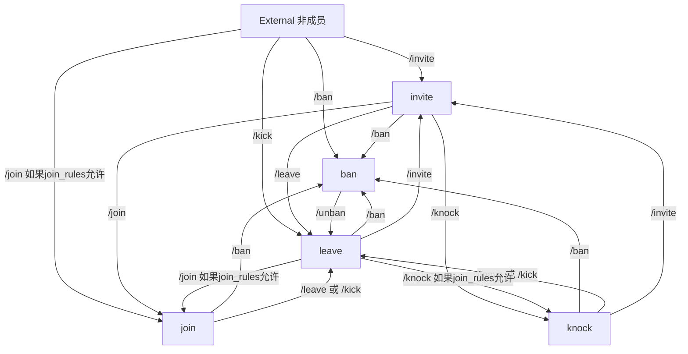
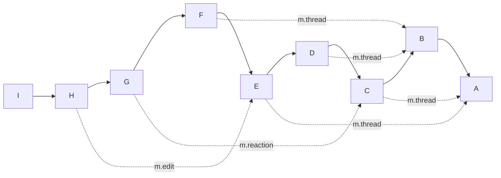
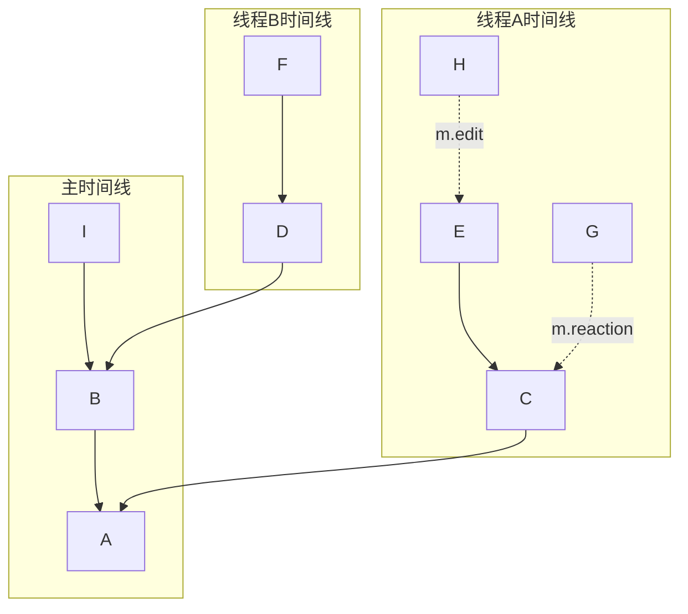

# 客户端-服务器 API

客户端-服务器 API 允许客户端发送消息、控制房间和同步会话历史。其设计既支持不存储状态并按需从服务器延迟加载数据的轻量级客户端，也支持维护服务器状态完整本地持久副本的重量级客户端。

# API 标准[](https://spec.matrix.org/v1.11/client-server-api/#api-standards)

Matrix 中客户端-服务器通信的基础要求是通过 HTTP APIs 交换 JSON 对象。未来可能会指定更高效的传输方式作为可选扩展。

建议使用 HTTPS 进行通信。不建议在测试环境之外使用普通 HTTP。

客户端通过不透明的 `access_token` 字符串进行认证（详情参见[客户端认证](https://spec.matrix.org/v1.11/client-server-api/#client-authentication)）。

所有的 `POST` 和 `PUT` 终端，除了以下列出的那些，要求客户端提供一个包含（可能为空的）JSON 对象的请求体。对于所有有 JSON 体的请求，客户端应提供 `Content-Type` 为 `application/json` 的头，但这不是必须的。

例外情况包括：

- [`POST /_matrix/media/v3/upload`](https://spec.matrix.org/v1.11/client-server-api/#post_matrixmediav3upload) 和 [`PUT /_matrix/media/v3/upload/{serverName}/{mediaId}`](https://spec.matrix.org/v1.11/client-server-api/#put_matrixmediav3uploadservernamemediaid)，这两者将上传的媒体作为请求体。
- [`POST /_matrix/client/v3/logout`](https://spec.matrix.org/v1.11/client-server-api/#post_matrixclientv3logout) 和 [`POST /_matrix/client/v3/logout/all`](https://spec.matrix.org/v1.11/client-server-api/#post_matrixclientv3logoutall)，其请求体为空。

类似地，所有终端要求服务器返回一个 JSON 对象，除了在[内容库模块](https://spec.matrix.org/v1.11/client-server-api/#content-repository)中的媒体下载终端对于 200 响应时的情况。对于所有 JSON 响应，服务器必须包括一个 `Content-Type` 为 `application/json` 的头。

在请求或响应中的所有 JSON 数据，必须使用 UTF-8 编码。

详情参见附录中的[Matrix API 的约定](https://spec.matrix.org/v1.11/appendices#conventions-for-matrix-apis)，以及下面的[Web 浏览器客户端](https://spec.matrix.org/v1.11/client-server-api/#web-browser-clients)部分，了解服务器响应的附加要求。

## 标准错误响应[](https://spec.matrix.org/v1.11/client-server-api/#standard-error-response)

在 Matrix API 层发生的任何错误必须返回“标准错误响应”。这是一个 JSON 对象，如下所示：

```json
{
  "errcode": "<错误代码>",
  "error": "<错误信息>"
}
```

`error` 字符串是一个可读的错误信息，通常是一句话解释出了什么问题。

`errcode` 字符串是一个唯一的字符串，可以用来处理错误信息，例如 `M_FORBIDDEN`。错误代码应首先使用全大写字母表明其命名空间，后跟一个单一的 `_`。例如，如果有一个自定义命名空间 `com.mydomain.here` 和一个 `FORBIDDEN` 代码，则错误代码应为 `COM.MYDOMAIN.HERE_FORBIDDEN`。本规格定义的错误代码应以 `M_` 开头。

一些 `errcode` 定义了错误响应对象中还应该有的附加键，但键 `error` 和 `errcode` 必须始终存在。

错误通常最好通过其错误代码而非返回的 HTTP 状态码来表达。当遇到错误代码 `M_UNKNOWN` 时，客户端应优先选择 HTTP 状态码作为更可靠的参考以判断问题所在。例如，如果客户端收到错误代码 `M_NOT_FOUND` 但请求给出 400 错误请求状态码，客户端应将错误视为找不到资源。然而，如果客户端收到一个错误代码 `M_UNKNOWN` 和一个 400 错误请求，客户端应假定发生的请求无效。

### 常见错误代码[](https://spec.matrix.org/v1.11/client-server-api/#common-error-codes)

这些错误代码可以由任何 API 终端返回：

`M_FORBIDDEN` 禁止访问，例如未经许可加入房间，登录失败。

`M_UNKNOWN_TOKEN` 指定的访问或刷新令牌未被识别。

可能在 401 HTTP 状态码的响应中出现一个附加响应参数 `soft_logout`。详见[软登出部分](https://spec.matrix.org/v1.11/client-server-api/#soft-logout)。

`M_MISSING_TOKEN` 请求未指定访问令牌。

`M_BAD_JSON` 请求包含有效的 JSON，但格式有误，例如缺少必需的键，键的值无效。

`M_NOT_JSON` 请求未包含有效的 JSON。

`M_NOT_FOUND` 未找到该请求的任何资源。

`M_LIMIT_EXCEEDED` 在短时间内发送了太多请求。稍后再尝试。详见[速率限制](https://spec.matrix.org/v1.11/client-server-api/#rate-limiting)。

`M_UNRECOGNIZED` 服务器未理解请求。这种情况通常与 HTTP 状态码 404 一起返回，如果未实现端点，或与 HTTP 状态码 405 一起返回，如果实现了端点但使用了不正确的 HTTP 方法。

`M_UNKNOWN` 发生未知错误。

### 其他错误代码[](https://spec.matrix.org/v1.11/client-server-api/#other-error-codes)

以下错误代码特定于某些端点。

`M_UNAUTHORIZED` 请求未经正确授权。通常由于登录失败。

`M_USER_DEACTIVATED` 与请求关联的用户 ID 已被停用。通常用于验证身份的终端，如 `/login`。

`M_USER_IN_USE` 尝试注册已被占用的用户 ID 时遇到。

`M_INVALID_USERNAME` 尝试注册无效的用户 ID 时遇到。

`M_ROOM_IN_USE` 当 `createRoom` API 给定的房间别名已在使用时发送。

`M_INVALID_ROOM_STATE` 当 `createRoom` API 的初始状态无效时发送。

`M_THREEPID_IN_USE` 当一个 API 提供的 third-party identifier 无法使用因为相同的 third-party identifier 已在使用时发送。

`M_THREEPID_NOT_FOUND` 当一个 API 提供的 third-party identifier 无法使用因为找不到匹配的 third-party identifier 记录时发送。

`M_THREEPID_AUTH_FAILED` 无法在 third-party identifier 上执行认证。

`M_THREEPID_DENIED` 服务器不允许此 third-party identifier。如果服务器只允许特定域的电子邮件地址，这种情况可能发生。

`M_SERVER_NOT_TRUSTED` 客户端的请求用了该服务器不信任的第三方服务器，例如身份服务器。

`M_UNSUPPORTED_ROOM_VERSION` 客户端请求创建了服务器不支持的房间版本。

`M_INCOMPATIBLE_ROOM_VERSION` 客户端尝试加入服务器不支持版本的房间。检查错误响应中的 `room_version` 属性以获取房间的版本。

`M_BAD_STATE` 无法执行请求的状态更改，例如尝试解封未被封禁的用户。

`M_GUEST_ACCESS_FORBIDDEN` 房间或资源不允许访客访问。

`M_CAPTCHA_NEEDED` 请求需要验证码以完成。

`M_CAPTCHA_INVALID` 提供的验证码与预期不符。

`M_MISSING_PARAM` 请求中缺少必需的参数。

`M_INVALID_PARAM` 指定的参数值不正确。例如，服务器期望为整数，但收到字符串。

`M_TOO_LARGE` 请求或实体过大。

`M_EXCLUSIVE` 请求的资源被应用服务保留，或者进行请求的应用服务尚未创建该资源。

`M_RESOURCE_LIMIT_EXCEEDED` 因为家庭服务器达到对其设定的资源限制而无法完成请求。例如，共享托管环境中的家庭服务器可能会达到资源限制，如果开始使用过多的内存或磁盘空间，错误必须有一个 `admin_contact` 字段，为收到错误的用户提供一个联系点。通常，这个错误会出现在尝试修改状态的路线上（例如：发送消息、帐户数据等），而不是仅仅读取状态的路线上（例如：`/sync`、获取帐户数据等）。

`M_CANNOT_LEAVE_SERVER_NOTICE_ROOM` 用户无法拒绝加入服务器公告房间的邀请。详情见[服务器公告](https://spec.matrix.org/v1.11/client-server-api/#server-notices)模块。

### 速率限制[](https://spec.matrix.org/v1.11/client-server-api/#rate-limiting)

家庭服务器应该实现速率限制以降低过载的风险。如果由于速率限制而拒绝请求，应该返回如下形式的标准错误响应：

```json
{
  "errcode": "<错误代码>",
  "error": "<错误信息>"
}
```

家庭服务器应该为任何具有 429 状态代码的响应包括一个 [`Retry-After`](https://www.rfc-editor.org/rfc/rfc9110#field.retry-after) 头。

可以包含 `retry_after_ms` 属性，以毫秒为单位告诉客户端它们需要等待多长时间才能重试。这个属性已被弃用，推荐使用 `Retry-After` 头。

**[在 `v1.10` 中更改]**: `retry_after_ms` 属性已被弃用，推荐使用 `Retry-After` 头。

## 事务标识符[](https://spec.matrix.org/v1.11/client-server-api/#transaction-identifiers)

客户端-服务器 API 通常使用 `HTTP PUT` 提交请求，HTTP 路径中包含客户端生成的事务标识符。

事务 ID 的目的是让家庭服务器能够区分新的请求和先前请求的重传，以便使请求具有幂等性。

事务 ID 应**仅**用于此目的。

从客户端的角度来看，请求完成后，下一次请求的 `{txnId}` 值应该被更改（具体如何不作规定；建议使用单调增加的整数）。

家庭服务器应识别出交易 ID 相同且 HTTP 请求路径相同时为重传请求。

如果识别出重传，家庭服务器应返回与原始请求相同的 HTTP 响应代码和内容。例如，`PUT /_matrix/client/v3/rooms/{roomId}/send/{eventType}/{txnId}` 会返回一个带原始请求 `event_id` 的 `200 OK` 响应体。

事务 ID 的范围是单个[设备](https://spec.matrix.org/v1.11/index.html#devices)和单个 HTTP 终端。换句话说：单个设备可以对 [`PUT /_matrix/client/v3/rooms/{roomId}/send/{eventType}/{txnId}`](https://spec.matrix.org/v1.11/client-server-api/#put_matrixclientv3roomsroomidsendeventtypetxnid) 和 [`PUT /_matrix/client/v3/sendToDevice/{eventType}/{txnId}`](https://spec.matrix.org/v1.11/client-server-api/#put_matrixclientv3sendtodeviceeventtypetxnid) 使用相同的交易 ID，可以视为不同请求，因为这两个被视为不同的终端。同样，如果客户端在两次请求之间注销并重新登录，使用相同的交易 ID，请求被视为不同的，因为登录和注销创建了新设备（除非将现有的 `device_id` 传递给 [`POST /_matrix/client/v3/login`](https://spec.matrix.org/v1.11/client-server-api/#post_matrixclientv3login)）。另一方面，如果客户端在[刷新](https://spec.matrix.org/v1.11/client-server-api/#refreshing-access-tokens)访问令牌后对同一终端重新使用交易 ID，会被假定为重复请求并忽略。详情见[访问令牌与设备之间的关系](https://spec.matrix.org/v1.11/client-server-api/#relationship-between-access-tokens-and-devices)。

有些 API 终端可能允许或要求在没有事务 ID 的情况下使用 `POST` 请求。在可以选择的情况下，强烈建议使用 `PUT` 请求。

> [!info] 理由:
> 在 `v1.7` 之前，事务 ID 是针对“客户端会话”而不是设备的。

# Web 浏览器客户端[](https://spec.matrix.org/v1.11/client-server-api/#web-browser-clients)

预期某些客户端将被编写为在网页浏览器或类似环境中运行。在这些情况下，家庭服务器应响应预检请求并在所有请求中提供跨源资源共享（CORS）头。

服务器必须预期客户端将使用 `OPTIONS` 请求与之交流，让客户端发现 CORS 头。本规格中的所有终端都支持 `OPTIONS` 方法，但是服务器在收到 `OPTIONS` 请求时不能执行终端定义的逻辑。

当客户端以请求和服务器通信时，服务器应该返回该路由的 CORS 头。服务器在所有请求中建议返回的 CORS 头为：

```
Access-Control-Allow-Origin: *
Access-Control-Allow-Methods: GET, POST, PUT, DELETE, OPTIONS
Access-Control-Allow-Headers: X-Requested-With, Content-Type, Authorization
```

# 服务器发现[](https://spec.matrix.org/v1.11/client-server-api/#server-discovery)

为了允许用户在不明确指定家庭服务器 URL 或其他参数的情况下连接到 Matrix 服务器，客户端应使用自动发现机制，根据用户的 Matrix ID 确定服务器 URL。自动发现仅应在登录时进行。

在本节中，以下术语具有特定含义：

`PROMPT` 以适合现有客户端用户体验的方式从用户那里检索特定信息，如果客户端倾向于这样做。在未能提供良好的用户体验的情况下可能停止。

`IGNORE` 停止当前的自动发现机制。如果没有其他自动发现机制可用，客户端可以使用其他方法来确定所需参数，例如提示用户或使用默认值。

`FAIL_PROMPT` 向用户告知由于数据无效/空白导致自动发现失败，并为参数 `PROMPT`。

`FAIL_ERROR` 向用户告知自动发现未返回任何可用的 URL。不要继续当前登录过程。此时，获得了有效数据，但没有服务器可供为客户端服务。不要进行进一步猜测，用户应做出充分考虑的决定进行下一步。

## Well-known URI[](https://spec.matrix.org/v1.11/client-server-api/#well-known-uri)

> [!info] 信息:
> 托管 `.well-known` JSON 文件的服务器应根据本规格中的[CORS](https://spec.matrix.org/v1.11/client-server-api/#web-browser-clients)部分提供 CORS 头。

`.well-known` 方法使用预定位置的 JSON 文件指定参数值。此方法的流程如下：

1. 根据用户的 Matrix ID 提取[服务器名称](https://spec.matrix.org/v1.11/appendices/#server-name)，通过在 Matrix ID 的第一个冒号处拆分。
2. 如[语法](https://spec.matrix.org/v1.11/appendices/#server-name)所述，从服务器名称中提取主机名。
3. 发起一个 GET 请求到 `https://hostname/.well-known/matrix/client`。
    1. 如果返回的状态码是 404，则 `IGNORE`。
    2. 如果返回的状态码不是 200，或者响应体为空，则 `FAIL_PROMPT`。
    3. 将响应体解析为一个 JSON 对象
        1. 如果无法解析内容，则 `FAIL_PROMPT`。
    4. 从 `m.homeserver` 属性中提取 `base_url` 值。此值用作家庭服务器的基本 URL。
        1. 如果未提供此值，则 `FAIL_PROMPT`。
    5. 验证家庭服务器基本 URL：
        1. 将其解析为一个 URL。如果不是 URL，则 `FAIL_ERROR`。
        2. 客户端应验证 URL 指向一个有效的家庭服务器，通过连接到 [`/_matrix/client/versions`](https://spec.matrix.org/v1.11/client-server-api/#get_matrixclientversions) 终端，确保它不返回错误，并解析和验证数据符合预期的响应格式。如果验证任一步失败，则 `FAIL_ERROR`。验证是配置错误的简单检查，以确保发现的地址指向有效的家庭服务器。
        3. 注意 `base_url` 值可能包括一个尾随 `/`。使用方应准备处理这两种情况。
    6. 如果存在 `m.identity_server` 属性，从中提取 `base_url` 值，以便用作身份服务器的基本 URL。这个 URL 的验证如同上面的步骤，使用 `/_matrix/identity/v2` 作为连接的终端。如果存在 `m.identity_server` 属性但没有 `base_url` 值，则 `FAIL_PROMPT`。

### GET /.well-known/matrix/client[](https://spec.matrix.org/v1.11/client-server-api/#getwell-knownmatrixclient)

---

获取有关域的发现信息。该文件可能包括其他键，必须遵循 Java 包命名约定，例如 `com.example.myapp.property`。这确保了每个应用程序的属性名称适当地命名空间化，减少冲突的风险。

请注意，此终端不一定由家庭服务器处理，而是由用于发现家庭服务器 URL 的另一个网络服务器处理。

|   |   |
|---|---|
|是否速率限制:|否|
|需要认证:|否|

---

#### 请求

无请求参数或请求体。

---

#### 响应

|状态|描述|
|---|---|
|`200`|服务器发现信息。|
|`404`|无服务器发现信息可用。|

###### 200 响应

|发现信息| |
|---|---|---|
|名称|类型|描述|
|---|---|---|
|`m.homeserver`|[家庭服务器信息](https://spec.matrix.org/v1.11/client-server-api/#getwell-knownmatrixclient_response-200_homeserver-information)|**必需:** 用于客户端发现家庭服务器信息。|
|`m.identity_server`|[身份服务器信息](https://spec.matrix.org/v1.11/client-server-api/#getwell-knownmatrixclient_response-200_identity-server-information)|用于客户端发现身份服务器信息。|
|<其他属性>|`object`|使用 Java 包命名约定的应用程序依赖键。|

|家庭服务器信息| |
|---|---|---|
|名称|类型|描述|
|---|---|---|
|`base_url`|[URI](http://tools.ietf.org/html/rfc3986)|**必需:** 客户端-服务器连接的家庭服务器基本 URL。|

|身份服务器信息| |
|---|---|---|
|名称|类型|描述|
|---|---|---|
|`base_url`|[URI](http://tools.ietf.org/html/rfc3986)|**必需:** 客户端-服务器连接的身份服务器基本 URL。|

```json
{
  "m.homeserver": {
    "base_url": "https://matrix.example.com"
  },
  "m.identity_server": {
    "base_url": "https://identity.example.com"
  },
  "org.example.custom.property": {
    "app_url": "https://custom.app.example.org"
  }
}
```

### GET /_matrix/client/versions[](https://spec.matrix.org/v1.11/client-server-api/#get_matrixclientversions)

---

**在 `v1.10` 中更改:** 该端点在提供认证时可能表现不同。

获取服务器支持的规范版本。

值的形式为 `vX.Y` 或历史情况中的 `rX.Y.Z`。详情见[规范版本控制](https://spec.matrix.org/v1.11/#specification-versions)。

服务器可能另外通过 `unstable_features` 广告其支持的实验性功能。这些功能应具备命名空间，并且如果希望的话可以在其名称中包含版本信息。在这里列出的功能不是为了可选地切换 Matrix 规范的部分，仅用于广告支持尚未正式加入到规范中的功能。例如，正在提案过程中可能会出现在这里，最终当功能落入规范而服务器认定适当时将其从列表移除。服务器可以选择仅为某些用户启用某些功能，因此客户端应在请求中包含认证，以获取为当前登录用户可用的所有功能。如果未提供认证，服务器应仅返回对所有用户可用的功能。服务器可能希望在功能被发布到规范中后继续在此处广告，以便客户端有机会适当升级。此外，客户端应避免在其稳定发布版本中使用不稳定的功能。

|   |   |
|---|---|
|是否速率限制:|否|
|需要认证:|可选|

---

#### 请求

无请求参数或请求体。

---

#### 响应

|状态|描述|
|---|---|
|`200`|服务器支持的版本。|

###### 200 响应

|名称|类型|描述|
|---|---|---|
|`unstable_features`|`{string: boolean}`|服务器支持的实验性功能。未在此列出的功能，或缺乏此属性，表示不支持该功能。|
|`versions`|`[string]`|**必需:** 支持的版本。|

```json
{
  "unstable_features": {
    "org.example.my_feature": true
  },
  "versions": [
    "r0.0.1",
    "v1.1"
  ]
}
```

### 获取 /.well-known/matrix/support[](https://spec.matrix.org/v1.11/client-server-api/#getwell-knownmatrixsupport)

---

**在 `v1.10` 中添加**

获取域名的服务器管理员联系信息和支持页面。

类似于 [well-known 探索 URI](https://spec.matrix.org/v1.11/client-server-api/#well-known-uri)，这个地址应通过 GET 请求访问 `https://hostname/.well-known/matrix/support`，其中 `hostname` 是家庭服务器的主机名。

请注意，该端点不一定由家庭服务器处理。可能由另一个 Web 服务器提供服务，用于探索家庭服务器的支持信息。

|   |   |
|---|---|
|请求限速:|否|
|需要认证:|否|

---

#### 请求

没有请求参数或请求体。

---

#### 响应

|状态|描述|
|---|---|
|`200`|服务器支持信息。|
|`404`|没有可用的服务器支持信息。|

###### 200 响应

|名称|类型|描述|
|---|---|---|
|`contacts`|[[Contact](https://spec.matrix.org/v1.11/client-server-api/#getwell-knownmatrixsupport_response-200_contact)]|联系服务器管理员的方法。<br><br>至少需要有 `contacts` 或 `support_page` 其中之一。如果只设置了 `contacts`，则必须包含至少一个项目。|
|`support_page`|`string`|提供给用户的特定于家庭服务器的帮助页面的 URL，例如额外的登录/注册步骤。<br><br>至少需要有 `contacts` 或 `support_page` 其中之一。|

| 联系信息 |
|---|---|---|
|名称|类型|描述|
|---|---|---|
|`email_address`|`string`|联系管理员的电子邮件地址。<br><br>至少需要有 `matrix_id` 或 `email_address` 其中之一。|
|`matrix_id`|`string`|表示管理员的 [矩阵用户 ID](https://spec.matrix.org/v1.11/appendices/#user-identifiers)。<br><br>可以是注册在不同家庭服务器上的帐户，以便在家庭服务器宕机时能够联系管理员。<br><br>至少需要有 `matrix_id` 或 `email_address` 其中之一。|
|`role`|`string`|**必填：**<br><br>对联系方法用途的非正式描述。<br><br>`m.role.admin` 是所有查询的通用角色，而 `m.role.security` 用于敏感请求。<br><br>未指定的角色可以通过使用 [命名空间标识符](https://spec.matrix.org/v1.11/appendices/#common-namespaced-identifier-grammar)来使用。<br><br>来自: `[m.role.admin, m.role.security]`。|

```json
{
  "contacts": [
    {
      "email_address": "admin@example.org",
      "matrix_id": "@admin:example.org",
      "role": "m.role.admin"
    },
    {
      "email_address": "security@example.org",
      "role": "m.role.security"
    }
  ],
  "support_page": "https://example.org/support.html"
}
```

# 客户端认证[](https://spec.matrix.org/v1.11/client-server-api/#client-authentication)

大多数API端点要求用户通过提供先前获得的凭证（即访问令牌）来识别自己。访问令牌通常通过[登录](https://spec.matrix.org/v1.11/client-server-api/#login)或[注册](https://spec.matrix.org/v1.11/client-server-api/#account-registration-and-management)过程获得。访问令牌可能会过期；可以使用刷新令牌生成新的访问令牌。

> [!info] 信息：
> 本规范不强制规定访问令牌的特定格式。客户端应将其视为不透明的字节序列。服务器可以自由选择适当的格式。服务器实现者可能会考虑研究[macaroons](http://research.google.com/pubs/pub41892.html)。

## 使用访问令牌[](https://spec.matrix.org/v1.11/client-server-api/#using-access-tokens)

访问令牌可以通过请求头提供，使用认证持有者方案：`Authorization: Bearer TheTokenHere`。

客户端也可以通过查询字符串参数提供访问令牌：`access_token=TheTokenHere`。此方法已被弃用，以防止访问令牌在访问/HTTP日志中泄露，客户端不应使用。

家庭服务器必须支持这两种方法。

> [!info] 信息：
> **[在 `v1.11` 中更改]** 通过查询字符串参数发送访问令牌现已被弃用。

当凭证需要但缺失或无效时，HTTP调用将返回状态401和错误代码，分别为`M_MISSING_TOKEN`或`M_UNKNOWN_TOKEN`。请注意，`M_UNKNOWN_TOKEN`的错误代码可能意味着以下四种情况之一：

1. 访问令牌从未有效。
2. 访问令牌已被注销。
3. 访问令牌已被[软注销](https://spec.matrix.org/v1.11/client-server-api/#soft-logout)。
4. **[在 `v1.3` 中添加]** 访问令牌[需要刷新](https://spec.matrix.org/v1.11/client-server-api/#refreshing-access-tokens)。

当客户端收到`M_UNKNOWN_TOKEN`错误代码时，应：

- 尝试[刷新令牌](https://spec.matrix.org/v1.11/client-server-api/#refreshing-access-tokens)，如果它有刷新令牌；
- 如果[`soft_logout`](https://spec.matrix.org/v1.11/client-server-api/#soft-logout)设置为`true`，可以提供重新登录用户的选项，保留客户端的任何持久信息；
- 否则，视用户为已注销。

## 访问令牌与设备之间的关系[](https://spec.matrix.org/v1.11/client-server-api/#relationship-between-access-tokens-and-devices)

客户端[设备](https://spec.matrix.org/v1.11/index.html#devices)与访问令牌和刷新令牌密切相关。Matrix服务器应记录每个访问令牌和刷新令牌分配给哪个设备，以便能够正确处理后续请求。当使用刷新令牌生成新的访问令牌和刷新令牌时，新令牌现在绑定到与初始刷新令牌关联的设备。

默认情况下，[登录](https://spec.matrix.org/v1.11/client-server-api/#login)和[注册](https://spec.matrix.org/v1.11/client-server-api/#account-registration-and-management)过程会自动生成一个新的`device_id`。客户端也可以自由生成自己的`device_id`，或者在用户保持不变的情况下重用设备：无论哪种情况，客户端都应在请求体中传递`device_id`。如果客户端设置了`device_id`，服务器将使之前分配给该设备的任何访问和刷新令牌无效。

## 刷新访问令牌[](https://spec.matrix.org/v1.11/client-server-api/#refreshing-access-tokens)

**[在 `v1.3` 中添加]**

访问令牌可能在一段时间后过期。任何使用过期访问令牌的HTTP调用将返回错误代码`M_UNKNOWN_TOKEN`，最好带有`soft_logout: true`。当客户端收到此错误并且有刷新令牌时，应尝试通过调用[`/refresh`](https://spec.matrix.org/v1.11/client-server-api/#post_matrixclientv3refresh)刷新访问令牌。客户端也可以在任何时候刷新其访问令牌，即使它尚未过期。如果令牌刷新成功，客户端应使用新令牌进行未来请求，并可以使用新令牌重试先前失败的请求。当访问令牌被刷新时，可能会返回一个新的刷新令牌；如果给出了新的刷新令牌，旧的刷新令牌将被作废，当需要刷新访问令牌时应使用新的刷新令牌。

旧的刷新令牌在使用新的访问令牌或刷新令牌之前仍然有效，此时旧的刷新令牌被撤销。这确保了如果客户端未能接收或持久化新令牌，它将能够重复刷新操作。

如果令牌刷新失败且错误响应中包含`soft_logout: true`属性，则客户端可以将其视为[软注销](https://spec.matrix.org/v1.11/client-server-api/#soft-logout)并尝试通过重新登录获取新的访问令牌。如果错误响应不包含`soft_logout: true`属性，客户端应视用户为已注销。

不支持刷新令牌的客户端的处理由家庭服务器决定；客户端通过在[`/login`](https://spec.matrix.org/v1.11/client-server-api/#post_matrixclientv3login)和[`/register`](https://spec.matrix.org/v1.11/client-server-api/#post_matrixclientv3register)端点的请求体中包含`refresh_token: true`属性来表明其对刷新令牌的支持。例如，家庭服务器可能允许使用不过期的访问令牌，或者可能仍然让访问令牌过期，并依赖于不支持刷新的客户端的软注销行为。

## 软注销[](https://spec.matrix.org/v1.11/client-server-api/#soft-logout)

如果服务器要求重新认证才能继续，但不想使客户端的会话无效，则客户端可以处于“软注销”状态。服务器通过在`M_UNKNOWN_TOKEN`错误响应中包含`soft_logout: true`参数来指示客户端处于软注销状态；`soft_logout`参数默认为`false`。如果省略或为`false`，则意味着服务器已销毁会话，客户端不应重用它。也就是说，客户端持有的任何持久状态，如加密密钥和设备信息，不能重用，必须丢弃。如果`soft_logout`为`true`，客户端可以重用任何持久状态。

**[在 `v1.3` 中更改]** 收到此类响应的客户端可以尝试[刷新其访问令牌](https://spec.matrix.org/v1.11/client-server-api/#refreshing-access-tokens)，如果它有可用的刷新令牌。如果没有可用的刷新令牌，或者刷新失败且`soft_logout: true`，客户端可以通过向登录API指定其正在使用的设备ID来获取新的访问令牌。

## 用户交互式认证API[](https://spec.matrix.org/v1.11/client-server-api/#user-interactive-authentication-api)

### 概述[](https://spec.matrix.org/v1.11/client-server-api/#overview)

某些API端点需要与用户交互的认证。家庭服务器可以提供多种认证方式，如用户/密码认证、通过单点登录服务器（SSO）登录等。本规范不定义家庭服务器应如何授权其用户，而是定义了实现应遵循的标准接口，以便任何客户端都可以登录到任何家庭服务器。

该过程采用一个或多个“阶段”的形式。在每个阶段，客户端为给定的认证类型提交一组数据，并等待服务器的响应，该响应将是最终成功或请求执行额外阶段。此交换持续到最终成功。

对于每个端点，服务器提供一个或多个“流程”，客户端可以用来认证自己。每个流程由一系列阶段组成，如上所述。客户端可以自由选择其遵循的流程，但流程的阶段必须按顺序完成。不按顺序遵循流程必须导致HTTP 401响应，如下所述。当流程中的所有阶段完成时，认证完成，API调用成功。

### REST API中的用户交互式API[](https://spec.matrix.org/v1.11/client-server-api/#user-interactive-api-in-the-rest-api)

在本规范中描述的REST API中，认证通过客户端和服务器交换JSON字典来工作。服务器通过HTTP 401响应的主体指示其需要的认证数据，客户端通过`auth`请求参数提交该认证数据。

客户端应首先发出没有`auth`参数的请求。家庭服务器返回HTTP 401响应，带有JSON主体，如下所示：

```
HTTP/1.1 401 Unauthorized
Content-Type: application/json
```

```json
{
  "flows": [
    {
      "stages": [
        "example.type.foo",
        "example.type.bar"
      ]
    },
    {
      "stages": [
        "example.type.foo",
        "example.type.baz"
      ]
    }
  ],
  "params": {
    "example.type.baz": {
      "example_key": "foobar"
    }
  },
  "session": "xxxxxx"
}
```

除了`flows`，此对象还包含一些额外信息：

- `params`：此部分包含客户端需要知道的任何信息，以便使用给定类型的认证。对于每个呈现的认证类型，该类型可能作为此字典中的键存在。例如，可以在此处给出OAuth客户端ID的公共部分。
    
- `session`：这是一个会话标识符，客户端必须在后续尝试在同一API调用中认证时传回给家庭服务器。
    

然后，客户端选择一个流程并尝试完成第一个阶段。它通过重新提交相同的请求并在其提交的对象中添加一个`auth`键来完成此操作。此字典包含一个`type`键，其值是客户端尝试完成的认证类型的名称。它还必须包含一个`session`键，其值为家庭服务器提供的会话键（如果提供）。它还包含其他依赖于尝试的认证类型的键。例如，如果客户端尝试完成认证类型`example.type.foo`，它可能会提交如下内容：

```
POST /_matrix/client/v3/endpoint HTTP/1.1
Content-Type: application/json
```

```json
{
  "a_request_parameter": "something",
  "another_request_parameter": "something else",
  "auth": {
    "type": "example.type.foo",
    "session": "xxxxxx",
    "example_credential": "verypoorsharedsecret"
  }
}
```

如果家庭服务器认为认证尝试成功，但仍需完成更多阶段，它将返回HTTP状态401以及与未尝试认证时相同的对象，并添加`completed`键，该键是客户端已成功完成的认证类型的数组：

```
HTTP/1.1 401 Unauthorized
Content-Type: application/json
```

```json
{
  "completed": [
    "example.type.foo"
  ],
  "flows": [
    {
      "stages": [
        "example.type.foo",
        "example.type.bar"
      ]
    },
    {
      "stages": [
        "example.type.foo",
        "example.type.baz"
      ]
    }
  ],
  "params": {
    "example.type.baz": {
      "example_key": "foobar"
    }
  },
  "session": "xxxxxx"
}
```

个别阶段可能需要多个请求才能完成，在这种情况下，响应将如同请求未经认证一样，添加任何其他由认证类型定义的键。

如果家庭服务器决定某个阶段的尝试不成功，但客户端可以进行第二次尝试，它将返回与上述相同的HTTP状态401响应，并添加描述错误的标准`errcode`和`error`字段。例如：

```
HTTP/1.1 401 Unauthorized
Content-Type: application/json
```

```json
{
  "errcode": "M_FORBIDDEN",
  "error": "Invalid password",
  "completed": [
    "example.type.foo"
  ],
  "flows": [
    {
      "stages": [
        "example.type.foo",
        "example.type.bar"
      ]
    },
    {
      "stages": [
        "example.type.foo",
        "example.type.baz"
      ]
    }
  ],
  "params": {
    "example.type.baz": {
      "example_key": "foobar"
    }
  },
  "session": "xxxxxx"
}
```

如果请求因认证以外的原因失败，服务器将以标准格式返回错误消息。例如：

```
HTTP/1.1 400 Bad request
Content-Type: application/json
```

```json
{
  "errcode": "M_EXAMPLE_ERROR",
  "error": "Something was wrong"
}
```

如果客户端已完成流程的所有阶段，家庭服务器将执行API调用并正常返回结果。已完成的阶段不能由客户端重试，因此服务器必须返回401响应并附带已完成的阶段，或者如果客户端重试阶段时所有阶段已完成，则返回API调用的结果。

某些认证类型可以通过Matrix客户端以外的方式完成，例如，当用户点击电子邮件中的链接时，电子邮件确认可能会完成。在这种情况下，客户端重试请求时，auth字典中仅包含会话键。对此的响应将与客户端尝试正常完成认证状态时相同，即请求将完成或请求认证，已完成的认证类型在“completed”数组中的存在或缺失表示该阶段是否完成。

> [!info] 信息：
> 使用用户交互式认证的端点请求在没有认证的情况下永远不会成功。家庭服务器可以通过提供仅包含`m.login.dummy`认证类型的阶段来允许不需要认证的请求，但它们仍然必须对没有认证数据的请求给出401响应。

### 示例[](https://spec.matrix.org/v1.11/client-server-api/#example)

在高层次上，完成具有三个阶段的认证流程的API调用请求将类似于以下图示：

```
    _______________________
    |       Stage 0         |
    | No auth               |
    |  ___________________  |
    | |_Request_1_________| | <-- 返回“session”键，该键在整个过程中使用。
    |_______________________|
             |
             |
    _________V_____________
    |       Stage 1         |
    | type: "<auth type1>"  |
    |  ___________________  |
    | |_Request_1_________| |
    |_______________________|
             |
             |
    _________V_____________
    |       Stage 2         |
    | type: "<auth type2>"  |
    |  ___________________  |
    | |_Request_1_________| |
    |  ___________________  |
    | |_Request_2_________| |
    |  ___________________  |
    | |_Request_3_________| |
    |_______________________|
             |
             |
    _________V_____________
    |       Stage 3         |
    | type: "<auth type3>"  |
    |  ___________________  |
    | |_Request_1_________| | <-- 返回API响应
    |_______________________|
```

### 认证类型[](https://spec.matrix.org/v1.11/client-server-api/#authentication-types)

本规范定义了以下认证类型：

- `m.login.password`
- `m.login.recaptcha`
- `m.login.sso`
- `m.login.email.identity`
- `m.login.msisdn`
- `m.login.dummy`
- `m.login.registration_token`

#### 基于密码的认证[](https://spec.matrix.org/v1.11/client-server-api/#password-based)

|类型|描述|
|---|---|
|`m.login.password`|客户端提交标识符和秘密密码，均以明文发送。|

要使用此认证类型，客户端应提交如下的auth字典：

```json
{
  "type": "m.login.password",
  "identifier": {
    ...
  },
  "password": "<password>",
  "session": "<session ID>"
}
```

其中`identifier`属性是用户标识符对象，如[标识符类型](https://spec.matrix.org/v1.11/client-server-api/#identifier-types)中所述。

例如，要使用用户的Matrix ID进行认证，客户端应提交：

```json
{
  "type": "m.login.password",
  "identifier": {
    "type": "m.id.user",
    "user": "<user_id or user localpart>"
  },
  "password": "<password>",
  "session": "<session ID>"
}
```

或者，使用[`/account/3pid`](https://spec.matrix.org/v1.11/client-server-api/#get_matrixclientv3account3pid) API绑定到用户账户的3PID进行回复，而不是明确给出`user`，如下所示：

```json
{
  "type": "m.login.password",
  "identifier": {
    "type": "m.id.thirdparty",
    "medium": "<The medium of the third-party identifier.>",
    "address": "<The third-party address of the user>"
  },
  "password": "<password>",
  "session": "<session ID>"
}
```

如果家庭服务器不知道提供的3PID，家庭服务器必须响应403 Forbidden。

#### Google ReCaptcha[](https://spec.matrix.org/v1.11/client-server-api/#google-recaptcha)

|类型|描述|
|---|---|
|`m.login.recaptcha`|用户完成Google ReCaptcha 2.0挑战。|

要使用此认证类型，客户端应提交如下的auth字典：

```json
{
  "type": "m.login.recaptcha",
  "response": "<captcha response>",
  "session": "<session ID>"
}
```

#### 单点登录[](https://spec.matrix.org/v1.11/client-server-api/#single-sign-on)

|类型|描述|
|---|---|
|`m.login.sso`|通过外部单点登录提供商授权支持认证。|

希望使用SSO完成认证的客户端应使用[回退](https://spec.matrix.org/v1.11/client-server-api/#fallback)机制。有关更多信息，请参阅[用户交互式认证中的SSO](https://spec.matrix.org/v1.11/client-server-api/#sso-during-user-interactive-authentication)。

#### 基于电子邮件（身份/家庭服务器）[](https://spec.matrix.org/v1.11/client-server-api/#email-based-identity--homeserver)

|类型|描述|
|---|---|
|`m.login.email.identity`|通过授权身份服务器或家庭服务器支持的电子邮件地址进行认证。|

在提交此请求之前，客户端应与身份服务器（或家庭服务器）进行认证。认证后，应该将会话信息提交给家庭服务器。

要使用此认证类型，客户端应提交如下的auth字典：

```json
{
  "type": "m.login.email.identity",
  "threepid_creds": {
    "sid": "<identity server session id>",
    "client_secret": "<identity server client secret>",
    "id_server": "<url of identity server authed with, e.g. 'matrix.org:8090'>",
    "id_access_token": "<access token previously registered with the identity server>"
  },
  "session": "<session ID>"
}
```

请注意，如果`/requestToken`请求未包含它们，则`id_server`（因此`id_access_token`）是可选的。

#### 基于电话号码/MSISDN（身份/家庭服务器）[](https://spec.matrix.org/v1.11/client-server-api/#phone-numbermsisdn-based-identity--homeserver)

|类型|描述|
|---|---|
|`m.login.msisdn`|通过授权身份服务器或家庭服务器支持的电话号码进行认证。|

在提交此请求之前，客户端应与身份服务器（或家庭服务器）进行认证。认证后，应该将会话信息提交给家庭服务器。

要使用此认证类型，客户端应提交如下的auth字典：

```json
{
  "type": "m.login.msisdn",
  "threepid_creds": {
    "sid": "<identity server session id>",
    "client_secret": "<identity server client secret>",
    "id_server": "<url of identity server authed with, e.g. 'matrix.org:8090'>",
    "id_access_token": "<access token previously registered with the identity server>"
  },
  "session": "<session ID>"
}
```

请注意，如果`/requestToken`请求未包含它们，则`id_server`（因此`id_access_token`）是可选的。

#### 虚拟认证[](https://spec.matrix.org/v1.11/client-server-api/#dummy-auth)

|类型|描述|
|---|---|
|`m.login.dummy`|虚拟认证总是成功的，不需要额外的参数。|

虚拟认证的目的是允许服务器不需要任何形式的用户交互式认证即可执行请求。它还可以用于区分流程，否则一个流程将是另一个流程的子集。例如，如果服务器提供流程`m.login.recaptcha`和`m.login.recaptcha, m.login.email.identity`，并且客户端首先完成recaptcha阶段，则认证将成功完成前者流程，即使客户端打算随后完成电子邮件认证阶段。服务器可以改为发送流程`m.login.recaptcha, m.login.dummy`和`m.login.recaptcha, m.login.email.identity`来解决歧义。

要使用此认证类型，客户端应提交仅包含类型和会话的auth字典（如果提供）：

```json
{
  "type": "m.login.dummy",
  "session": "<session ID>"
}
```

#### 令牌认证注册[](https://spec.matrix.org/v1.11/client-server-api/#token-authenticated-registration)

**[在 `v1.2` 中添加]**

|类型|描述|
|---|---|
|`m.login.registration_token`|使用预共享令牌进行认证注册账户|

> [!info] 信息：
> `m.login.registration_token`认证类型仅在[`/register`](https://spec.matrix.org/v1.11/client-server-api/#post_matrixclientv3register)端点有效。

此认证类型为家庭服务器提供了允许注册到有限人群的能力，而不是提供完全开放的注册或完全关闭的注册（家庭服务器管理员创建和分发账户）。

此认证类型所需的令牌在Matrix之外共享，是使用[不透明标识符语法](https://spec.matrix.org/v1.11/appendices#opaque-identifiers)的一个不透明字符串，最大长度为64个字符。服务器可以在任何时间/有效期内保留任意数量的令牌。这种情况下可能是一个令牌限制为100次使用或在接下来的2小时内有效——令牌过期后，它们将无法再用于创建账户。

要使用此认证类型，客户端应提交仅包含类型、令牌和会话的auth字典：

```json
{
  "type": "m.login.registration_token",
  "token": "fBVFdqVE",
  "session": "<session ID>"
}
```

要在尝试使用令牌之前确定其是否有效，客户端可以使用下面定义的`/validity` API。该API不保证令牌在使用时仍然有效，但避免了用户在注册过程中发现其令牌已过期的情况。

##### GET /_matrix/client/v1/register/m.login.registration_token/validity[](https://spec.matrix.org/v1.11/client-server-api/#get_matrixclientv1registermloginregistration_tokenvalidity)

---

**在 `v1.2` 中添加**

查询服务器以确定给定的注册令牌在请求时是否仍然有效。这是一个时间点检查，令牌在使用时可能仍会过期。

服务器应确保对该端点进行速率限制以避免暴力攻击。

|   |   |
|---|---|
|速率限制：|是|
|需要认证：|否|

---

###### 请求

**请求参数**

|查询参数|
|---|---|---|
|名称|类型|描述|
|---|---|---|
|`token`|`string`|**必需：** 要检查有效性的令牌。|

---

###### 响应

|状态|描述|
|---|---|
|`200`|检查有结果。|
|`403`|家庭服务器不允许注册，因此所有令牌被视为无效。|
|`429`|此请求被速率限制。|

**200响应**

|名称|类型|描述|
|---|---|---|
|`valid`|`boolean`|**必需：** 如果令牌仍然有效，则为true，否则为false。如果令牌不是服务器识别的令牌，这也应为false。|

```json
{
  "valid": true
}
```

**403响应**

|错误|
|---|---|---|
|名称|类型|描述|
|---|---|---|
|`errcode`|`string`|**必需：** 错误代码。|
|`error`|`string`|人类可读的错误消息。|

```json
{
  "errcode": "M_FORBIDDEN",
  "error": "Registration is not enabled on this homeserver."
}
```

**429响应**

|速率限制错误|
|---|---|---|
|名称|类型|描述|
|---|---|---|
|`errcode`|`string`|**必需：** M_LIMIT_EXCEEDED错误代码|
|`error`|`string`|人类可读的错误消息。|
|`retry_after_ms`|`integer`|客户端在再次尝试请求之前应等待的时间（以毫秒为单位）。|

```json
{
  "errcode": "M_LIMIT_EXCEEDED",
  "error": "Too many requests",
  "retry_after_ms": 2000
}
```

#### 注册时的服务条款[](https://spec.matrix.org/v1.11/client-server-api/#terms-of-service-at-registration)

**[在 `v1.11` 中添加]**

|类型|描述|
|---|---|
|`m.login.terms`|认证要求用户接受一组政策文件。|

> [!info] 信息：
> `m.login.terms`认证类型仅在[`/register`](https://spec.matrix.org/v1.11/client-server-api/#post_matrixclientv3register)端点有效。

此认证类型用于当家庭服务器要求新用户接受给定的一组政策文件，如服务条款和隐私政策。可能有许多不同类型的文件，所有这些文件都是版本化的，并以（可能）多种语言呈现。

当服务器要求用户接受某些条款时，它通过返回401响应给`/register`请求，其中响应体包括`flows`列表中的`m.login.terms`，以及`params`对象中的`m.login.terms`属性具有[如下所示](https://spec.matrix.org/v1.11/client-server-api/#definition-mloginterms-params)的结构。

如果客户端遇到无效参数，注册应停止并向用户显示错误。

客户端应向用户展示一个复选框以接受每个政策，包括指向提供的URL的链接。一旦用户这样做，客户端提交一个仅包含`type`和`session`的auth字典，如下所示，以表明所有政策已被接受：

```json
{
  "type": "m.login.terms",
  "session": "<session ID>"
}
```

服务器应跟踪在注册期间向用户展示的文档版本（如果适用）。

**示例**

1. 客户端可能会提交如下的注册请求：
    
```
    POST /_matrix/client/v3/register
```
    
```json
{
  "username": "cheeky_monkey",
  "password": "ilovebananas"
}
```
    
2. 服务器要求用户在注册前接受一些服务条款，因此返回以下响应：
    
```
    HTTP/1.1 401 Unauthorized
    Content-Type: application/json
```
    
```json
{
  "flows": [
    {
      "stages": [
        "m.login.terms"
      ]
    }
  ],
  "params": {
    "m.login.terms": {
      "policies": {
        "terms_of_service": {
          "version": "1.2",
          "en": {
            "name": "Terms of Service",
            "url": "https://example.org/somewhere/terms-1.2-en.html"
          },
          "fr": {
            "name": "Conditions d'utilisation",
            "url": "https://example.org/somewhere/terms-1.2-fr.html"
          }
        }
      }
    }
  },
  "session": "kasgjaelkgj"
}
```
    
3. 客户端向用户展示文档列表，邀请他们接受政策。
    
4. 客户端重复注册请求，确认用户已接受文档：
    
```
    POST /_matrix/client/v3/register
```
    
```json
{
  "username": "cheeky_monkey",
  "password": "ilovebananas",
  "auth": {
    "type": "m.login.terms",
    "session": "kasgjaelkgj"
  }
}
```
    
5. 所有认证步骤现已完成，因此请求成功：
    
```
    HTTP/1.1 200 OK
    Content-Type: application/json
```
    
```json
{
  "access_token": "abc123",
  "device_id": "GHTYAJCE",
  "user_id": "@cheeky_monkey:matrix.org"
}
```
    

##### `m.login.terms`参数

---

用户交互式认证响应中`params`对象中的`m.login.terms`条目的模式。

|m.login.terms参数|
|---|---|---|
|名称|类型|描述|
|---|---|---|
|`policies`|{string: [政策定义](https://spec.matrix.org/v1.11/client-server-api/#definition-mloginterms-params_policy-definition)}|**必需：** 从“政策ID”到此政策文件当前定义的映射。政策ID是给定政策文件的唯一标识符，使用[不透明标识符语法](https://spec.matrix.org/v1.11/appendices/#opaque-identifiers)。|

|政策定义|
|---|---|---|
|名称|类型|描述|
|---|---|---|
|`version`|`string`|**必需：** 此政策文件的版本。这是为客户端提供的便利，使用[不透明标识符语法](https://spec.matrix.org/v1.11/appendices/#opaque-identifiers)。|
|<其他属性>|[政策翻译](https://spec.matrix.org/v1.11/client-server-api/#definition-mloginterms-params_policy-translation)|从语言代码到该语言中文档详细信息的映射。语言代码应按照[RFC 5646第2.2节](https://datatracker.ietf.org/doc/html/rfc5646#section-2.2)格式化，尽管某些实现可能使用下划线而不是破折号（例如，`en_US`而不是`en-US`）。|

|政策翻译|
|---|---|---|
|名称|类型|描述|
|---|---|---|
|`name`|`string`|**必需：** 此文档的名称，使用适当的语言。一个任意字符串，没有指定的最大长度。|
|`url`|`string`|**必需：** 指向此文档文本的链接，使用适当的语言。必须是具有`https://`或`http://`方案的有效URI。不安全的HTTP是不推荐的。|

###### 示例

```json
{
  "policies": {
    "privacy_policy": {
      "en": {
        "name": "Privacy Policy",
        "url": "https://example.org/somewhere/privacy-1.2-en.html"
      },
      "fr": {
        "name": "Politique de confidentialité",
        "url": "https://example.org/somewhere/privacy-1.2-fr.html"
      },
      "version": "1.2"
    },
    "terms_of_service": {
      "en": {
        "name": "Terms of Service",
        "url": "https://example.org/somewhere/terms-1.2-en.html"
      },
      "fr": {
        "name": "Conditions d'utilisation",
        "url": "https://example.org/somewhere/terms-1.2-fr.html"
      },
      "version": "1.2"
    }
  }
}
```

### 后备方案[](https://spec.matrix.org/v1.11/client-server-api/#fallback)

客户端不能期望能够知道如何处理每一种登录类型。如果客户端不知道如何处理给定的登录类型，它可以引导用户通过网页浏览器访问一个后备页面的网址，以便让用户在其网页浏览器中完成该登录步骤。它应该打开的网址是：

```
/_matrix/client/v3/auth/<auth type>/fallback/web?session=<session ID>
```

其中 `auth type` 是其尝试的阶段类型名，`session ID` 是由主服务器提供的会话ID。

这必须返回一个可以执行此认证阶段的HTML页面。当认证完成后，这个页面必须使用以下JavaScript：

```javascript
if (window.onAuthDone) {
    window.onAuthDone();
} else if (window.opener && window.opener.postMessage) {
    window.opener.postMessage("authDone", "*");
}
```

这允许客户端在一个嵌入的浏览器中安排定义全局函数 `onAuthDone`，或使用HTML5的[cross-document messaging](https://www.w3.org/TR/webmessaging/#web-messaging) API，来接收认证阶段完成的通知。

一旦客户端接收到认证阶段完成的通知，它应重新提交带有仅会话ID的认证字典的请求：

```json
{
  "session": "<session ID>"
}
```

#### 示例[](https://spec.matrix.org/v1.11/client-server-api/#example-1)

客户端网页应用可能使用以下JavaScript打开一个弹出窗口来处理未知的登录类型：

```javascript
/**
 * 参数:
 *     homeserverUrl: 主服务器的基本url (如 "https://matrix.org")
 *
 *     apiEndpoint: 正在使用的API端点 (如
 *        "/_matrix/client/v3/account/password")
 *
 *     loginType: 正在尝试的loginType (如 "m.login.recaptcha")
 *
 *     sessionID: 之前请求中由主服务器提供的会话ID
 *
 *     onComplete: 将在请求结果返回时调用的回调
 */
function unknownLoginType(homeserverUrl, apiEndpoint, loginType, sessionID, onComplete) {
    var popupWindow;

    var eventListener = function(ev) {
        // 检查这是来自正确地方的正确消息
        if (ev.data !== "authDone" || ev.origin !== homeserverUrl) {
            return;
        }

        // 关闭弹出窗口
        popupWindow.close();
        window.removeEventListener("message", eventListener);

        // 重做请求
        var requestBody = {
            auth: {
                session: sessionID,
            },
        };

        request({
            method:'POST', url:apiEndpoint, json:requestBody,
        }, onComplete);
    };

    window.addEventListener("message", eventListener);

    var url = homeserverUrl +
        "/_matrix/client/v3/auth/" +
        encodeURIComponent(loginType) +
        "/fallback/web?session=" +
        encodeURIComponent(sessionID);

   popupWindow = window.open(url);
}

```
### 标识符类型[](https://spec.matrix.org/v1.11/client-server-api/#identifier-types)

一些认证机制使用用户标识符对象来标识用户。用户标识符对象有一个 `type` 字段来指示所使用标识符的类型，并根据该类型，有其他字段提供识别用户所需的信息，如下所述。

本规范定义了以下标识符类型：

- `m.id.user`
- `m.id.thirdparty`
- `m.id.phone`

#### 矩阵用户ID[](https://spec.matrix.org/v1.11/client-server-api/#matrix-user-id)

| 类型 | 描述 |
|---|---|
|`m.id.user`|用户由其矩阵ID标识。|

客户端可以使用其矩阵ID标识用户。这可以是完全合格的矩阵用户ID，也可以只是用户ID的本地部分。

```
"identifier": {
  "type": "m.id.user",
  "user": "<user_id or user localpart>"
}
```

#### 第三方ID[](https://spec.matrix.org/v1.11/client-server-api/#third-party-id)

| 类型 | 描述 |
|---|---|
|`m.id.thirdparty`|用户由一个标准化形式的第三方标识符标识。|

客户端可以使用与用户账户关联的3PID识别用户, 该3PID之前是通过[`/account/3pid`](https://spec.matrix.org/v1.11/client-server-api/#get_matrixclientv3account3pid) API进行关联的。请参见[3PID类型](https://spec.matrix.org/v1.11/appendices#3pid-types)附录以获取第三方ID媒体列表。

```
"identifier": {
  "type": "m.id.thirdparty",
  "medium": "<The medium of the third-party identifier>",
  "address": "<The canonicalised third-party address of the user>"
}
```

#### 电话号码[](https://spec.matrix.org/v1.11/client-server-api/#phone-number)

| 类型 | 描述 |
|---|---|
|`m.id.phone`|用户由电话号码标识。|

客户端可以使用与用户账户关联的电话号码来识别用户，该电话号码之前是通过[`/account/3pid`](https://spec.matrix.org/v1.11/client-server-api/#get_matrixclientv3account3pid) API进行关联的。电话号码可以按用户输入的那样传递; 主服务器将负责标准化它。如果客户端希望标准化电话号码，则可以使用`m.id.thirdparty`标识符类型，并将`medium`设为`msisdn`。

```
"identifier": {
  "type": "m.id.phone",
  "country": "<The country that the phone number is from>",
  "phone": "<The phone number>"
}
```

`country` 是电话号码 `phone` 应视作从中拨打的国家的两位大写ISO-3166-1 alpha-2国家代码。

## 登录[](https://spec.matrix.org/v1.11/client-server-api/#login)

客户端可以使用`/login` API获取访问令牌。

注意，该端点当前不使用[用户交互认证API](https://spec.matrix.org/v1.11/client-server-api/#user-interactive-authentication-api)。

对于简单的用户名/密码登录，客户端应按如下提交`/login`请求：

```json
{
  "type": "m.login.password",
  "identifier": {
    "type": "m.id.user",
    "user": "<user_id or user localpart>"
  },
  "password": "<password>"
}
```

或者，客户端可以使用通过[`/account/3pid`](https://spec.matrix.org/v1.11/client-server-api/#get_matrixclientv3account3pid) API绑定到用户帐户的3PID代替显式提供`user`，如下：

```json
{
  "type": "m.login.password",
  "identifier": {
    "medium": "<The medium of the third-party identifier>",
    "address": "<The canonicalised third-party address of the user>"
  },
  "password": "<password>"
}
```

如果主服务器不知道所提供的3PID，主服务器必须回应`403禁止`。

使用登录令牌登录时，客户端应按如下提交`/login`请求：

```json
{
  "type": "m.login.token",
  "token": "<login token>"
}
```

`token` 必须编码用户ID，因为请求中没有其他标识数据。如果令牌无效，主服务器必须回应`403禁止`并附上错误代码`M_FORBIDDEN`。

如果主服务器提供`m.login.sso`作为可行流程，并且客户端支持它，客户端应将用户重定向到[通过SSO进行客户端登录](https://spec.matrix.org/v1.11/client-server-api/#client-login-via-sso)的`/redirect`端点。认证完成后，客户端需要提交与`m.login.token`匹配的`/login`请求。

在`v1.7`中添加的内容，已认证的客户端还可以为其用户ID生成令牌，如果主服务器支持，使用[`POST /login/get_token`](https://spec.matrix.org/v1.11/client-server-api/#post_matrixclientv1loginget_token)。

### GET /_matrix/client/v3/login[](https://spec.matrix.org/v1.11/client-server-api/#get_matrixclientv3login)

---

获取主服务器支持的登录类型以进行用户认证。客户端应选择其中一种并在登录时将其作为`type`提供。

|   |   |
|---|---|
|限速:|是|
|需要认证:|否|

---

#### 请求

无请求参数或请求体。

---

#### 响应

|状态|描述|
|---|---|
|`200`|主服务器支持的登录类型|
|`429`|该请求被限速。|

###### 200 响应

|名称|类型|描述|
|---|---|---|
|`flows`|[[登录流程](https://spec.matrix.org/v1.11/client-server-api/#get_matrixclientv3login_response-200_loginflow)]|主服务器支持的登录类型|

|登录流程|
|---|---|---|
|名称|类型|描述|
|---|---|---|
|`get_login_token`|`boolean`|如果`type`是`m.login.token`，一个可选字段，用于指示无认证客户端主服务器支持[`POST /login/get_token`](https://spec.matrix.org/v1.11/client-server-api/#post_matrixclientv1loginget_token)端点。注意，即使支持端点，也不一定意味着尝试登录的用户能够生成这样的令牌。<br><br>**在`v1.7`中添加**|
|`type`|`string`|**必填:** 登录类型。在登录时将作为`type`提供。|

```json
{
  "flows": [
    {
      "type": "m.login.password"
    },
    {
      "get_login_token": true,
      "type": "m.login.token"
    }
  ]
}
```

###### 429 响应

|限速错误|
|---|---|---|
|名称|类型|描述|
|---|---|---|
|`errcode`|`string`|**必填:** M_LIMIT_EXCEEDED 错误代码|
|`error`|`string`|一个人类可读的错误信息。|
|`retry_after_ms`|`integer`|客户端在再次尝试请求之前应等待的时间，以毫秒为单位。|

```json
{
  "errcode": "M_LIMIT_EXCEEDED",
  "error": "Too many requests",
  "retry_after_ms": 2000
}
```

### POST /_matrix/client/v3/login[](https://spec.matrix.org/v1.11/client-server-api/#post_matrixclientv3login)

---

认证用户，并发放他们可以用来在后续请求中进行授权的访问令牌。

如果客户端不提供`device_id`，服务器必须自动生成一个。

返回的访问令牌必须与客户端提供的或服务器生成的`device_id`关联。服务器可能会使以前与该设备关联的任何访问令牌失效。请参见[访问令牌与设备之间的关系](https://spec.matrix.org/v1.11/client-server-api/#relationship-between-access-tokens-and-devices)。

|   |   |
|---|---|
|限速:|是|
|需要认证:|否|

---

#### 请求

##### 请求体

|名称|类型|描述|
|---|---|---|
|`address`|`string`|用户的第三方标识符。建议使用`identifier`来代替。|
|`device_id`|`string`|客户端设备的ID。如果这与已知的客户端设备不匹配，将创建一个新设备。给定的设备ID不能与[cross-signing](https://spec.matrix.org/v1.11/client-server-api/#cross-signing)密钥ID相同。如果未指定，服务器将自动生成一个device_id。|
|`identifier`|[用户标识符](https://spec.matrix.org/v1.11/client-server-api/#post_matrixclientv3login_request_user-identifier)|用户的识别信息|
|`initial_device_display_name`|`string`|新创建设备的显示名称。如果`device_id`与已知设备对应，将被忽略。|
|`medium`|`string`|使用第三方标识符登录时，标识符的媒体。必须为'email'。建议使用`identifier`来代替。|
|`password`|`string`|当`type`为`m.login.password`时必需。用户的密码。|
|`refresh_token`|`boolean`|如果为true，客户端支持刷新令牌。<br><br>**在`v1.3`中添加**|
|`token`|`string`|当`type`是`m.login.token`时必需。令牌登录的一部分。|
|`type`|`string`|**必填:**<br><br>正在使用的登录类型。<br><br>这必须是[`GET /login`](https://spec.matrix.org/v1.11/client-server-api/#get_matrixclientv3login)端点响应的流程之一返回的类型，如`m.login.password`或`m.login.token`。|
|`user`|`string`|要登录的用户ID的完整限定名或本地部分。建议使用`identifier`来代替。|

|用户标识符|
|---|---|---|
|名称|类型|描述|
|---|---|---|
|`type`|`string`|**必填:** 识别的类型。有关支持的值和其他属性描述，请参见[标识符类型](https://spec.matrix.org/v1.11/client-server-api/#identifier-types)。|

##### 请求体示例

```json
{
  "identifier": {
    "type": "m.id.user",
    "user": "cheeky_monkey"
  },
  "initial_device_display_name": "Jungle Phone",
  "password": "ilovebananas",
  "type": "m.login.password"
}
```

---

#### 响应

|状态|描述|
|---|---|
|`200`|用户已被认证。|
|`400`|请求的一部分无效。例如，登录类型可能未被识别。|
|`403`|登录尝试失败。包括下列错误代码之一：<br><br>- `M_FORBIDDEN`: 提供的认证数据不正确或请求的设备ID与cross-signing密钥ID相同。<br>- `M_USER_DEACTIVATED`: 用户已被停用。|
|`429`|请求被限速。|

###### 200 响应

|名称|类型|描述|
|---|---|---|
|`access_token`|`string`|**必填:** 帐号的访问令牌。此访问令牌可用于授权其他请求。|
|`device_id`|`string`|**必填:** 已登录设备的ID。如果在请求中指定，将与相应参数相同。|
|`expires_in_ms`|`integer`|访问令牌的生命周期，单位为毫秒。一旦访问令牌过期，通过使用提供的刷新令牌可以获得新的访问令牌。如果没有提供刷新令牌，则客户端需要重新登录以获得新的访问令牌。如果未给出，客户端可以假定访问令牌不会过期。<br><br>**在`v1.3`中添加**|
|`home_server`|`string`|账号注册的主服务器的server_name。<br><br>**已弃用**。如果需要，客户端应从 `user_id`（通过第一个冒号分割）中提取server_name。注意，不采用这种拼写方式表示`homeserver`。|
|`refresh_token`|`string`|账号的刷新令牌。此令牌可用于在其过期时通过调用`/refresh`端点获取新的访问令牌。<br><br>**在`v1.3`中添加**|
|`user_id`|`string`|**必填:** 账号的完整限定矩阵ID。|
|`well_known`|[发现信息](https://spec.matrix.org/v1.11/client-server-api/#post_matrixclientv3login_response-200_discovery-information)|由服务器提供的可选客户端配置。如果出现，客户端应使用提供的对象重新配置自己，并可选择性验证其中的URL。此对象的格式与.well-known自动发现返回的对象相同。|

|发现信息|
|---|---|---|
|名称|类型|描述|
|---|---|---|
|`m.homeserver`|[主服务器信息](https://spec.matrix.org/v1.11/client-server-api/#post_matrixclientv3login_response-200_homeserver-information)|**必填:** 用于客户端发现主服务器信息。|
|`m.identity_server`|[身份服务器信息](https://spec.matrix.org/v1.11/client-server-api/#post_matrixclientv3login_response-200_identity-server-information)|用于客户端发现身份服务器信息。|
|<其他属性>|`object`|应用相关键使用Java包命名约定。|

|主服务器信息|
|---|---|---|
|名称|类型|描述|
|---|---|---|
|`base_url`|[URI](http://tools.ietf.org/html/rfc3986)|**必填:** 用于客户端-服务器连接的主服务器的基本URL。|

|身份服务器信息|
|---|---|---|
|名称|类型|描述|
|---|---|---|
|`base_url`|[URI](http://tools.ietf.org/html/rfc3986)|**必填:** 用于客户端-服务器连接的身份服务器的基本URL。|

```json
{
  "access_token": "abc123",
  "device_id": "GHTYAJCE",
  "expires_in_ms": 60000,
  "refresh_token": "def456",
  "user_id": "@cheeky_monkey:matrix.org",
  "well_known": {
    "m.homeserver": {
      "base_url": "https://example.org"
    },
    "m.identity_server": {
      "base_url": "https://id.example.org"
    }
  }
}
```

###### 400 响应

|错误|
|---|---|---|
|名称|类型|描述|
|---|---|---|
|`errcode`|`string`|**必填:** 一个错误代码。|
|`error`|`string`|一个人类可读的错误信息。|

```json
{
  "errcode": "M_UNKNOWN",
  "error": "Bad login type."
}
```

###### 403 响应

|错误|
|---|---|---|
|名称|类型|描述|
|---|---|---|
|`errcode`|`string`|**必填:** 一个错误代码。|
|`error`|`string`|一个人类可读的错误信息。|

```json
{
  "errcode": "M_FORBIDDEN"
}
```

###### 429 响应

|限速错误|
|---|---|---|
|名称|类型|描述|
|---|---|---|
|`errcode`|`string`|**必填:** M_LIMIT_EXCEEDED 错误代码|
|`error`|`string`|一个人类可读的错误信息。|
|`retry_after_ms`|`integer`|客户端在再次尝试请求之前应等待的时间，以毫秒为单位。|

```json
{
  "errcode": "M_LIMIT_EXCEEDED",
  "error": "Too many requests",
  "retry_after_ms": 2000
}
```

### POST /_matrix/client/v1/login/get_token[](https://spec.matrix.org/v1.11/client-server-api/#post_matrixclientv1loginget_token)

---

**在`v1.7`中添加**

可选端点 - 如果服务器不打算使用或者支持此功能，则不需要实现此端点。

此API端点使用[用户交互认证API](https://spec.matrix.org/v1.11/client-server-api/#user-interactive-authentication-api)。

已认证的客户端可以调用此端点为一个未认证的客户端生成一个一次性、时限的令牌来登录，成为调用此端点的相同用户。未认证的客户端使用生成的令牌在主服务器中执行一个`m.login.token`登录流程。

客户端，已认证和未认证的，可能希望隐藏暴露此功能的用户界面，如果服务器没有提供此功能的话。已认证的客户端可以使用[`POST /login/get_token`](https://spec.matrix.org/v1.11/client-server-api/#post_matrixclientv1loginget_token)端点上的`m.get_login_token`[能力](https://spec.matrix.org/v1.11/client-server-api/#capabilities-negotiation)来按用户核查支持情况，未认证的客户端可以通过在[`GET /login`](https://spec.matrix.org/v1.11/client-server-api/#post_matrixclientv3login)中查找包含`get_login_token: true`的`m.login.token`登录流程来检测服务器支持。

在规范的v1.7版本中，生成的令牌传输到未认证客户端是作为实现细节留出的。未来的MSC（如[MSC3906](https://github.com/matrix-org/matrix-spec-proposals/pull/3906)）可能会将令牌在客户端之间传输的方法标准化。

生成的令牌必须仅对一次登录有效，由服务器强制执行。计划登录多台设备的客户端必须为每台生成一个令牌。

对于其他支持用户交互认证（UIA）的端点，服务器有时不会在会话最近通过UIA时重新提示验证。对于此端点，服务器必须始终重新提示用户验证以确保获得对每个附加客户端的明确同意。

服务器被鼓励对此端点应用比平常更严格的限速，如每分钟最多1个请求。

|   |   |
|---|---|
|限速:|是|
|需要认证:|是|

---

#### 请求

##### 请求体

|名称|类型|描述|
|---|---|---|
|`auth`|[认证数据](https://spec.matrix.org/v1.11/client-server-api/#post_matrixclientv1loginget_token_request_authentication-data)|用户交互认证API的附加认证信息。|

|认证数据|
|---|---|---|
|名称|类型|描述|
|---|---|---|
|`session`|`string`|由主服务器给出的会话键值。|
|`type`|`string`|客户端尝试完成的认证类型。如果提供了 `session` 并且客户端认为已经通过带外（例如通过[后备机制](https://spec.matrix.org/v1.11/client-server-api/#fallback)）完成了请求，则可以省略。|
|<其他属性>||键取决于登录类型|

##### 请求体示例

```json
{
  "auth": {
    "example_credential": "verypoorsharedsecret",
    "session": "xxxxx",
    "type": "example.type.foo"
  }
}
```

---

#### 响应

|状态|描述|
|---|---|
|`200`|未认证的客户端可以用来登录为请求用户的登录令牌。|
|`400`|请求格式错误，或者用户没有生成设备令牌的能力，正如[用户交互认证API](https://spec.matrix.org/v1.11/client-server-api/#user-interactive-authentication-api)所暗示的那样。<br><br>客户端应通过`m.get_login_token`[能力](https://spec.matrix.org/v1.11/client-server-api/#capabilities-negotiation)验证用户是否可以调用此端点。|
|`401`|主服务器需要更多认证信息。|
|`429`|请求被限速。|

###### 200 响应

|名称|类型|描述|
|---|---|---|
|`expires_in_ms`|`integer`|**必填:** 主服务器不再接受令牌之前的剩余时间，以毫秒为单位。默认建议为`120000`（2分钟）。|
|`login_token`|`string`|**必填:** `m.login.token` 登录流程的登录令牌。|

```json
{
  "expires_in_ms": 120000,
  "login_token": "<opaque string>"
}
```

###### 400 响应

|错误|
|---|---|---|
|名称|类型|描述|
|---|---|---|
|`errcode`|`string`|**必填:** 一个错误代码。|
|`error`|`string`|一个人类可读的错误信息。|

```json
{
  "errcode": "M_UNKNOWN",
  "error": "An unknown error occurred"
}
```

###### 401 响应

|认证响应|
|---|---|---|
|名称|类型|描述|
|---|---|---|
|`completed`|`[string]`|客户端已成功完成的阶段列表|
|`flows`|[[流程信息](https://spec.matrix.org/v1.11/client-server-api/#post_matrixclientv1loginget_token_response-401_flow-information)]|**必填:** 服务器为此API支持的登录流程列表。|
|`params`|`{string: object}`|包含客户端使用给定类型的认证所需的一切信息。每个提供的登录类型，该类型可能作为此字典中的一个键出现。例如，OAuth客户端ID的公开部分可能在这里提供。|
|`session`|`string`|如果提供，则为客户端在后续尝试在相同API调用中进行认证时必须传回至主服务器的会话标识符。|

|流程信息|
|---|---|---|
|名称|类型|描述|
|---|---|---|
|`stages`|`[string]`|**必填:** 完成此认证流程所需的每个阶段的登录类型|

```json
{
  "completed": [
    "example.type.foo"
  ],
  "flows": [
    {
      "stages": [
        "example.type.foo"
      ]
    }
  ],
  "params": {
    "example.type.baz": {
      "example_key": "foobar"
    }
  },
  "session": "xxxxxxyz"
}
```

###### 429 响应

|限速错误|
|---|---|---|
|名称|类型|描述|
|---|---|---|
|`errcode`|`string`|**必填:** M_LIMIT_EXCEEDED 错误代码|
|`error`|`string`|一个人类可读的错误信息。|
|`retry_after_ms`|`integer`|客户端在再次尝试请求之前应等待的时间，以毫秒为单位。|

```json
{
  "errcode": "M_LIMIT_EXCEEDED",
  "error": "Too many requests",
  "retry_after_ms": 2000
}
```

### POST /_matrix/client/v3/refresh[](https://spec.matrix.org/v1.11/client-server-api/#post_matrixclientv3refresh)

---

**已添加于 `v1.3`**

刷新访问令牌。客户端应在进行后续API调用时使用返回的访问令牌，并存储返回的刷新令牌（如果提供），以便在必要时刷新新的访问令牌。

在访问令牌被刷新后，服务器可以选择立即使旧的访问令牌失效，或者选择不失效，例如如果访问令牌很快就要过期。客户端不应假设旧的访问令牌仍然有效，应该使用新提供的访问令牌。

旧的刷新令牌在新的访问令牌或刷新令牌使用之前保持有效，一旦使用，旧的刷新令牌将被撤销。

注意，该端点不需要通过访问令牌进行身份验证。身份验证是通过刷新令牌提供的。

应用程序服务身份断言在此端点被禁用。

|   |   |
|---|---|
|速率限制:|是|
|需要身份验证:|否|

---

#### 请求

##### 请求体

|名称|类型|描述|
|---|---|---|
|`refresh_token`|`string`|**必需:** 刷新令牌|

##### 请求体示例

```json
{
  "refresh_token": "some_token"
}
```

---

#### 响应

|状态|描述|
|---|---|
|`200`|生成了新的访问令牌和刷新令牌。|
|`401`|提供的令牌未知或已被使用。|
|`429`|请求被速率限制。|

###### 200响应

|名称|类型|描述|
|---|---|---|
|`access_token`|`string`|**必需:** 新的访问令牌。|
|`expires_in_ms`|`integer`|访问令牌的有效期，以毫秒为单位。如果未给出，客户端可以假设访问令牌不会过期。|
|`refresh_token`|`string`|当需要再次刷新访问令牌时使用的新刷新令牌。如果没有提供，可以重复使用旧的刷新令牌。|

```json
{
  "access_token": "a_new_token",
  "expires_in_ms": 60000,
  "refresh_token": "another_new_token"
}
```

###### 401响应

|错误|
|---|---|---|
|名称|类型|描述|
|---|---|---|
|`errcode`|`string`|**必需:** 一个错误码。|
|`error`|`string`|用户可读的错误信息。|

```json
{
  "errcode": "M_UNKNOWN_TOKEN",
  "error": "Soft logged out",
  "soft_logout": true
}
```

###### 429响应

|速率限制错误|
|---|---|---|
|名称|类型|描述|
|---|---|---|
|`errcode`|`string`|**必需:** M_LIMIT_EXCEEDED 错误代码|
|`error`|`string`|用户可读的错误信息。|
|`retry_after_ms`|`integer`|客户端在再次尝试请求前应等待的时间，以毫秒为单位。|

```json
{
  "errcode": "M_LIMIT_EXCEEDED",
  "error": "Too many requests",
  "retry_after_ms": 2000
}
```

### POST /_matrix/client/v3/logout[](https://spec.matrix.org/v1.11/client-server-api/#post_matrixclientv3logout)

---

使现有的访问令牌失效，以便不再用于授权。与访问令牌相关联的设备也将被删除。设备的[设备密钥](https://spec.matrix.org/v1.11/client-server-api/#device-keys)也会随设备一起删除。

|   |   |
|---|---|
|速率限制：|否|
|需要认证：|是|

---

#### 请求

无请求参数或请求体。

---

#### 响应

|状态|描述|
|---|---|
|`200`|请求中使用的访问令牌已成功失效。|

###### 200 响应

```json
{}
```

### POST /_matrix/client/v3/logout/all[](https://spec.matrix.org/v1.11/client-server-api/#post_matrixclientv3logoutall)

---

使用户的所有访问令牌失效，以便不再用于授权。这包括发出此请求的访问令牌。用户的所有设备也将被删除。设备的[设备密钥](https://spec.matrix.org/v1.11/client-server-api/#device-keys)也会随设备一起删除。

此端点不使用[用户交互认证 API](https://spec.matrix.org/v1.11/client-server-api/#user-interactive-authentication-api)，因为用户交互认证旨在防止攻击者获取单个访问令牌后接管账户。此端点使用户的所有访问令牌失效，包括请求中使用的令牌，因此攻击者无法通过这种方式接管账户。

|   |   |
|---|---|
|速率限制：|否|
|需要认证：|是|

---

#### 请求

无请求参数或请求体。

---

#### 响应

|状态|描述|
|---|---|
|`200`|用户的访问令牌已成功失效。|

###### 200 响应

```json
{}
```

### 应用服务登录[](https://spec.matrix.org/v1.11/client-server-api/#appservice-login)

**[在 `v1.2` 中添加]**

应用服务可以通过提供有效的应用服务令牌和应用服务命名空间内的用户来登录。

> [!info] 信息：
> 应用服务不需要在所有情况下以单个用户身份登录，因为它们可以使用应用服务令牌执行[身份声明](https://spec.matrix.org/v1.11/application-service-api#identity-assertion)。然而，如果应用服务需要单个用户的范围令牌，则可以使用此 API。

此请求必须通过[应用服务 `as_token`](https://spec.matrix.org/v1.11/application-service-api#registration)进行认证（有关如何提供令牌，请参阅[客户端认证](https://spec.matrix.org/v1.11/client-server-api/#client-authentication)）。

要使用此登录类型，客户端应提交如下的 `/login` 请求：

```json
{
  "type": "m.login.application_service",
  "identifier": {
    "type": "m.id.user",
    "user": "<user_id 或用户本地部分>"
  }
}
```

如果访问令牌无效、不对应于应用服务或用户未先前注册，则主服务器将响应 `M_FORBIDDEN` 错误代码。

如果访问令牌对应于应用服务，但用户 ID 不在其命名空间内，则主服务器将响应 `M_EXCLUSIVE` 错误代码。

### 登录回退[](https://spec.matrix.org/v1.11/client-server-api/#login-fallback)

如果客户端无法识别任何或所有登录流程，则可以使用回退登录 API：

```
GET /_matrix/static/client/login/
```

这将返回一个 HTML 和 JavaScript 页面，可以执行整个登录过程。页面将在登录成功完成时尝试调用 JavaScript 函数 `window.onLogin`。

**[在 `v1.1` 中添加]** `/login` 端点的非凭证参数可以作为查询字符串参数提供。它们将在登录过程中转发到登录端点。例如：

```
GET /_matrix/static/client/login/?device_id=GHTYAJCE
```

## 账户注册和管理[](https://spec.matrix.org/v1.11/client-server-api/#account-registration-and-management)

### POST /_matrix/client/v3/account/deactivate[](https://spec.matrix.org/v1.11/client-server-api/#post_matrixclientv3accountdeactivate)

---

停用用户的账户，移除用户再次登录的所有能力。

此 API 端点使用[用户交互认证 API](https://spec.matrix.org/v1.11/client-server-api/#user-interactive-authentication-api)。

如果客户端有活动会话，则应向此端点提交访问令牌。

主服务器可能会根据是否提供有效的访问令牌更改可用的流程。

与其他端点不同，此端点不接受 `id_access_token` 参数，因为主服务器预计会对身份服务器的请求进行签名。

|   |   |
|---|---|
|速率限制：|是|
|需要认证：|可选|

---

#### 请求

##### 请求体

|名称|类型|描述|
|---|---|---|
|`auth`|[认证数据](https://spec.matrix.org/v1.11/client-server-api/#post_matrixclientv3accountdeactivate_request_authentication-data)|用户交互认证 API 的附加认证信息。|
|`erase`|`boolean`|用户是否希望尽可能从服务器中删除其内容。<br><br>删除意味着在删除请求后加入房间的任何用户（或服务器）将获得此账户发送的事件的编辑版本。在删除请求之前对这些事件有可见性的用户仍然能够看到未编辑的版本。没有发送编辑，删除请求也不会通过联邦共享，因此其他服务器可能仍然提供未编辑的版本。<br><br>服务器还应删除与用户相关的任何非事件数据，例如[账户数据](https://spec.matrix.org/v1.11/client-server-api/#client-config)和[联系 3PIDs](https://spec.matrix.org/v1.11/client-server-api/#adding-account-administrative-contact-information)。<br><br>如果不存在，默认为 `false`。<br><br>**在 `v1.10` 中添加**|
|`id_server`|`string`|要解除绑定用户所有 3PIDs 的身份服务器。如果未提供，主服务器必须使用最初用于绑定每个标识符的 `id_server`。如果主服务器不知道是哪一个 `id_server`，则必须返回 `id_server_unbind_result` 为 `no-support`。|

|认证数据|
|---|---|---|
|名称|类型|描述|
|---|---|---|
|`session`|`string`|由主服务器提供的会话密钥的值。|
|`type`|`string`|客户端尝试完成的认证类型。如果提供了 `session`，并且客户端认为已通过其他方式完成了请求（例如，通过[回退机制](https://spec.matrix.org/v1.11/client-server-api/#fallback)），则可以省略。|
|<其他属性>||取决于登录类型的键|

##### 请求体示例

```json
{
  "auth": {
    "example_credential": "verypoorsharedsecret",
    "session": "xxxxx",
    "type": "example.type.foo"
  },
  "id_server": "example.org"
}
```

---

#### 响应

|状态|描述|
|---|---|
|`200`|账户已被停用。|
|`401`|主服务器需要附加的认证信息。|
|`429`|此请求被速率限制。|

###### 200 响应

|名称|类型|描述|
|---|---|---|
|`id_server_unbind_result`|`string`|**必需：** 指示主服务器是否能够从身份服务器解除用户的 3PIDs 绑定。`success` 表示所有标识符已从身份服务器解除绑定，而 `no-support` 表示由于身份服务器拒绝请求或主服务器无法确定要解除绑定的身份服务器，导致一个或多个标识符解除绑定失败。如果主服务器没有用户的标识符需要解除绑定，则必须为 `success`。<br><br>之一：[success, no-support]。|

```json
{
  "id_server_unbind_result": "success"
}
```

###### 401 响应

|认证响应|
|---|---|---|
|名称|类型|描述|
|---|---|---|
|`completed`|`[string]`|客户端已成功完成的阶段列表|
|`flows`|[[流程信息](https://spec.matrix.org/v1.11/client-server-api/#post_matrixclientv3accountdeactivate_response-401_flow-information)]|**必需：** 服务器为此 API 支持的登录流程列表。|
|`params`|`{string: object}`|包含客户端需要知道的任何信息，以便使用给定类型的认证。对于每个呈现的登录类型，该类型可能作为此字典中的键出现。例如，OAuth 客户端 ID 的公共部分可以在此给出。|
|`session`|`string`|这是客户端在后续尝试在同一 API 调用中进行认证时必须传回主服务器的会话标识符（如果提供）。|

|流程信息|
|---|---|---|
|名称|类型|描述|
|---|---|---|
|`stages`|`[string]`|**必需：** 完成此认证流程所需的每个阶段的登录类型|

```json
{
  "completed": [
    "example.type.foo"
  ],
  "flows": [
    {
      "stages": [
        "example.type.foo"
      ]
    }
  ],
  "params": {
    "example.type.baz": {
      "example_key": "foobar"
    }
  },
  "session": "xxxxxxyz"
}
```

###### 429 响应

|速率限制错误|
|---|---|---|
|名称|类型|描述|
|---|---|---|
|`errcode`|`string`|**必需：** M_LIMIT_EXCEEDED 错误代码|
|`error`|`string`|人类可读的错误信息。|
|`retry_after_ms`|`integer`|客户端在再次尝试请求前应等待的时间（以毫秒为单位）。|

```json
{
  "errcode": "M_LIMIT_EXCEEDED",
  "error": "Too many requests",
  "retry_after_ms": 2000
}
```

### POST /_matrix/client/v3/account/password[](https://spec.matrix.org/v1.11/client-server-api/#post_matrixclientv3accountpassword)

---

更改此主服务器上账户的密码。

此 API 端点使用[用户交互认证 API](https://spec.matrix.org/v1.11/client-server-api/#user-interactive-authentication-api)以确保更改密码的用户实际上是账户的所有者。

如果客户端有活动会话，则应向此端点提交访问令牌。

主服务器可能会根据是否提供有效的访问令牌更改可用的流程。主服务器不应撤销请求中提供的访问令牌。是否撤销用户的其他访问令牌取决于请求参数。

|   |   |
|---|---|
|速率限制：|是|
|需要认证：|可选|

---

#### 请求

##### 请求体

|名称|类型|描述|
|---|---|---|
|`auth`|[认证数据](https://spec.matrix.org/v1.11/client-server-api/#post_matrixclientv3accountpassword_request_authentication-data)|用户交互认证 API 的附加认证信息。|
|`logout_devices`|`boolean`|如果请求成功，用户的其他访问令牌及其相关设备是否应被撤销。默认为 true。<br><br>当为 `false` 时，服务器仍然可以利用用户剩余设备的[软注销方法](https://spec.matrix.org/v1.11/client-server-api/#soft-logout)。|
|`new_password`|`string`|**必需：** 账户的新密码。|

|认证数据|
|---|---|---|
|名称|类型|描述|
|---|---|---|
|`session`|`string`|由主服务器提供的会话密钥的值。|
|`type`|`string`|客户端尝试完成的认证类型。如果提供了 `session`，并且客户端认为已通过其他方式完成了请求（例如，通过[回退机制](https://spec.matrix.org/v1.11/client-server-api/#fallback)），则可以省略。|
|<其他属性>||取决于登录类型的键|

##### 请求体示例

```json
{
  "auth": {
    "example_credential": "verypoorsharedsecret",
    "session": "xxxxx",
    "type": "example.type.foo"
  },
  "logout_devices": true,
  "new_password": "ihatebananas"
}
```

---

#### 响应

|状态|描述|
|---|---|
|`200`|密码已更改。|
|`401`|主服务器需要附加的认证信息。|
|`429`|此请求被速率限制。|

###### 200 响应

```json
{}
```

###### 401 响应

|认证响应|
|---|---|---|
|名称|类型|描述|
|---|---|---|
|`completed`|`[string]`|客户端已成功完成的阶段列表|
|`flows`|[[流程信息](https://spec.matrix.org/v1.11/client-server-api/#post_matrixclientv3accountpassword_response-401_flow-information)]|**必需：** 服务器为此 API 支持的登录流程列表。|
|`params`|`{string: object}`|包含客户端需要知道的任何信息，以便使用给定类型的认证。对于每个呈现的登录类型，该类型可能作为此字典中的键出现。例如，OAuth 客户端 ID 的公共部分可以在此给出。|
|`session`|`string`|这是客户端在后续尝试在同一 API 调用中进行认证时必须传回主服务器的会话标识符（如果提供）。|

|流程信息|
|---|---|---|
|名称|类型|描述|
|---|---|---|
|`stages`|`[string]`|**必需：** 完成此认证流程所需的每个阶段的登录类型|

```json
{
  "completed": [
    "example.type.foo"
  ],
  "flows": [
    {
      "stages": [
        "example.type.foo"
      ]
    }
  ],
  "params": {
    "example.type.baz": {
      "example_key": "foobar"
    }
  },
  "session": "xxxxxxyz"
}
```

###### 429 响应

|速率限制错误|
|---|---|---|
|名称|类型|描述|
|---|---|---|
|`errcode`|`string`|**必需：** M_LIMIT_EXCEEDED 错误代码|
|`error`|`string`|人类可读的错误信息。|
|`retry_after_ms`|`integer`|客户端在再次尝试请求前应等待的时间（以毫秒为单位）。|

```json
{
  "errcode": "M_LIMIT_EXCEEDED",
  "error": "Too many requests",
  "retry_after_ms": 2000
}
```

### POST /_matrix/client/v3/account/password/email/requestToken[](https://spec.matrix.org/v1.11/client-server-api/#post_matrixclientv3accountpasswordemailrequesttoken)

---

主服务器必须检查给定的电子邮件地址**是否与**此主服务器上的一个账户相关联。此API应用于在为`/account/password`端点进行身份验证时请求验证令牌。

此API的参数和响应与[`/register/email/requestToken`](https://spec.matrix.org/v1.11/client-server-api/#post_matrixclientv3registeremailrequesttoken)端点相同，除了如果找不到与给定电子邮件地址匹配的账户，可能会返回`M_THREEPID_NOT_FOUND`。服务器可能会向给定地址发送电子邮件，提示用户创建账户。`M_THREEPID_IN_USE`可能不会被返回。

主服务器应自行验证电子邮件，或者通过发送验证邮件，或者使用其控制的服务。

|   |   |
|---|---|
|速率限制：|否|
|需要身份验证：|否|

---

#### 请求

##### 请求体

|名称|类型|描述|
|---|---|---|
|`client_secret`|`string`|**必需：** 由客户端生成的唯一字符串，用于标识验证尝试。它必须是由字符`[0-9a-zA-Z.=_-]`组成的字符串。其长度不得超过255个字符且不得为空。|
|`email`|`string`|**必需：** 要验证的电子邮件地址。|
|`id_access_token`|`string`|先前在身份服务器上注册的访问令牌。服务器可以将其视为可选，以区分兼容r0.5的客户端和此规范版本。<br><br>如果提供了`id_server`，则必需。|
|`id_server`|`string`|要与之通信的身份服务器的主机名。可以选择性地包括端口。当主服务器处理3PID验证时，此参数被忽略。<br><br>此参数已被弃用，计划在未来的规范版本中从`/account/password`和`/register`请求中移除。|
|`next_link`|`string`|可选。验证完成后，身份服务器将把用户重定向到此URL。当通过POST请求提交3PID验证信息时，此选项被忽略。|
|`send_attempt`|`integer`|**必需：** 服务器只有在`send_attempt`是比其所见的最新数字更大的数字时才会发送电子邮件，范围限定为该`email` + `client_secret`对。这是为了避免在POST用户和身份服务器之间的请求重试情况下重复发送相同的电子邮件。如果客户端希望发送新的电子邮件（例如提醒），则应增加此值。如果不这样做，服务器应响应成功但不重新发送电子邮件。|

##### 请求体示例

```json
{
  "client_secret": "monkeys_are_GREAT",
  "email": "alice@example.org",
  "id_server": "id.example.com",
  "next_link": "https://example.org/congratulations.html",
  "send_attempt": 1
}
```

---

#### 响应

|状态|描述|
|---|---|
|`200`|已向给定地址发送电子邮件。|
|`400`|主服务器无法识别引用的第三方标识符，或请求无效。如果服务器不信任/支持请求中提供的身份服务器，可以返回错误代码`M_SERVER_NOT_TRUSTED`。|
|`403`|主服务器不允许将第三方标识符作为联系选项。|

###### 200响应

|RequestTokenResponse|
|---|---|---|
|名称|类型|描述|
|---|---|---|
|`sid`|`string`|**必需：** 会话ID。会话ID是完全由字符`[0-9a-zA-Z.=_-]`组成的不透明字符串。其长度不得超过255个字符且不得为空。|
|`submit_url`|[URI](http://tools.ietf.org/html/rfc3986)|一个可选字段，包含一个URL，客户端必须将验证令牌提交到该URL，参数与身份服务API的`POST /validate/email/submitToken`端点相同（无需访问令牌）。主服务器必须将此令牌发送给用户（如果适用），然后提示用户将其提供给客户端。<br><br>如果此字段不存在，客户端可以假设验证将在没有客户端参与的情况下进行，前提是主服务器在`/versions`响应中宣传此规范版本（即：r0.5.0）。|

```json
{
  "sid": "123abc",
  "submit_url": "https://example.org/path/to/submitToken"
}
```

###### 400响应

|错误|
|---|---|---|
|名称|类型|描述|
|---|---|---|
|`errcode`|`string`|**必需：** 错误代码。|
|`error`|`string`|人类可读的错误信息。|

```json
{
  "errcode": "M_THREEPID_NOT_FOUND",
  "error": "Email not found"
}
```

###### 403响应

|错误|
|---|---|---|
|名称|类型|描述|
|---|---|---|
|`errcode`|`string`|**必需：** 错误代码。|
|`error`|`string`|人类可读的错误信息。|

```json
{
  "errcode": "M_THREEPID_DENIED",
  "error": "Third-party identifier is not allowed"
}
```

### POST /_matrix/client/v3/account/password/msisdn/requestToken[](https://spec.matrix.org/v1.11/client-server-api/#post_matrixclientv3accountpasswordmsisdnrequesttoken)

---

主服务器必须检查给定电话号码**是否与**此主服务器上的某个账户相关联。此 API 应用于在 `/account/password` 端点进行身份验证时请求验证令牌。

除了如果找不到与给定电话号码匹配的账户时可能返回 `M_THREEPID_NOT_FOUND` 外，此 API 的参数和响应与 [`/register/msisdn/requestToken`](https://spec.matrix.org/v1.11/client-server-api/#post_matrixclientv3registermsisdnrequesttoken) 端点相同。服务器可能会向给定的电话号码发送短信，提示用户创建账户。`M_THREEPID_IN_USE` 不得被返回。

主服务器应自行验证电话号码，可以通过自己发送验证消息或者使用其控制的服务。

|   |   |
|---|---|
|速率限制：|否|
|需要验证：|否|

---

#### 请求

##### 请求体

|名称|类型|描述|
|---|---|---|
|`client_secret`|`string`|**必需：** 客户端生成的唯一字符串，用于标识验证尝试。必须是由字符 `[0-9a-zA-Z.=_-]` 组成的字符串。长度不能超过 255 个字符且不能为空。|
|`country`|`string`|**必需：** 应按 `phone_number` 中的号码当从该国家拨打时进行解析的两个字母大写 ISO-3166-1 alpha-2 国家代码。|
|`id_access_token`|`string`|先前在身份服务器上注册的访问令牌。服务器可以将其视为可选的，以区分兼容 r0.5 的客户端和此规范版本。<br><br>如果提供了 `id_server`，则为必需。|
|`id_server`|`string`|要与之通信的身份服务器的主机名。可以选择性地包含一个端口。当主服务器处理 3PID 验证时，此参数会被忽略。<br><br>此参数已被弃用，计划在未来的规范版本中从 `/account/password` 和 `/register` 请求中移除。|
|`next_link`|`string`|可选。当验证完成时，身份服务器将用户重定向到此 URL。通过 POST 请求提交 3PID 验证信息时，该选项会被忽略。|
|`phone_number`|`string`|**必需：** 要验证的电话号码。|
|`send_attempt`|`integer`|**必需：** 服务器只会发送 SMS，如果 `send_attempt` 是一个比其所见的最近数字更大的数字，范围是`country` + `phone_number` + `client_secret` 组合。这是为了避免在POST用户和身份服务器之间的请求重试情况下多次发送相同的短信。如果客户端希望发送新的短信（例如提醒），则应递增此值。|

##### 请求体示例

```json
{
  "client_secret": "monkeys_are_GREAT",
  "country": "GB",
  "id_server": "id.example.com",
  "next_link": "https://example.org/congratulations.html",
  "phone_number": "07700900001",
  "send_attempt": 1
}
```

---

#### 响应

|状态|描述|
|---|---|
|`200`|已向给定电话号码发送 SMS 信息。|
|`400`|主服务器无法识别引用的第三方标识符，或请求无效。如果服务器不信任/支持请求中提供的身份服务器，则可以返回错误代码 `M_SERVER_NOT_TRUSTED`。|
|`403`|主服务器不允许将第三方标识符作为联系选项。|

###### 200 响应

|RequestTokenResponse|
|---|---|---|
|名称|类型|描述|
|---|---|---|
|`sid`|`string`|**必需：** 会话 ID。会话 ID 是不透明的字符串，必须完全由字符 `[0-9a-zA-Z.=_-]` 组成。长度不能超过 255 个字符且不能为空。|
|`submit_url`|[URI](http://tools.ietf.org/html/rfc3986)|一个可选字段，包含一个 URL，客户端必须将验证令牌提交到该 URL，与身份服务 API 的 `POST /validate/email/submitToken` 端点参数相同（不需要访问令牌）。主服务器必须将此令牌发送给用户（如适用），用户应被提示将其提供给客户端。<br><br>如果此字段不存在，客户端可以假设验证将在客户端不参与的情况下进行，前提是主服务器在 `/versions` 响应中宣传此规范版本（即：r0.5.0）。|

```json
{
  "sid": "123abc",
  "submit_url": "https://example.org/path/to/submitToken"
}
```

###### 400 响应

|错误|
|---|---|---|
|名称|类型|描述|
|---|---|---|
|`errcode`|`string`|**必需：** 一个错误代码。|
|`error`|`string`|一个人类可读的错误信息。|

```json
{
  "errcode": "M_THREEPID_NOT_FOUND",
  "error": "Phone number not found"
}
```

###### 403 响应

|错误|
|---|---|---|
|名称|类型|描述|
|---|---|---|
|`errcode`|`string`|**必需：** 一个错误代码。|
|`error`|`string`|一个人类可读的错误信息。|

```json
{
  "errcode": "M_THREEPID_DENIED",
  "error": "Third-party identifier is not allowed"
}
```

### POST /_matrix/client/v3/register[](https://spec.matrix.org/v1.11/client-server-api/#post_matrixclientv3register)

---

此API端点使用[用户交互认证API](https://spec.matrix.org/v1.11/client-server-api/#user-interactive-authentication-api)，但在注册访客账户的情况下除外。

在此主服务器上注册一个账户。

用户账户有两种类型：

- `user`账户。这些账户可以使用本规范中描述的完整API。
    
- `guest`账户。这些账户可能有权限限制，并且可能并非所有服务器都支持。
    

如果注册成功，此端点将发出一个访问令牌，客户端可以在后续请求中使用该令牌进行授权。

如果客户端未提供`device_id`，服务器必须自动生成一个。

服务器应该根据提供的`username`注册一个基于用户ID的账户（如果有）。请注意，Matrix用户ID本地部分的语法是有限制的，因此服务器必须以逻辑方式将提供的`username`映射到`user_id`，或者拒绝任何不符合语法的`username`并返回`M_INVALID_USERNAME`。

Matrix客户端不得假设注册的`user_id`的本地部分与提供的`username`匹配。

返回的访问令牌必须与客户端提供或服务器生成的`device_id`相关联。服务器可以使之前与该设备关联的任何访问令牌失效。参见[访问令牌与设备之间的关系](https://spec.matrix.org/v1.11/client-server-api/#relationship-between-access-tokens-and-devices)。

在注册访客账户时，请求体中的所有参数（`initial_device_display_name`除外）必须被服务器忽略。无论输入如何，服务器必须为账户选择一个`device_id`。

此API返回的任何用户ID必须符合[Matrix规范](https://spec.matrix.org/v1.11/appendices/#user-identifiers)中给出的语法。

|   |   |
|---|---|
|速率限制：|是|
|需要认证：|否|

---

#### 请求

##### 请求参数

|查询参数|
|---|---|---|
|名称|类型|描述|
|---|---|---|
|`kind`|`string`|要注册的账户类型。默认为`user`。<br><br>可选值：`[guest, user]`。|

##### 请求体

|名称|类型|描述|
|---|---|---|
|`auth`|[认证数据](https://spec.matrix.org/v1.11/client-server-api/#post_matrixclientv3register_request_authentication-data)|用户交互认证API的附加认证信息。注意，这些信息不是用于定义注册用户的认证方式，而是用于认证`register`调用本身。|
|`device_id`|`string`|客户端设备的ID。如果这与已知的客户端设备不对应，将创建一个新设备。如果未指定，服务器将自动生成一个device_id。|
|`inhibit_login`|`boolean`|如果为true，则不应从此调用返回`access_token`和`device_id`，从而防止自动登录。默认为false。|
|`initial_device_display_name`|`string`|要分配给新创建设备的显示名称。如果`device_id`对应于已知设备，则忽略。|
|`password`|`string`|账户的期望密码。|
|`refresh_token`|`boolean`|如果为true，客户端支持刷新令牌。<br><br>**在`v1.3`中添加**|
|`username`|`string`|期望的Matrix ID的本地部分的基础。如果省略，主服务器必须生成一个Matrix ID本地部分。|

|认证数据|
|---|---|---|
|名称|类型|描述|
|---|---|---|
|`session`|`string`|主服务器提供的会话密钥的值。|
|`type`|`string`|客户端尝试完成的认证类型。如果提供了`session`，并且客户端正在重新发出其认为已通过带外完成的请求（例如，通过[回退机制](https://spec.matrix.org/v1.11/client-server-api/#fallback)），则可以省略。|
|<其他属性>||取决于登录类型的键|

##### 请求体示例

```json
{
  "auth": {
    "example_credential": "verypoorsharedsecret",
    "session": "xxxxx",
    "type": "example.type.foo"
  },
  "device_id": "GHTYAJCE",
  "initial_device_display_name": "Jungle Phone",
  "password": "ilovebananas",
  "username": "cheeky_monkey"
}
```

---

#### 响应

|状态|描述|
|---|---|
|`200`|账户已注册。|
|`400`|请求的一部分无效。这可能包括以下错误代码之一：<br><br>- `M_USER_IN_USE` : 期望的用户ID已被占用。<br>- `M_INVALID_USERNAME` : 期望的用户ID不是有效的用户名。<br>- `M_EXCLUSIVE` : 期望的用户ID在应用程序服务声称的独占命名空间中。<br><br>这些错误可能在注册过程的任何阶段返回，包括在认证之后，如果在客户端执行认证时请求的用户ID已被注册。<br><br>主服务器必须在执行用户交互认证之前执行相关检查并返回这些代码，但如果例如在客户端执行认证时请求的用户ID已被注册，也可以在认证完成后返回它们。|
|`401`|主服务器需要附加的认证信息。|
|`403`|主服务器不允许注册账户。此响应可用于识别不允许特定`kind`的账户，或主服务器通常不支持注册。|
|`429`|此请求被速率限制。|

###### 200响应

|名称|类型|描述|
|---|---|---|
|`access_token`|`string`|账户的访问令牌。此访问令牌可用于授权其他请求。如果`inhibit_login`选项为false，则为必需。|
|`device_id`|`string`|注册设备的ID。如果在请求中指定了一个参数，将与对应参数相同。如果`inhibit_login`选项为false，则为必需。|
|`expires_in_ms`|`integer`|访问令牌的有效期（以毫秒为单位）。一旦访问令牌过期，可以使用提供的刷新令牌获取新的访问令牌。如果未提供刷新令牌，客户端将需要重新登录以获取新的访问令牌。如果未给出，客户端可以假定访问令牌不会过期。<br><br>如果`inhibit_login`选项为true，则省略。<br><br>**在`v1.3`中添加**|
|`home_server`|`string`|账户已注册的主服务器的server_name。<br><br>**已弃用**。如果客户端需要，应该从`user_id`中提取server_name（通过在第一个冒号处分割）。还要注意，`homeserver`并不是这样拼写的。|
|`refresh_token`|`string`|账户的刷新令牌。此令牌可用于在访问令牌过期时通过调用`/refresh`端点获取新的访问令牌。<br><br>如果`inhibit_login`选项为true，则省略。<br><br>**在`v1.3`中添加**|
|`user_id`|`string`|**必需：**<br><br>已注册的完全限定的Matrix用户ID（MXID）。<br><br>此API返回的任何用户ID必须符合[Matrix规范](https://spec.matrix.org/v1.11/appendices/#user-identifiers)中给出的语法。|

```json
{
  "access_token": "abc123",
  "device_id": "GHTYAJCE",
  "user_id": "@cheeky_monkey:matrix.org"
}
```

###### 400响应

|错误|
|---|---|---|
|名称|类型|描述|
|---|---|---|
|`errcode`|`string`|**必需：** 错误代码。|
|`error`|`string`|人类可读的错误信息。|

```json
{
  "errcode": "M_USER_IN_USE",
  "error": "Desired user ID is already taken."
}
```

###### 401响应

|认证响应|
|---|---|---|
|名称|类型|描述|
|---|---|---|
|`completed`|`[string]`|客户端已成功完成的阶段列表|
|`flows`|[[流程信息](https://spec.matrix.org/v1.11/client-server-api/#post_matrixclientv3register_response-401_flow-information)]|**必需：** 服务器为此API支持的登录流程列表。|
|`params`|`{string: object}`|包含客户端需要知道的任何信息，以便使用给定类型的认证。对于每种呈现的登录类型，该类型可能作为此字典中的键存在。例如，OAuth客户端ID的公共部分可以在此处给出。|
|`session`|`string`|这是一个会话标识符，如果提供，客户端必须在后续尝试在同一API调用中进行认证时传回给主服务器。|

|流程信息|
|---|---|---|
|名称|类型|描述|
|---|---|---|
|`stages`|`[string]`|**必需：** 完成此认证流程所需的每个阶段的登录类型|

```json
{
  "completed": [
    "example.type.foo"
  ],
  "flows": [
    {
      "stages": [
        "example.type.foo"
      ]
    }
  ],
  "params": {
    "example.type.baz": {
      "example_key": "foobar"
    }
  },
  "session": "xxxxxxyz"
}
```

###### 403响应

|错误|
|---|---|---|
|名称|类型|描述|
|---|---|---|
|`errcode`|`string`|**必需：** 错误代码。|
|`error`|`string`|人类可读的错误信息。|

```json
{
  "errcode": "M_FORBIDDEN",
  "error": "Registration is disabled"
}
```

###### 429响应

|速率限制错误|
|---|---|---|
|名称|类型|描述|
|---|---|---|
|`errcode`|`string`|**必需：** M_LIMIT_EXCEEDED错误代码|
|`error`|`string`|人类可读的错误信息。|
|`retry_after_ms`|`integer`|客户端在再次尝试请求之前应等待的时间（以毫秒为单位）。|

```json
{
  "errcode": "M_LIMIT_EXCEEDED",
  "error": "Too many requests",
  "retry_after_ms": 2000
}
```

### GET /_matrix/client/v3/register/available[](https://spec.matrix.org/v1.11/client-server-api/#get_matrixclientv3registeravailable)

---

检查用户名在服务器上是否可用且有效。

服务器应检查在请求时，所请求的用户名是否可用。这包括验证应用程序服务是否未声称该用户名，并且用户名符合服务器的期望要求（例如，服务器可以规定不允许带下划线的用户名）。

Matrix客户端可能希望在尝试注册之前使用此API，但客户端还必须意识到，使用此API通常不会保留用户名。这意味着在检查其可用性和尝试注册之间，用户名可能变得不可用。

|   |   |
|---|---|
|速率限制：|是|
|需要认证：|否|

---

#### 请求

##### 请求参数

|查询参数|
|---|---|---|
|名称|类型|描述|
|---|---|---|
|`username`|`string`|**必需：** 要检查可用性的用户名。|

---

#### 响应

|状态|描述|
|---|---|
|`200`|用户名可用|
|`400`|请求的一部分无效或用户名不可用。这可能包括以下错误代码之一：<br><br>- `M_USER_IN_USE` : 期望的用户名已被占用。<br>- `M_INVALID_USERNAME` : 期望的用户名不是有效的用户名。<br>- `M_EXCLUSIVE` : 期望的用户名在应用程序服务声称的独占命名空间中。|
|`429`|此请求被速率限制。|

###### 200响应

|名称|类型|描述|
|---|---|---|
|`available`|`boolean`|指示用户名可用的标志。当服务器回复200 OK时，这应始终为`true`。|

```json
{
  "available": true
}
```

###### 400响应

|错误|
|---|---|---|
|名称|类型|描述|
|---|---|---|
|`errcode`|`string`|**必需：** 错误代码。|
|`error`|`string`|人类可读的错误信息。|

```json
{
  "errcode": "M_USER_IN_USE",
  "error": "Desired user ID is already taken."
}
```

###### 429响应

|速率限制错误|
|---|---|---|
|名称|类型|描述|
|---|---|---|
|`errcode`|`string`|**必需：** M_LIMIT_EXCEEDED错误代码|
|`error`|`string`|人类可读的错误信息。|
|`retry_after_ms`|`integer`|客户端在再次尝试请求之前应等待的时间（以毫秒为单位）。|

```json
{
  "errcode": "M_LIMIT_EXCEEDED",
  "error": "Too many requests",
  "retry_after_ms": 2000
}
```

### POST /_matrix/client/v3/register/email/requestToken[](https://spec.matrix.org/v1.11/client-server-api/#post_matrixclientv3registeremailrequesttoken)

---

主服务器必须检查给定的电子邮件地址**未**与此主服务器上的账户关联。主服务器应自行验证电子邮件，或者通过使用其控制的服务进行验证。

|   |   |
|---|---|
|速率限制：|否|
|需要认证：|否|

---

#### 请求

##### 请求体

|名称|类型|描述|
|---|---|---|
|`client_secret`|`string`|**必需：** 客户端生成的唯一字符串，用于标识验证尝试。它必须是由字符`[0-9a-zA-Z.=_-]`组成的字符串。其长度不得超过255个字符且不得为空。|
|`email`|`string`|**必需：** 要验证的电子邮件地址。|
|`id_access_token`|`string`|之前在身份服务器上注册的访问令牌。服务器可以将其视为可选，以区分r0.5兼容客户端和此规范版本。<br><br>如果提供了`id_server`，则为必需。|
|`id_server`|`string`|要与之通信的身份服务器的主机名。可以选择性地包含端口。当主服务器处理3PID验证时，此参数将被忽略。<br><br>此参数已弃用，计划在将来的规范版本中从`/account/password`和`/register`请求中移除。|
|`next_link`|`string`|可选。当验证完成时，身份服务器将用户重定向到此URL。当通过POST请求提交3PID验证信息时，此选项将被忽略。|
|`send_attempt`|`integer`|**必需：** 服务器仅在`send_attempt`是大于其所见的最新数字时发送电子邮件，范围限定为该`email` + `client_secret`对。这是为了避免在POST用户与身份服务器之间的请求重试情况下重复发送相同的电子邮件。如果客户端希望发送新电子邮件（例如提醒），则应增加此值。如果不这样做，服务器应响应成功但不重新发送电子邮件。|

##### 请求体示例

```json
{
  "client_secret": "monkeys_are_GREAT",
  "email": "alice@example.org",
  "id_server": "id.example.com",
  "next_link": "https://example.org/congratulations.html",
  "send_attempt": 1
}
```

---

#### 响应

|状态|描述|
|---|---|
|`200`|已向指定地址发送电子邮件。请注意，这可能是包含验证令牌的电子邮件，也可能是通知用户错误的电子邮件。|
|`400`|请求的一部分无效。这可能包括以下错误代码之一：<br><br>- `M_THREEPID_IN_USE` : 电子邮件地址已在此服务器上注册了一个账户。然而，如果主服务器有能力发送电子邮件，建议服务器改为向用户发送电子邮件，说明如何重置密码。这可以防止恶意方确定给定的电子邮件地址是否在相关主服务器上有账户。<br>- `M_SERVER_NOT_TRUSTED` : `id_server`参数指的是此主服务器不信任的身份服务器。|
|`403`|主服务器不允许绑定该地址。|

###### 200响应

|请求令牌响应|
|---|---|---|
|名称|类型|描述|
|---|---|---|
|`sid`|`string`|**必需：** 会话ID。会话ID是必须完全由字符`[0-9a-zA-Z.=_-]`组成的不透明字符串。其长度不得超过255个字符且不得为空。|
|`submit_url`|[URI](http://tools.ietf.org/html/rfc3986)|一个可选字段，包含客户端必须提交验证令牌的URL，参数与身份服务API的`POST /validate/email/submitToken`端点相同（无需访问令牌）。主服务器必须将此令牌发送给用户（如果适用），用户应被提示将其提供给客户端。<br><br>如果此字段不存在，客户端可以假定验证将在没有客户端参与的情况下进行，前提是主服务器在`/versions`响应中宣传了此规范版本（即：r0.5.0）。|

```json
{
  "sid": "123abc",
  "submit_url": "https://example.org/path/to/submitToken"
}
```

###### 400响应

|错误|
|---|---|---|
|名称|类型|描述|
|---|---|---|
|`errcode`|`string`|**必需：** 错误代码。|
|`error`|`string`|人类可读的错误信息。|

```json
{
  "errcode": "M_THREEPID_IN_USE",
  "error": "The specified address is already in use"
}
```

###### 403响应

|错误|
|---|---|---|
|名称|类型|描述|
|---|---|---|
|`errcode`|`string`|**必需：** 错误代码。|
|`error`|`string`|人类可读的错误信息。|

```json
{
  "errcode": "M_THREEPID_DENIED",
  "error": "Third-party identifier is not allowed"
}
```

### POST /_matrix/client/v3/register/msisdn/requestToken[](https://spec.matrix.org/v1.11/client-server-api/#post_matrixclientv3registermsisdnrequesttoken)

---

此服务器应该检查所提供的电话号码在此服务器上是否**未**被关联到某个账户。服务器应自行验证电话号码，可以通过自己发送验证信息或使用其控制的服务来进行验证。

|   |   |
|---|---|
|限速:|否|
|需要认证:|否|

---

#### 请求

##### 请求体

|名称|类型|描述|
|---|---|---|
|`client_secret`|`string`|**必需:** 客户端生成的唯一字符串，用于标识验证尝试。由字符 `[0-9a-zA-Z.=_-]` 组成，不得超过255个字符且不能为空。|
|`country`|`string`|**必需:** 用两位大写ISO-3166-1 alpha-2国家代码表示的`phone_number`被解析为如果从该国拨打的情况。|
|`id_access_token`|`string`|先前在身份服务器上注册的访问令牌。服务器可以将其作为区分r0.5兼容客户端和此规范版本的可选项。<br><br>如果提供了`id_server`，则必需。|
|`id_server`|`string`|用于通信的身份服务器的主机名，可能包含端口。当服务器处理3PID验证时，此参数被忽略。<br><br>此参数在`/account/password`和`/register`请求中计划在未来的规范版本中删除。|
|`next_link`|`string`|可选。当验证完成后，身份服务器将重定向用户到此URL。此选项在通过POST请求提交3PID验证信息时被忽略。|
|`phone_number`|`string`|**必需:** 需要验证的电话号码。|
|`send_attempt`|`integer`|**必需:** 服务器只会在`send_attempt`比其目前看到的最新数字更大时发送短信，该数字限于该`country` + `phone_number` + `client_secret`三元组。这是为了避免在发布用户和身份服务器之间的请求重试时反复发送相同的短信。如果需要发送新短信（如提醒），客户端应增加此值。|

##### 请求体示例

```json
{
  "client_secret": "monkeys_are_GREAT",
  "country": "GB",
  "id_server": "id.example.com",
  "next_link": "https://example.org/congratulations.html",
  "phone_number": "07700900001",
  "send_attempt": 1
}
```

---

#### 响应

|状态|描述|
|---|---|
|`200`|已向指定号码发送了一条短信。请注意，这可能是一条包含验证令牌的短信，也可能是在通知用户错误。|
|`400`|请求的一部分无效。这可能包括以下错误码之一：<br><br>- `M_THREEPID_IN_USE` : 电话号码已经在此服务器上注册到了一个账户。然而，如果服务器可以发送短信，推荐服务器反而发送一条短信给用户，指导他们如何重置密码。这可以防止恶意行为者确定给定的电话号码在相关服务器上是否有一个账户。<br>- `M_SERVER_NOT_TRUSTED` : `id_server`参数提到了一个此服务器不信任的身份服务器。|
|`403`|服务器不允许将地址绑定。|

###### 200响应

|RequestTokenResponse|
|---|---|---|
|名称|类型|描述|
|---|---|---|
|`sid`|`string`|**必需:** 会话ID。会话ID是由字符组成的，不得超过255个字符且不能为空。|
|`submit_url`|[URI](http://tools.ietf.org/html/rfc3986)|可选字段，包含一个URL，客户端必须向该URL提交验证令牌，参数与身份服务API的`POST /validate/email/submitToken`端点相同（不要求访问令牌）。服务器必须向用户发送此令牌（如果适用），用户则应被提示将其提供给客户端。<br><br>如果此字段不存在，客户端可以假设验证将在不需要客户端干预的情况下进行，只要服务器在`/versions`响应中标识了此规范版本（例如：r0.5.0）。|

```json
{
  "sid": "123abc",
  "submit_url": "https://example.org/path/to/submitToken"
}
```

###### 400响应

|错误|
|---|---|---|
|名称|类型|描述|
|---|---|---|
|`errcode`|`string`|**必需:** 错误码。|
|`error`|`string`|人类可读的错误信息。|

```json
{
  "errcode": "M_THREEPID_IN_USE",
  "error": "指定地址已被使用"
}
```

###### 403响应

|错误|
|---|---|---|
|名称|类型|描述|
|---|---|---|
|`errcode`|`string`|**必需:** 错误码。|
|`error`|`string`|人类可读的错误信息。|

```json
{
  "errcode": "M_THREEPID_DENIED",
  "error": "第三方标识符不允许"
}
```

### 密码管理注意事项[](https://spec.matrix.org/v1.11/client-server-api/#notes-on-password-management)

> [!warning] 警告：
> 客户端应当强制执行提供的密码具有适当的复杂性。密码应当包含一个小写字母、一个大写字母、一个数字和一个符号，并且至少8个字符长。服务器可以用错误代码 `M_WEAK_PASSWORD` 拒绝弱密码。

## 添加账户管理联系信息[](https://spec.matrix.org/v1.11/client-server-api/#adding-account-administrative-contact-information)

一个家庭服务器可能会保留一些用于管理用途的联系信息。这与任何身份服务器保留的信息无关，但在许多情况下可以代理（绑定）到身份服务器。

> [!info] 信息：
> 本节涉及两个术语：“添加”和“绑定”。当使用“添加”（或“移除”）时，是指一个未绑定到身份服务器的标识符。因此，“绑定”（或“解绑”）指的是在身份服务器中找到的标识符。请注意，根据上下文，标识符可以同时被添加和绑定。

### GET /_matrix/client/v3/account/3pid[](https://spec.matrix.org/v1.11/client-server-api/#get_matrixclientv3account3pid)

---

获取家庭服务器与用户账户关联的第三方标识符列表。

这与绑定到用户的Matrix ID的身份服务器中的第三方标识符列表不同。

此列表中的标识符可能被家庭服务器用作，例如，它将接受重置用户账户密码的标识符。

|   |   |
|---|---|
|速率限制：|否|
|需要认证：|是|

---

#### 请求

无请求参数或请求体。

---

#### 响应

|状态|描述|
|---|---|
|`200`|查找成功。|

###### 200响应

|名称|类型|描述|
|---|---|---|
|`threepids`|[[第三方标识符](https://spec.matrix.org/v1.11/client-server-api/#get_matrixclientv3account3pid_response-200_third-party-identifier)]||
|第三方标识符|
|---|---|---|
|名称|类型|描述|
|---|---|---|
|`added_at`|`integer`|**必需：** 家庭服务器将第三方标识符与用户关联的时间戳，以毫秒为单位。|
|`address`|`string`|**必需：** 第三方标识符地址。|
|`medium`|`string`|**必需：** 第三方标识符的媒介。<br><br>之一：[email, msisdn]。|
|`validated_at`|`integer`|**必需：** 身份服务器验证标识符的时间戳，以毫秒为单位。|

```json
{
  "threepids": [
    {
      "added_at": 1535336848756,
      "address": "monkey@banana.island",
      "medium": "email",
      "validated_at": 1535176800000
    }
  ]
}
```

### POST /_matrix/client/v3/account/3pid[](https://spec.matrix.org/v1.11/client-server-api/#post_matrixclientv3account3pid)

---

> [!info] 信息：
> 此API已弃用，将在未来版本中移除。

向用户账户添加联系信息。

此端点已弃用，建议使用更具体的 `/3pid/add` 和 `/3pid/bind` 端点。

**注意：** 以前此端点支持 `bind` 参数。此参数已被移除，使此端点表现得如同它是 `false`。这使得此端点等同于 `/3pid/bind` 而不是双重用途。

|   |   |
|---|---|
|速率限制：|否|
|需要认证：|是|

---

#### 请求

##### 请求体

|名称|类型|描述|
|---|---|---|
|`three_pid_creds`|[ThreePidCredentials](https://spec.matrix.org/v1.11/client-server-api/#post_matrixclientv3account3pid_request_threepidcredentials)|**必需：** 要与账户关联的第三方凭据。|

|ThreePidCredentials|
|---|---|---|
|名称|类型|描述|
|---|---|---|
|`client_secret`|`string`|**必需：** 在与身份服务器的会话中使用的客户端密钥。|
|`id_access_token`|`string`|**必需：** 先前在身份服务器注册的访问令牌。服务器可以将其视为可选，以区分r0.5兼容客户端和此规范版本。|
|`id_server`|`string`|**必需：** 要使用的身份服务器。|
|`sid`|`string`|**必需：** 身份服务器提供的会话标识符。|

##### 请求体示例

```json
{
  "three_pid_creds": {
    "client_secret": "d0nt-T3ll",
    "id_access_token": "abc123_OpaqueString",
    "id_server": "matrix.org",
    "sid": "abc123987"
  }
}
```

---

#### 响应

|状态|描述|
|---|---|
|`200`|添加成功。|
|`403`|无法使用身份服务器验证凭据。|

###### 200响应

|名称|类型|描述|
|---|---|---|
|`submit_url`|[URI](http://tools.ietf.org/html/rfc3986)|一个可选字段，包含一个URL，客户端必须将验证令牌提交到该URL，与身份服务API的 `POST /validate/email/submitToken` 端点的参数相同（不需要访问令牌）。家庭服务器必须将此令牌发送给用户（如果适用），然后提示用户将其提供给客户端。<br><br>如果此字段不存在，客户端可以假设验证将在没有客户端参与的情况下进行，前提是家庭服务器在 `/versions` 响应中宣传此规范版本（即：r0.5.0）。|

```json
{
  "submit_url": "https://example.org/path/to/submitToken"
}
```

###### 403响应

|错误|
|---|---|---|
|名称|类型|描述|
|---|---|---|
|`errcode`|`string`|**必需：** 错误代码。|
|`error`|`string`|可读的错误信息。|

```json
{
  "errcode": "M_THREEPID_AUTH_FAILED",
  "error": "身份服务器无法验证第三方凭据。"
}
```

### POST /_matrix/client/v3/account/3pid/add[](https://spec.matrix.org/v1.11/client-server-api/#post_matrixclientv3account3pidadd)

---

此API端点使用[用户交互认证API](https://spec.matrix.org/v1.11/client-server-api/#user-interactive-authentication-api)。

向用户账户添加联系信息。家庭服务器应使用通过此端点添加的3PID进行密码重置，而不是依赖身份服务器。

如果3PID已添加到家庭服务器上的另一个用户账户，家庭服务器应阻止调用者将其添加到自己的账户。

|   |   |
|---|---|
|速率限制：|是|
|需要认证：|是|

---

#### 请求

##### 请求体

|名称|类型|描述|
|---|---|---|
|`auth`|[认证数据](https://spec.matrix.org/v1.11/client-server-api/#post_matrixclientv3account3pidadd_request_authentication-data)|用户交互认证API的附加认证信息。|
|`client_secret`|`string`|**必需：** 在与家庭服务器的会话中使用的客户端密钥。|
|`sid`|`string`|**必需：** 家庭服务器提供的会话标识符。|

|认证数据|
|---|---|---|
|名称|类型|描述|
|---|---|---|
|`session`|`string`|家庭服务器提供的会话密钥的值。|
|`type`|`string`|客户端尝试完成的认证类型。如果提供了`session`，并且客户端重新发出它认为已通过带外完成的请求（例如，通过[回退机制](https://spec.matrix.org/v1.11/client-server-api/#fallback)），则可以省略。|
|<其他属性>||取决于登录类型的键|

##### 请求体示例

```json
{
  "auth": {
    "example_credential": "verypoorsharedsecret",
    "session": "xxxxx",
    "type": "example.type.foo"
  },
  "client_secret": "d0nt-T3ll",
  "sid": "abc123987"
}
```

---

#### 响应

|状态|描述|
|---|---|
|`200`|添加成功。|
|`401`|家庭服务器需要额外的认证信息。|
|`429`|此请求受到速率限制。|

###### 200响应

```json
{}
```

###### 401响应

|认证响应|
|---|---|---|
|名称|类型|描述|
|---|---|---|
|`completed`|`[string]`|客户端已成功完成的阶段列表|
|`flows`|[[流程信息](https://spec.matrix.org/v1.11/client-server-api/#post_matrixclientv3account3pidadd_response-401_flow-information)]|**必需：** 服务器为此API支持的登录流程列表。|
|`params`|`{string: object}`|包含客户端需要了解的用于使用给定类型认证的信息。对于每种呈现的登录类型，该类型可能作为此字典中的键出现。例如，可以在此处给出OAuth客户端ID的公共部分。|
|`session`|`string`|这是一个会话标识符，客户端必须在后续尝试在同一API调用中进行认证时传回给家庭服务器，如果提供的话。|

|流程信息|
|---|---|---|
|名称|类型|描述|
|---|---|---|
|`stages`|`[string]`|**必需：** 完成此认证流程所需的每个阶段的登录类型|

```json
{
  "completed": [
    "example.type.foo"
  ],
  "flows": [
    {
      "stages": [
        "example.type.foo"
      ]
    }
  ],
  "params": {
    "example.type.baz": {
      "example_key": "foobar"
    }
  },
  "session": "xxxxxxyz"
}
```

###### 429响应

|RateLimitError|
|---|---|---|
|名称|类型|描述|
|---|---|---|
|`errcode`|`string`|**必需：** M_LIMIT_EXCEEDED 错误代码|
|`error`|`string`|可读的错误信息。|
|`retry_after_ms`|`integer`|客户端在再次尝试请求之前应等待的时间，以毫秒为单位。|

```json
{
  "errcode": "M_LIMIT_EXCEEDED",
  "error": "请求过多",
  "retry_after_ms": 2000
}
```

### POST /_matrix/client/v3/account/3pid/bind[](https://spec.matrix.org/v1.11/client-server-api/#post_matrixclientv3account3pidbind)

---

通过指定的身份服务器将3PID绑定到用户账户。

如果另一个用户已绑定3PID，家庭服务器不应阻止此请求成功。家庭服务器应简单地将身份服务器收到的任何错误代理给调用者。

家庭服务器应跟踪成功的绑定，以便稍后可以解除绑定。

|   |   |
|---|---|
|速率限制：|是|
|需要认证：|是|

---

#### 请求

##### 请求体

|名称|类型|描述|
|---|---|---|
|`client_secret`|`string`|**必需：** 在与身份服务器的会话中使用的客户端密钥。|
|`id_access_token`|`string`|**必需：** 先前在身份服务器注册的访问令牌。|
|`id_server`|`string`|**必需：** 要使用的身份服务器。|
|`sid`|`string`|**必需：** 身份服务器提供的会话标识符。|

##### 请求体示例

```json
{
  "client_secret": "d0nt-T3ll",
  "id_access_token": "abc123_OpaqueString",
  "id_server": "example.org",
  "sid": "abc123987"
}
```

---

#### 响应

|状态|描述|
|---|---|
|`200`|添加成功。|
|`429`|此请求受到速率限制。|

###### 200响应

```json
{}
```

###### 429响应

|RateLimitError|
|---|---|---|
|名称|类型|描述|
|---|---|---|
|`errcode`|`string`|**必需：** M_LIMIT_EXCEEDED 错误代码|
|`error`|`string`|可读的错误信息。|
|`retry_after_ms`|`integer`|客户端在再次尝试请求之前应等待的时间，以毫秒为单位。|

```json
{
  "errcode": "M_LIMIT_EXCEEDED",
  "error": "请求过多",
  "retry_after_ms": 2000
}
```

### POST /_matrix/client/v3/account/3pid/delete[](https://spec.matrix.org/v1.11/client-server-api/#post_matrixclientv3account3piddelete)

---

从用户账户中移除第三方标识符。这可能不会导致从身份服务器解绑标识符。

与其他端点不同，此端点不需要 `id_access_token` 参数，因为家庭服务器预计会对身份服务器的请求进行签名。

|   |   |
|---|---|
|速率限制：|否|
|需要认证：|是|

---

#### 请求

##### 请求体

|名称|类型|描述|
|---|---|---|
|`address`|`string`|**必需：** 被移除的第三方地址。|
|`id_server`|`string`|要解绑的身份服务器。如果未提供，家庭服务器必须使用标识符添加时的 `id_server`。如果家庭服务器不知道原始的 `id_server`，它必须返回 `id_server_unbind_result` 为 `no-support`。|
|`medium`|`string`|**必需：** 被移除的第三方标识符的媒介。<br><br>之一：[email, msisdn]。|

##### 请求体示例

```json
{
  "address": "example@example.org",
  "id_server": "example.org",
  "medium": "email"
}
```

---

#### 响应

|状态|描述|
|---|---|
|`200`|家庭服务器已将第三方标识符与用户解除关联。|

###### 200响应

|名称|类型|描述|
|---|---|---|
|`id_server_unbind_result`|`string`|**必需：** 指示家庭服务器是否能够从身份服务器解绑3PID的指示器。`success`表示身份服务器已解绑标识符，而`no-support`表示身份服务器拒绝支持请求或家庭服务器无法确定要解绑的身份服务器。<br><br>之一：[no-support, success]。|

```json
{
  "id_server_unbind_result": "success"
}
```

### POST /_matrix/client/v3/account/3pid/email/requestToken[](https://spec.matrix.org/v1.11/client-server-api/#post_matrixclientv3account3pidemailrequesttoken)

---

家庭服务器必须检查给定的电子邮件地址**未**与此家庭服务器上的账户关联。此API应用于在将电子邮件地址添加到账户时请求验证令牌。此API的参数和响应与[`/register/email/requestToken`](https://spec.matrix.org/v1.11/client-server-api/#post_matrixclientv3registeremailrequesttoken)端点相同。家庭服务器应自行验证电子邮件，或者通过其控制的服务进行验证。

|   |   |
|---|---|
|速率限制：|否|
|需要认证：|否|

---

#### 请求

##### 请求体

|名称|类型|描述|
|---|---|---|
|`client_secret`|`string`|**必需：** 客户端生成的唯一字符串，用于标识验证尝试。它必须是由字符 `[0-9a-zA-Z.=_-]` 组成的字符串。长度不得超过255个字符且不得为空。|
|`email`|`string`|**必需：** 要验证的电子邮件地址。|
|`id_access_token`|`string`|先前在身份服务器注册的访问令牌。服务器可以将其视为可选，以区分r0.5兼容客户端和此规范版本。<br><br>如果提供了 `id_server`，则必需。|
|`id_server`|`string`|要通信的身份服务器的主机名。可以选择包括端口。当家庭服务器处理3PID验证时，此参数被忽略。<br><br>此参数已被弃用，计划在未来的规范版本中从 `/account/password` 和 `/register` 请求中移除。|
|`next_link`|`string`|可选。当验证完成时，身份服务器将用户重定向到此URL。当通过POST请求提交3PID验证信息时，此选项被忽略。|
|`send_attempt`|`integer`|**必需：** 服务器仅在 `send_attempt` 是大于其最近看到的数字时才发送电子邮件，该数字是针对 `email` + `client_secret` 对的。这是为了避免在POST用户和身份服务器之间的请求重试情况下重复发送相同的电子邮件。如果客户端希望发送新电子邮件（例如提醒），则应增加此值。如果不这样做，服务器应响应成功但不重新发送电子邮件。|

##### 请求体示例

```json
{
  "client_secret": "monkeys_are_GREAT",
  "email": "alice@example.org",
  "id_server": "id.example.com",
  "next_link": "https://example.org/congratulations.html",
  "send_attempt": 1
}
```

---

#### 响应

|状态|描述|
|---|---|
|`200`|已向给定地址发送电子邮件。请注意，这可能是包含验证令牌的电子邮件，也可能是通知用户错误的电子邮件。|
|`400`|第三方标识符已在家庭服务器上使用，或请求无效。如果服务器不信任/支持请求中提供的身份服务器，可以返回错误代码 `M_SERVER_NOT_TRUSTED`。|
|`403`|家庭服务器不允许将第三方标识符作为联系选项。|

###### 200响应

|RequestTokenResponse|
|---|---|---|
|名称|类型|描述|
|---|---|---|
|`sid`|`string`|**必需：** 会话ID。会话ID是必须完全由字符 `[0-9a-zA-Z.=_-]` 组成的不透明字符串。其长度不得超过255个字符且不得为空。|
|`submit_url`|[URI](http://tools.ietf.org/html/rfc3986)|一个可选字段，包含一个URL，客户端必须将验证令牌提交到该URL，与身份服务API的 `POST /validate/email/submitToken` 端点的参数相同（不需要访问令牌）。家庭服务器必须将此令牌发送给用户（如果适用），然后提示用户将其提供给客户端。<br><br>如果此字段不存在，客户端可以假设验证将在没有客户端参与的情况下进行，前提是家庭服务器在 `/versions` 响应中宣传此规范版本（即：r0.5.0）。|

```json
{
  "sid": "123abc",
  "submit_url": "https://example.org/path/to/submitToken"
}
```

###### 400响应

|错误|
|---|---|---|
|名称|类型|描述|
|---|---|---|
|`errcode`|`string`|**必需：** 错误代码。|
|`error`|`string`|可读的错误信息。|

```json
{
  "errcode": "M_THREEPID_IN_USE",
  "error": "第三方标识符已在使用"
}
```

###### 403响应

|错误|
|---|---|---|
|名称|类型|描述|
|---|---|---|
|`errcode`|`string`|**必需：** 错误代码。|
|`error`|`string`|可读的错误信息。|

```json
{
  "errcode": "M_THREEPID_DENIED",
  "error": "不允许使用第三方标识符"
}
```

### POST /_matrix/client/v3/account/3pid/msisdn/requestToken[](https://spec.matrix.org/v1.11/client-server-api/#post_matrixclientv3account3pidmsisdnrequesttoken)

---

主服务器必须检查给定的电话号码是否尚未在此主服务器上与某个帐户关联。此 API 应用于在将电话号码添加到帐户时请求验证令牌。此 API 的参数和响应与 [`/register/msisdn/requestToken`](https://spec.matrix.org/v1.11/client-server-api/#post_matrixclientv3registermsisdnrequesttoken) 端点相同。主服务器应自行验证电话号码，可以通过发送验证消息或使用其可控制的服务来实现。

|   |   |
|---|---|
|速率限制：|否|
|需要身份验证：|否|

---

#### 请求

##### 请求体

|名称|类型|描述|
|---|---|---|
|`client_secret`|`string`|**必需：**由客户端生成的唯一字符串，用于标识验证尝试。必须是由 `[0-9a-zA-Z.=_-]` 组成的字符串。长度不得超过 255 个字符，且不能为空。|
|`country`|`string`|**必需：**用于解析 `phone_number` 所在国家的两位大写 ISO-3166-1 alpha-2 码。|
|`id_access_token`|`string`|之前在身份服务器上注册的访问令牌。服务器可以选择将此视为可选项，以区分与此规范版本兼容的客户端。<br><br>如果提供了 `id_server`，则必需。|
|`id_server`|`string`|要与之通信的身份服务器的主机名。可以包含端口。当主服务器处理第三方 ID 验证时，此参数会被忽略。<br><br>计划在 `/account/password` 和 `/register` 请求中删除此参数。|
|`next_link`|`string`|可选。当验证完成后，身份服务器将用户重定向至此 URL。通过 POST 请求提交第三方 ID 验证信息时，此选项被忽略。|
|`phone_number`|`string`|**必需：**要验证的电话号码。|
|`send_attempt`|`integer`|**必需：**服务器仅在 `send_attempt` 是大于其先前见过的最新值时才发送 SMS，其范围限定于 `country` + `phone_number` + `client_secret` 的三元组。这是为了避免在用户与身份服务器之间重试请求的情况下重复发送相同的 SMS。如果需要发送新的 SMS（例如提醒），客户端应递增此值。|

##### 请求体示例

```json
{
  "client_secret": "monkeys_are_GREAT",
  "country": "GB",
  "id_server": "id.example.com",
  "next_link": "https://example.org/congratulations.html",
  "phone_number": "07700900001",
  "send_attempt": 1
}
```

---

#### 响应

|状态|描述|
|---|---|
|`200`|已向给定电话号码发送 SMS 信息。|
|`400`|第三方标识符已在主服务器上使用，或请求无效。如果服务器不信任/支持请求中提供的身份服务器，可能返回错误代码 `M_SERVER_NOT_TRUSTED`。|
|`403`|主服务器不允许第三方标识符作为联系选项。|

###### 200 响应

|RequestTokenResponse|
|---|---|---|
|名称|类型|描述|
|---|---|---|
|`sid`|`string`|**必需：**会话 ID。会话 ID 是必须完全由 `[0-9a-zA-Z.=_-]` 组成的不透明字符串。长度不得超过 255 个字符且不能为空。|
|`submit_url`|[URI](http://tools.ietf.org/html/rfc3986)|一个可选字段，包含客户端必须提交验证令牌的 URL，参数与身份服务 API 的 `POST /validate/email/submitToken` 端点相同（无需访问令牌）。主服务器必须将此令牌发送给用户（如果适用），然后提示其提供给客户端。<br><br>如果此字段不存在，客户端可以假设在不依赖客户端的情况下进行验证，前提是主服务器在 `/versions` 响应中广告此规范版本（即 r0.5.0）。|

```json
{
  "sid": "123abc",
  "submit_url": "https://example.org/path/to/submitToken"
}
```

###### 400 响应

|Error|
|---|---|---|
|名称|类型|描述|
|---|---|---|
|`errcode`|`string`|**必需：**错误代码。|
|`error`|`string`|可读的错误信息。|

```json
{
  "errcode": "M_THREEPID_IN_USE",
  "error": "Third-party identifier already in use"
}
```

###### 403 响应

|Error|
|---|---|---|
|名称|类型|描述|
|---|---|---|
|`errcode`|`string`|**必需：**错误代码。|
|`error`|`string`|可读的错误信息。|

```json
{
  "errcode": "M_THREEPID_DENIED",
  "error": "Third-party identifier is not allowed"
}
```

### POST /_matrix/client/v3/account/3pid/unbind[](https://spec.matrix.org/v1.11/client-server-api/#post_matrixclientv3account3pidunbind)

---

从提供的身份服务器中移除用户的第三方标识符，但不从主服务器中删除。

与其他端点不同，此端点不接收 `id_access_token` 参数，因为主服务器将签署请求发往身份服务器。

|   |   |
|---|---|
|速率限制：|否|
|需要身份验证：|是|

---

#### 请求

##### 请求体

|名称|类型|描述|
|---|---|---|
|`address`|`string`|**必需：**要移除的第三方地址。|
|`id_server`|`string`|要解除绑定的身份服务器。如果未提供，主服务器必须使用添加标识符时的 `id_server`。如果主服务器不知道原始 `id_server`，则必须返回 `id_server_unbind_result` 为 `no-support`。|
|`medium`|`string`|**必需：**要移除的第三方标识符的方法。<br><br>之一：[email, msisdn]。|

##### 请求体示例

```json
{
  "address": "example@example.org",
  "id_server": "example.org",
  "medium": "email"
}
```

---

#### 响应

|状态|描述|
|---|---|
|`200`|身份服务器已取消用户的第三方标识符关联。|

###### 200 响应

|名称|类型|描述|
|---|---|---|
|`id_server_unbind_result`|`string`|**必需：**指示身份服务器是否能够解绑 3PID 的指标。`success` 表示身份服务器已解绑标识符，而 `no-support` 表示身份服务器拒绝支持请求或主服务器无法确定要解绑的身份服务器。<br><br>之一：[no-support, success]。|

```json
{
  "id_server_unbind_result": "success"
}
```

## 当前帐户信息[](https://spec.matrix.org/v1.11/client-server-api/#current-account-information)

### GET /_matrix/client/v3/account/whoami[](https://spec.matrix.org/v1.11/client-server-api/#get_matrixclientv3accountwhoami)

---

获取给定访问令牌所有者的信息。

请注意，与客户端-服务器 API 的其他部分一样，应用程序服务可以通过提供 `user_id` 查询参数在其命名空间内冒充用户。在这种情况下，服务器应验证给定的 `user_id` 是否已由应用程序服务注册，并在响应体中返回。

|   |   |
|---|---|
|速率限制：|是|
|需要身份验证：|是|

---

#### 请求

无请求参数或请求体。

---

#### 响应

|状态|描述|
|---|---|
|`200`|令牌属于已知用户。|
|`401`|无法识别的令牌。|
|`403`|应用程序服务无法冒充用户或未注册用户。|
|`429`|此请求已被速率限制。|

###### 200 响应

|名称|类型|描述|
|---|---|---|
|`device_id`|`string`|与访问令牌关联的设备 ID。如果没有设备与访问令牌关联（例如应用程序服务情况下），则此字段可省略。否则此字段为必需。<br><br>**在 `v1.1` 中添加**|
|`is_guest`|`boolean`|当为 `true` 时，用户为[访客用户](https://spec.matrix.org/v1.11/client-server-api/#guest-access)。当不提供或为 `false` 时，假定用户为非访客。<br><br>**在 `v1.2` 中添加**|
|`user_id`|`string`|**必需：**拥有访问令牌的用户 ID。|

```json
{
  "device_id": "ABC1234",
  "user_id": "@joe:example.org"
}
```

###### 401 响应

|Error|
|---|---|---|
|名称|类型|描述|
|---|---|---|
|`errcode`|`string`|**必需：**错误代码。|
|`error`|`string`|可读的错误信息。|

```json
{
  "errcode": "M_UNKNOWN_TOKEN",
  "error": "Unrecognised access token."
}
```

###### 403 响应

|Error|
|---|---|---|
|名称|类型|描述|
|---|---|---|
|`errcode`|`string`|**必需：**错误代码。|
|`error`|`string`|可读的错误信息。|

```json
{
  "errcode": "M_FORBIDDEN",
  "error": "Application service has not registered this user."
}
```

###### 429 响应

|RateLimitError|
|---|---|---|
|名称|类型|描述|
|---|---|---|
|`errcode`|`string`|**必需：**M_LIMIT_EXCEEDED 错误代码|
|`error`|`string`|可读的错误信息。|
|`retry_after_ms`|`integer`|客户端在再次尝试请求前应等待的毫秒数。|

```json
{
  "errcode": "M_LIMIT_EXCEEDED",
  "error": "Too many requests",
  "retry_after_ms": 2000
}
```

### 关于身份服务器的注意事项[](https://spec.matrix.org/v1.11/client-server-api/#notes-on-identity-servers)

Matrix 中的身份服务器存储用户的第三方标识符（通常是电子邮件或电话号码）和他们的用户 ID 之间的绑定（关系）。一旦用户选择了身份服务器，那该身份服务器应被所有客户端使用。

客户端可以通过 `m.identity_server` 帐户数据事件查看用户选择的身份服务器，如下所述。客户端应该在确认（不）存在 `m.identity_server` 之前，避免向任何身份服务器请求。如果存在，客户端应检查事件内容中是否存在 `base_url` 属性。如果 `base_url` 存在，客户端应使用该属性中的身份服务器作为用户的身份服务器。如果缺少 `base_url`，或账户数据事件不存在，客户端应使用其通常为身份服务器使用的默认值（如适用）。当用户在其账户数据中缺少身份服务器时，客户端不应更新账户数据以使用默认身份服务器。

客户端应监听 `m.identity_server` 帐户数据事件的变化，并相应地更新其联系的身份服务器。

如果客户端提供了一种设置要使用的身份服务器的方法，则必须相应地更新 `m.identity_server` 的值。一个 `base_url` 为 `null` 的值必须被视为用户不想使用身份服务器，从而禁用所有相关功能。

对于在账户数据中缺少该帐户数据的用户，客户端应避免将账户数据填充为迁移步骤，除非用户将客户端中的身份服务器设置为一个值。例如，没有 `m.identity_server` 帐户数据事件的用户不应最终在其帐户数据中拥有客户端的默认身份服务器，除非用户首先访问其帐户设置以设置身份服务器。

#### `m.identity_server`[](https://spec.matrix.org/v1.11/client-server-api/#midentity_server)

---

在用户的账户数据中持久化用户首选身份服务器或不使用身份服务器的偏好。

|   |   |
|---|---|
|事件类型：|消息事件|

##### 内容

|名称|类型|描述|
|---|---|---|
|`base_url`|`string`|用户首选使用的身份服务器的 URL；如果用户不想使用身份服务器，则为 `null`。此值的结构与 `.well-known/matrix/client` 架构中的身份服务器 `base_url` 类似。|

##### 示例

```json
{
  "content": {
    "base_url": "https://example.org"
  },
  "type": "m.identity_server"
}
```

# 能力协商[](https://spec.matrix.org/v1.11/client-server-api/#capabilities-negotiation)

主服务器可能不支持某些操作，客户端必须能够查询主服务器提供的功能。例如，主服务器可能不支持用户更改密码，因为它配置为对外部系统进行身份验证。

通过此系统广告的功能旨在提供 API 中可选的功能，或在某种程度上取决于用户或服务器状态的功能。不应使用此系统来展示不稳定或实验特性——这更适合通过 `/versions` 端点完成。

一些合理功能的例子是：

- 服务器是否支持用户在线状态。
- 服务器是否支持可选功能，例如用户或房间目录。
- 服务器对客户端施加的速率限制或文件类型限制。

不应作为功能的例子：

- 服务器是否支持 `unstable` 规范中的功能。
- 媒体大小限制——这些由[`/config`](https://spec.matrix.org/v1.11/client-server-api/#get_matrixmediav3config)API处理。
- 用于与服务器通信的可选编码或替代传输。

以 `m.` 为前缀的功能保留供 Matrix 规范定义，而其他值则可以由使用 Java 包命名约定的服务器使用。在本节后续部分中定义了 Matrix 规范支持的功能。

### GET /_matrix/client/v3/capabilities[](https://spec.matrix.org/v1.11/client-server-api/#get_matrixclientv3capabilities)

---

获取有关服务器支持的功能集和其他相关功能的信息。

|   |   |
|---|---|
|速率限制：|是|
|需要身份验证：|是|

---

#### 请求

无请求参数或请求体。

---

#### 响应

|状态|描述|
|---|---|
|`200`|服务器的功能。|
|`429`|此请求已被速率限制。|

###### 200 响应

|名称|类型|描述|
|---|---|---|
|`capabilities`|[Capabilities](https://spec.matrix.org/v1.11/client-server-api/#get_matrixclientv3capabilities_response-200_capabilities)|**必需：**服务器支持的自定义功能，使用 Java 包命名约定。|

|Capabilities|
|---|---|---|
|名称|类型|描述|
|---|---|---|
|`m.change_password`|[ChangePasswordCapability](https://spec.matrix.org/v1.11/client-server-api/#get_matrixclientv3capabilities_response-200_changepasswordcapability)|指示用户是否可以更改其密码的功能。|
|`m.room_versions`|[RoomVersionsCapability](https://spec.matrix.org/v1.11/client-server-api/#get_matrixclientv3capabilities_response-200_roomversionscapability)|服务器支持的房间版本。|
|<其他属性>|`object`|||

|ChangePasswordCapability|
|---|---|---|
|名称|类型|描述|
|---|---|---|
|`enabled`|`boolean`|**必需：**如果用户可以更改其密码，则为 true；否则为 false。|

|RoomVersionsCapability|
|---|---|---|
|名称|类型|描述|
|---|---|---|
|`available`|`{string: string}`|**必需：**服务器支持的房间版本的详细描述。|
|`default`|`string`|**必需：**服务器用于新房间的默认房间版本。|

```json
{
  "capabilities": {
    "com.example.custom.ratelimit": {
      "max_requests_per_hour": 600
    },
    "m.change_password": {
      "enabled": false
    },
    "m.room_versions": {
      "available": {
        "1": "stable",
        "2": "stable",
        "3": "unstable",
        "test-version": "unstable"
      },
      "default": "1"
    }
  }
}
```

###### 429 响应

|RateLimitError|
|---|---|---|
|名称|类型|描述|
|---|---|---|
|`errcode`|`string`|**必需：**M_LIMIT_EXCEEDED 错误代码|
|`error`|`string`|可读的错误信息。|
|`retry_after_ms`|`integer`|客户端在再次尝试请求前应等待的毫秒数。|

```json
{
  "errcode": "M_LIMIT_EXCEEDED",
  "error": "Too many requests",
  "retry_after_ms": 2000
}
```

### `m.change_password` 功能[](https://spec.matrix.org/v1.11/client-server-api/#mchange_password-capability)

此功能具有一个标志 `enabled`，指示用户是否可以使用 `/account/password` API 更改其密码。如果不存在，客户端应假定通过 API 可以更改密码。当存在时，客户端应尊重功能的 `enabled` 标志，并向用户表明他们无法更改密码。

此功能的能力 API 响应示例如下：

```json
{
  "capabilities": {
    "m.change_password": {
      "enabled": false
    }
  }
}
```

### `m.room_versions` 功能[](https://spec.matrix.org/v1.11/client-server-api/#mroom_versions-capability)

此功能描述服务器支持的默认和可用房间版本及其稳定性。客户端应利用此功能来确定是否需要鼓励用户升级他们的房间。

此功能的能力 API 响应示例如下：

```json
{
  "capabilities": {
    "m.room_versions": {
      "default": "1",
      "available": {
        "1": "stable",
        "2": "stable",
        "3": "unstable",
        "custom-version": "unstable"
      }
    }
  }
}
```

此功能反映了[房间版本](https://spec.matrix.org/v1.11/rooms)的相同限制，以描述哪些版本是稳定的还是不稳定的。客户端应假设 `default` 版本是 `stable` 的。任何在 `available` 版本中未明确标记为 `stable` 的版本都应被视为 `unstable`。例如，标记为 `future-stable` 的版本应视为 `unstable`。

`default` 版本是服务器用于创建新房间的版本。当房间使用 `unstable` 版本时，客户端应鼓励房间中有足够权限的用户将其房间升级到 `default` 版本。

当此功能未列出时，客户端应使用 "1" 作为默认和唯一稳定的 `available` 房间版本。

### `m.set_displayname` 功能[](https://spec.matrix.org/v1.11/client-server-api/#mset_displayname-capability)

此功能具有一个标志 `enabled`，表示用户是否可以通过配置文件端点更改其自己的显示名。禁用的情况可能包括从外部身份/目录服务（例如 LDAP）映射的用户。

请注意，这很适合与 `m.set_avatar_url` 功能结合使用。

如果未列出，客户端应假定用户可以更改其显示名称。

此功能的能力 API 响应示例如下：

```json
{
  "capabilities": {
    "m.set_displayname": {
      "enabled": false
    }
  }
}
```

### `m.set_avatar_url` 功能[](https://spec.matrix.org/v1.11/client-server-api/#mset_avatar_url-capability)

此功能具有一个标志 `enabled`，表示用户是否可以通过配置文件端点更改其自己的头像。禁用的情况可能包括从外部身份/目录服务（例如 LDAP）映射的用户。

请注意，这很适合与 `m.set_displayname` 功能结合使用。

如果未列出，客户端应假定用户可以更改其头像。

此功能的能力 API 响应示例如下：

```json
{
  "capabilities": {
    "m.set_avatar_url": {
      "enabled": false
    }
  }
}
```

### `m.3pid_changes` 功能[](https://spec.matrix.org/v1.11/client-server-api/#m3pid_changes-capability)

此功能有一个标志 `enabled`，用于指示用户是否可以在其账户上添加、移除或更改第三方ID关联。请注意，这只影响用户使用[管理联系人信息](https://spec.matrix.org/v1.11/client-server-api/#adding-account-administrative-contact-information)API的能力，而不影响身份服务所公开的端点。禁用的情况可能包括从外部身份/目录服务（如LDAP）映射的用户。

当未列出时，客户端应假定用户能够修改其第三方ID关联。

关于此功能的API响应示例为：

```json
{
  "capabilities": {
    "m.3pid_changes": {
      "enabled": false
    }
  }
}
```

### `m.get_login_token` 功能[](https://spec.matrix.org/unstable/client-server-api/#mget_login_token-capability)

此功能有一个标志 `enabled`，用于指示用户是否可以使用[`POST /login/get_token`](https://spec.matrix.org/unstable/client-server-api/#post_matrixclientv1loginget_token)生成一次性、时间限制的令牌，以便将未认证的客户端登录到其账户。

当未列出时，客户端应假定用户无法生成令牌。

关于此功能的API响应示例为：

```json
{
  "capabilities": {
    "m.get_login_token": {
      "enabled": false
    }
  }
}
```

# 过滤[](https://spec.matrix.org/v1.11/client-server-api/#filtering)

过滤器可以在服务器上创建并作为参数传递给返回事件的API。这些过滤器可以改变这些API返回的数据。并非所有的API都接受过滤器。

## 惰性加载房间成员[](https://spec.matrix.org/v1.11/client-server-api/#lazy-loading-room-members)

会员事件通常需要客户端付出大量资源进行跟踪。为了减少资源使用，客户端可以为房间成员启用“惰性加载”。通过这样做，服务器将尝试只发送与客户端相关的会员事件。

重要的是要理解，惰性加载并不是一个完美的优化，服务器可能无法精确计算出哪些会员事件与客户端相关。因此，服务器发送冗余会员事件给客户端以简化实现是有效的，尽管应尽可能减少此类冗余以节省带宽。

在过滤器方面，通过在`RoomEventFilter`上启用`lazy_load_members`（仅在`/sync`情况下为`StateFilter`）来启用惰性加载。启用后，支持惰性加载的端点（见下文）将仅包含响应中所包含事件的`sender`的会员事件。例如，如果客户端发出`/sync`请求并启用惰性加载，服务器将只返回时间线中事件的`sender`的会员事件，而不是房间中所有成员。

处理事件序列（例如循环`/sync`或分页`/messages`）时，序列中的事件块通常共享相似的发送者集。与其在序列中发送重复的会员事件给客户端，服务器可以假设客户端会记住已经发送的会员事件，并选择跳过那些成员关系未改变的会员事件的发送。这些称为“冗余会员事件”。客户端可以通过在过滤器中将`include_redundant_members`设置为true来请求始终在响应中包含冗余会员事件。

使用惰性加载的预期模式当前为：

- 客户端执行一个初始的/sync请求并启用惰性加载，只接收与它接收到的事件的发送者相关的会员事件。
- 支持显示名称自动补全或其他需要快速访问房间中所有成员的操作的客户端应调用当前选择房间的/members，并将`?at`参数设置为/sync响应的from令牌。然后，房间成员列表通过随后的增量/sync响应中的状态进行维护。
- 不支持自动补全的客户端可以按需通过查询房间状态或`/profile`来获取任意用户的资料（例如，阅读回执、输入通知）。

当前支持惰性加载房间成员的端点是：

- [`/sync`](https://spec.matrix.org/v1.11/client-server-api/#get_matrixclientv3sync)
- [`/rooms/<room_id>/messages`](https://spec.matrix.org/v1.11/client-server-api/#get_matrixclientv3roomsroomidmessages)
- [`/rooms/{roomId}/context/{eventId}`](https://spec.matrix.org/v1.11/client-server-api/#get_matrixclientv3roomsroomidcontexteventid)

## API端点[](https://spec.matrix.org/v1.11/client-server-api/#api-endpoints)

### POST /_matrix/client/v3/user/{userId}/filter[](https://spec.matrix.org/v1.11/client-server-api/#post_matrixclientv3useruseridfilter)

---

将新的过滤器定义上传至主服务器。返回一个过滤器ID，可在将来的请求中用于限制返回给客户端的事件。

|   |   |
|---|---|
|限速:|否|
|需要认证:|是|

---

#### 请求

##### 请求参数

|路径参数|
|---|---|---|
|名称|类型|描述|
|---|---|---|
|`userId`|`string`|**必需:** 上传过滤器的用户ID。访问令牌必须授权能够代表此用户ID进行请求。|

##### 请求正文

|过滤器|
|---|---|---|
|名称|类型|描述|
|---|---|---|
|`account_data`|[EventFilter](https://spec.matrix.org/v1.11/client-server-api/#post_matrixclientv3useruseridfilter_request_eventfilter)|要包含的未关联房间的用户账户数据。|
|`event_fields`|`[string]`|要包含的事件字段列表。如果此列表为空，则包含所有字段。条目为[点分路径](https://spec.matrix.org/v1.11/appendices#dot-separated-property-paths)，用于指定要包含的属性。所以[‘content.body’]将包含‘content’对象的‘body’字段。服务器可能会包含超出请求的字段。|
|`event_format`|`string`|用于事件的格式。‘client’将返回适合客户端的事件格式。‘federation’将返回通过联盟接收的原始事件。默认是‘client’。<br><br>其中之一: `[client, federation]`。|
|`presence`|[EventFilter](https://spec.matrix.org/v1.11/client-server-api/#post_matrixclientv3useruseridfilter_request_eventfilter)|要包含的在线状态更新。|
|`room`|[RoomFilter](https://spec.matrix.org/v1.11/client-server-api/#post_matrixclientv3useruseridfilter_request_roomfilter)|要应用于房间数据的过滤器。|

|EventFilter|
|---|---|---|
|名称|类型|描述|
|---|---|---|
|`limit`|`integer`|返回的事件最大数量，必须为大于0的整数。<br><br>服务器应该应用默认值，并施加最大值以避免资源耗尽。|
|`not_senders`|`[string]`|要排除的发送者ID列表。如果此列表为空，则不排除发送者。即使在‘senders’过滤器中列出，匹配的发送者也将被排除。|
|`not_types`|`[string]`|要排除的事件类型列表。如果此列表为空，则不排除事件类型。即使在‘types’过滤器中列出，匹配的类型也将被排除。‘*’可以用作通配符以匹配任意字符序列。|
|`senders`|`[string]`|要包含的发送者ID列表。如果此列表为空，则包含所有发送者。|
|`types`|`[string]`|要包含的事件类型列表。如果此列表为空，则包含所有事件类型。‘*’可以用作通配符以匹配任意字符序列。|

|RoomFilter|
|---|---|---|
|名称|类型|描述|
|---|---|---|
|`account_data`|[RoomEventFilter](https://spec.matrix.org/v1.11/client-server-api/#post_matrixclientv3useruseridfilter_request_roomeventfilter)|要包含的用户房间账户数据。|
|`ephemeral`|[RoomEventFilter](https://spec.matrix.org/v1.11/client-server-api/#post_matrixclientv3useruseridfilter_request_roomeventfilter)|要包含的房间临时事件。这些事件出现在`/sync`响应的`ephemeral`属性中。|
|`include_leave`|`boolean`|在同步中包含用户已离开的房间，默认值为false|
|`not_rooms`|`[string]`|要排除的房间ID列表。如果此列表为空，则不排除房间。即使在‘rooms’过滤器中列出，匹配的房间也将被排除。此过滤器在`ephemeral`、`state`、`timeline`或`account_data`的过滤器之前应用。|
|`rooms`|`[string]`|要包含的房间ID列表。如果此列表为空，则包含所有房间。此过滤器在`ephemeral`、`state`、`timeline`或`account_data`的过滤器之前应用。|
|`state`|[StateFilter](https://spec.matrix.org/v1.11/client-server-api/#post_matrixclientv3useruseridfilter_request_statefilter)|要包含的房间状态事件。|
|`timeline`|[RoomEventFilter](https://spec.matrix.org/v1.11/client-server-api/#post_matrixclientv3useruseridfilter_request_roomeventfilter)|要包含的房间消息和状态更新事件。|

|RoomEventFilter|
|---|---|---|
|名称|类型|描述|
|---|---|---|
|`contains_url`|`boolean`|如果为`true`，仅包含内容中有`url`键的事件。如果为`false`，排除这些事件。如果省略，则`url`键不作为过滤条件。|
|`include_redundant_members`|`boolean`|如果为`true`，则为所有事件发送所有会员事件，即使它们已经发送给客户端。除非`lazy_load_members`为`true`，否则不适用。欲了解更多信息，请参阅[惰性加载房间成员](https://spec.matrix.org/v1.11/client-server-api/#lazy-loading-room-members)。默认为`false`。|
|`lazy_load_members`|`boolean`|如果为`true`，启用会员事件的惰性加载。欲了解更多信息，请参阅[惰性加载房间成员](https://spec.matrix.org/v1.11/client-server-api/#lazy-loading-room-members)。默认为`false`。|
|`limit`|`integer`|返回的事件最大数量，必须为大于0的整数。<br><br>服务器应该应用默认值，并施加最大值以避免资源耗尽。|
|`not_rooms`|`[string]`|要排除的房间ID列表。如果此列表为空，则不排除房间。即使在‘rooms’过滤器中列出，匹配的房间也将被排除。|
|`not_senders`|`[string]`|要排除的发送者ID列表。如果此列表为空，则不排除发送者。即使在‘senders’过滤器中列出，匹配的发送者也将被排除。|
|`not_types`|`[string]`|要排除的事件类型列表。如果此列表为空，则不排除事件类型。即使在‘types’过滤器中列出，匹配的类型也将被排除。‘*’可以用作通配符以匹配任意字符序列。|
|`rooms`|`[string]`|要包含的房间ID列表。如果此列表为空，则包含所有房间。|
|`senders`|`[string]`|要包含的发送者ID列表。如果此列表为空，则包含所有发送者。|
|`types`|`[string]`|要包含的事件类型列表。如果此列表为空，则包含所有事件类型。‘*’可以用作通配符以匹配任意字符序列。|
|`unread_thread_notifications`|`boolean`|如果为`true`，启用按[线程](https://spec.matrix.org/v1.11/client-server-api/#threading)通知计数。仅适用于`/sync`端点。默认为`false`。<br><br>**在`v1.4`中新增**|

|StateFilter|
|---|---|---|
|名称|类型|描述|
|---|---|---|
|`contains_url`|`boolean`|如果为`true`，仅包含内容中有`url`键的事件。如果为`false`，排除这些事件。如果省略，则`url`键不作为过滤条件。|
|`include_redundant_members`|`boolean`|如果为`true`，则为所有事件发送所有会员事件，即使它们已经发送给客户端。除非`lazy_load_members`为`true`，否则不适用。欲了解更多信息，请参阅[惰性加载房间成员](https://spec.matrix.org/v1.11/client-server-api/#lazy-loading-room-members)。默认为`false`。|
|`lazy_load_members`|`boolean`|如果为`true`，启用会员事件的惰性加载。欲了解更多信息，请参阅[惰性加载房间成员](https://spec.matrix.org/v1.11/client-server-api/#lazy-loading-room-members)。默认为`false`。|
|`limit`|`integer`|返回的事件最大数量，必须为大于0的整数。<br><br>服务器应该应用默认值，并施加最大值以避免资源耗尽。|
|`not_rooms`|`[string]`|要排除的房间ID列表。如果此列表为空，则不排除房间。即使在‘rooms’过滤器中列出，匹配的房间也将被排除。|
|`not_senders`|`[string]`|要排除的发送者ID列表。如果此列表为空，则不排除发送者。即使在‘senders’过滤器中列出，匹配的发送者也将被排除。|
|`not_types`|`[string]`|要排除的事件类型列表。如果此列表为空，则不排除事件类型。即使在‘types’过滤器中列出，匹配的类型也将被排除。‘*’可以用作通配符以匹配任意字符序列。|
|`rooms`|`[string]`|要包含的房间ID列表。如果此列表为空，则包含所有房间。|
|`senders`|`[string]`|要包含的发送者ID列表。如果此列表为空，则包含所有发送者。|
|`types`|`[string]`|要包含的事件类型列表。如果此列表为空，则包含所有事件类型。‘*’可以用作通配符以匹配任意字符序列。|
|`unread_thread_notifications`|`boolean`|如果为`true`，启用按[线程](https://spec.matrix.org/v1.11/client-server-api/#threading)通知计数。仅适用于`/sync`端点。默认为`false`。<br><br>**在`v1.4`中新增**|

##### 请求正文示例

```json
{
  "event_fields": [
    "type",
    "content",
    "sender"
  ],
  "event_format": "client",
  "presence": {
    "not_senders": [
      "@alice:example.com"
    ],
    "types": [
      "m.presence"
    ]
  },
  "room": {
    "ephemeral": {
      "not_rooms": [
        "!726s6s6q:example.com"
      ],
      "not_senders": [
        "@spam:example.com"
      ],
      "types": [
        "m.receipt",
        "m.typing"
      ]
    },
    "state": {
      "not_rooms": [
        "!726s6s6q:example.com"
      ],
      "types": [
        "m.room.*"
      ]
    },
    "timeline": {
      "limit": 10,
      "not_rooms": [
        "!726s6s6q:example.com"
      ],
      "not_senders": [
        "@spam:example.com"
      ],
      "types": [
        "m.room.message"
      ]
    }
  }
}
```

---

#### 响应

|状态|描述|
|---|---|
|`200`|过滤器已创建。|

###### 200响应

|名称|类型|描述|
|---|---|---|
|`filter_id`|`string`|**必需:** 创建的过滤器的ID。不能以‘{’开头，因为该字符用于判断提供的过滤器是内联JSON还是先前声明的过滤器，某些API上的主服务器。|

```json
{
  "filter_id": "66696p746572"
}
```

### GET /_matrix/client/v3/user/{userId}/filter/{filterId}[](https://spec.matrix.org/v1.11/client-server-api/#get_matrixclientv3useruseridfilterfilterid)

---

|   |   |
|---|---|
|限速:|否|
|需要认证:|是|

---

#### 请求

##### 请求参数

|路径参数|
|---|---|---|
|名称|类型|描述|
|---|---|---|
|`filterId`|`string`|**必需:** 要下载的过滤器ID。|
|`userId`|`string`|**必需:** 要下载过滤器的用户ID。|

---

#### 响应

|状态|描述|
|---|---|
|`200`|过滤器定义。|
|`404`|未知过滤器。|

###### 200响应

|过滤器|
|---|---|---|
|名称|类型|描述|
|---|---|---|
|`account_data`|[EventFilter](https://spec.matrix.org/v1.11/client-server-api/#get_matrixclientv3useruseridfilterfilterid_response-200_eventfilter)|要包含的未关联房间的用户账户数据。|
|`event_fields`|`[string]`|要包含的事件字段列表。如果此列表为空，则包含所有字段。条目为[点分路径](https://spec.matrix.org/v1.11/appendices#dot-separated-property-paths)，用于指定要包含的属性。所以[‘content.body’]将包含‘content’对象的‘body’字段。服务器可能会包含超出请求的字段。|
|`event_format`|`string`|用于事件的格式。‘client’将返回适合客户端的事件格式。‘federation’将返回通过联盟接收的原始事件。默认是‘client’。<br><br>其中之一: `[client, federation]`。|
|`presence`|[EventFilter](https://spec.matrix.org/v1.11/client-server-api/#get_matrixclientv3useruseridfilterfilterid_response-200_eventfilter)|要包含的在线状态更新。|
|`room`|[RoomFilter](https://spec.matrix.org/v1.11/client-server-api/#get_matrixclientv3useruseridfilterfilterid_response-200_roomfilter)|要应用于房间数据的过滤器。|

|EventFilter|
|---|---|---|
|名称|类型|描述|
|---|---|---|
|`limit`|`integer`|返回的事件最大数量，必须为大于0的整数。<br><br>服务器应该应用默认值，并施加最大值以避免资源耗尽。|
|`not_senders`|`[string]`|要排除的发送者ID列表。如果此列表为空，则不排除发送者。即使在‘senders’过滤器中列出，匹配的发送者也将被排除。|
|`not_types`|`[string]`|要排除的事件类型列表。如果此列表为空，则不排除事件类型。即使在‘types’过滤器中列出，匹配的类型也将被排除。‘*’可以用作通配符以匹配任意字符序列。|
|`senders`|`[string]`|要包含的发送者ID列表。如果此列表为空，则包含所有发送者。|
|`types`|`[string]`|要包含的事件类型列表。如果此列表为空，则包含所有事件类型。‘*’可以用作通配符以匹配任意字符序列。|

|RoomFilter|
|---|---|---|
|名称|类型|描述|
|---|---|---|
|`account_data`|[RoomEventFilter](https://spec.matrix.org/v1.11/client-server-api/#get_matrixclientv3useruseridfilterfilterid_response-200_roomeventfilter)|要包含的用户房间账户数据。|
|`ephemeral`|[RoomEventFilter](https://spec.matrix.org/v1.11/client-server-api/#get_matrixclientv3useruseridfilterfilterid_response-200_roomeventfilter)|要包含的房间临时事件。这些事件出现在`/sync`响应的`ephemeral`属性中。|
|`include_leave`|`boolean`|在同步中包含用户已离开的房间，默认值为false|
|`not_rooms`|`[string]`|要排除的房间ID列表。如果此列表为空，则不排除房间。即使在‘rooms’过滤器中列出，匹配的房间也将被排除。此过滤器在`ephemeral`、`state`、`timeline`或`account_data`的过滤器之前应用。|
|`rooms`|`[string]`|要包含的房间ID列表。如果此列表为空，则包含所有房间。此过滤器在`ephemeral`、`state`、`timeline`或`account_data`的过滤器之前应用。|
|`state`|[StateFilter](https://spec.matrix.org/v1.11/client-server-api/#get_matrixclientv3useruseridfilterfilterid_response-200_statefilter)|要包含的房间状态事件。|
|`timeline`|[RoomEventFilter](https://spec.matrix.org/v1.11/client-server-api/#get_matrixclientv3useruseridfilterfilterid_response-200_roomeventfilter)|要包含的房间消息和状态更新事件。|

|RoomEventFilter|
|---|---|---|
|名称|类型|描述|
|---|---|---|
|`contains_url`|`boolean`|如果为`true`，仅包含内容中有`url`键的事件。如果为`false`，排除这些事件。如果省略，则`url`键不作为过滤条件。|
|`include_redundant_members`|`boolean`|如果为`true`，则为所有事件发送所有会员事件，即使它们已经发送给客户端。除非`lazy_load_members`为`true`，否则不适用。欲了解更多信息，请参阅[惰性加载房间成员](https://spec.matrix.org/v1.11/client-server-api/#lazy-loading-room-members)。默认为`false`。|
|`lazy_load_members`|`boolean`|如果为`true`，启用会员事件的惰性加载。欲了解更多信息，请参阅[惰性加载房间成员](https://spec.matrix.org/v1.11/client-server-api/#lazy-loading-room-members)。默认为`false`。|
|`limit`|`integer`|返回的事件最大数量，必须为大于0的整数。<br><br>服务器应该应用默认值，并施加最大值以避免资源耗尽。|
|`not_rooms`|`[string]`|要排除的房间ID列表。如果此列表为空，则不排除房间。即使在‘rooms’过滤器中列出，匹配的房间也将被排除。|
|`not_senders`|`[string]`|要排除的发送者ID列表。如果此列表为空，则不排除发送者。即使在‘senders’过滤器中列出，匹配的发送者也将被排除。|
|`not_types`|`[string]`|要排除的事件类型列表。如果此列表为空，则不排除事件类型。即使在‘types’过滤器中列出，匹配的类型也将被排除。‘*’可以用作通配符以匹配任意字符序列。|
|`rooms`|`[string]`|要包含的房间ID列表。如果此列表为空，则包含所有房间。|
|`senders`|`[string]`|要包含的发送者ID列表。如果此列表为空，则包含所有发送者。|
|`types`|`[string]`|要包含的事件类型列表。如果此列表为空，则包含所有事件类型。‘*’可以用作通配符以匹配任意字符序列。|
|`unread_thread_notifications`|`boolean`|如果为`true`，启用按[线程](https://spec.matrix.org/v1.11/client-server-api/#threading)通知计数。仅适用于`/sync`端点。默认为`false`。<br><br>**在`v1.4`中新增**|

|StateFilter|
|---|---|---|
|名称|类型|描述|
|---|---|---|
|`contains_url`|`boolean`|如果为`true`，仅包含内容中有`url`键的事件。如果为`false`，排除这些事件。如果省略，则`url`键不作为过滤条件。|
|`include_redundant_members`|`boolean`|如果为`true`，则为所有事件发送所有会员事件，即使它们已经发送给客户端。除非`lazy_load_members`为`true`，否则不适用。欲了解更多信息，请参阅[惰性加载房间成员](https://spec.matrix.org/v1.11/client-server-api/#lazy-loading-room-members)。默认为`false`。|
|`lazy_load_members`|`boolean`|如果为`true`，启用会员事件的惰性加载。欲了解更多信息，请参阅[惰性加载房间成员](https://spec.matrix.org/v1.11/client-server-api/#lazy-loading-room-members)。默认为`false`。|
|`limit`|`integer`|返回的事件最大数量，必须为大于0的整数。<br><br>服务器应该应用默认值，并施加最大值以避免资源耗尽。|
|`not_rooms`|`[string]`|要排除的房间ID列表。如果此列表为空，则不排除房间。即使在‘rooms’过滤器中列出，匹配的房间也将被排除。|
|`not_senders`|`[string]`|要排除的发送者ID列表。如果此列表为空，则不排除发送者。即使在‘senders’过滤器中列出，匹配的发送者也将被排除。|
|`not_types`|`[string]`|要排除的事件类型列表。如果此列表为空，则不排除事件类型。即使在‘types’过滤器中列出，匹配的类型也将被排除。‘*’可以用作通配符以匹配任意字符序列。|
|`rooms`|`[string]`|要包含的房间ID列表。如果此列表为空，则包含所有房间。|
|`senders`|`[string]`|要包含的发送者ID列表。如果此列表为空，则包含所有发送者。|
|`types`|`[string]`|要包含的事件类型列表。如果此列表为空，则包含所有事件类型。‘*’可以用作通配符以匹配任意字符序列。|
|`unread_thread_notifications`|`boolean`|如果为`true`，启用按[线程](https://spec.matrix.org/v1.11/client-server-api/#threading)通知计数。仅适用于`/sync`端点。默认为`false`。<br><br>**在`v1.4`中新增**|

```json
{
  "event_fields": [
    "type",
    "content",
    "sender"
  ],
  "event_format": "client",
  "presence": {
    "not_senders": [
      "@alice:example.com"
    ],
    "types": [
      "m.presence"
    ]
  },
  "room": {
    "ephemeral": {
      "not_rooms": [
        "!726s6s6q:example.com"
      ],
      "not_senders": [
        "@spam:example.com"
      ],
      "types": [
        "m.receipt",
        "m.typing"
      ]
    },
    "state": {
      "not_rooms": [
        "!726s6s6q:example.com"
      ],
      "types": [
        "m.room.*"
      ]
    },
    "timeline": {
      "limit": 10,
      "not_rooms": [
        "!726s6s6q:example.com"
      ],
      "not_senders": [
        "@spam:example.com"
      ],
      "types": [
        "m.room.message"
      ]
    }
  }
}
```

# 事件[](https://spec.matrix.org/v1.11/client-server-api/#events)

客户端与服务器API所暴露的对话历史模型可以被视为一系列事件的列表。服务器将最终一致性的事件图线性化为某一时间点的“事件流”：

```
[E0]->[E1]->[E2]->[E3]->[E4]->[E5]
```

## 房间事件类型[](https://spec.matrix.org/v1.11/client-server-api/#types-of-room-events)

房间事件分为两类：

- **状态事件**：这些事件更新房间的元数据状态（例如房间主题、房间成员等）。状态由事件`类型`和`状态键`组成的元组进行标识。具有相同键元组的房间状态将被覆盖。
    
- **消息事件**：这些事件描述房间中“一次性”的暂时活动，通常是发送即时消息或设置VoIP呼叫等通信活动。
    

该规范概述了几种事件，它们都有`m.`作为事件类型前缀。（有关m.事件的规范，参见[房间事件](https://spec.matrix.org/v1.11/client-server-api/#room-events)）。然而，应用程序可以通过使用接下来的章节详细描述的REST API添加自定义的事件类型。如果添加新的事件，事件`类型`键应遵循Java包命名约定，例如`com.example.myapp.event`。这确保了事件类型为每个应用程序适当地命名空间，从而减少了冲突的风险。

> [!info] 信息:
> 事件不局限于本规范中定义的类型，使用Java包命名约定可以随意创建新的或自定义的事件类型。例如，`com.example.game.score`事件可以由客户端发送，并且假设客户端有权访问`com.example`命名空间，其他客户端将通过Matrix接收到该事件。

## 房间事件格式[](https://spec.matrix.org/v1.11/client-server-api/#room-event-format)

房间事件的“联邦”格式，由home servers内部以及home servers之间通过服务器-服务器API使用，依赖于房间所使用的[“房间版本”](https://spec.matrix.org/v1.11/rooms)。例如，参见[房间版本1](https://spec.matrix.org/v1.11/rooms/v1#event-format)和[房间版本3](https://spec.matrix.org/v1.11/rooms/v3#event-format)中的定义。

然而，Matrix客户端遇到这种事件格式的情况并不常见。home servers负责将事件转换为如下所示的格式，以便客户端可以轻松解析。

> [!warning] 警告:
> 事件主体被视为不可信的数据。这意味着使用Matrix的任何应用程序在使用内容前都必须验证事件主体符合预期的形状/模式。
> 
> **假设事件主体将拥有所有预期类型的预期字段是不安全的。**
>
> 详情请参见[MSC2801](https://github.com/matrix-org/matrix-spec-proposals/pull/2801)，了解为什么这种假设是不安全的。

### `ClientEvent`

---

当事件通过客户端与服务器API从home server返回给客户端，或者通过应用程序服务API发送给应用程序服务时使用的格式。

|ClientEvent|
|---|---|---|
|名称|类型|描述|
|---|---|---|
|`content`|`object`|**必须**：该事件的主体，由发送它的客户端创建。|
|`event_id`|`string`|**必须**：此事件的全局唯一标识符。|
|`origin_server_ts`|`integer`|**必须**：原始服务器在发送此事件时的时间戳（自Unix纪元以来的毫秒数）。|
|`room_id`|`string`|**必须**：与此事件相关的房间ID。|
|`sender`|`string`|**必须**：包含发送此事件用户的完全限定ID。|
|`state_key`|`string`|如果且仅当此事件为_状态_事件时存在。使此状态在房间中唯一的键。注意，它通常是一个空字符串。<br><br>以`@`开头的状态键被保留用于引用用户ID，例如房间成员。除了少数事件外，状态事件必须由具有给定用户ID作为状态键的用户设置。|
|`type`|`string`|**必须**：事件的类型。|
|`unsigned`|[UnsignedData](https://spec.matrix.org/v1.11/client-server-api/#definition-clientevent_unsigneddata)|包含关于事件的可选额外信息。|

|UnsignedData|
|---|---|---|
|名称|类型|描述|
|---|---|---|
|`age`|`integer`|自事件发送以来经过的时间（以毫秒为单位）。此字段由本地home server生成，如果本地时间至少发生在两个服务器之一的服务器不同步，该值可能是不正确的，这可能导致年龄为负或实际大于。|
|`membership`|`string`|在事件事件时发出请求的用户的房间成员资格。<br><br>此属性是请求用户的[`m.room.member`](https://spec.matrix.org/v1.11/client-server-api#mroommember)状态的`membership`属性的值，包括事件导致的任何更改。如果用户在事件时尚未加入房间（即，他们没有`m.room.member`状态），则此属性设置为`leave`。<br><br>home servers应在尽可能实际的地方填充此属性，但如果必要（例如，如果计算该值很昂贵，服务器可能选择仅在加密房间中实现它），可以省略。该属性通常不会在人通过应用程序服务事务API推送到应用程序服务时填充（在没有明确定义“请求用户”的情况下）。<br><br>**在`v1.11`中添加**|
|`prev_content`|`EventContent`|此事件的先前`content`。此字段由本地home server生成，只有当事件是状态事件时，并且客户端有权限查看先前的内容才返回。  <br>  <br>**在`v1.2`中更改**：以前，此字段在返回的事件的顶层中指定，而不是在`unsigned`中（除[`GET .../notifications`](https://spec.matrix.org/v1.11/client-server-api/#get_matrixclientv3notifications)终端之外），但实际上没有已知的服务器实现遵循此。|
|`redacted_because`|`ClientEvent`|删除此事件的事件（如果有）。|
|`transaction_id`|`string`|客户端提供的[事务ID](https://spec.matrix.org/v1.11/client-server-api/#transaction-identifiers)，例如，通过`PUT /_matrix/client/v3/rooms/{roomId}/send/{eventType}/{txnId}`提供的，当给予事件的客户端与发送事件的客户端相同时。|

#### 示例

```json
{
  "content": {
    "membership": "join"
  },
  "event_id": "$26RqwJMLw-yds1GAH_QxjHRC1Da9oasK0e5VLnck_45",
  "origin_server_ts": 1632489532305,
  "room_id": "!jEsUZKDJdhlrceRyVU:example.org",
  "sender": "@example:example.org",
  "state_key": "@user:example.org",
  "type": "m.room.member",
  "unsigned": {
    "age": 1567437,
    "membership": "join",
    "redacted_because": {
      "content": {
        "reason": "spam"
      },
      "event_id": "$Nhl3rsgHMjk-DjMJANawr9HHAhLg4GcoTYrSiYYGqEE",
      "origin_server_ts": 1632491098485,
      "redacts": "$26RqwJMLw-yds1GAH_QxjHRC1Da9oasK0e5VLnck_45",
      "room_id": "!jEsUZKDJdhlrceRyVU:example.org",
      "sender": "@moderator:example.org",
      "type": "m.room.redaction",
      "unsigned": {
        "age": 1257,
        "membership": "leave"
      }
    }
  }
}
```

## 精简状态[](https://spec.matrix.org/v1.11/client-server-api/#stripped-state)

精简状态是对房间状态的简化视图，旨在帮助潜在的加入者识别房间。它由有限的状态事件集组成，这些状态事件本身被简化以减少所需的数据量。

精简状态事件只能具有`sender`、`type`、`state_key`和`content`属性。

精简状态通常出现在邀请、敲门以及其他用户在可用条件下_可能_加入房间的场合（例如[`受限`房间](https://spec.matrix.org/v1.11/client-server-api/#restricted-rooms))。

客户端应仅在没有访问房间的正确状态时使用精简状态事件。一旦房间的状态可用，所有精简状态应被丢弃。在客户端拥有房间的存档状态的情况下（例如在被踢之后）并且收到房间的精简状态（例如来自邀请或敲门），则精简状态应优先于从加入中取得的新状态。

精简状态应包含以下部分或全部的状态事件，在可能的情况下，这些状态事件应作为精简状态事件表示：

- [`m.room.create`](https://spec.matrix.org/v1.11/client-server-api/#mroomcreate)
- [`m.room.name`](https://spec.matrix.org/v1.11/client-server-api/#mroomname)
- [`m.room.avatar`](https://spec.matrix.org/v1.11/client-server-api/#mroomavatar)
- [`m.room.topic`](https://spec.matrix.org/v1.11/client-server-api/#mroomtopic)
- [`m.room.join_rules`](https://spec.matrix.org/v1.11/client-server-api/#mroomjoin_rules)
- [`m.room.canonical_alias`](https://spec.matrix.org/v1.11/client-server-api/#mroomcanonical_alias)
- [`m.room.encryption`](https://spec.matrix.org/v1.11/client-server-api/#mroomencryption)

> [!info] 信息:
> 客户端应检查精简状态事件的列表，不要假设任何特定事件存在。服务器可能包含未在此处描述的事件。

> [!info] 原理:
> 名称、头像、主题和别名呈现为关于房间的美学信息，允许用户决定是否加入房间。
> 
> 加入规则旨在帮助客户端确定_为什么_其能够潜在地加入。例如，通过使用与房间的相应加入规则一致的图标来注释房间装饰。
> 
> 创建事件有助于识别加入的是哪种类型的房间，因为它可能是一个空间或其他种类的房间。客户端可能选择在应用程序的不同区域显示邀请。
> 
> 类似于加入规则，加密信息旨在帮助客户端以适当的图标或消息装饰房间。

> [!warning] 警告:
> 虽然精简状态通常由服务器生成和提供，但在接收端仍可能是不正确的。精简状态事件未签名并且理论上可能被修改，或者由于未发送更新而过时。

### `精简状态事件`

---

精简状态事件，只包含`type`、`state_key`、`sender`和`content`键。

|名称|类型|描述|
|---|---|---|
|`content`|`EventContent`|**必须**：事件的`content`。|
|`sender`|`string`|**必须**：事件的`sender`。|
|`state_key`|`string`|**必须**：事件的`state_key`。|
|`type`|`string`|**必须**：事件的`type`。|

## 大小限制[](https://spec.matrix.org/v1.11/client-server-api/#size-limits)

使用[federation事件格式](https://spec.matrix.org/v1.11/client-server-api/#room-event-format)格式化，包含任何签名，并以[规范JSON](https://spec.matrix.org/v1.11/appendices#canonical-json)编码时，完整事件不得大于65536字节。

每个键的大小还有额外的限制：

- `sender`不得超过[用户ID](https://spec.matrix.org/v1.11/appendices/#user-identifiers)的大小限制。
- `room_id`不得超过[房间ID](https://spec.matrix.org/v1.11/appendices/#room-ids)的大小限制。
- `state_key`不得超过255字节。
- `type`不得超过255字节。
- `event_id`不得超过[事件ID](https://spec.matrix.org/v1.11/appendices/#event-ids)的大小限制。

某些事件类型有额外的大小限制，详见事件描述。额外的键没有限制，除非受总64 KiB事件限制的暗示。

## 房间事件[](https://spec.matrix.org/v1.11/client-server-api/#room-events)

> [!info] 信息:
> 本节尚在进行中。

此规范概述了几种标准事件类型，均以`m.`作为前缀。

#### `m.room.canonical_alias`[](https://spec.matrix.org/v1.11/client-server-api/#mroomcanonical_alias)

---

此事件用于告知房间应视为规范的别名以及指向该房间的其他别名。它可以是为了显示目的或作为用户使用别名以广告和访问房间的建议。

|   |   |
|---|---|
|事件类型:|状态事件|
|状态键|一个零长度字符串。|

##### 内容

|名称|类型|描述|
|---|---|---|
|`alias`|`string`|房间的规范别名。如果不存在，为null，或为空，则该房间应视为没有规范别名。|
|`alt_aliases`|`[string]`|房间发布的备用别名。即便`alias`字段为null、空或其他未出现，此列表也可能包含别名。|

##### 示例

```json
{
  "content": {
    "alias": "#somewhere:localhost",
    "alt_aliases": [
      "#somewhere:example.org",
      "#myroom:example.com"
    ]
  },
  "event_id": "$143273582443PhrSn:example.org",
  "origin_server_ts": 1432735824653,
  "room_id": "!jEsUZKDJdhlrceRyVU:example.org",
  "sender": "@example:example.org",
  "state_key": "",
  "type": "m.room.canonical_alias",
  "unsigned": {
    "age": 1234,
    "membership": "join"
  }
}
```

#### `m.room.create`[](https://spec.matrix.org/v1.11/client-server-api/#mroomcreate)

---

这是房间中的第一个事件且不能更改。它作为所有其他事件的根。

|   |   |
|---|---|
|事件类型:|状态事件|
|状态键|一个零长度字符串。|

##### 内容

|名称|类型|描述|
|---|---|---|
|`creator`|`string`|房间创建者的`user_id`。**要求**对于房间版本1 - 10（及其唯一存在）。从房间版本11开始，事件`sender`应被使用。|
|`m.federate`|`boolean`|其他服务器上的用户是否可以加入此房间。如果该键不存在，则默认为`true`。|
|`predecessor`|[Previous Room](https://spec.matrix.org/v1.11/client-server-api/#mroomcreate_previous-room)|此房间替换的房间的引用，如果前一房间已升级。|
|`room_version`|`string`|房间的版本。如果该键不存在，则默认使用"1"。|
|`type`|`string`|可选的[房间类型](https://spec.matrix.org/v1.11/client-server-api/#types)，用于表示房间的预期功能以外的传统对话。<br><br>使用[命名空间标识符](https://spec.matrix.org/v1.11/appendices/#common-namespaced-identifier-grammar)可能未指定房间类型。|

|Previous Room|
|---|---|---|
|名称|类型|描述|
|---|---|---|
|`event_id`|`string`|**要求**：旧房间中最后已知事件的事件ID。|
|`room_id`|`string`|**要求**：旧房间的ID。|

##### 示例

```json
{
  "content": {
    "m.federate": true,
    "predecessor": {
      "event_id": "$something:example.org",
      "room_id": "!oldroom:example.org"
    },
    "room_version": "11"
  },
  "event_id": "$143273582443PhrSn:example.org",
  "origin_server_ts": 1432735824653,
  "room_id": "!jEsUZKDJdhlrceRyVU:example.org",
  "sender": "@example:example.org",
  "state_key": "",
  "type": "m.room.create",
  "unsigned": {
    "age": 1234,
    "membership": "join"
  }
}
```

#### `m.room.join_rules`[](https://spec.matrix.org/v1.11/client-server-api/#mroomjoin_rules)

---

一个房间可能具备以下设计中的一种：

- `public` - 任何人都可以不需要事先行动而加入房间。
- `invite` - 用户必须首先从已经在房间中的人那里获得邀请才能加入。
- `knock` - 用户可以请求对房间进行邀请。他们可以被允许（受邀）或被拒绝（踢/禁止）访问。否则，用户需要被邀请才能加入。仅在[支持敲门](https://spec.matrix.org/v1.11/rooms/#feature-matrix)的房间中可用。
- `restricted` - 能够满足至少一个允许条件的用户能够在未获得批准前加入房间。否则需要邀请才能加入。仅在[支持加入规则](https://spec.matrix.org/v1.11/rooms/#feature-matrix)的房间中可用。
- `knock_restricted` - 用户可以使用`knock`加入规则提供的相同功能请求邀请或者尝试通过满足`restricted`加入规则中的一个允许条件来加入。仅在[支持加入规则](https://spec.matrix.org/v1.11/rooms/#feature-matrix)的房间中可用。
- `private` - 预留，未经实现。没有重大意义。

|   |   |
|---|---|
|事件类型:|状态事件|
|状态键|一个零长度字符串。|

##### 内容

|名称|类型|描述|
|---|---|---|
|`allow`|[[AllowCondition](https://spec.matrix.org/v1.11/client-server-api/#mroomjoin_rules_allowcondition)]|对于`restricted`房间，测试用户的允许条件。用户只需要满足一项条件即可加入“受限”房间。如果用户未满足任何条件，或条件无法确认已满足，则需要邀请用户才能加入房间。在没有`allow`条件上的不当或无条件的`restricted`加入规则意味着房间实际上是只邀请制的（没有可以满足的条件）。<br><br>**在`v1.2`中添加**|
|`join_rule`|`string`|**要求**：用于用户希望加入此房间的规则类型。<br><br>其中之一：[public, knock, invite, private, restricted, knock_restricted]。|

|AllowCondition|
|---|---|---|
|名称|类型|描述|
|---|---|---|
|`room_id`|`string`|如果`type`是`m.room_membership`，则是必需的。用以检查用户成员资格的房间ID。如果用户加入此房间，他们满足条件，因此被允许加入“受限”房间。|
|`type`|`string`|**要求**：条件类型：<br><br>- `m.room_membership` - 如果用户加入了引用的房间，则满足条件。<br><br>其中之一：[m.room_membership]。|

##### 示例

```json
{
  "content": {
    "join_rule": "public"
  },
  "event_id": "$143273582443PhrSn:example.org",
  "origin_server_ts": 1432735824653,
  "room_id": "!jEsUZKDJdhlrceRyVU:example.org",
  "sender": "@example:example.org",
  "state_key": "",
  "type": "m.room.join_rules",
  "unsigned": {
    "age": 1234,
    "membership": "join"
  }
}
```

```json
{
  "content": {
    "allow": [
      {
        "room_id": "!other:example.org",
        "type": "m.room_membership"
      },
      {
        "room_id": "!elsewhere:example.org",
        "type": "m.room_membership"
      }
    ],
    "join_rule": "restricted"
  },
  "event_id": "$143273582443PhrSn:example.org",
  "origin_server_ts": 1432735824653,
  "room_id": "!jEsUZKDJdhlrceRyVU:example.org",
  "sender": "@example:example.org",
  "state_key": "",
  "type": "m.room.join_rules",
  "unsigned": {
    "age": 1234,
    "membership": "join"
  }
}
```

#### `m.room.member`[](https://spec.matrix.org/v1.11/client-server-api/#mroommember)

---

调整房间中用户的成员资格状态。进行会员身份动作时，最好使用会员身份API（`/rooms/<room id>/invite`等）进行会员身份操作，而不是直接调整状态，因为有一组有效的转换限制。例如，用户A不能强制用户B加入房间，并且试图直接强制此状态更改将失败。

指定的成员身份状态如下：

- `invite` - 用户已经被邀请到房间，但尚未加入。在加入之前，他们不能参加房间活动。
- `join` - 用户已经（可能是在接受邀请后）加入房间，并可以参加。
- `leave` - 用户曾经加入房间，但此后离开（可能是自行选择，或是被踢出）。
- `ban` - 用户已被禁止进入房间，直到他们被解除禁令（其成员身份状态设置为除`ban`外的其他值）。
- `knock` - 用户已在房间上敲门，请求参加。加入之前，他们不能参加房间活动。

如果此邀请为“邀请”事件并继承自`m.room.third_party_invite`事件，则会设置`third_party_invite`属性，否则它将不存在。

此事件还可以在事件`unsigned`数据中包含一个`invite_room_state`键。如果存在，它包含一个[精简状态事件](https://spec.matrix.org/v1.11/client-server-api/#stripped-state)的数组，以帮助接收者识别房间。

应用的成员资格由`state_key`表示。在某些情况下，`sender`和`state_key`可能不匹配 - 可以解释为`sender`影响`state_key`用户的成员资格状态。

给定用户的“成员资格”可以随时间改变。下表展示了不同时间的变化，以及客户端和服务器如何解释这些变化。在事件的`prev_content`对象中可以检索到先前的成员资格。如果不存在，则用户的先前成员资格必须被假定为“离开”。

||到`invite`|到`join`|到`leave`|到`ban`|到`knock`|
|---|---|---|---|---|---|
|**从`invite`**|无变化。|用户加入了房间。|如果`state_key`与`sender`相同，用户拒绝了邀请。否则，`state_key`用户的邀请被撤回。|用户被禁。|用户重新敲门。|
|**从`join`**|决不得发生。|`displayname`或`avatar_url`更改。|如果`state_key`与`sender`一致，用户离开。否则，`state_key`用户被踢出。|用户被踢并被禁。|决不得发生。|
|**从`leave`**|发送新的邀请。|用户加入。|无变化。|用户被禁。|用户在敲门。|
|**从`ban`**|决不得发生。|决不得发生。|用户被解禁。|无变化。|决不得发生。|
|**从`knock`**|敲门被接受。|决不得发生。|如果`state_key`与`sender`一致，用户撤销敲门。否则，`state_key`用户被拒绝敲门。|用户被禁。|无变化。|

|   |   |
|---|---|
|事件类型:|状态事件|
|状态键|与此身份事件相关的`user_id`。除`membership`是`join`外，在所有情况下，发送事件的用户ID无需与`state_key`中的用户ID相匹配，与其他事件不同。常规授权规则仍然适用。|

##### 内容

|EventContent|
|---|---|---|
|名称|类型|描述|
|---|---|---|
|`avatar_url`|[URI](http://tools.ietf.org/html/rfc3986)|该用户的头像URL，如果有。|
|`displayname`|`string\|null`|该用户的显示名称，如果有。|
|`is_direct`|`boolean`|指示包含此事件的房间是否创建为直接聊天的标志。参见[直接消息](https://spec.matrix.org/v1.11/client-server-api/#direct-messaging)。|
|`join_authorised_via_users_server`|`string`|通常在`join`事件中发现，此字段用于标记哪个home server（通过代表具备足够权限等级的用户）授权用户的加入。有关此字段的更多信息，请参见[受限房间规范](https://spec.matrix.org/v1.11/client-server-api/#restricted-rooms)。<br><br>客户端和服务器实现应意识到进一步事件中包括此字段的[签名影响](https://spec.matrix.org/v1.11/rooms/v8/#authorization-rules)：特别是，事件必须由拥有该字段中的用户ID的服务器进行签名。因此，在复制成员资格事件的`content`（用于更新资料和类似操作）时，鼓励不要在副本中包括此字段，因为否则事件可能会在事件授权中失败。<br><br>**在`v1.2`中添加**|
|`membership`|`string`|**必须**：用户的成员身份状态。<br><br>其中之一：[invite, join, knock, leave, ban]。|
|`reason`|`string`|用户提供的成员身份更改原因的可选文本。对于踢出和禁令，这是典型的踢出或禁令理由。对于其他成员身份更改，这是一种在无需向房间发送消息的情况下，用户传达其意图的方式，例如在Bob拒绝Alice关于即将到来的演唱会的邀请但无暇之际。<br><br>当收到邀请时，客户端不建议向用户展示此原因，因其可能导致垃圾邮件和滥用。建议将原因隐藏在按钮或其他组件之后。<br><br>**在`v1.1`中添加**|
|`third_party_invite`|[Invite](https://spec.matrix.org/v1.11/client-server-api/#mroommember_invite)||

|Invite|
|---|---|---|
|名称|类型|描述|
|---|---|---|
|`display_name`|`string`|**必须**：可显示的名称，用于表示用户代替其第三方标识|
|`signed`|[signed](https://spec.matrix.org/v1.11/client-server-api/#mroommember_signed)|**必须**：已签名的一块内容，服务器可用于验证事件。客户端应忽略此内容。|

|signed|
|---|---|---|
|名称|类型|描述|
|---|---|---|
|`mxid`|`string`|**必须**：被邀请的matrix用户ID。必须等于事件的user_id属性。|
|`signatures`|`{string: {string: string}}`|**必须**：从验证服务器获得的单个签名，以服务器-服务器API的事件签名部分中规定的格式。|
|`token`|`string`|**必须**：包含`third_party_invite`对象的属性token。|

##### 示例

```json
{
  "content": {
    "avatar_url": "mxc://example.org/SEsfnsuifSDFSSEF",
    "displayname": "Alice Margatroid",
    "membership": "join",
    "reason": "Looking for support"
  },
  "event_id": "$143273582443PhrSn:example.org",
  "origin_server_ts": 1432735824653,
  "room_id": "!jEsUZKDJdhlrceRyVU:example.org",
  "sender": "@example:example.org",
  "state_key": "@alice:example.org",
  "type": "m.room.member",
  "unsigned": {
    "age": 1234,
    "membership": "join"
  }
}
```

```json
{
  "content": {
    "avatar_url": "mxc://example.org/SEsfnsuifSDFSSEF",
    "displayname": "Alice Margatroid",
    "membership": "invite",
    "reason": "Looking for support"
  },
  "event_id": "$143273582443PhrSn:example.org",
  "origin_server_ts": 1432735824653,
  "room_id": "!jEsUZKDJdhlrceRyVU:example.org",
  "sender": "@example:example.org",
  "state_key": "@alice:example.org",
  "type": "m.room.member",
  "unsigned": {
    "age": 1234,
    "invite_room_state": [
      {
        "content": {
          "name": "Example Room"
        },
        "sender": "@bob:example.org",
        "state_key": "",
        "type": "m.room.name"
      },
      {
        "content": {
          "join_rule": "invite"
        },
        "sender": "@bob:example.org",
        "state_key": "",
        "type": "m.room.join_rules"
      }
    ]
  }
}
```

```json
{
  "content": {
    "avatar_url": "mxc://example.org/SEsfnsuifSDFSSEF",
    "displayname": "Alice Margatroid",
    "join_authorised_via_users_server": "@bob:other.example.org",
    "membership": "join"
  },
  "event_id": "$143273582443PhrSn:example.org",
  "origin_server_ts": 1432735824653,
  "room_id": "!jEsUZKDJdhlrceRyVU:example.org",
  "sender": "@example:example.org",
  "state_key": "@alice:example.org",
  "type": "m.room.member",
  "unsigned": {
    "age": 1234
  }
}
```

```json
{
  "content": {
    "avatar_url": "mxc://example.org/SEsfnsuifSDFSSEF",
    "displayname": "Alice Margatroid",
    "membership": "knock",
    "reason": "Looking for support"
  },
  "event_id": "$143273582443PhrSn:example.org",
  "origin_server_ts": 1432735824653,
  "room_id": "!jEsUZKDJdhlrceRyVU:example.org",
  "sender": "@example:example.org",
  "state_key": "@alice:example.org",
  "type": "m.room.member",
  "unsigned": {
    "age": 1234,
    "knock_room_state": [
      {
        "content": {
          "name": "Example Room"
        },
        "sender": "@bob:example.org",
        "state_key": "",
        "type": "m.room.name"
      },
      {
        "content": {
          "join_rule": "knock"
        },
        "sender": "@bob:example.org",
        "state_key": "",
        "type": "m.room.join_rules"
      }
    ]
  }
}
```

```json
{
  "content": {
    "avatar_url": "mxc://example.org/SEsfnsuifSDFSSEF",
    "displayname": "Alice Margatroid",
    "membership": "invite",
    "third_party_invite": {
      "display_name": "alice",
      "signed": {
        "mxid": "@alice:example.org",
        "signatures": {
          "magic.forest": {
            "ed25519:3": "fQpGIW1Snz+pwLZu6sTy2aHy/DYWWTspTJRPyNp0PKkymfIsNffysMl6ObMMFdIJhk6g6pwlIqZ54rxo8SLmAg"
          }
        },
        "token": "abc123"
      }
    }
  },
  "event_id": "$143273582443PhrSn:example.org",
  "origin_server_ts": 1432735824653,
  "room_id": "!jEsUZKDJdhlrceRyVU:example.org",
  "sender": "@example:example.org",
  "state_key": "@alice:example.org",
  "type": "m.room.member",
  "unsigned": {
    "age": 1234,
    "membership": "join"
  }
}
```

#### `m.room.power_levels`[](https://spec.matrix.org/v1.11/client-server-api/#mroompower_levels)

---

此事件指定了用户执行某个操作所需的最低等级。它同样规定了房间中每个用户的等级。

如果`user_id`在`users`列表中，则该`user_id`具有相关的权力等级。否则，他们的默认等级是`users_default`。如果`users_default`不能提供，则假定其为0。如果房间中没有`m.room.power_levels`事件，则房间的创建者等级为100，所有其他用户的等级为0。

发送某个事件所需的等级受`events`、`state_default`和`events_default`限制。如果事件类型在`events`中指定，则用户必须至少具备所需的等级才能发送该事件。如果事件类型未提供，对于消息事件，默认是`events_default`，对于状态事件，默认是`state_default`。

如果在`m.room.power_levels`事件中没有提供`state_default`，或者没有`m.room.power_levels`事件，则`state_default`为50。如果在`m.room.power_levels`事件中没有提供`events_default`，或者没有`m.room.power_levels`事件，则`events_default`为0。

邀请某用户进入房间、踢出某房间用户、禁止某房间用户、或删除由另一用户发送的事件所需的能力等级，由`invite`、`kick`、`ban`和`redact`定义。如果未在`m.room.power_levels`事件中指定`kick`、`ban`和`redact`，或者如果房间中没有`m.room.power_levels`事件，这些等级默认为50。`invite`在任一情况下默认为0。

**注意：**

根据[规范JSON规范](https://spec.matrix.org/v1.11/appendices/#canonical-json)的要求，权力等级值的有效范围为`[-(2**53)+1, (2**53)-1]`。

|   |   |
|---|---|
|事件类型:|状态事件|
|状态键|一个零长度字符串。|

##### 内容

|名称|类型|描述|
|---|---|---|
|`ban`|`integer`|进行封禁用户所需的等级。如果未指定，则默认为50。|
|`events`|`{string: integer}`|发送特定事件类型所需级别。这是事件类型至所需等级的映射。|
|`events_default`|`integer`|发送消息事件所需的默认等级。可以由`events`键覆盖。如果未指定，则默认为0。|
|`invite`|`integer`|邀请用户所需的等级。如果未指定，则默认为0。|
|`kick`|`integer`|踢出用户所需的等级。如果未指定，则默认为50。|
|`notifications`|[Notifications](https://spec.matrix.org/v1.11/client-server-api/#mroompower_levels_notifications)|特定通知类型所需的权力等级。这是`key`到通知键权力等级的映射。|
|`redact`|`integer`|删除由另一用户发送的事件所需的等级。如果未指定，则默认为50。|
|`state_default`|`integer`|发送状态事件所需的默认等级。可以由`events`键覆盖。如果未指定，则默认为50。|
|`users`|{[User ID](https://spec.matrix.org/v1.11/appendices#user-identifiers): integer}|特定用户的权力等级。这是`user_id`到该用户权力等级的映射。|
|`users_default`|`integer`|未在`users`键中提及的房间中用户的权力等级。如果未指定，则默认为0。<br><br>**注意**：当房间中没有`m.room.power_levels`事件时，房间创建者等级为100，所有其他用户的等级为0。|

|Notifications|
|---|---|---|
|名称|类型|描述|
|---|---|---|
|`room`|`integer`|触发`@room`通知所需的等级。如果未指定，则默认为50。|
|<其他属性>|`integer`||

##### 示例

```json
{
  "content": {
    "ban": 50,
    "events": {
      "m.room.name": 100,
      "m.room.power_levels": 100
    },
    "events_default": 0,
    "invite": 50,
    "kick": 50,
    "notifications": {
      "room": 20
    },
    "redact": 50,
    "state_default": 50,
    "users": {
      "@example:localhost": 100
    },
    "users_default": 0
  },
  "event_id": "$143273582443PhrSn:example.org",
  "origin_server_ts": 1432735824653,
  "room_id": "!jEsUZKDJdhlrceRyVU:example.org",
  "sender": "@example:example.org",
  "state_key": "",
  "type": "m.room.power_levels",
  "unsigned": {
    "age": 1234,
    "membership": "join"
  }
}
```

### 历史事件[](https://spec.matrix.org/v1.11/client-server-api/#historical-events)

某些在`m.`命名空间中的事件可能会出现在房间中，但在当前版本的规范中没有重要意义。它们是：

- `m.room.aliases`

前一版本的规范中包含了关于这些事件的更多信息。

## 同步[](https://spec.matrix.org/v1.11/client-server-api/#syncing)

为了读取事件，操作的预期流程是客户端首先调用[`/sync`](https://spec.matrix.org/v1.11/client-server-api/#get_matrixclientv3sync) API，而不使用`since`参数。这个调用返回每个房间的最新消息事件，以及返回的时间线开始时的房间状态。响应中还包含一个`next_batch`字段，应该在下一次调用`/sync`时作为`since`参数的值。最后，响应中包括每个房间的`prev_batch`字段，可以作为`start`参数传递给[`/rooms/<room_id>/messages`](https://spec.matrix.org/v1.11/client-server-api/#get_matrixclientv3roomsroomidmessages) API，以检索更早的消息。

例如，一个`/sync`请求可能会返回特定房间中的四个事件`E2`、`E3`、`E4`、和`E5`，省略两个之前的事件`E0`和`E1`。其可视化如下：

```
    [E0]->[E1]->[E2]->[E3]->[E4]->[E5]
               ^                      ^
               |                      |
         prev_batch: '1-2-3'        next_batch: 'a-b-c'
```

然后，客户端通过“长轮询”方式通过`/sync` API接收新事件，将上一次调用响应中的`next_batch`字段值作为`since`参数。客户还应该传递一个`timeout`参数。服务器会在短时间内保持HTTP连接开放，等待新事件，如果有事件发生则提前返回。仅`/sync` API（以及已废弃的`/events` API）支持这种长轮询。

继续上述例子，增量同步可能会报告一个新的事件`E6`。响应可视化为：

```
    [E0]->[E1]->[E2]->[E3]->[E4]->[E5]->[E6]
                                      ^     ^
                                      |     |
                                      |  next_batch: 'x-y-z'
                                    prev_batch: 'a-b-c'
```

通常，客户端可见的所有新事件都将出现在`/sync` API的响应中。然而，如果在两次`/sync`调用之间到达大量事件，则会返回一个“限制”时间线，只包含最新的消息事件。还会返回一个状态“增量”，总结已省略部分时间线中的任何状态变化。因此，客户端在其对消息时间线的知识中可能会出现“缺口”。客户端可以使用[`/rooms/<room_id>/messages`](https://spec.matrix.org/v1.11/client-server-api/#get_matrixclientv3roomsroomidmessages) API 填补这些缺口。

继续我们的例子，假设我们做了第三次`/sync`请求，通过传递`next_batch`令牌`x-y-z`作为`since`参数来请求自上次同步以来的事件。服务器知道四个新事件，`E7`、`E8`、`E9`和`E10`，但认为一次报告太多，因此服务器发送一个包含`E8`、`E9`和`E10`但省略`E7`的`限制`响应。这就形成了一个缺口，我们可以在可视化中看到：

```
                                            | gap |
                                            | <-> |
    [E0]->[E1]->[E2]->[E3]->[E4]->[E5]->[E6]->[E7]->[E8]->[E9]->[E10]
                                            ^     ^                  ^
                                            |     |                  |
                                 since: 'x-y-z'   |                  |
                                       prev_batch: 'd-e-f'       next_batch: 'u-v-w'
```

有限响应包括一个状态增量，描述在缺口期间房间状态如何变化。这个增量说明如何从客户端已知状态（即在`E6`）构建返回时间线之前的状态（即在`E7`）。要关闭缺口，客户端应该使用[`/rooms/<room_id>/messages`](https://spec.matrix.org/v1.11/client-server-api/#get_matrixclientv3roomsroomidmessages)进行请求，查询参数为`from=x-y-z`和`to=d-e-f`。

> [!warning] 警告：
> 该API中的事件按照事件在主服务器上的到达时间排序。这可能与其他基于事件图中的部分排序的API冲突。这可能导致接收到重复的事件（每个不同的API都会调用一次）。客户端在发生此情况时应该基于事件ID去重。

> [!info] 信息：
> `/sync` API 返回的`state`列表与 `timeline`分开。此`state`列表允许客户端保持其房间状态模型与服务器同步。在初始（无`since`）同步的情况下，`state`列表表示返回时间线开始时的完整房间状态（因此在最近创建且状态完全适合于`timeline`的房间情况下，`state`列表将为空）。
> 
> 在增量同步的情况下，`state`列表提供了房间状态在`since`参数和返回的`timeline`开始时之间的增量。（因此，除非时间线被“限制”，否则它将为空。）
> 
> 在这两种情况下，应注意，返回的`state`列表中的事件不一定发生在返回的`timeline`之前，因此客户端不应将其显示在时间线上。

> [!info] 理念：
> 该规范的早期设计使`state`列表表示返回时间线结束时的房间状态，而不是开始时的状态。这不理想，因为它导致`state`列表与`timeline`之间的事件重复，但更重要的是，它使客户端难以正确显示时间线。
> 
> 特别是，考虑一个返回时间线[M0, S1, M2]，其中M0和M2都是由同一用户发送的消息，S1是该用户更改其显示名称的状态事件。如果`state`列表表示时间线结束时的房间状态，客户端必须获取状态字典的副本，并倒带S1，以便正确计算M0的显示名称。

### GET /_matrix/client/v3/sync[](https://spec.matrix.org/v1.11/client-server-api/#get_matrixclientv3sync)

---

将客户端的状态与服务器上的最新状态同步。当客户端第一次登录时使用此API以获取服务器状态的初始快照，然后继续调用此API以获取状态的增量更改，并接收新消息。

_注意_：该端点支持惰性加载。查看[Filtering](https://spec.matrix.org/v1.11/client-server-api/#filtering)以获得更多信息。此端点仅支持在`StateFilter`上惰性加载成员。启用惰性加载时，当用户加入房间或请求房间的完整状态时，服务器必须包含正在同步的用户自己的成员事件，以帮助查看用户的头像和显示名。

此外，像其他成员一样，用户自己的成员事件也是被服务器认为冗余的。当同步被“限制”时，服务器必须返回两次同步之间的缺口中的事件的成员事件，无论它们是否冗余。这确保在缺口期间发生的加入/离开和资料更改不会丢失。

请注意，当未启用惰性加载时，`state`的默认行为是包含所有成员事件以及其他状态。

|   |   |
|---|---|
|速率限制：|否|
|需要认证：|是|

---

#### 请求

##### 请求参数

|查询参数|
|---|---|---|
|名称|类型|描述|
|---|---|---|
|`filter`|`string`|使用过滤器API创建的过滤器ID或编码为字符串的过滤器JSON对象。服务器将通过第一个字符是否为`"{"`大括号来检测它是ID还是JSON对象。内联传递JSON最适用于一次性请求。 对于多次重用相同过滤器的客户端，例如在长轮询请求中，建议使用过滤器API创建过滤器。<br><br>更多信息参见[Filtering](https://spec.matrix.org/v1.11/client-server-api/#filtering)。|
|`full_state`|`boolean`|控制是否为用户是成员的所有房间包含完整状态。<br><br>如果设置为`true`，则将返回所有状态事件，即使`since`非空。时间线仍将受`since`参数限制。在这种情况下，将忽略`timeout`参数，查询将立即返回，可能返回空时间线。<br><br>如果为`false`，且`since`非空，则仅返回自`since`所指示的时间点以来已更改的状态。<br><br>默认情况下，这是`false`。|
|`set_presence`|`string`|控制客户端是否通过轮询此API自动标记为在线。如果省略此参数，则当客户端使用此API时自动标记为在线。否则，如果参数设置为“offline”，则客户端在使用此API时不会标记为在线。当设置为“unavailable”时，客户端被标记为空闲。<br><br>可选值：`[offline, online, unavailable]`。|
|`since`|`string`|继续同步的时间点。 这应该是早期调用此端点返回的`next_batch`令牌。|
|`timeout`|`integer`|等待请求返回的最长时间（以毫秒为单位）。如果在此时间内没有事件（或其他数据）可用，服务器将返回一个空字段的响应。<br><br>默认情况下，这是`0`，即使响应为空，服务器也将立即返回。|

---

#### 响应

|状态|描述|
|---|---|
|`200`|客户端用于更新其状态的初始快照或增量。|

###### 200响应

|名称|类型|描述|
|---|---|---|
|`account_data`|[账户数据](https://spec.matrix.org/v1.11/client-server-api/#get_matrixclientv3sync_response-200_account-data)|由此用户创建的全局私有数据。|
|`device_lists`|`DeviceLists`|关于端到端设备更新的信息，详见[端到端加密](https://spec.matrix.org/v1.11/client-server-api/#e2e-extensions-to-sync)。|
|`device_one_time_keys_count`|`{string: integer}`|关于端到端加密密钥的信息，详见[端到端加密](https://spec.matrix.org/v1.11/client-server-api/#e2e-extensions-to-sync)。|
|`next_batch`|`string`|**必需的：**供下一次`/sync`请求的`since`参数的批次令牌。|
|`presence`|[Presence](https://spec.matrix.org/v1.11/client-server-api/#get_matrixclientv3sync_response-200_presence)|其他用户的在线状态更新。|
|`rooms`|[Rooms](https://spec.matrix.org/v1.11/client-server-api/#get_matrixclientv3sync_response-200_rooms)|房间更新。|
|`to_device`|`ToDevice`|关于客户端设备的发送到设备消息的信息，定义在[发送到设备消息](https://spec.matrix.org/v1.11/client-server-api/#extensions-to-sync)中。|

|账户数据|
|---|---|---|
|名称|类型|描述|
|---|---|---|
|`events`|[[事件](https://spec.matrix.org/v1.11/client-server-api/#get_matrixclientv3sync_response-200_event)]|事件列表。|

|事件|
|---|---|---|
|名称|类型|描述|
|---|---|---|
|`content`|`object`|**必需的：**此对象中的字段将根据事件的类型而变化。与REST API交互时，这是HTTP主体。|
|`type`|`string`|**必需的：**事件的类型。应遵循类似Java包命名约定命名空间规则，例如 'com.example.subdomain.event.type'|

|Presence|
|---|---|---|
|名称|类型|描述|
|---|---|---|
|`events`|[[事件](https://spec.matrix.org/v1.11/client-server-api/#get_matrixclientv3sync_response-200_event)]|事件列表。|

|房间|
|---|---|---|
|名称|类型|描述|
|---|---|---|
|`invite`|{[房间ID](https://spec.matrix.org/v1.11/appendices#room-ids): [邀请的房间](https://spec.matrix.org/v1.11/client-server-api/#get_matrixclientv3sync_response-200_invited-room)}|用户被邀请的房间，映射为房间ID到房间信息。|
|`join`|{[房间ID](https://spec.matrix.org/v1.11/appendices#room-ids): [加入的房间](https://spec.matrix.org/v1.11/client-server-api/#get_matrixclientv3sync_response-200_joined-room)}|用户已加入的房间，映射为房间ID到房间信息。|
|`knock`|{[房间ID](https://spec.matrix.org/v1.11/appendices#room-ids): [敲击的房间](https://spec.matrix.org/v1.11/client-server-api/#get_matrixclientv3sync_response-200_knocked-room)}|用户已敲击的房间，映射为房间ID到房间信息。|
|`leave`|{[房间ID](https://spec.matrix.org/v1.11/appendices#room-ids): [离开的房间](https://spec.matrix.org/v1.11/client-server-api/#get_matrixclientv3sync_response-200_left-room)}|用户已离开或被禁的房间，映射为房间ID到房间信息。|

|邀请的房间|
|---|---|---|
|名称|类型|描述|
|---|---|---|
|`invite_state`|[邀请状态](https://spec.matrix.org/v1.11/client-server-api/#get_matrixclientv3sync_response-200_invitestate)|用户被邀请加入房间时的[剥离状态](https://spec.matrix.org/v1.11/client-server-api/#stripped-state)。|

|邀请状态|
|---|---|---|
|名称|类型|描述|
|---|---|---|
|`events`|[[剥离状态事件](https://spec.matrix.org/v1.11/client-server-api/#get_matrixclientv3sync_response-200_strippedstateevent)]|形成邀请状态的[剥离状态事件](https://spec.matrix.org/v1.11/client-server-api/#stripped-state)。|

|剥离状态事件|
|---|---|---|
|名称|类型|描述|
|---|---|---|
|`content`|`事件内容`|**必需的：**事件的`content`。|
|`sender`|`string`|**必需的：**事件的`sender`。|
|`state_key`|`string`|**必需的：**事件的`state_key`。|
|`type`|`string`|**必需的：**事件的`type`。|

|加入的房间|
|---|---|---|
|名称|类型|描述|
|---|---|---|
|`account_data`|[账户数据](https://spec.matrix.org/v1.11/client-server-api/#get_matrixclientv3sync_response-200_account-data)|此用户附加到此房间的私有数据。|
|`ephemeral`|[短暂数据](https://spec.matrix.org/v1.11/client-server-api/#get_matrixclientv3sync_response-200_ephemeral)|房间中的新短暂事件（未记录在时间线或房间状态中的事件）。在本版本的规范中，这些是[打字通知](https://spec.matrix.org/v1.11/client-server-api/#typing-notifications)和[阅读回执](https://spec.matrix.org/v1.11/client-server-api/#receipts)事件。|
|`state`|[状态](https://spec.matrix.org/v1.11/client-server-api/#get_matrixclientv3sync_response-200_state)|从`since`参数指示的时间到`timeline`开始的状态更新（或如未给出`since`或为true，则为`timeline`开始的所有状态）。<br><br>注意：如果在`/sync`过滤器中启用了`lazy_load_members`，则`m.room.member`事件的状态更新将不完整，只返回在此响应的时间线上显示发送者所需的成员事件。|
|`summary`|[房间总结](https://spec.matrix.org/v1.11/client-server-api/#get_matrixclientv3sync_response-200_roomsummary)|有关房间的信息，客户端可能需要以正确的方式呈现给用户。|
|`timeline`|[时间线](https://spec.matrix.org/v1.11/client-server-api/#get_matrixclientv3sync_response-200_timeline)|房间中的消息和状态变化的时间线。|
|`unread_notifications`|[未读通知计数](https://spec.matrix.org/v1.11/client-server-api/#get_matrixclientv3sync_response-200_unread-notification-counts)|此房间的未读通知计数。有关计算方式的更多信息，请参阅[接收通知](https://spec.matrix.org/v1.11/client-server-api/#receiving-notifications)部分。<br><br>如果在`RoomEventFilter`中指定`unread_thread_notifications`为true，这些计数将仅针对主时间线，而不是房间中的所有事件。有关更多信息，参见[线程模块](https://spec.matrix.org/v1.11/client-server-api/#threading)。<br><br>  <br>  <br>**在`v1.4`中更改：** 更新以反映`/sync`的`RoomEventFilter`中`unread_thread_notifications`为true的行为。|
|`unread_thread_notifications`|{[事件ID](https://spec.matrix.org/v1.11/appendices#event-ids): [线程通知计数](https://spec.matrix.org/v1.11/client-server-api/#get_matrixclientv3sync_response-200_threadnotificationcounts)}|如果在`RoomEventFilter`中指定`unread_thread_notifications`为true，通知计数针对房间中的各个[线程](https://spec.matrix.org/v1.11/client-server-api/#threading)。对象以线程根ID为键，并以与`unread_notifications`匹配的值为值。<br><br>如果线程中没有任何通知，可以省略该对象。如果没有线程的通知计数，则整个对象可以省略。<br><br>**在`v1.4`中添加**|

|短暂数据|
|---|---|---|
|名称|类型|描述|
|---|---|---|
|`events`|[[事件](https://spec.matrix.org/v1.11/client-server-api/#get_matrixclientv3sync_response-200_event)]|事件列表。|

|状态|
|---|---|---|
|名称|类型|描述|
|---|---|---|
|`events`|[[客户端事件无房间ID](https://spec.matrix.org/v1.11/client-server-api/#get_matrixclientv3sync_response-200_clienteventwithoutroomid)]|事件列表。|

|客户端事件无房间ID|
|---|---|---|
|名称|类型|描述|
|---|---|---|
|`content`|`object`|**必需的：**由发送此事件的客户端创建的事件正文。|
|`event_id`|`string`|**必需的：**事件的全球唯一标识符。|
|`origin_server_ts`|`integer`|**必需的：**事件在始发主服务器上被发送时的时间戳（自Unix纪元以来的毫秒数）。|
|`sender`|`string`|**必需的：**发送此事件的用户的完全限定ID。|
|`state_key`|`string`|仅当且仅当此事件是一个_状态_事件时存在。使其在房间中唯一的状态键。注意，通常是一个空字符串。<br><br>以`@`开头的状态键是保留用于引用用户ID的，例如房间成员。除少数事件外，以给定用户ID作为状态键设置的状态事件必须仅由该用户设置。|
|`type`|`string`|**必需的：**事件的类型。|
|`unsigned`|[UnsignedData](https://spec.matrix.org/v1.11/client-server-api/#get_matrixclientv3sync_response-200_unsigneddata)|包含有关事件的可选额外信息。|

|UnsignedData|
|---|---|---|
|名称|类型|描述|
|---|---|---|
|`age`|`integer`|自事件发送以来经过的时间，以毫秒为单位。此字段由本地主服务器生成，如果两个服务器中至少有一个本地时间不同步，可能是不正确的，这可能导致年龄为负数或大于实际值。|
|`membership`|`string`|请求事件的用户在该事件时的房间成员资格。<br><br>此属性是请求用户的[`m.room.member`](https://spec.matrix.org/v1.11/client-server-api#mroommember)状态在该事件点的`membership`属性值，包括该事件造成的任何变化。如果用户在事件发生时尚未加入房间（即，他们没有`m.room.member`状态），该属性设置为`leave`。<br><br>主服务器在实际情况下应填充此属性，但如果必要（例如计算该值很耗时，服务器可能选择仅在加密房间中实现它），可省略此属性。在通过应用服务事务API推送到应用服务的事件中通常不会填充该属性（在这里没有明确定义“请求用户”）。<br><br>**在`v1.11`中添加**|
|`prev_content`|`事件内容`|此事件的前一个`content`。此字段由本地主服务器生成，仅当事件为状态事件且客户端有权查看以前的内容时返回。  <br>  <br>**在`v1.2`中更改：** 以前，除了[`GET .../notifications`](https://spec.matrix.org/v1.11/client-server-api/#get_matrixclientv3notifications) 端点外，此字段被指定在返回事件的最顶层，而不是在`unsigned`中，尽管实际上没有已知的服务器实现遵守这一点。|
|`redacted_because`|`客户端事件无房间ID`|如果有事件撤销此事件，则为撤销此事件的事件。|
|`transaction_id`|`string`|客户端提供的[交易ID](https://spec.matrix.org/v1.11/client-server-api/#transaction-identifiers)，例如，通过`PUT /_matrix/client/v3/rooms/{roomId}/send/{eventType}/{txnId}`提供，如果收到事件的客户端与发送事件的客户端相同。|

|房间总结|
|---|---|---|
|名称|类型|描述|
|---|---|---|
|`m.heroes`|`[string]`|如果房间没有名称，用于生成房间名称的用户。该用户如果房间的`m.room.name`或`m.room.canonical_alias`状态事件未被设置或为空， 是必需的。<br><br>这应该是房间中由流排序的前5个成员，加入或邀请。列表中不得包括客户端用户自身的用户ID。当没有加入或邀请的成员可用时，这应该包含被禁或离开的用户。可提供超过5个成员，然而，当只有不到5个成员可代表时，应该仅提供这些。<br><br>当启用惰性加载房间成员时，英雄的成员事件必须包含在`state`中，除非它们是冗余的。当用户列表发生变化时，服务器通过发送一个新的英雄列表通知客户端。如果自上次同步以来没有变化，此字段可能会省略。|
|`m.invited_member_count`|`integer`|`membership`为`invite`的用户数量。如果自上次同步以来此字段未更改，它可能会省略。否则是必需的。|
|`m.joined_member_count`|`integer`|`membership`为`join`的用户数量，包括客户端用户自身的用户ID。如果自上次同步以来此字段未更改，它可能会省略。否则是必需的。|

|时间线|
|---|---|---|
|名称|类型|描述|
|---|---|---|
|`events`|[[客户端事件无房间ID](https://spec.matrix.org/v1.11/client-server-api/#get_matrixclientv3sync_response-200_clienteventwithoutroomid)]|**必需的：**事件列表。|
|`limited`|`boolean`|如果返回的事件数量被过滤器上的`limit`限制则为True。|
|`prev_batch`|`string`|一个可以提供给`from`参数的令牌，以检索更早的事件，如果没有更早的事件可用，此属性可能会被省略。|

|未读通知计数|
|---|---|---|
|名称|类型|描述|
|---|---|---|
|`highlight_count`|`integer`|此房间中带有高亮标记的未读通知数。|
|`notification_count`|`integer`|此房间中未读通知总数。|

|线程通知计数|
|---|---|---|
|名称|类型|描述|
|---|---|---|
|`highlight_count`|`integer`|此_线程_带有高亮标记的未读通知数。|
|`notification_count`|`integer`|此_线程_中的未读通知总数。|

|敲击的房间|
|---|---|---|
|名称|类型|描述|
|---|---|---|
|`knock_state`|[敲击状态](https://spec.matrix.org/v1.11/client-server-api/#get_matrixclientv3sync_response-200_knockstate)|用户在房间上敲击时的[剥离状态](https://spec.matrix.org/v1.11/client-server-api/#stripped-state)信息。|

|敲击状态|
|---|---|---|
|名称|类型|描述|
|---|---|---|
|`events`|[[剥离状态事件](https://spec.matrix.org/v1.11/client-server-api/#get_matrixclientv3sync_response-200_strippedstateevent)]|剥离状态事件，形成敲击状态。|

|离开的房间|
|---|---|---|
|名称|类型|描述|
|---|---|---|
|`account_data`|[账户数据](https://spec.matrix.org/v1.11/client-server-api/#get_matrixclientv3sync_response-200_account-data)|用户附加到此房间的私有数据。|
|`state`|[状态](https://spec.matrix.org/v1.11/client-server-api/#get_matrixclientv3sync_response-200_state)|直到时间线开始的房间状态更新。|
|`timeline`|[时间线](https://spec.matrix.org/v1.11/client-server-api/#get_matrixclientv3sync_response-200_timeline)|直到用户离开为止，房间中的消息和状态变化的时间线。|

```json
{
  "account_data": {
    "events": [
      {
        "content": {
          "custom_config_key": "custom_config_value"
        },
        "type": "org.example.custom.config"
      }
    ]
  },
  "next_batch": "s72595_4483_1934",
  "presence": {
    "events": [
      {
        "content": {
          "avatar_url": "mxc://localhost/wefuiwegh8742w",
          "currently_active": false,
          "last_active_ago": 2478593,
          "presence": "online",
          "status_msg": "Making cupcakes"
        },
        "sender": "@example:localhost",
        "type": "m.presence"
      }
    ]
  },
  "rooms": {
    "invite": {
      "!696r7674:example.com": {
        "invite_state": {
          "events": [
            {
              "content": {
                "name": "My Room Name"
              },
              "sender": "@alice:example.com",
              "state_key": "",
              "type": "m.room.name"
            },
            {
              "content": {
                "membership": "invite"
              },
              "sender": "@alice:example.com",
              "state_key": "@bob:example.com",
              "type": "m.room.member"
            }
          ]
        }
      }
    },
    "join": {
      "!726s6s6q:example.com": {
        "account_data": {
          "events": [
            {
              "content": {
                "tags": {
                  "u.work": {
                    "order": 0.9
                  }
                }
              },
              "type": "m.tag"
            },
            {
              "content": {
                "custom_config_key": "custom_config_value"
              },
              "type": "org.example.custom.room.config"
            }
          ]
        },
        "ephemeral": {
          "events": [
            {
              "content": {
                "user_ids": [
                  "@alice:matrix.org",
                  "@bob:example.com"
                ]
              },
              "type": "m.typing"
            },
            {
              "content": {
                "$1435641916114394fHBLK:matrix.org": {
                  "m.read": {
                    "@erikj:jki.re": {
                      "ts": 1436451550453
                    }
                  },
                  "m.read.private": {
                    "@self:example.org": {
                      "ts": 1661384801651
                    }
                  }
                }
              },
              "type": "m.receipt"
            }
          ]
        },
        "state": {
          "events": [
            {
              "content": {
                "avatar_url": "mxc://example.org/SEsfnsuifSDFSSEF",
                "displayname": "Alice Margatroid",
                "membership": "join",
                "reason": "Looking for support"
              },
              "event_id": "$143273582443PhrSn:example.org",
              "origin_server_ts": 1432735824653,
              "room_id": "!jEsUZKDJdhlrceRyVU:example.org",
              "sender": "@example:example.org",
              "state_key": "@alice:example.org",
              "type": "m.room.member",
              "unsigned": {
                "age": 1234,
                "membership": "join"
              }
            }
          ]
        },
        "summary": {
          "m.heroes": [
            "@alice:example.com",
            "@bob:example.com"
          ],
          "m.invited_member_count": 0,
          "m.joined_member_count": 2
        },
        "timeline": {
          "events": [
            {
              "content": {
                "avatar_url": "mxc://example.org/SEsfnsuifSDFSSEF",
                "displayname": "Alice Margatroid",
                "membership": "join",
                "reason": "Looking for support"
              },
              "event_id": "$143273582443PhrSn:example.org",
              "origin_server_ts": 1432735824653,
              "room_id": "!jEsUZKDJdhlrceRyVU:example.org",
              "sender": "@example:example.org",
              "state_key": "@alice:example.org",
              "type": "m.room.member",
              "unsigned": {
                "age": 1234,
                "membership": "join"
              }
            },
            {
              "content": {
                "body": "This is an example text message",
                "format": "org.matrix.custom.html",
                "formatted_body": "<b>This is an example text message</b>",
                "msgtype": "m.text"
              },
              "event_id": "$143273582443PhrSn:example.org",
              "origin_server_ts": 1432735824653,
              "room_id": "!jEsUZKDJdhlrceRyVU:example.org",
              "sender": "@example:example.org",
              "type": "m.room.message",
              "unsigned": {
                "age": 1234,
                "membership": "join"
              }
            }
          ],
          "limited": true,
          "prev_batch": "t34-23535_0_0"
        },
        "unread_notifications": {
          "highlight_count": 1,
          "notification_count": 5
        },
        "unread_thread_notifications": {
          "$threadroot": {
            "highlight_count": 3,
            "notification_count": 6
          }
        }
      }
    },
    "knock": {
      "!223asd456:example.com": {
        "knock_state": {
          "events": [
            {
              "content": {
                "name": "My Room Name"
              },
              "sender": "@alice:example.com",
              "state_key": "",
              "type": "m.room.name"
            },
            {
              "content": {
                "membership": "knock"
              },
              "sender": "@bob:example.com",
              "state_key": "@bob:example.com",
              "type": "m.room.member"
            }
          ]
        }
      }
    },
    "leave": {}
  }
}
```

### GET /_matrix/client/v3/events[](https://spec.matrix.org/v1.11/client-server-api/#get_matrixclientv3events)

---

> [!warning] 警告：
> 此API已弃用，将在未来的版本中移除。

这将监听新事件并返回给调用者。这将会阻塞直到接收到事件，或者达到`timeout`。

此端点在本规范的r0中已弃用。客户端应改为调用[`/sync`](https://spec.matrix.org/v1.11/client-server-api/#get_matrixclientv3sync)端点，并带有一个`since`参数。请参阅[迁移指南](https://matrix.org/docs/guides/migrating-from-client-server-api-v-1#deprecated-endpoints)。

|   |   |
|---|---|
|限速:|否|
|需要认证:|是|

---

#### 请求

##### 请求参数

|查询参数|
|---|---|---|
|名称|类型|描述|
|---|---|---|
|`from`|`string`|流式传输的令牌。此令牌来自之前对此API的请求或初始同步API。|
|`timeout`|`integer`|等待事件的最长时间（以毫秒为单位）。|

---

#### 响应

|状态|描述|
|---|---|
|`200`|接收到的事件，可能没有。|
|`400`|错误的分页`from`参数。|

###### 200响应

|名称|类型|描述|
|---|---|---|
|`chunk`|[[ClientEvent](https://spec.matrix.org/v1.11/client-server-api/#get_matrixclientv3events_response-200_clientevent)]|事件数组。|
|`end`|`string`|与`chunk`结尾相关联的令牌。此令牌应在下一个对`/events`的请求中使用。|
|`start`|`string`|与`chunk`开始相关联的令牌。通常与`from=`提供的令牌相同。|

|ClientEvent|
|---|---|---|
|名称|类型|描述|
|---|---|---|
|`content`|`object`|**必需：** 此事件的主体，由发送它的客户端创建。|
|`event_id`|`string`|**必需：** 此事件的全局唯一标识符。|
|`origin_server_ts`|`integer`|**必需：** 当发送此事件时在源主服务器上的时间戳（自 Unix 纪元以来的毫秒数）。|
|`room_id`|`string`|**必需：** 与此事件关联的房间ID。|
|`sender`|`string`|**必需：** 包含发送此事件的用户的完全限定ID。|
|`state_key`|`string`|仅在此事件为状态事件时存在。使此状态片段在房间内唯一的键。请注意，它通常是一个空字符串。<br><br>以`@`开头的状态键被保留用于引用用户ID，如房间成员。除少数事件外，使用给定用户ID设置状态键的状态事件必须仅由该用户设置。|
|`type`|`string`|**必需：** 事件类型。|
|`unsigned`|[UnsignedData](https://spec.matrix.org/v1.11/client-server-api/#get_matrixclientv3events_response-200_unsigneddata)|包含事件的可选额外信息。|

|UnsignedData|
|---|---|---|
|名称|类型|描述|
|---|---|---|
|`age`|`integer`|自事件发送以来经过的时间（以毫秒为单位）。此字段由本地主服务器生成，如果本地时间在两个服务器上至少之一不同步，可能会不准确，可能导致年龄为负或大于实际值。|
|`membership`|`string`|请求事件时的用户在房间中的成员身份。<br><br>此属性是请求用户的[`m.room.member`](https://spec.matrix.org/v1.11/client-server-api#mroommember)状态在事件点的`membership`属性值，包括任何由事件引起的更改。如果用户在事件时尚未加入房间（即，他们没有`m.room.member`状态），此属性被设置为`leave`。<br><br>主服务器应尽可能地填写此属性，但可以在必要时省略（例如，如果计算成本较高，服务器可能只在加密房间中实现）。通常在通过应用程序服务事务API推送给应用程序服务的事件中不会填充此属性（在那里没有明确的“请求用户”定义）。<br><br>**在`v1.11`中添加**|
|`prev_content`|`EventContent`|此事件的先前`content`。此字段由本地主服务器生成，仅在事件为状态事件且客户端有权查看先前的`content`时返回。  <br>  <br>**在`v1.2`中更改：** 先前，此字段被指定在返回事件的顶层而不是在`unsigned`中（[`GET .../notifications`](https://spec.matrix.org/v1.11/client-server-api/#get_matrixclientv3notifications)端点除外），尽管实际上没有已知服务器实现尊重这一点。|
|`redacted_because`|`ClientEvent`|如果有，这就是撤销此事件的事件。|
|`transaction_id`|`string`|客户端提供的[事务ID](https://spec.matrix.org/v1.11/client-server-api/#transaction-identifiers)，例如，如果收到事件的客户端是发送此事件的客户端，通过`PUT /_matrix/client/v3/rooms/{roomId}/send/{eventType}/{txnId}`提供。|

```json
{
  "chunk": [
    {
      "content": {
        "body": "这是一条示例文本消息",
        "format": "org.matrix.custom.html",
        "formatted_body": "<b>这是一条示例文本消息</b>",
        "msgtype": "m.text"
      },
      "event_id": "$143273582443PhrSn:example.org",
      "origin_server_ts": 1432735824653,
      "room_id": "!jEsUZKDJdhlrceRyVU:example.org",
      "sender": "@example:example.org",
      "type": "m.room.message",
      "unsigned": {
        "age": 1234,
        "membership": "join"
      }
    }
  ],
  "end": "s3457_9_0",
  "start": "s3456_9_0"
}
```

### GET /_matrix/client/v3/events/{eventId}[](https://spec.matrix.org/v1.11/client-server-api/#get_matrixclientv3eventseventid)

---

> [!warning] 警告：
> 此API已弃用，将在未来的版本中移除。

根据`event_id`获取单个事件。您必须有权限检索此事件，例如通过成为此事件房间的成员。

此端点在本规范的r0中已弃用。客户端应改为调用[/rooms/{roomId}/event/{eventId}](https://spec.matrix.org/v1.11/client-server-api/#get_matrixclientv3roomsroomideventeventid) API或[/rooms/{roomId}/context/{eventId](https://spec.matrix.org/v1.11/client-server-api/#get_matrixclientv3roomsroomidcontexteventid) API。

|   |   |
|---|---|
|限速:|否|
|需要认证:|是|

---

#### 请求

##### 请求参数

|路径参数|
|---|---|---|
|名称|类型|描述|
|---|---|---|
|`eventId`|`string`|**必需：** 要获取的事件ID。|

---

#### 响应

|状态|描述|
|---|---|
|`200`|完整的事件。|
|`404`|未找到事件或者您无权读取此事件。|

###### 200响应

|ClientEvent|
|---|---|---|
|名称|类型|描述|
|---|---|---|
|`content`|`object`|**必需：** 此事件的主体，由发送它的客户端创建。|
|`event_id`|`string`|**必需：** 此事件的全局唯一标识符。|
|`origin_server_ts`|`integer`|**必需：** 当发送此事件时在源主服务器上的时间戳（自 Unix 纪元以来的毫秒数）。|
|`room_id`|`string`|**必需：** 与此事件关联的房间ID。|
|`sender`|`string`|**必需：** 包含发送此事件的用户的完全限定ID。|
|`state_key`|`string`|仅在此事件为状态事件时存在。使此状态片段在房间内唯一的键。请注意，它通常是一个空字符串。<br><br>以`@`开头的状态键被保留用于引用用户ID，如房间成员。除少数事件外，使用给定用户ID设置状态键的状态事件必须仅由该用户设置。|
|`type`|`string`|**必需：** 事件类型。|
|`unsigned`|[UnsignedData](https://spec.matrix.org/v1.11/client-server-api/#get_matrixclientv3eventseventid_response-200_unsigneddata)|包含事件的可选额外信息。|

|UnsignedData|
|---|---|---|
|名称|类型|描述|
|---|---|---|
|`age`|`integer`|自事件发送以来经过的时间（以毫秒为单位）。此字段由本地主服务器生成，如果本地时间在两个服务器上至少之一不同步，可能会不准确，可能导致年龄为负或大于实际值。|
|`membership`|`string`|请求事件时的用户在房间中的成员身份。<br><br>此属性是请求用户的[`m.room.member`](https://spec.matrix.org/v1.11/client-server-api#mroommember)状态在事件点的`membership`属性值，包括任何由事件引起的更改。如果用户在事件时尚未加入房间（即，他们没有`m.room.member`状态），此属性被设置为`leave`。<br><br>主服务器应尽可能地填写此属性，但可以在必要时省略（例如，如果计算成本较高，服务器可能只在加密房间中实现）。通常在通过应用程序服务事务API推送给应用程序服务的事件中不会填充此属性（在那里没有明确的“请求用户”定义）。<br><br>**在`v1.11`中添加**|
|`prev_content`|`EventContent`|此事件的先前`content`。此字段由本地主服务器生成，仅在事件为状态事件且客户端有权查看先前的`content`时返回。  <br>  <br>**在`v1.2`中更改：** 先前，此字段被指定在返回事件的顶层而不是在`unsigned`中（[`GET .../notifications`](https://spec.matrix.org/v1.11/client-server-api/#get_matrixclientv3notifications)端点除外），尽管实际上没有已知服务器实现尊重这一点。|
|`redacted_because`|`ClientEvent`|如果有，这就是撤销此事件的事件。|
|`transaction_id`|`string`|客户端提供的[事务ID](https://spec.matrix.org/v1.11/client-server-api/#transaction-identifiers)，例如，如果收到事件的客户端是发送此事件的客户端，通过`PUT /_matrix/client/v3/rooms/{roomId}/send/{eventType}/{txnId}`提供。|

```json
{
  "content": {
    "body": "这是一条示例文本消息",
    "format": "org.matrix.custom.html",
    "formatted_body": "<b>这是一条示例文本消息</b>",
    "msgtype": "m.text"
  },
  "event_id": "$143273582443PhrSn:example.org",
  "origin_server_ts": 1432735824653,
  "room_id": "!jEsUZKDJdhlrceRyVU:example.org",
  "sender": "@example:example.org",
  "type": "m.room.message",
  "unsigned": {
    "age": 1234,
    "membership": "join"
  }
}
```

### GET /_matrix/client/v3/initialSync[](https://spec.matrix.org/v1.11/client-server-api/#get_matrixclientv3initialsync)

---

> [!warning] 警告：
> 此API已弃用，将在未来的版本中移除。

这将返回此用户的完整状态，附带每个房间返回的消息数量的可选限制。

此端点在本规范的r0中已弃用。客户端应改为调用[`/sync`](https://spec.matrix.org/v1.11/client-server-api/#get_matrixclientv3sync)端点，并不带有`since`参数。请参阅[迁移指南](https://matrix.org/docs/guides/migrating-from-client-server-api-v-1#deprecated-endpoints)。

|   |   |
|---|---|
|限速:|否|
|需要认证:|是|

---

#### 请求

##### 请求参数

|查询参数|
|---|---|---|
|名称|类型|描述|
|---|---|---|
|`archived`|`boolean`|是否包含用户已离开的房间。如果为`false`，则仅包含用户已加入或被邀请的房间。如果设置为`true`，则包括用户已离开的房间。默认值为`false`。|
|`limit`|`integer`|为每个房间返回的最大消息数量。|

---

#### 响应

|状态|描述|
|---|---|
|`200`|用户的当前状态。|
|`404`|此用户没有头像URL或此用户不存在。|

###### 200 响应

|名称|类型|描述|
|---|---|---|
|`account_data`|[[Event](https://spec.matrix.org/v1.11/client-server-api/#get_matrixclientv3initialsync_response-200_event)]|此用户创建的全局私有数据。|
|`end`|`string`|**必需：** 与返回的时间线结尾相关联的令牌。此令牌应与`/events`端点一起使用以监听新事件。|
|`presence`|[[Event](https://spec.matrix.org/v1.11/client-server-api/#get_matrixclientv3initialsync_response-200_event)]|**必需：** 存在事件列表。|
|`rooms`|[[RoomInfo](https://spec.matrix.org/v1.11/client-server-api/#get_matrixclientv3initialsync_response-200_roominfo)]|**必需：**|

|Event|
|---|---|---|
|名称|类型|描述|
|---|---|---|
|`content`|`object`|**必需：** 根据事件类型的不同，此对象中的字段也会有所不同。在与REST API交互时，这是HTTP主体。|
|`type`|`string`|**必需：** 事件类型。应类似Java包命名惯例进行命名空间 e.g. `com.example.subdomain.event.type`|

|RoomInfo|
|---|---|---|
|名称|类型|描述|
|---|---|---|
|`account_data`|[[Event](https://spec.matrix.org/v1.11/client-server-api/#get_matrixclientv3initialsync_response-200_event)]|此用户附加到此房间的私人数据。|
|`invite`|[InviteEvent](https://spec.matrix.org/v1.11/client-server-api/#get_matrixclientv3initialsync_response-200_inviteevent)|如果`membership`为`invite`，则为邀请事件。|
|`membership`|`string`|**必需：** 用户在此房间中的成员状态。<br><br>其中之一: `[invite, join, leave, ban]`。|
|`messages`|[PaginationChunk](https://spec.matrix.org/v1.11/client-server-api/#get_matrixclientv3initialsync_response-200_paginationchunk)|此房间的分页块。|
|`room_id`|`string`|**必需：** 此房间的ID。|
|`state`|[[ClientEvent](https://spec.matrix.org/v1.11/client-server-api/#get_matrixclientv3initialsync_response-200_clientevent)]|如果用户是房间的成员，这将是房间状态的事件列表。如果用户已离开房间，这将是他们离开时的房间状态。|
|`visibility`|`string`|此房间是否对`/publicRooms` API可见。<br><br>其中之一: `[private, public]`。|

|InviteEvent|
|---|---|---|
|名称|类型|描述|
|---|---|---|
|`content`|`object`|**必需：** 此事件的主体，由发送它的客户端创建。|
|`event_id`|`string`|**必需：** 此事件的全局唯一标识符。|
|`origin_server_ts`|`integer`|**必需：** 当发送此事件时在源主服务器上的时间戳（自 Unix 纪元以来的毫秒数）。|
|`room_id`|`string`|**必需：** 与此事件关联的房间ID。|
|`sender`|`string`|**必需：** 包含发送此事件的用户的完全限定ID。|
|`state_key`|`string`|仅在此事件为状态事件时存在。使此状态片段在房间内唯一的键。请注意，它通常是一个空字符串。<br><br>以`@`开头的状态键被保留用于引用用户ID，如房间成员。除少数事件外，使用给定用户ID设置状态键的状态事件必须仅由该用户设置。|
|`type`|`string`|**必需：** 事件类型。|
|`unsigned`|[UnsignedData](https://spec.matrix.org/v1.11/client-server-api/#get_matrixclientv3initialsync_response-200_unsigneddata)|包含事件的可选额外信息。|

|UnsignedData|
|---|---|---|
|名称|类型|描述|
|---|---|---|
|`age`|`integer`|自事件发送以来经过的时间（以毫秒为单位）。此字段由本地主服务器生成，如果本地时间在两个服务器上至少之一不同步，可能会不准确，可能导致年龄为负或大于实际值。|
|`membership`|`string`|请求事件时的用户在房间中的成员身份。<br><br>此属性是请求用户的[`m.room.member`](https://spec.matrix.org/v1.11/client-server-api#mroommember)状态在事件点的`membership`属性值，包括任何由事件引起的更改。如果用户在事件时尚未加入房间（即，他们没有`m.room.member`状态），此属性被设置为`leave`。<br><br>主服务器应尽可能地填写此属性，但可以在必要时省略（例如，如果计算成本较高，服务器可能只在加密房间中实现）。通常在通过应用程序服务事务API推送给应用程序服务的事件中不会填充此属性（在那里没有明确的“请求用户”定义）。<br><br>**在`v1.11`中添加**|
|`prev_content`|`EventContent`|此事件的先前`content`。此字段由本地主服务器生成，仅在事件为状态事件且客户端有权查看先前的`content`时返回。  <br>  <br>**在`v1.2`中更改：** 先前，此字段被指定在返回事件的顶层而不是在`unsigned`中（[`GET .../notifications`](https://spec.matrix.org/v1.11/client-server-api/#get_matrixclientv3notifications)端点除外），尽管实际上没有已知服务器实现尊重这一点。|
|`redacted_because`|`ClientEvent`|如果有，这就是撤销此事件的事件。|
|`transaction_id`|`string`|客户端提供的[事务ID](https://spec.matrix.org/v1.11/client-server-api/#transaction-identifiers)，例如，如果收到事件的客户端是发送此事件的客户端，通过`PUT /_matrix/client/v3/rooms/{roomId}/send/{eventType}/{txnId}`提供。|

|PaginationChunk|
|---|---|---|
|名称|类型|描述|
|---|---|---|
|`chunk`|[[ClientEvent](https://spec.matrix.org/v1.11/client-server-api/#get_matrixclientv3initialsync_response-200_clientevent)]|**必需：** 如果用户是房间的成员，将是此房间的最近消息列表。如果用户已离开房间，这将是他们离开之前的消息。这一数组最多包括`limit`元素。|
|`end`|`string`|**必需：** 与`chunk`结尾相关联的令牌。可以传递给[`/rooms/<room_id>/messages`](https://spec.matrix.org/v1.11/client-server-api/#get_matrixclientv3roomsroomidmessages)以检索以后的事件。|
|`start`|`string`|与`chunk`开始相关联的令牌。可以传递给[`/rooms/<room_id>/messages`](https://spec.matrix.org/v1.11/client-server-api/#get_matrixclientv3roomsroomidmessages)以检索较早的事件。<br><br>如果没有较早的事件可用，此属性可以从响应中省略。|

|ClientEvent|
|---|---|---|
|名称|类型|描述|
|---|---|---|
|`content`|`object`|**必需：** 此事件的主体，由发送它的客户端创建。|
|`event_id`|`string`|**必需：** 此事件的全局唯一标识符。|
|`origin_server_ts`|`integer`|**必需：** 当发送此事件时在源主服务器上的时间戳（自 Unix 纪元以来的毫秒数）。|
|`room_id`|`string`|**必需：** 与此事件关联的房间ID。|
|`sender`|`string`|**必需：** 包含发送此事件的用户的完全限定ID。|
|`state_key`|`string`|仅在此事件为状态事件时存在。使此状态片段在房间内唯一的键。请注意，它通常是一个空字符串。<br><br>以`@`开头的状态键被保留用于引用用户ID，如房间成员。除少数事件外，使用给定用户ID设置状态键的状态事件必须仅由该用户设置。|
|`type`|`string`|**必需：** 事件类型。|
|`unsigned`|[UnsignedData](https://spec.matrix.org/v1.11/client-server-api/#get_matrixclientv3initialsync_response-200_unsigneddata)|包含事件的可选额外信息。|

```json
{
  "account_data": [
    {
      "content": {
        "custom_config_key": "custom_config_value"
      },
      "type": "org.example.custom.config"
    }
  ],
  "end": "s3456_9_0",
  "presence": [
    {
      "content": {
        "avatar_url": "mxc://localhost/wefuiwegh8742w",
        "currently_active": false,
        "last_active_ago": 2478593,
        "presence": "online",
        "status_msg": "制作纸杯蛋糕"
      },
      "sender": "@example:localhost",
      "type": "m.presence"
    }
  ],
  "rooms": [
    {
      "account_data": [
        {
          "content": {
            "tags": {
              "work": {
                "order": 1
              }
            }
          },
          "type": "m.tag"
        },
        {
          "content": {
            "custom_config_key": "custom_config_value"
          },
          "type": "org.example.custom.room.config"
        }
      ],
      "membership": "join",
      "messages": {
        "chunk": [
          {
            "content": {
              "body": "这是一条示例文本消息",
              "format": "org.matrix.custom.html",
              "formatted_body": "<b>这是一条示例文本消息</b>",
              "msgtype": "m.text"
            },
            "event_id": "$143273582443PhrSn:example.org",
            "origin_server_ts": 1432735824653,
            "room_id": "!TmaZBKYIFrIPVGoUYp:localhost",
            "sender": "@example:example.org",
            "type": "m.room.message",
            "unsigned": {
              "age": 1234,
              "membership": "join"
            }
          },
          {
            "content": {
              "body": "江南Style",
              "info": {
                "duration": 2140786,
                "h": 320,
                "mimetype": "video/mp4",
                "size": 1563685,
                "thumbnail_info": {
                  "h": 300,
                  "mimetype": "image/jpeg",
                  "size": 46144,
                  "w": 300
                },
                "thumbnail_url": "mxc://example.org/FHyPlCeYUSFFxlgbQYZmoEoe",
                "w": 480
              },
              "msgtype": "m.video",
              "url": "mxc://example.org/a526eYUSFFxlgbQYZmo442"
            },
            "event_id": "$143273582443PhrSn:example.org",
            "origin_server_ts": 1432735824653,
            "room_id": "!TmaZBKYIFrIPVGoUYp:localhost",
            "sender": "@example:example.org",
            "type": "m.room.message",
            "unsigned": {
              "age": 1234,
              "membership": "join"
            }
          }
        ],
        "end": "s3456_9_0",
        "start": "t44-3453_9_0"
      },
      "room_id": "!TmaZBKYIFrIPVGoUYp:localhost",
      "state": [
        {
          "content": {
            "join_rule": "public"
          },
          "event_id": "$143273582443PhrSn:example.org",
          "origin_server_ts": 1432735824653,
          "room_id": "!TmaZBKYIFrIPVGoUYp:localhost",
          "sender": "@example:example.org",
          "state_key": "",
          "type": "m.room.join_rules",
          "unsigned": {
            "age": 1234,
            "membership": "join"
          }
        },
        {
          "content": {
            "avatar_url": "mxc://example.org/SEsfnsuifSDFSSEF",
            "displayname": "爱丽丝·玛格特洛依德",
            "membership": "join",
            "reason": "寻求支持"
          },
          "event_id": "$143273582443PhrSn:example.org",
          "origin_server_ts": 1432735824653,
          "room_id": "!TmaZBKYIFrIPVGoUYp:localhost",
          "sender": "@example:example.org",
          "state_key": "@alice:example.org",
          "type": "m.room.member",
          "unsigned": {
            "age": 1234,
            "membership": "join"
          }
        },
        {
          "content": {
            "m.federate": true,
            "predecessor": {
              "event_id": "$something:example.org",
              "room_id": "!oldroom:example.org"
            },
            "room_version": "11"
          },
          "event_id": "$143273582443PhrSn:example.org",
          "origin_server_ts": 1432735824653,
          "room_id": "!TmaZBKYIFrIPVGoUYp:localhost",
          "sender": "@example:example.org",
          "state_key": "",
          "type": "m.room.create",
          "unsigned": {
            "age": 1234,
            "membership": "join"
          }
        },
        {
          "content": {
            "ban": 50,
            "events": {
              "m.room.name": 100,
              "m.room.power_levels": 100
            },
            "events_default": 0,
            "invite": 50,
            "kick": 50,
            "notifications": {
              "room": 20
            },
            "redact": 50,
            "state_default": 50,
            "users": {
              "@example:localhost": 100
            },
            "users_default": 0
          },
          "event_id": "$143273582443PhrSn:example.org",
          "origin_server_ts": 1432735824653,
          "room_id": "!TmaZBKYIFrIPVGoUYp:localhost",
          "sender": "@example:example.org",
          "state_key": "",
          "type": "m.room.power_levels",
          "unsigned": {
            "age": 1234,
            "membership": "join"
          }
        }
      ],
      "visibility": "private"
    }
  ]
}
```

## 获取房间事件[](https://spec.matrix.org/v1.11/client-server-api/#getting-events-for-a-room)

提供了几个API来`GET`房间的事件：

### GET /_matrix/client/v3/rooms/{roomId}/event/{eventId} [](https://spec.matrix.org/v1.11/client-server-api/#get_matrixclientv3roomsroomideventeventid)

---

根据`roomId/eventId`获取一个单个事件。您必须有权限才能检索此事件，例如通过成为该房间的成员。

|   |   |
|---|---|
|速率限制:|否|
|需要认证:|是|

---

#### 请求

##### 请求参数

|路径参数|
|---|---|---|
|名称|类型|描述|
|---|---|---|
|`eventId`|`string`|**必需:** 要获取的事件ID。|
|`roomId`|`string`|**必需:** 事件所在房间的ID。|

---

#### 响应

|状态|描述|
|---|---|
|`200`|完整事件。|
|`404`|未找到事件或您没有权限读取此事件。|

###### 200 响应

|ClientEvent|
|---|---|---|
|名称|类型|描述|
|---|---|---|
|`content`|`object`|**必需:** 由发送事件的客户端创建的事件主体。|
|`event_id`|`string`|**必需:** 该事件的全局唯一标识符。|
|`origin_server_ts`|`integer`|**必需:** 事件发送时在源HomeServer上的时间戳（自UNIX纪元以来的毫秒）。|
|`room_id`|`string`|**必需:** 与该事件关联的房间ID。|
|`sender`|`string`|**必需:** 发送此事件的用户的完整ID。|
|`state_key`|`string`|仅当且仅当该事件是一个_状态_事件时存在。用于使该状态片段在房间中唯一的键。注意，它通常是一个空字符串。<br><br>以`@`开头的状态键保留用于引用用户ID，例如房间成员。除了少数事件之外，状态事件设置为给定用户的ID作为状态键只能由该用户设置。|
|`type`|`string`|**必需:** 事件的类型。|
|`unsigned`|[UnsignedData](https://spec.matrix.org/v1.11/client-server-api/#get_matrixclientv3roomsroomideventeventid_response-200_unsigneddata)|包含关于事件的可选额外信息。|

|UnsignedData|
|---|---|---|
|名称|类型|描述|
|---|---|---|
|`age`|`integer`|自事件发送以来已逝去的时间（以毫秒为单位）。此字段由本地HomeServer生成，如果至少两个服务器中的本地时间不同步，可能会导致该时间为负或大于实际值。|
|`membership`|`string`|请求用户在事件发生时的房间成员身份。<br><br>此属性是请求用户在事件发生时[`m.room.member`](https://spec.matrix.org/v1.11/client-server-api#mroommember)状态的`membership`属性值，包括事件导致的任何更改。如果用户在事件发生时尚未加入房间（即，他们没有`m.room.member`状态），则此属性设置为`leave`。<br><br>HomeServer 应该在可行时填充此属性，但如有必要（例如，如果计算值非常昂贵，服务器可能选择仅在加密房间中实现），可以忽略它。通常，此属性不会在通过应用程序服务事务API推送给应用程序服务的事件中填充（因为在这里没有明确的“请求用户”定义）。<br><br>**在`v1.11`中添加**|
|`prev_content`|`EventContent`|此事件的先前`content`。此字段由本地HomeServer生成，仅在事件为状态事件且客户端有权查看之前的内容时返回。<br><br>**在`v1.2`中更改:** 以前，此字段是在返回的事件的顶级指定的而不是在`unsigned`中（除了[`GET .../notifications`](https://spec.matrix.org/v1.11/client-server-api/#get_matrixclientv3notifications)端点的例外），尽管实际上没有已知的服务器实现符合这个设置。|
|`redacted_because`|`ClientEvent`|如果存在，指代将此事件删节的事件。|
|`transaction_id`|`string`|客户端提供的[事务ID](https://spec.matrix.org/v1.11/client-server-api/#transaction-identifiers)，例如，通过`PUT /_matrix/client/v3/rooms/{roomId}/send/{eventType}/{txnId}`提供的ID，当接收事件的客户端与发送事件的客户端相同。|

```json
{
  "content": {
    "body": "这是一个示例文本消息",
    "format": "org.matrix.custom.html",
    "formatted_body": "<b>这是一个示例文本消息</b>",
    "msgtype": "m.text"
  },
  "event_id": "$143273582443PhrSn:example.org",
  "origin_server_ts": 1432735824653,
  "room_id": "!636q39766251:matrix.org",
  "sender": "@example:example.org",
  "type": "m.room.message",
  "unsigned": {
    "age": 1234,
    "membership": "join"
  }
}
```

###### 404 响应

|Error|
|---|---|---|
|名称|类型|描述|
|---|---|---|
|`errcode`|`string`|**必需:** 错误代码。|
|`error`|`string`|人类可读的错误消息。|

```json
{
  "errcode": "M_NOT_FOUND",
  "error": "未找到事件。"
}
```

### GET /_matrix/client/v3/rooms/{roomId}/joined_members [](https://spec.matrix.org/v1.11/client-server-api/#get_matrixclientv3roomsroomidjoined_members)

---

此API返回房间成员的MXID到成员信息对象的映射。当前用户必须在房间内，否则是一个应用服务（Application Service），这时任一AS的用户必须在房间内。此API主要用于应用服务，并且响应速度应快于`/members`，因为它可以在服务器上更高效地实现。

|   |   |
|---|---|
|速率限制:|否|
|需要认证:|是|

---

#### 请求

##### 请求参数

|路径参数|
|---|---|---|
|名称|类型|描述|
|---|---|---|
|`roomId`|`string`|**必需:** 要获取成员的房间。|

---

#### 响应

|状态|描述|
|---|---|
|`200`|MXID到房间成员对象的映射。|
|`403`|您不是房间的成员。|

###### 200 响应

|名称|类型|描述|
|---|---|---|
|`joined`|{[User ID](https://spec.matrix.org/v1.11/appendices#user-identifiers): [RoomMember](https://spec.matrix.org/v1.11/client-server-api/#get_matrixclientv3roomsroomidjoined_members_response-200_roommember)}|从用户ID到RoomMember对象的映射。|

|RoomMember|
|---|---|---|
|名称|类型|描述|
|---|---|---|
|`avatar_url`|[URI](http://tools.ietf.org/html/rfc3986)|此对象代表的用户的头像，以[`mxc://` URI](https://spec.matrix.org/v1.11/client-server-api/#matrix-content-mxc-uris)的形式。|
|`display_name`|`string`|此对象代表的用户的显示名称。|

```json
{
  "joined": {
    "@bar:example.com": {
      "avatar_url": "mxc://riot.ovh/printErCATzZijQsSDWorRaK",
      "display_name": "Bar"
    }
  }
}
```

### GET /_matrix/client/v3/rooms/{roomId}/members [](https://spec.matrix.org/v1.11/client-server-api/#get_matrixclientv3roomsroomidmembers)

---

获取此房间的成员列表。

|   |   |
|---|---|
|速率限制:|否|
|需要认证:|是|

---

#### 请求

##### 请求参数

|路径参数|
|---|---|---|
|名称|类型|描述|
|---|---|---|
|`roomId`|`string`|**必需:** 要获取成员事件的房间。|

|查询参数|
|---|---|---|
|名称|类型|描述|
|---|---|---|
|`at`|`string`|用来返回房间某个时间点（分页标记）的成员的标记。此标记可以从同步API为每个房间返回的`prev_batch`标记中获得。默认为服务器确定的房间当前状态。|
|`membership`|`string`|要过滤的成员类型。如果未指定，默认为不进行过滤。与`not_membership`一同指定时，两个参数一起创建一个“或”条件：成员身份_是_与`membership`相同或_不是_与`not_membership`相同。<br><br>之一：`[join, invite, knock, leave, ban]`。|
|`not_membership`|`string`|要从结果中排除的成员身份类型。如果未指定，默认为不进行过滤。<br><br>之一：`[join, invite, knock, leave, ban]`。|

---

#### 响应

|状态|描述|
|---|---|
|`200`|房间成员列表。如果您已加入房间，那么这将是房间当前的成员。如果您已离开房间，那么这将是您离开时房间的成员。|
|`403`|您不是房间的成员，也不是以前的成员。|

###### 200 响应

|名称|类型|描述|
|---|---|---|
|`chunk`|[[ClientEvent](https://spec.matrix.org/v1.11/client-server-api/#get_matrixclientv3roomsroomidmembers_response-200_clientevent)]||

|ClientEvent|
|---|---|---|
|名称|类型|描述|
|---|---|---|
|`content`|`object`|**必需:** 由发送事件的客户端创建的事件主体。|
|`event_id`|`string`|**必需:** 该事件的全局唯一标识符。|
|`origin_server_ts`|`integer`|**必需:** 事件发送时在源HomeServer上的时间戳（自UNIX纪元以来的毫秒）。|
|`room_id`|`string`|**必需:** 与该事件关联的房间ID。|
|`sender`|`string`|**必需:** 发送此事件的用户的完整ID。|
|`state_key`|`string`|仅当且仅当该事件是一个_状态_事件时存在。用于使该状态片段在房间中唯一的键。注意，它通常是一个空字符串。<br><br>以`@`开头的状态键保留用于引用用户ID，例如房间成员。除了少数事件之外，状态事件设置为给定用户的ID作为状态键只能由该用户设置。|
|`type`|`string`|**必需:** 事件的类型。|
|`unsigned`|[UnsignedData](https://spec.matrix.org/v1.11/client-server-api/#get_matrixclientv3roomsroomidmembers_response-200_unsigneddata)|包含关于事件的可选额外信息。|

|UnsignedData|
|---|---|---|
|名称|类型|描述|
|---|---|---|
|`age`|`integer`|自事件发送以来已逝去的时间（以毫秒为单位）。此字段由本地HomeServer生成，如果至少两个服务器中的本地时间不同步，可能会导致该时间为负或大于实际值。|
|`membership`|`string`|请求用户在事件发生时的房间成员身份。<br><br>此属性是请求用户在事件发生时[`m.room.member`](https://spec.matrix.org/v1.11/client-server-api#mroommember)状态的`membership`属性值，包括事件导致的任何更改。如果用户在事件发生时尚未加入房间（即，他们没有`m.room.member`状态），则此属性设置为`leave`。<br><br>HomeServer 应该在可行时填充此属性，但如有必要（例如，如果计算值非常昂贵，服务器可能选择仅在加密房间中实现），可以忽略它。通常，此属性不会在通过应用程序服务事务API推送给应用程序服务的事件中填充（因为在这里没有明确的“请求用户”定义）。<br><br>**在`v1.11`中添加**|
|`prev_content`|`EventContent`|此事件的先前`content`。此字段由本地HomeServer生成，仅在事件为状态事件且客户端有权查看之前的内容时返回。<br><br>**在`v1.2`中更改:** 以前，此字段是在返回的事件的顶级指定的而不是在`unsigned`中（除了[`GET .../notifications`](https://spec.matrix.org/v1.11/client-server-api/#get_matrixclientv3notifications)端点的例外），尽管实际上没有已知的服务器实现符合这个设置。|
|`redacted_because`|`ClientEvent`|如果存在，指代将此事件删节的事件。|
|`transaction_id`|`string`|客户端提供的[事务ID](https://spec.matrix.org/v1.11/client-server-api/#transaction-identifiers)，例如，通过`PUT /_matrix/client/v3/rooms/{roomId}/send/{eventType}/{txnId}`提供的ID，当接收事件的客户端与发送事件的客户端相同。|

```json
{
  "chunk": [
    {
      "content": {
        "avatar_url": "mxc://example.org/SEsfnsuifSDFSSEF",
        "displayname": "Alice Margatroid",
        "membership": "join",
        "reason": "Looking for support"
      },
      "event_id": "$143273582443PhrSn:example.org",
      "origin_server_ts": 1432735824653,
      "room_id": "!636q39766251:example.com",
      "sender": "@example:example.org",
      "state_key": "@alice:example.org",
      "type": "m.room.member",
      "unsigned": {
        "age": 1234,
        "membership": "join"
      }
    }
  ]
}
```

### GET /_matrix/client/v3/rooms/{roomId}/state [](https://spec.matrix.org/v1.11/client-server-api/#get_matrixclientv3roomsroomidstate)

---

获取房间当前状态的状态事件。

|   |   |
|---|---|
|速率限制:|否|
|需要认证:|是|

---

#### 请求

##### 请求参数

|路径参数|
|---|---|---|
|名称|类型|描述|
|---|---|---|
|`roomId`|`string`|**必需:** 要查看状态的房间。|

---

#### 响应

|状态|描述|
|---|---|
|`200`|房间的当前状态|
|`403`|您不是房间的成员，也不是以前的成员。|

###### 200 响应

`ClientEvent` 数组。

|ClientEvent|
|---|---|---|
|名称|类型|描述|
|---|---|---|
|`content`|`object`|**必需:** 由发送事件的客户端创建的事件主体。|
|`event_id`|`string`|**必需:** 该事件的全局唯一标识符。|
|`origin_server_ts`|`integer`|**必需:** 事件发送时在源HomeServer上的时间戳（自UNIX纪元以来的毫秒）。|
|`room_id`|`string`|**必需:** 与该事件关联的房间ID。|
|`sender`|`string`|**必需:** 发送此事件的用户的完整ID。|
|`state_key`|`string`|仅当且仅当该事件是一个_状态_事件时存在。用于使该状态片段在房间中唯一的键。注意，它通常是一个空字符串。<br><br>以`@`开头的状态键保留用于引用用户ID，例如房间成员。除了少数事件之外，状态事件设置为给定用户的ID作为状态键只能由该用户设置。|
|`type`|`string`|**必需:** 事件的类型。|
|`unsigned`|[UnsignedData](https://spec.matrix.org/v1.11/client-server-api/#get_matrixclientv3roomsroomidstate_response-200_unsigneddata)|包含关于事件的可选额外信息。|

|UnsignedData|
|---|---|---|
|名称|类型|描述|
|---|---|---|
|`age`|`integer`|自事件发送以来已逝去的时间（以毫秒为单位）。此字段由本地HomeServer生成，如果至少两个服务器中的本地时间不同步，可能会导致该时间为负或大于实际值。|
|`membership`|`string`|请求用户在事件发生时的房间成员身份。<br><br>此属性是请求用户在事件发生时[`m.room.member`](https://spec.matrix.org/v1.11/client-server-api#mroommember)状态的`membership`属性值，包括事件导致的任何更改。如果用户在事件发生时尚未加入房间（即，他们没有`m.room.member`状态），则此属性设置为`leave`。<br><br>HomeServer 应该在可行时填充此属性，但如有必要（例如，如果计算值非常昂贵，服务器可能选择仅在加密房间中实现），可以忽略它。通常，此属性不会在通过应用程序服务事务API推送给应用程序服务的事件中填充（因为在这里没有明确的“请求用户”定义）。<br><br>**在`v1.11`中添加**|
|`prev_content`|`EventContent`|此事件的先前`content`。此字段由本地HomeServer生成，仅在事件为状态事件且客户端有权查看之前的内容时返回。<br><br>**在`v1.2`中更改:** 以前，此字段是在返回的事件的顶级指定的而不是在`unsigned`中（除了[`GET .../notifications`](https://spec.matrix.org/v1.11/client-server-api/#get_matrixclientv3notifications)端点的例外），尽管实际上没有已知的服务器实现符合这个设置。|
|`redacted_because`|`ClientEvent`|如果存在，指代将此事件删节的事件。|
|`transaction_id`|`string`|客户端提供的[事务ID](https://spec.matrix.org/v1.11/client-server-api/#transaction-identifiers)，例如，通过`PUT /_matrix/client/v3/rooms/{roomId}/send/{eventType}/{txnId}`提供的ID，当接收事件的客户端与发送事件的客户端相同。|

```json
[
  {
    "content": {
      "join_rule": "public"
    },
    "event_id": "$143273582443PhrSn:example.org",
    "origin_server_ts": 1432735824653,
    "room_id": "!636q39766251:example.com",
    "sender": "@example:example.org",
    "state_key": "",
    "type": "m.room.join_rules",
    "unsigned": {
      "age": 1234,
      "membership": "join"
    }
  },
  {
    "content": {
      "avatar_url": "mxc://example.org/SEsfnsuifSDFSSEF",
      "displayname": "Alice Margatroid",
      "membership": "join",
      "reason": "Looking for support"
    },
    "event_id": "$143273582443PhrSn:example.org",
    "origin_server_ts": 1432735824653,
    "room_id": "!636q39766251:example.com",
    "sender": "@example:example.org",
    "state_key": "@alice:example.org",
    "type": "m.room.member",
    "unsigned": {
      "age": 1234,
      "membership": "join"
    }
  },
  {
    "content": {
      "m.federate": true,
      "predecessor": {
        "event_id": "$something:example.org",
        "room_id": "!oldroom:example.org"
      },
      "room_version": "11"
    },
    "event_id": "$143273582443PhrSn:example.org",
    "origin_server_ts": 1432735824653,
    "room_id": "!636q39766251:example.com",
    "sender": "@example:example.org",
    "state_key": "",
    "type": "m.room.create",
    "unsigned": {
      "age": 1234,
      "membership": "join"
    }
  },
  {
    "content": {
      "ban": 50,
      "events": {
        "m.room.name": 100,
        "m.room.power_levels": 100
      },
      "events_default": 0,
      "invite": 50,
      "kick": 50,
      "notifications": {
        "room": 20
      },
      "redact": 50,
      "state_default": 50,
      "users": {
        "@example:localhost": 100
      },
      "users_default": 0
    },
    "event_id": "$143273582443PhrSn:example.org",
    "origin_server_ts": 1432735824653,
    "room_id": "!636q39766251:example.com",
    "sender": "@example:example.org",
    "state_key": "",
    "type": "m.room.power_levels",
    "unsigned": {
      "age": 1234,
      "membership": "join"
    }
  }
]
```

### GET /_matrix/client/v3/rooms/{roomId}/state/{eventType}/{stateKey} [](https://spec.matrix.org/v1.11/client-server-api/#get_matrixclientv3roomsroomidstateeventtypestatekey)

---

查找房间中状态事件的内容。如果用户加入房间，那么状态取自房间的当前状态。如果用户已经离开房间，那么状态取自他们离开时房间的状态。

|   |   |
|---|---|
|速率限制:|否|
|需要认证:|是|

---

#### 请求

##### 请求参数

|路径参数|
|---|---|---|
|名称|类型|描述|
|---|---|---|
|`eventType`|`string`|**必需:** 要查找的状态类型。|
|`roomId`|`string`|**必需:** 要在其中查找状态的房间。|
|`stateKey`|`string`|**必需:** 要查找的状态键。默认为空字符串。在使用空字符串时，此端点上的结尾斜杠是可选的。|

---

#### 响应

|状态|描述|
|---|---|
|`200`|状态事件的内容。|
|`403`|您不是房间的成员，也不是以前的成员。|
|`404`|房间中没有给定类型或键的状态。|

###### 200 响应

```json
{
  "name": "示例房间名称"
}
```

### GET /_matrix/client/v3/rooms/{roomId}/messages[](https://spec.matrix.org/v1.11/client-server-api/#get_matrixclientv3roomsroomidmessages)

---

此API返回一个房间的消息和状态事件列表。 它使用分页查询参数对房间中的历史记录进行分页。

_注意_：此端点支持房间成员事件的懒加载。 请参阅[懒加载房间成员](https://spec.matrix.org/v1.11/client-server-api/#lazy-loading-room-members)以获取更多信息。

|   |   |
|---|---|
|限速|否|
|需要身份验证|是|

---

#### 请求

##### 请求参数

|路径参数|
|---|---|---|
|名称|类型|描述|
|---|---|---|
|`roomId`|`string`|**必需：**要获取事件的房间。|

|查询参数|
|---|---|---|
|名称|类型|描述|
|---|---|---|
|`dir`|`string`|**必需：**返回事件的方向。 如果设置为`f`，事件将以从`from`开始的时间顺序返回。 如果设置为`b`，事件将以_反_时间顺序返回，同样从`from`开始。<br><br>其中之一：`[b, f]`。|
|`filter`|`string`|用于过滤返回事件的JSON RoomEventFilter。|
|`from`|`string`|开始返回事件的令牌。 可以从`/sync`端点返回的`prev_batch`或`next_batch`令牌，或者从上一次对此端点的请求返回的`end`令牌中获得。<br><br>此端点也可以接受通过上一次对此端点的请求返回的`start`令牌的值，不过服务器不需要支持此行为。 客户端不应依赖于此行为。<br><br>如果未提供，家庭服务器将返回从请求用户在房间历史记录中第一个或最后一个（依照`dir`参数的值）可见事件的消息列表。<br><br>  <br>  <br>**v1.3中更改：**此前，此字段是必需的，并且不支持从房间历史中的第一个或最后一个可见事件进行分页。|
|`limit`|`integer`|要返回的最大事件数量。默认值：10。|
|`to`|`string`|停止返回事件的令牌。可以从`/sync`端点返回的`prev_batch`或`next_batch`令牌，或从上一次对此端点的请求返回的`end`令牌中获得。|

---

#### 响应

|状态|描述|
|---|---|
|`200`|带有请求更多的新令牌的消息列表。|
|`403`|您不是房间的成员。|

###### 200 响应

|名称|类型|描述|
|---|---|---|
|`chunk`|[[ClientEvent](https://spec.matrix.org/v1.11/client-server-api/#get_matrixclientv3roomsroomidmessages_response-200_clientevent)]|**必需：**<br><br>一组房间事件。 事件的顺序取决于`dir`参数。 对于`dir=b`，事件按反时间顺序排列，对于`dir=f`按时间顺序排列。（`时间顺序`的确切定义取决于服务器实现。）<br><br>请注意，空的`chunk`并不_必然_表示没有更多可用事件。 客户端应继续分页直到不再返回`end`属性为止。|
|`end`|`string`|`chunk`结尾对应的一个令牌。 可以传递回此端点请求进一步的事件。<br><br>如果没有进一步的事件可用（要么是因为我们已经达到了时间线的开头，要么是因为用户没有权限查看任何更多事件），此属性将在响应中被省略。|
|`start`|`string`|**必需：**`chunk`开头对应的一个令牌。这将与`from`中给出的值相同。|
|`state`|[[ClientEvent](https://spec.matrix.org/v1.11/client-server-api/#get_matrixclientv3roomsroomidmessages_response-200_clientevent)]|图示`chunk`显示相关的状态事件列表。例如，如果在过滤器中启用了`lazy_load_members`，那么这可能包含`chunk`中事件发送者的成员资格事件。<br><br>除非`include_redundant_members`为`true`，否则服务器可能会删除已在先前调用此端点时发送给客户端的成员资格事件，假设这些成员的成员资格没有更改。|

|ClientEvent|
|---|---|---|
|名称|类型|描述|
|---|---|---|
|`content`|`object`|**必需：**此事件的主体，由发送它的客户端创建。|
|`event_id`|`string`|**必需：**此事件的全局唯一标识符。|
|`origin_server_ts`|`integer`|**必需：**此事件在最初的家庭服务器上发送时的时间戳（以毫秒为单位自Unix纪元）。|
|`room_id`|`string`|**必需：**此事件关联的房间的ID。|
|`sender`|`string`|**必需：**包含发送此事件的用户的完全限定ID。|
|`state_key`|`string`|仅当且仅当此事件是一个_状态_事件时出现。使得此状态在房间中唯一的键。请注意，它通常是空字符串。<br><br>以`@`开头的状态键被保留用于引用用户ID，例如房间成员。 除少数事件外，以给定用户ID作为状态键设置的状态事件MUST仅由该用户设置。|
|`type`|`string`|**必需：**事件的类型。|
|`unsigned`|[UnsignedData](https://spec.matrix.org/v1.11/client-server-api/#get_matrixclientv3roomsroomidmessages_response-200_unsigneddata)|包含有关事件的可选额外信息。|

|UnsignedData|
|---|---|---|
|名称|类型|描述|
|---|---|---|
|`age`|`integer`|自事件发送以来经过的时间（以毫秒为单位）。此字段由本地家庭服务器生成，如果本地时间在两台服务器之一上不同步，可能会不正确，这可能导致年龄值为负或大于实际值。|
|`membership`|`string`|在事件发生时，发请求的用户的房间成员身份。<br><br>此属性是发请求用户的[`m.room.member`](https://spec.matrix.org/v1.11/client-server-api#mroommember)状态此时点上`membership`属性的值，包括事件引发的任何更改。 如果用户在事件发生时尚未加入房间（即，他们没有`m.room.member`状态），此属性将被设置为`leave`。<br><br>只要可行，家庭服务器应该填充值，但在必要时可以省略（例如，如果计算该值开销很大，服务器可能选择仅在加密房间中实现它）。通常，此属性不会在通过应用服务事务API推送给应用服务的事件中填充（在这种情况下，没有明确定义的“请求用户”）。<br><br>**在`v1.11`中添加**|
|`prev_content`|`EventContent`|此事件的先前`content`。 此字段由本地家庭服务器生成，仅当事件是一个状态事件，并且客户端有权限查看先前的内容时，才会返回。 <br>  <br>**v1.2中更改：**此前，此字段指定在返回事件的顶部级别而不是在`unsigned`中（除了[`GET .../notifications`](https://spec.matrix.org/v1.11/client-server-api/#get_matrixclientv3notifications)端点），尽管实际上没有已知的服务器实现遵循此设置。|
|`redacted_because`|`ClientEvent`|如果有的话，则将此事件修订的事件。|
|`transaction_id`|`string`|客户端提供的[事务ID](https://spec.matrix.org/v1.11/client-server-api/#transaction-identifiers)，例如，由`PUT /_matrix/client/v3/rooms/{roomId}/send/{eventType}/{txnId}`提供，如果接收到事件的客户端与发送事件的客户端相同。|

```json
{
  "chunk": [
    {
      "content": {
        "body": "This is an example text message",
        "format": "org.matrix.custom.html",
        "formatted_body": "<b>This is an example text message</b>",
        "msgtype": "m.text"
      },
      "event_id": "$143273582443PhrSn:example.org",
      "origin_server_ts": 1432735824653,
      "room_id": "!636q39766251:example.com",
      "sender": "@example:example.org",
      "type": "m.room.message",
      "unsigned": {
        "age": 1234,
        "membership": "join"
      }
    },
    {
      "content": {
        "name": "The room name"
      },
      "event_id": "$143273582443PhrSn:example.org",
      "origin_server_ts": 1432735824653,
      "room_id": "!636q39766251:example.com",
      "sender": "@example:example.org",
      "state_key": "",
      "type": "m.room.name",
      "unsigned": {
        "age": 1234,
        "membership": "join"
      }
    },
    {
      "content": {
        "body": "Gangnam Style",
        "info": {
          "duration": 2140786,
          "h": 320,
          "mimetype": "video/mp4",
          "size": 1563685,
          "thumbnail_info": {
            "h": 300,
            "mimetype": "image/jpeg",
            "size": 46144,
            "w": 300
          },
          "thumbnail_url": "mxc://example.org/FHyPlCeYUSFFxlgbQYZmoEoe",
          "w": 480
        },
        "msgtype": "m.video",
        "url": "mxc://example.org/a526eYUSFFxlgbQYZmo442"
      },
      "event_id": "$143273582443PhrSn:example.org",
      "origin_server_ts": 1432735824653,
      "room_id": "!636q39766251:example.com",
      "sender": "@example:example.org",
      "type": "m.room.message",
      "unsigned": {
        "age": 1234,
        "membership": "join"
      }
    }
  ],
  "end": "t47409-4357353_219380_26003_2265",
  "start": "t47429-4392820_219380_26003_2265"
}
```

### GET /_matrix/client/v1/rooms/{roomId}/timestamp_to_event[](https://spec.matrix.org/v1.11/client-server-api/#get_matrixclientv1roomsroomidtimestamp_to_event)

---

**已在`v1.6`中添加**

获取与给定时间戳最近的事件的ID，方向由`dir`参数指定。

如果服务器没有所有的房间历史并且没有与请求时间戳接近的事件，它可以使用相应的[联邦端点](https://spec.matrix.org/v1.11/server-server-api/#get_matrixfederationv1timestamp_to_eventroomid)来请求其他服务器提供合适的事件。

在调用此端点后，客户端可以调用[`/rooms/{roomId}/context/{eventId}`](https://spec.matrix.org/v1.11/client-server-api/#get_matrixclientv3roomsroomidcontexteventid)以获取分页令牌来检索周围的事件。

此端点返回的事件可能是客户端无法呈现的事件，因此可能需要分页以找到可以显示的事件，这可能最终超出客户端的合适范围。 客户端可以使用不同的策略来显示合理的东西给用户。例如，客户端可以试着在一个方向上分页一段时间，同时查看它正在分页通过的事件的时间戳，如果从目标时间戳超过了某个差异，可以尝试反方向分页。 客户端也可以仅在一个方向上分页并告知用户在该方向上找到的最近事件超出了预期范围。

|   |   |
|---|---|
|限速|是|
|需要身份验证|是|

---

#### 请求

##### 请求参数

|路径参数|
|---|---|---|
|名称|类型|描述|
|---|---|---|
|`roomId`|`string`|**必需：**要搜索的房间ID|

|查询参数|
|---|---|---|
|名称|类型|描述|
|---|---|---|
|`dir`|`string`|**必需：**搜索的方向。`f`表示向前，`b`表示向后。<br><br>其中之一：`[f, b]`。|
|`ts`|`integer`|**必需：**开始搜索的时间戳，以毫秒为单位自Unix纪元。|

---

#### 响应

|状态|描述|
|---|---|
|`200`|找到了符合搜索参数的事件。|
|`404`|未找到事件。|
|`429`|此次请求已被限速。|

###### 200 响应

|名称|类型|描述|
|---|---|---|
|`event_id`|`string`|**必需：**找到的事件的ID|
|`origin_server_ts`|`integer`|**必需：**事件的时间戳，以毫秒为单位自Unix纪元。这使得进行快速比较变得容易，以查看获取的`event_id`是否超出范围以致您无法用来进行您的用例。|

```json
{
  "event_id": "$143273582443PhrSn:example.org",
  "origin_server_ts": 1432735824653
}
```

###### 404 响应

|错误|
|---|---|---|
|名称|类型|描述|
|---|---|---|
|`errcode`|`string`|**必需：**一个错误代码。|
|`error`|`string`|一个人类可读的错误信息。|

```json
{
  "errcode": "M_NOT_FOUND",
  "error": "Unable to find event from 1432684800000 in forward direction"
}
```

###### 429 响应

|RateLimitError|
|---|---|---|
|名称|类型|描述|
|---|---|---|
|`errcode`|`string`|**必需：**`M_LIMIT_EXCEEDED`错误代码|
|`error`|`string`|一个人类可读的错误信息。|
|`retry_after_ms`|`integer`|客户端应该在尝试再次请求之前等待的时间长度（以毫秒为单位）。|

```json
{
  "errcode": "M_LIMIT_EXCEEDED",
  "error": "Too many requests",
  "retry_after_ms": 2000
}
```

### GET /_matrix/client/v3/rooms/{roomId}/initialSync[](https://spec.matrix.org/v1.11/client-server-api/#get_matrixclientv3roomsroomidinitialsync)

---

> [!warning] warning:
> 此API已被弃用，将在未来的版本中移除。

获取当前状态及房间中最近的消息副本。

此端点在本规范的r0版本中弃用。没有直接替代方案；相关信息由[`/sync`](https://spec.matrix.org/v1.11/client-server-api/#get_matrixclientv3sync) API返回。请参阅[迁移指南](https://matrix.org/docs/guides/migrating-from-client-server-api-v-1#deprecated-endpoints)。

|   |   |
|---|---|
|限速|否|
|需要身份验证|是|

---

#### 请求

##### 请求参数

|路径参数|
|---|---|---|
|名称|类型|描述|
|---|---|---|
|`roomId`|`string`|**必需：**要获取数据的房间。|

---

#### 响应

|状态|描述|
|---|---|
|`200`|房间的当前状态|
|`403`|您不是房间的成员，也没有以前是房间的成员。|

###### 200 响应

|RoomInfo|
|---|---|---|
|名称|类型|描述|
|---|---|---|
|`account_data`|[[Event](https://spec.matrix.org/v1.11/client-server-api/#get_matrixclientv3roomsroomidinitialsync_response-200_event)]|此用户附加到此房间的私人数据。|
|`membership`|`string`|用户在此房间中的成员状态。<br><br>之一：`[invite, join, leave, ban]`。|
|`messages`|[PaginationChunk](https://spec.matrix.org/v1.11/client-server-api/#get_matrixclientv3roomsroomidinitialsync_response-200_paginationchunk)|此房间的分页块。|
|`room_id`|`string`|**必需：**此房间的ID。|
|`state`|[[ClientEvent](https://spec.matrix.org/v1.11/client-server-api/#get_matrixclientv3roomsroomidinitialsync_response-200_clientevent)]|如果用户是房间的成员，这将是当前的房间状态作为事件列表。 如果用户已退出房间，这将是他们离开时的房间状态。|
|`visibility`|`string`|此房间在`/publicRooms` API中是否可见。"<br><br>之一：`[private, public]`。|

|Event|
|---|---|---|
|名称|类型|描述|
|---|---|---|
|`content`|`object`|**必需：**此对象中的字段将根据事件类型而变化。与REST API交互时，这是HTTP正文。|
|`type`|`string`|**必需：**事件的类型。这应类似于Java包命名约定进行命名空间，例如“com.example.subdomain.event.type”|

|PaginationChunk|
|---|---|---|
|名称|类型|描述|
|---|---|---|
|`chunk`|[[ClientEvent](https://spec.matrix.org/v1.11/client-server-api/#get_matrixclientv3roomsroomidinitialsync_response-200_clientevent)]|**必需：**如果用户是房间的成员，这将是此房间最近消息的列表。 如果用户已退出房间，这将是他们离开前的消息。 此数组最多将由`limit`元素组成。|
|`end`|`string`|**必需：**与`chunk`结尾对应的一个令牌。 可以传递给[`/rooms/<room_id>/messages`](https://spec.matrix.org/v1.11/client-server-api/#get_matrixclientv3roomsroomidmessages)以检索后续事件。|
|`start`|`string`|与`chunk`开头对应的一个令牌。可以传递给[`/rooms/<room_id>/messages`](https://spec.matrix.org/v1.11/client-server-api/#get_matrixclientv3roomsroomidmessages)以检索较早的事件。<br><br>如无更早事件可用，此属性可能在响应中省略。|

|ClientEvent|
|---|---|---|
|名称|类型|描述|
|---|---|---|
|`content`|`object`|**必需：**此事件的主体，由发送它的客户端创建。|
|`event_id`|`string`|**必需：**此事件的全局唯一标识符。|
|`origin_server_ts`|`integer`|**必需：**此事件在最初的家庭服务器上发送时的时间戳（以毫秒为单位自Unix纪元）。|
|`room_id`|`string`|**必需：**此事件关联的房间的ID。|
|`sender`|`string`|**必需：**包含发送此事件的用户的完全限定ID。|
|`state_key`|`string`|仅当且仅当此事件是一个_状态_事件时出现。使得此状态在房间中唯一的键。请注意，它通常是空字符串。<br><br>以`@`开头的状态键被保留用于引用用户ID，例如房间成员。 除少数事件外，以给定用户ID作为状态键设置的状态事件MUST仅由该用户设置。|
|`type`|`string`|**必需：**事件的类型。|
|`unsigned`|[UnsignedData](https://spec.matrix.org/v1.11/client-server-api/#get_matrixclientv3roomsroomidinitialsync_response-200_unsigneddata)|包含有关事件的可选额外信息。|

|UnsignedData|
|---|---|---|
|名称|类型|描述|
|---|---|---|
|`age`|`integer`|自事件发送以来经过的时间（以毫秒为单位）。此字段由本地家庭服务器生成，如果本地时间在两台服务器之一上不同步，可能会不正确，这可能导致年龄值为负或大于实际值。|
|`membership`|`string`|在事件发生时，发请求的用户的房间成员身份。<br><br>此属性是发请求用户的[`m.room.member`](https://spec.matrix.org/v1.11/client-server-api#mroommember)状态此时点上`membership`属性的值，包括事件引发的任何更改。 如果用户在事件发生时尚未加入房间（即，他们没有`m.room.member`状态），此属性将被设置为`leave`。<br><br>只要可行，家庭服务器应该填充值，但在必要时可以省略（例如，如果计算该值开销很大，服务器可能选择仅在加密房间中实现它）。通常，此属性不会在通过应用服务事务API推送给应用服务的事件中填充（在这种情况下，没有明确定义的“请求用户”）。<br><br>**在`v1.11`中添加**|
|`prev_content`|`EventContent`|此事件的先前`content`。 此字段由本地家庭服务器生成，仅当事件是一个状态事件，并且客户端有权限查看先前的内容时，才会返回。 <br>  <br>**v1.2中更改：**此前，此字段指定在返回事件的顶部级别而不是在`unsigned`中（除了[`GET .../notifications`](https://spec.matrix.org/v1.11/client-server-api/#get_matrixclientv3notifications)端点），尽管实际上没有已知的服务器实现遵循此设置。|
|`redacted_because`|`ClientEvent`|如果有的话，则将此事件修订的事件。|
|`transaction_id`|`string`|客户端提供的[事务ID](https://spec.matrix.org/v1.11/client-server-api/#transaction-identifiers)，例如，由`PUT /_matrix/client/v3/rooms/{roomId}/send/{eventType}/{txnId}`提供，如果接收到事件的客户端与发送事件的客户端相同。|

```json
{
  "account_data": [
    {
      "content": {
        "tags": {
          "work": {
            "order": "1"
          }
        }
      },
      "type": "m.tag"
    }
  ],
  "membership": "join",
  "messages": {
    "chunk": [
      {
        "content": {
          "body": "This is an example text message",
          "format": "org.matrix.custom.html",
          "formatted_body": "<b>This is an example text message</b>",
          "msgtype": "m.text"
        },
        "event_id": "$143273582443PhrSn:example.org",
        "origin_server_ts": 1432735824653,
        "room_id": "!636q39766251:example.com",
        "sender": "@example:example.org",
        "type": "m.room.message",
        "unsigned": {
          "age": 1234,
          "membership": "join"
        }
      },
      {
        "content": {
          "body": "something-important.doc",
          "filename": "something-important.doc",
          "info": {
            "mimetype": "application/msword",
            "size": 46144
          },
          "msgtype": "m.file",
          "url": "mxc://example.org/FHyPlCeYUSFFxlgbQYZmoEoe"
        },
        "event_id": "$143273582443PhrSn:example.org",
        "origin_server_ts": 1432735824653,
        "room_id": "!636q39766251:example.com",
        "sender": "@example:example.org",
        "type": "m.room.message",
        "unsigned": {
          "age": 1234,
          "membership": "join"
        }
      }
    ],
    "end": "s3456_9_0",
    "start": "t44-3453_9_0"
  },
  "room_id": "!636q39766251:example.com",
  "state": [
    {
      "content": {
        "join_rule": "public"
      },
      "event_id": "$143273582443PhrSn:example.org",
      "origin_server_ts": 1432735824653,
      "room_id": "!636q39766251:example.com",
      "sender": "@example:example.org",
      "state_key": "",
      "type": "m.room.join_rules",
      "unsigned": {
        "age": 1234,
        "membership": "join"
      }
    },
    {
      "content": {
        "avatar_url": "mxc://example.org/SEsfnsuifSDFSSEF",
        "displayname": "Alice Margatroid",
        "membership": "join",
        "reason": "Looking for support"
      },
      "event_id": "$143273582443PhrSn:example.org",
      "origin_server_ts": 1432735824653,
      "room_id": "!636q39766251:example.com",
      "sender": "@example:example.org",
      "state_key": "@alice:example.org",
      "type": "m.room.member",
      "unsigned": {
        "age": 1234,
        "membership": "join"
      }
    },
    {
      "content": {
        "m.federate": true,
        "predecessor": {
          "event_id": "$something:example.org",
          "room_id": "!oldroom:example.org"
        },
        "room_version": "11"
      },
      "event_id": "$143273582443PhrSn:example.org",
      "origin_server_ts": 1432735824653,
      "room_id": "!636q39766251:example.com",
      "sender": "@example:example.org",
      "state_key": "",
      "type": "m.room.create",
      "unsigned": {
        "age": 1234,
        "membership": "join"
      }
    },
    {
      "content": {
        "ban": 50,
        "events": {
          "m.room.name": 100,
          "m.room.power_levels": 100
        },
        "events_default": 0,
        "invite": 50,
        "kick": 50,
        "notifications": {
          "room": 20
        },
        "redact": 50,
        "state_default": 50,
        "users": {
          "@example:localhost": 100
        },
        "users_default": 0
      },
      "event_id": "$143273582443PhrSn:example.org",
      "origin_server_ts": 1432735824653,
      "room_id": "!636q39766251:example.com",
      "sender": "@example:example.org",
      "state_key": "",
      "type": "m.room.power_levels",
      "unsigned": {
        "age": 1234,
        "membership": "join"
      }
    }
  ],
  "visibility": "private"
}
```

## 发送事件到房间[](https://spec.matrix.org/v1.11/client-server-api/#sending-events-to-a-room)

> [!info] 信息：
> **[添加于 `v1.3`]**
>
> 服务器可能需要在某些事件与[其他事件相关](https://spec.matrix.org/v1.11/client-server-api/#forming-relationships-between-events)时进行后处理。事件的关系类型（`rel_type`）决定任何可能适用的限制，例如用户只能发送一个特定类型的事件以关联到另一个事件。

### PUT /_matrix/client/v3/rooms/{roomId}/state/{eventType}/{stateKey}[](https://spec.matrix.org/v1.11/client-server-api/#put_matrixclientv3roomsroomidstateeventtypestatekey)

---

可以使用此端点发送状态事件。如果 `<room id>`、`<event type>` 和 `<state key>` 都匹配，这些事件将被覆盖。

对该端点的请求**不能使用事务ID**，因为它们无法与 `state_key` 区分。此外，状态路径不支持 `POST`。

请求的主体应为事件的内容对象；此对象中的字段将根据事件类型的不同而变化。请参阅[房间事件](https://spec.matrix.org/v1.11/client-server-api/#room-events)中的 `m.` 事件规范。

如果发送的事件类型为 `m.room.canonical_alias`服务器应确保事件中列出的任何新别名根据其语法/语法是有效的，并且它们指向将发送状态事件的房间ID。服务器不会验证正在删除或已存在于状态事件中的别名。

|   |   |
|---|---|
|速率限制:|否|
|需要身份验证:|是|

---

#### 请求

##### 请求参数

|路径参数|
|---|---|---|
|名称|类型|描述|
|---|---|---|
|`eventType`|`string`|**必需:** 要发送的事件类型。|
|`roomId`|`string`|**必需:** 要设置状态的房间ID。|
|`stateKey`|`string`|**必需:** 要发送的状态的 state_key。默认为空字符串。当为空字符串时，该端点的末尾斜杠是可选的。|

##### 请求主体

##### 请求主体示例

```json
{
  "avatar_url": "mxc://localhost/SEsfnsuifSDFSSEF",
  "displayname": "Alice Margatroid",
  "membership": "join"
}
```

---

#### 响应

|状态|描述|
|---|---|
|`200`|发送事件的ID。|
|`400`|发送者的请求格式错误。<br><br>一些示例错误代码包括:<br><br>- `M_INVALID_PARAM`: `m.room.canonical_alias` 事件中的一个或多个别名语法无效。<br> <br>- `M_BAD_ALIAS`: `m.room.canonical_alias` 事件中的一个或多个别名没有指向要发送到的状态事件的房间ID。|
|`403`|发送者没有权限将事件发送到房间中。|

###### 200 响应

|名称|类型|描述|
|---|---|---|
|`event_id`|`string`|**必需:** 事件的唯一标识符。|

```json
{
  "event_id": "$YUwRidLecu:example.com"
}
```

###### 400 响应

|错误|
|---|---|---|
|名称|类型|描述|
|---|---|---|
|`errcode`|`string`|**必需:** 错误代码。|
|`error`|`string`|可读的错误信息。|

```json
{
  "errcode": "M_BAD_ALIAS",
  "error": "The alias '#hello:example.org' does not point to this room."
}
```

###### 403 响应

|错误|
|---|---|---|
|名称|类型|描述|
|---|---|---|
|`errcode`|`string`|**必需:** 错误代码。|
|`error`|`string`|可读的错误信息。|

```json
{
  "errcode": "M_FORBIDDEN",
  "error": "You do not have permission to send the event."
}
```

**示例**

有效请求看起来像：

```
PUT /rooms/!roomid:domain/state/m.example.event
{ "key" : "without a state key" }
```

```
PUT /rooms/!roomid:domain/state/m.another.example.event/foo
{ "key" : "with 'foo' as the state key" }
```

相反，这些请求无效：

```
POST /rooms/!roomid:domain/state/m.example.event/
{ "key" : "cannot use POST here" }
```

```
PUT /rooms/!roomid:domain/state/m.another.example.event/foo/11
{ "key" : "txnIds are not supported" }
```

在设置错误的 `state key` 时应小心：

```
PUT /rooms/!roomid:domain/state/m.another.example.event/11
{ "key" : "with '11' as the state key, but was probably intended to be a txnId" }
```

`state_key` 通常用于存储关于个别用户的状态，使用用户ID作为 `state_key` 值。例如：

```
PUT /rooms/!roomid:domain/state/m.favorite.animal.event/%40my_user%3Aexample.org
{ "animal" : "cat", "reason": "fluffy" }
```

在某些情况下，可能不需要 `state_key`，因此可以省略：

```
PUT /rooms/!roomid:domain/state/m.room.bgd.color
{ "color": "red", "hex": "#ff0000" }
```

### PUT /_matrix/client/v3/rooms/{roomId}/send/{eventType}/{txnId}[](https://spec.matrix.org/v1.11/client-server-api/#put_matrixclientv3roomsroomidsendeventtypetxnid)

---

该端点用于将消息事件发送到房间。消息事件允许访问历史事件和分页，使其适合在房间中进行“一次性”活动。

请求的主体应为事件的内容对象；此对象中的字段将根据事件类型的不同而变化。请参阅[房间事件](https://spec.matrix.org/v1.11/client-server-api/#room-events)中的 m. 事件规范。

|   |   |
|---|---|
|速率限制:|否|
|需要身份验证:|是|

---

#### 请求

##### 请求参数

|路径参数|
|---|---|---|
|名称|类型|描述|
|---|---|---|
|`eventType`|`string`|**必需:** 要发送的事件类型。|
|`roomId`|`string`|**必需:** 要发送事件到的房间。|
|`txnId`|`string`|**必需:** [事务ID](https://spec.matrix.org/v1.11/client-server-api/#transaction-identifiers)。客户端应生成一个在具有相同访问令牌的请求中唯一的ID；服务器将使用它来确保请求的幂等性。|

##### 请求主体

##### 请求主体示例

```json
{
  "body": "hello",
  "msgtype": "m.text"
}
```

---

#### 响应

|状态|描述|
|---|---|
|`200`|发送事件的ID。|
|`400`|请求无效。将返回[标准错误响应](https://spec.matrix.org/v1.11/client-server-api/#standard-error-response)。除了常见的错误代码，其他拒绝的原因包括：<br><br>- `M_DUPLICATE_ANNOTATION`: 请求尝试发送[重复注释](https://spec.matrix.org/v1.11/client-server-api/#avoiding-duplicate-annotations)。|

###### 200 响应

|名称|类型|描述|
|---|---|---|
|`event_id`|`string`|**必需:** 事件的唯一标识符。|

```json
{
  "event_id": "$YUwRidLecu:example.com"
}
```

###### 400 响应

|错误|
|---|---|---|
|名称|类型|描述|
|---|---|---|
|`errcode`|`string`|**必需:** 错误代码。|
|`error`|`string`|可读的错误信息。|

```json
{
  "errcode": "M_UNKNOWN",
  "error": "An unknown error occurred"
}
```

## 删除[](https://spec.matrix.org/v1.11/client-server-api/#redactions)

由于事件是可扩展的，恶意用户和/或服务器可能会添加例如攻击性或非法的键。由于某些事件不能简单删除，例如成员事件，我们选择“删除”事件。这涉及移除协议不需要的所有键。从此以后，每当客户端或远程服务器请求该事件时，都会返回该简化事件。删除事件无法撤销，允许服务器所有者从数据库中删除不当内容。服务器在向客户端提供已删除事件时，应在 `unsigned` 下作为 `redacted_because` 包含一个 `m.room.redaction` 事件副本。

应用于事件的确切算法在[房间版本规范](https://spec.matrix.org/v1.11/rooms)中定义，家庭服务器在决定是否接受来自远程家庭服务器的删除事件时应使用的标准也在那里定义。

当客户端收到一个 `m.room.redaction` 事件时，它应当像服务器一样更改受影响的事件。

> [!info] 信息：
> 已删除的事件仍能影响房间的状态。删除时，状态事件表现得如同其属性未被指定，除了由删除算法保护的那些属性。例如，已删除的 `join` 事件仍然会导致用户被认为加入。同样，删除的主题不一定会导致主题恢复到事件之前的状态——它会导致主题从房间中移除。

### 事件[](https://spec.matrix.org/v1.11/client-server-api/#events-1)

#### `m.room.redaction`[](https://spec.matrix.org/v1.11/client-server-api/#mroomredaction)

---

该事件由服务器创建，用于描述被删除的事件、由谁删除以及可选原因。被删除的事件在 `redacts` 事件级键中指定。删除事件意味着所有协议不需要的键都被剥离，允许消息隐藏或让管理员移除攻击性或非法内容。

|   |   |
|---|---|
|事件类型:|消息事件|

##### 内容

|名称|类型|描述|
|---|---|---|
|`reason`|`string`|删除的原因，如果有。|
|`redacts`|`string`|被删除的事件ID。自房间版本11开始为必需且存在。|

##### 示例

```json
{
  "content": {
    "reason": "Spamming",
    "redacts": "$fukweghifu23:localhost"
  },
  "event_id": "$143273582443PhrSn:example.org",
  "origin_server_ts": 1432735824653,
  "room_id": "!jEsUZKDJdhlrceRyVU:example.org",
  "sender": "@example:example.org",
  "type": "m.room.redaction",
  "unsigned": {
    "age": 1234,
    "membership": "join"
  }
}
```

### 客户端行为[](https://spec.matrix.org/v1.11/client-server-api/#client-behaviour)

#### PUT /_matrix/client/v3/rooms/{roomId}/redact/{eventId}/{txnId}[](https://spec.matrix.org/v1.11/client-server-api/#put_matrixclientv3roomsroomidredacteventidtxnid)

---

从事件中剥离所有非必要信息，以维护服务器端房间表示的完整性。

这无法撤销。

任何具有大于或等于 `m.room.redaction` 事件权限级别的用户都可以在房间中发送删除事件。如果用户的权限级别也大于或等于房间的 `redact` 权限级别，那么用户可以删除其他用户发送的事件。

服务器管理员可以删除其服务器上的用户发送的事件。

|   |   |
|---|---|
|速率限制:|否|
|需要身份验证:|是|

---

##### 请求

###### 请求参数

|路径参数|
|---|---|---|
|名称|类型|描述|
|---|---|---|
|`eventId`|`string`|**必需:** 要删除的事件ID。|
|`roomId`|`string`|**必需:** 要从中删除事件的房间。|
|`txnId`|`string`|**必需:** [事务ID](https://spec.matrix.org/v1.11/client-server-api/#transaction-identifiers)。客户端应生成一个唯一ID；服务器将使用它来确保请求的幂等性。|

###### 请求主体

|名称|类型|描述|
|---|---|---|
|`reason`|`string`|事件被删除的原因。|

###### 请求主体示例

```json
{
  "reason": "Indecent material"
}
```

---

##### 响应

|状态|描述|
|---|---|
|`200`|删除事件的ID。|

###### 200 响应

|名称|类型|描述|
|---|---|---|
|`event_id`|`string`|事件的唯一标识符。|

```json
{
  "event_id": "$YUwQidLecu:example.com"
}
```

## 在事件之间形成关系[](https://spec.matrix.org/v1.11/client-server-api/#forming-relationships-between-events)

**[修改于 `v1.3`]**

在某些情况下，逻辑上将一个事件的内容与另一个事件的内容关联起来是可取的——例如，在回复消息、编辑事件或仅仅是想为事件的目的添加上下文时。

事件在父/子结构中彼此关联，其中任何事件都可以通过简单地让子事件指向它来成为父事件。父事件不会定义其子事件，而是依赖于子事件来描述它们的父事件。

子事件与其父事件之间的关系在子事件的 `content` 中描述为 `m.relates_to`（定义如下）。一个子事件可以指向任何其他事件，包括另一个子事件，以建立只要它们都在相同房间内的关系，尽管可能会有额外的限制由关系类型（`rel_type`）施加。

> [!info] 信息：
> 子事件可以指向其他子事件，形成事件链。例如，如果两个独立的子事件指向一个父事件，这些链自然可以形成树形结构。

为了让服务器聚合和查找父事件的子事件，事件的 `m.relates_to` 键必须包含在事件的明文部分中。它不能仅在加密负载中记录，因为服务器无法解密事件进行处理。

> [!warning] 警告：
> 如果一个加密事件在其负载中包含 `m.relates_to`，则应忽略，并使用明文 `m.relates_to` 副本（即便没有明文副本）。这确保客户端的行为与服务器处理关系的能力相匹配。

不匹配架构或违反关系规则的关系将被简单忽略。一个示例可能是父事件和子事件在不同的房间中，或关系缺少架构中要求的属性。处理此类无效关系的客户端应独立显示事件，或可选地显示错误消息。

`m.relates_to` 定义如下：

#### `m.relates_to`

---

描述事件与其父事件的关系。这包含在事件的 `content` 中以及相关事件类型的其他字段。

|m.relates_to|
|---|---|---|
|名称|类型|描述|
|---|---|---|
|`event_id`|`string`|**必需:** 此事件所关联的事件ID。|
|`rel_type`|`string`|**必需:**<br><br>命名关系类型。值必须使用[常见命名标识符语法](https://spec.matrix.org/v1.11/appendices/#common-namespaced-identifier-grammar)。<br><br>关系类型决定客户端应如何感知事件以及在何种情况下。一些关系类型在服务器端处理用于“捆绑”，但并非所有关系都要求这种行为。例如，[`m.thread` 关系类型](https://spec.matrix.org/v1.11/client-server-api/#threading)表示事件是“消息线程”的一部分，应像这样渲染。|

##### 示例

```json
{
  "m.relates_to": {
    "event_id": "$an_event",
    "rel_type": "org.example.relationship"
  }
}
```

### 关系类型[](https://spec.matrix.org/v1.11/client-server-api/#relationship-types)

本规范描述以下关系类型：

- [富文本回复](https://spec.matrix.org/v1.11/client-server-api/#rich-replies) (**注意**: 不使用 `rel_type`)。
- [事件替换](https://spec.matrix.org/v1.11/client-server-api/#event-replacements)。
- [事件注释](https://spec.matrix.org/v1.11/client-server-api/#event-annotations-and-reactions)。
- [线程](https://spec.matrix.org/v1.11/client-server-api/#threading)。
- [引用](https://spec.matrix.org/v1.11/client-server-api/#reference-relations)

### 子事件的聚合[](https://spec.matrix.org/v1.11/client-server-api/#aggregations-of-child-events)

**[添加于 `v1.3`]**

根据 `rel_type`，服务器可以“聚合”某些子事件。这可以允许一组子事件被总结给客户端，而无需客户端自己拥有子事件。

例如，某个 `rel_type` 可能要求一个额外的 `key` 字段，适当指定后，意味着客户端收到一个关于子事件使用该 `key` 的次数的总和。

实际的聚合格式依赖于 `rel_type`。

当事件通过下面列出的 API 提供给客户端时，如果事件具有可以聚合并指向它的子事件，则在 `unsigned` 下包含一个 `m.relations` 属性。`m.relations` 属性是一个以 `rel_type` 为键、值为特定 `rel_type` 的聚合格式的对象。这个 `m.relations` 属性称为“捆绑聚合”。

例如（不重要的字段未包括）：

```json
{
  "event_id": "$my_event",
  "unsigned": {
    "m.relations": {
      "org.example.possible_annotations": [
        {
          "key": "👍",
          "origin_server_ts": 1562763768320,
          "count": 3
        },
        {
          "key": "👎",
          "origin_server_ts": 1562763768320,
          "count": 1
        }
      ],
      "org.example.possible_thread": {
        "current_server_participated": true,
        "count": 7,
        "latest_event": {
          "event_id": "$another_event",
          "content": {
            "body": "Hello world"
          }
        }
      }
    }
  }
}
```

注意 `org.example.possible_annotations` 聚合是一个数组，而 `org.example.possible_thread` 聚合则由服务器以单一对象总结关系状态。两者都是有效的聚合方式：聚合的格式取决于 `rel_type`。

> [!warning] 警告：
> 状态事件当前不接收捆绑聚合。这并非一定是一个故意的设计决定，MSC 欢迎修复这一点。

服务器应在以下端点中包含捆绑聚合：

- [`GET /rooms/{roomId}/messages`](https://spec.matrix.org/v1.11/client-server-api/#get_matrixclientv3roomsroomidmessages)
- [`GET /rooms/{roomId}/context/{eventId}`](https://spec.matrix.org/v1.11/client-server-api/#get_matrixclientv3roomsroomidcontexteventid)
- [`GET /rooms/{roomId}/event/{eventId}`](https://spec.matrix.org/v1.11/client-server-api/#get_matrixclientv3roomsroomideventeventid)
- [`GET /rooms/{roomId}/relations/{eventId}`](https://spec.matrix.org/v1.11/client-server-api/#get_matrixclientv1roomsroomidrelationseventid)
- [`GET /rooms/{roomId}/relations/{eventId}/{relType}`](https://spec.matrix.org/v1.11/client-server-api/#get_matrixclientv1roomsroomidrelationseventidreltype)
- [`GET /rooms/{roomId}/relations/{eventId}/{relType}/{eventType}`](https://spec.matrix.org/v1.11/client-server-api/#get_matrixclientv1roomsroomidrelationseventidreltypeeventtype)
- [`GET /sync`](https://spec.matrix.org/v1.11/client-server-api/#get_matrixclientv3sync) 当相关部分有 `limited` 值为 `true`。
- [`POST /search`](https://spec.matrix.org/v1.11/client-server-api/#post_matrixclientv3search) 对于任何在 `room_events` 下匹配的事件。
- **[添加于 `v1.4`]** [`GET /rooms/{roomId}/threads`](https://spec.matrix.org/v1.11/client-server-api/#get_matrixclientv1roomsroomidthreads)

> [!info] 信息：
> 服务器**不需要**在已废弃的端点上返回捆绑聚合，例如 `/initialSync`。

虽然这种功能允许客户端查看在处理时由服务器所知的信息，但如果客户端了解关系类型的行为，还应继续在本地进行聚合。例如，如果客户端看到一个新的子事件引用父事件，它可能会在内部在父事件的聚合数据中增加一个 `count`。

服务器提供的聚合仅包括客户端在接收聚合时已知的子事件。例如，在一个 `/sync` 响应中，包含父和多个子事件时，子事件已经包含在父事件的 `m.relations` 字段中。以后接收到的子事件需要由客户端手动聚合。

> [!info] 信息：
> 来自[被忽略用户](https://spec.matrix.org/v1.11/client-server-api/#ignoring-users)的事件不会出现在服务器的聚合中，不过客户端可能仍然缓存有来自被忽略用户的事件。像处理普通事件一样，客户端将需要取消被忽略用户发送的子事件的聚合，以避免它们被计入统计数据中。服务器必须确保在为客户端准备聚合时不考虑来自被忽略用户的子事件。

当父事件被删除时，指向该父事件的子事件仍然存在；然而，当子事件被删除时，关系就破裂了。因此，一旦关系丢失，服务器需要取消聚合或解除关联。具有本地聚合或在本地处理删除的客户端也应这样做。

建议客户端在聚合上执行本地回显——例如，乐观地将新子事件聚合到父事件中，直到服务器返回故障或客户端放弃发送事件，此时应取消事件的聚合并显示错误或类似情况。客户端应小心，不要在已乐观地聚合事件时再次聚合事件。客户端应进一步跟踪目标为未发送/待处理事件的子事件，可能使用事务ID作为临时事件ID，直到知道正确的事件ID。

> [!warning] 警告：
> 由于历史可见性限制，子事件可能不对用户可见，如果它们位于用户无法查看的历史部分。这意味着通常包括那些事件的任何聚合将缺少它们，客户端也将无法在本地聚合这些事件——重要事件（例如投票）的关系应考虑历史可见性。
> 
> 此外，如果服务器丢失房间历史的一部分，它可能无法准确聚合事件。

### Relationships API[](https://spec.matrix.org/v1.11/client-server-api/#relationships-api)

**[在 `v1.3` 中添加]**

要从服务器检索父事件的子事件，客户端可以调用以下端点。

如果客户端丢失了关于父事件聚合的上下文并需要重建/验证它，该端点特别有用。

使用 `recurse` 参数时，请注意客户无法控制服务器的递归深度。如果客户端认为服务器的递归级别不足，它可以自行执行递归，或禁用需要更多递归的功能。

通过 `event_type` 或 `rel_type` 指定的过滤器将应用于所有返回的事件，无论是直接或间接关系。事件如果仅通过一个不匹配的中间事件与原始提供的事件相关，则不会被包括在内。这意味着提供 `rel_type` 参数为 `m.thread` 不适合获取线程中的所有事件，因为与线程事件的关系会被过滤掉。为此，客户端应省略 `rel_type` 参数，并在客户端侧进行必要的过滤。

> [!info] 信息：
> 因为回复不使用 `rel_type`，它们将无法通过此 API 访问。

#### GET /_matrix/client/v1/rooms/{roomId}/relations/{eventId}[](https://spec.matrix.org/v1.11/client-server-api/#get_matrixclientv1roomsroomidrelationseventid)

---

检索给定父事件的所有子事件。

注意，在分页时，`from` 标记应在拓扑顺序上位于 `to` 标记“之后”，因为只能从 `from` 开始“向后”分页通过事件。

例如，传递来自结果页面 2 的 `from` 记号和来自页面 1 的 `to` 记号将返回空集。但是，调用者可以使用来自页面 1 的 `from` 记号和来自页面 2 的 `to` 记号来在相同范围内分页。

|   |   |
|---|---|
|速率限制：|否|
|需要身份验证：|是|

---

##### 请求

###### 请求参数

|路径参数|
|---|---|---|
|名称|类型|描述|
|---|---|---|
|`eventId`|`string`|**必需：** 要返回的具有子事件的父事件的 ID。|
|`roomId`|`string`|**必需：** 包含父事件的房间的 ID。|

|查询参数|
|---|---|---|
|名称|类型|描述|
|---|---|---|
|`dir`|`string`|可选（默认 `b`）从哪个方向返回事件。如果设置为 `f`，事件将按时间顺序从 `from` 开始返回。如果设置为 `b`，事件将按相反时间顺序从 `from` 开始返回。<br><br>之一：`[b, f]`。<br><br>**在 `v1.4` 中添加**|
|`from`|`string`|要开始返回结果的分页标记。如果没有提供，则结果从服务器已知的最新拓扑事件开始。<br><br>可以是先前调用的 `next_batch` 或 `prev_batch` 标记，或从 [`/messages`](https://spec.matrix.org/v1.11/client-server-api/#get_matrixclientv3roomsroomidmessages) 返回的 `start` 标记，或从 [`/sync`](https://spec.matrix.org/v1.11/client-server-api/#get_matrixclientv3sync) 的 `next_batch` 标记。|
|`limit`|`integer`|在单个 `chunk` 中返回的结果的最大数量。服务器可以而且应该对此参数施加最大值，以避免响应过大。<br><br>同样，服务器在未提供时应施加默认值。|
|`recurse`|`boolean`|是否额外包括仅间接与给定事件相关的事件，即通过两个或多个直接关系与给定事件相关的事件。<br><br>如果设置为 `false`，将只包括与给定事件有直接关系的事件。<br><br>如果设置为 `true`，还将额外包括与给定事件有间接关系的事件，深度级别有限。主服务器应遍历至少 3 级关系。实现可以进行更多关系，但必须小心不要无限递归。<br><br>默认值是 `false`。<br><br>**在 `v1.10` 中添加**|
|`to`|`string`|停止返回结果的分页标记。如果没有提供，结果将持续到 `limit` 或直到没有更多事件。<br><br>如同 `from`，这可以是先前此端点调用中的标记或来自 `/messages` 或 `/sync` 的标记。|

---

##### 响应

|状态|描述|
|---|---|
|`200`|指向父事件的分页子事件。如果没有事件指向父事件或分页没有产生结果，将返回空的 `chunk`。|
|`404`|未找到父事件或用户无权读取此事件（可能它包含在用户不可访问的历史中）。|

###### 200 响应

|名称|类型|描述|
|---|---|---|
|`chunk`|[[ClientEvent](https://spec.matrix.org/v1.11/client-server-api/#get_matrixclientv1roomsroomidrelationseventid_response-200_clientevent)]|**必需：** 请求事件的子事件，按拓扑最接近最新的顺序排序。|
|`next_batch`|`string`|表示分页标记的不透明字符串。没有此标记表示没有更多结果可获取，客户端应停止分页。|
|`prev_batch`|`string`|表示分页标记的不透明字符串。没有此标记表示这是结果集的开始，即第一批/页。|
|`recursion_depth`|`integer`|如果客户端提供了 `recurse` 参数，此响应字段为强制，并表示服务器递归的实际深度。如果客户端未指定 `recurse` 参数，此字段必须省略。|

|ClientEvent|
|---|---|---|
|名称|类型|描述|
|---|---|---|
|`content`|`object`|**必需：** 由发送事件的客户端创建的此事件的正文。|
|`event_id`|`string`|**必需：** 此事件的全球唯一标识符。|
|`origin_server_ts`|`integer`|**必需：** 在事件所在的始发服务器上发送事件时的时间戳（以 Unix 纪元以来的毫秒计）。|
|`room_id`|`string`|**必需：** 与此事件相关的房间的 ID。|
|`sender`|`string`|**必需：** 包含发送此事件的用户的完整限定 ID。|
|`state_key`|`string`|仅当且仅当此事件为状态事件时存在。使此状态在房间内唯一的键。请注意，它通常是空字符串。<br><br>以 `@` 开头的状态键保留用于引用用户 ID，例如房间成员。除少数事件外，状态事件设置为某用户 ID 作为状态键时，必须只由该用户设置。|
|`type`|`string`|**必需：** 事件的类型。|
|`unsigned`|[UnsignedData](https://spec.matrix.org/v1.11/client-server-api/#get_matrixclientv1roomsroomidrelationseventid_response-200_unsigneddata)|包含事件的可选附加信息。|

|UnsignedData|
|---|---|---|
|名称|类型|描述|
|---|---|---|
|`age`|`integer`|自事件发送以来的时间（毫秒）。此字段由本地服务器生成，如果两台服务器的本地时间不同步，可能不正确，这可能导致年龄为负或大于真实值。|
|`membership`|`string`|请求用户在事件发生时的房间成员身份。<br><br>此属性是事件发生时请求用户的 [`m.room.member`](https://spec.matrix.org/v1.11/client-server-api#mroommember) 状态中 `membership` 属性的值，包括事件导致的任何更改。如果用户在事件发生时尚未加入房间（即，他们没有 `m.room.member` 状态），此属性设置为 `leave`。<br><br>主服务器应在可行的情况下填充此属性，但必要时可以省略（例如，如果计算值很昂贵，服务器可能选择只在加密房间中实现它）。此属性通常不会在通过应用服务交易 API 推送到应用服务的事件中填充（那里没有“请求用户”的明确定义）。<br><br>**在 `v1.11` 中添加**|
|`prev_content`|`EventContent`|此事件的先前 `content`。此字段由本地服务器生成，仅当事件为状态事件且客户端有权限查看先前内容时返回。  <br>  <br>**在 `v1.2` 中更改：** 以前，此字段是在返回的事件的顶级指定的，而不是在 `unsigned` 中（除了 [`GET .../notifications`](https://spec.matrix.org/v1.11/client-server-api/#get_matrixclientv3notifications) 端点），尽管实际上没有已知的服务器实现遵循这一点。|
|`redacted_because`|`ClientEvent`|如果有，修订此事件的事件。|
|`transaction_id`|`string`|客户端提供的[事务 ID](https://spec.matrix.org/v1.11/client-server-api/#transaction-identifiers)，例如，通过 `PUT /_matrix/client/v3/rooms/{roomId}/send/{eventType}/{txnId}` 提供，如果给定事件的客户端是发送该事件的客户端。|

```json
{
  "chunk": [
    {
      "content": {
        "m.relates_to": {
          "event_id": "$asfDuShaf7Gafaw",
          "rel_type": "org.example.my_relation"
        }
      },
      "event_id": "$143273582443PhrSn:example.org",
      "origin_server_ts": 1432735824653,
      "room_id": "!636q39766251:matrix.org",
      "sender": "@example:example.org",
      "type": "m.room.message",
      "unsigned": {
        "age": 1234,
        "membership": "join"
      }
    }
  ],
  "next_batch": "page2_token",
  "prev_batch": "page1_token"
}
```

###### 404 响应

|错误|
|---|---|---|
|名称|类型|描述|
|---|---|---|
|`errcode`|`string`|**必需：** 错误代码。|
|`error`|`string`|可读的错误信息。|

```json
{
  "errcode": "M_NOT_FOUND",
  "error": "Event not found."
}
```

#### GET /_matrix/client/v1/rooms/{roomId}/relations/{eventId}/{relType}[](https://spec.matrix.org/v1.11/client-server-api/#get_matrixclientv1roomsroomidrelationseventidreltype)

---

检索与给定 `relType` 相关的给定父事件的所有子事件。

注意，在分页时，`from` 标记应在拓扑顺序上位于 `to` 标记“之后”，因为只能从 `from` 开始“向后”分页通过事件。

例如，传递来自结果页面 2 的 `from` 记号和来自页面 1 的 `to` 记号将返回空集。但是，调用者可以使用来自页面 1 的 `from` 记号和来自页面 2 的 `to` 记号来在相同范围内分页。

|   |   |
|---|---|
|速率限制：|否|
|需要身份验证：|是|

---

##### 请求

###### 请求参数

|路径参数|
|---|---|---|
|名称|类型|描述|
|---|---|---|
|`eventId`|`string`|**必需：** 要返回的具有子事件的父事件的 ID。|
|`relType`|`string`|**必需：** 要搜索的[关系类型](https://spec.matrix.org/v1.11/client-server-api/#relationship-types)。|
|`roomId`|`string`|**必需：** 包含父事件的房间的 ID。|

|查询参数|
|---|---|---|
|名称|类型|描述|
|---|---|---|
|`dir`|`string`|可选（默认 `b`）从哪个方向返回事件。如果设置为 `f`，事件将按时间顺序从 `from` 开始返回。如果设置为 `b`，事件将按相反时间顺序从 `from` 开始返回。<br><br>之一：`[b, f]`。<br><br>**在 `v1.4` 中添加**|
|`from`|`string`|要开始返回结果的分页标记。如果没有提供，则结果从服务器已知的最新拓扑事件开始。<br><br>可以是先前调用的 `next_batch` 或 `prev_batch` 标记，或从 [`/messages`](https://spec.matrix.org/v1.11/client-server-api/#get_matrixclientv3roomsroomidmessages) 返回的 `start` 标记，或从 [`/sync`](https://spec.matrix.org/v1.11/client-server-api/#get_matrixclientv3sync) 的 `next_batch` 标记。|
|`limit`|`integer`|在单个 `chunk` 中返回的结果的最大数量。服务器可以而且应该对此参数施加最大值，以避免响应过大。<br><br>同样，服务器在未提供时应施加默认值。|
|`recurse`|`boolean`|是否额外包括仅间接与给定事件相关的事件，即通过两个或多个直接关系与给定事件相关的事件。<br><br>如果设置为 `false`，将只包括与给定事件有直接关系的事件。<br><br>如果设置为 `true`，还将额外包括与给定事件有间接关系的事件，深度级别有限。主服务器应遍历至少 3 级关系。实现可以进行更多关系，但必须小心不要无限递归。<br><br>默认值是 `false`。<br><br>**在 `v1.10` 中添加**|
|`to`|`string`|停止返回结果的分页标记。如果没有提供，结果将持续到 `limit` 或直到没有更多事件。<br><br>如同 `from`，这可以是先前此端点调用中的标记或来自 `/messages` 或 `/sync` 的标记。|

---

##### 响应

|状态|描述|
|---|---|
|`200`|指向父事件的分页子事件。如果没有事件指向父事件或分页没有产生结果，将返回空的 `chunk`。|
|`404`|未找到父事件或用户无权读取此事件（可能它包含在用户不可访问的历史中）。|

###### 200 响应

|名称|类型|描述|
|---|---|---|
|`chunk`|[[ClientEvent](https://spec.matrix.org/v1.11/client-server-api/#get_matrixclientv1roomsroomidrelationseventidreltype_response-200_clientevent)]|**必需：** 请求事件的子事件，按拓扑最接近最新的顺序排序。返回的事件将匹配 URL 中提供的 `relType`。|
|`next_batch`|`string`|表示分页标记的不透明字符串。没有此标记表示没有更多结果可获取，客户端应停止分页。|
|`prev_batch`|`string`|表示分页标记的不透明字符串。没有此标记表示这是结果集的开始，即第一批/页。|
|`recursion_depth`|`integer`|如果客户端提供了 `recurse` 参数，此响应字段为强制，并表示服务器递归的实际深度。如果客户端未指定 `recurse` 参数，此字段必须省略。|

|ClientEvent|
|---|---|---|
|名称|类型|描述|
|---|---|---|
|`content`|`object`|**必需：** 由发送事件的客户端创建的此事件的正文。|
|`event_id`|`string`|**必需：** 此事件的全球唯一标识符。|
|`origin_server_ts`|`integer`|**必需：** 在事件所在的始发服务器上发送事件时的时间戳（以 Unix 纪元以来的毫秒计）。|
|`room_id`|`string`|**必需：** 与此事件相关的房间的 ID。|
|`sender`|`string`|**必需：** 包含发送此事件的用户的完整限定 ID。|
|`state_key`|`string`|仅当且仅当此事件为状态事件时存在。使此状态在房间内唯一的键。请注意，它通常是空字符串。<br><br>以 `@` 开头的状态键保留用于引用用户 ID，例如房间成员。除少数事件外，状态事件设置为某用户 ID 作为状态键时，必须只由该用户设置。|
|`type`|`string`|**必需：** 事件的类型。|
|`unsigned`|[UnsignedData](https://spec.matrix.org/v1.11/client-server-api/#get_matrixclientv1roomsroomidrelationseventidreltype_response-200_unsigneddata)|包含事件的可选附加信息。|

|UnsignedData|
|---|---|---|
|名称|类型|描述|
|---|---|---|
|`age`|`integer`|自事件发送以来的时间（毫秒）。此字段由本地服务器生成，如果两台服务器的本地时间不同步，可能不正确，这可能导致年龄为负或大于真实值。|
|`membership`|`string`|请求用户在事件发生时的房间成员身份。<br><br>此属性是事件发生时请求用户的 [`m.room.member`](https://spec.matrix.org/v1.11/client-server-api#mroommember) 状态中 `membership` 属性的值，包括事件导致的任何更改。如果用户在事件发生时尚未加入房间（即，他们没有 `m.room.member` 状态），此属性设置为 `leave`。<br><br>主服务器应在可行的情况下填充此属性，但必要时可以省略（例如，如果计算值很昂贵，服务器可能选择只在加密房间中实现它）。此属性通常不会在通过应用服务交易 API 推送到应用服务的事件中填充（那里没有“请求用户”的明确定义）。<br><br>**在 `v1.11` 中添加**|
|`prev_content`|`EventContent`|此事件的先前 `content`。此字段由本地服务器生成，仅当事件为状态事件且客户端有权限查看先前内容时返回。  <br>  <br>**在 `v1.2` 中更改：** 以前，此字段是在返回的事件的顶级指定的，而不是在 `unsigned` 中（除了 [`GET .../notifications`](https://spec.matrix.org/v1.11/client-server-api/#get_matrixclientv3notifications) 端点），尽管实际上没有已知的服务器实现遵循这一点。|
|`redacted_because`|`ClientEvent`|如果有，修订此事件的事件。|
|`transaction_id`|`string`|客户端提供的[事务 ID](https://spec.matrix.org/v1.11/client-server-api/#transaction-identifiers)，例如，通过 `PUT /_matrix/client/v3/rooms/{roomId}/send/{eventType}/{txnId}` 提供，如果给定事件的客户端是发送该事件的客户端。|

```json
{
  "chunk": [
    {
      "content": {
        "m.relates_to": {
          "event_id": "$asfDuShaf7Gafaw",
          "rel_type": "org.example.my_relation"
        }
      },
      "event_id": "$143273582443PhrSn:example.org",
      "origin_server_ts": 1432735824653,
      "room_id": "!636q39766251:matrix.org",
      "sender": "@example:example.org",
      "type": "m.room.message",
      "unsigned": {
        "age": 1234,
        "membership": "join"
      }
    }
  ],
  "next_batch": "page2_token",
  "prev_batch": "page1_token"
}
```

###### 404 响应

|错误|
|---|---|---|
|名称|类型|描述|
|---|---|---|
|`errcode`|`string`|**必需：** 错误代码。|
|`error`|`string`|可读的错误信息。|

```json
{
  "errcode": "M_NOT_FOUND",
  "error": "Event not found."
}
```

#### GET /_matrix/client/v1/rooms/{roomId}/relations/{eventId}/{relType}/{eventType}[](https://spec.matrix.org/v1.11/client-server-api/#get_matrixclientv1roomsroomidrelationseventidreltypeeventtype)

---

检索给定父事件的所有子事件，它们使用给定的 `relType` 与父事件相关并具有给定的 `eventType`。

注意，在分页时，`from` 标记应在拓扑顺序上位于 `to` 标记“之后”，因为只能从 `from` 开始“向后”分页通过事件。

例如，传递来自结果页面 2 的 `from` 记号和来自页面 1 的 `to` 记号将返回空集。但是，调用者可以使用来自页面 1 的 `from` 记号和来自页面 2 的 `to` 记号来在相同范围内分页。

|   |   |
|---|---|
|速率限制：|否|
|需要身份验证：|是|

---

##### 请求

###### 请求参数

|路径参数|
|---|---|---|
|名称|类型|描述|
|---|---|---|
|`eventId`|`string`|**必需：** 要返回的具有子事件的父事件的 ID。|
|`eventType`|`string`|**必需：**<br><br>要搜索的子事件的事件类型。<br><br>注意，在加密的房间中，这通常始终是 `m.room.encrypted`，而不考虑加密负载中的事件类型。|
|`relType`|`string`|**必需：** 要搜索的[关系类型](https://spec.matrix.org/v1.11/client-server-api/#relationship-types)。|
|`roomId`|`string`|**必需：** 包含父事件的房间的 ID。|

|查询参数|
|---|---|---|
|名称|类型|描述|
|---|---|---|
|`dir`|`string`|可选（默认 `b`）从哪个方向返回事件。如果设置为 `f`，事件将按时间顺序从 `from` 开始返回。如果设置为 `b`，事件将按相反时间顺序从 `from` 开始返回。<br><br>之一：`[b, f]`。<br><br>**在 `v1.4` 中添加**|
|`from`|`string`|要开始返回结果的分页标记。如果没有提供，则结果从服务器已知的最新拓扑事件开始。<br><br>可以是先前调用的 `next_batch` 或 `prev_batch` 标记，或从 [`/messages`](https://spec.matrix.org/v1.11/client-server-api/#get_matrixclientv3roomsroomidmessages) 返回的 `start` 标记，或从 [`/sync`](https://spec.matrix.org/v1.11/client-server-api/#get_matrixclientv3sync) 的 `next_batch` 标记。|
|`limit`|`integer`|在单个 `chunk` 中返回的结果的最大数量。服务器可以而且应该对此参数施加最大值，以避免响应过大。<br><br>同样，服务器在未提供时应施加默认值。|
|`recurse`|`boolean`|是否额外包括仅间接与给定事件相关的事件，即通过两个或多个直接关系与给定事件相关的事件。<br><br>如果设置为 `false`，将只包括与给定事件有直接关系的事件。<br><br>如果设置为 `true`，还将额外包括与给定事件有间接关系的事件，深度级别有限。主服务器应遍历至少 3 级关系。实现可以进行更多关系，但必须小心不要无限递归。<br><br>默认值是 `false`。<br><br>**在 `v1.10` 中添加**|
|`to`|`string`|停止返回结果的分页标记。如果没有提供，结果将持续到 `limit` 或直到没有更多事件。<br><br>如同 `from`，这可以是先前此端点调用中的标记或来自 `/messages` 或 `/sync` 的标记。|

---

##### 响应

|状态|描述|
|---|---|
|`200`|指向父事件的分页子事件。如果没有事件指向父事件或分页没有产生结果，将返回空的 `chunk`。|
|`404`|未找到父事件或用户无权读取此事件（可能它包含在用户不可访问的历史中）。|

###### 200 响应

|名称|类型|描述|
|---|---|---|
|`chunk`|[[ClientEvent](https://spec.matrix.org/v1.11/client-server-api/#get_matrixclientv1roomsroomidrelationseventidreltypeeventtype_response-200_clientevent)]|**必需：** 请求事件的子事件，按拓扑最接近最新的顺序排序。返回的事件将匹配 URL 中提供的 `relType` 和 `eventType`。|
|`next_batch`|`string`|表示分页标记的不透明字符串。没有此标记表示没有更多结果可获取，客户端应停止分页。|
|`prev_batch`|`string`|表示分页标记的不透明字符串。没有此标记表示这是结果集的开始，即第一批/页。|
|`recursion_depth`|`integer`|如果客户端提供了 `recurse` 参数，此响应字段为强制，并表示服务器递归的实际深度。如果客户端未指定 `recurse` 参数，此字段必须省略。|

|ClientEvent|
|---|---|---|
|名称|类型|描述|
|---|---|---|
|`content`|`object`|**必需：** 由发送事件的客户端创建的此事件的正文。|
|`event_id`|`string`|**必需：** 此事件的全球唯一标识符。|
|`origin_server_ts`|`integer`|**必需：** 在事件所在的始发服务器上发送事件时的时间戳（以 Unix 纪元以来的毫秒计）。|
|`room_id`|`string`|**必需：** 与此事件相关的房间的 ID。|
|`sender`|`string`|**必需：** 包含发送此事件的用户的完整限定 ID。|
|`state_key`|`string`|仅当且仅当此事件为状态事件时存在。使此状态在房间内唯一的键。请注意，它通常是空字符串。<br><br>以 `@` 开头的状态键保留用于引用用户 ID，例如房间成员。除少数事件外，状态事件设置为某用户 ID 作为状态键时，必须只由该用户设置。|
|`type`|`string`|**必需：** 事件的类型。|
|`unsigned`|[UnsignedData](https://spec.matrix.org/v1.11/client-server-api/#get_matrixclientv1roomsroomidrelationseventidreltypeeventtype_response-200_unsigneddata)|包含事件的可选附加信息。|

|UnsignedData|
|---|---|---|
|名称|类型|描述|
|---|---|---|
|`age`|`integer`|自事件发送以来的时间（毫秒）。此字段由本地服务器生成，如果两台服务器的本地时间不同步，可能不正确，这可能导致年龄为负或大于真实值。|
|`membership`|`string`|请求用户在事件发生时的房间成员身份。<br><br>此属性是事件发生时请求用户的 [`m.room.member`](https://spec.matrix.org/v1.11/client-server-api#mroommember) 状态中 `membership` 属性的值，包括事件导致的任何更改。如果用户在事件发生时尚未加入房间（即，他们没有 `m.room.member` 状态），此属性设置为 `leave`。<br><br>主服务器应在可行的情况下填充此属性，但必要时可以省略（例如，如果计算值很昂贵，服务器可能选择只在加密房间中实现它）。此属性通常不会在通过应用服务交易 API 推送到应用服务的事件中填充（那里没有“请求用户”的明确定义）。<br><br>**在 `v1.11` 中添加**|
|`prev_content`|`EventContent`|此事件的先前 `content`。此字段由本地服务器生成，仅当事件为状态事件且客户端有权限查看先前内容时返回。  <br>  <br>**在 `v1.2` 中更改：** 以前，此字段是在返回的事件的顶级指定的，而不是在 `unsigned` 中（除了 [`GET .../notifications`](https://spec.matrix.org/v1.11/client-server-api/#get_matrixclientv3notifications) 端点），尽管实际上没有已知的服务器实现遵循这一点。|
|`redacted_because`|`ClientEvent`|如果有，修订此事件的事件。|
|`transaction_id`|`string`|客户端提供的[事务 ID](https://spec.matrix.org/v1.11/client-server-api/#transaction-identifiers)，例如，通过 `PUT /_matrix/client/v3/rooms/{roomId}/send/{eventType}/{txnId}` 提供，如果给定事件的客户端是发送该事件的客户端。|

```json
{
  "chunk": [
    {
      "content": {
        "m.relates_to": {
          "event_id": "$asfDuShaf7Gafaw",
          "rel_type": "org.example.my_relation"
        }
      },
      "event_id": "$143273582443PhrSn:example.org",
      "origin_server_ts": 1432735824653,
      "room_id": "!636q39766251:matrix.org",
      "sender": "@example:example.org",
      "type": "m.room.message",
      "unsigned": {
        "age": 1234,
        "membership": "join"
      }
    }
  ],
  "next_batch": "page2_token",
  "prev_batch": "page1_token"
}
```

###### 404 响应

|错误|
|---|---|---|
|名称|类型|描述|
|---|---|---|
|`errcode`|`string`|**必需：** 错误代码。|
|`error`|`string`|可读的错误信息。|

```json
{
  "errcode": "M_NOT_FOUND",
  "error": "Event not found."
}
```

# 房间[](https://spec.matrix.org/v1.11/client-server-api/#rooms)

## 类型[](https://spec.matrix.org/v1.11/client-server-api/#types)

**[在 `v1.2` 中新增]**

房间可以选择性地设置类型以表示其预期功能。没有类型的房间并不意味着具有特定的默认功能，虽然通常这些房间将用于对话目的。

当客户端需要区分不同房间时，房间类型最为适用，例如用于对话和存储数据的房间。如果房间有类型，它会在一个[`m.room.create`](https://spec.matrix.org/v1.11/client-server-api/#mroomcreate)事件的 `type` 键中指定。要指定房间类型，请在创建房间请求的 `creation_content` 中提供。

在此规范中，指定了以下房间类型：

- [`m.space`](https://spec.matrix.org/v1.11/client-server-api/#spaces)

未指定的房间类型通过使用[命名空间标识符](https://spec.matrix.org/v1.11/appendices/#common-namespaced-identifier-grammar)来允许。

## 创建[](https://spec.matrix.org/v1.11/client-server-api/#creation)

当房间被创建时，homeserver 将创建一个 `m.room.create` 事件，这个事件作为该房间事件图的根。此事件还有一个 `creator` 键，包含房间创建者的用户 ID。为了管理这个房间的权限，它还将生成多个其他事件。这包括：

- `m.room.power_levels` ：设置用户的权限等级以及在房间内执行各种操作（如发送事件）所需的权限等级。
    
- `m.room.join_rules` ：房间是否为“仅限邀请”。
    
有关这些事件的更多信息，请参见[房间事件](https://spec.matrix.org/v1.11/client-server-api/#room-events)。要创建房间，客户端必须使用以下 API。

### POST /_matrix/client/v3/createRoom[](https://spec.matrix.org/v1.11/client-server-api/#post_matrixclientv3createroom)

---

创建一个具有多种配置选项的新房间。

服务器在创建新房间时必须应用正常的状态解析规则，包括检查每个事件的权限等级。必须按以下顺序应用请求所暗示的事件：

1. `m.room.create` 事件本身。必须是房间中的第一个事件。
    
2. 创建者加入房间的 `m.room.member` 事件。这是为发送其余事件所需的。
    
3. 默认的 `m.room.power_levels` 事件，给予房间创建者（而非其他成员）发送状态事件的权限。可以通过 `power_level_content_override` 参数覆盖。
    
4. 如果给出了 `room_alias_name`，则设置 `m.room.canonical_alias` 事件。
    
5. 由 `preset` 设置的事件。目前这些是 `m.room.join_rules`、`m.room.history_visibility` 和 `m.room.guest_access` 状态事件。
    
6. `initial_state` 中列出的事件，按其列出的顺序。
    
7. 由 `name` 和 `topic` 暗示的事件（`m.room.name` 和 `m.room.topic` 状态事件）。
    
8. 由 `invite` 和 `invite_3pid` 暗示的邀请事件（`membership: invite` 的 `m.room.member` 和 `m.room.third_party_invite`）。
    

关于房间状态，已有预设如下：

|预设|`join_rules`|`history_visibility`|`guest_access`|其他|
|---|---|---|---|---|
|`private_chat`|`invite`|`shared`|`can_join`||
|`trusted_private_chat`|`invite`|`shared`|`can_join`|所有被邀请者被赋予与房间创建者相同的权限等级。|
|`public_chat`|`public`|`shared`|`forbidden`||

服务器将在房间中创建一个 `m.room.create` 事件，发起请求的用户作为创建者，并附带在 `creation_content` 中提供的其他键。

|   |   |
|---|---|
|限速:|否|
|需要认证:|是|

---

#### 请求

##### 请求体

|名称|类型|描述|
|---|---|---|
|`creation_content`|`CreationContent`|要添加到[`m.room.create`](https://spec.matrix.org/v1.11/client-server-api/#mroomcreate)事件内容中的额外键，如`m.federate`。服务器将覆盖以下键：`creator`、`room_version`。未来版本的规范可能允许服务器覆盖其他键。|
|`initial_state`|[[StateEvent](https://spec.matrix.org/v1.11/client-server-api/#post_matrixclientv3createroom_request_stateevent)]|要在新房间中设置的状态事件列表。这允许用户覆盖在新房间中设置的默认状态事件。状态事件的预期格式是一个带有类型、state_key 和内容键的对象。<br><br>优先于`preset`设置的事件，但会被`name`和`topic`键覆盖。|
|`invite`|`[string]`|邀请加入房间的用户 ID 列表。此操作将告诉服务器邀请列表中的所有人加入新创建的房间。|
|`invite_3pid`|[[Invite3pid](https://spec.matrix.org/v1.11/client-server-api/#post_matrixclientv3createroom_request_invite3pid)]|表示要邀请进入房间的第三方 ID 的对象列表。|
|`is_direct`|`boolean`|此标志使服务器在发送给`invite`和`invite_3pid`中用户的`m.room.member`事件上设置`is_direct`标志。有关更多信息，请参阅[直接消息传递](https://spec.matrix.org/v1.11/client-server-api/#direct-messaging)。|
|`name`|`string`|如果包含此项，一个 `m.room.name` 事件将被发送到房间中以表示房间的名称。有关`m.room.name`的更多信息，请参阅房间事件。|
|`power_level_content_override`|`权限等级事件内容`|在默认权限等级事件中覆盖的权限等级内容。这一对象在生成的[`m.room.power_levels`](https://spec.matrix.org/v1.11/client-server-api/#mroompower_levels)事件内容被发送到房间之前应用。默认不覆盖任何内容。|
|`preset`|`string`|用于基于预设设置各种默认状态事件的便捷参数。<br><br>如果未指定，服务器应使用`visibility`来确定使用哪个预设。`public`的可见性相当于`public_chat`的预设，而`private`的可见性相当于`private_chat`的预设。<br><br>之一：`[private_chat，public_chat，trusted_private_chat]`。|
|`room_alias_name`|`string`|期望的房间别名**本地部分**。如果包含这项，一个房间别名将被创建并映射到新创建的房间。该别名将属于创建房间的同一 homeserver。例如，如果这项设置为“foo”并发送给 homeserver “example.com”，完整的房间别名将是 `#foo:example.com`。<br><br>完整的房间别名将成为房间的规范别名，并且一个 `m.room.canonical_alias` 事件将被发送到房间。|
|`room_version`|`string`|为房间设置的房间版本。如果未提供，homeserver 使用其配置的默认版本。如果提供，homeserver 将返回 400 错误，并带有错误代码 `M_UNSUPPORTED_ROOM_VERSION`，如果它不支持该房间版本。|
|`topic`|`string`|如果包含这项，一个 `m.room.topic` 事件将被发送到房间中以表示房间的主题。有关`m.room.topic`的更多信息，请参见房间事件。|
|`visibility`|`string`|`public` 的可见性表示该房间将显示在已发布房间列表中。`private` 的可见性将使房间在已发布房间列表中隐藏。如果此键未包含，房间默认为`private`可见性。注意：这不应与也使用“public”一词的`join_rules`混淆。<br><br>其中之一：`[public，private]`。|

|StateEvent|
|---|---|---|
|名称|类型|描述|
|---|---|---|
|`content`|`object`|**必需:** 事件的内容。|
|`state_key`|`string`|状态事件的 state_key。默认为空字符串。|
|`type`|`string`|**必需:** 要发送的事件类型。|

|Invite3pid|
|---|---|---|
|名称|类型|描述|
|---|---|---|
|`address`|`string`|**必需:** 被邀请者的第三方标识符。|
|`id_access_token`|`string`|**必需:** 之前在身份服务器上注册的访问令牌。服务器可将其视为可选，用于区分兼容 r0.5 的客户端和本规范版本的客户端。|
|`id_server`|`string`|**必需:** 用于第三方标识符查找的身份服务器的主机名 + 端口。|
|`medium`|`string`|**必需:** 在 address 字段中传递的地址类型，例如`email`（参见[已识别值列表](https://spec.matrix.org/v1.11/appendices/#3pid-types)）。|

##### 请求体示例

```json
{
  "creation_content": {
    "m.federate": false
  },
  "name": "The Grand Duke Pub",
  "preset": "public_chat",
  "room_alias_name": "thepub",
  "topic": "All about happy hour"
}
```

---

#### 响应

|状态|描述|
|---|---|
|`200`|关于新创建房间的信息。|
|`400`|请求无效。将返回有意义的`errcode`和描述错误文本。拒绝的示例原因包括：<br><br>- 请求体格式不正确（`errcode`设置为`M_BAD_JSON`或`M_NOT_JSON`）。<br>    <br>- 指定的房间别名已被占用（`errcode`设置为`M_ROOM_IN_USE`）。<br>    <br>- 请求的参数所暗示的初始状态无效：例如，用户的`power_level`设置低于必要的设置房间名称的权限等级（`errcode`设置为`M_INVALID_ROOM_STATE`）。<br>    <br>- homeserver 不支持请求的房间版本，或被邀请加入新房间的一个或多个用户是居住在不支持请求房间版本的homeserver上的居民。在这些情况下，`errcode` 将是 `M_UNSUPPORTED_ROOM_VERSION`。|

###### 200 响应

|名称|类型|描述|
|---|---|---|
|`room_id`|`string`|**必需:** 新创建的房间 ID。|

```json
{
  "room_id": "!sefiuhWgwghwWgh:example.com"
}
```

###### 400 响应

|错误|
|---|---|---|
|名称|类型|描述|
|---|---|---|
|`errcode`|`string`|**必需:** 错误代码。|
|`error`|`string`|人类可读的错误信息。|

```json
{
  "errcode": "M_UNKNOWN",
  "error": "An unknown error occurred"
}
```

## 房间别名[](https://spec.matrix.org/v1.11/client-server-api/#room-aliases)

服务器可以为具有友好名称的房间托管别名。别名的格式为 `#friendlyname:server.name`。

由于房间别名的范围限定在特定的 homeserver 域名上，homeserver 很可能会拒绝尝试维护其他域名上的别名的请求。本规范不提供 homeserver 向其他服务器发送更新请求的方法。但是，homeserver 必须处理对其他服务器别名的`GET`请求；如果有需要，应使用联邦 API 来实现。

房间不存储房间上存在的所有别名列表，虽然具有相关权限的房间成员可以通过 `m.room.canonical_alias` 状态事件发布首选别名。状态事件中的别名应指向它们发布的房间 ID，但是房间别名可能会迁移到其他房间 ID 上。客户端不应将这些别名视为准确。在使用或与他人共享前应进行核对。如果一个房间似乎具有房间别名 `#alias:example.com`，应检查以确保房间的 ID 与请求返回的 `room_id` 匹配。

### GET /_matrix/client/v3/directory/room/{roomAlias}[](https://spec.matrix.org/v1.11/client-server-api/#get_matrixclientv3directoryroomroomalias)

---

请求服务器将房间别名解析为房间 ID。

如果别名的域部分不对应于服务器自身的域，则服务器将使用联邦 API 来解析别名。

|   |   |
|---|---|
|限速:|否|
|需要认证:|否|

---

#### 请求

##### 请求参数

|路径参数|
|---|---|---|
|名称|类型|描述|
|---|---|---|
|`roomAlias`|`string`|**必需:** 房间别名。其格式在[附录中定义](https://spec.matrix.org/v1.11/appendices/#room-aliases)。|

---

#### 响应

|状态|描述|
|---|---|
|`200`|此别名的房间 ID 及其他信息。|
|`400`|给定的 `roomAlias` 不是有效的房间别名。|
|`404`|此房间别名没有映射的房间 ID。|

###### 200 响应

|名称|类型|描述|
|---|---|---|
|`room_id`|`string`|此房间别名的房间 ID。|
|`servers`|`[string]`|了解此房间别名的服务器列表。|

```json
{
  "room_id": "!abnjk1jdasj98:capuchins.com",
  "servers": [
    "capuchins.com",
    "matrix.org",
    "another.com"
  ]
}
```

###### 400 响应

|错误|
|---|---|---|
|名称|类型|描述|
|---|---|---|
|`errcode`|`string`|**必需:** 错误代码。|
|`error`|`string`|人类可读的错误信息。|

```json
{
  "errcode": "M_INVALID_PARAM",
  "error": "Room alias invalid"
}
```

###### 404 响应

|错误|
|---|---|---|
|名称|类型|描述|
|---|---|---|
|`errcode`|`string`|**必需:** 错误代码。|
|`error`|`string`|人类可读的错误信息。|

```json
{
  "errcode": "M_NOT_FOUND",
  "error": "Room alias #monkeys:matrix.org not found."
}
```

### PUT /_matrix/client/v3/directory/room/{roomAlias}[](https://spec.matrix.org/v1.11/client-server-api/#put_matrixclientv3directoryroomroomalias)

---

|   |   |
|---|---|
|限速:|否|
|需要认证:|是|

---

#### 请求

##### 请求参数

|路径参数|
|---|---|---|
|名称|类型|描述|
|---|---|---|
|`roomAlias`|`string`|**必需:** 要设置的房间别名。其格式在[附录中定义](https://spec.matrix.org/v1.11/appendices/#room-aliases)。|

##### 请求体

|名称|类型|描述|
|---|---|---|
|`room_id`|`string`|**必需:** 要设置的房间 ID。|

##### 请求体示例

```json
{
  "room_id": "!abnjk1jdasj98:capuchins.com"
}
```

---

#### 响应

|状态|描述|
|---|---|
|`200`|映射已创建。|
|`400`|给定的 `roomAlias` 不是有效的房间别名。|
|`409`|具有该名称的房间别名已存在。|

###### 200 响应

```json
{}
```

###### 400 响应

|错误|
|---|---|---|
|名称|类型|描述|
|---|---|---|
|`errcode`|`string`|**必需:** 错误代码。|
|`error`|`string`|人类可读的错误信息。|

```json
{
  "errcode": "M_INVALID_PARAM",
  "error": "Room alias invalid"
}
```

###### 409 响应

|错误|
|---|---|---|
|名称|类型|描述|
|---|---|---|
|`errcode`|`string`|**必需:** 错误代码。|
|`error`|`string`|人类可读的错误信息。|

```json
{
  "errcode": "M_UNKNOWN",
  "error": "Room alias #monkeys:matrix.org already exists."
}
```

### DELETE /_matrix/client/v3/directory/room/{roomAlias}[](https://spec.matrix.org/v1.11/client-server-api/#delete_matrixclientv3directoryroomroomalias)

---

删除房间别名到房间 ID 的映射。

服务器可选择在此实施额外的访问控制，例如只能由创建者或服务器管理员删除房间别名。

**注意:** 服务器可以选择更新房间内的`m.room.canonical_alias`状态事件的`alt_aliases`。选择更新规范别名事件的服务器建议在进行其他相关权限检查的同时，即使用户没有更新`m.room.canonical_alias`事件的权限，也删除别名并返回成功响应。

|   |   |
|---|---|
|限速:|否|
|需要认证:|是|

---

#### 请求

##### 请求参数

|路径参数|
|---|---|---|
|名称|类型|描述|
|---|---|---|
|`roomAlias`|`string`|**必需:** 要删除的房间别名。其格式在[附录中定义](https://spec.matrix.org/v1.11/appendices/#room-aliases)。|

---

#### 响应

|状态|描述|
|---|---|
|`200`|映射已删除。|
|`404`|此房间别名没有映射的房间 ID。|

###### 200 响应

```json
{}
```

###### 404 响应

|错误|
|---|---|---|
|名称|类型|描述|
|---|---|---|
|`errcode`|`string`|**必需:** 错误代码。|
|`error`|`string`|人类可读的错误信息。|

```json
{
  "errcode": "M_NOT_FOUND",
  "error": "Room alias #monkeys:example.org not found."
}
```

### GET /_matrix/client/v3/rooms/{roomId}/aliases[](https://spec.matrix.org/v1.11/client-server-api/#get_matrixclientv3roomsroomidaliases)

---

获取本地服务器为给定房间维护的别名列表。

只有在房间内的用户可以调用此端点（外部用户将收到`M_FORBIDDEN`错误响应）。如果房间的`m.room.history_visibility`映射为`world_readable`，则任何用户都可以调用此端点。

服务器可选择在此处实施其他访问控制检查，例如允许服务器管理员无论是否为成员都能查看别名。

**注意:** 建议客户端不突出显示此别名列表，因为它们未经过管理，与`m.room.canonical_alias`状态事件中列出的不同。

|   |   |
|---|---|
|限速:|是|
|需要认证:|是|

---

#### 请求

##### 请求参数

|路径参数|
|---|---|---|
|名称|类型|描述|
|---|---|---|
|`roomId`|`string`|**必需:** 要查找本地别名的房间 ID。|

---

#### 响应

|状态|描述|
|---|---|
|`200`|房间的本地别名列表。|
|`400`|给定的 `roomAlias` 不是有效的房间别名。|
|`403`|用户无权检索房间本地别名列表。|
|`429`|此请求被限速。|

###### 200 响应

|名称|类型|描述|
|---|---|---|
|`aliases`|`[string]`|**必需:** 房间上服务器的本地别名列表。可以为空。|

```json
{
  "aliases": [
    "#somewhere:example.com",
    "#another:example.com",
    "#hat_trick:example.com"
  ]
}
```

###### 400 响应

|错误|
|---|---|---|
|名称|类型|描述|
|---|---|---|
|`errcode`|`string`|**必需:** 错误代码。|
|`error`|`string`|人类可读的错误信息。|

```json
{
  "errcode": "M_INVALID_PARAM",
  "error": "Room alias invalid"
}
```

###### 403 响应

|错误|
|---|---|---|
|名称|类型|描述|
|---|---|---|
|`errcode`|`string`|**必需:** 错误代码。|
|`error`|`string`|人类可读的错误信息。|

```json
{
  "errcode": "M_FORBIDDEN",
  "error": "You are not a member of the room."
}
```

###### 429 响应

|RateLimitError|
|---|---|---|
|名称|类型|描述|
|---|---|---|
|`errcode`|`string`|**必需:** 错误代码 M_LIMIT_EXCEEDED|
|`error`|`string`|人类可读的错误信息。|
|`retry_after_ms`|`integer`|客户端应等待的毫秒数，然后再尝试再次请求。|

```json
{
  "errcode": "M_LIMIT_EXCEEDED",
  "error": "Too many requests",
  "retry_after_ms": 2000
}
```

## 权限[](https://spec.matrix.org/v1.11/client-server-api/#permissions)

> [!info] 信息:
> 本节正在进行中。

房间权限通过权限等级的概念来完成——要在房间中执行任何操作，用户必须具备合适的权限等级。权限等级作为给定房间的状态事件存储。`m.room.power_levels`中的操作所需的权限等级以及用户的权限等级被定义，其中可以设置默认值和特定用户的权限等级。默认情况下，所有用户的权限等级为 0，除了房间创建者，权限等级默认为 100。用户可以为其他用户授予其自身权限等级以下的较高权限等级。例如，权限等级为 50 的用户 A 可以将用户 B 的权限等级最多提升到 50。即使用户不在房间中，用户的权限等级仍在每个房间中跟踪。`m.room.power_levels`中包含的键决定了执行某些操作（如踢人、封禁和发送状态事件）所需的权限等级。有关更多信息，请参见[m.room.power_levels](https://spec.matrix.org/v1.11/client-server-api/#room-events)。

客户端可能会想为具体权限等级分配名称。建议的映射如下： - 0 用户 - 50 版主 - 100 管理员

## 房间成员资格[](https://spec.matrix.org/v1.11/client-server-api/#room-membership)

用户需要成为房间的成员，才能在该房间发送和接收事件。用户与房间的关系状态有几种：

- 无关（用户无法在房间中发送或接收事件）
- 敲门（用户已请求参与房间，但尚未被允许）
- 被邀请（用户被邀请参与房间，但尚未实际参与）
- 已加入（用户可以在房间中发送和接收事件）
- 被禁止（用户不允许加入房间）

有一些显著的例外允许非已加入成员在房间中发送事件：

- 希望拒绝邀请的用户可以发送 `m.room.member` 事件，并将 `content.membership` 设置为 `leave`。用户必须先被邀请。
    
- 如果房间允许，用户可以发送 `m.room.member` 事件，并将 `content.membership` 设置为 `knock` 来敲门进入房间。这是用户请求邀请的方式。
    
- 若想撤回先前的敲门，用户可以发送类似于拒绝邀请的 `leave` 事件。
    

有些房间要求用户在加入前先被邀请，而另一些房间允许任何人加入。是否为“仅限邀请”的房间是由房间配置键 `m.room.join_rules` 决定的。它可以有以下值之一：

`public` 该房间任何人都可以无需邀请自由加入。

`invite` 该房间仅在你被邀请时才能加入。

`knock` 该房间仅在你被邀请时才能加入，并允许任何人请求邀请加入房间。注意，这条加入规则仅在支持敲门的房间版本中可用。

**[添加于 `v1.2`]** `restricted` 该房间可以通过邀请或者加入加入规则中列出的其他房间的成员身份加入。如果服务器无法验证任何列出房间的成员资格，那么你只能通过邀请加入。注意，这条规则仅在支持它的房间版本中预期有效。

**[添加于 `v1.3`]** `knock_restricted` 该房间可以通过 `restricted` 或 `knock` 的方式加入。如果你通过敲门与房间互动，`knock` 规则生效，而尝试不通过邀请加入房间则应用 `restricted` 加入规则。注意，这条规则仅在支持它的房间版本中预期有效。

会员资格的允许状态转换为：



### 获取 /_matrix/client/v3/joined_rooms[](https://spec.matrix.org/v1.11/client-server-api/#get_matrixclientv3joined_rooms)

---

此API返回用户当前所在房间的列表。

|   |   |
|---|---|
|限速:|否|
|需要身份验证:|是|

---

#### 请求

无请求参数或请求体。

---

#### 响应

|状态|描述|
|---|---|
|`200`|用户所在房间的列表。|

###### 200 响应

|名称|类型|描述|
|---|---|---|
|`joined_rooms`|`[string]`|**必须:** 用户具有 `joined` 成员资格的每个房间的ID。|

```json
{
  "joined_rooms": [
    "!foo:example.com"
  ]
}
```

### 加入房间[](https://spec.matrix.org/v1.11/client-server-api/#joining-rooms)

#### POST /_matrix/client/v3/rooms/{roomId}/invite[](https://spec.matrix.org/v1.11/client-server-api/#post_matrixclientv3roomsroomidinvite)

---

_注意，这个 API 有两种形式，分别记录在不同的地方。此版本的 API 要求邀请者知道被邀请者的 Matrix 标识符。另一个版本记录在[第三方邀请](https://spec.matrix.org/v1.11/client-server-api/#third-party-invites)部分。_

此 API 用于邀请用户参与特定房间。用户在实际加入房间之前不会开始参与。

只有当前在特定房间中的用户才能邀请其他用户加入该房间。

如果用户被邀请到房间，主服务器将向房间添加一个 `m.room.member` 事件。

|   |   |
|---|---|
|速率限制：|是|
|需要认证：|是|

---

##### 请求

###### 请求参数

|路径参数|
|---|---|---|
|名称|类型|描述|
|---|---|---|
|`roomId`|`string`|**必需：** 要邀请用户加入的房间标识符（不是别名）。|

###### 请求体

|名称|类型|描述|
|---|---|---|
|`reason`|`string`|可选原因，将作为后续成员事件中的 `reason` 包含。<br><br>**在 `v1.1` 中添加**|
|`user_id`|`string`|**必需：** 被邀请者的完全限定用户 ID。|

###### 请求体示例

```json
{
  "reason": "欢迎加入团队！",
  "user_id": "@cheeky_monkey:matrix.org"
}
```

---

##### 响应

|状态|描述|
|---|---|
|`200`|用户已被邀请加入房间，或已被邀请。|
|`400`|请求无效。将返回有意义的 `errcode` 和描述错误文本。拒绝的示例原因包括：<br><br>- 请求体格式错误（`errcode` 设置为 `M_BAD_JSON` 或 `M_NOT_JSON`）。<br>    <br>- 被邀请加入房间的一个或多个用户所在的主服务器不支持请求的房间版本。在这些情况下，`errcode` 将为 `M_UNSUPPORTED_ROOM_VERSION`。|
|`403`|您没有权限邀请用户加入房间。将返回有意义的 `errcode` 和描述错误文本。拒绝的示例原因包括：<br><br>- 被邀请者已被禁止进入房间。<br>- 被邀请者已是房间成员。<br>- 邀请者当前不在房间中。<br>- 邀请者的权限级别不足以邀请用户加入房间。|
|`429`|此请求被速率限制。|

###### 200 响应

```json
{}
```

###### 400 响应

|错误|
|---|---|---|
|名称|类型|描述|
|---|---|---|
|`errcode`|`string`|**必需：** 错误代码。|
|`error`|`string`|人类可读的错误信息。|

```json
{
  "errcode": "M_UNKNOWN",
  "error": "发生未知错误"
}
```

###### 403 响应

|错误|
|---|---|---|
|名称|类型|描述|
|---|---|---|
|`errcode`|`string`|**必需：** 错误代码。|
|`error`|`string`|人类可读的错误信息。|

```json
{
  "errcode": "M_FORBIDDEN",
  "error": "@cheeky_monkey:matrix.org 被禁止进入房间"
}
```

###### 429 响应

|速率限制错误|
|---|---|---|
|名称|类型|描述|
|---|---|---|
|`errcode`|`string`|**必需：** M_LIMIT_EXCEEDED 错误代码|
|`error`|`string`|人类可读的错误信息。|
|`retry_after_ms`|`integer`|客户端在再次尝试请求前应等待的时间（毫秒）。|

```json
{
  "errcode": "M_LIMIT_EXCEEDED",
  "error": "请求过多",
  "retry_after_ms": 2000
}
```

#### POST /_matrix/client/v3/join/{roomIdOrAlias}[](https://spec.matrix.org/v1.11/client-server-api/#post_matrixclientv3joinroomidoralias)

---

_注意，此 API 接受房间 ID 或别名，而不是_ `/rooms/{roomId}/join`。

此 API 开始让用户参与特定房间，如果该用户被允许参与该房间。在此调用之后，客户端可以查看房间中的所有当前状态事件，以及用户离开房间之前与房间相关的所有后续事件。

用户加入房间后，该房间将作为条目出现在[`/initialSync`](https://spec.matrix.org/v1.11/client-server-api/#get_matrixclientv3initialsync)和[`/sync`](https://spec.matrix.org/v1.11/client-server-api/#get_matrixclientv3sync) API 的响应中。

|   |   |
|---|---|
|速率限制：|是|
|需要认证：|是|

---

##### 请求

###### 请求参数

|路径参数|
|---|---|---|
|名称|类型|描述|
|---|---|---|
|`roomIdOrAlias`|`string`|**必需：** 要加入的房间标识符或别名。|

|查询参数|
|---|---|---|
|名称|类型|描述|
|---|---|---|
|`server_name`|`[string]`|尝试通过这些服务器加入房间。至少一个服务器必须参与房间。|

###### 请求体

|名称|类型|描述|
|---|---|---|
|`reason`|`string`|可选原因，将作为后续成员事件中的 `reason` 包含。<br><br>**在 `v1.1` 中添加**|
|`third_party_signed`|[第三方签名](https://spec.matrix.org/v1.11/client-server-api/#post_matrixclientv3joinroomidoralias_request_third-party-signed)|如果提供了 `third_party_signed`，主服务器必须验证它是否与房间中的待处理 `m.room.third_party_invite` 事件匹配，并在事件要求时执行密钥有效性检查。|
|第三方签名|
|---|---|---|
|名称|类型|描述|
|---|---|---|
|`mxid`|`string`|**必需：** 被邀请者的 Matrix ID。|
|`sender`|`string`|**必需：** 发出邀请的用户的 Matrix ID。|
|`signatures`|`{string: {string: string}}`|**必需：** 包含整个签名对象签名的签名对象。|
|`token`|`string`|**必需：** m.third_party_invite 事件的状态键。|

###### 请求体示例

```json
{
  "reason": "寻求支持",
  "third_party_signed": {
    "mxid": "@bob:example.org",
    "sender": "@alice:example.org",
    "signatures": {
      "example.org": {
        "ed25519:0": "some9signature"
      }
    },
    "token": "random8nonce"
  }
}
```

---

##### 响应

|状态|描述|
|---|---|
|`200`|房间已加入。<br><br>加入的房间 ID 必须在 `room_id` 字段中返回。|
|`403`|您没有权限加入房间。将返回有意义的 `errcode` 和描述错误文本。拒绝的示例原因包括：<br><br>- 房间仅限邀请，用户未被邀请。<br>- 用户已被禁止进入房间。<br>- 房间受限，用户未能满足任何条件。|
|`429`|此请求被速率限制。|

###### 200 响应

|名称|类型|描述|
|---|---|---|
|`room_id`|`string`|**必需：** 加入的房间 ID。|

```json
{
  "room_id": "!d41d8cd:matrix.org"
}
```

###### 403 响应

|错误|
|---|---|---|
|名称|类型|描述|
|---|---|---|
|`errcode`|`string`|**必需：** 错误代码。|
|`error`|`string`|人类可读的错误信息。|

```json
{
  "errcode": "M_FORBIDDEN",
  "error": "您未被邀请加入此房间。"
}
```

###### 429 响应

|速率限制错误|
|---|---|---|
|名称|类型|描述|
|---|---|---|
|`errcode`|`string`|**必需：** M_LIMIT_EXCEEDED 错误代码|
|`error`|`string`|人类可读的错误信息。|
|`retry_after_ms`|`integer`|客户端在再次尝试请求前应等待的时间（毫秒）。|

```json
{
  "errcode": "M_LIMIT_EXCEEDED",
  "error": "请求过多",
  "retry_after_ms": 2000
}
```

#### POST /_matrix/client/v3/rooms/{roomId}/join[](https://spec.matrix.org/v1.11/client-server-api/#post_matrixclientv3roomsroomidjoin)

---

_注意，此 API 需要房间 ID，而不是别名。_ `/join/{roomIdOrAlias}` _存在于您有房间别名时使用。_

此 API 开始让用户参与特定房间，如果该用户被允许参与该房间。在此调用之后，客户端可以查看房间中的所有当前状态事件，以及用户离开房间之前与房间相关的所有后续事件。

用户加入房间后，该房间将作为条目出现在[`/initialSync`](https://spec.matrix.org/v1.11/client-server-api/#get_matrixclientv3initialsync)和[`/sync`](https://spec.matrix.org/v1.11/client-server-api/#get_matrixclientv3sync) API 的响应中。

|   |   |
|---|---|
|速率限制：|是|
|需要认证：|是|

---

##### 请求

###### 请求参数

|路径参数|
|---|---|---|
|名称|类型|描述|
|---|---|---|
|`roomId`|`string`|**必需：** 要加入的房间标识符（不是别名）。|

###### 请求体

|名称|类型|描述|
|---|---|---|
|`reason`|`string`|可选原因，将作为后续成员事件中的 `reason` 包含。<br><br>**在 `v1.1` 中添加**|
|`third_party_signed`|[第三方签名](https://spec.matrix.org/v1.11/client-server-api/#post_matrixclientv3roomsroomidjoin_request_third-party-signed)|如果提供，主服务器必须验证它是否与房间中的待处理 `m.room.third_party_invite` 事件匹配，并在事件要求时执行密钥有效性检查。|

|第三方签名|
|---|---|---|
|名称|类型|描述|
|---|---|---|
|`mxid`|`string`|**必需：** 被邀请者的 Matrix ID。|
|`sender`|`string`|**必需：** 发出邀请的用户的 Matrix ID。|
|`signatures`|`{string: {string: string}}`|**必需：** 包含整个签名对象签名的签名对象。|
|`token`|`string`|**必需：** m.third_party_invite 事件的状态键。|

###### 请求体示例

```json
{
  "reason": "寻求支持",
  "third_party_signed": {
    "mxid": "@bob:example.org",
    "sender": "@alice:example.org",
    "signatures": {
      "example.org": {
        "ed25519:0": "some9signature"
      }
    },
    "token": "random8nonce"
  }
}
```

---

##### 响应

|状态|描述|
|---|---|
|`200`|房间已加入。<br><br>加入的房间 ID 必须在 `room_id` 字段中返回。|
|`403`|您没有权限加入房间。将返回有意义的 `errcode` 和描述错误文本。拒绝的示例原因包括：<br><br>- 房间仅限邀请，用户未被邀请。<br>- 用户已被禁止进入房间。<br>- 房间受限，用户未能满足任何条件。|
|`429`|此请求被速率限制。|

###### 200 响应

|名称|类型|描述|
|---|---|---|
|`room_id`|`string`|**必需：** 加入的房间 ID。|

```json
{
  "room_id": "!d41d8cd:matrix.org"
}
```

###### 403 响应

|错误|
|---|---|---|
|名称|类型|描述|
|---|---|---|
|`errcode`|`string`|**必需：** 错误代码。|
|`error`|`string`|人类可读的错误信息。|

```json
{
  "errcode": "M_FORBIDDEN",
  "error": "您未被邀请加入此房间。"
}
```

###### 429 响应

|速率限制错误|
|---|---|---|
|名称|类型|描述|
|---|---|---|
|`errcode`|`string`|**必需：** M_LIMIT_EXCEEDED 错误代码|
|`error`|`string`|人类可读的错误信息。|
|`retry_after_ms`|`integer`|客户端在再次尝试请求前应等待的时间（毫秒）。|

```json
{
  "errcode": "M_LIMIT_EXCEEDED",
  "error": "请求过多",
  "retry_after_ms": 2000
}
```

### 敲击房间[](https://spec.matrix.org/v1.11/client-server-api/#knocking-on-rooms)

**[在 `v1.1` 中添加]** **[在 `v1.3` 中更改]**

> [!info] 信息：
> 从 `v1.3` 开始，如果房间支持并使用 `knock_restricted` 加入规则，则可以敲击[受限房间](https://spec.matrix.org/v1.11/client-server-api/#restricted-rooms)。

注意，`knock_restricted` 仅在支持它的房间版本中预期工作。

如果加入规则允许，房间的外部用户可以 `/knock` 请求加入权限。房间内具有适当权限的用户可以批准（`/invite`）或拒绝（`/kick`、`/ban` 或其他设置成员为 `leave`）敲击。通过调用 `/leave` 或其他设置成员为 `leave` 可以撤回敲击。

当前在房间中的用户、已被邀请或被禁止的用户不能敲击房间。

要接受其他用户的敲击，用户必须有权限邀请用户加入房间。要拒绝其他用户的敲击，用户必须有权限踢出或禁止用户（无论执行哪种操作）。注意，设置其他用户的成员为 `leave` 就是踢出他们。

敲击的主服务器应假设房间的邀请意味着敲击已被接受，即使邀请与敲击没有明确关联。

主服务器被允许自动接受敲击的邀请，因为它们应该知道用户加入房间的意图。如果主服务器没有自动接受邀请（或接受时出现无法恢复的问题），则期望邀请正常传递给客户端处理。客户端可以期望看到加入事件，如果服务器选择自动接受。

#### POST /_matrix/client/v3/knock/{roomIdOrAlias}[](https://spec.matrix.org/v1.11/client-server-api/#post_matrixclientv3knockroomidoralias)

---

**在 `v1.1` 中添加**

_注意，此 API 接受房间 ID 或别名，与其他成员 API 不同。_

此 API “敲击”房间以请求加入权限，如果用户被允许敲击房间。敲击的接受发生在此 API 之外，这意味着客户端将必须监视有关敲击接受/拒绝的更新。

如果房间历史设置允许，用户在“敲击”状态下仍然可以查看房间的历史。用户必须接受邀请加入房间（接受敲击）才能可靠地查看消息。有关用户历史可见性的更多信息，请参阅 `/join` 端点。

敲击将作为条目出现在[`/sync`](https://spec.matrix.org/v1.11/client-server-api/#get_matrixclientv3sync) API 的响应中。

|   |   |
|---|---|
|速率限制：|是|
|需要认证：|是|

---

##### 请求

###### 请求参数

|路径参数|
|---|---|---|
|名称|类型|描述|
|---|---|---|
|`roomIdOrAlias`|`string`|**必需：** 要敲击的房间标识符或别名。|

|查询参数|
|---|---|---|
|名称|类型|描述|
|---|---|---|
|`server_name`|`[string]`|尝试通过这些服务器敲击房间。至少一个服务器必须参与房间。|

###### 请求体

|名称|类型|描述|
|---|---|---|
|`reason`|`string`|可选原因，将作为后续成员事件中的 `reason` 包含。|

###### 请求体示例

```json
{
  "reason": "寻求支持"
}
```

---

##### 响应

|状态|描述|
|---|---|
|`200`|房间已被敲击。<br><br>敲击的房间 ID 必须在 `room_id` 字段中返回。|
|`403`|您没有权限敲击房间。将返回有意义的 `errcode` 和描述错误文本。拒绝的示例原因包括：<br><br>- 房间未设置为敲击。<br>- 用户已被禁止进入房间。|
|`404`|房间无法找到或解析为房间 ID。|
|`429`|此请求被速率限制。|

###### 200 响应

|名称|类型|描述|
|---|---|---|
|`room_id`|`string`|**必需：** 敲击的房间 ID。|

```json
{
  "room_id": "!d41d8cd:matrix.org"
}
```

###### 403 响应

|错误|
|---|---|---|
|名称|类型|描述|
|---|---|---|
|`errcode`|`string`|**必需：** 错误代码。|
|`error`|`string`|人类可读的错误信息。|

```json
{
  "errcode": "M_FORBIDDEN",
  "error": "您不被允许敲击此房间。"
}
```

###### 404 响应

|错误|
|---|---|---|
|名称|类型|描述|
|---|---|---|
|`errcode`|`string`|**必需：** 错误代码。|
|`error`|`string`|人类可读的错误信息。|

```json
{
  "errcode": "M_NOT_FOUND",
  "error": "该房间似乎不存在。"
}
```

###### 429 响应

|速率限制错误|
|---|---|---|
|名称|类型|描述|
|---|---|---|
|`errcode`|`string`|**必需：** M_LIMIT_EXCEEDED 错误代码|
|`error`|`string`|人类可读的错误信息。|
|`retry_after_ms`|`integer`|客户端在再次尝试请求前应等待的时间（毫秒）。|

```json
{
  "errcode": "M_LIMIT_EXCEEDED",
  "error": "请求过多",
  "retry_after_ms": 2000
}
```

### 受限房间[](https://spec.matrix.org/v1.11/client-server-api/#restricted-rooms)

**[在 `v1.2` 中添加]** **[在 `v1.3` 中更改]**

> [!info] 信息：
> 从 `v1.3` 开始，如果房间支持并使用 `knock_restricted` 加入规则，则可以[敲击](https://spec.matrix.org/v1.11/client-server-api/#knocking-on-rooms)受限房间。

注意，`knock_restricted` 仅在支持它的房间版本中预期工作。

受限房间是 `join_rule` 为 `restricted` 的房间。这些房间伴随有[`m.room.join_rules`](https://spec.matrix.org/v1.11/client-server-api/#mroomjoin_rules)状态事件中描述的“允许条件”。

如果用户有房间的邀请，则限制不会影响他们。他们应该能够通过简单地接受邀请来加入。

在没有邀请的情况下加入时，服务器必须验证请求用户是否满足至少一个条件。如果没有条件可以验证或没有条件得到满足，用户将无法加入。当通过联邦进行加入时，远程服务器将在接受加入之前检查条件。有关更多信息，请参阅[服务器-服务器规范](https://spec.matrix.org/v1.11/server-server-api/#restricted-rooms)。

如果房间是 `restricted` 但没有提供有效条件，则房间实际上仅限邀请。

用户不需要维持条件才能保持房间成员身份：条件仅在加入过程中检查/评估。

##### 条件[](https://spec.matrix.org/v1.11/client-server-api/#conditions)

目前只有一个可用条件：`m.room_membership`。此条件要求尝试加入房间的用户是另一个房间的_已加入_成员（特别是，伴随条件的 `room_id`）。例如，如果 `!restricted:example.org` 想允许 `!other:example.org` 的已加入成员加入，`!restricted:example.org` 将为[`m.room.join_rules`](https://spec.matrix.org/v1.11/client-server-api/#mroomjoin_rules)提供以下 `content`：

```json
{
  "join_rule": "restricted",
  "allow": [
    {
      "room_id": "!other:example.org",
      "type": "m.room_membership"
    }
  ]
}
```

### 离开房间[](https://spec.matrix.org/v1.11/client-server-api/#leaving-rooms)

用户可以离开一个房间以停止接收该房间的事件。用户必须被邀请或加入房间后才能离开该房间。离开一个用户被邀请的房间表示拒绝邀请，并可以撤回一个请求。一旦用户离开房间，除非通过设置`include_leave`字段为`true`的过滤器明确请求，否则该房间将不再出现在[`/sync`](https://spec.matrix.org/v1.11/client-server-api/#get_matrixclientv3sync) API的响应中。

无论他们是否真正加入了房间，如果房间是“仅限邀请”房间，用户需要被重新邀请才能重新加入房间。

用户还可以忘记他们已经离开的房间。被遗忘的房间不会出现在[`/sync`](https://spec.matrix.org/v1.11/client-server-api/#get_matrixclientv3sync) API的响应中，直到用户重新加入、重新被邀请或再次请求。

用户可能希望强制另一个用户离开一个房间。这可以通过“踢”另一个用户来完成。执行踢出的用户必须拥有所需的权限级别。一旦用户被踢出，其行为与他们自愿离开相同。特别是，如果房间不是“仅限邀请”，用户可以自由地重新加入。

#### POST /_matrix/client/v3/rooms/{roomId}/forget[](https://spec.matrix.org/v1.11/client-server-api/#post_matrixclientv3roomsroomidforget)

---

此API使用户停止记住某个特定房间。

通常情况下，历史记录在Matrix中是一个一等公民。然而，在调用此API后，用户将无法检索该房间的历史。如果在一个主服务器上的所有用户都忘记了一个房间，该房间将有资格从该主服务器中删除。

如果用户当前已加入房间，则在调用此API前必须先离开房间。

|   |   |
|---|---|
|限速:|是|
|需要认证:|是|

---

##### 请求

###### 请求参数

|路径参数|
|---|---|---|
|名称|类型|描述|
|---|---|---|
|`roomId`|`string`|**必需：** 要忘记的房间标识符。|

---

##### 响应

|状态|描述|
|---|---|
|`200`|房间已被忘记。|
|`400`|用户尚未离开房间|
|`429`|该请求被限速。|

###### 200响应

```json
{}
```

###### 400响应

|错误|
|---|---|---|
|名称|类型|描述|
|---|---|---|
|`errcode`|`string`|**必需：** 错误代码。|
|`error`|`string`|人类可读的错误信息。|

```json
{
  "errcode": "M_UNKNOWN",
  "error": "User @example:matrix.org is in room !au1ba7o:matrix.org"
}
```

###### 429响应

|限速错误|
|---|---|---|
|名称|类型|描述|
|---|---|---|
|`errcode`|`string`|**必需：** M_LIMIT_EXCEEDED 错误代码|
|`error`|`string`|人类可读的错误信息。|
|`retry_after_ms`|`integer`|客户端在再次尝试请求之前应该等待的时间（毫秒）。|

```json
{
  "errcode": "M_LIMIT_EXCEEDED",
  "error": "Too many requests",
  "retry_after_ms": 2000
}
```

#### POST /_matrix/client/v3/rooms/{roomId}/leave[](https://spec.matrix.org/v1.11/client-server-api/#post_matrixclientv3roomsroomidleave)

---

此API使用户停止参与特定房间。

如果用户已经在房间中，他们将无法再看到房间中的新事件。如果房间需要邀请才能加入，他们需要被重新邀请才能重新加入。

如果用户被邀请到房间，但尚未加入，则此调用用来拒绝邀请。

用户仍然可以从他们以前有权查看的房间中检索历史记录。

|   |   |
|---|---|
|限速:|是|
|需要认证:|是|

---

##### 请求

###### 请求参数

|路径参数|
|---|---|---|
|名称|类型|描述|
|---|---|---|
|`roomId`|`string`|**必需：** 要离开的房间标识符。|

###### 请求体

|名称|类型|描述|
|---|---|---|
|`reason`|`string`|在后续的成员事件中作为`reason`包含的可选原因。<br><br>**在`v1.1`中添加**|

###### 请求体示例

```json
{
  "reason": "Saying farewell - thanks for the support!"
}
```

---

##### 响应

|状态|描述|
|---|---|
|`200`|房间已被离开。|
|`429`|该请求被限速。|

###### 200响应

```json
{}
```

###### 429响应

|限速错误|
|---|---|---|
|名称|类型|描述|
|---|---|---|
|`errcode`|`string`|**必需：** M_LIMIT_EXCEEDED 错误代码|
|`error`|`string`|人类可读的错误信息。|
|`retry_after_ms`|`integer`|客户端在再次尝试请求之前应该等待的时间（毫秒）。|

```json
{
  "errcode": "M_LIMIT_EXCEEDED",
  "error": "Too many requests",
  "retry_after_ms": 2000
}
```

#### POST /_matrix/client/v3/rooms/{roomId}/kick[](https://spec.matrix.org/v1.11/client-server-api/#post_matrixclientv3roomsroomidkick)

---

将用户踢出房间。

调用者必须拥有执行该操作所需的权限级别。

踢除用户将目标成员的成员状态调整为`leave`，并附带一个可选的`reason`。与其他成员更改一样，用户可以通过向`/rooms/<room id>/state/m.room.member/<user id>`发出请求直接调整目标成员的状态。

|   |   |
|---|---|
|限速:|否|
|需要认证:|是|

---

##### 请求

###### 请求参数

|路径参数|
|---|---|---|
|名称|类型|描述|
|---|---|---|
|`roomId`|`string`|**必需：** 要踢出用户的房间标识符（而不是别名）。|

###### 请求体

|名称|类型|描述|
|---|---|---|
|`reason`|`string`|用户被踢出的原因。这将作为在目标的更新`[`m.room.member`](https://spec.matrix.org/v1.11/client-server-api/#mroommember)事件中的`reason`。|
|`user_id`|`string`|**必需：** 被踢出的用户的完整用户ID。|

###### 请求体示例

```json
{
  "reason": "Telling unfunny jokes",
  "user_id": "@cheeky_monkey:matrix.org"
}
```

---

##### 响应

|状态|描述|
|---|---|
|`200`|用户已被踢出房间。|
|`403`|您无权将用户踢出房间。将返回一个有意义的`errcode`和描述的错误文本。拒绝的示例原因有：<br><br>- 踢除者当前不在房间内。<br>- 被踢者当前不在房间内。<br>- 踢除者的权限级别不足以从房间中踢出用户。|

###### 200响应

```json
{}
```

###### 403响应

|错误|
|---|---|---|
|名称|类型|描述|
|---|---|---|
|`errcode`|`string`|**必需：** 错误代码。|
|`error`|`string`|人类可读的错误信息。|

```json
{
  "errcode": "M_FORBIDDEN",
  "error": "You do not have a high enough power level to kick from this room."
}
```

### 在房间中禁止用户[](https://spec.matrix.org/v1.11/client-server-api/#banning-users-in-a-room)

用户可能决定在房间中禁止另一个用户。“禁止”操作强制目标用户离开房间，并阻止他们重新加入。被禁止的用户不会被视为已加入的用户，因此无法在房间中发送或接收事件。为了禁止某人，执行禁止操作的用户必须拥有所需的权限级别。为了禁止用户，应向[`/rooms/<room_id>/ban`](https://spec.matrix.org/v1.11/client-server-api/#post_matrixclientv3roomsroomidban)发出请求，格式如下：

```json
{
  "user_id": "<user id to ban>",
  "reason": "string: <reason for the ban>"
}
```

禁止用户将被禁止成员的成员状态调整为`ban`。与其他成员更改一样，用户可以通过向`/rooms/<room id>/state/m.room.member/<user id>`发出请求直接调整目标成员的状态：

```json
{
  "membership": "ban"
}
```

用户必须通过请求[`/rooms/<room_id>/unban`](https://spec.matrix.org/v1.11/client-server-api/#post_matrixclientv3roomsroomidunban)明确解除禁令，才能重新加入房间或被重新邀请。

#### POST /_matrix/client/v3/rooms/{roomId}/ban[](https://spec.matrix.org/v1.11/client-server-api/#post_matrixclientv3roomsroomidban)

---

在房间中禁止用户。如果用户当前在房间中，也要踢出他们。

当用户被禁止进入房间时，他们不能加入或被邀请到该房间，直到他们被解除禁令。

调用者必须拥有执行该操作所需的权限级别。

|   |   |
|---|---|
|限速:|否|
|需要认证:|是|

---

##### 请求

###### 请求参数

|路径参数|
|---|---|---|
|名称|类型|描述|
|---|---|---|
|`roomId`|`string`|**必需：** 要被禁止的用户所在的房间标识符（而不是别名）。|

###### 请求体

|名称|类型|描述|
|---|---|---|
|`reason`|`string`|用户被禁止的原因。这将作为在目标的更新[`m.room.member`](https://spec.matrix.org/v1.11/client-server-api/#mroommember)事件中的`reason`。<br><br>**在`v1.1`中添加**|
|`user_id`|`string`|**必需：** 被禁止用户的完整用户ID。|

###### 请求体示例

```json
{
  "reason": "Telling unfunny jokes",
  "user_id": "@cheeky_monkey:matrix.org"
}
```

---

##### 响应

|状态|描述|
|---|---|
|`200`|用户已被踢出并禁止进入房间。|
|`403`|您无权禁止用户进入房间。将返回一个有意义的`errcode`和描述的错误文本。拒绝的示例原因有：<br><br>- 禁止者当前不在房间内。<br>- 禁止者的权限级别不足以禁止用户进入房间。|

###### 200响应

```json
{}
```

###### 403响应

|错误|
|---|---|---|
|名称|类型|描述|
|---|---|---|
|`errcode`|`string`|**必需：** 错误代码。|
|`error`|`string`|人类可读的错误信息。|

```json
{
  "errcode": "M_FORBIDDEN",
  "error": "You do not have a high enough power level to ban from this room."
}
```

#### POST /_matrix/client/v3/rooms/{roomId}/unban[](https://spec.matrix.org/v1.11/client-server-api/#post_matrixclientv3roomsroomidunban)

---

解除用户在房间中的禁令。这允许他们被邀请到房间，并在符合加入规则的情况下加入。

调用者必须拥有执行该操作所需的权限级别。

|   |   |
|---|---|
|限速:|否|
|需要认证:|是|

---

##### 请求

###### 请求参数

|路径参数|
|---|---|---|
|名称|类型|描述|
|---|---|---|
|`roomId`|`string`|**必需：** 要解除禁令的用户所在的房间标识符（而不是别名）。|

###### 请求体

|名称|类型|描述|
|---|---|---|
|`reason`|`string`|在后续的成员事件中作为`reason`包含的可选原因。<br><br>**在`v1.1`中添加**|
|`user_id`|`string`|**必需：** 被解除禁令用户的完整用户ID。|

###### 请求体示例

```json
{
  "reason": "They've been banned long enough",
  "user_id": "@cheeky_monkey:matrix.org"
}
```

---

##### 响应

|状态|描述|
|---|---|
|`200`|用户已被解除禁令，允许进入房间。|
|`403`|您无权解除用户的禁令。将返回一个有意义的`errcode`和描述的错误文本。拒绝的示例原因有：<br><br>- 解除禁令者的权限级别不足以解除用户禁令。|

###### 200响应

```json
{}
```

###### 403响应

|错误|
|---|---|---|
|名称|类型|描述|
|---|---|---|
|`errcode`|`string`|**必需：** 错误代码。|
|`error`|`string`|人类可读的错误信息。|

```json
{
  "errcode": "M_FORBIDDEN",
  "error": "You do not have a high enough power level to unban from this room."
}
```

## 列出房间[](https://spec.matrix.org/v1.11/client-server-api/#listing-rooms)

### GET /_matrix/client/v3/directory/list/room/{roomId}[](https://spec.matrix.org/v1.11/client-server-api/#get_matrixclientv3directorylistroomroomid)

---

获取给定房间在服务器公共房间目录中的可见性。

|   |   |
|---|---|
|限速:|否|
|需要认证:|否|

---

#### 请求

##### 请求参数

|路径参数|
|---|---|---|
|名称|类型|描述|
|---|---|---|
|`roomId`|`string`|**必需：** 房间ID。|

---

#### 响应

|状态|描述|
|---|---|
|`200`|房间在目录中的可见性|
|`404`|房间在服务器中未知|

###### 200响应

|名称|类型|描述|
|---|---|---|
|`visibility`|`string`|房间在目录中的可见性。<br><br>值之一：[private, public]。|

```json
{
  "visibility": "public"
}
```

###### 404响应

|错误|
|---|---|---|
|名称|类型|描述|
|---|---|---|
|`errcode`|`string`|**必需：** 错误代码。|
|`error`|`string`|人类可读的错误信息。|

```json
{
  "errcode": "M_NOT_FOUND",
  "error": "Room not found"
}
```

### PUT /_matrix/client/v3/directory/list/room/{roomId}[](https://spec.matrix.org/v1.11/client-server-api/#put_matrixclientv3directorylistroomroomid)

---

设置服务器公共房间目录中给定房间的可见性。

服务器可以选择在此执行附加的访问控制检查，例如房间可见性只能由房间创建者或服务器管理员更改。

|   |   |
|---|---|
|限速:|否|
|需要认证:|是|

---

#### 请求

##### 请求参数

|路径参数|
|---|---|---|
|名称|类型|描述|
|---|---|---|
|`roomId`|`string`|**必需：** 房间ID。|

##### 请求体

|名称|类型|描述|
|---|---|---|
|`visibility`|`string`|房间的新可见性设置。默认为“public”。<br><br>值之一：[private, public]。|

##### 请求体示例

```json
{
  "visibility": "public"
}
```

---

#### 响应

|状态|描述|
|---|---|
|`200`|可见性已更新，或不需要更改。|
|`404`|房间在服务器中未知|

###### 200响应

```json
{}
```

###### 404响应

|错误|
|---|---|---|
|名称|类型|描述|
|---|---|---|
|`errcode`|`string`|**必需：** 错误代码。|
|`error`|`string`|人类可读的错误信息。|

```json
{
  "errcode": "M_NOT_FOUND",
  "error": "Room not found"
}
```

### GET /_matrix/client/v3/publicRooms[](https://spec.matrix.org/v1.11/client-server-api/#get_matrixclientv3publicrooms)

---

列出服务器上的公共房间。

此API返回分页响应。房间按已加入成员数排序，最大的房间在前。

|   |   |
|---|---|
|限速:|否|
|需要认证:|否|

---

#### 请求

##### 请求参数

|查询参数|
|---|---|---|
|名称|类型|描述|
|---|---|---|
|`limit`|`integer`|限制返回结果的数量。|
|`server`|`string`|从哪个服务器获取公共房间列表。默认是本地服务器。大小写敏感。|
|`since`|`string`|前一个请求的分页标记，允许客户端获取下一个（或上一个）房间批次。分页方向完全由供应的令牌决定，而非通过显式标志。|

---

#### 响应

|状态|描述|
|---|---|
|`200`|服务器上的房间列表。|

###### 200响应

|名称|类型|描述|
|---|---|---|
|`chunk`|[[PublicRoomsChunk](https://spec.matrix.org/v1.11/client-server-api/#get_matrixclientv3publicrooms_response-200_publicroomschunk)]|**必需：** 公共房间的分页块。|
|`next_batch`|`string`|响应的分页标记。缺少此标记意味着没有更多结果需要获取，客户端应停止分页。|
|`prev_batch`|`string`|允许获取之前结果的分页标记。缺少此标记意味着在此批次之前没有结果，即这是第一个批次。|
|`total_room_count_estimate`|`integer`|对公共房间总数的估计，如果服务器有估计。|

|PublicRoomsChunk|
|---|---|---|
|名称|类型|描述|
|---|---|---|
|`avatar_url`|[URI](http://tools.ietf.org/html/rfc3986)|房间头像的URL，如果设置了的话。|
|`canonical_alias`|`string`|房间的标准别名（如果有）。|
|`guest_can_join`|`boolean`|**必需：** 访客用户是否可以加入并参与房间。如果可以，他们将和其他用户一样遵守普通权限级别规则。|
|`join_rule`|`string`|房间的加入规则。如果不存在，则该房间被视为`public`。请注意，具有`invite`加入规则的房间不在此预期，但具有`knock`规则的房间由于其近乎公共的性质被包含在此。|
|`name`|`string`|房间的名称（如果有）。|
|`num_joined_members`|`integer`|**必需：** 房间内已加入的成员数量。|
|`room_id`|`string`|**必需：** 房间的ID。|
|`room_type`|`string`|房间的`type`（来自[`m.room.create`](https://spec.matrix.org/v1.11/client-server-api/#mroomcreate)），如果有的话。<br><br>**在`v1.4`中添加**|
|`topic`|`string`|房间的主题（如果有）。|
|`world_readable`|`boolean`|**必需：** 房间是否可以被访客用户在不加入的情况下查看。|

```json
{
  "chunk": [
    {
      "avatar_url": "mxc://bleecker.street/CHEDDARandBRIE",
      "guest_can_join": false,
      "join_rule": "public",
      "name": "CHEESE",
      "num_joined_members": 37,
      "room_id": "!ol19s:bleecker.street",
      "room_type": "m.space",
      "topic": "Tasty tasty cheese",
      "world_readable": true
    }
  ],
  "next_batch": "p190q",
  "prev_batch": "p1902",
  "total_room_count_estimate": 115
}
```

### POST /_matrix/client/v3/publicRooms[](https://spec.matrix.org/v1.11/client-server-api/#post_matrixclientv3publicrooms)

---

列出服务器上的公共房间，可选过滤。

此API返回分页响应。房间按已加入成员数排序，最大的房间在前。

|   |   |
|---|---|
|限速:|否|
|需要认证:|是|

---

#### 请求

##### 请求参数

|查询参数|
|---|---|---|
|名称|类型|描述|
|---|---|---|
|`server`|`string`|从哪个服务器获取公共房间列表。默认是本地服务器。大小写敏感。|

##### 请求体

|名称|类型|描述|
|---|---|---|
|`filter`|[Filter](https://spec.matrix.org/v1.11/client-server-api/#post_matrixclientv3publicrooms_request_filter)|应用于结果的过滤器。|
|`include_all_networks`|`boolean`|是否包括从主服务器上的应用服务中已知的所有网络/协议。默认为false。|
|`limit`|`integer`|限制返回结果的数量。|
|`since`|`string`|前一个请求的分页标记，允许客户端获取下一个（或上一个）房间批次。分页方向完全由供应的令牌决定，而非通过显式标志。|
|`third_party_instance_id`|`string`|从主服务器请求的特定第三方网络/协议。仅在`include_all_networks`为false时使用。|

|Filter|
|---|---|---|
|名称|类型|描述|
|---|---|---|
|`generic_search_term`|`string`|在房间元数据中搜索的可选字符串，例如名称、主题、标准别名等。|
|`room_types`|`[string\|null]`|要搜索的[房间类型](https://spec.matrix.org/v1.11/client-server-api/#types)的可选列表。要包括没有房间类型的房间，在此列表中指定`null`。当未指定时，将返回所有适用的房间（无论类型如何）。<br><br>**在`v1.4`中添加**|

##### 请求体示例

```json
{
  "filter": {
    "generic_search_term": "foo",
    "room_types": [
      null,
      "m.space"
    ]
  },
  "include_all_networks": false,
  "limit": 10,
  "third_party_instance_id": "irc"
}
```

---

#### 响应

|状态|描述|
|---|---|
|`200`|服务器上的房间列表。|

###### 200响应

|名称|类型|描述|
|---|---|---|
|`chunk`|[[PublicRoomsChunk](https://spec.matrix.org/v1.11/client-server-api/#post_matrixclientv3publicrooms_response-200_publicroomschunk)]|**必需：** 公共房间的分页块。|
|`next_batch`|`string`|响应的分页标记。缺少此标记意味着没有更多结果需要获取，客户端应停止分页。|
|`prev_batch`|`string`|允许获取之前结果的分页标记。缺少此标记意味着在此批次之前没有结果，即这是第一个批次。|
|`total_room_count_estimate`|`integer`|对公共房间总数的估计，如果服务器有估计。|

|PublicRoomsChunk|
|---|---|---|
|名称|类型|描述|
|---|---|---|
|`avatar_url`|[URI](http://tools.ietf.org/html/rfc3986)|房间头像的URL，如果设置了的话。|
|`canonical_alias`|`string`|房间的标准别名（如果有）。|
|`guest_can_join`|`boolean`|**必需：** 访客用户是否可以加入并参与房间。如果可以，他们将和其他用户一样遵守普通权限级别规则。|
|`join_rule`|`string`|房间的加入规则。如果不存在，则该房间被视为`public`。请注意，具有`invite`加入规则的房间不在此预期，但具有`knock`规则的房间由于其近乎公共的性质被包含在此。|
|`name`|`string`|房间的名称（如果有）。|
|`num_joined_members`|`integer`|**必需：** 房间内已加入的成员数量。|
|`room_id`|`string`|**必需：** 房间的ID。|
|`room_type`|`string`|房间的`type`（来自[`m.room.create`](https://spec.matrix.org/v1.11/client-server-api/#mroomcreate)），如果有的话。<br><br>**在`v1.4`中添加**|
|`topic`|`string`|房间的主题（如果有）。|
|`world_readable`|`boolean`|**必需：** 房间是否可以被访客用户在不加入的情况下查看。|

```json
{
  "chunk": [
    {
      "avatar_url": "mxc://bleecker.street/CHEDDARandBRIE",
      "guest_can_join": false,
      "join_rule": "public",
      "name": "CHEESE",
      "num_joined_members": 37,
      "room_id": "!ol19s:bleecker.street",
      "room_type": "m.space",
      "topic": "Tasty tasty cheese",
      "world_readable": true
    }
  ],
  "next_batch": "p190q",
  "prev_batch": "p1902",
  "total_room_count_estimate": 115
}
```

# 用户数据[](https://spec.matrix.org/v1.11/client-server-api/#user-data)

## 用户目录[](https://spec.matrix.org/v1.11/client-server-api/#user-directory)

### POST /_matrix/client/v3/user_directory/search[](https://spec.matrix.org/v1.11/client-server-api/#post_matrixclientv3user_directorysearch)

---

执行用户搜索。HomeServer可能决定搜索哪个用户子集，但HomeServer至少必须考虑请求用户共享房间的用户以及那些居住在公共房间中的用户（HomeServer已知）。搜索必须考虑HomeServer的本地用户，并且应将远程用户查询作为搜索的一部分。

搜索是对用户ID和显示名称不区分大小写进行的，最好根据请求中提供的`Accept-Language`头确定排序。

|   |   |
|---|---|
|速率限制：|是|
|需要认证：|是|

---

#### 请求

##### 请求体

|名称|类型|描述|
|---|---|---|
|`limit`|`integer`|返回的最大结果数量。默认为10。|
|`search_term`|`string`|**必需项：** 要搜索的词条|

##### 请求体示例

```json
{
  "limit": 10,
  "search_term": "foo"
}
```

---

#### 响应

|状态|描述|
|---|---|
|`200`|搜索结果。|
|`429`|该请求被速率限制。|

###### 200响应

|名称|类型|描述|
|---|---|---|
|`limited`|`boolean`|**必需项：** 指示结果列表是否被限制截断。|
|`results`|[[用户](https://spec.matrix.org/v1.11/client-server-api/#post_matrixclientv3user_directorysearch_response-200_user)]|**必需项：** 按排名排序，然后查看配置文件信息可用与否。|

|用户|
|---|---|---|
|名称|类型|描述|
|---|---|---|
|`avatar_url`|[URI](http://tools.ietf.org/html/rfc3986)|头像URL，若存在的话，为[`mxc://` URI](https://spec.matrix.org/v1.11/client-server-api/#matrix-content-mxc-uris)。|
|`display_name`|`string`|如果存在，用户的显示名称。|
|`user_id`|`string`|**必需项：** 用户的Matrix用户ID。|

```json
{
  "limited": false,
  "results": [
    {
      "avatar_url": "mxc://bar.com/foo",
      "display_name": "Foo",
      "user_id": "@foo:bar.com"
    }
  ]
}
```

###### 429响应

|速率限制错误|
|---|---|---|
|名称|类型|描述|
|---|---|---|
|`errcode`|`string`|**必需项：** M_LIMIT_EXCEEDED 错误代码|
|`error`|`string`|人类可读的错误信息。|
|`retry_after_ms`|`integer`|客户端在再次尝试请求前应等待的毫秒数。|

```json
{
  "errcode": "M_LIMIT_EXCEEDED",
  "error": "Too many requests",
  "retry_after_ms": 2000
}
```

## 配置文件[](https://spec.matrix.org/v1.11/client-server-api/#profiles)

### GET /_matrix/client/v3/profile/{userId}[](https://spec.matrix.org/v1.11/client-server-api/#get_matrixclientv3profileuserid)

---

获取该用户的综合配置信息。此API可用于获取用户本人的配置信息或其他用户的配置信息，无论是本地还是在远程的HomeServer上。此API可能返回不限于`displayname`或`avatar_url`的键。

|   |   |
|---|---|
|速率限制：|否|
|需要认证：|否|

---

#### 请求

##### 请求参数

|路径参数|
|---|---|---|
|名称|类型|描述|
|---|---|---|
|`userId`|`string`|**必需项：** 要获取其配置信息的用户。|

---

#### 响应

|状态|描述|
|---|---|
|`200`|该用户的配置信息。|
|`403`|服务器不愿意透露用户是否存在和/或配置信息是否存在。|
|`404`|该用户没有配置信息或该用户不存在。|

###### 200响应

|名称|类型|描述|
|---|---|---|
|`avatar_url`|[URI](http://tools.ietf.org/html/rfc3986)|用户的头像URL，如果已设置，否则不存在。|
|`displayname`|`string`|用户的显示名称，如果已设置，否则不存在。|

```json
{
  "avatar_url": "mxc://matrix.org/SDGdghriugerRg",
  "displayname": "Alice Margatroid"
}
```

###### 403响应

|错误|
|---|---|---|
|名称|类型|描述|
|---|---|---|
|`errcode`|`string`|**必需项：** 错误代码。|
|`error`|`string`|人类可读的错误信息。|

```json
{
  "errcode": "M_FORBIDDEN",
  "error": "Profile lookup over federation is disabled on this homeserver"
}
```

###### 404响应

|错误|
|---|---|---|
|名称|类型|描述|
|---|---|---|
|`errcode`|`string`|**必需项：** 错误代码。|
|`error`|`string`|人类可读的错误信息。|

```json
{
  "errcode": "M_NOT_FOUND",
  "error": "Profile not found"
}
```

### GET /_matrix/client/v3/profile/{userId}/avatar_url[](https://spec.matrix.org/v1.11/client-server-api/#get_matrixclientv3profileuseridavatar_url)

---

获取用户的头像URL。此API可用于获取用户本人的头像URL或查询其他用户的URL，无论是本地还是在远程的HomeServer上。

|   |   |
|---|---|
|速率限制：|否|
|需要认证：|否|

---

#### 请求

##### 请求参数

|路径参数|
|---|---|---|
|名称|类型|描述|
|---|---|---|
|`userId`|`string`|**必需项：** 要获取其头像URL的用户。|

---

#### 响应

|状态|描述|
|---|---|
|`200`|该用户的头像URL。|
|`404`|该用户没有头像URL或该用户不存在。|

###### 200响应

|名称|类型|描述|
|---|---|---|
|`avatar_url`|[URI](http://tools.ietf.org/html/rfc3986)|用户的头像URL，如果已设置，否则不存在。|

```json
{
  "avatar_url": "mxc://matrix.org/SDGdghriugerRg"
}
```

### PUT /_matrix/client/v3/profile/{userId}/avatar_url[](https://spec.matrix.org/v1.11/client-server-api/#put_matrixclientv3profileuseridavatar_url)

---

此API设置给定用户的头像URL。您必须有权限设置该用户的头像URL，例如，您需要他们的`access_token`。

|   |   |
|---|---|
|速率限制：|是|
|需要认证：|是|

---

#### 请求

##### 请求参数

|路径参数|
|---|---|---|
|名称|类型|描述|
|---|---|---|
|`userId`|`string`|**必需项：** 要设置其头像URL的用户。|

##### 请求体

|名称|类型|描述|
|---|---|---|
|`avatar_url`|[URI](http://tools.ietf.org/html/rfc3986)|该用户的新头像URL。|

##### 请求体示例

```json
{
  "avatar_url": "mxc://matrix.org/wefh34uihSDRGhw34"
}
```

---

#### 响应

|状态|描述|
|---|---|
|`200`|头像URL已设置。|
|`429`|该请求被速率限制。|

###### 200响应

```json
{}
```

###### 429响应

|速率限制错误|
|---|---|---|
|名称|类型|描述|
|---|---|---|
|`errcode`|`string`|**必需项：** M_LIMIT_EXCEEDED错误代码|
|`error`|`string`|人类可读的错误信息。|
|`retry_after_ms`|`integer`|客户端在再次尝试请求前应等待的毫秒数。|

```json
{
  "errcode": "M_LIMIT_EXCEEDED",
  "error": "Too many requests",
  "retry_after_ms": 2000
}
```

### GET /_matrix/client/v3/profile/{userId}/displayname[](https://spec.matrix.org/v1.11/client-server-api/#get_matrixclientv3profileuseriddisplayname)

---

获取用户的显示名称。此API可用于获取用户本人的显示名称或查询其他用户的名称，无论是本地还是在远程的HomeServer上。

|   |   |
|---|---|
|速率限制：|否|
|需要认证：|否|

---

#### 请求

##### 请求参数

|路径参数|
|---|---|---|
|名称|类型|描述|
|---|---|---|
|`userId`|`string`|**必需项：** 要获取其显示名称的用户。|

---

#### 响应

|状态|描述|
|---|---|
|`200`|该用户的显示名称。|
|`404`|该用户没有显示名称或该用户不存在。|

###### 200响应

|名称|类型|描述|
|---|---|---|
|`displayname`|`string`|用户的显示名称，如果已设置，否则不存在。|

```json
{
  "displayname": "Alice Margatroid"
}
```

### PUT /_matrix/client/v3/profile/{userId}/displayname[](https://spec.matrix.org/v1.11/client-server-api/#put_matrixclientv3profileuseriddisplayname)

---

此API设置给定用户的显示名称。您必须有权限设置该用户的显示名称，例如，您需要他们的`access_token`。

|   |   |
|---|---|
|速率限制：|是|
|需要认证：|是|

---

#### 请求

##### 请求参数

|路径参数|
|---|---|---|
|名称|类型|描述|
|---|---|---|
|`userId`|`string`|**必需项：** 要设置其显示名称的用户。|

##### 请求体

|名称|类型|描述|
|---|---|---|
|`displayname`|`string`|该用户的新显示名称。|

##### 请求体示例

```json
{
  "displayname": "Alice Margatroid"
}
```

---

#### 响应

|状态|描述|
|---|---|
|`200`|显示名称已设置。|
|`429`|该请求被速率限制。|

###### 200响应

```json
{}
```

###### 429响应

|速率限制错误|
|---|---|---|
|名称|类型|描述|
|---|---|---|
|`errcode`|`string`|**必需项：** M_LIMIT_EXCEEDED错误代码|
|`error`|`string`|人类可读的错误信息。|
|`retry_after_ms`|`integer`|客户端在再次尝试请求前应等待的毫秒数。|

```json
{
  "errcode": "M_LIMIT_EXCEEDED",
  "error": "Too many requests",
  "retry_after_ms": 2000
}
```

### 配置信息变化时的事件[](https://spec.matrix.org/v1.11/client-server-api/#events-on-change-of-profile-information)

由于配置的显示名称和头像信息可能会在客户端的显示位置多处使用，修改这些字段会自动触发传播事件，通知可能感兴趣的各方新的数值。此变更通过两种独立机制传达：

- 发送一个`m.room.member`事件（带`join`成员资格）给每个用户所在的房间，以更新`displayname`和`avatar_url`。
- 发送一个`m.presence`在线状态更新，再次包含`displayname`和`avatar_url`键的新值，此外有必需的`presence`键包含用户当前的在线状态。

当用户成功更改其显示名称或头像URL字段时，这两者都应由HomeServer自动完成。

另外，当HomeServer发出自己用户的房间成员事件时，应在这些事件中包括显示名称和头像URL字段，以便客户端已经拥有这些细节，不必进行额外的查询来获取。

# 模块[](https://spec.matrix.org/v1.11/client-server-api/#modules)

模块是客户端-服务器API中并非对所有端点通用的部分。这些模块在本规范中具有严格定义，不应被误认为是实验性扩展或可选功能。符合规范的服务器实现必须支持所有模块及支持规范（除非实现仅针对某些配置文件的客户端，在这种情况下仅必须实现那些功能配置文件所需的模块）。符合规范的客户端实现必须支持其目标的[功能配置文件](https://spec.matrix.org/v1.11/client-server-api/#feature-profiles)中所需的所有模块和支持规范。

## 功能配置文件[](https://spec.matrix.org/v1.11/client-server-api/#feature-profiles)

Matrix支持多种不同类型的客户端：从嵌入式的IoT设备到桌面客户端。不是所有的客户端都能提供与其他客户端相同的功能集，例如由于没有物理硬件，如缺乏屏幕。客户端可以归属于多个配置文件之一，每个配置文件包含客户端必须支持的一组功能。本节详细说明了一组“功能配置文件”。客户端应完整实现一个配置文件，以便将其分类为该配置文件。

### 总览[](https://spec.matrix.org/v1.11/client-server-api/#summary)

|模块/配置文件|Web|移动端|桌面端|CLI|嵌入式|
|---|---|---|---|---|---|
|[即时通讯](https://spec.matrix.org/v1.11/client-server-api/#instant-messaging)|必须|必须|必须|必须|可选|
|[丰富回复](https://spec.matrix.org/v1.11/client-server-api/#rich-replies)|可选|可选|可选|可选|可选|
|[直接消息](https://spec.matrix.org/v1.11/client-server-api/#direct-messaging)|必须|必须|必须|必须|可选|
|[提到用户和房间](https://spec.matrix.org/v1.11/client-server-api/#user-and-room-mentions)|必须|必须|必须|可选|可选|
|[在线状态](https://spec.matrix.org/v1.11/client-server-api/#presence)|必须|必须|必须|必须|可选|
|[推送通知](https://spec.matrix.org/v1.11/client-server-api/#push-notifications)|可选|必须|可选|可选|可选|
|[回执](https://spec.matrix.org/v1.11/client-server-api/#receipts)|必须|必须|必须|必须|可选|
|[完全阅读标记](https://spec.matrix.org/v1.11/client-server-api/#fully-read-markers)|可选|可选|可选|可选|可选|
|[输入状态通知](https://spec.matrix.org/v1.11/client-server-api/#typing-notifications)|必须|必须|必须|必须|可选|
|[VoIP](https://spec.matrix.org/v1.11/client-server-api/#voice-over-ip)|必须|必须|必须|可选|可选|
|[忽略用户](https://spec.matrix.org/v1.11/client-server-api/#ignoring-users)|必须|必须|必须|可选|可选|
|[举报内容](https://spec.matrix.org/v1.11/client-server-api/#reporting-content)|可选|可选|可选|可选|可选|
|[内容存储](https://spec.matrix.org/v1.11/client-server-api/#content-repository)|必须|必须|必须|可选|可选|
|[管理历史可见性](https://spec.matrix.org/v1.11/client-server-api/#room-history-visibility)|必须|必须|必须|必须|可选|
|[服务器端搜索](https://spec.matrix.org/v1.11/client-server-api/#server-side-search)|可选|可选|可选|可选|可选|
|[房间升级](https://spec.matrix.org/v1.11/client-server-api/#room-upgrades)|必须|必须|必须|必须|可选|
|[服务器管理](https://spec.matrix.org/v1.11/client-server-api/#server-administration)|可选|可选|可选|可选|可选|
|[事件上下文](https://spec.matrix.org/v1.11/client-server-api/#event-context)|可选|可选|可选|可选|可选|
|[第三方网络](https://spec.matrix.org/v1.11/client-server-api/#third-party-networks)|可选|可选|可选|可选|可选|
|[设备消息发送](https://spec.matrix.org/v1.11/client-server-api/#send-to-device-messaging)|可选|可选|可选|可选|可选|
|[设备管理](https://spec.matrix.org/v1.11/client-server-api/#device-management)|可选|可选|可选|可选|可选|
|[端到端加密](https://spec.matrix.org/v1.11/client-server-api/#end-to-end-encryption)|可选|可选|可选|可选|可选|
|[访客帐户](https://spec.matrix.org/v1.11/client-server-api/#guest-access)|可选|可选|可选|可选|可选|
|[房间预览](https://spec.matrix.org/v1.11/client-server-api/#room-previews)|可选|可选|可选|可选|可选|
|[客户端配置](https://spec.matrix.org/v1.11/client-server-api/#client-config)|可选|可选|可选|可选|可选|
|[SSO登录](https://spec.matrix.org/v1.11/client-server-api/#sso-client-loginauthentication)|可选|可选|可选|可选|可选|
|[OpenID](https://spec.matrix.org/v1.11/client-server-api/#openid)|可选|可选|可选|可选|可选|
|[贴纸](https://spec.matrix.org/v1.11/client-server-api/#sticker-messages)|可选|可选|可选|可选|可选|
|[服务器ACL](https://spec.matrix.org/v1.11/client-server-api/#server-access-control-lists-acls-for-rooms)|可选|可选|可选|可选|可选|
|[服务器通知](https://spec.matrix.org/v1.11/client-server-api/#server-notices)|可选|可选|可选|可选|可选|
|[管理政策](https://spec.matrix.org/v1.11/client-server-api/#moderation-policy-lists)|可选|可选|可选|可选|可选|
|[空间](https://spec.matrix.org/v1.11/client-server-api/#spaces)|可选|可选|可选|可选|可选|
|[事件替换](https://spec.matrix.org/v1.11/client-server-api/#event-replacements)|可选|可选|可选|可选|可选|
|[事件注释和反应](https://spec.matrix.org/v1.11/client-server-api/#event-annotations-and-reactions)|可选|可选|可选|可选|可选|
|[线程](https://spec.matrix.org/v1.11/client-server-api/#threading)|可选|可选|可选|可选|可选|
|[引用关系](https://spec.matrix.org/v1.11/client-server-api/#reference-relations)|可选|可选|可选|可选|可选|
|[秘密](https://spec.matrix.org/v1.11/client-server-api/#secrets)|可选|可选|可选|可选|可选|
|[第三方邀请](https://spec.matrix.org/v1.11/client-server-api/#third-party-invites)|可选|必须|可选|可选|可选|
|[房间标签](https://spec.matrix.org/v1.11/client-server-api/#room-tagging)|可选|可选|可选|可选|可选|

_请参阅每个模块以获取有关客户端需要实现的更多详细信息。_

### 客户端[](https://spec.matrix.org/v1.11/client-server-api/#clients)

#### 独立Web（`Web`）[](https://spec.matrix.org/v1.11/client-server-api/#stand-alone-web-web)

这是一个大量使用Matrix进行通信的网页。单页Web应用程序和使用Matrix几乎在每个页面上的多页Web应用程序都被归类为独立Web客户端。

#### 移动端（`Mobile`）[](https://spec.matrix.org/v1.11/client-server-api/#mobile-mobile)

这是一个专为移动设备设计的Matrix客户端。通常是一个移动应用程序，但只要功能集可以实现，也不一定如此（例如，如果移动网站可以显示推送通知，它也可以被归类为移动客户端）。

#### 桌面端（`Desktop`）[](https://spec.matrix.org/v1.11/client-server-api/#desktop-desktop)

这是一个可以在浏览器之外独立运行的本地GUI应用程序。

#### 命令行界面（`CLI`）[](https://spec.matrix.org/v1.11/client-server-api/#command-line-interface-cli)

这是一个通过文本终端使用的客户端。

#### 嵌入式（`Embedded`）[](https://spec.matrix.org/v1.11/client-server-api/#embedded-embedded)

这是一个嵌入到其他应用程序或嵌入式设备中的客户端。

##### 应用程式[](https://spec.matrix.org/v1.11/client-server-api/#application)

这是一个嵌入到其他网站中的Matrix客户端，例如使用iframes。这些嵌入的客户端通常用于与所述网站相关的单一目的，并不旨在成为成熟的通信应用。

##### 设备[](https://spec.matrix.org/v1.11/client-server-api/#device)

这是一个通常运行在嵌入式设备上的客户端，例如水壶、冰箱或汽车。这些客户端往往执行一些操作并运行在资源受限的环境中。像嵌入式应用程序一样，它们不旨在成为成熟的通信系统。

## 即时通讯[](https://spec.matrix.org/v1.11/client-server-api/#instant-messaging)

此模块增加了支持向房间发送人类可读消息的功能。它还增加了与房间本身关联的人类可读信息的支持，例如房间名称和话题。

### 事件[](https://spec.matrix.org/v1.11/client-server-api/#events-2)

#### `m.room.message`[](https://spec.matrix.org/v1.11/client-server-api/#mroommessage)

---

此事件用于在房间中发送消息。消息不限于文本。`msgtype`键指明消息的类型，例如文本、音频、图片、视频等。`body`键是文本，当客户端无法渲染消息时，必须与每种`msgtype`一起使用作为后备机制。这使得客户端即使只是显示纯文本，也能显示出_某些东西_。

|   |   |
|---|---|
|事件类型：|消息事件|

##### 内容

|名称|类型|描述|
|---|---|---|
|`body`|`string`|**必需：**此消息的文本表示。|
|`msgtype`|`string`|**必需：**消息类型，例如`m.image`, `m.text`。|

##### 示例

```json
{
  "content": {
    "body": "这是一个示例文本消息",
    "format": "org.matrix.custom.html",
    "formatted_body": "<b>这是一个示例文本消息</b>",
    "msgtype": "m.text"
  },
  "event_id": "$143273582443PhrSn:example.org",
  "origin_server_ts": 1432735824653,
  "room_id": "!jEsUZKDJdhlrceRyVU:example.org",
  "sender": "@example:example.org",
  "type": "m.room.message",
  "unsigned": {
    "age": 1234,
    "membership": "join"
  }
}
```

#### `m.room.name`[](https://spec.matrix.org/v1.11/client-server-api/#mroomname)

---

一个房间有一个不便于阅读的人类不可读的房间ID。房间别名是人类友好的，但不是所有的房间都有房间别名。房间名称是一个人类友好的字符串，旨在显示给最终用户。房间名称不是唯一的，因为多个房间可以设置相同的房间名称。

如果一个房间有一个`m.room.name`事件，并且`name`字段缺失、为null或为空，则应将其视为没有`m.room.name`事件的房间相同。

当使用`/createRoom`创建房间并带有`name`键时，会自动创建此类事件。

|   |   |
|---|---|
|事件类型：|状态事件|
|状态键|长度为零的字符串。|

##### 内容

|名称|类型|描述|
|---|---|---|
|`name`|`string`|**必需：**房间的名称。|

##### 示例

```json
{
  "content": {
    "name": "The room name"
  },
  "event_id": "$143273582443PhrSn:example.org",
  "origin_server_ts": 1432735824653,
  "room_id": "!jEsUZKDJdhlrceRyVU:example.org",
  "sender": "@example:example.org",
  "state_key": "",
  "type": "m.room.name",
  "unsigned": {
    "age": 1234,
    "membership": "join"
  }
}
```

#### `m.room.topic`[](https://spec.matrix.org/v1.11/client-server-api/#mroomtopic)

---

一个主题是详细说明当前正在房间内讨论的一个简短信息。它也可以用作显示房间的额外信息，这些信息不适合于房间名称。当使用`/createRoom`创建房间并带有`topic`键时，也可以设置房间主题。

|   |   |
|---|---|
|事件类型：|状态事件|
|状态键|长度为零的字符串。|

##### 内容

|名称|类型|描述|
|---|---|---|
|`topic`|`string`|**必需：**主题文本。|

##### 示例

```json
{
  "content": {
    "topic": "A room topic"
  },
  "event_id": "$143273582443PhrSn:example.org",
  "origin_server_ts": 1432735824653,
  "room_id": "!jEsUZKDJdhlrceRyVU:example.org",
  "sender": "@example:example.org",
  "state_key": "",
  "type": "m.room.topic",
  "unsigned": {
    "age": 1234,
    "membership": "join"
  }
}
```

#### `m.room.avatar`[](https://spec.matrix.org/v1.11/client-server-api/#mroomavatar)

---

一个与房间关联的图片。这可以显示在房间信息旁边。

|   |   |
|---|---|
|事件类型：|状态事件|
|状态键|长度为零的字符串。|

##### 内容

|名称|类型|描述|
|---|---|---|
|`info`|[ImageInfo](https://spec.matrix.org/v1.11/client-server-api/#mroomavatar_imageinfo)|关于`url`中提到的图片的元数据。|
|`url`|`string`|图片的URL。如果此属性不存在，则房间没有头像。这可以用于删除前一个房间头像。|

|ImageInfo|
|---|---|---|
|名称|类型|描述|
|---|---|---|
|`h`|`integer`|图像显示的预定高度（以像素为单位）。这可能与图像文件的固有尺寸不同。|
|`mimetype`|`string`|图像的MIME类型，例如`image/jpeg`。|
|`size`|`integer`|图像的大小（以字节为单位）。|
|`thumbnail_file`|`EncryptedFile`|加密缩略图文件的信息，如[端到端加密](https://spec.matrix.org/v1.11/client-server-api/#sending-encrypted-attachments)中所规定。仅当缩略图被加密时存在。|
|`thumbnail_info`|[ThumbnailInfo](https://spec.matrix.org/v1.11/client-server-api/#mroomavatar_thumbnailinfo)|关于`thumbnail_url`中提到的图片的元数据。|
|`thumbnail_url`|`string`|图像缩略图的URL（通常为[`mxc://` URI](https://spec.matrix.org/v1.11/client-server-api/#matrix-content-mxc-uris)）。仅当缩略图未加密时存在。|
|`w`|`integer`|图像显示的预定宽度（以像素为单位）。这可能与图像文件的固有尺寸不同。|

|ThumbnailInfo|
|---|---|---|
|名称|类型|描述|
|---|---|---|
|`h`|`integer`|图像显示的预定高度（以像素为单位）。这可能与图像文件的固有尺寸不同。|
|`mimetype`|`string`|图像的MIME类型，例如`image/jpeg`。|
|`size`|`integer`|图像的大小（以字节为单位）。|
|`w`|`integer`|图像显示的预定宽度（以像素为单位）。这可能与图像文件的固有尺寸不同。|

##### 示例

```json
{
  "content": {
    "info": {
      "h": 398,
      "mimetype": "image/jpeg",
      "size": 31037,
      "w": 394
    },
    "url": "mxc://example.org/JWEIFJgwEIhweiWJE"
  },
  "event_id": "$143273582443PhrSn:example.org",
  "origin_server_ts": 1432735824653,
  "room_id": "!jEsUZKDJdhlrceRyVU:example.org",
  "sender": "@example:example.org",
  "state_key": "",
  "type": "m.room.avatar",
  "unsigned": {
    "age": 1234,
    "membership": "join"
  }
}
```

#### `m.room.pinned_events`[](https://spec.matrix.org/v1.11/client-server-api/#mroompinned_events)

---

此事件用于“置顶”房间中的特定事件，以供其他参与者稍后查看。置顶事件的顺序是保证的，并基于事件中提供的顺序。客户端应该意识到，由于房间的可见性设置，当前用户可能无法看到置顶的某些事件。客户端负责确定置顶列表中的特定事件是否可显示，并可以选择不显示它，如果它不能被客户端置顶。

|   |   |
|---|---|
|事件类型：|状态事件|
|状态键|长度为零的字符串。|

##### 内容

|名称|类型|描述|
|---|---|---|
|`pinned`|`[string]`|**必需：**要置顶的事件ID的有序列表。|

##### 示例

```json
{
  "content": {
    "pinned": [
      "$someevent:example.org"
    ]
  },
  "event_id": "$143273582443PhrSn:example.org",
  "origin_server_ts": 1432735824653,
  "room_id": "!jEsUZKDJdhlrceRyVU:example.org",
  "sender": "@example:example.org",
  "state_key": "",
  "type": "m.room.pinned_events",
  "unsigned": {
    "age": 1234,
    "membership": "join"
  }
}
```

#### m.room.message msgtypes[](https://spec.matrix.org/v1.11/client-server-api/#mroommessage-msgtypes)

每个[m.room.message](https://spec.matrix.org/v1.11/client-server-api/#mroommessage)必须具有一个`msgtype`键，用于标识正在发送的消息的类型。每种类型都有其自己的必需和可选键，如下所述。如果客户端无法显示给定的`msgtype`，则应显示后备纯文本键`body`。

一些消息类型支持事件内容中的HTML，客户端应优先显示这种HTML（如果有）。目前，`m.text`、`m.emote`、`m.notice`、`m.image`、`m.file`、`m.audio`、`m.video`和`m.key.verification.request`支持附加格式参数`org.matrix.custom.html`。当此字段存在时，必须提供带有HTML的`formatted_body`。 HTML的纯文本版本应提供在`body`中。

> [!info] 信息：
> **[在 `v1.10` 中更改]** 在之前版本的规范中，`format`和`formatted`字段仅限于`m.text`、`m.emote`、`m.notice`和`m.key.verification.request`。此列表扩展为包括`m.image`、`m.file`、`m.audio`和`m.video`以支持[媒体说明](https://spec.matrix.org/v1.11/client-server-api/#media-captions)。

客户端应限制它们呈现的HTML，以避免跨站脚本、HTML注入和类似攻击。建议的HTML标签集允许，否决使用和呈现其他内容：`del`、`h1`、`h2`、`h3`、`h4`、`h5`、`h6`、`blockquote`、`p`、`a`、`ul`、`ol`、`sup`、`sub`、 `li`、`b`、`i`、`u`、`strong`、`em`、`s`、`code`、`hr`、`br`、`div`、`table`、`thead`、`tbody`、`tr`、`th`、`td`、 `caption`、`pre`、`span`、`img`、`details`、`summary`。

> [!info] 信息：
> **[在 `v1.10`中新增]** 可以在不需要[规范更改建议](https://spec.matrix.org/v1.11/proposals)时将HTML功能弃用并由其现代等价物取代，当它们在[WHATWG HTML Living Standard](https://html.spec.whatwg.org/multipage/)中弃用时。

> [!info] 信息：
> **[在 `v1.10` 中更改]** 在之前版本的规范中，建议使用带有`data-mx-bg-color`、`data-mx-color`和`color`属性的`font`标签。现在弃用此标签，新的消息中应使用具有`data-mx-bg-color`和`data-mx-color`属性的`span`标签。

并非所有这些标签上的属性都被允许，因为它们可能成为其他干扰企图的途径，例如添加`onclick`处理程序或过于大的文本。客户端应仅允许下列标签的属性。对于列出的`data-mx-bg-color`和`data-mx-color`，客户端应将值（由一个`#`字符和一个6个字符的十六进制颜色代码组成）翻译为标签的适当CSS/属性。

|标签|允许的属性|
|---|---|
|`span`|`data-mx-bg-color`、`data-mx-color`、`data-mx-spoiler`（见[剧透消息](https://spec.matrix.org/v1.11/client-server-api/#spoiler-messages)）、`data-mx-maths`（见[数学消息](https://spec.matrix.org/v1.11/client-server-api/#mathematical-messages)）|
|`a`|`name`、`target`、`href`（前提是值不是相对的，并且具有以下之一的方案：`https`、`http`、`ftp`、`mailto`、`magnet`）|
|`img`|`width`、`height`、`alt`、`title`、`src`（前提是它是一个[Matrix内容（`mxc://`）URI](https://spec.matrix.org/v1.11/client-server-api/#matrix-content-mxc-uris)）|
|`ol`|`start`|
|`code`|`class`（仅以`language-`开头的类用于语法高亮）|
|`div`|`data-mx-maths`（见[数学消息](https://spec.matrix.org/v1.11/client-server-api/#mathematical-messages)）|

此外，网页客户端应确保_所有_`a`标签都具有`rel="noopener"`，以防止目标页面引用客户端的选项卡/窗口。

标签不能嵌套超过100层。客户端应该仅支持它们能呈现的标签子集，尽可能回退到标签的其他表示。例如，客户端可能无法正确呈现表格，而是可以回退到呈现制表符分隔的文本。

除了不呈现不安全的HTML外，客户端不应在事件中发出不安全的HTML。同样，客户端不应生成不需要的HTML，例如由于富文本编辑器而环绕文本的额外段落标签。事件中包含的HTML应当是有效的，例如拥有合适的闭合标签、适当的属性（考虑此规范中定义的自定义属性），以及通常有效的结构。

一个特殊标签`mx-reply`可能出现在丰富回复（如下所述）上，并且只有当且仅当该标签出现在`formatted_body`中的第一个标签时才应该被允许。该标签不能嵌套，也不能位于树中其他标签之后。因为该标签包含HTML，预期`mx-reply`具有伴随的闭合标签，并应被视为类似于一个`div`。支持丰富回复的客户端最终会去除该标签及其内容，因此可能希望完全排除该标签。

> [!info] 信息：
> 规范的未来版本将支持更强大和可扩展的消息格式选项，例如建议[MSC1767](https://github.com/matrix-org/matrix-spec-proposals/pull/1767)。

##### `m.text`[](https://spec.matrix.org/v1.11/client-server-api/#mtext)

---

此消息是最基本的文本表示消息。

|   |   |
|---|---|
|事件类型：|消息事件|

###### 内容

|名称|类型|描述|
|---|---|---|
|`body`|`string`|**必需：**消息的正文。|
|`format`|`string`|`formatted_body`中使用的格式。目前仅支持`org.matrix.custom.html`。|
|`formatted_body`|`string`|`body`的格式化版本。如果指定了`format`，则这是必需的。|
|`msgtype`|`string`|**必需：**<br><br>之一：[m.text]。|

###### 示例

```json
{
  "content": {
    "body": "这是一个示例文本消息",
    "format": "org.matrix.custom.html",
    "formatted_body": "<b>这是一个示例文本消息</b>",
    "msgtype": "m.text"
  },
  "event_id": "$143273582443PhrSn:example.org",
  "origin_server_ts": 1432735824653,
  "room_id": "!jEsUZKDJdhlrceRyVU:example.org",
  "sender": "@example:example.org",
  "type": "m.room.message",
  "unsigned": {
    "age": 1234,
    "membership": "join"
  }
}
```

##### `m.emote`[](https://spec.matrix.org/v1.11/client-server-api/#memote)

---

此消息类似于`m.text`，除了发送者在‘执行’`body`键中包含的动作，类似于IRC中的`/me`。此消息应该由发送者的名字前缀。此消息还可以用不同的颜色表示，以便与常规的`m.text`消息区分。

|   |   |
|---|---|
|事件类型：|消息事件|

###### 内容

|名称|类型|描述|
|---|---|---|
|`body`|`string`|**必需：**要执行的动作。|
|`format`|`string`|`formatted_body`中使用的格式。目前仅支持`org.matrix.custom.html`。|
|`formatted_body`|`string`|消息正文的格式化版本。如果指定了`format`，则这是必需的。|
|`msgtype`|`string`|**必需：**<br><br>之一：[m.emote]。|

###### 示例

```json
{
  "content": {
    "body": "认为这是一个示例动作",
    "format": "org.matrix.custom.html",
    "formatted_body": "认为<b>这</b>是一个示例动作",
    "msgtype": "m.emote"
  },
  "event_id": "$143273582443PhrSn:example.org",
  "origin_server_ts": 1432735824653,
  "room_id": "!jEsUZKDJdhlrceRyVU:example.org",
  "sender": "@example:example.org",
  "type": "m.room.message",
  "unsigned": {
    "age": 1234,
    "membership": "join"
  }
}
```

##### `m.notice`[](https://spec.matrix.org/v1.11/client-server-api/#mnotice)

---

`m.notice`类型主要用来响应自动化客户端。`m.notice`消息必须被与常规的`m.text`消息以不同的方式展示给用户对待，并且`m.notice`消息绝对不应该被自动响应。这有助于防止两个自动化客户端不断交换消息的无限循环情况。

|   |   |
|---|---|
|事件类型：|消息事件|

###### 内容

|名称|类型|描述|
|---|---|---|
|`body`|`string`|**必需：**要发送的通知文本。|
|`format`|`string`|`formatted_body`中使用的格式。目前仅支持`org.matrix.custom.html`。|
|`formatted_body`|`string`|消息正文的格式化版本。如果指定了`format`，则这是必需的。|
|`msgtype`|`string`|**必需：**<br><br>之一：[m.notice]。|

###### 示例

```json
{
  "content": {
    "body": "这是一个示例通知",
    "format": "org.matrix.custom.html",
    "formatted_body": "这是一个<strong>示例</strong>通知",
    "msgtype": "m.notice"
  },
  "event_id": "$143273582443PhrSn:example.org",
  "origin_server_ts": 1432735824653,
  "room_id": "!jEsUZKDJdhlrceRyVU:example.org",
  "sender": "@example:example.org",
  "type": "m.room.message",
  "unsigned": {
    "age": 1234,
    "membership": "join"
  }
}
```

##### `m.image`[](https://spec.matrix.org/v1.11/client-server-api/#mimage)

---

此消息表示单个图像和一个可选的缩略图。

|   |   |
|---|---|
|事件类型：|消息事件|

###### 内容

|名称|类型|描述|
|---|---|---|
|`body`|`string`|**必需：**如果`filename`未设置或这两个属性的值相同，则这是原始上传文件的文件名。否则，这是图片的说明。  <br>  <br>**在 `v1.10` 中更改：**此属性可以作为图片的说明。|
|`file`|`EncryptedFile`|如果文件已加密，则为必需。加密文件的信息，如[端到端加密](https://spec.matrix.org/v1.11/client-server-api/#sending-encrypted-attachments)中所规定。|
|`filename`|`string`|上传文件的原始文件名。<br><br>**在 `v1.10` 中新增**|
|`format`|`string`|`formatted_body`中使用的格式。目前仅支持`org.matrix.custom.html`。<br><br>**在 `v1.10` 中新增**|
|`formatted_body`|`string`|当它作为说明时，消息正文的格式化版本。如果指定了`format`，则这是必需的。<br><br>**在 `v1.10` 中新增**|
|`info`|[ImageInfo](https://spec.matrix.org/v1.11/client-server-api/#mimage_imageinfo)|关于`url`中提到的图片的元数据。|
|`msgtype`|`string`|**必需：**<br><br>之一：[m.image]。|
|`url`|`string`|如果文件未加密，则为必需。图片的URL（通常为[`mxc://` URI](https://spec.matrix.org/v1.11/client-server-api/#matrix-content-mxc-uris)）。|

|ImageInfo|
|---|---|---|
|名称|类型|描述|
|---|---|---|
|`h`|`integer`|图像显示的预定高度（以像素为单位）。这可能与图像文件的固有尺寸不同。|
|`mimetype`|`string`|图像的MIME类型，例如`image/jpeg`。|
|`size`|`integer`|图像的大小（以字节为单位）。|
|`thumbnail_file`|`EncryptedFile`|加密缩略图文件的信息，如[端到端加密](https://spec.matrix.org/v1.11/client-server-api/#sending-encrypted-attachments)中所规定。仅当缩略图被加密时存在。|
|`thumbnail_info`|[ThumbnailInfo](https://spec.matrix.org/v1.11/client-server-api/#mimage_thumbnailinfo)|关于`thumbnail_url`中提到的图片的元数据。|
|`thumbnail_url`|`string`|图像缩略图的URL（通常为[`mxc://` URI](https://spec.matrix.org/v1.11/client-server-api/#matrix-content-mxc-uris)）。仅当缩略图未加密时存在。|
|`w`|`integer`|图像显示的预定宽度（以像素为单位）。这可能与图像文件的固有尺寸不同。|

|ThumbnailInfo|
|---|---|---|
|名称|类型|描述|
|---|---|---|
|`h`|`integer`|图像显示的预定高度（以像素为单位）。这可能与图像文件的固有尺寸不同。|
|`mimetype`|`string`|图像的MIME类型，例如`image/jpeg`。|
|`size`|`integer`|图像的大小（以字节为单位）。|
|`w`|`integer`|图像显示的预定宽度（以像素为单位）。这可能与图像文件的固有尺寸不同。|

###### 示例

```json
{
  "content": {
    "body": "filename.jpg",
    "info": {
      "h": 398,
      "mimetype": "image/jpeg",
      "size": 31037,
      "w": 394
    },
    "msgtype": "m.image",
    "url": "mxc://example.org/JWEIFJgwEIhweiWJE"
  },
  "event_id": "$143273582443PhrSn:example.org",
  "origin_server_ts": 1432735824653,
  "room_id": "!jEsUZKDJdhlrceRyVU:example.org",
  "sender": "@example:example.org",
  "type": "m.room.message",
  "unsigned": {
    "age": 1234,
    "membership": "join"
  }
}
```

##### `m.file`[](https://spec.matrix.org/v1.11/client-server-api/#mfile)

---

此消息表示一个通用文件。

|   |   |
|---|---|
|事件类型：|消息事件|

###### 内容

|名称|类型|描述|
|---|---|---|
|`body`|`string`|**必需：**如果`filename`未设置或这两个属性的值相同，则这是原始上传文件的文件名。否则，这是文件的说明。  <br>  <br>**在 `v1.10` 中更改：**此属性可以作为文件的说明。|
|`file`|`EncryptedFile`|如果文件已加密，则为必需。加密文件的信息，如[端到端加密](https://spec.matrix.org/v1.11/client-server-api/#sending-encrypted-attachments)中所规定。|
|`filename`|`string`|上传文件的原始文件名。|
|`format`|`string`|`formatted_body`中使用的格式。目前仅支持`org.matrix.custom.html`。<br><br>**在 `v1.10` 中新增**|
|`formatted_body`|`string`|当它作为说明时，消息正文的格式化版本。如果指定了`format`，则这是必需的。<br><br>**在 `v1.10` 中新增**|
|`info`|[FileInfo](https://spec.matrix.org/v1.11/client-server-api/#mfile_fileinfo)|关于`url`中提到的文件的信息。|
|`msgtype`|`string`|**必需：**<br><br>之一：[m.file]。|
|`url`|`string`|如果文件未加密，则为必需。文件的URL（通常为[`mxc://` URI](https://spec.matrix.org/v1.11/client-server-api/#matrix-content-mxc-uris)）。|

|FileInfo|
|---|---|---|
|名称|类型|描述|
|---|---|---|
|`mimetype`|`string`|文件的MIME类型，例如`application/msword`。|
|`size`|`integer`|文件的大小（以字节为单位）。|
|`thumbnail_file`|`EncryptedFile`|加密缩略图文件的信息，如[端到端加密](https://spec.matrix.org/v1.11/client-server-api/#sending-encrypted-attachments)中所规定。仅当缩略图被加密时存在。|
|`thumbnail_info`|[ThumbnailInfo](https://spec.matrix.org/v1.11/client-server-api/#mfile_thumbnailinfo)|关于`thumbnail_url`中提到的图片的元数据。|
|`thumbnail_url`|`string`|文件缩略图的URL。仅当缩略图未加密时存在。|

|ThumbnailInfo|
|---|---|---|
|名称|类型|描述|
|---|---|---|
|`h`|`integer`|图像显示的预定高度（以像素为单位）。这可能与图像文件的固有尺寸不同。|
|`mimetype`|`string`|图像的MIME类型，例如`image/jpeg`。|
|`size`|`integer`|图像的大小（以字节为单位）。|
|`w`|`integer`|图像显示的预定宽度（以像素为单位）。这可能与图像文件的固有尺寸不同。|

###### 示例

```json
{
  "content": {
    "body": "something-important.doc",
    "filename": "something-important.doc",
    "info": {
      "mimetype": "application/msword",
      "size": 46144
    },
    "msgtype": "m.file",
    "url": "mxc://example.org/FHyPlCeYUSFFxlgbQYZmoEoe"
  },
  "event_id": "$143273582443PhrSn:example.org",
  "origin_server_ts": 1432735824653,
  "room_id": "!jEsUZKDJdhlrceRyVU:example.org",
  "sender": "@example:example.org",
  "type": "m.room.message",
  "unsigned": {
    "age": 1234,
    "membership": "join"
  }
}
```

##### `m.audio`[](https://spec.matrix.org/v1.11/client-server-api/#maudio)

---

此消息表示一个音频片段。

|   |   |
|---|---|
|事件类型：|消息事件|

###### 内容

|名称|类型|描述|
|---|---|---|
|`body`|`string`|**必需：**如果`filename`未设置或这两个属性的值相同，则这是原始上传文件的文件名。否则，这是音频的说明。  <br>  <br>**在 `v1.10` 中更改：**此属性可以作为音频的说明。|
|`file`|`EncryptedFile`|如果文件已加密，则为必需。加密文件的信息，如[端到端加密](https://spec.matrix.org/v1.11/client-server-api/#sending-encrypted-attachments)中所规定。|
|`filename`|`string`|上传文件的原始文件名。<br><br>**在 `v1.10` 中新增**|
|`format`|`string`|`formatted_body`中使用的格式。目前仅支持`org.matrix.custom.html`。<br><br>**在 `v1.10` 中新增**|
|`formatted_body`|`string`|当它作为说明时，消息正文的格式化版本。如果指定了`format`，则这是必需的。<br><br>**在 `v1.10` 中新增**|
|`info`|[AudioInfo](https://spec.matrix.org/v1.11/client-server-api/#maudio_audioinfo)|关于`url`中提到的音频片段的元数据。|
|`msgtype`|`string`|**必需：**<br><br>之一：[m.audio]。|
|`url`|`string`|如果文件未加密，则为必需。音频片段的URL（通常为[`mxc://` URI](https://spec.matrix.org/v1.11/client-server-api/#matrix-content-mxc-uris)）。|

|AudioInfo|
|---|---|---|
|名称|类型|描述|
|---|---|---|
|`duration`|`integer`|音频的时长（以毫秒为单位）。|
|`mimetype`|`string`|音频的MIME类型，例如`audio/aac`。|
|`size`|`integer`|音频片段的大小（以字节为单位）。|

###### 示例

```json
{
  "content": {
    "body": "Bee Gees - Stayin' Alive",
    "info": {
      "duration": 2140786,
      "mimetype": "audio/mpeg",
      "size": 1563685
    },
    "msgtype": "m.audio",
    "url": "mxc://example.org/ffed755USFFxlgbQYZGtryd"
  },
  "event_id": "$143273582443PhrSn:example.org",
  "origin_server_ts": 1432735824653,
  "room_id": "!jEsUZKDJdhlrceRyVU:example.org",
  "sender": "@example:example.org",
  "type": "m.room.message",
  "unsigned": {
    "age": 1234,
    "membership": "join"
  }
}
```

##### `m.location`[](https://spec.matrix.org/v1.11/client-server-api/#mlocation)

---

此消息表示一个真实的地理位置。

|   |   |
|---|---|
|事件类型：|消息事件|

###### 内容

|名称|类型|描述|
|---|---|---|
|`body`|`string`|**必需：**位置的描述，例如“大本钟，伦敦，英国”，或某种内容描述以提高可访问性，例如“位置附件”。|
|`geo_uri`|`string`|**必需：**一个代表此位置的[geo URI (RFC5870)](https://datatracker.ietf.org/doc/html/rfc5870)。|
|`info`|[LocationInfo](https://spec.matrix.org/v1.11/client-server-api/#mlocation_locationinfo)|||
|`msgtype`|`string`|**必需：**<br><br>之一：[m.location]。|

|LocationInfo|
|---|---|---|
|名称|类型|描述|
|---|---|---|
|`thumbnail_file`|`EncryptedFile`|加密缩略图文件的信息，如[端到端加密](https://spec.matrix.org/v1.11/client-server-api/#sending-encrypted-attachments)中所规定。仅当缩略图被加密时存在。|
|`thumbnail_info`|[ThumbnailInfo](https://spec.matrix.org/v1.11/client-server-api/#mlocation_thumbnailinfo)|关于`thumbnail_url`中提到的图片的元数据。|
|`thumbnail_url`|`string`|表示位置的缩略图的URL。仅当缩略图未加密时存在。|

|ThumbnailInfo|
|---|---|---|
|名称|类型|描述|
|---|---|---|
|`h`|`integer`|图像显示的预定高度（以像素为单位）。这可能与图像文件的固有尺寸不同。|
|`mimetype`|`string`|图像的MIME类型，例如`image/jpeg`。|
|`size`|`integer`|图像的大小（以字节为单位）。|
|`w`|`integer`|图像显示的预定宽度（以像素为单位）。这可能与图像文件的固有尺寸不同。|

###### 示例

```json
{
  "content": {
    "body": "大本钟，伦敦，英国",
    "geo_uri": "geo:51.5008,0.1247",
    "info": {
      "thumbnail_info": {
        "h": 300,
        "mimetype": "image/jpeg",
        "size": 46144,
        "w": 300
      },
      "thumbnail_url": "mxc://example.org/FHyPlCeYUSFFxlgbQYZmoEoe"
    },
    "msgtype": "m.location"
  },
  "event_id": "$143273582443PhrSn:example.org",
  "origin_server_ts": 1432735824653,
  "room_id": "!jEsUZKDJdhlrceRyVU:example.org",
  "sender": "@example:example.org",
  "type": "m.room.message",
  "unsigned": {
    "age": 1234,
    "membership": "join"
  }
}
```

##### `m.video`[](https://spec.matrix.org/v1.11/client-server-api/#mvideo)

---

此消息表示一个视频片段。

|   |   |
|---|---|
|事件类型：|消息事件|

###### 内容

|名称|类型|描述|
|---|---|---|
|`body`|`string`|**必需：**如果`filename`未设置或这两个属性的值相同，则这是原始上传文件的文件名。否则，这是视频的说明。  <br>  <br>**在 `v1.10` 中更改：**此属性可以作为视频的说明。|
|`file`|`EncryptedFile`|如果文件已加密，则为必需。加密文件的信息，如[端到端加密](https://spec.matrix.org/v1.11/client-server-api/#sending-encrypted-attachments)中所规定。|
|`filename`|`string`|上传文件的原始文件名。<br><br>**在 `v1.10` 中新增**|
|`format`|`string`|`formatted_body`中使用的格式。目前仅支持`org.matrix.custom.html`。<br><br>**在 `v1.10` 中新增**|
|`formatted_body`|`string`|当它作为说明时，消息正文的格式化版本。如果指定了`format`，则这是必需的。<br><br>**在 `v1.10` 中新增**|
|`info`|[VideoInfo](https://spec.matrix.org/v1.11/client-server-api/#mvideo_videoinfo)|关于`url`中提到的视频片段的元数据。|
|`msgtype`|`string`|**必需：**<br><br>之一：[m.video]。|
|`url`|`string`|如果文件未加密，则为必需。视频片段的URL（通常为[`mxc://` URI](https://spec.matrix.org/v1.11/client-server-api/#matrix-content-mxc-uris)）。|

|VideoInfo|
|---|---|---|
|名称|类型|描述|
|---|---|---|
|`duration`|`integer`|视频的时长（以毫秒为单位）。|
|`h`|`integer`|视频的高度（以像素为单位）。|
|`mimetype`|`string`|视频的MIME类型，例如`video/mp4`。|
|`size`|`integer`|视频的大小（以字节为单位）。|
|`thumbnail_file`|`EncryptedFile`|加密缩略图文件的信息，如[端到端加密](https://spec.matrix.org/v1.11/client-server-api/#sending-encrypted-attachments)中所规定。仅当缩略图被加密时存在。|
|`thumbnail_info`|[ThumbnailInfo](https://spec.matrix.org/v1.11/client-server-api/#mvideo_thumbnailinfo)|关于`thumbnail_url`中提到的图片的元数据。|
|`thumbnail_url`|`string`|视频片段的图像缩略图的URL（通常为[`mxc://` URI](https://spec.matrix.org/v1.11/client-server-api/#matrix-content-mxc-uris)）。仅当缩略图未加密时存在。|
|`w`|`integer`|视频的宽度（以像素为单位）。|

|ThumbnailInfo|
|---|---|---|
|名称|类型|描述|
|---|---|---|
|`h`|`integer`|图像显示的预定高度（以像素为单位）。这可能与图像文件的固有尺寸不同。|
|`mimetype`|`string`|图像的MIME类型，例如`image/jpeg`。|
|`size`|`integer`|图像的大小（以字节为单位）。|
|`w`|`integer`|图像显示的预定宽度（以像素为单位）。这可能与图像文件的固有尺寸不同。|

###### 示例

```json
{
  "content": {
    "body": "Gangnam Style",
    "info": {
      "duration": 2140786,
      "h": 320,
      "mimetype": "video/mp4",
      "size": 1563685,
      "thumbnail_info": {
        "h": 300,
        "mimetype": "image/jpeg",
        "size": 46144,
        "w": 300
      },
      "thumbnail_url": "mxc://example.org/FHyPlCeYUSFFxlgbQYZmoEoe",
      "w": 480
    },
    "msgtype": "m.video",
    "url": "mxc://example.org/a526eYUSFFxlgbQYZmo442"
  },
  "event_id": "$143273582443PhrSn:example.org",
  "origin_server_ts": 1432735824653,
  "room_id": "!jEsUZKDJdhlrceRyVU:example.org",
  "sender": "@example:example.org",
  "type": "m.room.message",
  "unsigned": {
    "age": 1234,
    "membership": "join"
  }
}
```

### 客户端行为[](https://spec.matrix.org/v1.11/client-server-api/#client-behaviour-1)

客户端应验证传入事件的结构，以确保存在预期的键并且它们具有正确的类型。客户端可以丢弃格式错误的事件或向用户显示占位符消息。被编辑的`m.room.message`事件必须从客户端中移除。这可以用占位符文本（例如“[REDACTED]”）代替，或完全从消息视图中移除被编辑的消息。

带有附件的事件（例如`m.image`，`m.file`）应使用[内容库模块](https://spec.matrix.org/v1.11/client-server-api/#content-repository)上传。然后可以在`url`键中使用生成的`mxc://` URI。

客户端可以在`info.thumbnail_url`键下为附件包含客户端生成的缩略图图像。缩略图也应是一个`mxc://` URI。显示带附件事件的客户端可以使用客户端生成的缩略图，或请求其主服务器通过[内容库模块](https://spec.matrix.org/v1.11/client-server-api/#content-repository)从原始附件生成缩略图。

#### 发送消息时的建议[](https://spec.matrix.org/v1.11/client-server-api/#recommendations-when-sending-messages)

在发送失败的情况下，客户端应使用指数回退算法重新尝试请求一段时间 T。建议 T 不超过 5 分钟。在这段时间之后，客户端应停止重试并将消息标记为“未发送”。用户应能够手动重新发送未发送的消息。

用户可以一次输入多条消息并快速连续发送。客户端应保留用户发送的顺序。这意味着客户端应在发送下一个请求之前等待上一个请求的响应。这可能导致队首阻塞。为了减少队首阻塞的影响，客户端应为每个房间使用一个队列，而不是全局队列，因为排序仅在单个房间内相关，而不在房间之间相关。

#### 本地回显[](https://spec.matrix.org/v1.11/client-server-api/#local-echo)

当用户按下“发送”按钮时，消息应立即出现在消息视图中，即使消息仍在发送中。这称为“本地回显”。客户端应实现消息的“本地回显”。客户端可能会以不同的格式显示消息以指示服务器尚未处理消息。当服务器响应时，该格式应被移除。

客户端需要能够将它们正在发送的消息与从事件流接收到的相同消息匹配。从事件流回显的相同消息被称为“远程回显”。两种回显需要被识别为相同的消息，以防止重复消息的显示。理想情况下，这种配对会对用户透明：UI在从本地过渡到远程时不会闪烁。可以通过客户端使用它们用于发送特定事件的事务 ID 来减少闪烁。当事件通过事件流到达时，使用的事务 ID 将包含在事件的`unsigned`数据中作为`transaction_id`。

无法使用事务 ID 的客户端很可能在远程回显在请求发送消息完成之前到达事件流时出现闪烁。在这种情况下，事件在客户端获得事件 ID 之前到达，无法将其识别为远程回显。这导致客户端在某段时间内（取决于服务器响应速度）显示消息两次，直到原始请求发送消息完成。一旦完成，客户端可以通过查找重复的事件 ID 来采取补救措施以删除重复的事件。

#### 计算用户的显示名[](https://spec.matrix.org/v1.11/client-server-api/#calculating-the-display-name-for-a-user)

客户端可能希望在成员列表中显示房间成员的人类可读显示名，或在他们发送消息时显示。然而，不同成员可能有冲突的显示名。显示名在向用户显示之前必须被去除歧义，以防止假冒其他用户。

为了确保在客户端一致地完成这一点，客户端应使用以下算法来计算给定用户的无歧义显示名：

1. 检查相关用户 id 的`m.room.member`状态事件。
2. 如果`m.room.member`状态事件没有`displayname`字段，或者该字段的值为`null`，则使用原始用户 id 作为显示名。否则：
3. 如果`m.room.member`事件中有一个在房间中具有`membership: join`或`membership: invite`的成员中是唯一的`displayname`，则使用给定的`displayname`作为用户可见的显示名。否则：
4. `m.room.member`事件具有非唯一的`displayname`。这应通过使用用户 id 来去除歧义，例如“显示名 (@id:homeserver.org)”。

开发人员在实现上述算法时应注意以下几点：

- 一个成员的用户可见显示名可能会受到另一个成员状态变化的影响。例如，如果`@user1:matrix.org`存在于一个房间中，`displayname: Alice`，那么当`@user2:example.com`加入房间，也使用`displayname: Alice`，[都需要]加上区分显示名。同样，当其中一个用户然后更改他们的显示名时，不再有冲突，[这两个用户都]可以使用他们选择的显示名。客户端应警惕此可能性，并确保所有受影响的用户都被正确重命名。
- 房间的显示名也可能受到成员列表变化的影响。这是因为房间名有时基于用户显示名（参阅[计算房间的显示名](https://spec.matrix.org/v1.11/client-server-api/#calculating-the-display-name-for-a-room)）。
- 如果整个成员列表用于搜索冲突的显示名，这会导致为建立房间成员列表的 O(N^2) 实现。对于成员数量众多的房间，这将非常低效。建议客户端实现维护一个从`displayname`映射到使用该名称的房间成员列表的哈希表。然后可以使用这样的表来高效计算是否需要去除歧义。

#### 显示消息的成员信息[](https://spec.matrix.org/v1.11/client-server-api/#displaying-membership-information-with-messages)

客户端可能希望显示发送消息的房间成员的显示名和头像 URL。这可以通过检查该用户 ID 的`m.room.member`状态事件来实现（参阅[计算用户的显示名](https://spec.matrix.org/v1.11/client-server-api/#calculating-the-display-name-for-a-user)）。

当用户翻阅消息历史时，客户端可能希望显示房间成员的历史显示名和头像 URL。这是可能的，因为在翻阅时返回较旧的`m.room.member`事件。通过保持房间状态的两组集：旧的和当前的，可以有效地实现这一点。随着新事件到达和/或用户翻阅回到过去，这两组状态彼此偏离。新事件更新当前状态，翻阅事件更新旧状态。当翻阅事件按顺序处理时，旧状态代表房间在发送事件时的状态。这可以用来设置历史显示名和头像 URL。

#### 计算房间的显示名[](https://spec.matrix.org/v1.11/client-server-api/#calculating-the-display-name-for-a-room)

客户端可能希望为房间显示一个人类可读的名称。选择一个有用的名称有很多可能性。为了确保房间在客户端之间命名一致，客户端应使用以下算法来选择名称：

1. 如果房间有一个具有非空`name`字段的[m.room.name](https://spec.matrix.org/v1.11/client-server-api/#mroomname)状态事件，使用该字段给出的名称。
2. 如果房间有一个具有有效`alias`字段的[m.room.canonical_alias](https://spec.matrix.org/v1.11/client-server-api/#mroomcanonical_alias)状态事件，使用该字段给出的别名作为名称。注意，客户端在计算房间名称时应避免使用`alt_aliases`。
3. 如果以上条件都不满足，应根据房间成员组成一个名称。客户端应考虑除了已登录用户以外的用户的[m.room.member](https://spec.matrix.org/v1.11/client-server-api/#mroommember)事件，如下所述。
    1. 如果房间的`m.heroes`数量大于或等于`m.joined_member_count + m.invited_member_count - 1`，则使用英雄的成员事件来计算用户的显示名（如果需要可对其执行去歧义操作）并连接它们。例如，客户端可以选择显示“爱丽丝、鲍勃和查理 (@charlie:example.org)”作为房间名称。客户端可以选择限制它用来生成房间名称的用户数量。
    2. 如果英雄少于`m.joined_member_count + m.invited_member_count - 1`，并且`m.joined_member_count + m.invited_member_count`大于1，客户端应使用英雄来计算用户的显示名（如果需要可对其执行去除歧义操作）并连接它们并带有对其他用户数量的计数。例如，“爱丽丝、鲍勃和其他1234人”。
    3. 如果`m.joined_member_count + m.invited_member_count`小于或等于1（表示成员独自一人），客户端应使用上述规则来表示房间为空。例如，“空房间（曾经是爱丽丝）”、“空房间（曾是爱丽丝和其他1234人）”，如果没有英雄，则为“空房间”。

客户端在使用`m.heroes`计算名称时应将房间名称本地化为用户的语言。客户端在可能的情况下应使用至少5个英雄来计算房间名称，但可以使用更多或更少以更好地适应其用户体验。

#### 隐藏消息[](https://spec.matrix.org/v1.11/client-server-api/#spoiler-messages)

**[在`v1.1`中添加]**

消息的一部分可以通过隐藏而视觉上对用户不可见。这样做不会影响事件内容的服务器表示——它只是给用户的视觉提示，表示该消息可能揭示有关某事的重要信息，从而“破坏”相关的惊喜。

为了发送隐藏消息，客户端必须使用`formatted_body`并因此使用上面描述的`org.matrix.custom.html`格式。这使任何可以适当地支持此格式的`msgtype`上的隐藏消息有效。

隐藏内容用`span`标签包含，理由（可选）在`data-mx-spoiler`属性中。不带理由的隐藏消息必须至少指定属性，尽管该值可能为空/未定义。

一个隐藏消息的示例是：

```json
{
  "msgtype": "m.text",
  "format": "org.matrix.custom.html",
  "body": "爱丽丝 [剧透](mxc://example.org/abc123) 在电影中。",
  "formatted_body": "爱丽丝 <span data-mx-spoiler>过上了幸福的生活</span> 在电影中。"
}
```

如果提供了一个理由，它会如下所示：

```json
{
  "msgtype": "m.text",
  "format": "org.matrix.custom.html",
  "body": "爱丽丝 [剧透为爱丽丝的健康](mxc://example.org/abc123) 在电影中。",
  "formatted_body": "爱丽丝 <span data-mx-spoiler='爱丽丝的健康'>过上了幸福的生活</span> 在电影中。"
}
```

在发送隐藏消息时，客户端应如上所示在`body`中提供回退（包括理由）。回退不应包含隐藏内容的文本，因为`body`可能会在纯文本客户端或通知中显示。为了防止在这些情况下显示隐藏内容，强烈建议客户端首先将包含隐藏内容的文本上传到媒体库，然后以Markdown风格的链接引用`mxc://` URI，如上所示。

客户端应以某种披露方式不同地渲染隐藏内容。例如，客户端可以模糊实际文本，并要求用户点击它以便显示。

#### 媒体标题[](https://spec.matrix.org/v1.11/client-server-api/#media-captions)

**[在`v1.10`中添加]**

媒体消息，包括`m.image`、`m.file`、`m.audio`和`m.video`，可以包含一个标题，以传达关于媒体的附加信息。

要发送标题，客户端必须使用`filename`和`body`，并可选地使用上面描述的`org.matrix.custom.html`格式的`formatted_body`。

如果`filename`存在，并且其值与`body`不同，则`body`被视为标题，否则`body`是文件名。`format`和`formatted_body`仅用于标题。

> [!info] 信息：
> 在该规范的先前版本中，`body`通常用于设置上传文件的文件名，并且`filename`仅在`m.file`中为相同目的而存在。

带标题的媒体消息示例如下：

```json
{
  "msgtype": "m.image",
  "url": "mxc://example.org/abc123",
  "filename": "dog.jpg",
  "body": "这是一张~~猫~~图 :3",
  "format": "org.matrix.custom.html",
  "formatted_body": "这是一张 <s>猫</s> 图 :3",
  "info": {
    "w": 479,
    "h": 640,
    "mimetype": "image/jpeg",
    "size": 27253
  },
  "m.mentions": {}
}
```

客户端必须在媒体旁边渲染标题，并应更倾向于其格式化表示。

#### 数学消息[](https://spec.matrix.org/v1.11/client-server-api/#mathematical-messages)

**[在`v1.11`中添加]**

用户可能希望在他们的消息中发送数学符号。

为了发送数学符号，客户端必须使用`formatted_body`，因此使用上面描述的`org.matrix.custom.html`格式。这使数学符号在可以适当支持这一格式的任何`msgtype`上有效。

数学符号本身使用`span`或`div`标签，具体取决于符号是否应当内联呈现。数学符号使用`data-mx-maths`属性书写成[LaTeX](https://www.latex-project.org/)格式。

标签的内容应是为无法呈现LaTeX格式的客户端准备的回退表示。回退表示可以是，例如，一个图像，一个HTML估计，或者LaTeX源代码。当使用图像作为回退时，发送客户端应当意识到接收客户端使用不同背景颜色可能造成的问题。`body`应包括符号的文本表示。

数学符号示例如下：

```json
{
  "msgtype": "m.text",
  "format": "org.matrix.custom.html",
  "body": "这是一个方程：sin(x)=a/b。",
  "formatted_body": "这是一个方程：      <span data-mx-maths=\"\\sin(x)=\\frac{a}{b}\">        sin(<i>x</i>)=<sup><i>a</i></sup>/<sub><i>b</i></sub>      </span>"
}
```

LaTeX 格式定义不严且有若干扩展，因此如果客户端遇到无法呈现的语法，则应呈现回退表示。然而，客户端应旨在至少支持基础 [LaTeX2e](https://www.latex-project.org/) 数学命令和 [TeX](https://tug.org/) 数学命令，可能例外的是可能存在安全风险的命令。

> [!warning] 警告：
> 
> 总体而言，LaTeX 对客户端作者提出了确保安全处理的沉重负担。某些命令，例如[能够创建宏的命令](https://katex.org/docs/supported#macros)，具有潜在危险。客户端应当拒绝处理这些命令，或确保以安全方式处理它们（例如通过限制递归）。总的来说，LaTeX 命令应用白名单策略进行过滤，而不是黑名单策略。
> 
> 因此，客户端在没有适当沙盒化的情况下不应通过调用 LaTeX 编译器来呈现数学解析，因为这些可执行文件并不是为了处理不可信输入而编写的。某些 LaTeX 呈现库更适合此任务，因为它们只允许 LaTeX 的一个子集并强制施加递归限制。

### 服务器行为[](https://spec.matrix.org/v1.11/client-server-api/#server-behaviour)

主服务器应拒绝没有`msgtype`键，或没有文本`body`键的`m.room.message`事件，同时返回 HTTP 状态码400。

### 安全注意事项[](https://spec.matrix.org/v1.11/client-server-api/#security-considerations)

使用此模块发送的消息未被加密，尽管终端到终端加密正在开发中（参见 [E2E模块](https://spec.matrix.org/v1.11/client-server-api/#end-to-end-encryption)）。

客户端应对所有显示的键进行不安全 HTML 的清理以防止跨站点脚本（XSS）攻击。这包括房间名称和主题。

## 富回复[](https://spec.matrix.org/v1.11/client-server-api/#rich-replies)

**[在`v1.3`中更改]**

富回复是一种特殊的[关系](https://spec.matrix.org/v1.11/client-server-api/#forming-relationships-between-events)，它有效地引用客户端希望呈现/处理的事件。它们通常与[`m.room.message`](https://spec.matrix.org/v1.11/client-server-api/#mroommessage)事件一起使用。

> [!info] 信息：
> 直到 `v1.3` 版，富回复仅限于能够表示 HTML格式化主体的`m.room.message`事件。从 `v1.3` 起，这扩展到所有事件类型，通过消除需要包含 HTML 格式化主体的限制。

此外，从 `v1.3` 起，富回复可以引用任何其他事件类型。先前，一个富回复只能引用另一个 `m.room.message` 事件。

在可能的情况下，事件应包括一个[回退表示](https://spec.matrix.org/v1.11/client-server-api/#fallbacks-for-rich-replies)以允许不呈现富回复的客户端仍能看到似乎是引用回复的内容。

尽管富回复构成与另一个事件的关系，但它们并不使用`rel_type`来创建这种关系。相反，使用一个名为`m.in_reply_to`的子键来描述回复的关系，使`m.relates_to`的其他属性描述事件的主要关系。这意味着如果一个事件只是回复另一个事件，而没有进一步的关系，`m.relates_to` 的 `rel_type` 和 `event_id` 属性就变得可选。

回复的一个示例如下：

```json
{
  "content": {
    "m.relates_to": {
      "m.in_reply_to": {
        "event_id": "$another_event"
      }
    },
    "body": "这听起来是个好主意！"
  },
  // 事件要求的其他字段
}
```

注意，`m.in_reply_to` 对象中的 `event_id` 与其直接在 `m.relates_to` 下时的要求相同。

### 富回复的回退[](https://spec.matrix.org/v1.11/client-server-api/#fallbacks-for-rich-replies)

一些客户端可能不支持富回复，因此需要一个回退来代替。不支持富回复的客户端应当把事件呈现为仿佛富回复并不特殊。

支持富回复的客户端应在回复中提供回退格式，并在呈现回复之前必须剔除回退。具体的回退文本因 `msgtype` 而异，但是 `body` 的一般格式是：

```
> <@alice:example.org> 这是原始主体的第一行
> 这是第二行

这是回复内容

```

如果存在 `formatted_body` 并使用了 `org.matrix.custom.html` 关联的格式，应使用以下模板：

```xml
<mx-reply>
  <blockquote>
    <a href="https://matrix.to/#/!somewhere:example.org/$event:example.org">回复</a>
    <a href="https://matrix.to/#/@alice:example.org">@alice:example.org</a>
    <br />
    <!-- 此处是相关事件的HTML。 -->
  </blockquote>
</mx-reply>
这里是回复内容。

```

如果相关事件没有`formatted_body`，应考虑事件的`body`，并编码任意HTML特殊字符。注意，两个锚内的 `href` 使用一个 [matrix.to URI](https://spec.matrix.org/v1.11/appendices#matrixto-navigation)。

#### 剔除回退[](https://spec.matrix.org/v1.11/client-server-api/#stripping-the-fallback)

支持富回复的客户端在渲染事件之前必须从事件中剔除回退。这是因为回退中提供的文本不能被信任为事件的准确表示。在移除回退后，客户端建议将 `m.in_reply_to` 引用的事件类似于回退的表示进行表示，尽管客户端在其用户界面上有创造自由。客户端应偏好`formatted_body`而不是`body`，就像其他`m.room.message`事件一样。

为了剔除`body`上的回退，客户端应遍历字符串的每一行，删除任何以回退前缀（"> "，包括空格，不带引号）开头的行，并在遇到没有前缀的行时停止。该前缀被称为“回退前缀序列”。

为了剔除`formatted_body`上的回退，客户端应移除整个`mx-reply`标签。

#### `m.text`，`m.notice`以及未识别消息类型的回退[](https://spec.matrix.org/v1.11/client-server-api/#fallback-for-mtext-mnotice-and-unrecognised-message-types)

使用前缀序列，相关事件`body`的第一行应以用户ID为前缀，然后每行都应加上回退前缀序列。例如：

```
> <@alice:example.org> 这是第一行
> 这是第二行

这是回复内容

```

`formatted_body`使用本节前面定义的模板。

#### `m.emote`的回退[](https://spec.matrix.org/v1.11/client-server-api/#fallback-for-memote)

与`m.text`的回退类似，每行都被回退前缀序列前缀。但应在用户ID前插入星号，如下所示：

```
> * <@alice:example.org> 感觉今天是一个美好的一天

这是回复内容

```

`formatted_body`的模板有一个细微的差别，其中星号也插在用户ID前面：

```xml
<mx-reply>
  <blockquote>
    <a href="https://matrix.to/#/!somewhere:example.org/$event:example.org">回复</a>
    * <a href="https://matrix.to/#/@alice:example.org">@alice:example.org</a>
    <br />
    <!-- 此处是相关事件的HTML。 -->
  </blockquote>
</mx-reply>
这里是回复内容。

```

#### `m.image`，`m.video`，`m.audio`，和`m.file`的回退[](https://spec.matrix.org/v1.11/client-server-api/#fallback-for-mimage-mvideo-maudio-and-mfile)

相关事件的`body`将是一个文件名，可能并不十分描述。相关事件不要在`content`中有`format`或`formatted_body`——如果事件确实有`format`和/或`formatted_body`，这些字段应被忽略。因为仅文件名可能不够描述，相关事件的`body`应被视为`"发送了一个文件"`这样，使输出类似于以下：

```
> <@alice:example.org> 发送了一个文件。

这是回复内容

```

```xml
<mx-reply>
  <blockquote>
    <a href="https://matrix.to/#/!somewhere:example.org/$event:example.org">回复</a>
    <a href="https://matrix.to/#/@alice:example.org">@alice:example.org</a>
    <br />
    发送了一个文件。
  </blockquote>
</mx-reply>
这里是回复内容。

```

对于`m.image`，文本应为`"发送了一张图片。"`对于`m.video`，文本应为`"发送了一个视频。"`对于`m.audio`，文本应为`"发送了一段音频文件。"`

### 提及被回复的用户[](https://spec.matrix.org/v1.11/client-server-api/#mentioning-the-replied-to-user)

为了通知用户回复内容，可能需要包含被回复事件的`发送者`以及该事件中提到的任何用户。参见[用户和房间提及](https://spec.matrix.org/v1.11/client-server-api/#user-and-room-mentions)获取更多信息。

包括提及原始发送者和其他用户的一个示例：

```json5
{
  "content": {
    "m.relates_to": {
      "m.in_reply_to": {
        "event_id": "$another_event"
      }
    },
    "body": "这听起来是个好主意！",
    "m.mentions": {
      "user_ids": [
        // $another_event的发送者。
        "@alice:example.org",
        // 从$another_event的m.mentions属性复制的另一个Matrix ID。
        "@bob:example.org"
      ]
    }
  },
  // 事件所需的其他字段
}
```

## VoIP（通过互联网协议传输语音）[](https://spec.matrix.org/v1.11/client-server-api/#voice-over-ip)

本模块概述了房间中两名用户如何设置VoIP（语音通过互联网协议）呼叫。语音和视频呼叫基于WebRTC 1.0标准。通过向房间发送[消息事件](https://spec.matrix.org/v1.11/client-server-api/#events)来完成呼叫信令。在此版本的规范中，仅支持两方通信（例如，两对等方之间，或对等方与多点会议单元之间）。呼叫可以在多个成员的房间中进行，但只能有两个设备参与该呼叫。

所有VoIP事件都有一个`版本`字段。用于确定设备是否支持该协议的新版本。例如，客户端可以利用此字段来判断是否期待从对手处接收`m.call.select_answer`事件。如果客户端看到`version`字段不是`0`或`"1"`（例如，包括1的数值），则应该将这些事件视作为`version`等于`"1"`的情况。

需要注意的是，这意味着VoIP事件的任何未来版本都应向后兼容。如果需要引入不向后兼容的VoIP规范，意图是只需使用一组不同的事件类型。

### 派对标识符[](https://spec.matrix.org/v1.11/client-server-api/#party-identifiers)

当客户端首次参与新呼叫时，它会为自己生成一个`party_id`用于该呼叫的整个过程中。此标识符需要足够长，以便多个设备同时生成答案时生成相同party ID的碰撞可能性几乎为零：建议使用8个大小写字母和数字字符。在呼叫中，派对通过元组`(user_id, party_id)`标识。

客户端在其发送的所有VoIP事件的内容顶部添加一个包含此ID的`party_id`字段，包括`m.call.invite`。客户端使用此标识符来区分自己的事件的远程回声：由于用户可以自己调用自己，他们不能简单忽略来自自身用户的事件。此字段还标识不同客户端发送的不同答复与邀请，并将`m.call.candidates`事件与其各自的答案/邀请匹配。

客户端实现可以选择使用用于端到端加密的设备ID用于此目的，或者可以选择每次呼叫使用不同的设备ID以避免泄露哪些设备用于呼叫（在未加密的房间中）或是否使用了单个设备（即访问令牌）来发送多个呼叫参与者的信令。

`party_id`的语法定义见[下方](https://spec.matrix.org/v1.11/client-server-api/#grammar-for-voip-ids)。

### 礼貌性[](https://spec.matrix.org/v1.11/client-server-api/#politeness)

根据[WebRTC完美协商](https://w3c.github.io/webrtc-pc/#perfect-negotiation-example)，有规则来确定在重新协商过程中哪一方是礼貌的。被叫方始终是礼貌一方。因而在情况冲突下，派对的礼貌性由使用入站或出站呼叫来决定：如果客户端放弃其出站呼叫优先选择入站呼叫，则其成为礼貌一方。

### 呼叫事件生命期[](https://spec.matrix.org/v1.11/client-server-api/#call-event-liveness)

`m.call.invite`包含一个`生命周期`字段，指示要约的有效时间。当客户端收到邀请时，应使用事件的`年龄`字段中的同步响应以及从家庭服务器收到事件后的时间来判断邀请是否仍然有效。使用`年龄`字段可确保客户端设备上的错误时钟不会破坏呼叫。

如果邀请仍然有效并且在用户接受呼叫之前有效时间足够长，则应标记为来电通知。允许用户接受呼叫的时间可能会因客户端不同而不同。例如，在锁定的移动设备上可能比在解锁的桌面设备上更长。

在给定房间内完成整个同步响应的处理，只发送来电通知，同时对于加密房间，尝试解密该房间同步响应中的所有加密事件。这可确保如果同步响应包含指示呼叫已在其他地方挂断、拒绝或回答的后续事件，则客户端不会发出通知。

如果在启动时，在处理本地存储的事件后，客户端确认仍然存在一个有效的邀请，则即使已经完成来自家庭服务器的同步，也应发出信号。

建议的最低生命周期为90秒——这应给予用户足够的时间来接听电话。

### ICE候选批处理[](https://spec.matrix.org/v1.11/client-server-api/#ice-candidate-batching)

客户端应尽量发送较少数量的候选事件，以下是一些指导：

- 对于可以立即或几乎立即在邀请/应答事件中找到的ICE候选（例如，主机候选）。如果可以在足够短的时间内收集到服务器反射或中继候选，也应在此处发送。建议的延迟起点是200毫秒。
- 然后客户端应允许一些时间以收集更多的候选人以批处理它们，而不是一个接一个地发送候选。建议的起点是在发送邀请后2秒或发送答复后500毫秒（因为邀请后用户接受等待是自然的）。

### 结束候选[](https://spec.matrix.org/v1.11/client-server-api/#end-of-candidates)

一个ICE候选的值为空字符串表示不再发送ICE候选。客户端必须在`m.call.candidates`消息中发送这样的候选。WebRTC规范要求浏览器生成这样的候选，不过注意到在撰写时并非所有浏览器都会生成（Chrome不生成，但会生成`icegatheringstatechange`事件）。客户端应在候选生成结束时发送剩余候选，忽略前述超时。这允许在桥接到不支持渐进式ICE的协议时能批处理候选。

### DTMF[](https://spec.matrix.org/v1.11/client-server-api/#dtmf)

Matrix客户端可以像WebRTC一样发送DTMF。到2020年8月的WebRTC标准不支持接收DTMF，但Matrix客户端可以接收并解释在RTP负载中发送的DTMF。

### VoIP ID的语法[](https://spec.matrix.org/v1.11/client-server-api/#grammar-for-voip-ids)

`call_id`s和`party_id`必须遵循[不透明标识符语法](https://spec.matrix.org/v1.11/appendices#opaque-identifiers)。

### 离开房间时的行为[](https://spec.matrix.org/v1.11/client-server-api/#behaviour-on-room-leave)

如果客户端发现通话中的用户离开了房间，则客户端应将此视为任何进行中通话的挂断事件。如果客户端已发送邀请，而被邀请者离开了房间，但房间中没有其他用户能够接听电话，则客户端可以选择将其视为拒绝（例如，用户现在独自一人或邀请中已设置了`invitee`字段）。

在查看历史通话时，也适用相同行为。

### 支持的编解码器[](https://spec.matrix.org/v1.11/client-server-api/#supported-codecs)

Matrix规范不强制规定特定音频或视频编解码器，而是交由WebRTC规范决定。符合规范的Matrix VoIP客户端在支持哪些编解码器及其变体方面的行为将与支持的“浏览器”相同。最新的WebRTC规范适用，因此即使Matrix规范没有任何更改，客户端也应保持与WebRTC规范的新版本同步。

### 事件[](https://spec.matrix.org/v1.11/client-server-api/#events-3)

#### 通用字段[](https://spec.matrix.org/v1.11/client-server-api/#common-fields)

##### `呼叫事件`

---

所有呼叫事件的内容共享一组通用字段：房间事件字段和一些额外的VoIP特定字段。

|名称|类型|描述|
|---|---|---|
|`call_id`|`string`|**必需：**此事件所涉及的通话的ID。|
|`party_id`|`string`|**必需：**标识发送此事件的派对。客户端可以选择重用端到端加密的设备ID作为此字段的值。<br><br>**添加于`v1.7`**|
|`version`|`string`|**必需：**此消息遵循的VoIP规范的版本。此规范为版本1。为便于实验性实现使用非整数版本，此字段为字符串。在先前的规范版本中，此字段为整数，实施应接受整数0。|

#### 事件[](https://spec.matrix.org/v1.11/client-server-api/#events-4)

##### `m.call.answer`[](https://spec.matrix.org/v1.11/client-server-api/#mcallanswer)

---

当接收方希望接听电话时，由接收方发送此事件。

|   |   |
|---|---|
|事件类型：|消息事件|

###### 内容

|呼叫事件|
|---|---|---|
|名称|类型|描述|
|---|---|---|
|`answer`|[Answer](https://spec.matrix.org/v1.11/client-server-api/#mcallanswer_answer)|**必需：**会话描述对象|
|`call_id`|`string`|**必需：**此事件所涉及的通话的ID。|
|`party_id`|`string`|**必需：**标识发送此事件的派对。客户端可以选择重用端到端加密的设备ID作为此字段的值。<br><br>**添加于`v1.7`**|
|`sdp_stream_metadata`|{string: [StreamMetadata](https://spec.matrix.org/v1.11/client-server-api/#mcallanswer_streammetadata)}|描述将发送的[流](https://spec.matrix.org/v1.11/client-server-api/#streams)的元数据。<br><br>这是流ID到元数据的映射。<br><br>**添加于`v1.10`**|
|`version`|`string`|**必需：**此消息遵循的VoIP规范的版本。此规范为版本1。为便于实验性实现使用非整数版本，此字段为字符串。在先前的规范版本中，此字段为整数，实施应接受整数0。|

|答案|
|---|---|---|
|名称|类型|描述|
|---|---|---|
|`sdp`|`string`|**必需：**会话描述的SDP文本。|
|`type`|`string`|**必需：**会话描述的类型。<br><br>之一： `[answer]`。|

|流元数据|
|---|---|---|
|名称|类型|描述|
|---|---|---|
|`audio_muted`|`boolean`|流中的音轨是否被静音。<br><br>如果不存在，默认为`false`。<br><br>**添加于`v1.11`**|
|`purpose`|`string`|**必需：**<br><br>流的目的。<br><br>可能的值有：<br><br>- `m.usermedia`: 包含摄像头和/或麦克风轨道的流。<br>- `m.screenshare`: 含有屏幕共享轨道的流。<br><br>之一： `[m.usermedia, m.screenshare]`。|
|`video_muted`|`boolean`|流中的视频轨道是否被静音。<br><br>如果不存在，默认为`false`。<br><br>**添加于`v1.11`**|

###### 示例

```json
{
  "content": {
    "answer": {
      "sdp": "v=0\r\no=- 6584580628695956864 2 IN IP4 127.0.0.1[...]",
      "type": "answer"
    },
    "call_id": "12345",
    "party_id": "67890",
    "sdp_stream_metadata": {
      "271828182845": {
        "purpose": "m.screenshare"
      },
      "314159265358": {
        "purpose": "m.usermedia"
      }
    },
    "version": "1"
  },
  "event_id": "$143273582443PhrSn:example.org",
  "origin_server_ts": 1432735824653,
  "room_id": "!jEsUZKDJdhlrceRyVU:example.org",
  "sender": "@example:example.org",
  "type": "m.call.answer",
  "unsigned": {
    "age": 1234,
    "membership": "join"
  }
}
```

##### `m.call.candidates`[](https://spec.matrix.org/v1.11/client-server-api/#mcallcandidates)

---

拨打者在发送邀请后和接收者在应答后会发送此事件。目的是为了向对方提供额外的ICE候选，以便尝试进行通信。

|   |   |
|---|---|
|事件类型：|消息事件|

###### 内容

|呼叫事件|
|---|---|---|
|名称|类型|描述|
|---|---|---|
|`call_id`|`string`|**必需：**此事件所涉及的通话的ID。|
|`candidates`|[[Candidate](https://spec.matrix.org/v1.11/client-server-api/#mcallcandidates_candidate)]|**必需：**描述候选的对象数组。|
|`party_id`|`string`|**必需：**标识发送此事件的派对。客户端可以选择重用端到端加密的设备ID作为此字段的值。<br><br>**添加于`v1.7`**|
|`version`|`string`|**必需：**此消息遵循的VoIP规范的版本。此规范为版本1。为便于实验性实现使用非整数版本，此字段为字符串。在先前的规范版本中，此字段为整数，实施应接受整数0。|

|候选|
|---|---|---|
|名称|类型|描述|
|---|---|---|
|`candidate`|`string`|**必需：**<br><br>候选的SDP 'a'线。<br><br>如果这是一个[结束候选](https://spec.matrix.org/v1.11/client-server-api/#end-of-candidates)候选，这是空字符串。|
|`sdpMLineIndex`|`number`|此候选项目的SDP ‘m’线索引。<br><br>至少需要`sdπMid`或`sdpMLineIndex`之一，除非这是一个结束候选候选。|
|`sdpMid`|`string`|此候选项目旨以的SDP媒体类型。<br><br>至少需要`sdπMid`或`sdpMLineIndex`之一，除非这是一个结束候选候选。|

###### 示例

```json
{
  "content": {
    "call_id": "12345",
    "candidates": [
      {
        "candidate": "candidate:863018703 1 udp 2122260223 10.9.64.156 43670 typ host generation 0",
        "sdpMLineIndex": 0,
        "sdpMid": "audio"
      }
    ],
    "party_id": "67890",
    "version": "1"
  },
  "event_id": "$143273582443PhrSn:example.org",
  "origin_server_ts": 1432735824653,
  "room_id": "!jEsUZKDJdhlrceRyVU:example.org",
  "sender": "@example:example.org",
  "type": "m.call.candidates",
  "unsigned": {
    "age": 1234,
    "membership": "join"
  }
}
```

##### `m.call.hangup`[](https://spec.matrix.org/v1.11/client-server-api/#mcallhangup)

---

由任一方发送以表示中断通话。这可以在呼叫建立后发送，也可以在建立前发出以中止呼叫。

`reason`字段的含义如下：

- `ice_failed`: ICE协商失败，不能建立媒体连接。
- `ice_timeout`: 连接在交换了一些媒体后失败（与无法建立媒体连接的`ice_failed`不同）。注意，在ICE重新协商的情况下，客户端应确保在媒体先前已成功接收的情况下发送`ice_timeout`而不是`ice_failed`，即使ICE重新协商本身失败了。
- `invite_timeout`: 另一个派对没有及时回应。
- `user_hangup`: 客户端现在必须在用户选择结束呼叫时发送此代码，但为了与版本0的向后兼容，客户端应仅当`reason`字段缺失时将其视为`user_hangup`。
- `user_media_failed`: 客户端无法开始捕获媒体，因此不能继续通话。
- `user_busy`: 用户忙碌。注意，这主要是为桥接到其他网络如PSTN而存在。接到通话时已经在通话中的Matrix客户端通常不会拒绝新通话，除非用户已特别选择这样做。
- `unknown_error`: 发生了一些其他故障，导致客户端不能继续通话，而非用户主动选择结束。

|   |   |
|---|---|
|事件类型：|消息事件|

###### 内容

|呼叫事件|
|---|---|---|
|名称|类型|描述|
|---|---|---|
|`call_id`|`string`|**必需：**此事件所涉及的通话的ID。|
|`party_id`|`string`|**必需：**标识发送此事件的派对。客户端可以选择重用端到端加密的设备ID作为此字段的值。<br><br>**添加于`v1.7`**|
|`reason`|`string`|**必需：**挂断的原因。注意在规格的前一版本中此字段是可选的，因此应将缺失的值视为`user_hangup`。<br><br>之一： `[ice_timeout, ice_failed, invite_timeout, user_hangup, user_media_failed, user_busy, unknown_error]`。<br><br>  <br>  <br>**在`v1.7`中更改：**增加了额外的值。|
|`version`|`string`|**必需：**此消息遵循的VoIP规范的版本。此规范为版本1。为便于实验性实现使用非整数版本，此字段为字符串。在先前的规范版本中，此字段为整数，实施应接受整数0。|

###### 示例

```json
{
  "content": {
    "call_id": "12345",
    "party_id": "67890",
    "reason": "user_hangup",
    "version": "1"
  },
  "event_id": "$143273582443PhrSn:example.org",
  "origin_server_ts": 1432735824653,
  "room_id": "!jEsUZKDJdhlrceRyVU:example.org",
  "sender": "@example:example.org",
  "type": "m.call.hangup",
  "unsigned": {
    "age": 1234,
    "membership": "join"
  }
}
```

##### `m.call.invite`[](https://spec.matrix.org/v1.11/client-server-api/#mcallinvite)

---

当拨打者希望发起通话时，拨打者发送此事件。

|   |   |
|---|---|
|事件类型：|消息事件|

###### 内容

|呼叫事件|
|---|---|---|
|名称|类型|描述|
|---|---|---|
|`call_id`|`string`|**必需：**此事件所涉及的通话的ID。|
|`invitee`|`string`|被呼叫用户的ID。如果忽略，房间中的任何用户都可以应答。<br><br>**添加于`v1.7`**|
|`lifetime`|`integer`|**必需：**邀请的有效时间（以毫秒计）。一旦邀请的年龄超过此值，客户端应丢弃它。也不应再在用户界面中显示通话等待答复的状态。|
|`offer`|[Offer](https://spec.matrix.org/v1.11/client-server-api/#mcallinvite_offer)|**必需：**会话描述对象|
|`party_id`|`string`|**必需：**标识发送此事件的派对。客户端可以选择重用端到端加密的设备ID作为此字段的值。<br><br>**添加于`v1.7`**|
|`sdp_stream_metadata`|{string: [StreamMetadata](https://spec.matrix.org/v1.11/client-server-api/#mcallinvite_streammetadata)}|描述将发送的[流](https://spec.matrix.org/v1.11/client-server-api/#streams)的元数据。<br><br>这是流ID到元数据的映射。<br><br>**添加于`v1.10`**|
|`version`|`string`|**必需：**此消息遵循的VoIP规范的版本。此规范为版本1。为便于实验性实现使用非整数版本，此字段为字符串。在先前的规范版本中，此字段为整数，实施应接受整数0。|

|提议|
|---|---|---|
|名称|类型|描述|
|---|---|---|
|`sdp`|`string`|**必需：**会话描述的SDP文本。|
|`type`|`string`|**必需：**会话描述的类型。<br><br>之一： `[offer]`。|

|流元数据|
|---|---|---|
|名称|类型|描述|
|---|---|---|
|`audio_muted`|`boolean`|流中的音轨是否被静音。<br><br>如果不存在，默认为`false`。<br><br>**添加于`v1.11`**|
|`purpose`|`string`|**必需：**<br><br>流的目的。<br><br>可能的值有：<br><br>- `m.usermedia`: 包含摄像头和/或麦克风轨道的流。<br>- `m.screenshare`: 含有屏幕共享轨道的流。<br><br>之一： `[m.usermedia, m.screenshare]`。|
|`video_muted`|`boolean`|流中的视频轨道是否被静音。<br><br>如果不存在，默认为`false`。<br><br>**添加于`v1.11`**|

###### 示例

```json
{
  "content": {
    "call_id": "12345",
    "lifetime": 60000,
    "offer": {
      "sdp": "v=0\r\no=- 6584580628695956864 2 IN IP4 127.0.0.1[...]",
      "type": "offer"
    },
    "party_id": "67890",
    "sdp_stream_metadata": {
      "271828182845": {
        "purpose": "m.screenshare"
      },
      "314159265358": {
        "purpose": "m.usermedia"
      }
    },
    "version": "1"
  },
  "event_id": "$143273582443PhrSn:example.org",
  "origin_server_ts": 1432735824653,
  "room_id": "!jEsUZKDJdhlrceRyVU:example.org",
  "sender": "@example:example.org",
  "type": "m.call.invite",
  "unsigned": {
    "age": 1234,
    "membership": "join"
  }
}
```

##### `m.call.negotiate`[](https://spec.matrix.org/v1.11/client-server-api/#mcallnegotiate)

---

**添加于`v1.7`**

提供SDP协商语义用于媒体暂停、保留/恢复、ICE重启以及语音/视频通话升级/降级。客户端应实现并遵循WebRTC [对暂停功能的推荐](https://www.w3.org/TR/webrtc/#hold-functionality)。

如果邀请事件和接受的应答事件的`版本`都等于`"1"`，任何一方可发送`m.call.negotiate`，其中包含`description`字段以便向另一方提供新的SDP。此事件拥有`call_id`与通话ID和`party_id`等于客户端在该通话中的派对ID。呼叫者忽略任何其未接受的应答的`party_id` + `user_id`元组协商事件，接收者忽略任何来源于呼叫者的`party_id` + `user_id`元组协商事件。客户端应使用`party_id`字段以忽略其自己的协商事件的远程回声。

其拥有与`m.call.invite`中的`lifetime`字段相同的字段表示协商的有效时间，超过该值，协商被发送者认为失败（超时），收件者应忽略它。

`description`字段同`m.call.invite`中的`offer`字段和`m.call.answer`中的`answer`字段一样，是一个遵循[https://www.w3.org/TR/webrtc/#dom-rtcsessiondescriptioninit](https://www.w3.org/TR/webrtc/#dom-rtcsessiondescriptioninit)的`RTCSessionDescriptionInit`对象。

一旦接收到`m.call.negotiate`事件后，客户端必须回复另一个`m.call.negotiate`事件，且内容字段中应该包含带`"type": "answer"`的SDP应答。

在`m.call.invite`和`m.call.answer`事件中，`offer`和`answer`字段分别为`RTCSessionDescriptionInit`类型的对象。因此，这些事件中包容的`type`字段，虽然多余，但为便于与WebRTC API操作，是强制性的。接收客户端不应该尝试验证`type`字段，但简单地将对象传入WebRTC API。

|   |   |
|---|---|
|事件类型：|消息事件|

###### 内容

|呼叫事件|
|---|---|---|
|名称|类型|描述|
|---|---|---|
|`call_id`|`string`|**必需：**此事件所涉及的通话的ID。|
|`description`|[Description](https://spec.matrix.org/v1.11/client-server-api/#mcallnegotiate_description)|**必需：**会话描述对象|
|`lifetime`|`integer`|**必需：**协商事项的有效时间（以毫秒计）。一旦协商的年龄超过此值，客户端应弃置它。|
|`party_id`|`string`|**必需：**标识发送此事件的派对。客户端可以选择重用端到端加密的设备ID作为此字段的值。<br><br>**添加于`v1.7`**|
|`sdp_stream_metadata`|{string: [StreamMetadata](https://spec.matrix.org/v1.11/client-server-api/#mcallnegotiate_streammetadata)}|描述将发送的[流](https://spec.matrix.org/v1.11/client-server-api/#streams)的元数据。<br><br>这是流ID到元数据的映射。<br><br>**添加于`v1.10`**|
|`version`|`string`|**必需：**此消息遵循的VoIP规范的版本。此规范为版本1。为便于实验性实现使用非整数版本，此字段为字符串。在先前的规范版本中，此字段为整数，实施应接受整数0。|

|描述|
|---|---|---|
|名称|类型|描述|
|---|---|---|
|`sdp`|`string`|**必需：**会话描述的SDP文本。|
|`type`|`string`|**必需：**会话描述的类型。<br><br>之一： `[offer, answer]`。|

|流元数据|
|---|---|---|
|名称|类型|描述|
|---|---|---|
|`audio_muted`|`boolean`|流中的音轨是否被静音。<br><br>如果不存在，默认为`false`。<br><br>**添加于`v1.11`**|
|`purpose`|`string`|**必需：**<br><br>流的目的。<br><br>可能的值有：<br><br>- `m.usermedia`: 包含摄像头和/或麦克风轨道的流。<br>- `m.screenshare`: 含有屏幕共享轨道的流。<br><br>之一： `[m.usermedia, m.screenshare]`。|
|`video_muted`|`boolean`|流中的视频轨道是否被静音。<br><br>如果不存在，默认为`false`。<br><br>**添加于`v1.11`**|

###### 示例

```json
{
  "content": {
    "call_id": "12345",
    "description": {
      "sdp": "v=0\r\no=- 6584580628695956864 2 IN IP4 127.0.0.1[...]",
      "type": "offer"
    },
    "lifetime": 10000,
    "party_id": "67890",
    "sdp_stream_metadata": {
      "271828182845": {
        "purpose": "m.screenshare"
      },
      "314159265358": {
        "purpose": "m.usermedia"
      }
    },
    "version": "1"
  },
  "event_id": "$143273582443PhrSn:example.org",
  "origin_server_ts": 1432735824653,
  "room_id": "!jEsUZKDJdhlrceRyVU:example.org",
  "sender": "@example:example.org",
  "type": "m.call.negotiate",
  "unsigned": {
    "age": 1234,
    "membership": "join"
  }
}
```

##### `m.call.reject`[](https://spec.matrix.org/v1.11/client-server-api/#mcallreject)

---

**添加于`v1.7`**

如果`m.call.invite`事件的`版本`为`"1"`，希望拒绝通话的客户端发送`m.call.reject`事件。这将拒绝所有设备上的通话，但如果拨打设备在`拒绝`事件之前看到`应答`，则忽略`拒绝`事件并继续。拒绝和应答一样具有`party_id`，呼叫者在拒绝响应上也像应答一样发送`select_answer`。如果其他客户端已发送过应答并看到呼叫者选择拒绝响应而不是其应答，则它结束通话。如果`m.call.invite`事件的`版本`为`0`，接收者发送`m.call.hangup`事件。如果呼叫用户选择在设置完成前结束呼叫，客户端发送`m.call.hangup`像之前一样。

注意，不像`m.call.hangup`，此事件没有`reason`字段：拒接通话始终隐含用户选择不答复。

|   |   |
|---|---|
|事件类型：|消息事件|

###### 内容

|呼叫事件|
|---|---|---|
|名称|类型|描述|
|---|---|---|
|`call_id`|`string`|**必需：**此事件所涉及的通话的ID。|
|`party_id`|`string`|**必需：**标识发送此事件的派对。客户端可以选择重用端到端加密的设备ID作为此字段的值。<br><br>**添加于`v1.7`**|
|`version`|`string`|**必需：**此消息遵循的VoIP规范的版本。此规范为版本1。为便于实验性实现使用非整数版本，此字段为字符串。在先前的规范版本中，此字段为整数，实施应接受整数0。|

###### 示例

```json
{
  "content": {
    "call_id": "12345",
    "party_id": "67890",
    "version": "1"
  },
  "event_id": "$143273582443PhrSn:example.org",
  "origin_server_ts": 1432735824653,
  "room_id": "!jEsUZKDJdhlrceRyVU:example.org",
  "sender": "@example:example.org",
  "type": "m.call.reject",
  "unsigned": {
    "age": 1234,
    "membership": "join"
  }
}
```

##### `m.call.sdp_stream_metadata_changed`[](https://spec.matrix.org/v1.11/client-server-api/#mcallsdp_stream_metadata_changed)

---

**添加于`v1.11`**

当拨打者希望更新流的元数据而不需协商时，拨打者发送此事件。

|   |   |
|---|---|
|事件类型：|消息事件|

###### 内容

|呼叫事件|
|---|---|---|
|名称|类型|描述|
|---|---|---|
|`call_id`|`string`|**必需：**此事件所涉及的通话的ID。|
|`party_id`|`string`|**必需：**标识发送此事件的派对。客户端可以选择重用端到端加密的设备ID作为此字段的值。<br><br>**添加于`v1.7`**|
|`sdp_stream_metadata`|{string: [StreamMetadata](https://spec.matrix.org/v1.11/client-server-api/#mcallsdp_stream_metadata_changed_streammetadata)}|**必需：**<br><br>描述将发送的[流](https://spec.matrix.org/v1.11/client-server-api/#streams)的元数据。<br><br>这是流ID到元数据的映射。<br><br>**添加于`v1.10`**|
|`version`|`string`|**必需：**此消息遵循的VoIP规范的版本。此规范为版本1。为便于实验性实现使用非整数版本，此字段为字符串。在先前的规范版本中，此字段为整数，实施应接受整数0。|

|流元数据|
|---|---|---|
|名称|类型|描述|
|---|---|---|
|`audio_muted`|`boolean`|流中的音轨是否被静音。<br><br>如果不存在，默认为`false`。<br><br>**添加于`v1.11`**|
|`purpose`|`string`|**必需：**<br><br>流的目的。<br><br>可能的值有：<br><br>- `m.usermedia`: 包含摄像头和/或麦克风轨道的流。<br>- `m.screenshare`: 含有屏幕共享轨道的流。<br><br>之一： `[m.usermedia, m.screenshare]`。|
|`video_muted`|`boolean`|流中的视频轨道是否被静音。<br><br>如果不存在，默认为`false`。<br><br>**添加于`v1.11`**|

###### 示例

```json
{
  "content": {
    "call_id": "1414213562373095",
    "party_id": "1732050807568877",
    "sdp_stream_metadata": {
      "2311546231": {
        "audio_muted:": true,
        "purpose": "m.usermedia",
        "video_muted": true
      }
    },
    "version": "1"
  },
  "event_id": "$143273582443PhrSn:example.org",
  "origin_server_ts": 1432735824653,
  "room_id": "!jEsUZKDJdhlrceRyVU:example.org",
  "sender": "@example:example.org",
  "type": "m.call.sdp_stream_metadata_changed",
  "unsigned": {
    "age": 1234,
    "membership": "join"
  }
}
```

##### `m.call.select_answer`[](https://spec.matrix.org/v1.11/client-server-api/#mcallselect_answer)

---

**添加于`v1.7`**

此事件由呼叫者的客户端在它决定与哪个客户端交流时发送，通过选择多个可能的传入`m.call.answer`事件中的一个进行连接。其`selected_party_id`字段指示所选答案。还包含呼叫者的`call_id`和`party_id`。如果接收者的客户端看到一个`selected_answer`针对的答案是与其发送不同的派对ID，它会结束通话并通知用户通话已被其他地方接听。它不会发送任何事件。媒体可以在查看或甚至发送此事件之前开始流动。实施先前版本此规范的客户端将忽略该事件并按其之前的行为处理。

|   |   |
|---|---|
|事件类型：|消息事件|

###### 内容

|呼叫事件|
|---|---|---|
|名称|类型|描述|
|---|---|---|
|`call_id`|`string`|**必需：**此事件所涉及的通话的ID。|
|`party_id`|`string`|**必需：**标识发送此事件的派对。客户端可以选择重用端到端加密的设备ID作为此字段的值。<br><br>**添加于`v1.7`**|
|`selected_party_id`|`string`|**必需：**呼叫者选择的应答事件中的`party_id`字段。|
|`version`|`string`|**必需：**此消息遵循的VoIP规范的版本。此规范为版本1。为便于实验性实现使用非整数版本，此字段为字符串。在先前的规范版本中此字段为整数，实施应接受整数0。|

###### 示例

```json
{
  "content": {
    "call_id": "12345",
    "party_id": "67890",
    "selected_party_id": "111213",
    "version": "1"
  },
  "event_id": "$143273582443PhrSn:example.org",
  "origin_server_ts": 1432735824653,
  "room_id": "!jEsUZKDJdhlrceRyVU:example.org",
  "sender": "@example:example.org",
  "type": "m.call.select_answer",
  "unsigned": {
    "age": 1234,
    "membership": "join"
  }
}
```

### 客户端行为[](https://spec.matrix.org/v1.11/client-server-api/#client-behaviour-2)

一个通话的建立通过如下消息事件交换：

```
    发起者                    接受者
    [发起呼叫]
    m.call.invite -----------> 
    m.call.candidate -------->
    [..candidates..] -------->
                            [接听电话]
           <--------------- m.call.answer
    m.call.select_answer ----------->
    [通话正在进行中]
           <--------------- m.call.hangup
```

或者一个被拒绝的呼叫：

```
    发起者                      接受者
    m.call.invite ------------>
    m.call.candidate --------->
    [..candidates..] --------->
                             [拒绝电话]
             <-------------- m.call.hangup
```

通话是根据 WebRTC 规范协商的。

在响应一个传入邀请时，客户端可以采取以下几种措施：

- 尝试通过发送 `m.call.answer` 接受通话。
- 在每个地方主动拒绝通话：如上所述，发送 `m.call.reject`，这将阻止通话在用户所有设备上响铃，且呼叫方的客户端将通知其用户已经拒绝了其呼叫。
- 忽略通话：不发送事件，但停止提醒用户关于该通话。用户的其他设备将继续响铃，并呼叫者的设备将继续提示通话在响，若没有其他设备响应，通话将在正常方式下超时。

#### 流（Streams）[](https://spec.matrix.org/v1.11/client-server-api/#streams)

客户端可以在 VoIP 通话中发送多个流。流应通过在 [`m.call.invite`](https://spec.matrix.org/v1.11/client-server-api/#mcallinvite)、[`m.call.answer`](https://spec.matrix.org/v1.11/client-server-api/#mcallanswer) 和 [`m.call.negotiate`](https://spec.matrix.org/v1.11/client-server-api/#mcallnegotiate) 事件中包含元数据进行区分，使用 `sdp_stream_metadata` 属性。当元数据变化但不需要协商时，可以发送一个 [`m.call.sdp_stream_metadata_changed`](https://spec.matrix.org/v1.11/client-server-api/#mcallsdp_stream_metadata_changed) 事件。

建议客户端在传入流的 `audio_muted` 字段被设置为 `true` 时，不要在本地静音 WebRTC 的音频轨道。这是因为当另一用户取消静音时，他们的客户端发送音频到 [`m.call.sdp_stream_metadata_changed`](https://spec.matrix.org/v1.11/client-server-api/#mcallsdp_stream_metadata_changed) 事件到达之间可能会有轻微延迟，中间发送的音频将不会被听到。另一用户在他们那边静音时将会停止传输音频，所以不会未经用户知晓发送音频。

同样的建议不适用于 `video_muted`。客户端_应_在本地静音视频，以免接收端看到黑色视频。

若 `sdp_stream_metadata` 存在而传入流未列出其中，则应忽略该流。若流的 `purpose` 是未知类型，也应忽略。

为兼容性，若另一方在初始 [`m.call.invite`](https://spec.matrix.org/v1.11/client-server-api/#mcallinvite) 或 [`m.call.answer`](https://spec.matrix.org/v1.11/client-server-api/#mcallanswer) 事件中未提供 `sdp_stream_metadata`，客户端应假设此属性不被支持。这意味着无法区分多个流：客户端仅应使用第一个传入流，且不应发送多个流。

实现此规范的客户端应忽略任何无流的轨道。

#### 被邀请者（Invitees）[](https://spec.matrix.org/v1.11/client-server-api/#invitees)

每当呼叫针对特定用户时，应添加 `invitee` 字段，并将其设置为该用户的 Matrix 用户ID。没有 `invitee` 字段的邀请被定义为事件发送者之外的房间任何成员。

当客户端看到一个未过期的邀请事件，`invitee` 字段不存在或等于他们的用户 Matrix ID 时，应考虑该呼叫为传入呼叫，但应根据其用户与呼叫者的信任关系和/或呼叫的发起地点，评估是否响铃。作为起点，建议客户端忽略来自公共房间用户的呼叫邀请。强烈建议当客户端不为传入呼叫邀请响铃时，仍在房间中显示通话邀请并注释该邀请已被忽略。

#### 干扰（Glare）[](https://spec.matrix.org/v1.11/client-server-api/#glare)

“干扰”是指当两名用户几乎同时呼叫对方时的问题。这会导致呼叫无法建立，因为已有一个传入/传出呼叫。可以使用干扰解决算法来确定挂断哪个呼叫和接受哪个呼叫。如果双方客户端实现相同的算法，他们将会选择相同的呼叫并成功建立连接。

由于呼叫是指向房间而非用户，以下描述的干扰解决算法仅适用于相同房间的呼叫。算法如下：

- 若收到一个房间的 `m.call.invite`，同时客户端**准备发送**对此相同房间的 `m.call.invite`：
  - 客户端应取消其呼出呼叫，而改为自动代表用户接受传入呼叫。
- 若客户端已经发送对此房间的 `m.call.invite` 并在等待响应后，收到一个这房间的 `m.call.invite`：
  - 客户端应进行两次呼叫 ID 的字母序比较，并使用较小者，放弃较大者。如果传入呼叫为较小者，客户端应代表用户接受此呼叫。

呼叫的建立对用户来说应当像他们已简单发起呼叫而对方已接受一样无缝。这意味着任何为呼叫设置并使用的媒体流应被转移并用于替代呼叫。

### 服务器行为[](https://spec.matrix.org/v1.11/client-server-api/#server-behaviour-1)

主服务器可以提供一个TURN服务器，客户端可以使用它来联系远程方。客户端将使用以下HTTP API端点来获取有关TURN服务器的信息。

#### GET /_matrix/client/v3/voip/turnServer[](https://spec.matrix.org/v1.11/client-server-api/#get_matrixclientv3voipturnserver)

---

此API提供客户端在发起呼叫时使用的凭据。

|   |   |
|---|---|
|速率限制：|是|
|需要身份验证：|是|

---

##### 请求

没有请求参数或请求体。

---

##### 响应

|状态|描述|
|---|---|
|`200`|TURN服务器凭据。|
|`429`|此请求被速率限制。|

###### 200响应

|名称|类型|描述|
|---|---|---|
|`password`|`string`|**必需：** 使用的密码。|
|`ttl`|`integer`|**必需：** 以秒为单位的生存时间|
|`uris`|`[string]`|**必需：** TURN URI列表|
|`username`|`string`|**必需：** 使用的用户名。|

```json
{
  "password": "JlKfBy1QwLrO20385QyAtEyIv0=",
  "ttl": 86400,
  "uris": [
    "turn:turn.example.com:3478?transport=udp",
    "turn:10.20.30.40:3478?transport=tcp",
    "turns:10.20.30.40:443?transport=tcp"
  ],
  "username": "1443779631:@user:example.com"
}
```

###### 429响应

|RateLimitError|
|---|---|---|
|名称|类型|描述|
|---|---|---|
|`errcode`|`string`|**必需：** M_LIMIT_EXCEEDED错误代码|
|`error`|`string`|人类可读的错误信息。|
|`retry_after_ms`|`integer`|客户端在再次尝试请求前应等待的时间（毫秒）。|

```json
{
  "errcode": "M_LIMIT_EXCEEDED",
  "error": "Too many requests",
  "retry_after_ms": 2000
}
```

### 安全注意事项[](https://spec.matrix.org/v1.11/client-server-api/#security-considerations-1)

呼叫应仅放置在只有一个其他用户的房间中。如果它们被放置在群聊房间中，可能会有其他用户拦截并接听电话。

## 输入通知[](https://spec.matrix.org/v1.11/client-server-api/#typing-notifications)

用户可能希望在另一个用户在房间中输入时得到通知。这可以通过输入通知来实现。这些是临时事件，因此它们不构成[事件图](https://spec.matrix.org/v1.11/#event-graphs)的一部分。输入通知的范围限定在一个房间内。

### 事件[](https://spec.matrix.org/v1.11/client-server-api/#events-5)

#### `m.typing`[](https://spec.matrix.org/v1.11/client-server-api/#mtyping)

---

通知客户端当前正在输入的用户列表。

|   |   |
|---|---|
|事件类型：|消息事件|

##### 内容

|名称|类型|描述|
|---|---|---|
|`user_ids`|`[string]`|**必需：** 在此房间中输入的用户ID列表（如果有）。|

##### 示例

```json
{
  "content": {
    "user_ids": [
      "@alice:matrix.org",
      "@bob:example.com"
    ]
  },
  "type": "m.typing"
}
```

### 客户端行为[](https://spec.matrix.org/v1.11/client-server-api/#client-behaviour-3)

当客户端收到一个`m.typing`事件时，它必须使用用户ID列表来**替换**其当前正在输入的用户的知识。这是因为服务器_不记得_那些不再输入的用户，因为该列表会迅速变大。客户端应将不在该列表中的任何用户ID标记为未输入。

建议客户端存储一个`boolean`值，指示用户是否正在输入。当该值为`true`时，应每隔N秒触发一个定时器以发送一个输入HTTP请求。建议N的值不超过20-30秒。客户端应重新发送此请求以继续通知服务器用户仍在输入。由于后续请求将替换旧请求，建议在预期超时到期前5秒设置一个安全边距。当用户停止输入时，`boolean`值变为`false`的状态更改应触发另一个HTTP请求以通知服务器用户已停止输入。

#### PUT /_matrix/client/v3/rooms/{roomId}/typing/{userId}[](https://spec.matrix.org/v1.11/client-server-api/#put_matrixclientv3roomsroomidtypinguserid)

---

这告诉服务器用户在接下来的N毫秒内正在输入，其中N是`timeout`键中指定的值。或者，如果`typing`为`false`，则告诉服务器用户已停止输入。

|   |   |
|---|---|
|速率限制：|是|
|需要身份验证：|是|

---

##### 请求

###### 请求参数

|路径参数|
|---|---|---|
|名称|类型|描述|
|---|---|---|
|`roomId`|`string`|**必需：** 用户正在输入的房间。|
|`userId`|`string`|**必需：** 开始输入的用户。|

###### 请求体

|名称|类型|描述|
|---|---|---|
|`timeout`|`integer`|将此用户标记为输入状态的时间长度（毫秒）。|
|`typing`|`boolean`|**必需：** 用户是否正在输入。如果为`false`，则可以省略`timeout`键。|

###### 请求体示例

```json
{
  "timeout": 30000,
  "typing": true
}
```

---

##### 响应

|状态|描述|
|---|---|
|`200`|新的输入状态已设置。|
|`429`|此请求被速率限制。|

###### 200响应

```json
{}
```

###### 429响应

|RateLimitError|
|---|---|---|
|名称|类型|描述|
|---|---|---|
|`errcode`|`string`|**必需：** M_LIMIT_EXCEEDED错误代码|
|`error`|`string`|人类可读的错误信息。|
|`retry_after_ms`|`integer`|客户端在再次尝试请求前应等待的时间（毫秒）。|

```json
{
  "errcode": "M_LIMIT_EXCEEDED",
  "error": "Too many requests",
  "retry_after_ms": 2000
}
```

### 安全注意事项[](https://spec.matrix.org/v1.11/client-server-api/#security-considerations-2)

客户端可能不希望通知房间中的所有人他们正在输入，而是仅通知房间中的特定用户。

## 回执[](https://spec.matrix.org/v1.11/client-server-api/#receipts)

**[在`v1.4`中更改]** 添加了私有阅读回执。

此模块增加了对回执的支持。这些回执是事件的确认形式。此模块定义了`m.read`回执，用于指示用户已阅读到给定事件，以及`m.read.private`，用于在不让其他用户知道的情况下实现相同目的。主要地，`m.read.private`旨在清除[通知](https://spec.matrix.org/v1.11/client-server-api/#receiving-notifications)，而不向他人宣传已读状态。

为每个事件发送回执可能会导致向主服务器发送大量流量。为了防止此问题，回执使用“到”标记来实现。此标记指示确认适用于“到并包括”指定事件的所有事件。例如，将事件标记为“已读”将指示用户已阅读_到_引用的事件的所有事件。有关阅读回执如何影响通知计数的更多信息，请参见[接收通知](https://spec.matrix.org/v1.11/client-server-api/#receiving-notifications)部分。

**[在`v1.4`中添加]** 阅读回执存在三种主要形式：

- 无线程：表示不考虑线程的已读回执。这是线程化之前的阅读回执的工作方式。
- 线程化，主时间线：表示不在特定线程中的事件的已读回执。由线程ID `main`标识。
- 线程化，在一个线程中：表示特定线程内的已读回执。由线程根的事件ID标识。

线程化阅读回执在[下文](https://spec.matrix.org/v1.11/client-server-api/#threaded-read-receipts)中详细讨论。

### 事件[](https://spec.matrix.org/v1.11/client-server-api/#events-6)

**[在`v1.4`中更改]** 每个`user_id`、`receipt_type`和分类（无线程或`thread_id`）元组必须仅与一个`event_id`关联。

#### `m.receipt`[](https://spec.matrix.org/v1.11/client-server-api/#mreceipt)

---

  
  
**在`v1.4`中更改：** 将`m.read.private`回执添加到事件的`content`中。

通知客户端新回执。

|   |   |
|---|---|
|事件类型：|消息事件|

##### 内容

|类型|描述|
|---|---|
|{[事件ID](https://spec.matrix.org/v1.11/appendices#event-ids)：[事件回执](https://spec.matrix.org/v1.11/client-server-api/#mreceipt_event-receipts)}|事件ID到此事件ID的回执集合的映射。事件ID是被确认的事件的ID，而不是回执本身的ID。|

|事件回执|
|---|---|---|
|名称|类型|描述|
|---|---|---|
|`m.read`|{[用户ID](https://spec.matrix.org/v1.11/appendices#user-identifiers)：[回执](https://spec.matrix.org/v1.11/client-server-api/#mreceipt_receipt)}|发送了`m.read`回执的用户集合。字符串键是回执所属的用户ID。|
|`m.read.private`|{[用户ID](https://spec.matrix.org/v1.11/appendices#user-identifiers)：[回执](https://spec.matrix.org/v1.11/client-server-api/#mreceipt_receipt)}|类似于`m.read`，发送了`m.read.private`回执的用户。由于私有阅读回执的性质，这里应该只有当前用户的ID。|

|回执|
|---|---|---|
|名称|类型|描述|
|---|---|---|
|`thread_id`|`string`|此回执意图所属的线程的根线程事件ID（或`main`）。如果未指定，则阅读回执为_无线程_（默认）。<br><br>**在`v1.4`中添加**|
|`ts`|`integer`|回执发送的时间戳。|

##### 示例

```json
{
  "content": {
    "$1435641916114394fHBLK:matrix.org": {
      "m.read": {
        "@erikj:jki.re": {
          "ts": 1436451550453
        }
      },
      "m.read.private": {
        "@self:example.org": {
          "ts": 1661384801651
        }
      }
    }
  },
  "type": "m.receipt"
}
```

### 客户端行为[](https://spec.matrix.org/v1.11/client-server-api/#client-behaviour-4)

**[在`v1.4`中更改]** 修改以支持线程化阅读回执。

在`/sync`中，回执列在给定房间的`ephemeral`事件数组下。通过事件流传下来的新回执是更新现有映射的增量。客户端应根据`user_id`、`receipt_type`和`thread_id`（如果存在）替换旧的回执确认。例如：

```
客户端接收m.receipt：
  用户 = @alice:example.com
  receipt_type = m.read
  event_id = $aaa:example.com
  thread_id = 未定义

客户端接收另一个m.receipt：
  用户 = @alice:example.com
  receipt_type = m.read
  event_id = $bbb:example.com
  thread_id = main

客户端尚未替换任何确认。

客户端接收另一个m.receipt：
  用户 = @alice:example.com
  receipt_type = m.read
  event_id = $ccc:example.com
  thread_id = 未定义

客户端用此新的$ccc:example.com替换旧的$aaa:example.com确认，但不替换属于线程的$bbb:example.com确认。

客户端接收另一个m.receipt：
  用户 = @alice:example.com
  receipt_type = m.read
  event_id = $ddd:example.com
  thread_id = main

现在客户端用此新的$ddd:example.com确认替换旧的$bbb:example.com确认。客户端不替换旧的$ccc:example.com确认，因为它是无线程的。
```

客户端应在某些确定事件已**显示**给用户时发送阅读回执。仅接收事件不足以确保用户已看到事件。用户应需要_采取某些行动_，例如查看事件发送到的房间或关闭通知，以便事件被视为“已读”。客户端不应为其自己的用户发送的事件发送阅读回执。

类似于发送回执的规则，线程化回执应出现在线程的上下文中。如果线程在披露后面呈现，客户端尚未向用户显示事件（或任何适用的阅读回执）。但一旦他们展开线程，线程化阅读回执将被发送，并显示来自其他用户的每个线程回执。

客户端可以通过与以下HTTP API交互来更新其用户的标记。

#### POST /_matrix/client/v3/rooms/{roomId}/receipt/{receiptType}/{eventId}[](https://spec.matrix.org/v1.11/client-server-api/#post_matrixclientv3roomsroomidreceiptreceipttypeeventid)

---

此API将给定回执类型的标记更新为指定的事件ID。

|   |   |
|---|---|
|速率限制：|是|
|需要身份验证：|是|

---

##### 请求

###### 请求参数

|路径参数|
|---|---|---|
|名称|类型|描述|
|---|---|---|
|`eventId`|`string`|**必需：** 确认到的事件ID。|
|`receiptType`|`string`|**必需：**<br><br>要发送的回执类型。这也可以是`m.fully_read`，作为[`/read_markers`](https://spec.matrix.org/v1.11/client-server-api/#post_matrixclientv3roomsroomidread_markers)的替代方案。<br><br>注意，`m.fully_read`不会出现在`m.receipt`下：当提供`m.fully_read`类型的回执时，此端点实际上会内部调用`/read_markers`。<br><br>之一：[m.read, m.read.private, m.fully_read]。<br><br>  <br>  <br>**在`v1.4`中更改：** 允许设置`m.read.private`回执和`m.fully_read`标记。|
|`roomId`|`string`|**必需：** 发送事件的房间。|

###### 请求体

|名称|类型|描述|
|---|---|---|
|`thread_id`|`string`|此回执意图所属的线程的根线程事件ID（或`main`）。如果未指定，则阅读回执为_无线程_（默认）。<br><br>**在`v1.4`中添加**|

###### 请求体示例

```json
{
  "thread_id": "main"
}
```

---

##### 响应

|状态|描述|
|---|---|
|`200`|回执已发送。|
|`400`|`thread_id`在某种程度上无效。例如：<br><br>- 不是字符串。<br>- 为空。<br>- 为不兼容的回执类型提供。<br>- `event_id`与`thread_id`无关。|
|`429`|此请求被速率限制。|

###### 200响应

```json
{}
```

###### 400响应

|错误|
|---|---|---|
|名称|类型|描述|
|---|---|---|
|`errcode`|`string`|**必需：** 错误代码。|
|`error`|`string`|人类可读的错误信息。|

```json
{
  "errcode": "M_INVALID_PARAM",
  "error": "thread_id field must be a non-empty string"
}
```

###### 429响应

|RateLimitError|
|---|---|---|
|名称|类型|描述|
|---|---|---|
|`errcode`|`string`|**必需：** M_LIMIT_EXCEEDED错误代码|
|`error`|`string`|人类可读的错误信息。|
|`retry_after_ms`|`integer`|客户端在再次尝试请求前应等待的时间（毫秒）。|

```json
{
  "errcode": "M_LIMIT_EXCEEDED",
  "error": "Too many requests",
  "retry_after_ms": 2000
}
```

#### 私有阅读回执[](https://spec.matrix.org/v1.11/client-server-api/#private-read-receipts)

**[在`v1.4`中添加]**

一些用户希望将房间标记为已读，清除他们的[通知计数](https://spec.matrix.org/v1.11/client-server-api/#receiving-notifications)，但不透露他们已阅读特定消息。为此，客户端可以发送`m.read.private`回执而不是`m.read`，以达到清除通知而不向其他用户广播回执的目的。

服务器不得将`m.read.private`回执发送给任何其他用户，除了最初发送它的用户。

在`m.read`和`m.read.private`之间，确定最高已读标记时使用更“领先”或“最近”的回执。有关这如何影响通知计数的更多信息，请参见[通知](https://spec.matrix.org/v1.11/client-server-api/#receiving-notifications)部分。

如果客户端发送的`m.read`回执“落后于”`m.read.private`回执，其他用户将看到这种变化，但发送用户的通知计数不会回退到那个时间点。虽然不常见，但被认为有效，`m.read`（公共）回执可以比`m.read.private`回执落后几个消息，例如。

#### 线程化阅读回执[](https://spec.matrix.org/v1.11/client-server-api/#threaded-read-receipts)

**[在`v1.4`中添加]**

如果客户端不使用[线程化](https://spec.matrix.org/v1.11/client-server-api/#threading)，那么他们将只发送“无线程”阅读回执，这会影响整个房间，而不考虑线程。

线程化阅读回执只是一个带有`thread_id`的回执，目标是线程根的事件ID或主时间线的`main`。

线程化引入了在同一房间中进行多个对话的概念，因此它们值得拥有自己的阅读回执和通知计数。事件被认为是“在一个线程中”如果：

- 它有一个`rel_type`为`m.thread`，或
- 遵循事件关系，它有一个父事件引用了具有`rel_type`为`m.thread`的线程根。实现不应无限递归，建议最多3跳以涵盖间接关系。

不在线程中但仍在房间中的事件被认为在“主时间线”中。当将主时间线作为线程引用时（例如在回执和通知计数中），使用特殊的线程ID `main`。

线程根被认为在主时间线中，以及通过非线程关系与线程根相关的事件。

以下是一个房间的DAG示例，虚线表示事件关系，实线表示拓扑排序。




此DAG可以表示为3个线程化时间线，其中`A`和`B`是线程根：




有了这个，我们可以演示：

- 在`I`上的线程化阅读回执将标记`A`、`B`和`I`为已读。
- 在`E`上的线程化阅读回执将标记`C`和`E`为已读。
- 在`D`上的无线程阅读回执将标记`A`、`B`、`C`和`D`为已读。

注意，用线程化阅读回执标记`A`为已读并不意味着`C`、`E`、`G`或`H`被标记为已读：线程A的时间线需要在`H`上有自己的线程化阅读回执才能实现。

上述3个示例的阅读回执将是：

```json
{
  "$I": {
    "m.read": {
      "@user:example.org": {
        "ts": 1661384801651,
        "thread_id": "main" // 因为`I`不在一个线程中，但这是一个线程化回执
      }
    }
  },
  "$E": {
    "m.read": {
      "@user:example.org": {
        "ts": 1661384801651,
        "thread_id": "$A" // 因为`E`在线程`A`中
      }
    }
  },
  "$D": {
    "m.read": {
      "@user:example.org": {
        "ts": 1661384801651
        // 没有`thread_id`因为回执是*无线程的*
      }
    }
  }
}

```

发送阅读回执的条件同样适用于线程化和无线程阅读回执。例如，当用户展开线程时，客户端可能会为线程化事件发送私有阅读回执。

### 服务器行为[](https://spec.matrix.org/v1.11/client-server-api/#server-behaviour-2)

为了提高效率，在向客户端发送之前，每个房间和线程的回执事件应合并为一个事件。

一些回执作为 `m.receipt` 类型的EDUs跨联邦发送。EDUs的格式为：

```json
{
    <room_id>: {
        <receipt_type>: {
            <user_id>: { <content (ts & thread_id, currently)> }
        },
        ...
    },
    ...
}
```

这些总是以差量形式发送到先前已发送的回执。目前只应使用一个 `<receipt_type>`：`m.read`。`m.read.private` 不得出现在这个联邦的 `m.receipt` EDU中。

### 安全注意事项[](https://spec.matrix.org/v1.11/client-server-api/#security-considerations-3)

由于回执事件是在事件图的上下文之外发送的，因此在 `m.receipt` 事件内容上没有进行完整性检查。

## 已读和未读标记 [](https://spec.matrix.org/unstable/client-server-api/#read-and-unread-markers)

### 完全已读标记[](https://spec.matrix.org/v1.11/client-server-api/#fully-read-markers)

给定房间的历史可能分为三个部分：用户已阅读（或表示他们不感兴趣的）消息，用户可能已读取某些但尚未阅读其他的消息，以及用户尚未看到的消息。“完全已读标记”标示了第一个部分的最后一个事件，而用户的已读回执标记了第二个部分的最后一个事件。

#### 事件[](https://spec.matrix.org/v1.11/client-server-api/#events-7)

用户的完全已读标记以事件的形式保存在房间的[账户数据](https://spec.matrix.org/v1.11/client-server-api/#client-config)中。可以读取该事件以确定用户在房间中的当前完全已读标记位置，并且同其他账户数据事件一样，事件更新时将在事件流中推动。

完全已读标记保存在 `m.fully_read` 事件下。如果事件在用户的账户数据中不存在，则应将完全已读标记视为用户的已读回执位置。

##### `m.fully_read`[](https://spec.matrix.org/v1.11/client-server-api/#mfully_read)

---

用户在房间中的已读标记的当前位置。此事件出现在用户房间账户数据中，与标记适用的房间有关。

|   |   |
|---|---|
|事件类型：|消息事件|

###### 内容

|名称|类型|描述|
|---|---|---|
|`event_id`|`string`|**必需：** 用户的已读标记所在房间的事件。|

###### 示例

```json
{
  "content": {
    "event_id": "$someplace:example.org"
  },
  "type": "m.fully_read"
}
```

#### 客户端行为[](https://spec.matrix.org/v1.11/client-server-api/#client-behaviour-5)

客户端不能通过直接修改 `m.fully_read` 账户数据事件来更新完全已读标记。相反，客户端必须利用阅读标记API来更改值。

**[在 `v1.4` 中更改]** 现在可以从 `/read_markers` 中发送 `m.read.private` 回执。

阅读标记的API可以在设置完全已读标记位置时，同时更新用户的已读回执位置（`m.read` 或 `m.read.private`）。这之所以可能是因为已读回执和阅读标记通常同时更新，因此客户端可能希望节省一次额外的HTTP调用。提供 `m.read` 和/或 `m.read.private` 的功能与向 [`/receipt/{receiptType}/{eventId}`](https://spec.matrix.org/v1.11/client-server-api/#post_matrixclientv3roomsroomidreceiptreceipttypeeventid) 发出请求的任务相同。

##### POST /_matrix/client/v3/rooms/{roomId}/read_markers[](https://spec.matrix.org/v1.11/client-server-api/#post_matrixclientv3roomsroomidread_markers)

---

为给定房间设置阅读标记的位置，并可选地设定已读回执的位置。

|   |   |
|---|---|
|限速：|是|
|需要身份验证：|是|

---

###### 请求

**请求参数**

|路径参数|
|---|---|---|
|名称|类型|描述|
|---|---|---|
|`roomId`|`string`|**必需：** 要为用户设置阅读标记的房间ID。|

**请求正文**

|名称|类型|描述|
|---|---|---|
|`m.fully_read`|`string`|阅读标记应该位于的事件ID。该事件必须属于房间。  <br>  <br>**在 `v1.4` 中更改：** 此属性不再需要。|
|`m.read`|`string`|要设置已读回执位置的事件ID。这相当于调用 `/receipt/m.read/$elsewhere:example.org`，在此提供是为了节省该额外调用。|
|`m.read.private`|`string`|要设置私人已读回执位置的事件ID。这相当于调用 `/receipt/m.read.private/$elsewhere:example.org`，在此提供是为了节省该额外调用。<br><br>**在 `v1.4` 中添加**|

**请求正文示例**

```json
{
  "m.fully_read": "$somewhere:example.org",
  "m.read": "$elsewhere:example.org",
  "m.read.private": "$elsewhere:example.org"
}
```

---

###### 响应

|状态|描述|
|---|---|
|`200`|已更新阅读标记，以及提供的已读回执（如果有）。|
|`429`|此请求被限速。|

**200响应**

```json
{}
```

**429响应**

|RateLimitError|
|---|---|---|
|名称|类型|描述|
|---|---|---|
|`errcode`|`string`|**必需：** M_LIMIT_EXCEEDED 错误代码|
|`error`|`string`|人类可读的错误消息。|
|`retry_after_ms`|`integer`|客户端重试请求前应等待的时间（毫秒）。|

```json
{
  "errcode": "M_LIMIT_EXCEEDED",
  "error": "Too many requests",
  "retry_after_ms": 2000
}
```

#### 服务器行为[](https://spec.matrix.org/v1.11/client-server-api/#server-behaviour-3)

服务器必须防止客户端直接在房间账户数据中设置 `m.fully_read`。服务器还必须确保在 `/read_markers` 请求中将 `m.read` 和 `m.read.private` 的存在与对[`/receipt/{receiptType}/{eventId}`](https://spec.matrix.org/v1.11/client-server-api/#post_matrixclientv3roomsroomidreceiptreceipttypeeventid) 的请求处理相同。

在由于对 `/read_markers` 的请求更新 `m.fully_read` 事件后，服务器必须通过事件流（例如：`/sync`）将更新后的账户数据事件发送给客户端，前提是任何适用的过滤条件都得到满足。

### 未读标记[](https://spec.matrix.org/unstable/client-server-api/#unread-markers)

**[添加于 `v1.12`]**

客户端可以使用“未读标记”让用户标记房间以便稍后关注，而不管[已读回执](https://spec.matrix.org/unstable/client-server-api/#receipts)或[完全已读标记](https://spec.matrix.org/unstable/client-server-api/#fully-read-markers)。

#### 事件[](https://spec.matrix.org/unstable/client-server-api/#events-8)

用户在房间中的未读标记保存在房间的[账户数据](https://spec.matrix.org/unstable/client-server-api/#client-config)中的 `m.marked_unread` 事件下。可以读取该事件以判断用户在房间中当前的未读标记状态。同样地，这些账户数据事件在更新后将被推送到事件流中。

#####  `m.marked_unread` [](https://spec.matrix.org/unstable/client-server-api/#mmarked_unread) 

---

用户在房间中的未读标记的当前状态。此事件出现在用户房间账户数据中，与标记适用的房间有关。

|   |   |
|---|---|
|事件类型：|消息事件|

###### 内容

|名称|类型|描述|
|---|---|---|
|`unread`|`boolean`|**必需：** 房间是否标记为未读。|

###### 示例

`{   "content": {    "unread": true  },  "type": "m.marked_unread" }`

#### 客户端行为[](https://spec.matrix.org/unstable/client-server-api/#client-behaviour-6)

客户端必须通过直接修改 `m.marked_unread` 房间账户数据事件来更新未读标记。标记房间为未读时，客户端不应更改 `m.fully_read` 标记，以便保留用户在房间中的已读位置。

当 `unread` 字段为 `true` 时，客户端应该在视觉上标注房间以显示其为未读。具体实现的细节由客户端自行决定。建议客户端使用类似于未读通知的房间表示方式。

当打开房间以显示其时间线时，客户端应该将 `unread` 设置为 `false` 来重置未读标记。

提供将房间标记为 _已读_ 功能的客户端应通过为最后一个事件发送已读回执来同时重置未读标记。

如果用户的账户数据中不存在 `m.marked_unread` 事件，客户端必须视作 `unread` 为 `false`。

#### 服务器行为[](https://spec.matrix.org/unstable/client-server-api/#server-behaviour-4)

此子模块不对服务器施加额外的要求。

## 在线状态[](https://spec.matrix.org/v1.11/client-server-api/#presence)

每个用户都有在线状态信息的概念。此信息编码包括：

- 用户当前是否在线
- 服务器最后看到用户活动的时间
- 某个客户端是否认为用户当前是空闲的
- 关于用户当前状态的任意信息（例如，“在开会”）。

此信息是从每个设备（`online`、`idle`、`last_active`）和每个用户（状态）数据中汇集的，由用户的home服务器聚合，并作为 `m.presence` 事件传递。当用户在共享房间中有用户成员资格时，将在线状态事件发送给感兴趣的用户。

用户的在线状态由 `presence` 键表示，这个键是以下之一的枚举值：

- `online` ：用户连接到事件流时的默认状态。
- `unavailable` ：用户此时不可到达，例如他们是空闲的。
- `offline` ：用户未连接到事件流或明确阻止其个人资料信息被发送。

### 事件[](https://spec.matrix.org/v1.11/client-server-api/#events-8)

#### `m.presence`[](https://spec.matrix.org/v1.11/client-server-api/#mpresence)

---

通知客户端用户的在线状态更改。

|   |   |
|---|---|
|事件类型：|消息事件|

##### 内容

|名称|类型|描述|
|---|---|---|
|`avatar_url`|`string`|此用户的当前头像URL（如果有）。|
|`currently_active`|`boolean`|用户当前是否活跃|
|`displayname`|`string`|此用户的当前显示名称（如果有）。|
|`last_active_ago`|`number`|用户上次执行某个操作后的时间（毫秒）。|
|`presence`|`string`|**必需：** 该用户的在线状态。<br><br>以下之一：`[online, offline, unavailable]`。|
|`status_msg`|`string`|在线状态的可选描述|

##### 示例

```json
{
  "content": {
    "avatar_url": "mxc://localhost/wefuiwegh8742w",
    "currently_active": false,
    "last_active_ago": 2478593,
    "presence": "online",
    "status_msg": "Making cupcakes"
  },
  "sender": "@example:localhost",
  "type": "m.presence"
}
```

### 客户端行为[](https://spec.matrix.org/v1.11/client-server-api/#client-behaviour-6)

客户端可以使用下面列出的HTTP APIs手动设置/获取其在线状态。

#### GET /_matrix/client/v3/presence/{userId}/status[](https://spec.matrix.org/v1.11/client-server-api/#get_matrixclientv3presenceuseridstatus)

---

获取给定用户的在线状态。

|   |   |
|---|---|
|限速：|否|
|需要身份认证：|是|

---

##### 请求

###### 请求参数

|路径参数|
|---|---|---|
|名称|类型|描述|
|---|---|---|
|`userId`|`string`|**必需：** 要获取在线状态的用户。|

---

##### 响应

|状态|描述|
|---|---|
|`200`|该用户的在线状态。|
|`403`|你无权查看该用户的在线状态。|
|`404`|该用户没有在线状态。该用户可能不存在或未向您透露在线状态信息。|

###### 200响应

|名称|类型|描述|
|---|---|---|
|`currently_active`|`boolean`|用户当前是否活跃|
|`last_active_ago`|`integer`|该用户最后执行某动作后的时间长度（毫秒）。|
|`presence`|`string`|**必需：** 该用户的在线状态。<br><br>以下之一：`[online, offline, unavailable]`。|
|`status_msg`|`string\|null`|该用户的状态信息（如果已设）。|

```json
{
  "last_active_ago": 420845,
  "presence": "unavailable"
}
```

###### 403响应

|错误|
|---|---|---|
|名称|类型|描述|
|---|---|---|
|`errcode`|`string`|**必需：** 错误代码。|
|`error`|`string`|人类可读的错误消息。|

```json
{
  "errcode": "M_FORBIDDEN",
  "error": "You are not allowed to see their presence"
}
```

###### 404响应

|错误|
|---|---|---|
|名称|类型|描述|
|---|---|---|
|`errcode`|`string`|**必需：** 错误代码。|
|`error`|`string`|人类可读的错误消息。|

```json
{
  "errcode": "M_UNKNOWN",
  "error": "An unknown error occurred"
}
```

#### PUT /_matrix/client/v3/presence/{userId}/status[](https://spec.matrix.org/v1.11/client-server-api/#put_matrixclientv3presenceuseridstatus)

---

此 API 设置给定用户的在线状态。设置状态时，活动时间会更新以反映该活动；客户端不需要指定 `last_active_ago` 字段。您不能设置其他用户的在线状态。

|   |   |
|---|---|
|限速：|是|
|需要身份认证：|是|

---

##### 请求

###### 请求参数

|路径参数|
|---|---|---|
|名称|类型|描述|
|---|---|---|
|`userId`|`string`|**必需：** 要更新在线状态的用户。|

###### 请求正文

|名称|类型|描述|
|---|---|---|
|`presence`|`string`|**必需：** 新的在线状态。<br><br>以下之一：`[online, offline, unavailable]`。|
|`status_msg`|`string`|附加到此状态的状态信息。|

##### 请求正文示例

```json
{
  "presence": "online",
  "status_msg": "I am here."
}
```

---

##### 响应

|状态|描述|
|---|---|
|`200`|新的在线状态已设置。|
|`429`|此请求被限速。|

###### 200响应

```json
{}
```

###### 429响应

|RateLimitError|
|---|---|---|
|名称|类型|描述|
|---|---|---|
|`errcode`|`string`|**必需：** M_LIMIT_EXCEEDED 错误代码|
|`error`|`string`|人类可读的错误消息。|
|`retry_after_ms`|`integer`|客户端重试请求前应等待的时间（毫秒）。|

```json
{
  "errcode": "M_LIMIT_EXCEEDED",
  "error": "Too many requests",
  "retry_after_ms": 2000
}
```

#### 最后活动时间[](https://spec.matrix.org/v1.11/client-server-api/#last-active-ago)

服务器维护最后看到用户的积极事件的时间戳。一个积极事件可能是向房间发送消息或者将在线状态更改为 `online`。此时间戳通过一个名为 `last_active_ago` 的键表示，它给出了自积极事件以来的相对毫秒数。

为了减少发送给客户端的在线状态更新数量，当在线状态为 `online` 时，服务器可能会包括一个 `currently_active` 布尔字段。当为 true 时，服务器不会发送进一步更新至最后活动时间，直到发送至客户端的更新中 `currently_active` 设置为 false 或在线状态变为非 `online`。在此期间，客户端必须认为用户当前活跃，不论最后活动时间如何。

服务器在给予客户端在线状态事件时，最后活动时间必须是最新的。`currently_active` 机制纯粹用于服务器停止发送连续的在线状态更新，而不是完全禁用最后活动时间追踪。因此，客户端可以通过明确请求给定用户的在线状态来获取最新的最后活动时间。

#### 空闲超时[](https://spec.matrix.org/v1.11/client-server-api/#idle-timeout)

如果用户的最后活动时间超过阈值（例如5分钟），服务器将自动将用户的在线状态设置为 `unavailable`。客户端可以手动将用户的在线状态设置为 `unavailable`。任何让用户最后活动时间更新的活动都会自动让服务器将他们的在线状态设置为 `online`。

### 安全注意事项[](https://spec.matrix.org/v1.11/client-server-api/#security-considerations-4)

在线状态信息与目标用户共享房间的所有用户共享。在大型公共房间中，这可能是不希望的。

## 内容存储库[](https://spec.matrix.org/v1.11/client-server-api/#content-repository)

内容存储库（或“媒体存储库”）允许用户将文件上传到他们的home服务器以供后续使用。例如，用户想要发送房间的文件将在这里上传，用户想要使用的头像也是如此。

上传通过POST方法提交到用户本地home服务器上的资源，返回一个 `mxc://` URI，稍后可以用来通过GET方法下载。内容从接收方的本地home服务器下载，首先必须通过相同API从源home服务器传输内容（除非源和目标home服务器是相同的）。

在提供内容时，服务器应提供一个 `Content-Security-Policy` 头。推荐的政策是 `sandbox; default-src 'none'; script-src 'none'; plugin-types application/pdf; style-src 'unsafe-inline'; object-src 'self';`。

> [!info] 信息：
> **[添加于 `v1.4`]** 服务器在提供内容时，应附加提供 `Cross-Origin-Resource-Policy: cross-origin` 以允许（网络）客户端在与媒体存储库交互时访问受限的API，例如 `SharedArrayBuffer`。

> [!info] 信息：
> **[在 `v1.11` 中更改]** 未经身份验证的下载端点已被弃用，取代以新的，需要身份验证的端点。该变化包括把所有媒体端点的路径从 `/_matrix/media/*` 更新到 `/_matrix/client/{version}/media/*`，上传和创建端点除外。上传/创建端点预计将在规范后续版本中经历类似的过渡。

### 矩阵内容（`mxc://`）URIs[](https://spec.matrix.org/v1.11/client-server-api/#matrix-content-mxc-uris)

内容位置表示为矩阵内容（`mxc://`）URIs。它们看起来像：

```
mxc://<server-name>/<media-id>

<server-name> : 内容起源的home服务器名称，例如：matrix.org
<media-id> : 标识内容的不透明ID。
```

### 客户端行为[](https://spec.matrix.org/v1.11/client-server-api/#content-repo-client-behaviour)

客户端可以使用以下端点访问内容存储库。

> [!info] 信息：
> **[在 `v1.11` 中更改]** 客户端不应使用下面描述的旧版媒体端点。相反，他们应使用需要身份验证的新端点。

> [!warning] 警告：
> 到 Matrix 1.12 时，服务器应“冻结”未经身份验证的端点，以防止新上传的媒体被下载。这应意味着在冻结前上传的任何媒体仍可通过旧的端点访问，而在冻结后（或期间）上传的媒体应该只能通过新的，经过身份验证的端点访问。对于远程媒体，“新上传”是由缓存填充的日期决定。这可能意味着媒体比冻结时间早，但因为服务器必须重新下载它，现在被视为“新”的。
> 
> 客户端应在服务器冻结未经身份验证的访问之前更新以支持经过身份验证的端点。
> 
> 服务器在实施冻结之前，应考虑其本地生态系统影响。这可能意味着确保用户的典型客户端已经支持新的端点（如果可用），或更新桥接程序以开始使用媒体代理。
> 
> 除以上之外，服务器应从冻结中排除 [`m.login.sso` 流程中使用的IdP图标](https://spec.matrix.org/v1.11/client-server-api/#definition-mloginsso-flow-schema)。有关详细信息，请参见 `m.login.sso` 流程模式。
> 
> 服务器的一个示例时间表可能是：
> 
> - Matrix 1.11 发布：客户端开始支持身份验证媒体。
> - Matrix 1.12 发布：服务器冻结未经身份验证的媒体访问。
>     - 在此时点前上传的媒体仍适用于旧端点。
>     - 新上传（或缓存）的媒体仅适用于经过身份验证的端点。
> 
> Matrix 1.12 预计将于2024年日历季度七月至九月发布。

#### GET /_matrix/client/v1/media/config[](https://spec.matrix.org/v1.11/client-server-api/#get_matrixclientv1mediaconfig)

---

**在 `v1.11` 中添加**

此端点允许客户端检索内容存储库的配置，如上传限制。客户端在使用内容存储库端点时应以此为指导。所有值有意留为空。客户端在字段不可用时应遵循字段描述中提供的建议。

> [!info] 信息：
> 客户端和服务器管理员都应注意，客户端和服务器之间的代理可能会影响内容存储库API的明显行为，例如，代理可能会强制执行一个比服务器在此端点上宣传的上传大小限制更低的限制。

|   |   |
|---|---|
|限速：|是|
|需要身份验证：|是|

---

##### 请求

没有请求参数或请求正文。

---

##### 响应

|状态|描述|
|---|---|
|`200`|矩阵服务器的公共内容存储库配置。|
|`429`|此请求被限速。|

###### 200 响应

|名称|类型|描述|
|---|---|---|
|`m.upload.size`|`integer`|上传的最大大小（字节）。客户端应在上传内容时以此为指导。如果未列出或为null，大小限制应被视为未知。|

```json
{
  "m.upload.size": 50000000
}
```

###### 429 响应

|RateLimitError|
|---|---|---|
|名称|类型|描述|
|---|---|---|
|`errcode`|`string`|**必需：** M_LIMIT_EXCEEDED 错误代码|
|`error`|`string`|人类可读的错误消息。|
|`retry_after_ms`|`integer`|客户端重试请求前应等待的时间（毫秒）。|

```json
{
  "errcode": "M_LIMIT_EXCEEDED",
  "error": "Too many requests",
  "retry_after_ms": 2000
}
```

#### GET /_matrix/client/v1/media/download/{serverName}/{mediaId}[](https://spec.matrix.org/v1.11/client-server-api/#get_matrixclientv1mediadownloadservernamemediaid)

---

**在 `v1.11` 中添加**

> [!info] 信息：
> 客户端不应生成或使用提供查询字符串中访问令牌的URL。这些 URL 可能会被用户按原样复制，并在聊天消息中提供给其他用户，从而泄露发件人的访问令牌。

客户端可能会使用下面的307/308响应重定向来下载请求对象。这通常发生在homeserver使用内容交付网络（CDN）时。

|   |   |
|---|---|
|限速：|是|
|需要身份验证：|是|

---

##### 请求

###### 请求参数

|路径参数|
|---|---|---|
|名称|类型|描述|
|---|---|---|
|`mediaId`|`string`|**必需：** 从 `mxc://` URI（路径组件）获取的媒体ID。|
|`serverName`|[服务器名称](https://spec.matrix.org/v1.11/appendices#server-name)|**必需：** 从 `mxc://` URI（权限组件）获取的服务器名称。|

|查询参数|
|---|---|---|
|名称|类型|描述|
|---|---|---|
|`timeout_ms`|`integer`|客户端愿意等待开始接收数据的最大毫秒数，这种情况下内容尚未上传。默认值为20000（20秒）。内容存储库应对该参数设置最大值。内容存储库可能会在超时之前响应。<br><br>添加于 `v1.7` 中。|

---

##### 响应

|状态|描述|
|---|---|
|`200`|先前上传的内容。|
|`307`|重定向到请求的内容。|
|`308`|重定向到请求的内容。|
|`429`|此请求被限速。|
|`502`|内容过大服务器无法提供。|
|`504`|内容尚不可用。将返回 `errcode` 为 `M_NOT_YET_UPLOADED` 的 [标准错误响应](https://spec.matrix.org/v1.11/client-server-api/#standard-error-response)。|

###### 200 响应

|头| 
|---|---|---| 
|名称|类型|描述| 
|---|---|---| 
|`Content-Disposition`|`string`|先前上传的文件名，如果已设置。| 
|`Content-Type`|`string`|先前上传的文件的内容类型。|

|内容类型|描述|
|---|---|
|`application/octet-stream`|**必需。** 已上传文件的字节。|

###### 429 响应

|RateLimitError|
|---|---|---|
|名称|类型|描述|
|---|---|---|
|`errcode`|`string`|**必需：** M_LIMIT_EXCEEDED 错误代码|
|`error`|`string`|人类可读的错误消息。|
|`retry_after_ms`|`integer`|客户端重试请求前应等待的时间（毫秒）。|

```json
{
  "errcode": "M_LIMIT_EXCEEDED",
  "error": "Too many requests",
  "retry_after_ms": 2000
}
```

###### 502 响应

|错误|
|---|---|---|
|名称|类型|描述|
|---|---|---|
|`errcode`|`string`|**必需：** 错误代码。|
|`error`|`string`|人类可读的错误消息。|

```json
{
  "errcode": "M_TOO_LARGE",
  "error": "Content is too large to serve"
}
```

###### 504 响应

|错误|
|---|---|---|
|名称|类型|描述|
|---|---|---|
|`errcode`|`string`|**必需：** 错误代码。|
|`error`|`string`|人类可读的错误消息。|

```json
{
  "errcode": "M_NOT_YET_UPLOADED",
  "error": "Content has not yet been uploaded"
}
```

#### GET /_matrix/client/v1/media/download/{serverName}/{mediaId}/{fileName}[](https://spec.matrix.org/v1.11/client-server-api/#get_matrixclientv1mediadownloadservernamemediaidfilename)

---

**在 `v1.11` 中添加**

这将从内容存储库下载内容（与上一个端点相同），但用调用者提供的目标文件名替换目标文件名。

> [!info] 信息：
> 客户端不应生成或使用提供查询字符串中访问令牌的URL。这些 URL 可能会被用户按原样复制，并在聊天消息中提供给其他用户，从而泄露发件人的访问令牌。

客户端可以使用下列的307/308响应来下载请求对象。这通常发生于home服务器使用内容交付网络（CDN）时。

|   |   |
|---|---|
|速率限制|是|
|需要身份验证|是|

---

##### 请求

###### 请求参数

|路径参数|
|---|---|---|
|名称|类型|描述|
|---|---|---|
|`fileName`|`string`|**必需：** 在 `Content-Disposition` 头中提供的文件名。|
|`mediaId`|`string`|**必需：** 从 `mxc://` URI（路径组件）中获得的媒体ID。|
|`serverName`|[服务器名称](https://spec.matrix.org/v1.11/appendices#server-name)|**必需：** 从 `mxc://` URI（权限组件）中获得的服务器名称。|

|查询参数|
|---|---|---|
|名称|类型|描述|
|---|---|---|
|`timeout_ms`|`integer`|客户端愿意等待的最大毫秒数，以便开始接收数据，在内容尚未上传的情况下。默认值为20000（20秒）。内容存储库应对该参数设定最大值。内容存储库可以在超时之前响应。<br><br>**在 `v1.7` 中添加**|

---

##### 响应

|状态|描述|
|---|---|
|`200`|先前上传的内容。|
|`307`|请求内容的重定向。|
|`308`|请求内容的重定向。|
|`429`|该请求被速率限制。|
|`502`|内容太大，服务器无法提供。|
|`504`|内容尚不可用。将返回带 `errcode` 为 `M_NOT_YET_UPLOADED` 的[标准错误响应](https://spec.matrix.org/v1.11/client-server-api/#standard-error-response)。|

###### 200 响应

|Headers|
|---|---|---|
|名称|类型|描述|
|---|---|---|
|`Content-Disposition`|`string`|请求的 `fileName` 或先前上传的文件名（如果设置）。|
|`Content-Type`|`string`|先前上传的文件的内容类型。|

|内容类型|描述|
|---|---|
|`application/octet-stream`|**必需。** 上传文件的字节。|

###### 429 响应

|RateLimitError|
|---|---|---|
|名称|类型|描述|
|---|---|---|
|`errcode`|`string`|**必需：** M_LIMIT_EXCEEDED 错误代码|
|`error`|`string`|人类可读的错误消息。|
|`retry_after_ms`|`integer`|客户端在重试请求前应等待的时间，以毫秒计。|

```json
{
  "errcode": "M_LIMIT_EXCEEDED",
  "error": "Too many requests",
  "retry_after_ms": 2000
}
```

###### 502 响应

|Error|
|---|---|---|
|名称|类型|描述|
|---|---|---|
|`errcode`|`string`|**必需：** 错误代码。|
|`error`|`string`|人类可读的错误消息。|

```json
{
  "errcode": "M_TOO_LARGE",
  "error": "内容太大，无法提供"
}
```

###### 504 响应

|错误|
|---|---|---|
|名称|类型|描述|
|---|---|---|
|`errcode`|`string`|**必需：** 错误代码。|
|`error`|`string`|人类可读的错误消息。|

```json
{
  "errcode": "M_NOT_YET_UPLOADED",
  "error": "内容尚未上传"
}
```

#### GET /_matrix/client/v1/media/preview_url[](https://spec.matrix.org/v1.11/client-server-api/#get_matrixclientv1mediapreview_url)

---

**在 `v1.11` 更新**

获取客户URL的信息。 通常在客户端看到URL在消息中并希望为用户呈现预览时调用此操作。

> [!info] 信息：
> 客户端应考虑避免在加密房间中发布URL时使用此端点。加密房间通常含有更多敏感信息，用户不想与home服务器共享，这可能意味着共享的URL也不应该与home服务器共享。

|   |   |
|---|---|
|速率限制|是|
|需要身份验证|是|

---

##### 请求

###### 请求参数

|查询参数|
|---|---|---|
|名称|类型|描述|
|---|---|---|
|`ts`|`integer`|首选时间点，以返回预览。服务器可能会返回较新版本，如果没有请求的版本可用。|
|`url`|[URI](http://tools.ietf.org/html/rfc3986)|**必需：** 要获取预览的URL。|

---

##### 响应

|状态|描述|
|---|---|
|`200`|该URL的OpenGraph数据，可能为空。如果在响应中提供，将用矩阵等同物替换某些值。与OpenGraph协议的差异在此处描述。|
|`429`|该请求被速率限制。|

###### 200响应

|名称|类型|描述|
|---|---|---|
|`matrix:image:size`|`integer`|图像的字节大小。如果未附加图像，则省略。|
|`og:image`|[URI](http://tools.ietf.org/html/rfc3986)|一个[`mxc://` URI](https://spec.matrix.org/v1.11/client-server-api/#matrix-content-mxc-uris) 指向图像。如果没有图像，则省略|

```json
{
  "matrix:image:size": 102400,
  "og:description": "这是来自matrix.org的一个非常酷的博客文章",
  "og:image": "mxc://example.com/ascERGshawAWawugaAcauga",
  "og:image:height": 48,
  "og:image:type": "image/png",
  "og:image:width": 48,
  "og:title": "Matrix 博客文章"
}
```

###### 429 响应

|RateLimitError|
|---|---|---|
|名称|类型|描述|
|---|---|---|
|`errcode`|`string`|**必需：** M_LIMIT_EXCEEDED 错误代码|
|`error`|`string`|人类可读的错误消息。|
|`retry_after_ms`|`integer`|客户端在重试请求前应等待的时间（毫秒）。|

```json
{
  "errcode": "M_LIMIT_EXCEEDED",
  "error": "请求过多",
  "retry_after_ms": 2000
}
```

#### GET /_matrix/client/v1/media/thumbnail/{serverName}/{mediaId}[](https://spec.matrix.org/v1.11/client-server-api/#get_matrixclientv1mediathumbnailservernamemediaid)

---

**在 `v1.11` 更新**

下载来自内容存储库的缩略图。 有关更多信息，请参阅[缩略图](https://spec.matrix.org/v1.11/client-server-api/#thumbnails)部分。

> [!info] 信息：
> 客户端不应该生成或使用在查询字符串中提供访问令牌的 URL。这些URL可能被用户逐字复制，并在聊天消息中提供给其他用户，从而泄露发送者的访问令牌。

客户端可以使用307/308响应重定向来下载请求的对象。这通常在homeserver使用内容交付网络（CDN）时发生。

|   |   |
|---|---|
|速率限制：|是|
|需要身份验证：|是|

---

##### 请求

###### 请求参数

|路径参数|
|---|---|---|
|名称|类型|描述|
|---|---|---|
|`mediaId`|`string`|**必需：** 从 `mxc://` URI (路径组件) 中获得的媒体ID。|
|`serverName`|[服务器名称](https://spec.matrix.org/v1.11/appendices#server-name)|**必需：** 从 `mxc://` URI (权限组件) 中获得的服务器名称。|

|查询参数|
|---|---|---|
|名称|类型|描述|
|---|---|---|
|`animated`|`boolean`|表明是否希望从服务器获取动态缩略图（如果可能）。动态缩略图通常使用`image/gif`、`image/png`（使用APNG格式）、`image/apng`以及`image/webp`内容类型，而不是常见的静态`image/png`或`image/jpeg`内容类型。<br><br>当值为 `true` 时，如果可能且支持，服务器应返回动态缩略图；当值为 `false` 时，服务器不应返回动态缩略图。例如，返回一个静态的`image/png`或`image/jpeg`缩略图。当未提供时，服务器不应返回动态缩略图。<br><br>服务器在支持动画时，应优先返回`image/webp`缩略图。<br><br>当值为 `true` 且媒体不能是动态的，例如JPEG或PDF，服务器应模拟`animated`为`false`。<br><br>**在 `v1.11` 更新中**|
|`height`|`integer`|**必需：** 缩略图的_期望_高度。 实际的缩略图可能大于指定的尺寸。|
|`method`|`string`|期望的调整大小的方法。有关更多信息，请参见[缩略图](https://spec.matrix.org/v1.11/client-server-api/#thumbnails)段落。<br><br>以下之一：`[crop, scale]`。|
|`timeout_ms`|`integer`|客户端愿意等待的最大毫秒数，以便开始接收数据，在内容尚未上传的情况下。默认值为20000（20秒）。内容存储库应对该参数设定最大值。内容存储库可以在超时之前响应。<br><br>**在 `v1.7` 更新中**|
|`width`|`integer`|**必需：** 缩略图的_期望_宽度。 实际的缩略图可能大于指定的尺寸。|

---

##### 响应

|状态|描述|
|---|---|
|`200`|请求内容的缩略图。|
|`307`|请求内容缩略图的重定向。|
|`308`|请求内容缩略图的重定向。|
|`400`|请求内容服务器无法处理，或者服务器不能对内容生成缩略图。例如，客户端请求了非整数的尺寸，或者请求了负尺寸的图片。|
|`413`|本地内容过大，导致服务器无法生成缩略图。|
|`429`|该请求被限速。|
|`502`|远程内容过大，导致服务器无法生成缩略图。|
|`504`|内容尚不可用。返回一个 `errcode` 为 `M_NOT_YET_UPLOADED` 的[标准错误响应](https://spec.matrix.org/v1.11/client-server-api/#standard-error-response)。|

###### 200 响应

|Headers|
|---|---|---|
|名称|类型|描述|
|---|---|---|
|`Content-Type`|`string`|缩略图的内容类型。<br><br>其中之一：`[image/jpeg, image/png, image/apng, image/gif, image/webp]`。|

|内容类型|描述|
|---|---|
|`image/apng`|**必需的。** 动画缩略图的字节。<br><br>**在 `v1.11` 更新中**|
|`image/gif`|**必需的。** 动画缩略图的字节。<br><br>**在 `v1.11` 更新中**|
|`image/jpeg`|**必需的。** 缩略图的字节。|
|`image/png`|**必需的。** 缩略图的字节。如果 `animated=true`，缩略图可以使用动画格式。<br><br>**在 `v1.11` 更新中，PNG 可以是 APNG 形式，如果支持并请求动画**。|
|`image/webp`|**必需的。** 动画缩略图的字节。<br><br>**在 `v1.11` 更新中**|

###### 400 响应

|错误|
|---|---|---|
|名称|类型|描述|
|---|---|---|
|`errcode`|`string`|**必需的：** 错误代码。|
|`error`|`string`|人类可读的错误消息。|

```json
{
  "errcode": "M_UNKNOWN",
  "error": "不能为请求的内容生成缩略图"
}
```

###### 413 响应

|错误|
|---|---|---|
|名称|类型|描述|
|---|---|---|
|`errcode`|`string`|**必需的：** 错误代码。|
|`error`|`string`|人类可读的错误消息。|

```json
{
  "errcode": "M_TOO_LARGE",
  "error": "内容太大，无法生成缩略图"
}
```

###### 429 响应

|RateLimitError|
|---|---|---|
|名称|类型|描述|
|---|---|---|
|`errcode`|`string`|**必需的：** M_LIMIT_EXCEEDED 错误代码|
|`error`|`string`|人类可读的错误信息。|
|`retry_after_ms`|`integer`|客户端在重试请求之前应等待的毫秒时间。|

```json
{
  "errcode": "M_LIMIT_EXCEEDED",
  "error": "请求过多",
  "retry_after_ms": 2000
}
```

###### 502 响应

|错误|
|---|---|---|
|名称|类型|描述|
|---|---|---|
|`errcode`|`string`|**必需的：** 错误代码。|
|`error`|`string`|人类可读的错误信息。|

```json
{
  "errcode": "M_TOO_LARGE",
  "error": "内容太大，无法生成缩略图"
}
```

###### 504 响应

|错误|
|---|---|---|
|名称|类型|描述|
|---|---|---|
|`errcode`|`string`|**必需的：** 错误代码。|
|`error`|`string`|人类可读的错误信息。|

```json
{
  "errcode": "M_NOT_YET_UPLOADED",
  "error": "内容尚未上传"
}
```

#### POST /_matrix/media/v1/create[](https://spec.matrix.org/v1.11/client-server-api/#post_matrixmediav1create)

---

**添加于 `v1.7`**

独立于内容上传，创建一个新的 `mxc://` URI。内容稍后必须通过 [`PUT /_matrix/media/v3/upload/{serverName}/{mediaId}`](https://spec.matrix.org/v1.11/client-server-api/#put_matrixmediav3uploadservernamemediaid) 提供。

服务器可以选择性地执行一个未使用 ID 的最大年龄，并在客户端没有及时启动上传或上传被中断且未及时继续时删除媒体 ID。服务器应在响应 JSON 的 `unused_expires_at` 字段中包括完成上传的最大 POSIX 毫秒时间戳。推荐的默认过期时间为24小时，这应足以容纳寻求更好连接以完成上传的差连接用户。

除了限制创建 `mxc://` URI 的请求速率，服务器还应限制给定用户可以拥有的最大并发 _待处理媒体上传_ 数量。待处理媒体上传是一个已创建的 `mxc://` URI，其中 (a) 介质尚未上传，以及 (b) 尚未过期（`unused_expires_at` 时间戳尚未过）。在这两种情况下，服务器都应以错误码 `M_LIMIT_EXCEEDED` 响应一个 HTTP 429 错误。

|   |   |
|---|---|
|限速：|是|
|需要身份验证：|是|

---

##### 请求

没有请求参数或请求正文。

---

##### 响应

|状态|描述|
|---|---|
|`200`|[`mxc://` URI](https://spec.matrix.org/v1.11/client-server-api/#matrix-content-mxc-uris) 用于上传的内容。|
|`403`|用户无权限上传内容。|
|`429`|此请求被限速。|

###### 200 响应

|名称|类型|描述|
|---|---|---|
|`content_uri`|[Matrix 内容 URI](https://spec.matrix.org/v1.11/client-server-api#matrix-content-mxc-uris)|**必需：** 上传后内容可用的[`mxc://` URI](https://spec.matrix.org/v1.11/client-server-api/#matrix-content-mxc-uris)。|
|`unused_expires_at`|`integer`|如果内容未上传，生成的媒体 ID 将过期的时间戳（自 Unix 纪元以来以毫秒为单位）。|

```json
{
  "content_uri": "mxc://example.com/AQwafuaFswefuhsfAFAgsw",
  "unused_expires_at": 1647257217083
}
```

###### 403 响应

|Error|
|---|---|---|
|名称|类型|描述|
|---|---|---|
|`errcode`|`string`|**必需的：** 错误代码。|
|`error`|`string`|人类可读的错误信息。|

```json
{
  "errcode": "M_FORBIDDEN",
  "error": "不能上传此内容"
}
```

###### 429 响应

|RateLimitError|
|---|---|---|
|名称|类型|描述|
|---|---|---|
|`errcode`|`string`|**必需的：** M_LIMIT_EXCEEDED 错误代码|
|`error`|`string`|人类可读的错误信息。|
|`retry_after_ms`|`integer`|客户端在重试请求之前应该等待的时间（以毫秒为单位）。|

```json
{
  "errcode": "M_LIMIT_EXCEEDED",
  "error": "请求过多",
  "retry_after_ms": 2000
}
```

#### GET /_matrix/media/v3/config[](https://spec.matrix.org/v1.11/client-server-api/#get_matrixmediav3config)

---

> [!warning] 警告：
> 此接口已废弃，并将在未来版本中删除。

> [!info] 信息：
> 由 [`GET /_matrix/client/v1/media/config`](https://spec.matrix.org/v1.11/client-server-api/#get_matrixclientv1mediaconfig) 替代。

此端口允许客户端检索内容存储库的配置，例如上传限制。客户端应在使用内容存储库的端口时以此作为指导。所有值有意被留空。若字段不可用，客户端应遵循字段描述中给出的建议。

**注意：** 客户端和服务器管理者应注意，客户端和服务器之间的代理可能会影响内容仓库 API 的明显行为，例如代理可能比服务器在此端口上宣传的上传大小限制更低。

|   |   |
|---|---|
|限速：|是|
|需要身份认证：|是|

---

##### 请求

没有请求参数或请求正文。

---

##### 响应

|状态|描述|
|---|---|
|`200`|矩阵服务器的公共内容存储库配置。|
|`429`|此请求被限速。|

###### 200响应

|名称|类型|描述|
|---|---|---|
|`m.upload.size`|`integer`|上传可以为字节的最大大小。客户端应在上传内容时以此为指导。如果未列出或为空，大小限制应被视为未知。|

```json
{
  "m.upload.size": 50000000
}
```

###### 429响应

|速率限制错误|
|---|---|---|
|名称|类型|描述|
|---|---|---|
|`errcode`|`string`|**必需：** M_LIMIT_EXCEEDED 错误代码|
|`error`|`string`|人类可读的错误消息。|
|`retry_after_ms`|`integer`|客户端在重试请求前应等待的毫秒数。|

```json
{
  "errcode": "M_LIMIT_EXCEEDED",
  "error": "请求过多",
  "retry_after_ms": 2000
}
```

#### GET /_matrix/media/v3/download/{serverName}/{mediaId}[](https://spec.matrix.org/v1.11/client-server-api/#get_matrixmediav3downloadservernamemediaid)

---

> [!warning] 警告：
> 此API已被废弃，并将在未来的版本中移除。

> [!info] 信息：
> 被 [`GET /_matrix/client/v1/media/download/{serverName}/{mediaId}`](https://spec.matrix.org/v1.11/client-server-api/#get_matrixclientv1mediadownloadservernamemediaid) 替代（需要身份验证）。

> [!warning] 警告：
> **[在 `v1.11` 中更改]** 该端点对于存在的媒体可能返回 `404 M_NOT_FOUND`，但出现在服务器冻结未经身份验证的媒体访问之后。有关更多信息，请参阅[客户端行为](https://spec.matrix.org/v1.11/client-server-api/#content-repo-client-behaviour)。

|   |   |
|---|---|
|限速：|是|
|需要身份验证：|否|

---

##### 请求

###### 请求参数

|路径参数|
|---|---|---|
|名称|类型|描述|
|---|---|---|
|`mediaId`|`string`|**必需：** 从 `mxc://` URI（路径组件）获取的媒体ID。|
|`serverName`|[服务器名称](https://spec.matrix.org/v1.11/appendices#server-name)|**必需：** 从 `mxc://` URI（权限组件）获取的服务器名称。|

|查询参数|
|---|---|---|
|名称|类型|描述|
|---|---|---|
|`allow_redirect`|`boolean`|向服务器指示它可以返回一个307或308重定向响应，指向相关的媒体内容。当未明确设置为 `true` 时，服务器必须返回媒体内容本身。 <br><br> **在 `v1.7` 中添加**|
|`allow_remote`|`boolean`|向服务器指示不应尝试获取媒体内容如果被认为是远程的。这是为了防止在服务器之间自我联系时产生路由循环。<br><br>如果未提供，默认为 `true`。|
|`timeout_ms`|`integer`|客户端愿意等待的最大毫秒数，以便开始接收数据，在内容尚未上传的情况下。默认值为20000（20秒）。内容存储库应对该参数设定最大值。内容存储库可以在超时之前响应。<br><br>**在 `v1.7` 中添加**|

---

##### 响应

|状态|描述|
|---|---|
|`200`|先前上传的内容。|
|`307`|请求内容的重定向。|
|`308`|请求内容的重定向。|
|`429`|此请求被速率限制。|
|`502`|内容太大，服务器无法提供。|
|`504`|内容尚不可用。将返回带有 `errcode` 为 `M_NOT_YET_UPLOADED` 的 [标准错误响应](https://spec.matrix.org/v1.11/client-server-api/#standard-error-response)。|

###### 200 响应

|Headers|
|---|---|---|
|名称|类型|描述|
|---|---|---|
|`Content-Disposition`|`string`|先前上传的文件名，如果已设置。|
|`Content-Type`|`string`|先前上传文件的内容类型。|

|Content-Type|描述|
|---|---|
|`application/octet-stream`|**必需。** 上传文件的字节。|

###### 429 响应

|RateLimitError|
|---|---|---|
|名称|类型|描述|
|---|---|---|
|`errcode`|`string`|**必需：** M_LIMIT_EXCEEDED 错误代码|
|`error`|`string`|人类可读的错误信息。|
|`retry_after_ms`|`integer`|客户端在重试请求之前应等待的时间（以毫秒为单位）。|

```json
{
  "errcode": "M_LIMIT_EXCEEDED",
  "error": "请求过多",
  "retry_after_ms": 2000
}
```

###### 502 响应

|Error|
|---|---|---|
|名称|类型|描述|
|---|---|---|
|`errcode`|`string`|**必需的：** 错误代码。|
|`error`|`string`|人类可读的错误信息。|

```json
{
  "errcode": "M_TOO_LARGE",
  "error": "内容太大，无法提供"
}
```

###### 504 响应

|错误|
|---|---|---|
|名称|类型|描述|
|---|---|---|
|`errcode`|`string`|**必需的：** 错误代码。|
|`error`|`string`|人类可读的错误信息。|

```json
{
  "errcode": "M_NOT_YET_UPLOADED",
  "error": "内容尚未上传"
}
```

#### GET /_matrix/media/v3/download/{serverName}/{mediaId}/{fileName}[](https://spec.matrix.org/v1.11/client-server-api/#get_matrixmediav3downloadservernamemediaidfilename)

---

> [!warning] 警告：
> 该API已经被弃用，并将在未来的版本中移除。

> [!info] 信息：
> 替代为[`GET /_matrix/client/v1/media下载/{serverName}/{mediaId}/{fileName}`](https://spec.matrix.org/v1.11/client-server-api/#get_matrixclientv1mediadownloadservernamemediaidfilename) (需要身份验证)。

这将从内容存储库中下载内容（同之前的端点），但将目标文件名替换为调用者提供的文件名。

> [!warning] 警告：
> **[在 `v1.11` 中更改]** 该端点对于存在的媒体可能返回 `404 M_NOT_FOUND` ，但其是在服务器冻结未经身份验证的媒体访问之后。有关更多信息，请参阅[客户端行为](https://spec.matrix.org/v1.11/client-server-api/#content-repo-client-behaviour)。

|   |   |
|---|---|
|限速：|是|
|需要身份验证：|否|

---

##### 请求

###### 请求参数

|路径参数|
|---|---|---|
|名称|类型|描述|
|---|---|---|
|`fileName`|`string`|**必需：** 将在 `Content-Disposition` 头中提供的文件名。|
|`mediaId`|`string`|**必需：** 从 `mxc://` URI（路径组件）获取的媒体ID。|
|`serverName`|[服务器名称](https://spec.matrix.org/v1.11/appendices#server-name)|**必需：** 从 `mxc://` URI（权限组件）获取的服务器名称。|

|查询参数|
|---|---|---|
|名称|类型|描述|
|---|---|---|
|`allow_redirect`|`boolean`|指示服务器是否可以返回 307 或 308 重定向响应指向相关的媒体内容。当未明确设置为 `true` 时，服务器必须返回媒体内容本身。 <br><br> 添加于 `v1.7`。|
|`allow_remote`|`boolean`|指示服务器不应尝试获取媒体内容，如果认为是远程的。这是为了防止在服务器调用自己时的路由循环。<br><br>如果未提供，默认值是 `true`。|
|`timeout_ms`|`integer`|客户端愿意等待的最大毫秒数，以便开始接收数据，假使内容尚未上传。默认值是20000（20秒）。内容存储库应设置此参数的最大值。内容存储库可能会在超时之前就已响应。<br><br>添加于 `v1.7`。|

---

##### 响应

|状态|描述|
|---|---|
|`200`|先前上传的内容。|
|`307`|请求内容的重定向。|
|`308`|请求内容的重定向。|
|`429`|该请求被速率限制。|
|`502`|内容太大，服务器无法提供。|
|`504`|内容尚不可用。将返回一个带有错误代码为 `M_NOT_YET_UPLOADED` 的 [标准错误响应](https://spec.matrix.org/v1.11/client-server-api/#standard-error-response)。|

###### 200 响应

|Headers|
|---|---|---|
|名称|类型|描述|
|---|---|---|
|`Content-Disposition`|`string`|请求的 `fileName` 或先前上传的文件名，如果已设置。|
|`Content-Type`|`string`|先前上传文件的内容类型。|

|内容类型|描述|
|---|---|
|`application/octet-stream`|**必需的。** 上传文件的字节。|

###### 429 响应

|RateLimitError|
|---|---|---|
|名称|类型|描述|
|---|---|---|
|`errcode`|`string`|**必需的：** M_LIMIT_EXCEEDED 错误代码|
|`error`|`string`|人类可读的错误信息。|
|`retry_after_ms`|`integer`|客户端在重试请求前应该等待的时间（毫秒）。|

```json
{
  "errcode": "M_LIMIT_EXCEEDED",
  "error": "请求过多",
  "retry_after_ms": 2000
}
```

###### 502 响应

|Error|
|---|---|---|
|名称|类型|描述|
|---|---|---|
|`errcode`|`string`|**必需的：** 错误代码。|
|`error`|`string`|人类可读的错误信息。|

```json
{
  "errcode": "M_TOO_LARGE",
  "error": "内容太大，无法提供"
}
```

###### 504 响应

|错误|
|---|---|---|
|名称|类型|描述|
|---|---|---|
|`errcode`|`string`|**必需的：** 错误代码。|
|`error`|`string`|人类可读的错误信息。|

```json
{
  "errcode": "M_NOT_YET_UPLOADED",
  "error": "内容尚未上传"
}
```

#### GET /_matrix/media/v3/preview_url[](https://spec.matrix.org/v1.11/client-server-api/#get_matrixmediav3preview_url)

---

> [!warning] 警告：
> 该 API 已停止使用，并将在未来的版本中移除。

> [!info] 信息：
> 替代为 [`GET /_matrix/client/v1/media/preview_url`](https://spec.matrix.org/v1.11/client-server-api/#get_matrixclientv1mediapreview_url)。

获取关于 URL 的客户端信息。 通常在客户端在消息中看到 URL 并希望为用户呈现一个预览时调用。

> [!info] 信息：
> **注意：** 客户端应考虑避免在加密房间中发布 URL 时使用此端点。加密房间通常含有敏感信息，用户不希望与 home 服务器共享，这可能意味着共享的 URL也不应与 home 服务器共享。

|   |   |
|---|---|
|限速：|是|
|需要身份验证：|是|

---

##### 请求

###### 请求参数

|查询参数|
|---|---|---|
|名称|类型|描述|
|---|---|---|
|`ts`|`integer`|返回预览首选的时间点。 如果服务器没有请求的版本，服务器可能返回较新的版本。|
|`url`|[URI](http://tools.ietf.org/html/rfc3986)|**必需：** 想要获取的URL信息。|

---

##### 响应

|状态|描述|
|---|---|
|`200`|返回 URL 的 OpenGraph 数据，可能为空。如果响应中提供了某些值，将用矩阵等效项替换。差异在此描述。|
|`429`|该请求被速率限制。|

###### 200 响应

|名称|类型|描述|
|---|---|---|
|`matrix:image:size`|`integer`|图像的字节大小。如果没有附加图像，则为省略。|
|`og:image`|[URI](http://tools.ietf.org/html/rfc3986)|一个[`mxc://` URI](https://spec.matrix.org/v1.11/client-server-api/#matrix-content-mxc-uris) 指向图像。如果没有图像，则为省略。|

```json
{
  "matrix:image:size": 102400,
  "og:description": "这是来自matrix.org的一个非常酷的博客帖子。",
  "og:image": "mxc://example.com/ascERGshawAWawugaAcauga",
  "og:image:height": 48,
  "og:image:type": "image/png",
  "og:image:width": 48,
  "og:title": "Matrix 博客帖子"
}
```

###### 429 响应

|速率限制错误|
|---|---|---|
|名称|类型|描述|
|---|---|---|
|`errcode`|`string`|**必需：** M_LIMIT_EXCEEDED 错误代码|
|`error`|`string`|人类可读的错误信息。|
|`retry_after_ms`|`integer`|客户端在重试请求前应该等待的时间（毫秒）。|

```json
{
  "errcode": "M_LIMIT_EXCEEDED",
  "error": "请求过多",
  "retry_after_ms": 2000
}
```

#### GET /_matrix/media/v3/thumbnail/{serverName}/{mediaId}[](https://spec.matrix.org/v1.11/client-server-api/#get_matrixmediav3thumbnailservernamemediaid)

---

> [!warning] 警告：
> 此API已弃用，将在未来版本中移除。

> [!info] 信息：
> 被 [`GET /_matrix/client/v1/media/thumbnail/{serverName}/{mediaId}`](https://spec.matrix.org/v1.11/client-server-api/#get_matrixclientv1mediathumbnailservernamemediaid) 替代（需要身份验证）。

下载内容存储库中的缩略图。有关更多信息，请参阅[缩略图](https://spec.matrix.org/v1.11/client-server-api/#thumbnails)部分。

> [!warning] 警告：
> **[在 `v1.11` 中更改]** 该端点对于存在的媒体可能返回 `404 M_NOT_FOUND`，但是是在服务器冻结未经身份验证的媒体访问之后。有关更多信息，请参阅[客户端行为](https://spec.matrix.org/v1.11/client-server-api/#content-repo-client-behaviour)。

|   |   |
|---|---|
|限速：|是|
|需要身份验证：|否|

---

##### 请求

###### 请求参数

|路径参数|
|---|---|---|
|名称|类型|描述|
|---|---|---|
|`mediaId`|`string`|**必需：** 从 `mxc://` URI（路径组件）获取的媒体ID。|
|`serverName`|[服务器名称](https://spec.matrix.org/v1.11/appendices#server-name)|**必需：** 从 `mxc://` URI（权限组件）获取的服务器名称。|

|查询参数|
|---|---|---|
|名称|类型|描述|
|---|---|---|
|`allow_redirect`|`boolean`|指示服务器可以返回307或308重定向响应，指向相关的媒体内容。如果没有明确设置为`true`，那么服务器必须返回媒体内容本身。<br><br>**在 `v1.7` 中添加**|
|`allow_remote`|`boolean`|指示服务器不应尝试获取媒体内容如果被认为是远程的。这是为了防止在服务器之间自我联系时产生路由循环。<br><br>如果未提供，默认值为 `true`。|
|`animated`|`boolean`|表明是否希望从服务器获得一个动态缩略图（如果可能）。 动态缩略图通常使用 `image/gif`、 `image/png`（具有 APNG 格式）、 `image/apng` 和 `image/webp` 进行替换，而不是常见的静态 `image/png` 或 `image/jpeg` 内容类型。<br><br>当 `true` 时，服务器如果可能和支持，应当返回一个动态缩略图。当 `false` 时，服务器不能返回一个动态缩略图。例如，返回一个静态的 `image/png` 或 `image/jpeg` 缩略图。当没有提供时，服务器不应返回一个动态缩略图。<br><br>服务器支持动画时，应优先返回 `image/webp` 缩略图。<br><br>当为 `true` 且媒体无法动画，例如在 JPEG 或 PDF 的情况下，服务器应表现如 `animated` 为 `false`。<br><br>**在 `v1.11` 中添加**|
|`height`|`integer`|**必需：** 缩略图的_期望_高度。缩略图的实际大小可能大于指定的尺寸。|
|`method`|`string`|期望变化大小的方法。有关更多信息，请参阅[缩略图](https://spec.matrix.org/v1.11/client-server-api/#thumbnails)部分。<br><br>之一：[crop, scale]。|
|`timeout_ms`|`integer`|客户端愿意等待开始接收数据的最大毫秒数，在内容尚未上传的情况下。默认值为20,000（20秒）。内容存储库应对该参数施加最大值。内容存储库可能在超时前响应。<br><br>**在 `v1.7` 中添加**|
|`width`|`integer`|**必需：** 缩略图的_期望_宽度。缩略图的实际大小可能大于指定的尺寸。|

---

##### 响应

|状态|描述|
|---|---|
|`200`|请求内容的缩略图。|
|`307`|请求内容缩略图的重定向。|
|`308`|请求内容缩略图的重定向。|
|`400`|请求不符合服务器要求，或服务器无法为内容生成缩略图。 例如，客户端请求的是非整数尺寸或请求了负值尺寸。|
|`413`|本地内容太大，服务器无法生成缩略图。|
|`429`|此请求被速率限制。|
|`502`|远程内容太大，服务器无法生成缩略图。|
|`504`|该内容尚不可用。响应带有 `errcode` `M_NOT_YET_UPLOADED` 的[标准错误](https://spec.matrix.org/v1.11/client-server-api/#standard-error-response)。|

###### 200响应

|Headers|
|---|---|---|
|名称|类型|描述|
|---|---|---|
|`Content-Type`|`string`|缩略图的内容类型。<br><br>可为 `[image/jpeg, image/png, image/apng, image/gif, image/webp]` 之一。|

|内容类型|描述|
|---|---|
|`image/apng`|**必需。** 动画缩略图的字节。<br><br>**在 `v1.11` 中添加**|
|`image/gif`|**必需。** 动画缩略图的字节。<br><br>**在 `v1.11` 中添加**|
|`image/jpeg`|**必需。** 缩略图的字节。|
|`image/png`|**必需。** 缩略图的字节。如果 `animated=true`，缩略图可能采用动画格式。<br><br>**在 `v1.11` 中改变**：PNG 可能是 APNG 变种，如果动画被支持和请求。|
|`image/webp`|**必需。** 动画缩略图的字节。<br><br>**在 `v1.11` 中添加**|

###### 400响应

|Error|
|---|---|---|
|名称|类型|描述|
|---|---|---|
|`errcode`|`string`|**必需：** 错误代码。|
|`error`|`string`|人类可读的错误信息。|

```json
{
  "errcode": "M_UNKNOWN",
  "error": "无法为请求的内容生成缩略图"
}
```

###### 413响应

|错误|
|---|---|---|
|名称|类型|描述|
|---|---|---|
|`errcode`|`string`|**必需：** 错误代码。|
|`error`|`string`|人类可读的错误信息。|

```json
{
  "errcode": "M_TOO_LARGE",
  "error": "内容太大，不能生成缩略图"
}
```

###### 429 响应

|RateLimitError|
|---|---|---|
|名称|类型|描述|
|---|---|---|
|`errcode`|`string`|**必需的：** M_LIMIT_EXCEEDED 错误代码|
|`error`|`string`|人类可读的错误信息。|
|`retry_after_ms`|`integer`|客户端应等待的时间（以毫秒为单位）再尝试请求。|

```json
{
  "errcode": "M_LIMIT_EXCEEDED",
  "error": "请求过多",
  "retry_after_ms": 2000
}
```

###### 502 响应

|Error|
|---|---|---|
|名称|类型|描述|
|---|---|---|
|`errcode`|`string`|**必需的：** 错误代码。|
|`error`|`string`|人类可读的错误信息。|

```json
{
  "errcode": "M_TOO_LARGE",
  "error": "内容太大，无法生成缩略图"
}
```

###### 504 响应

|Error|
|---|---|---|
|名称|类型|描述|
|---|---|---|
|`errcode`|`string`|**必需的：** 错误代码。|
|`error`|`string`|人类可读的错误信息。|

```json
{
  "errcode": "M_NOT_YET_UPLOADED",
  "error": "内容尚未上传"
}
```

#### POST /_matrix/media/v3/upload[](https://spec.matrix.org/v1.11/client-server-api/#post_matrixmediav3upload)

---

|   |   |
|---|---|
|速率限制：|是|
|需要认证：|是|

---

##### 请求

###### 请求参数

|头部参数|
|---|---|---|
|名称|类型|描述|
|---|---|---|
|`Content-Type`|`string`|上传文件的内容类型|

|查询参数|
|---|---|---|
|名称|类型|描述|
|---|---|---|
|`filename`|`string`|上传文件的名称|

###### 请求体

|Content-Type|描述|
|---|---|
|`application/octet-stream`|要上传的内容。|

###### 请求体示例

```
<bytes>
```

---

##### 响应

|状态|描述|
|---|---|
|`200`|上传内容的 [`mxc://` URI](https://spec.matrix.org/v1.11/client-server-api/#matrix-content-mxc-uris)。|
|`403`|用户没有权限上传内容。此错误的一些原因包括：<br><br>- 服务器不允许该文件类型。<br>- 用户已达到上传内容的配额。|
|`413`|上传的内容对于服务器来说太大。|
|`429`|此请求被速率限制。|

###### 200 响应

|名称|类型|描述|
|---|---|---|
|`content_uri`|[Matrix Content URI](https://spec.matrix.org/v1.11/client-server-api#matrix-content-mxc-uris)|**必需的：** 上传内容的 [`mxc://` URI](https://spec.matrix.org/v1.11/client-server-api/#matrix-content-mxc-uris)。|

```json
{
  "content_uri": "mxc://example.com/AQwafuaFswefuhsfAFAgsw"
}
```

###### 403 响应

|Error|
|---|---|---|
|名称|类型|描述|
|---|---|---|
|`errcode`|`string`|**必需的：** 错误代码。|
|`error`|`string`|人类可读的错误信息。|

```json
{
  "errcode": "M_FORBIDDEN",
  "error": "无法上传此内容"
}
```

###### 413 响应

|Error|
|---|---|---|
|名称|类型|描述|
|---|---|---|
|`errcode`|`string`|**必需的：** 错误代码。|
|`error`|`string`|人类可读的错误信息。|

```json
{
  "errcode": "M_TOO_LARGE",
  "error": "无法上传大于 100mb 的文件"
}
```

###### 429 响应

|RateLimitError|
|---|---|---|
|名称|类型|描述|
|---|---|---|
|`errcode`|`string`|**必需的：** M_LIMIT_EXCEEDED 错误代码|
|`error`|`string`|人类可读的错误信息。|
|`retry_after_ms`|`integer`|客户端应等待的时间（以毫秒为单位）再尝试请求。|

```json
{
  "errcode": "M_LIMIT_EXCEEDED",
  "error": "请求过多",
  "retry_after_ms": 2000
}
```

#### PUT /_matrix/media/v3/upload/{serverName}/{mediaId}[](https://spec.matrix.org/v1.11/client-server-api/#put_matrixmediav3uploadservernamemediaid)

---

**在 `v1.7` 中添加**

此端点允许将内容上传到先前通过 [POST /_matrix/media/v1/create](https://spec.matrix.org/v1.11/client-server-api/#post_matrixmediav1create) 创建的 `mxc://` URI。

|   |   |
|---|---|
|速率限制：|是|
|需要认证：|是|

---

##### 请求

###### 请求参数

|头部参数|
|---|---|---|
|名称|类型|描述|
|---|---|---|
|`Content-Type`|`string`|上传文件的内容类型|

|路径参数|
|---|---|---|
|名称|类型|描述|
|---|---|---|
|`mediaId`|`string`|**必需的：** 由 `POST /_matrix/media/v1/create` 返回的 `mxc://` URI 中的媒体 ID（路径部分）。|
|`serverName`|[Server Name](https://spec.matrix.org/v1.11/appendices#server-name)|**必需的：** 由 `POST /_matrix/media/v1/create` 返回的 `mxc://` URI 中的服务器名称（权威部分）。|

|查询参数|
|---|---|---|
|名称|类型|描述|
|---|---|---|
|`filename`|`string`|上传文件的名称|

###### 请求体

|Content-Type|描述|
|---|---|
|`application/octet-stream`|要上传的内容。|

###### 请求体示例

```
<bytes>
```

---

##### 响应

|状态|描述|
|---|---|
|`200`|上传成功。|
|`403`|用户没有权限上传内容。此错误的一些原因包括：<br><br>- 服务器不允许该文件类型。<br>- 用户已达到上传内容的配额。<br>- 请求来自与调用 [POST /_matrix/media/v1/create](https://spec.matrix.org/v1.11/client-server-api/#post_matrixmediav1create) 的用户不同的用户。<br><br>将返回带有 `errcode` `M_FORBIDDEN` 的[标准错误响应](https://spec.matrix.org/v1.11/client-server-api/#standard-error-response)。|
|`409`|端点被调用时，媒体 ID 已有内容。将返回带有 `errcode` `M_CANNOT_OVERWRITE_MEDIA` 的[标准错误响应](https://spec.matrix.org/v1.11/client-server-api/#standard-error-response)。|
|`413`|上传的内容对于服务器来说太大。|
|`429`|此请求被速率限制。|

###### 200 响应

```json
{}
```

###### 403 响应

|Error|
|---|---|---|
|名称|类型|描述|
|---|---|---|
|`errcode`|`string`|**必需的：** 错误代码。|
|`error`|`string`|人类可读的错误信息。|

```json
{
  "errcode": "M_FORBIDDEN",
  "error": "无法上传此内容"
}
```

###### 409 响应

|Error|
|---|---|---|
|名称|类型|描述|
|---|---|---|
|`errcode`|`string`|**必需的：** 错误代码。|
|`error`|`string`|人类可读的错误信息。|

```json
{
  "errcode": "M_CANNOT_OVERWRITE_MEDIA",
  "error": "媒体已上传"
}
```

###### 413 响应

|Error|
|---|---|---|
|名称|类型|描述|
|---|---|---|
|`errcode`|`string`|**必需的：** 错误代码。|
|`error`|`string`|人类可读的错误信息。|

```json
{
  "errcode": "M_TOO_LARGE",
  "error": "无法上传大于 100mb 的文件"
}
```

###### 429 响应

|RateLimitError|
|---|---|---|
|名称|类型|描述|
|---|---|---|
|`errcode`|`string`|**必需的：** M_LIMIT_EXCEEDED 错误代码|
|`error`|`string`|人类可读的错误信息。|
|`retry_after_ms`|`integer`|客户端应等待的时间（以毫秒为单位）再尝试请求。|

```json
{
  "errcode": "M_LIMIT_EXCEEDED",
  "error": "请求过多",
  "retry_after_ms": 2000
}
```

#### 缩略图[](https://spec.matrix.org/v1.11/client-server-api/#thumbnails)

主服务器应该能够为上传的图像和视频提供缩略图。目前尚未指定可以生成缩略图的确切文件类型 - 有关更多信息，请参见[问题 #1938](https://github.com/matrix-org/matrix-doc/issues/1938)。

缩略图方法有“裁剪”和“缩放”。“缩放”尝试返回一个宽度或高度小于请求尺寸的图像。如果需要将图像放入给定的矩形中，客户端应缩放并加黑边。“裁剪”尝试返回一个宽度和高度接近请求尺寸且比例匹配请求尺寸的图像。如果需要将图像放入给定的矩形中，客户端应缩放图像。

提供给缩略图 API 的尺寸是客户端希望的最小尺寸。除非正在生成缩略图的内容小于请求的尺寸，否则服务器绝不能返回小于客户端请求尺寸的缩略图。当内容小于请求的尺寸时，服务器应返回原始内容而不是缩略图。

服务器应该生成以下尺寸和方法的缩略图：

- 32x32，裁剪
- 96x96，裁剪
- 320x240，缩放
- 640x480，缩放
- 800x600，缩放

总结：

- “缩放”保持图像的原始纵横比
- “裁剪”提供请求中给定尺寸比例的图像
- 服务器将在可能的情况下返回大于或等于请求尺寸的图像。

服务器在任何情况下都不得放大缩略图。除非原始内容使其不可能，服务器不得返回小于请求的缩略图。

### 安全注意事项[](https://spec.matrix.org/v1.11/client-server-api/#security-considerations-5)

HTTP GET 端点不需要任何身份验证。只要知道内容的 URL，就足以检索内容，即使该实体不在房间中。

`mxc://` URI 易受目录遍历攻击，如 `mxc://127.0.0.1/../../../some_service/etc/passwd`。这将导致目标主服务器尝试访问并返回该文件。因此，主服务器必须通过仅允许字母数字 (`A-Za-z0-9`)、`_` 和 `-` 字符来净化 `mxc://` URI 中的 `server-name` 和 `media-id` 值。此白名单字符集允许 RFC 4648 中指定的 URL 安全 base64 编码。应用此字符白名单优于对 `.` 和 `/` 进行黑名单，因为存在绕过黑名单字符的技术（百分编码字符、UTF-8 编码遍历等）。

主服务器有额外的内容特定注意事项：

- 客户端可能尝试上传非常大的文件。主服务器不应存储过大的文件，也不应将其提供给客户端，应返回 HTTP 413 错误，错误代码为 `M_TOO_LARGE`。
- 客户端可能尝试上传非常大的图像。主服务器不应尝试为过大的图像生成缩略图，返回 HTTP 413 错误，错误代码为 `M_TOO_LARGE`。
- 远程主服务器可能托管非常大的文件或图像。主服务器不应代理或为来自远程主服务器的大文件或图像生成缩略图，应返回 HTTP 502 错误，错误代码为 `M_TOO_LARGE`。
- 客户端可能尝试上传大量文件。主服务器应限制客户端可上传的媒体数量和总大小，并返回 HTTP 403 错误，错误代码为 `M_FORBIDDEN`。
- 客户端可能尝试通过主服务器访问大量远程文件。主服务器应限制远程文件的缓存数量和大小。
- 客户端或远程主服务器可能尝试上传针对主服务器生成缩略图或客户端解码器漏洞的恶意文件。

#### 内联内容服务[](https://spec.matrix.org/unstable/client-server-api/#serving-inline-content)

配置不安全的客户端在被服务器以 `Content-Disposition` 为 `inline` 的方式提供媒体时，可能会遭受跨站点脚本攻击。客户端不应托管在与主服务器媒体端点相同的域上，以降低大部分风险。当服务具有 `Content-Disposition: inline` 的内容时，服务器应将 `Content-Type` 头限制为以下值之一：

- `text/css`
- `text/plain`
- `text/csv`
- `application/json`
- `application/ld+json`
- `image/jpeg`
- `image/gif`
- `image/png`
- `image/apng`
- `image/webp`
- `image/avif`
- `video/mp4`
- `video/webm`
- `video/ogg`
- `video/quicktime`
- `audio/mp4`
- `audio/webm`
- `audio/aac`
- `audio/mpeg`
- `audio/ogg`
- `audio/wave`
- `audio/wav`
- `audio/x-wav`
- `audio/x-pn-wav`
- `audio/flac`
- `audio/x-flac`

当提供 `Content-Type` 头时，这些类型不太可能导致跨站点脚本问题，因为客户端只会尝试用该内容类型渲染数据。例如，如果上传了一个 HTML 文件，但其 `Content-Type` 为 `image/png`，客户端只会假定该图像已损坏，不会将其渲染为 HTML 页面。因此，只要 `Content-Disposition` 是根据该类型计算的，则信任用户定义的内容类型没有风险。

客户端不应依赖服务器在 `/download` 上返回 `inline` 而非 `attachment`。出于谨慎考虑，服务器实现可能会决定对所有下载都以 `attachment` 响应，而不考虑内容类型——客户端不应对此行为感到惊讶。

## 设备消息发送[](https://spec.matrix.org/v1.11/client-server-api/#send-to-device-messaging)

此模块提供了一种方式，使客户端可以交换信令消息，而不将其永久存储为共享通信历史的一部分。消息会准确传递一次到每个客户端设备。

此 API 的主要动机是交换在房间 DAG 中无意义或不宜保存的数据——例如，一次性身份验证令牌或密钥数据。它并不用于会话数据，会话数据应使用正常的 [`/rooms/<room_id>/send`](https://spec.matrix.org/v1.11/client-server-api/#put_matrixclientv3roomsroomidsendeventtypetxnid) API 发送以保持在整个 Matrix 的一致性。

### 客户端行为[](https://spec.matrix.org/v1.11/client-server-api/#client-behaviour-7)

为了向其他设备发送消息，客户端应该调用 [`/sendToDevice`](https://spec.matrix.org/v1.11/client-server-api/#put_matrixclientv3sendtodeviceeventtypetxnid)。每个事务只能向每个设备发送一条消息，并且它们都必须具有相同的事件类型。请求体中的设备 ID 可以设置为 `*` 以请求将消息发送到所有已知设备。

如果客户端有待发送的设备消息等待，消息会由 [`/sync`](https://spec.matrix.org/v1.11/client-server-api/#get_matrixclientv3sync) 返回，详见[与 /sync 的扩展](https://spec.matrix.org/v1.11/client-server-api/#extensions-to-sync)。客户端应检查每个返回事件的 `type`，并忽略任何不理解的事件。

### 服务器行为[](https://spec.matrix.org/v1.11/client-server-api/#server-behaviour-4)

服务器应为本地用户存储待发送消息，直到它们成功传递到目标设备。当客户端用与待发送消息设备相关联的访问令牌调用 [`/sync`](https://spec.matrix.org/v1.11/client-server-api/#get_matrixclientv3sync) 时，服务器应在响应体中按到达顺序列出待发送消息。

当客户端再次用第一个响应中的 `next_batch` 令牌调用 `/sync` 时，服务器应推断该响应中的设备消息已成功传递，并将其从存储中删除。

如果有大量的设备消息队列，服务器应该限制每个 `/sync` 响应中发送的消息数量。推荐的合理限制是 100 条消息。

如果客户端将消息发送到远程域的用户，这些消息应通过[联邦](https://spec.matrix.org/v1.11/server-server-api#send-to-device-messaging)发送到远程服务器。

### 协议定义[](https://spec.matrix.org/v1.11/client-server-api/#protocol-definitions)

#### PUT /_matrix/client/v3/sendToDevice/{eventType}/{txnId}[](https://spec.matrix.org/v1.11/client-server-api/#put_matrixclientv3sendtodeviceeventtypetxnid)

---

此端点用于将设备消息发送给一组客户端设备。

|   |   |
|---|---|
|限速:|否|
|需要认证:|是|

---

##### 请求

###### 请求参数

|路径参数|
|---|---|---|
|名称|类型|描述|
|---|---|---|
|`eventType`|`string`|**必需:** 要发送的事件类型。|
|`txnId`|`string`|**必需:** 此事件的[事务 ID](https://spec.matrix.org/v1.11/client-server-api/#transaction-identifiers)。客户端应生成一个在请求中用相同访问令牌唯一的 ID；服务器将使用它来确保请求的幂等性。|

###### 请求体

|体|
|---|---|---|
|名称|类型|描述|
|---|---|---|
|`messages`|{[用户 ID](https://spec.matrix.org/v1.11/appendices#user-identifiers): {string: EventContent}}|**必需:** 要发送的消息。一个从用户 ID 到从设备 ID 到消息体的映射。设备 ID 也可以为 `*`，表示该用户的所有已知设备。|

###### 请求体示例

```json
{
  "messages": {
    "@alice:example.com": {
      "TLLBEANAAG": {
        "example_content_key": "value"
      }
    }
  }
}
```

---

##### 响应

|状态|描述|
|---|---|
|`200`|消息已成功发送。|

###### 200 响应

```json
{}
```

#### 与 /sync 的扩展[](https://spec.matrix.org/v1.11/client-server-api/#extensions-to-sync)

此模块向 [`/sync`](https://spec.matrix.org/v1.11/client-server-api/#get_matrixclientv3sync) 响应添加了以下属性：

|参数|类型|描述|
|---|---|---|
|to_device|ToDevice|可选。客户端设备的设备消息信息。|

```
ToDevice
```

|参数|类型|描述|
|---|---|---|
|events|[Event]|设备消息列表。|

```
Event
```

|参数|类型|描述|
|---|---|---|
|content|EventContent|此事件的内容。此对象中的字段将根据事件类型而变化。|
|sender|string|发送此事件的用户的 Matrix 用户 ID。|
|type|string|事件类型。|

示例响应：

```json
{
  "next_batch": "s72595_4483_1934",
  "rooms": {
    "leave": {},
    "join": {},
    "invite": {}
  },
  "to_device": {
    "events": [
      {
        "sender": "@alice:example.com",
        "type": "m.new_device",
        "content": {
          "device_id": "XYZABCDE",
          "rooms": [
            "!726s6s6q:example.com"
          ]
        }
      }
    ]
  }
}
```

## 设备管理[](https://spec.matrix.org/v1.11/client-server-api/#device-management)

此模块提供了一种方式，用户可以管理其[设备](https://spec.matrix.org/v1.11/#devices)。

### 客户端行为[](https://spec.matrix.org/v1.11/client-server-api/#client-behaviour-8)

实现此模块的客户端应为用户提供注册设备的列表，以及更新其显示名称的方法。客户端还应允许用户删除未使用的设备。

#### POST /_matrix/client/v3/delete_devices[](https://spec.matrix.org/v1.11/client-server-api/#post_matrixclientv3delete_devices)

---

此 API 端点使用 [用户互动认证 API](https://spec.matrix.org/v1.11/client-server-api/#user-interactive-authentication-api)。

删除指定的设备，并使其关联的任何访问令牌失效。

|   |   |
|---|---|
|限速:|否|
|需要认证:|是|

---

##### 请求

###### 请求体

|名称|类型|描述|
|---|---|---|
|`auth`|[认证数据](https://spec.matrix.org/v1.11/client-server-api/#post_matrixclientv3delete_devices_request_authentication-data)|用户互动认证 API 的附加认证信息。|
|`devices`|`[string]`|**必需:** 要删除的设备 ID 列表。|

|认证数据|
|---|---|---|
|名称|类型|描述|
|---|---|---|
|`session`|`string`|主服务器提供的会话密钥的值。|
|`type`|`string`|客户端尝试完成的认证类型。如果给出了 `session` 并且客户端重新发布了其认为通过带外完成的请求（例如，通过[后备机制](https://spec.matrix.org/v1.11/client-server-api/#fallback)），则可以省略。|
|<其他属性>||取决于登录类型的键|

###### 请求体示例

```json
{
  "auth": {
    "example_credential": "verypoorsharedsecret",
    "session": "xxxxx",
    "type": "example.type.foo"
  },
  "devices": [
    "QBUAZIFURK",
    "AUIECTSRND"
  ]
}
```

---

##### 响应

|状态|描述|
|---|---|
|`200`|设备已成功移除，或之前已移除。|
|`401`|主服务器需要更多认证信息。|

###### 200 响应

```json
{}
```

###### 401 响应

|认证响应|
|---|---|---|
|名称|类型|描述|
|---|---|---|
|`completed`|`[string]`|客户端已成功完成的阶段列表|
|`flows`|[[流信息](https://spec.matrix.org/v1.11/client-server-api/#post_matrixclientv3delete_devices_response-401_flow-information)]|**必需:** 此 API 支持的登录流程列表。|
|`params`|`{string: object}`|包含客户端需要了解如何使用给定认证类型的任何信息。对于每个呈现的登录类型，该类型可能出现在此字典中。例如，OAuth 客户端 ID 的公共部分可以在此提供。|
|`session`|`string`|如果提供，客户端必须在随后的尝试中将其传回给主服务器以在同一 API 调用中进行认证。|

|流信息|
|---|---|---|
|名称|类型|描述|
|---|---|---|
|`stages`|`[string]`|**必需:** 完成此认证流程所需的每个阶段的登录类型|

```json
{
  "completed": [
    "example.type.foo"
  ],
  "flows": [
    {
      "stages": [
        "example.type.foo"
      ]
    }
  ],
  "params": {
    "example.type.baz": {
      "example_key": "foobar"
    }
  },
  "session": "xxxxxxyz"
}
```

#### GET /_matrix/client/v3/devices[](https://spec.matrix.org/v1.11/client-server-api/#get_matrixclientv3devices)

---

获取当前用户所有设备的信息。

|   |   |
|---|---|
|限速:|否|
|需要认证:|是|

---

##### 请求

无请求参数或请求体。

---

##### 响应

|状态|描述|
|---|---|
|`200`|设备信息|

###### 200 响应

|名称|类型|描述|
|---|---|---|
|`devices`|[[设备](https://spec.matrix.org/v1.11/client-server-api/#get_matrixclientv3devices_response-200_device)]|用户的所有注册设备列表。|

|设备|
|---|---|---|
|名称|类型|描述|
|---|---|---|
|`device_id`|`string`|**必需:** 此设备的标识符。|
|`display_name`|`string`|用户为此设备设置的显示名称。如果未设置则不存在。|
|`last_seen_ip`|`string`|此设备最后一次出现的 IP 地址。（可能有几分钟的延迟，为了提高效率）。|
|`last_seen_ts`|`integer`|此设备最后一次出现的时间戳（Unix 纪元以来的毫秒数）。（可能有几分钟的延迟，为了提高效率）。|

```json
{
  "devices": [
    {
      "device_id": "QBUAZIFURK",
      "display_name": "android",
      "last_seen_ip": "1.2.3.4",
      "last_seen_ts": 1474491775024
    }
  ]
}
```

#### GET /_matrix/client/v3/devices/{deviceId}[](https://spec.matrix.org/v1.11/client-server-api/#get_matrixclientv3devicesdeviceid)

---

根据设备 ID 获取单个设备的信息。

|   |   |
|---|---|
|限速:|否|
|需要认证:|是|

---

##### 请求

###### 请求参数

|路径参数|
|---|---|---|
|名称|类型|描述|
|---|---|---|
|`deviceId`|`string`|**必需:** 要检索的设备。|

---

##### 响应

|状态|描述|
|---|---|
|`200`|设备信息|
|`404`|当前用户没有此 ID 的设备。|

###### 200 响应

|设备|
|---|---|---|
|名称|类型|描述|
|---|---|---|
|`device_id`|`string`|**必需:** 此设备的标识符。|
|`display_name`|`string`|用户为此设备设置的显示名称。如果未设置则不存在。|
|`last_seen_ip`|`string`|此设备最后一次出现的 IP 地址。（可能有几分钟的延迟，为了提高效率）。|
|`last_seen_ts`|`integer`|此设备最后一次出现的时间戳（Unix 纪元以来的毫秒数）。（可能有几分钟的延迟，为了提高效率）。|

```json
{
  "device_id": "QBUAZIFURK",
  "display_name": "android",
  "last_seen_ip": "1.2.3.4",
  "last_seen_ts": 1474491775024
}
```

#### PUT /_matrix/client/v3/devices/{deviceId}[](https://spec.matrix.org/v1.11/client-server-api/#put_matrixclientv3devicesdeviceid)

---

更新给定设备的元数据。

|   |   |
|---|---|
|限速:|否|
|需要认证:|是|

---

##### 请求

###### 请求参数

|路径参数|
|---|---|---|
|名称|类型|描述|
|---|---|---|
|`deviceId`|`string`|**必需:** 要更新的设备。|

###### 请求体

|名称|类型|描述|
|---|---|---|
|`display_name`|`string`|此设备的新显示名称。如果未给出，显示名称将保持不变。|

###### 请求体示例

```json
{
  "display_name": "My other phone"
}
```

---

##### 响应

|状态|描述|
|---|---|
|`200`|设备已成功更新。|
|`404`|当前用户没有此 ID 的设备。|

###### 200 响应

```json
{}
```

#### DELETE /_matrix/client/v3/devices/{deviceId}[](https://spec.matrix.org/v1.11/client-server-api/#delete_matrixclientv3devicesdeviceid)

---

此 API 端点使用 [用户互动认证 API](https://spec.matrix.org/v1.11/client-server-api/#user-interactive-authentication-api)。

删除指定的设备，并使其关联的任何访问令牌失效。

|   |   |
|---|---|
|限速:|否|
|需要认证:|是|

---

##### 请求

###### 请求参数

|路径参数|
|---|---|---|
|名称|类型|描述|
|---|---|---|
|`deviceId`|`string`|**必需:** 要删除的设备。|

###### 请求体

|名称|类型|描述|
|---|---|---|
|`auth`|[认证数据](https://spec.matrix.org/v1.11/client-server-api/#delete_matrixclientv3devicesdeviceid_request_authentication-data)|用户互动认证 API 的附加认证信息。|

|认证数据|
|---|---|---|
|名称|类型|描述|
|---|---|---|
|`session`|`string`|主服务器提供的会话密钥的值。|
|`type`|`string`|客户端尝试完成的认证类型。如果给出了 `session` 并且客户端重新发布了其认为通过带外完成的请求（例如，通过[后备机制](https://spec.matrix.org/v1.11/client-server-api/#fallback)），则可以省略。|
|<其他属性>||取决于登录类型的键|

###### 请求体示例

```json
{
  "auth": {
    "example_credential": "verypoorsharedsecret",
    "session": "xxxxx",
    "type": "example.type.foo"
  }
}
```

---

##### 响应

|状态|描述|
|---|---|
|`200`|设备已成功移除，或之前已移除。|
|`401`|主服务器需要更多认证信息。|

###### 200 响应

```json
{}
```

###### 401 响应

|认证响应|
|---|---|---|
|名称|类型|描述|
|---|---|---|
|`completed`|`[string]`|客户端已成功完成的阶段列表|
|`flows`|[[流信息](https://spec.matrix.org/v1.11/client-server-api/#delete_matrixclientv3devicesdeviceid_response-401_flow-information)]|**必需:** 此 API 支持的登录流程列表。|
|`params`|`{string: object}`|包含客户端需要了解如何使用给定认证类型的任何信息。对于每个呈现的登录类型，该类型可能出现在此字典中。例如，OAuth 客户端 ID 的公共部分可以在此提供。|
|`session`|`string`|如果提供，客户端必须在随后的尝试中将其传回给主服务器以在同一 API 调用中进行认证。|

|流信息|
|---|---|---|
|名称|类型|描述|
|---|---|---|
|`stages`|`[string]`|**必需:** 完成此认证流程所需的每个阶段的登录类型|

```json
{
  "completed": [
    "example.type.foo"
  ],
  "flows": [
    {
      "stages": [
        "example.type.foo"
      ]
    }
  ],
  "params": {
    "example.type.baz": {
      "example_key": "foobar"
    }
  },
  "session": "xxxxxxyz"
}
```

### 安全性考虑[](https://spec.matrix.org/v1.11/client-server-api/#security-considerations-6)

删除设备具有安全隐患：它会使分配给设备的 access_token 失效，因此攻击者可以利用它注销真正的用户（并且每次真正的用户尝试登录时反复执行此操作以阻止攻击者）。服务器在删除设备时应要求超出访问令牌的额外身份验证（例如，要求用户重新提交其密码）。

设备的显示名称是公开可见的。客户端应考虑建议用户此事。

## 端到端加密[](https://spec.matrix.org/v1.11/client-server-api/#end-to-end-encryption)

Matrix 可选支持端到端加密，允许创建房间，其谈话内容在任何参与的家庭服务器上都不可解密或拦截。

### 密钥分发[](https://spec.matrix.org/v1.11/client-server-api/#key-distribution)

Matrix 的加密和认证是基于公钥加密。Matrix 协议提供了一种基本的公钥交换机制，虽然需要一个带外的渠道在用户之间交换指纹以建立信任网络。

#### 概述[](https://spec.matrix.org/v1.11/client-server-api/#overview-1)

1. Bob 发布其设备的公钥和支持的算法。这可能包括长期标识密钥和/或一次性密钥。

```plaintext
      +----------+  +--------------+
      | Bob's HS |  | Bob's Device |
      +----------+  +--------------+
            |              |
            |<=============|
              /keys/upload
```

2. Alice 请求 Bob 的公共身份密钥和支持的算法。

```plaintext
      +----------------+  +------------+  +----------+
      | Alice's Device |  | Alice's HS |  | Bob's HS |
      +----------------+  +------------+  +----------+
             |                  |               |
             |=================>|==============>|
               /keys/query        <federation>
```

3. Alice 选择一个算法并声明所需的任何一次性密钥。

```plaintext
      +----------------+  +------------+  +----------+
      | Alice's Device |  | Alice's HS |  | Bob's HS |
      +----------------+  +------------+  +----------+
             |                  |               |
             |=================>|==============>|
               /keys/claim         <federation>
```

#### 密钥算法[](https://spec.matrix.org/v1.11/client-server-api/#key-algorithms)

不同的密钥算法用于不同的目的。每个密钥算法由一个名称标识，并以一定方式表示。

名称 `ed25519` 对应于 [Ed25519](http://ed25519.cr.yp.to/) 签名算法。密钥是一个 32 字节的 Ed25519 公钥，使用 [无填充 Base64](https://spec.matrix.org/v1.11/appendices/#unpadded-base64) 编码。例子：

```plaintext
"SogYyrkTldLz0BXP+GYWs0qaYacUI0RleEqNT8J3riQ"
```

名称 `curve25519` 对应于 [Curve25519](https://cr.yp.to/ecdh.html) ECDH 算法。密钥是一个 32 字节的 Curve25519 公钥，使用 [无填充 Base64](https://spec.matrix.org/v1.11/appendices/#unpadded-base64) 编码。例子：

```plaintext
"JGLn/yafz74HB2AbPLYJWIVGnKAtqECOBf11yyXac2Y"
```

名称 `signed_curve25519` 也对应于 Curve25519 ECDH 算法，但该密钥已签名以便进行认证。使用此算法的密钥通过具有以下属性的对象表示：

```plaintext
KeyObject
```

| 参数       | 类型     | 描述                                                                                                       |
|------------|----------|------------------------------------------------------------------------------------------------------------|
| key        | string   | **必需。** 未填充的 Base64 编码的 32 字节 Curve25519 公钥。                                                      |
| signatures | Signatures | **必需。** 密钥对象的签名。签名是使用 [JSON 签名](https://spec.matrix.org/v1.11/appendices/#signing-json) 中描述的过程中计算的。 |
| fallback   | boolean  | 表示这是否为 [fallback 密钥](https://spec.matrix.org/v1.11/client-server-api/#one-time-and-fallback-keys)。 缺省为 `false`。 |

例子：

```json
{
  "key": "06UzBknVHFMwgi7AVloY7ylC+xhOhEX4PkNge14Grl8",
  "signatures": {
    "@user:example.com": {
      "ed25519:EGURVBUNJP": "YbJva03ihSj5mPk+CHMJKUKlCXCPFXjXOK6VqBnN9nA2evksQcTGn6hwQfrgRHIDDXO2le49x7jnWJHMJrJoBQ"
    }
  }
}
```

`ed25519` 和 `curve25519` 密钥用于 [设备密钥](https://spec.matrix.org/v1.11/client-server-api/#device-keys)。此外，`ed25519` 密钥用于 [交叉签名密钥](https://spec.matrix.org/v1.11/client-server-api/#cross-signing)。

`signed_curve25519` 密钥用于 [一次性和备用密钥](https://spec.matrix.org/v1.11/client-server-api/#one-time-and-fallback-keys)。

#### 设备密钥[](https://spec.matrix.org/v1.11/client-server-api/#device-keys)

每个设备应该有一个 Ed25519 签名密钥。此密钥应由设备从加密安全的来源生成，并且不应从设备导出密钥的私有部分。此密钥用作其他客户端指纹的设备，并签署设备的其他密钥。

设备一般需要生成一些额外的密钥。这些细节会根据所用的消息算法而有所不同。

对于 Olm 版本 1，每个设备还需要单个 Curve25519 身份密钥。

#### 一次性和备用密钥[](https://spec.matrix.org/v1.11/client-server-api/#one-time-and-fallback-keys)

除了长时间使用的设备密钥外，一些加密算法还要求设备可能拥有一些一次性密钥，这些密钥仅使用一次并在使用后丢弃。对于 Olm 版本 1，设备使用 `signed_curve25519` 一次性密钥，由设备的 Ed25519 密钥签名。

设备将生成一次性密钥并将其上传到服务器；这些将由其他用户 [声明](https://spec.matrix.org/v1.11/client-server-api/#post_matrixclientv3keysclaim)。服务器必须确保每个一次性密钥只能被声明一次：一个家庭服务器提供一次性密钥给另一个用户后应该丢弃这种一次性密钥。

**[`v1.2`中新增]** 备用密钥与一次性密钥相似，但在使用后不会被消耗。如果上传了备用密钥，则设备已经耗尽一次性密钥并且用户试图声明密钥时服务器会返回备用密钥。备用密钥在被使用后应该尽快更换为新的备用密钥。

> [!warning] 警告：
> 备用密钥用于防止设备离线/无法上传额外密钥时的一次性密钥耗尽，虽然开始使用备用密钥的会话可能容易受到重放攻击的影响。

设备将通过 [`/sync`](https://spec.matrix.org/v1.11/client-server-api/#e2e-extensions-to-sync) 被告知可以声明的剩余一次性密钥数量，以及是否使用了备用密钥。设备因此可以确保，在它在线时，有足够数量的可用一次性密钥，并且如果备用密钥已被使用，它们将被更换。

#### 上传密钥[](https://spec.matrix.org/v1.11/client-server-api/#uploading-keys)

设备将身份密钥的公有部分上传到他们的家庭服务器，作为被签名的 JSON 对象，使用 [`/keys/upload`](https://spec.matrix.org/v1.11/client-server-api/#post_matrixclientv3keysupload) API。JSON 对象必须包括设备 Ed25519 密钥的公共部分，并且必须由该密钥签名，如 [签名 JSON](https://spec.matrix.org/v1.11/appendices/#signing-json) 中所述。

一次性和备用密钥也使用 [`/keys/upload`](https://spec.matrix.org/v1.11/client-server-api/#post_matrixclientv3keysupload) API 上传到家庭服务器。根据需要上传新的一次性和备用密钥。对于格式为签名 JSON 对象的密钥算法，备用密钥应包含名为 `fallback`、值为 `true` 的属性。

设备必须存储它们上传的每一个密钥的私有部分。它们可以在接收到使用该密钥的消息时丢弃一次性密钥的私有部分。然而，有可能一个家庭服务器提供出的一次性密钥将永远不会被使用，因此生成密钥的设备将永远不会知道它可以丢弃该密钥。因此，设备可能会试图存储太多的私人密钥。一个试图存储太多私人密钥的设备可能会从最旧的密钥开始丢弃密钥。

> [!warning] 警告：
> 客户端不应无限期地存储备用密钥的私有部分以避免攻击者可以使用该备用密钥解密发送的过去消息的情况。
> 
> 相反，客户端在最多两个备用密钥时，应该保留它们的私钥：当前的、未使用的备用密钥及其前一个密钥。一旦客户端可以合理地确定它已收到使用旧备用密钥的所有消息，例如自第一条消息发送后一小时后，它应删除该备用密钥。

#### 跟踪用户的设备列表[](https://spec.matrix.org/v1.11/client-server-api/#tracking-the-device-list-for-a-user)

在 Alice 可以向 Bob 发送加密消息之前，她需要知道 Bob 的每个设备及相关身份密钥的列表，以便她可以与每个设备建立加密会话。这个列表可以通过调用 [`/keys/query`](https://spec.matrix.org/v1.11/client-server-api/#post_matrixclientv3keysquery)，传递 Bob 的用户 ID 在 `device_keys` 参数中获得。

Bob 可能会不时添加新设备，而 Alice 需要知道这一点，以便她可以在以后需要加密消息时包含他的新设备。一种简单的解决方案是在发送每条消息之前调用 [`/keys/query`](https://spec.matrix.org/v1.11/client-server-api/#post_matrixclientv3keysquery)——然而，用户和设备的数量可能很大，这样做效率低下。

因此，每个客户端预计会为若干用户（实际上，通常是与共享加密房间的每个用户）维护设备列表。此外，这个列表可能需要在客户端应用的不同调用之间保存（以保留设备验证数据，并在 Bob 突然获得新设备时提醒 Alice）。

Alice 的客户端可以通过以下过程保持 Bob 的设备列表：

1. 首先，它设置一个标志以记录它现在正在跟踪 Bob 的设备列表，并且一个单独的标志指示其 Bob 的设备列表是过时的。两个标志都应该在储存在客户端重启时仍然保留。
2. 然后，它向 [`/keys/query`](https://spec.matrix.org/v1.11/client-server-api/#post_matrixclientv3keysquery) 发出请求，在 `device_keys` 参数中传递 Bob 的用户 ID。当请求完成时，它将生成的设备列表存储在持久存储中，并清除“过时”标志。
3. 在正常处理对 [`/sync`](https://spec.matrix.org/v1.11/client-server-api/#get_matrixclientv3sync) 响应的过程中，Alice 的客户端检查 [`device_lists`](https://spec.matrix.org/v1.11/client-server-api/#e2e-extensions-to-sync) 字段的 `changed` 属性。如果它正在跟踪任何列出的用户的设备列表，则会将这些用户的设备列表标记为过时，并为它们启动另一个 [`/keys/query`](https://spec.matrix.org/v1.11/client-server-api/#post_matrixclientv3keysquery) 请求。
4. Alice 的客户端定期存储 [`/sync`](https://spec.matrix.org/v1.11/client-server-api/#get_matrixclientv3sync) 结果中的 `next_batch` 字段。在 Alice 以后重新启动她的客户端后，它可以通过调用 [`/keys/changes`](https://spec.matrix.org/v1.11/client-server-api/#get_matrixclientv3keyschanges)，将已记录的 `next_batch` 字段作为 `from` 参数，获取她离线期间更新设备列表的用户列表。如果客户端正在跟踪响应中列出的任何用户的设备列表，它会将它们标记为过时。它将这个列表与先前标记为过时的列表结合起来，并为所有这些用户发起一个 [`/keys/query`](https://spec.matrix.org/v1.11/client-server-api/#post_matrixclientv3keysquery) 请求。

> [!warning] 警告：
> Bob 可以在 Alice 对 `/keys/query` 的请求正在进行中时更新他的一台设备。因此，Alice 的客户端可能会在第一个请求正在进行时在 `/sync` 响应的 `device_lists` 字段中看到 Bob 的用户 ID，并启动对 `/keys/query` 的第二个请求。这可能导致两个相关的问题中的任意一个。
> 
> 第一个问题是，当第一个请求完成时，客户端将清除 Bob 的设备的“过时”标志。如果第二个请求失败，或者客户端在请求完成之前关闭，这可能导致 Alice 使用过时的 Bob 设备列表。
> 
> 第二种可能性是，在某些条件下，第二个请求可能在第一个请求之前完成。当第一个请求完成时，客户端可能会用第一个请求的结果覆盖第二个请求的较早结果。
> 
> 客户端必须防止这些情况发生。例如，客户端可以确保每个用户同时最多只有一个请求在 `/keys/query` 上进行，通过在第一个请求完成之前排队等待其他请求。或者，客户端可以立即发起新的请求，但确保第一个请求的结果被忽略（可能通过取消请求实现）。

> [!info] 信息：
> 当 Bob 和 Alice 共享一个房间，Bob 正在跟踪 Alice 的设备时，她可能会离开房间并添加一个新设备。Bob 不会收到此更改的通知，因为他不再与 Alice 共享房间。当他们再次共享房间时，Bob 拥有过时的 Alice 设备列表。为了解决这个问题，Bob 的家庭服务器将在 `device_lists` 字段的 `changed` 属性中添加 Alice 的用户标识，从而 Bob 将更新 Alice 设备列表作为正常处理的一部分。请注意，Bob 还可以通过检查 `device_lists` 字段的 `left` 属性得到通知，他不再与 Alice 共享任何房间，因此应将她从其跟踪用户列表中删除。

#### 发送加密附件[](https://spec.matrix.org/v1.11/client-server-api/#sending-encrypted-attachments)

当房间启用了加密时，文件应在 homeserver 上以加密方式上传。

为实现此目标，客户端应该生成一个一次性使用的 256 位 AES 密钥，使用 AES-CTR 加密文件。计数器应该是 64 位长，从 0 开始，并以一个随机 64 位的初始化向量（IV）为前缀，它们共同构成一个 128 位的唯一计数器块。

> [!info] 信息：
> IV 不能在同一密钥中重复使用。这意味着如果在同一消息中有多个文件要加密，通常是图像及其缩略图，文件不能同时共享相同的密钥和 IV。

然后，加密后的文件可以上传到 homeserver。密钥和 IV 必须包含在房间事件中，并伴随着结果 `mxc://`，以便收件人可以解密文件。由于包含这些的事件将是 Megolm 加密的，服务器将永远无法访问解密的文件。

还必须包含密文的哈希，以防止 homeserver 更改文件内容。

客户端应该将数据作为加密的 `m.room.message` 事件发送，使用 `m.file` 作为 msgtype，或适合文件类型的 msgtype。密钥使用 [JSON Web Key](https://tools.ietf.org/html/rfc7517#appendix-A.3) 格式发送，带有 [W3C 扩展](https://w3c.github.io/webcrypto/#iana-section-jwk)。

##### `m.room.message` msgtypes 的扩展[](https://spec.matrix.org/v1.11/client-server-api/#extensions-to-mroommessage-msgtypes)

此模块将类型 `EncryptedFile` 的 `file` 和 `thumbnail_file` 属性添加到引用文件的 `m.room.message` msgtypes 中，例如 [m.file](https://spec.matrix.org/v1.11/client-server-api/#mfile) 和 [m.image](https://spec.matrix.org/v1.11/client-server-api/#mimage)，替换 `url` 和 `thumbnail_url` 属性。

```plaintext
EncryptedFile
```

| 参数       | 类型         | 描述                                                                                                       |
|------------|--------------|------------------------------------------------------------------------------------------------------------|
| url        | string       | **必需。** 文件的 URL。                                                                                         |
| key        | JWK          | **必需。** 一个 [JSON Web Key](https://tools.ietf.org/html/rfc7517#appendix-A.3) 对象。                          |
| iv         | string       | **必需。** 由 AES-CTR 使用的 128 位唯一计数器块，以未填充 base64 编码。                                             |
| hashes     | {string: string} | **必需。** 从算法名称到密文哈希的映射，以未填充的 base64 编码。客户端应支持 SHA-256 哈希，其键为 `sha256`。 |
| v          | string       | **必需。** 加密附件协议的版本。必须是 `v2`。                                                                   |

```plaintext
JWK
```

| 参数       | 类型     | 描述                                                                                                       |
|------------|----------|------------------------------------------------------------------------------------------------------------|
| kty        | string   | **必须。** 密钥类型。必须是 `oct`。                                                                            |
| key_ops    | [string] | **必须。** 密钥操作。必须至少包含 `encrypt` 和 `decrypt`。                                                      |
| alg        | string   | **必须。** 算法。必须是 `A256CTR`。                                                                            |
| k          | string   | **必须。** 使用 URLsafe 未填充 base64 编码的密钥。                                                                |
| ext        | boolean  | **必须。** 可提取性。必须是 `true`。这是一个 [W3C 扩展](https://w3c.github.io/webcrypto/#iana-section-jwk)。               |

例子：

```json
{
  "content": {
    "body": "something-important.jpg",
    "file": {
      "url": "mxc://example.org/FHyPlCeYUSFFxlgbQYZmoEoe",
      "v": "v2",
      "key": {
        "alg": "A256CTR",
        "ext": true,
        "k": "aWF6-32KGYaC3A_FEUCk1Bt0JA37zP0wrStgmdCaW-0",
        "key_ops": [
          "encrypt",
          "decrypt"
        ],
        "kty": "oct"
      },
      "iv": "w+sE15fzSc0AAAAAAAAAAA",
      "hashes": {
        "sha256": "fdSLu/YkRx3Wyh3KQabP3rd6+SFiKg5lsJZQHtkSAYA"
      }
    },
    "info": {
      "mimetype": "image/jpeg",
      "h": 1536,
      "size": 422018,
      "thumbnail_file": {
        "hashes": {
          "sha256": "/NogKqW5bz/m8xHgFiH5haFGjCNVmUIPLzfvOhHdrxY"
        },
        "iv": "U+k7PfwLr6UAAAAAAAAAAA",
        "key": {
          "alg": "A256CTR",
          "ext": true,
          "k": "RMyd6zhlbifsACM1DXkCbioZ2u0SywGljTH8JmGcylg",
          "key_ops": [
            "encrypt",
            "decrypt"
          ],
          "kty": "oct"
        },
        "url": "mxc://example.org/pmVJxyxGlmxHposwVSlOaEOv",
        "v": "v2"
      },
      "thumbnail_info": {
        "h": 768,
        "mimetype": "image/jpeg",
        "size": 211009,
        "w": 432
      },
      "w": 864
    },
    "msgtype": "m.image"
  },
  "event_id": "$143273582443PhrSn:example.org",
  "origin_server_ts": 1432735824653,
  "room_id": "!jEsUZKDJdhlrceRyVU:example.org",
  "sender": "@example:example.org",
  "type": "m.room.message",
  "unsigned": {
    "age": 1234
  }
}
```

### 设备验证[](https://spec.matrix.org/v1.11/client-server-api/#device-verification)

在 Alice 向 Bob 发送加密数据之前，或者信任从他处接收到的数据，Alice 可能希望验证她实际上是与 Bob 通信，而不是中间人。此验证过程需要一个带外渠道：在不信任家庭服务器的管理员的情况下，无法在 Matrix 内部进行。

在 Matrix 中，验证是通过 Alice 和 Bob 当面遇见，或通过其他可信媒体联系他，并使用下面定义的一个验证方法与 Bob 的设备交互验证。Alice 和 Bob 也可以大声朗读他们未填充 base64 编码的 Ed25519 公钥，以 `/keys/query` 返回。

设备验证可能会有几种结论。例如：

- Alice 可能“接受”设备。这意味着她相信该设备属于 Bob。然后，她可以为该设备加密敏感材料，并知道接收的消息是从该设备发送的。
- Alice 可能“拒绝”设备。如果她知道或怀疑 Bob 不控制该设备（或等效地，不信任 Bob），她会这样做。她将不会向该设备发送敏感材料，不能信任从该设备收到的消息。
- Alice 可以选择跳过设备验证过程。她无法验证该设备实际属于 Bob，但没有理由怀疑。加密协议继续保护防止被动窃听者。

> [!info] 信息：
> 一旦签名密钥得到验证，接下来就是加密协议来验证给定消息是由持有该 Ed25519 私钥的设备发送的，或者为了加密消息，使得只有这样的设备能够解密。对于 Olm 协议，这是记录在 [https://matrix.org/docs/olm_signing.html](https://matrix.org/docs/olm_signing.html)。

#### 密钥验证框架[](https://spec.matrix.org/v1.11/client-server-api/#key-verification-framework)

通过大声宣读 Ed25519 密钥进行手动验证并不十分用户友好，并且可能导致错误。为了帮助减少错误，并使过程更容易为用户使用，规范支持一些使用用户设备交换的消息来协助验证的验证方法。所有方法都使用一个通用框架来协商密钥验证。

验证消息可以在两个参与者共享的房间中发送，该房间应是双方之间的 [直接消息](https://spec.matrix.org/v1.11/client-server-api/#direct-messaging) 房间，或者通过为了参与的两个设备发送的 [到设备](https://spec.matrix.org/v1.11/client-server-api/#send-to-device-messaging) 消息直接发送。在这两种情况下，交换的消息相似，只有细微的差别如下所述。不同用户之间的验证应使用房间内消息进行，而在同一用户的两个设备之间进行的验证应使用到设备消息完成。

密钥验证会话由 ID 标识，该 ID 是会话中发送的第一条消息建立的。对于使用房间内消息的验证，ID 是初始消息的事件 ID，对于使用到设备消息的验证，第一条消息包含一个 `transaction_id` 字段，其他会话消息共享。

通常，验证操作如下：

- Alice 请求与 Bob 进行密钥验证，通过发送密钥验证请求事件。如果请求的验证在房间中进行，这将是带有类型 [`m.room.message` 和 `msgtype: m.key.verification.request`](https://spec.matrix.org/v1.11/client-server-api/#mroommessagemkeyverificationrequest) 的事件；如果请求的验证使用到设备消息，这将是 [`m.key.verification.request`](https://spec.matrix.org/v1.11/client-server-api/#mkeyverificationrequest) 类型的事件。此事件指示 Alice 的客户端支持的验证方法。请注意，如果用户正在验证其自己的设备，“Alice”和“Bob”实际上可能是同一用户。
- Bob 的客户端提示 Bob 接受密钥验证。当 Bob 接受验证时，Bob 的客户端发送 [`m.key.verification.ready`](https://spec.matrix.org/v1.11/client-server-api/#mkeyverificationready) 事件。此事件指示与 Alice 客户端支持的验证方法相对应的 Bob 客户端支持的验证方法。
- Alice 或 Bob 的设备允许他们的用户选择两台设备都支持的验证方法之一进行验证。当 Alice 或 Bob 选择验证方法时，他们的设备通过发送 [`m.key.verification.start`](https://spec.matrix.org/v1.11/client-server-api/#mkeyverificationstart) 事件指示选择的验证方法来启动验证。请注意，如果设备之间仅有一个验证方法，则接收方设备（Bob）可以自动选择它。
- Alice 和 Bob 根据选择的验证方法完成验证。这可以涉及他们的客户端交换消息、Alice 和 Bob 通过带外交换信息和/或 Alice 和 Bob 与其设备交互。
- Alice 和 Bob 的客户端发送 [`m.key.verification.done`](https://spec.matrix.org/v1.11/client-server-api/#mkeyverificationdone) 事件以表示验证成功。

在任何时间，设备可以通过发送一个带有指示取消原因的 `code` 字段的 [`m.key.verification.cancel`](https://spec.matrix.org/v1.11/client-server-api/#mkeyverificationcancel) 事件取消验证。

使用到设备消息时，Alice 可能不知道要验证 Bob 的哪个设备，或者可能不想选择特定设备。在这种情况下，Alice 将向 Bob 的所有设备发送 `m.key.verification.request` 事件。所有这些事件将使用相同的事务 ID。当 Bob 接受或拒绝验证（发送 `m.key.verification.ready` 或 `m.key.verification.cancel` 事件）时，在 Bob 接受验证的情况下，Alice 将向 Bob 的其他设备发送 `m.key.verification.cancel` 事件，其中 `code` 为 `m.accepted`，或在 Bob 拒绝验证的情况下，`code` 为 `m.user`。假设 Alice 和 Bob 各有 2 台设备，Bob 的第一个设备接受密钥验证请求，Alice 的第二台设备启动请求，在使用到设备消息时，手递如下。注意 Alice 的第一台设备不参与请求或验证过程。另外请注意，虽然在此示例中，Bob 的设备发送了 `m.key.verification.start`，Alice 的设备也可以发送该消息。此外，`m.key.verification.done` 消息的顺序也可能颠倒。

```plaintext
    +---------------+ +---------------+                    +-------------+ +-------------+
    | AliceDevice1  | | AliceDevice2  |                    | BobDevice1  | | BobDevice2  |
    +---------------+ +---------------+                    +-------------+ +-------------+
            |                 |                                   |               |
            |                 | m.key.verification.request        |               |
            |                 |---------------------------------->|               |
            |                 |                                   |               |
            |                 | m.key.verification.request        |               |
            |                 |-------------------------------------------------->|
            |                 |                                   |               |
            |                 |          m.key.verification.ready |               |
            |                 |<----------------------------------|               |
            |                 |                                   |               |
            |                 | m.key.verification.cancel         |               |
            |                 |-------------------------------------------------->|
            |                 |                                   |               |
            |                 |          m.key.verification.start |               |
            |                 |<----------------------------------|               |
            |                 |                                   |               |
            .
            .                       (verification messages)
            .
            |                 |                                   |               |
            |                 |           m.key.verification.done |               |
            |                 |<----------------------------------|               |
            |                 |                                   |               |
            |                 | m.key.verification.done           |               |
            |                 |---------------------------------->|               |
            |                 |                                   |               |
```

与使用到设备消息的情况相反，使用房间内消息时，Alice 只向房间发送一个请求事件（带有类型 `m.room.message` 的事件，`msgtype` 为 `m.key.verification.request`，而不是带有类型 `m.key.verification.request` 的事件）。此外，Alice 不会发送 `m.key.verification.cancel` 事件告诉 Bob 的其他设备该请求已被接受；相反，当 Bob 的其他设备看到他的 `m.key.verification.ready` 事件时，他们将知道该请求已被接受，并且应该忽略请求。

使用房间内消息时，如果已启用房间加密，客户端应确保加密不妨碍验证。例如，如果验证消息被加密，客户端必须确保所有接收者的未验证设备接收到解密这些消息所需的密钥，即使它们通常不会获取解密房间内消息的密钥。或者，验证消息可能作为未加密的进行发送，尽管不鼓励这样做。

在收到 Alice 的 `m.key.verification.request` 消息后，如果 Bob 的设备不理解任何方法，则不应取消请求，因为他的其他设备可能支持该请求。相反，Bob 的设备应告诉 Bob 没有找到支持的方法，并允许他手动拒绝请求。

提示 Bob 接受/拒绝 Alice 的请求（或不支持的方法提示）应该在 `timestamp` 字段（在到设备消息的情况下）或 `origin_ts` 字段（在房间内消息的情况下）之后或 Bob 的客户端接收到消息后的 2 分钟后 10 分钟自动取消，以先到者为准，如果 Bob 没有与提示交互。还应隐藏提示，如果接收到适当的 `m.key.verification.cancel` 消息。

如果 Bob 拒绝请求，Bob 的客户端必须发送一个 `m.key.verification.cancel` 事件，`code` 字段设置为 `m.user`。收到后，Alice 的设备应告诉她 Bob 不想验证她的设备，并且，如果请求是作为到设备消息发送，应向 Bob 的所有设备发送 `m.key.verification.cancel` 消息通知它们请求被拒绝。

如果 Alice 和 Bob 的客户端都发送 `m.key.verification.start` 消息，并且都指定相同的验证方法，那么具有词典序最大用户 ID 的用户发送的 `m.key.verification.start` 消息应被忽略，并且该情况应被视为只有词典序最小用户 ID 的用户发送了 `m.key.verification.start` 消息。如果用户 ID 相同（即一个用户正在验证自己的设备），则应比较设备 ID。如果两个 `m.key.verification.start` 消息没有指定相同的验证方法，则应取消验证过程，`code` 设置为 `m.unexpected_message`。

在使用到设备消息进行验证时，`m.key.verification.start` 消息也可以独立于任何请求发送，指定要使用的验证方法。此行为已被弃用，新客户端不应以这种方式开始验证。然而，客户端应该处理其他客户端启动的这种验证。

个别验证方法可能会为验证消息添加额外的步骤、事件和属性。规范中定义的方法的事件类型必须在 `m.key.verification` 命名空间下，任何其他事件类型必须按 Java 包命名规范命名。

##### `m.room.message` 带有 `msgtype: m.key.verification.request`[](https://spec.matrix.org/v1.11/client-server-api/#mroommessagemkeyverificationrequest)

---

请求房间中的密钥验证。使用到设备消息请求密钥验证时，应使用 [`m.key.verification.request`](https://spec.matrix.org/v1.11/client-server-api/#mkeyverificationrequest) 事件。

|   |   |
|---|---|
|事件类型：|消息事件|

###### 内容

|名称          |类型       |描述                                                                                                       |
|--------------|----------|------------------------------------------------------------------------------------------------------------|
|`body`         |`string`  |向用户发出警告，他们的客户端不支持密钥验证框架，应该使用不同的方法来验证密钥。例如，“Alice 正请求与您验证密钥。但您的客户端不支持此方法，因此您将需要使用传统的密钥验证方法。”<br><br>支持密钥验证框架的客户端应隐藏体内容，并提示用户接受或拒绝密钥验证。 |
|`format`       |`string`  |`formatted_body` 中使用的格式。目前仅支持 `org.matrix.custom.html`。                                                   |
|`formatted_body`|`string`  |`body` 的格式化版本。如果指定了 `format`，这是必需的。同样，对支持密钥验证框架的客户端，应该隐藏格式化文本，然后呈现一个进行验证或拒绝验证的界面。  |
|`from_device`  |`string`  |**必需：** 启动请求的设备 ID。                                                                                   |
|`methods`      |`[string]`|**必需：** 发件人支持的验证方法。                                                                                   |
|`msgtype`      |`string`  |**必需：**<br><br>之一：`[m.key.verification.request]`。                                                                |
|`to`           |`string`  |**必需：** 验证请求的目标用户。未在此字段中指定且未发送此事件的用户应忽略与该事件具有 `m.reference` 关系的所有其他事件。                        |

###### 示例

```json
{
  "content": {
    "body": "Alice is requesting to verify your device, but your client does not support verification, so you may need to use a different verification method.",
    "from_device": "AliceDevice2",
    "methods": [
      "m.sas.v1"
    ],
    "msgtype": "m.key.verification.request",
    "to": "@bob:example.org"
  },
  "event_id": "$143273582443PhrSn:example.org",
  "origin_server_ts": 1432735824653,
  "room_id": "!jEsUZKDJdhlrceRyVU:example.org",
  "sender": "@alice:example.org",
  "type": "m.room.message",
  "unsigned": {
    "age": 1234
  }
}
```

##### `m.key.verification.request`[](https://spec.matrix.org/v1.11/client-server-api/#mkeyverificationrequest)

---

请求使用到设备消息进行密钥验证。在房间中请求密钥验证时，应使用 `m.room.message`，并且 `msgtype` 为 [`m.key.verification.request`](https://spec.matrix.org/v1.11/client-server-api/#mroommessagemkeyverificationrequest)。

|   |   |
|---|---|
|事件类型：|消息事件|

###### 内容

|名称               |类型       |描述                                                                                                       |
|-------------------|----------|------------------------------------------------------------------------------------------------------------|
|`from_device`      |`string`  |**必需：** 启动请求的设备 ID。                                                                                   |
|`methods`          |`[string]`|**必需：** 发件人支持的验证方法。                                                                                   |
|`timestamp`        |`integer` |作为到设备消息发送时必需。请求的 POSIX 时间戳（以毫秒为单位）。如果请求的时间在未来超过 5 分钟，或者在过去超过 10 分钟，接收者应忽略该消息。 |
|`transaction_id`   |`string`  |作为到设备消息发送时必需。验证请求的不透明标识符。相对于涉及的设备必须唯一。                                                                       |

###### 示例

```json
{
  "content": {
    "from_device": "AliceDevice2",
    "methods": [
      "m.sas.v1"
    ],
    "timestamp": 1559598944869,
    "transaction_id": "S0meUniqueAndOpaqueString"
  },
  "type": "m.key.verification.request"
}
```

##### `m.key.verification.ready`[](https://spec.matrix.org/v1.11/client-server-api/#mkeyverificationready)

---

接受密钥验证请求。响应 `m.key.verification.request` 事件时发送。

|   |   |
|---|---|
|事件类型：|消息事件|

###### 内容

|名称             |类型       |描述                                                                                                       |
|-----------------|----------|------------------------------------------------------------------------------------------------------------|
|`from_device`    |`string`  |**必需：** 接受请求的设备 ID。                                                                                   |
|`m.relates_to`   |[VerificationRelatesTo](https://spec.matrix.org/v1.11/client-server-api/#mkeyverificationready_verificationrelatesto)|作为房间内消息发送时必需。指示与此消息相关的 `m.key.verification.request`。请注意，对于加密消息，此属性应在事件中的未加密部分。 |
|`methods`        |`[string]`|**必需：** 发送者支持的验证方法，对应于 `m.key.verification.request` 消息中指示的验证方法。                                 |
|`transaction_id` |`string`  |作为到设备消息发送时必需。验证请求的事务 ID，如 `m.key.verification.request` 消息中所述。                                             |

|VerificationRelatesTo|类型       |描述                                                                                                       |
|---------------------|----------|------------------------------------------------------------------------------------------------------------|
|名称                |类型     |描述                                                                                                       |
|`event_id`          |`string` |与此消息相关的 `m.key.verification.request` 的事件 ID。                                                        |
|`rel_type`          |`string` |关系类型。目前，这只能是一个 [`m.reference`](https://spec.matrix.org/v1.11/client-server-api/#reference-relations) 关系类型。              |

###### 示例

```json
{
  "content": {
    "from_device": "BobDevice1",
    "methods": [
      "m.sas.v1"
    ],
    "transaction_id": "S0meUniqueAndOpaqueString"
  },
  "type": "m.key.verification.ready"
}
```

##### `m.key.verification.start`[](https://spec.matrix.org/v1.11/client-server-api/#mkeyverificationstart)

---

启动一个密钥验证过程。通常作为 [到设备](https://spec.matrix.org/v1.11/client-server-api/#send-to-device-messaging) 事件发送。`method` 字段确定验证的类型。事件中的字段根据 `method` 的不同而不同。本定义包括所有变体中常见的字段。

|   |   |
|---|---|
|事件类型：|消息事件|

###### 内容

|名称                 |类型       |描述                                                                                                       |
|---------------------|----------|------------------------------------------------------------------------------------------------------------|
|`from_device`        |`string`  |**必需：** 正在启动过程的设备 ID。                                                                                |
|`m.relates_to`       |[VerificationRelatesTo](https://spec.matrix.org/v1.11/client-server-api/#mkeyverificationstart_verificationrelatesto)|作为房间内消息发送时必需。指示与此消息相关的 `m.key.verification.request`。请注意，对于加密消息，此属性应在事件中的未加密部分。 |
|`method`             |`string`  |**必需：** 使用的验证方法。                                                                                      |
|`next_method`        |`string`  |如果 `method` 选项不适用于组合，则适用于验证另一个用户的密钥. 如果 `method` 验证双向密钥，则此字段永远不会存在。      |
|`transaction_id`     |`string`  |作为到设备消息发送时必需。验证过程的不透明标识符。对于涉及的设备必须是唯一的。必须与 `m.key.verification.request` 中给出的 `transaction_id` 相同，如果此过程源自请求。 |

|VerificationRelatesTo|类型       |描述                                                                                                       |
|---------------------|----------|------------------------------------------------------------------------------------------------------------|
|名称                |类型     |描述                                                                                                       |
|`event_id`          |`string` |与此消息相关的 `m.key.verification.request` 的事件 ID。                                                        |
|`rel_type`          |`string` |关系类型。目前，这只能是一个 [`m.reference`](https://spec.matrix.org/v1.11/client-server-api/#reference-relations) 关系类型。              |

###### 示例

```json
{
  "content": {
    "from_device": "BobDevice1",
    "method": "m.sas.v1",
    "transaction_id": "S0meUniqueAndOpaqueString"
  },
  "type": "m.key.verification.start"
}
```

```json
{
  "content": {
    "from_device": "BobDevice1",
    "hashes": [
      "sha256"
    ],
    "key_agreement_protocols": [
      "curve25519"
    ],
    "message_authentication_codes": [
      "hkdf-hmac-sha256.v2",
      "hkdf-hmac-sha256"
    ],
    "method": "m.sas.v1",
    "short_authentication_string": [
      "decimal",
      "emoji"
    ],
    "transaction_id": "S0meUniqueAndOpaqueString"
  },
  "type": "m.key.verification.start"
}
```

##### `m.key.verification.done`[](https://spec.matrix.org/v1.11/client-server-api/#mkeyverificationdone)

---

指示验证过程/请求已成功完成。

|   |   |
|---|---|
|事件类型：|消息事件|

###### 内容

|名称                 |类型       |描述                                                                                                       |
|---------------------|----------|------------------------------------------------------------------------------------------------------------|
|`m.relates_to`       |[VerificationRelatesTo](https://spec.matrix.org/v1.11/client-server-api/#mkeyverificationdone_verificationrelatesto)|作为房间内消息发送时必需。指示与此消息相关的 `m.key.verification.request`。请注意，对于加密消息，此属性应在事件中的未加密部分。 |
|`transaction_id`     |`string`  |作为到设备消息发送时必需。验证过程/请求的不透明标识符。                                                       |

|VerificationRelatesTo|类型       |描述                                                                                                       |
|---------------------|----------|------------------------------------------------------------------------------------------------------------|
|名称                |类型     |描述                                                                                                       |
|`event_id`          |`string` |与此消息相关的 `m.key.verification.request` 的事件 ID。                                                        |
|`rel_type`          |`string` |关系类型。目前，这只能是一个 [`m.reference`](https://spec.matrix.org/v1.11/client-server-api/#reference-relations) 关系类型。              |

###### 示例

```json
{
  "content": {
    "transaction_id": "S0meUniqueAndOpaqueString"
  },
  "type": "m.key.verification.done"
}
```

##### `m.key.verification.cancel`[](https://spec.matrix.org/v1.11/client-server-api/#mkeyverificationcancel)

---

取消一个密钥验证过程/请求。

|   |   |
|---|---|
|事件类型：|消息事件|

###### 内容

|名称                 |类型       |描述                                                                                                                               |
|---------------------|----------|----------------------------------------------------------------------------------------------------------------------------------|
|`code`               |`string`  |**必需：** 用户取消该过程/请求的错误代码。错误代码应使用 Java 包命名约定，如果不在以下列表中：<br><br>- `m.user`：用户取消验证。<br>    <br>- `m.timeout`：验证过程超时。验证过程可以定义自己的超时参数。<br>      <br>- `m.unknown_transaction`：设备不了解给定的事务 ID。<br>      <br>- `m.unknown_method`：设备不知道如何处理请求的方法。这应该被用于 `m.key.verification.start` 消息和由各个验证过程定义的消息。<br>   <br>- `m.unexpected_message`：设备接收到意外消息。通常在一方处理顺序错误的验证时。<br>      <br>- `m.key_mismatch`：密钥未被验证。<br>     <br>- `m.user_mismatch`：没有匹配到验证的预期的用户。<br>     <br>- `m.invalid_message`：接收到的消息无效。<br>      <br>- `m.accepted`：由其他设备接受的 `m.key.verification.request`。接收此错误的设备可以忽略验证请求。<br><br>客户端应小心避免错误循环。例如，如果 A 设备发送错误的消息，客户端返回 `m.invalid_message`，它获取到的意外响应为 `m.unexpected_message`， Alice 的客户端不应对其响应 `m.unexpected_message` 以免其他设备可能发送另一个错误响应。 |
|`m.relates_to`       |[VerificationRelatesTo](https://spec.matrix.org/v1.11/client-server-api/#mkeyverificationcancel_verificationrelatesto)|作为房间内消息发送时必需。指示与此消息相关的 `m.key.verification.request`。请注意，对于加密消息，此属性应在事件中的未加密部分。 |
|`reason`             |`string`  |**必需：** `code` 的人可读描述。如果客户端不理解 `code`，则可以依赖此字符串。                                           |
|`transaction_id`     |`string`  |作为到设备消息发送时必需。验证过程/请求的不透明标识符。                                                                        |

|VerificationRelatesTo|类型       |描述                                                                                                       |
|---------------------|----------|------------------------------------------------------------------------------------------------------------|
|名称                |类型     |描述                                                                                                       |
|`event_id`          |`string` |与此消息相关的 `m.key.verification.request` 的事件 ID。                                                        |
|`rel_type`          |`string` |关系类型。目前，这只能是一个 [`m.reference`](https://spec.matrix.org/v1.11/client-server-api/#reference-relations) 关系类型。              |

###### 示例

```json
{
  "content": {
    "code": "m.user",
    "reason": "User rejected the key verification request",
    "transaction_id": "S0meUniqueAndOpaqueString"
  },
  "type": "m.key.verification.cancel"
}
```

#### 简短认证字符串 (SAS) 验证[](https://spec.matrix.org/v1.11/client-server-api/#short-authentication-string-sas-verification)

SAS 验证是一个强调用户体验的密钥验证过程，基于上述的通用框架构建。SAS 验证旨在成为用户非常互动的过程，因此其公开的验证方法也更易于用户使用。

验证过程受到 Phil Zimmermann 的 ZRTP 密钥协议的主要启发。其主要的验收步骤是 hash 承诺：发起 Diffie-Hellman 密钥共享的一方发送 Diffie-Hellman 兑换部分的 hash 承诺，他们不会在收到另一方的部分之前发送其交换部分。因此攻击者基本上只有一次尝试攻击 Diffie-Hellman 交换的机会，因此可以验证更少的位，同时实现较高的安全性：如果我们验证 n 位，那么攻击者成功的几率为 2n 中的 1。比如如果我们验证 40 位数，那么攻击者成功的几率是 1 到 1,099,511,627,776（或小于 1012 中的 1）的几率。攻击失败将导致简短的认证字符串不匹配，警告用户攻击行为。

为了宣传此方法的支持，客户端在 `m.key.verification.request` 和 `m.key.verification.ready` 事件的 `methods` 字段中使用名称 `m.sas.v1`。

验证过程分为两个阶段：

1. 密钥协议阶段（基于 [ZRTP 密钥协议](https://tools.ietf.org/html/rfc6189#section-4.4.1)）。
2. 密钥验证阶段（基于 HMAC）。

Alice 和 Bob 间相互验证的过场如下：

1. Alice 和 Bob 建立一个安全的带外连接，例如亲自见面或视频通话。“安全”在这里意味着其中任一方都不能被冒充，而不在于其私密性。
    
2. Alice 和 Bob 按上述框架开始密钥验证。

3. Alice 的设备向 Bob 的设备发送一个 `m.key.verification.start` 消息。Alice 的设备确保它有 Bob 的设备密钥的一份拷贝。

4. Bob 的设备接收该消息，并选择一个 Alice 的设备支持的密钥协议、hash 算法、消息认证码，以及 SAS（简短认证字符串） 方法。

5. Bob 的设备确保它有 Alice 的设备密钥的一份拷贝。

6. Bob 的设备创建一个临时 Curve25519 密钥对 (_KBprivate_, _KBpublic_)，计算公钥 _KBpublic_ 的 hash（使用选定的算法）。

7. Bob 的设备向 Alice 的设备回复一个 `m.key.verification.accept` 消息。

8. Alice 的设备接收到 Bob 的消息，并存储已往的承诺哈希用于稍后使用。

9. Alice 的设备创建一个临时 Curve25519 密钥对 (_KAprivate_, _KApublic_)，并回复 Bob 的设备一个发单独公钥 _KApublic_ 的 `m.key.verification.key`。

10. Bob 的设备接收到 Alice 的消息，并回复自己的 `m.key.verification.key` 消息，发单独公钥 _KBpublic_。

11. Alice 的设备接收到 Bob 的消息，并验证先前承诺哈希符合对方设备刚送去的密钥以及 Alice 的 `m.key.verification.start` 消息的内容。

12. Alice 和 Bob 的设备对它们的私有临时密钥进行椭圆曲线 Diffie-Hellman 运算，并对其他设备的临时公钥进行运算（Alice 的设备为 _ECDH(KAprivate_, _KBpublic_)，Bob 的设备为 _ECDH(KBprivate_, _KApublic_)，使用结果作为共享密钥。

13. Alice 和 Bob 的设备显示一个简码字符串给他们的用户，该简码来自共享密钥，并使用本节中的方法之一生成。如果多种 SAS 方法适用，客户端应该允许用户选择一个方法。

14. Alice 和 Bob 比较它们设备上显示的串，并告知两者是否匹配。

15. 如果两者匹配，Alice 和 Bob 的设备分别为以下项计算消息认证代码（MAC）：

    - 他们希望另一用户验证的所有密钥（通常是其设备的 ed25519 密钥及其主交叉签名密钥）。
    - 他们希望另一用户验证的密钥 ID 列表。

    MAC 计算定义见 [下面](https://spec.matrix.org/v1.11/client-server-api/#mac-calculation)。

16. Alice 的设备向 Bob 的设备发送一个 `m.key.verification.mac` 消息，内含 Alice 的设备密钥的 MAC 及她待验证密钥 ID 的 MAC。Bob 的设备对此也是如此。

17. 数据的 MAC 消息接收时，设备将计算它持有的另一设备密钥副本的 MAC 及消息中的逗号分割有序的密钥 ID 列表的 MAC。设备将这些内容与消息给出的 MAC 值进行比较，一切匹配则这些设备密钥得到验证。

18. Alice 和 Bob 的设备相互发送 `m.key.verification.done` 消息以完成验证。
    

Alice 和 Bob 设备间的线协议如下：

```plaintext
    +-------------+                    +-----------+
    | AliceDevice |                    | BobDevice |
    +-------------+                    +-----------+
          |                                 |
          | m.key.verification.start        |
          |-------------------------------->|
          |                                 |
          |       m.key.verification.accept |
          |<--------------------------------|
          |                                 |
          | m.key.verification.key          |
          |-------------------------------->|
          |                                 |
          |          m.key.verification.key |
          |<--------------------------------|
          |                                 |
          | m.key.verification.mac          |
          |-------------------------------->|
          |                                 |
          |          m.key.verification.mac |
          |<--------------------------------|
          |                                 |
```

##### 错误和异常处理[](https://spec.matrix.org/v1.11/client-server-api/#error-and-exception-handling)

任何时候交互验证都可能出错。以下描述了解决错误的做法：

- Alice 或 Bob 可以随时取消验证。一个 `m.key.verification.cancel` 消息必须发送以取消。
- 验证可能会超时。如果验证未在 10 分钟内完成，客户端应该超时。此外，客户端应该在最后一次发送/接收它后等待 10 分钟，失效一个未使用的 `transaction_id`。客户端应通知用户验证超时，并向其他设备发送适当的 `m.key.verification.cancel` 消息。
- 一个客户端尝试启动多个并行尝试时，接收应取消所有尝试。
- 一个设备收到未知 `transaction_id` 时，应向其他设备发送适当的 `m.key.verification.cancel` 消息。如无进入 `m.key.verification.start` 或 `m.key.verification.cancel` 消息则该情况不适用。
- 如果两个设备之间没有共同的密钥共享、hash、HMAC 或 SAS 方法，则设备应该使用适当的 `m.key.verification.cancel` 消息通知其他设备。
- 如果用户声称简短认证字符不匹配，设备应向另一个设备发送适当的 `m.key.verification.cancel` 消息。
- 如果设备收到的消息无序或不被期望，设备应使用适当的 `m.key.verification.cancel` 消息通知其他设备。

##### SAS 验证特定的消息[](https://spec.matrix.org/v1.11/client-server-api/#verification-messages-specific-to-sas)

基于通用框架，以下事件涉及 SAS 验证。

`m.key.verification.cancel` 事件未修改，不过除已经明确规定的之外，还使用以下错误代码：

- `m.unknown_method`: 设备无法就密钥一致、哈希、MAC 或 SAS 方法达成一致。
- `m.mismatched_commitment`: hash 承诺不匹配。
- `m.mismatched_sas`: SAS 不匹配。

###### `m.key.verification.start` 方法：`m.sas.v1`[](https://spec.matrix.org/v1.11/client-server-api/#mkeyverificationstartmsasv1)

---

使用 `m.sas.v1` 方法开始 SAS 密钥验证过程。

|   |   |
|---|---|
|事件类型：|消息事件|

**内容**

|名称                     |类型        |描述                                                                                                   |
|-------------------------|-----------|--------------------------------------------------------------------------------------------------------|
|`from_device`            |`string`   |**必需：** 启动过程的设备 ID。                                                                                |
|`hashes`                 |`[string]` |**必需：** 发送设备理解的哈希方法。至少包括 `sha256`。                                                            |
|`key_agreement_protocols`|`[string]` |**必需：** 发送设备理解的密钥协议。应当至少包括 `curve25519-hkdf-sha256`。                                         |
|`m.relates_to`           |[VerificationRelatesTo](https://spec.matrix.org/v1.11/client-server-api/#mkeyverificationstartmsasv1_verificationrelatesto)|作为房间内消息发送时必需。指示与此消息相关的 `m.key.verification.request`。请注意，对于加密消息，此属性应在事件中的未加密部分。 |
|`message_authentication_codes`|`[string]`|**必需：** 发送设备理解的消息认证码方法。至少应包括 `hkdf-hmac-sha256.v2`。 应该也包括 `hkdf-hmac-sha256` 以与旧客户端兼容，但此标识符已弃用，并将在未来的规范版本中移除。 |
|`method`                 |`string`   |**必需：** 使用的验证方法。<br><br>之一：`[m.sas.v1]`。                                                                 |
|`short_authentication_string`|`[string]`|**必需：** 发送设备（和发送设备的用户）理解的 SAS 方法。必须至少包括 `decimal`。可选可以包括 `emoji`。                           |
|`transaction_id`         |`string`   |作为到设备消息发送时必需。验证过程的不透明标识符。相对于涉及的设备必须唯一。必须与 `m.key.verification.request` 中给出的 `transaction_id` 相同，如果此过程源自请求。 |

|VerificationRelatesTo|类型       |描述                                                                                                       |
|---------------------|----------|------------------------------------------------------------------------------------------------------------|
|名称                |类型     |描述                                                                                                       |
|`event_id`          |`string` |与此消息相关的 `m.key.verification.request` 的事件 ID。                                                        |
|`rel_type`          |`string` |关系类型。目前，这只能是一个 [`m.reference`](https://spec.matrix.org/v1.11/client-server-api/#reference-relations) 关系类型。              |

**示例**

```json
{
  "content": {
    "from_device": "BobDevice1",
    "hashes": [
      "sha256"
    ],
    "key_agreement_protocols": [
      "curve25519"
    ],
    "message_authentication_codes": [
      "hkdf-hmac-sha256.v2",
      "hkdf-hmac-sha256"
    ],
    "method": "m.sas.v1",
    "short_authentication_string": [
      "decimal",
      "emoji"
    ],
    "transaction_id": "S0meUniqueAndOpaqueString"
  },
  "type": "m.key.verification.start"
}
```

###### `m.key.verification.accept`[](https://spec.matrix.org/v1.11/client-server-api/#mkeyverificationaccept)

---

接受先前发送的 `m.key.verification.start` 消息。

|   |   |
|---|---|
|事件类型：|消息事件|

**内容**

|名称                           |类型        |描述                                                                                                   |
|-------------------------------|-----------|--------------------------------------------------------------------------------------------------------|
|`commitment`                   |`string`   |**必需：** 设备临时公钥（以未填充 base64 编码）和 `m.key.verification.start` 消息的标准 JSON 表示形式串联后的哈希（编码为未填充 base64）。 |
|`hash`                         |`string`   |**必需：** 设备选择的哈希方法，从 `m.key.verification.start` 消息中的选项中选出。                                           |
|`key_agreement_protocol`       |`string`   |**必需：** 设备选择的密钥协议，从 `m.key.verification.start` 消息中的选项中选出。                                         |
|`m.relates_to`                 |[VerificationRelatesTo](https://spec.matrix.org/v1.11/client-server-api/#mkeyverificationaccept_verificationrelatesto)|作为房间内消息发送时必需。指示与此消息相关的 `m.key.verification.request`。请注意，对于加密消息，此属性应在事件中的未加密部分。 |
|`message_authentication_code`  |`string`   |**必需：** 设备选择的消息认证码方法，从 `m.key.verification.start` 消息中的选项中选出。                                   |
|`short_authentication_string`  |`[string]` |**必需：** 参与验证过程的两个设备理解的 SAS 方法。必须是 `m.key.verification.start` 消息中选项的子集。                         |
|`transaction_id`               |`string`   |作为到设备消息发送时必需。验证过程的不透明标识符。相对于涉及的设备必须唯一。必须与 `m.key.verification.start` 消息所用的一样。       |

|VerificationRelatesTo|类型       |描述                                                                                                       |
|---------------------|----------|------------------------------------------------------------------------------------------------------------|
|名称                |类型     |描述                                                                                                       |
|`event_id`          |`string` |与此消息相关的 `m.key.verification.request` 的事件 ID。                                                        |
|`rel_type`          |`string` |关系类型。目前，这只能是一个 [`m.reference`](https://spec.matrix.org/v1.11/client-server-api/#reference-relations) 关系类型。              |

**示例**

```json
{
  "content": {
    "commitment": "fQpGIW1Snz+pwLZu6sTy2aHy/DYWWTspTJRPyNp0PKkymfIsNffysMl6ObMMFdIJhk6g6pwlIqZ54rxo8SLmAg",
    "hash": "sha256",
    "key_agreement_protocol": "curve25519",
    "message_authentication_code": "hkdf-hmac-sha256.v2",
    "method": "m.sas.v1",
    "short_authentication_string": [
      "decimal",
      "emoji"
    ],
    "transaction_id": "S0meUniqueAndOpaqueString"
  },
  "type": "m.key.verification.accept"
}
```

###### `m.key.verification.key`[](https://spec.matrix.org/v1.11/client-server-api/#mkeyverificationkey)

---

向伙伴设备发送设备的临时公钥。

|   |   |
|---|---|
|事件类型：|消息事件|

**内容**

|名称            |类型        |描述                                                                                                   |
|----------------|-----------|--------------------------------------------------------------------------------------------------------|
|`key`           |`string`   |**必需：** 设备的临时公钥，编码为未填充 base64。                                                             |
|`m.relates_to`  |[VerificationRelatesTo](https://spec.matrix.org/v1.11/client-server-api/#mkeyverificationkey_verificationrelatesto)|作为房间内消息发送时必需。指示与此消息相关的 `m.key.verification.request`。请注意，对于加密消息，此属性应在事件中的未加密部分。 |
|`transaction_id`|`string`   |作为到设备消息发送时必需。验证过程的不透明标识符。相对于涉及的设备必须唯一。必须与 `m.key.verification.start` 消息所用的一样。       |

|VerificationRelatesTo|类型       |描述                                                                                                       |
|---------------------|----------|------------------------------------------------------------------------------------------------------------|
|名称                |类型     |描述                                                                                                       |
|`event_id`          |`string` |与此消息相关的 `m.key.verification.request` 的事件 ID。                                                        |
|`rel_type`          |`string` |关系类型。目前，这只能是一个 [`m.reference`](https://spec.matrix.org/v1.11/client-server-api/#reference-relations) 关系类型。              |

**示例**

```json
{
  "content": {
    "key": "fQpGIW1Snz+pwLZu6sTy2aHy/DYWWTspTJRPyNp0PKkymfIsNffysMl6ObMMFdIJhk6g6pwlIqZ54rxo8SLmAg",
    "transaction_id": "S0meUniqueAndOpaqueString"
  },
  "type": "m.key.verification.key"
}
```

###### `m.key.verification.mac`[](https://spec.matrix.org/v1.11/client-server-api/#mkeyverificationmac)

---

将设备密钥的 MAC 发送到伙伴设备。MAC 是使用 `m.key.verification.accept` 消息的 `message_authentication_code` 属性中给出的方法计算的。

|   |   |
|---|---|
|事件类型：|消息事件|

**内容**

|名称         |类型        |描述                                                                                                   |
|-------------|-----------|--------------------------------------------------------------------------------------------------------|
|`keys`       |`string`   |**必需：** MAC 的以逗号分隔、排序的键 ID 列表，以未填充 base64 编码。                                                |
|`m.relates_to`|[VerificationRelatesTo](https://spec.matrix.org/v1.11/client-server-api/#mkeyverificationmac_verificationrelatesto)|作为房间内消息发送时必需。指示与此消息相关的 `m.key.verification.request`。请注意，对于加密消息，此属性应在事件中的未加密部分。 |
|`mac`        |`{string: string}`|**必需：** 一个从密钥 ID 到键的 MAC 的映射，使用验证过程中的算法。MAC 根据未填充 base64 编码。                                  |
|`transaction_id`|`string`|作为到设备消息发送时必需。验证过程的不透明标识符。相对于涉及的设备必须唯一。必须与 `m.key.verification.start` 消息所用的一样。       |

|VerificationRelatesTo|类型       |描述                                                                                                       |
|---------------------|----------|------------------------------------------------------------------------------------------------------------|
|名称                |类型     |描述                                                                                                       |
|`event_id`          |`string` |与此消息相关的 `m.key.verification.request` 的事件 ID。                                                        |
|`rel_type`          |`string` |关系类型。目前，这只能是一个 [`m.reference`](https://spec.matrix.org/v1.11/client-server-api/#reference-relations) 关系类型。              |

**示例**

```json
{
  "content": {
    "keys": "2Wptgo4CwmLo/Y8B8qinxApKaCkBG2fjTWB7AbP5Uy+aIbygsSdLOFzvdDjww8zUVKCmI02eP9xtyJxc/cLiBA",
    "mac": {
      "ed25519:ABCDEF": "fQpGIW1Snz+pwLZu6sTy2aHy/DYWWTspTJRPyNp0PKkymfIsNffysMl6ObMMFdIJhk6g6pwlIqZ54rxo8SLmAg"
    },
    "transaction_id": "S0meUniqueAndOpaqueString"
  },
  "type": "m.key.verification.mac"
}
```

##### MAC 计算[](https://spec.matrix.org/v1.11/client-server-api/#mac-calculation)

在验证过程中，消息认证码（MAC）用于密钥和键 ID 列表进行计算。

计算这些 MAC 的方法取决于 [`m.key.verification.accept`](https://spec.matrix.org/v1.11/client-server-api/#mkeyverificationaccept) 消息的 `message_authentication_code` 属性的值。所有当前的实现应该使用 `hkdf-hmac-sha256.v2` 方法，该方法的定义如下：

1. 使用 [RFC 5869](https://tools.ietf.org/html/rfc5869) 中定义的 HKDF 生成 HMAC 密钥，使用 SHA-256 作为 hash 函数。共享秘密被作为输入密钥材料传递。没有使用盐，在 info 参数是以下内容的串联：
    
    - `MATRIX_KEY_VERIFICATION_MAC` 字符串。
    - 进行 MAC 的用户的 Matrix ID。
    - 消息的设备发送 ID。
    - 进行验证的另一个用户的 Matrix ID。
    - 消息的设备接收 ID。
    - 用于识别密钥空间的一部分的 `transaction_id`。
    - 为 MAC 进行验证的密钥 ID，或者如果是键 ID 进行验证，则是 `KEY_IDS` 字符串。
2. 然后，按照 [RFC 2104](https://tools.ietf.org/html/rfc2104) 的定义，使用 HMAC 生成 MAC，并使用 SHA-256 作为 hash 函数。
    
    如果一个键是被 MAC 的，MAC 是在相应的 [键算法](https://spec.matrix.org/v1.11/client-server-api/#key-algorithms) 编码的公钥上移植。例如，对于 `ed25519` 密钥，它是未填充的 base64 编码密钥。
    
    如果键列表被 MAC，列表按字典顺序排序，并用逗号分隔而不添加额外的空白符号，每个键以 `{算法}:{keyId}` 格式写。例子：键列表可能如下机：`ed25519:Cross+Signing+Key,ed25519:DEVICEID`。这样接收方可以从 `m.key.verification.mac` 消息的 `mac` 属性的名字重建此列表，并确保没有加上或去除了密钥。
    
3. MAC 值被 base64 编码并在 [`m.key.verification.mac`](https://spec.matrix.org/v1.11/client-server-api/#mkeyverificationmac) 消息中发送出。
    

> [!info] 信息：
> MAC 方法 `hkdf-hmac-sha256` 由于 libolm 的原始实现中的一个 bug 使用了错误的 base64 编码。为了解决此问题，引入了 `hkdf-hmac-sha256.v2`，用一个正确的 base64 编码计算 MAC。`hkdf-hmac-sha256` 已废弃，并将在未来的规范版本中被移除。在可能的情况下应避免使用 `hkdf-hmac-sha256`：如果双方支持 `hkdf-hmac-sha256.v2`，那么决不能使用 `hkdf-hmac-sha256`。

##### SAS HKDF 计算[](https://spec.matrix.org/v1.11/client-server-api/#sas-hkdf-calculation)

在所有 SAS 方法中，HKDF 是符合 [RFC 5869](https://tools.ietf.org/html/rfc5869) 的，并使用先前达成的 hash 使用该函数。共享秘密被作为输入密钥材料传递。没有使用盐。当 `key_agreement_protocol` 是 `curve25519-hkdf-sha256` 时，info 参数是以下内容的串联：

- `MATRIX_KEY_VERIFICATION_SAS |` 字符串。
- 发送 `m.key.verification.start` 消息的用户的 Matrix ID，后面接 `|`。
- 发送 `m.key.verification.start` 消息的设备 ID，后面接 `|`。
- 来自 `m.key.verification.key` 消息的公钥由发送 `m.key.verification.start` 消息的设备发送，使用未填充 base64 编码，后面接 `|`。
- 发送 `m.key.verification.accept` 消息的用户的 Matrix ID，后面接 `|`。
- 发送 `m.key.verification.accept` 消息的设备 ID，后面接 `|`。
- 来自 `m.key.verification.key` 消息的公钥由发送 `m.key.verification.accept` 消息的设备发送，使用未填充 base64 编码，后面接 `|`。
- 使用中 `transaction_id`。

当 `key_agreement_protocol` 是被反对的方法 `curve25519` 时，info 参数是以下内容的串联：

- `MATRIX_KEY_VERIFICATION_SAS` 字符串。
- 发送 `m.key.verification.start` 消息的用户的 Matrix ID。
- 发送 `m.key.verification.start` 消息的设备 ID。
- 发送 `m.key.verification.accept` 消息的用户的 Matrix ID。
- 发送 `m.key.verification.accept` 消息的设备 ID。
- 使用中 `transaction_id`

我们不鼓励新实现 `curve25519` 方法。

> [!info] 理由：
> 比较起来，HKDF 应用于普通共享秘密，因为它导致了更难的攻击和以及更为质优的数据处理。

##### SAS 方法：`decimal`[](https://spec.matrix.org/v1.11/client-server-api/#sas-method-decimal)

使用 [HKDF](https://spec.matrix.org/v1.11/client-server-api/#sas-hkdf-calculation) 生成 5 个字节，然后获取 13 位序列来转换为十进制数字（每个结果为 0 到 8191 之间的 3 个数字）。每个计算所得的数字加 1000。

根据以下 5 个字节 _B0_, _B1_, _B2_, _B3_, _B4_ 的位操作会得出数字：

- 第一个：(_B0_ ≪ 5|_B1_ ≫ 3) + 1000
- 第二个：((_B1_&0x7) ≪ 10|_B2_ ≪ 2|_B3_ ≫ 6) + 1000
- 第三个：((_B3_&0x3F) ≪ 7|_B4_ ≫ 1) + 1000

这些数字用适当的分隔符（如破折号）或用各个数字在各行显示给用户。

##### SAS 方法：`emoji`[](https://spec.matrix.org/v1.11/client-server-api/#sas-method)

生成6个字节，使用[HKDF](https://spec.matrix.org/v1.11/client-server-api/#sas-hkdf-calculation)，然后将前42位分成7组，每组6位，类似于base64编码。将每组6位转换为一个数字，并使用下表获取相应的表情符号：

|数字|表情符号|Unicode|描述|
|---|---|---|---|
|0|🐶|U+1F436|狗|
|1|🐱|U+1F431|猫|
|2|🦁|U+1F981|狮子|
|3|🐎|U+1F40E|马|
|4|🦄|U+1F984|独角兽|
|5|🐷|U+1F437|猪|
|6|🐘|U+1F418|大象|
|7|🐰|U+1F430|兔子|
|8|🐼|U+1F43C|熊猫|
|9|🐓|U+1F413|公鸡|
|10|🐧|U+1F427|企鹅|
|11|🐢|U+1F422|乌龟|
|12|🐟|U+1F41F|鱼|
|13|🐙|U+1F419|章鱼|
|14|🦋|U+1F98B|蝴蝶|
|15|🌷|U+1F337|花|
|16|🌳|U+1F333|树|
|17|🌵|U+1F335|仙人掌|
|18|🍄|U+1F344|蘑菇|
|19|🌏|U+1F30F|地球|
|20|🌙|U+1F319|月亮|
|21|☁️|U+2601U+FE0F|云|
|22|🔥|U+1F525|火|
|23|🍌|U+1F34C|香蕉|
|24|🍎|U+1F34E|苹果|
|25|🍓|U+1F353|草莓|
|26|🌽|U+1F33D|玉米|
|27|🍕|U+1F355|披萨|
|28|🎂|U+1F382|蛋糕|
|29|❤️|U+2764U+FE0F|心|
|30|😀|U+1F600|笑脸|
|31|🤖|U+1F916|机器人|
|32|🎩|U+1F3A9|帽子|
|33|👓|U+1F453|眼镜|
|34|🔧|U+1F527|扳手|
|35|🎅|U+1F385|圣诞老人|
|36|👍|U+1F44D|点赞|
|37|☂️|U+2602U+FE0F|伞|
|38|⌛|U+231B|沙漏|
|39|⏰|U+23F0|闹钟|
|40|🎁|U+1F381|礼物|
|41|💡|U+1F4A1|灯泡|
|42|📕|U+1F4D5|书|
|43|✏️|U+270FU+FE0F|铅笔|
|44|📎|U+1F4CE|回形针|
|45|✂️|U+2702U+FE0F|剪刀|
|46|🔒|U+1F512|锁|
|47|🔑|U+1F511|钥匙|
|48|🔨|U+1F528|锤子|
|49|☎️|U+260EU+FE0F|电话|
|50|🏁|U+1F3C1|旗帜|
|51|🚂|U+1F682|火车|
|52|🚲|U+1F6B2|自行车|
|53|✈️|U+2708U+FE0F|飞机|
|54|🚀|U+1F680|火箭|
|55|🏆|U+1F3C6|奖杯|
|56|⚽|U+26BD|球|
|57|🎸|U+1F3B8|吉他|
|58|🎺|U+1F3BA|小号|
|59|🔔|U+1F514|铃铛|
|60|⚓|U+2693|锚|
|61|🎧|U+1F3A7|耳机|
|62|📁|U+1F4C1|文件夹|
|63|📌|U+1F4CC|图钉|

> [!info] 信息:
> 此表格可作为JSON格式在[https://github.com/matrix-org/matrix-spec/blob/main/data-definitions/sas-emoji.json](https://github.com/matrix-org/matrix-spec/blob/main/data-definitions/sas-emoji.json)获取。

> [!info] 理由:
> 上述表情符号的选择基于以下考虑：
> 
> - 无需颜色即可识别。
> - 在小尺寸下可识别。
> - 大多数文化中可识别。
> - 彼此之间易于区分。
> - 易于用几个词描述。
> - 避免具有负面含义的符号。
> - 在多个平台上可能相似。

客户端应显示带有表格描述的表情符号，或适当翻译这些描述。客户端作者应协作创建所有语言的通用翻译集。

> [!info] 信息:
> 表情符号的已知翻译可从[https://github.com/matrix-org/matrix-doc/blob/master/data-definitions/](https://github.com/matrix-org/matrix-doc/blob/master/data-definitions/)获取，并可在线翻译：[https://translate.riot.im/projects/matrix-doc/sas-emoji-v1](https://translate.riot.im/projects/matrix-doc/sas-emoji-v1)

#### 交叉签名[](https://spec.matrix.org/v1.11/client-server-api/#cross-signing)

交叉签名功能允许用户签署他们的设备密钥，这样Alice和Bob只需验证一次，而不是要求Alice用她的每个设备验证Bob的每个设备，反之亦然。通过交叉签名，每个用户都有一组交叉签名密钥，用于签署他们自己的设备密钥和其他用户的密钥，并可用于信任未直接验证的设备密钥。

每个用户有三个ed25519密钥对用于交叉签名：

- 主密钥（MSK），作为用户在交叉签名中的身份，并签署他们的其他交叉签名密钥；
- 用户签名密钥（USK）——仅对属于该用户可见——签署其他用户的主密钥；以及
- 自签名密钥（SSK），签署用户自己的设备密钥。

主密钥也可以用于签署其他项目，如备份密钥。主密钥也可以由用户自己的设备密钥签署，以帮助从设备验证迁移：如果Alice的设备之前验证了Bob的设备，而Bob的设备签署了他的主密钥，那么Alice的设备可以信任Bob的主密钥，并可以用她的用户签名密钥签署它。

用户使用[POST /_matrix/client/v3/keys/device_signing/upload](https://spec.matrix.org/v1.11/client-server-api/#post_matrixclientv3keysdevice_signingupload)上传他们的交叉签名密钥到服务器。当Alice上传新的交叉签名密钥时，她的用户ID将出现在与她共享加密房间的所有用户的`/sync`响应的`device_lists`字段的`changed`属性中。当Bob在他的`/sync`中看到Alice的用户ID时，他将调用[POST /_matrix/client/v3/keys/query](https://spec.matrix.org/v1.11/client-server-api/#post_matrixclientv3keysquery)来检索Alice的设备和交叉签名密钥。

如果Alice有一个设备并希望向Bob发送加密消息，她可以信任Bob的设备，如果：

- Alice的设备使用签署了她的用户签名密钥的主密钥，
- Alice的用户签名密钥签署了Bob的主密钥，
- Bob的主密钥签署了Bob的自签名密钥，和
- Bob的自签名密钥签署了Bob的设备密钥。

下图说明了密钥如何被签署：

```
    +------------------+                ..................   +----------------+
    | +--------------+ |   ..................            :   | +------------+ |
    | |              v v   v            :   :            v   v v            | |
    | |           +-----------+         :   :         +-----------+         | |
    | |           | Alice MSK |         :   :         |  Bob MSK  |         | |
    | |           +-----------+         :   :         +-----------+         | |
    | |             |       :           :   :           :       |           | |
    | |          +--+       :...        :   :        ...:       +--+        | |
    | |          v             v        :   :        v             v        | |
    | |    +-----------+ .............  :   :  ............. +-----------+  | |
    | |    | Alice SSK | : Alice USK :  :   :  :  Bob USK  : |  Bob SSK  |  | |
    | |    +-----------+ :...........:  :   :  :...........: +-----------+  | |
    | |      |  ...  |         :        :   :        :         |  ...  |    | |
    | |      V       V         :........:   :........:         V       V    | |
    | | +---------+   -+                                  +---------+   -+  | |
    | | | Devices | ...|                                  | Devices | ...|  | |
    | | +---------+   -+                                  +---------+   -+  | |
    | |      |  ...  |                                         |  ...  |    | |
    | +------+       |                                         |       +----+ |
    +----------------+                                         +--------------+
```

在图中，方框代表密钥，线条代表签名，箭头指向被签名的密钥。虚线框和线条代表仅对创建它们的用户可见的密钥和签名。

下图说明了Alice的视图，隐藏了她无法看到的密钥和签名：

```
    +------------------+                +----------------+   +----------------+
    | +--------------+ |                |                |   | +------------+ |
    | |              v v                |                v   v v            | |
    | |           +-----------+         |             +-----------+         | |
    | |           | Alice MSK |         |             |  Bob MSK  |         | |
    | |           +-----------+         |             +-----------+         | |
    | |             |       |           |                       |           | |
    | |          +--+       +--+        |                       +--+        | |
    | |          v             v        |                          v        | |
    | |    +-----------+ +-----------+  |                    +-----------+  | |
    | |    | Alice SSK | | Alice USK |  |                    |  Bob SSK  |  | |
    | |    +-----------+ +-----------+  |                    +-----------+  | |
    | |      |  ...  |         |        |                      |  ...  |    | |
    | |      V       V         +--------+                      V       V    | |
    | | +---------+   -+                                  +---------+   -+  | |
    | | | Devices | ...|                                  | Devices | ...|  | |
    | | +---------+   -+                                  +---------+   -+  | |
    | |      |  ...  |                                         |  ...  |    | |
    | +------+       |                                         |       +----+ |
    +----------------+                                         +--------------+
```

[验证方法](https://spec.matrix.org/v1.11/client-server-api/#device-verification)可以通过使用未填充的base64编码的主公钥作为设备ID，并将其视为普通设备来验证用户的主密钥。例如，如果Alice和Bob使用SAS相互验证，Alice发送给Bob的`m.key.verification.mac`消息可能在`mac`属性中包含`"ed25519:alices+master+public+key": "alices+master+public+key"`。因此，服务器必须确保设备ID不会与交叉签名公钥冲突。

交叉签名私钥可以存储在服务器上或使用[Secrets](https://spec.matrix.org/v1.11/client-server-api/#secrets)模块与其他设备共享。在这样做时，主密钥、用户签名密钥和自签名密钥分别使用名称`m.cross_signing.master`、`m.cross_signing.user_signing`和`m.cross_signing.self_signing`标识，并在加密前进行base64编码。

##### 密钥和签名安全[](https://spec.matrix.org/v1.11/client-server-api/#key-and-signature-security)

用户的主密钥可能允许攻击者冒充该用户与其他用户交流，或冒充其他用户与该用户交流。因此，客户端必须确保主密钥的私密部分被安全处理。如果客户端没有安全的存储主密钥的方法（例如操作系统提供的秘密存储系统），那么客户端不得存储私密部分。

如果用户的客户端看到任何其他用户更改了他们的主密钥，该客户端必须在允许用户之间继续通信之前通知用户更改。

由于设备密钥ID（`ed25519:DEVICE_ID`）和交叉签名密钥ID（`ed25519:PUBLIC_KEY`）占用相同的命名空间，客户端必须确保在验证时使用正确的密钥。

虽然服务器必须不允许设备与交叉签名密钥具有相同的ID，但恶意服务器可能会构造这种情况，因此客户端不能依赖服务器的良好行为，并应采取以下预防措施：

1. 客户端在验证过程中必须通过公钥引用密钥，而不仅仅是通过密钥ID。
2. 客户端在验证过程开始时必须固定正在验证的密钥，并确保它们在验证过程中不会更改。
3. 客户端在检测到用户的设备与交叉签名密钥具有相同ID时，应显示警告并拒绝验证用户。

用户的用户签名和自签名密钥旨在如果被泄露时可以轻松替换，通过重新发行由用户的主密钥签署的新密钥，并可能重新验证设备或用户。然而，这依赖于用户能够注意到他们的密钥被泄露，并且这涉及到用户的额外工作，因此虽然客户端不必像对待主密钥那样敏感地对待私密部分，但客户端仍应努力安全存储私密部分，或根本不存储。客户端需要在执行密钥验证时平衡密钥的安全性和签署用户和设备的可用性。

为了避免泄露社交图谱，服务器将只允许用户看到：

- 用户自己的主密钥、自签名或用户签名密钥所做的签名，
- 用户自己的设备关于其主密钥所做的签名，
- 其他用户的自签名密钥关于其各自设备所做的签名，
- 其他用户的主密钥关于其各自自签名密钥所做的签名，或
- 其他用户的设备关于其各自主密钥所做的签名。

用户将无法看到其他用户的用户签名密钥所做的签名。

##### POST /_matrix/client/v3/keys/device_signing/upload[](https://spec.matrix.org/v1.11/client-server-api/#post_matrixclientv3keysdevice_signingupload)

---

**在`v1.1`中添加**

  
  
**在`v1.11`中更改：**此端点不总是需要UIA。

为用户发布交叉签名密钥。

此API端点使用[用户交互式认证API](https://spec.matrix.org/v1.11/client-server-api/#user-interactive-authentication-api)。

必须执行用户交互式认证，除非在以下情况下：

- 没有现有的交叉签名主密钥上传到主服务器，或者
- 存在现有的交叉签名主密钥，并且它与请求体中提供的交叉签名主密钥完全匹配。如果请求中提供了任何其他密钥（自签名密钥、用户签名密钥），它们也必须与服务器上存储的现有密钥匹配。换句话说，请求不包含新密钥。

这允许客户端自由上传一组密钥，但如果密钥已经存在，则不能修改/覆盖密钥。允许客户端多次上传相同的密钥集，使此端点在响应丢失网络时保持幂等，否则会在重试时导致UIA挑战。

|   |   |
|---|---|
|速率限制：|否|
|需要认证：|是|

---

###### 请求

**请求体**

|名称|类型|描述|
|---|---|---|
|`auth`|[认证数据](https://spec.matrix.org/v1.11/client-server-api/#post_matrixclientv3keysdevice_signingupload_request_authentication-data)|用户交互式认证API的附加认证信息。|
|`master_key`|[交叉签名密钥](https://spec.matrix.org/v1.11/client-server-api/#post_matrixclientv3keysdevice_signingupload_request_crosssigningkey)|可选。用户的主密钥。|
|`self_signing_key`|[交叉签名密钥](https://spec.matrix.org/v1.11/client-server-api/#post_matrixclientv3keysdevice_signingupload_request_crosssigningkey)|可选。用户的自签名密钥。必须由随附的主密钥签署，或者如果请求中未包含主密钥，则由用户最近上传的主密钥签署。|
|`user_signing_key`|[交叉签名密钥](https://spec.matrix.org/v1.11/client-server-api/#post_matrixclientv3keysdevice_signingupload_request_crosssigningkey)|可选。用户的用户签名密钥。必须由随附的主密钥签署，或者如果请求中未包含主密钥，则由用户最近上传的主密钥签署。|

|认证数据|
|---|---|---|
|名称|类型|描述|
|---|---|---|
|`session`|`string`|由主服务器提供的会话密钥的值。|
|`type`|`string`|客户端尝试完成的认证类型。如果提供了`session`，并且客户端正在重新发出它认为已在外部完成的请求（例如，通过[回退机制](https://spec.matrix.org/v1.11/client-server-api/#fallback)），则可以省略。|
|<其他属性>||取决于登录类型的键|

|交叉签名密钥|
|---|---|---|
|名称|类型|描述|
|---|---|---|
|`keys`|`{string: string}`|**必需：** 公钥。对象必须只有一个属性，其名称形式为`<algorithm>:<unpadded_base64_public_key>`，其值为未填充的base64公钥。|
|`signatures`|`签名`|密钥的签名，使用[签名JSON](https://spec.matrix.org/v1.11/appendices/#signing-json)中描述的过程计算。主密钥可选。其他密钥必须由用户的主密钥签署。|
|`usage`|`[string]`|**必需：** 密钥的用途。|
|`user_id`|`string`|**必需：** 密钥所属用户的ID。|

**请求体示例**

```json
{
  "auth": {
    "example_credential": "verypoorsharedsecret",
    "session": "xxxxx",
    "type": "example.type.foo"
  },
  "master_key": {
    "keys": {
      "ed25519:base64+master+public+key": "base64+master+public+key"
    },
    "usage": [
      "master"
    ],
    "user_id": "@alice:example.com"
  },
  "self_signing_key": {
    "keys": {
      "ed25519:base64+self+signing+public+key": "base64+self+signing+master+public+key"
    },
    "signatures": {
      "@alice:example.com": {
        "ed25519:base64+master+public+key": "signature+of+self+signing+key"
      }
    },
    "usage": [
      "self_signing"
    ],
    "user_id": "@alice:example.com"
  },
  "user_signing_key": {
    "keys": {
      "ed25519:base64+user+signing+public+key": "base64+user+signing+master+public+key"
    },
    "signatures": {
      "@alice:example.com": {
        "ed25519:base64+master+public+key": "signature+of+user+signing+key"
      }
    },
    "usage": [
      "user_signing"
    ],
    "user_id": "@alice:example.com"
  }
}
```

---

###### 响应

|状态|描述|
|---|---|
|`200`|提供的密钥已成功上传。|
|`400`|输入在某种程度上无效。这可能包括以下错误代码之一：<br><br>- `M_INVALID_SIGNATURE`：例如，自签名或用户签名密钥的签名不正确。<br>- `M_MISSING_PARAM`：没有可用的主密钥。|
|`403`|其中一个密钥的公钥与用户的设备ID相同，或者请求因其他原因未被授权。|

**200响应**

```json
{}
```

**400响应**

```json
{
  "errcode": "M_INVALID_SIGNATURE",
  "error": "Invalid signature"
}
```

**403响应**

```json
{
  "errcode": "M_FORBIDDEN",
  "error": "Key ID in use"
}
```

##### POST /_matrix/client/v3/keys/signatures/upload[](https://spec.matrix.org/v1.11/client-server-api/#post_matrixclientv3keyssignaturesupload)

---

**在`v1.1`中添加**

为用户发布交叉签名签名。

签名的JSON对象必须与之前上传或检索的给定密钥ID的密钥匹配，`signatures`属性除外，该属性包含要添加的新签名。

|   |   |
|---|---|
|速率限制：|否|
|需要认证：|是|

---

###### 请求

**请求体**

|类型|描述|
|---|---|
|{[用户ID](https://spec.matrix.org/v1.11/appendices#user-identifiers): {string: object}}|用户ID到密钥ID到签名JSON对象的映射。|

**请求体示例**

```json
{
  "@alice:example.com": {
    "HIJKLMN": {
      "algorithms": [
        "m.olm.v1.curve25519-aes-sha256",
        "m.megolm.v1.aes-sha"
      ],
      "device_id": "HIJKLMN",
      "keys": {
        "curve25519:HIJKLMN": "base64+curve25519+key",
        "ed25519:HIJKLMN": "base64+ed25519+key"
      },
      "signatures": {
        "@alice:example.com": {
          "ed25519:base64+self+signing+public+key": "base64+signature+of+HIJKLMN"
        }
      },
      "user_id": "@alice:example.com"
    },
    "base64+master+public+key": {
      "keys": {
        "ed25519:base64+master+public+key": "base64+master+public+key"
      },
      "signatures": {
        "@alice:example.com": {
          "ed25519:HIJKLMN": "base64+signature+of+master+key"
        }
      },
      "usage": [
        "master"
      ],
      "user_id": "@alice:example.com"
    }
  },
  "@bob:example.com": {
    "bobs+base64+master+public+key": {
      "keys": {
        "ed25519:bobs+base64+master+public+key": "bobs+base64+master+public+key"
      },
      "signatures": {
        "@alice:example.com": {
          "ed25519:base64+user+signing+public+key": "base64+signature+of+bobs+master+key"
        }
      },
      "usage": [
        "master"
      ],
      "user_id": "@bob:example.com"
    }
  }
}
```

---

###### 响应

|状态|描述|
|---|---|
|`200`|提供的签名已被处理。|

**200响应**

|名称|类型|描述|
|---|---|---|
|`failures`|{[用户ID](https://spec.matrix.org/v1.11/appendices#user-identifiers): {string: Error}}|从用户ID到密钥ID到任何失败签名的错误的映射。如果签名无效，`errcode`将设置为`M_INVALID_SIGNATURE`。|

```json
{
  "failures": {
    "@alice:example.com": {
      "HIJKLMN": {
        "errcode": "M_INVALID_SIGNATURE",
        "error": "Invalid signature"
      }
    }
  }
}
```

#### QR码[](https://spec.matrix.org/v1.11/client-server-api/#qr-codes)

**[在`v1.1`中添加]**

通过QR码验证提供了一种快速验证的方法，当一方拥有能够扫描QR码的设备时。QR码编码了双方的主签名密钥以及用于允许单次扫描的双向验证的随机共享秘密。

为了宣传显示QR码的能力，客户端在`m.key.verification.request`和`m.key.verification.ready`事件的`methods`字段中使用名称`m.qr_code.show.v1`和`m.reciprocate.v1`。为了宣传扫描QR码的能力，客户端在`m.key.verification.request`和`m.key.verification.ready`事件的`methods`字段中使用名称`m.qr_code.scan.v1`和`m.reciprocate.v1`。支持显示和扫描QR码的客户端将广告`m.qr_code.show.v1`、`m.qr_code.scan.v1`和`m.reciprocate.v1`作为方法。

Alice和Bob相互验证的过程如下：

1. Alice和Bob当面见面，并希望验证彼此的密钥。
    
2. Alice和Bob开始使用上述的密钥验证框架进行密钥验证。
    
3. 如果Bob的客户端指示能够扫描，Alice的客户端显示一个QR码，Bob可以扫描；如果她的客户端能够扫描，显示扫描Bob的QR码的选项。Bob的客户端提示显示一个QR码，Alice可以扫描，如果Alice的客户端指示能够扫描，显示扫描Alice的QR码的选项。QR码的格式如下所述。如果设备具有适当的支持，可以在QR码旁边显示其他选项，如启动SAS表情符号验证。
    
4. Alice扫描Bob的QR码。
    
5. Alice的设备确保QR码中编码的密钥与密钥的预期值匹配。如果不匹配，Alice的设备显示一条错误消息，指示代码不正确，并向Bob的设备发送`m.key.verification.cancel`消息。
    
    否则，此时：
    
    - Alice的设备现在已验证Bob的密钥，并且
    - Alice的设备知道Bob拥有她的正确密钥。
    
    因此，为了让Bob验证Alice的密钥，Alice需要告诉Bob他拥有正确的密钥。
    
6. Alice的设备显示一条消息，表示验证成功，因为QR码的密钥与Bob的预期密钥匹配。Bob的设备尚未有机会验证Alice的密钥，因此不会显示相同的消息。Bob将知道他拥有Alice的正确密钥，因为Alice的设备将显示此消息，否则验证将被取消。
    
7. Alice的设备向Bob发送`m.key.verification.start`消息，`method`设置为`m.reciprocate.v1`（见下文）。消息包括QR码中的共享秘密。这向Bob的设备发出信号，表明Alice已扫描Bob的QR码。
    
    此消息仅仅是Bob的设备继续下一步的信号，不用于验证目的。
    
8. 收到`m.key.verification.start`消息后，Bob的设备确保共享秘密匹配。
    
    如果共享秘密不匹配，它应显示一条错误消息，指示尝试进行攻击。（这不影响Alice对Bob密钥的验证。）
    
    如果共享秘密匹配，它会要求Bob确认Alice已扫描QR码。
    
9. Bob看到Alice的设备确认密钥匹配，并按下他设备上的按钮，表示Alice的密钥已验证。
    
    Bob对Alice密钥的验证取决于Alice告诉Bob她扫描的结果。由于QR码包括Bob认为Alice的密钥是什么，Alice的设备可以检查Bob是否拥有她的正确密钥。Alice没有动机对结果撒谎，因为让Bob信任错误的密钥只会影响她和Bob之间的通信。因此，Alice告诉Bob代码已成功扫描足以让Bob信任Alice的密钥，假设此通信是在可信介质上进行的（例如，面对面）。
    
10. 两个设备发送`m.key.verification.done`消息。
    

##### QR码格式[](https://spec.matrix.org/v1.11/client-server-api/#qr-code-format)

显示和扫描的QR码必须兼容[ISO/IEC 18004:2015](https://www.iso.org/standard/62021.html)并包含一个使用字节模式编码的单个段。

显示QR码的设备可以选择错误纠正级别。

二进制段必须具有以下格式：

- 字符串`MATRIX`编码为每个字符一个ASCII字节（即`0x4D`、`0x41`、`0x54`、`0x52`、`0x49`、`0x58`）
- 一个字节指示QR码版本（必须为`0x02`）
- 一个字节指示QR码验证模式。应为以下值之一：
    - `0x00` 验证另一个用户的交叉签名
    - `0x01` 自我验证，其中当前设备信任主密钥
    - `0x02` 自我验证，其中当前设备尚未信任主密钥
- 关联验证请求事件的事件ID或`transaction_id`，编码为：
    - 两个字节以网络字节顺序（大端）指示ID作为UTF-8字符串的字节长度
    - ID编码为UTF-8字符串
- 第一个密钥，32字节。要使用的密钥取决于模式字段：
    - 如果是`0x00`或`0x01`，则为当前用户自己的主交叉签名公钥
    - 如果是`0x02`，则为当前设备的Ed25519签名密钥
- 第二个密钥，32字节。要使用的密钥取决于模式字段：
    - 如果是`0x00`，则为设备认为的其他用户的主交叉签名公钥
    - 如果是`0x01`，则为设备认为的其他设备的Ed25519签名公钥
    - 如果是`0x02`，则为设备认为的用户的主交叉签名公钥
- 随机共享秘密，作为字节序列。建议使用大约8字节长的秘密。注意：由于我们不共享秘密的长度，并且它不是固定大小，客户端将仅使用二进制段的剩余部分作为共享秘密。

例如，如果Alice显示一个QR码，编码以下二进制数据：

```
      "MATRIX"    |ver|mode| len   | event ID
 4D 41 54 52 49 58  02  00   00 2D   21 41 42 43 44 ...

| 用户的交叉签名密钥    | 其他用户的交叉签名密钥 | 共享秘密
  00 01 02 03 04 05 06 07 ...   10 11 12 13 14 15 16 17 ...      20 21 22 23 24 25 26 27
```

这表明Alice正在验证另一个用户（比如Bob），响应事件“$ABCD…”的请求，她的交叉签名密钥是`0001020304050607...`（在base64中是“AAECAwQFBg…”），她认为Bob的交叉签名密钥是`1011121314151617...`（在base64中是“EBESExQVFh…”），共享秘密是`2021222324252627`（在base64中是“ICEiIyQlJic”）。

##### 特定于QR码的验证消息[](https://spec.matrix.org/v1.11/client-server-api/#verification-messages-specific-to-qr-codes)

###### `m.key.verification.start`与`method: m.reciprocate.v1`[](https://spec.matrix.org/v1.11/client-server-api/#mkeyverificationstartmreciprocatev1)

---

使用`m.reciprocate.v1`方法开始密钥验证过程，在扫描QR码后。

|   |   |
|---|---|
|事件类型：|消息事件|

**内容**

|名称|类型|描述|
|---|---|---|
|`from_device`|`string`|**必需：** 启动过程的设备ID。|
|`m.relates_to`|[VerificationRelatesTo](https://spec.matrix.org/v1.11/client-server-api/#mkeyverificationstartmreciprocatev1_verificationrelatesto)|当作为房间内消息发送时需要。指示此消息相关的`m.key.verification.request`。注意，对于加密消息，此属性应在事件的未加密部分。|
|`method`|`string`|**必需：** 要使用的验证方法。<br><br>之一：[m.reciprocate.v1]。|
|`secret`|`string`|**必需：** QR码中的共享秘密，使用未填充的base64编码。|
|`transaction_id`|`string`|当作为设备间消息发送时需要。验证过程的不透明标识符。对于涉及的设备必须是唯一的。必须与`m.key.verification.request`中给出的`transaction_id`相同，如果此过程源自请求。|

|VerificationRelatesTo|
|---|---|---|
|名称|类型|描述|
|---|---|---|
|`event_id`|`string`|此消息相关的`m.key.verification.request`的事件ID。|
|`rel_type`|`string`|关系类型。目前，这只能是[`m.reference`](https://spec.matrix.org/v1.11/client-server-api/#reference-relations)关系类型。<br><br>之一：[m.reference]。|

**示例**

### 设备间钥匙共享[](https://spec.matrix.org/v1.11/client-server-api/#sharing-keys-between-devices)

如果鲍勃（Bob）在他的电脑上与艾丽斯（Alice）进行加密对话，然后首次通过他的手机登录，他可能希望能访问之前交换的消息。为了解决这个问题，提供了几种方法允许用户从一个设备向另一个设备传输钥匙。

#### 钥匙请求[](https://spec.matrix.org/v1.11/client-server-api/#key-requests)

当设备缺少解密消息的钥匙时，它可以通过发送 [m.room_key_request](https://spec.matrix.org/v1.11/client-server-api/#mroom_key_request) to-device 消息来请求钥匙，其 `action` 设置为 `request`。

如果设备希望与该设备共享钥匙，它可以通过发送一个加密的 [m.forwarded_room_key](https://spec.matrix.org/v1.11/client-server-api/#mforwarded_room_key) to-device 消息，把钥匙转发给第一个设备。然后，第一个设备应该向它最初发送钥匙请求的其它设备发送一个 [m.room_key_request](https://spec.matrix.org/v1.11/client-server-api/#mroom_key_request) to-device 消息，其 `action` 设置为 `request_cancellation`；收到 `request_cancellation` 的设备应忽略任何先前接收到的具有相同 `request_id` 和 `requesting_device_id` 的 `request` 消息。

如果设备不希望与该设备共享钥匙，它可以通过发送一个 [m.room_key.withheld](https://spec.matrix.org/v1.11/client-server-api/#mroom_keywithheld) to-device 消息来指示，如 [报告解密钥匙被扣留](https://spec.matrix.org/v1.11/client-server-api/#reporting-that-decryption-keys-are-withheld) 所述。

> [!info] 信息:
> 钥匙共享可能成为一个大的攻击向量，因此必须非常谨慎地进行。客户端应仅发送请求由同一用户的已验证设备请求的钥匙，并且只接受并请求由同一用户的已验证设备转发的钥匙。

#### 服务器端钥匙备份[](https://spec.matrix.org/v1.11/client-server-api/#server-side-key-backups)

设备可以上传钥匙的加密副本到服务器。当设备试图读取其没有钥匙的消息时，可以从服务器请求钥匙并解密。备份是针对用户的，用户可以用新的备份替代现有的备份。

与 [钥匙请求](https://spec.matrix.org/v1.11/client-server-api/#key-requests) 相比，服务器端钥匙备份不需要另一个设备在线以请求钥匙。然而，由于会话钥匙在服务器上以加密形式存储，客户端需要一个 [解密钥匙](https://spec.matrix.org/v1.11/client-server-api/#decryption-key) 来解密会话钥匙。

要创建备份，客户端会调用 [POST /_matrix/client/v3/room_keys/version](https://spec.matrix.org/v1.11/client-server-api/#post_matrixclientv3room_keysversion) 并通过备份的 `auth_data` 定义如何加密钥匙；其他客户端可以通过调用 [GET /_matrix/client/v3/room_keys/version](https://spec.matrix.org/v1.11/client-server-api/#get_matrixclientv3room_keysversion) 发现备份。根据备份的 `auth_data` 加密钥匙，并通过调用 [PUT /_matrix/client/v3/room_keys/keys](https://spec.matrix.org/v1.11/client-server-api/#put_matrixclientv3room_keyskeys) 或其变体将其添加到备份中，并可以通过调用 [GET /_matrix/client/v3/room_keys/keys](https://spec.matrix.org/v1.11/client-server-api/#get_matrixclientv3room_keyskeys) 或其变体来检索。钥匙只能写入最近创建的备份版本。可以使用 [DELETE /_matrix/client/v3/room_keys/version/{version}](https://spec.matrix.org/v1.11/client-server-api/#delete_matrixclientv3room_keysversionversion) 删除备份，也可以使用 [DELETE /_matrix/client/v3/room_keys/keys](https://spec.matrix.org/v1.11/client-server-api/#delete_matrixclientv3room_keyskeys) 或其变体删除个别钥匙。

客户端必须在确保 `auth_data` 被信任后才将钥匙存储在备份中。这可以通过以下方式实现：

- 检查它是否由用户的 [主交叉签名钥匙](https://spec.matrix.org/v1.11/client-server-api/#cross-signing) 或属于同一用户的已验证设备签署，或
- 从一个可信源获得的私钥派生出公钥。私钥的可信来源包括用户输入钥匙，从 [秘密存储](https://spec.matrix.org/v1.11/client-server-api/#secret-storage) 中检索钥匙，或通过 [秘密共享](https://spec.matrix.org/v1.11/client-server-api/#sharing) 从同一用户的已验证设备获得钥匙。

当客户端为服务器上已有钥匙的会话上传钥匙时，服务器将根据钥匙元数据选择保留现有钥匙或用新钥匙替换：

- 如果钥匙的 `is_verified` 值不同，它会保留 `is_verified` 设置为 `true` 的钥匙；
- 如果 `is_verified` 值相同，它会保留较低 `first_message_index` 的钥匙；
- 最后，如果 `is_verified` 和 `first_message_index` 均相等，它会保留较低 `forwarded_count` 的钥匙。

##### 解密钥匙[](https://spec.matrix.org/v1.11/client-server-api/#decryption-key)

通常，解密钥匙（即加密钥匙的秘密部分）存储在服务器上或通过 [秘密](https://spec.matrix.org/v1.11/client-server-api/#secrets) 模块与其他设备共享。在这种情况下，它使用名称 `m.megolm_backup.v1` 进行标识，并在加密前进行 base64 编码。

如果直接向用户提供备份解密钥匙，则应将钥匙表示为使用常见 [加密钥匙表示法](https://spec.matrix.org/v1.11/appendices/#cryptographic-key-representation) 的字符串。

> [!info] 信息:
> 备份解密钥匙以前被称为“恢复钥匙”。然而，这与客户端用户界面中的常规做法相冲突，后者常常使用“恢复钥匙”来指代 [秘密存储](https://spec.matrix.org/v1.11/client-server-api/#storage) 钥匙。这一规范不再使用“恢复钥匙”一词。

##### 备份算法：`m.megolm_backup.v1.curve25519-aes-sha2`[](https://spec.matrix.org/v1.11/client-server-api/#backup-algorithm-mmegolm_backupv1curve25519-aes-sha2)

当备份创建时 `algorithm` 设置为 `m.megolm_backup.v1.curve25519-aes-sha2`，`auth_data` 应具有如下格式：

###### `AuthData`

---

当以 `algorithm` 设置为 `m.megolm_backup.v1.curve25519-aes-sha2` 创建钥匙备份时，`auth_data` 的格式。

|名称|类型|描述|
|---|---|---|
|`public_key`|`string`|**必需**：用于加密备份的 curve25519 公钥，以无填充 base64 编码。|
|`signatures`|`object`|`auth_data` 的签名，作为已签名的 JSON。|

**示例**

```json
{
  "public_key": "abcdefg",
  "signatures": {
    "something": {
      "ed25519:something": "hijklmnop"
    }
  }
}
```

备份中的 `session_data` 字段按如下方式构建：

1. 使用下面定义的 `BackedUpSessionData` 格式将待备份的会话钥匙编码为 JSON 对象。
   
2. 生成一个瞬时的 curve25519 钥匙，并使用瞬时钥匙和备份公钥进行 ECDH 以生成共享密钥。瞬时钥匙的公用部分，以无填充 base64 编码，成为 `session_data` 的 `ephemeral` 属性。
   
3. 使用共享密钥，通过执行以 SHA-256 作为哈希的 HKDF 生成 80 字节，以 32 字节的 0 作为盐，空字符串作为 info。前 32 字节用作 AES 钥匙，接下来的 32 字节用作 MAC 钥匙，最后的 16 字节用作 AES 初始化向量。
   
4. 将 JSON 对象字符串化，并使用带 PKCS#7 填充的 AES-CBC-256 加密。此加密数据，以无填充 base64 编码，成为 `session_data` 的 `ciphertext` 属性。
   
5. 使用上述生成的 MAC 钥匙通过 HMAC-SHA-256 处理一个空字符串。结果 MAC 的前 8 字节以 base64 编码，并成为 `session_data` 的 `mac` 属性。

> [!warning] 警告:
> 第 5 步本应传递原始的加密数据，但由于 libolm 中的一个错误，所有实现后来都传递了一个空字符串。
> 
> 规范的未来版本将修复此问题。请参阅 [MSC4048](https://github.com/matrix-org/matrix-spec-proposals/pull/4048) 以了解一个潜在的新钥匙备份算法版本，可以修复此问题。

###### `BackedUpSessionData`

---

使用 `m.megolm_backup.v1.curve25519-aes-sha2` 算法加密前备份的会话钥匙格式。

|名称|类型|描述|
|---|---|---|
|`algorithm`|`string`|**必需**：该钥匙用于的端到端消息加密算法。必须是 `m.megolm.v1.aes-sha2`。|
|`forwarding_curve25519_key_chain`|`[string]`|**必需**：通过 [m.forwarded_room_key](https://spec.matrix.org/v1.11/client-server-api/#mforwarded_room_key) 事件转发的 Curve25519 钥匙链。|
|`sender_claimed_keys`|`{string: string}`|**必需**：从算法名称（如 `ed25519`）到发送设备的 Ed25519 签名钥匙的映射。|
|`sender_key`|`string`|**必需**：无填充 base64 编码的设备 Curve25519 钥匙。|
|`session_key`|`string`|**必需**：以 [会话导出格式](https://gitlab.matrix.org/matrix-org/olm/blob/master/docs/megolm.md#session-export-format) 的无填充 base64 编码的会话钥匙。|

**示例**

```json
{
  "algorithm": "m.megolm.v1.aes-sha2",
  "forwarding_curve25519_key_chain": [
    "hPQNcabIABgGnx3/ACv/jmMmiQHoeFfuLB17tzWp6Hw"
  ],
  "sender_claimed_keys": {
    "ed25519": "aj40p+aw64yPIdsxoog8jhPu9i7l7NcFRecuOQblE3Y"
  },
  "sender_key": "RF3s+E7RkTQTGF2d8Deol0FkQvgII2aJDf3/Jp5mxVU",
  "session_key": "AgAAAADxKHa9uFxcXzwYoNueL5Xqi69IkD4sni8Llf..."
}
```

##### GET /_matrix/client/v3/room_keys/keys[](https://spec.matrix.org/v1.11/client-server-api/#get_matrixclientv3room_keyskeys)

---

**在 `v1.1` 中添加**

从备份中检索密钥。

|   |   |
|---|---|
|速率限制:|是|
|需要认证:|是|

---

###### 请求

**请求参数**

|查询参数|
|---|---|---|
|名称|类型|描述|
|---|---|---|
|`version`|`string`|**必需:** 要从中检索密钥的备份。|

---

###### 响应

|状态|描述|
|---|---|
|`200`|密钥数据。如果未找到密钥，则返回一个带有空 `rooms` 属性的对象 (`{"rooms": {}}`)。|
|`404`|未找到备份。|
|`429`|此请求被速率限制。|

**200 响应**

|名称|类型|描述|
|---|---|---|
|`rooms`|{[Room ID](https://spec.matrix.org/v1.11/appendices#room-ids): [RoomKeyBackup](https://spec.matrix.org/v1.11/client-server-api/#get_matrixclientv3room_keyskeys_response-200_roomkeybackup)}|**必需:** 房间ID到房间密钥备份数据的映射。|

|RoomKeyBackup|
|---|---|---|
|名称|类型|描述|
|---|---|---|
|`sessions`|{string: [KeyBackupData](https://spec.matrix.org/v1.11/client-server-api/#get_matrixclientv3room_keyskeys_response-200_keybackupdata)}|**必需:** 会话ID到密钥数据的映射。|

|KeyBackupData|
|---|---|---|
|名称|类型|描述|
|---|---|---|
|`first_message_index`|`integer`|**必需:** 密钥可以解密的会话中第一条消息的索引。|
|`forwarded_count`|`integer`|**必需:** 此密钥通过设备间的密钥共享转发的次数。|
|`is_verified`|`boolean`|**必需:** 备份密钥的设备是否验证了密钥来源的设备。|
|`session_data`|`object`|**必需:** 依赖于算法的数据。有关数据的预期格式的更多信息，请参阅[服务器端密钥备份](https://spec.matrix.org/v1.11/client-server-api/#server-side-key-backups)中的备份算法文档。|

```json
{
  "rooms": {
    "!room:example.org": {
      "sessions": {
        "sessionid1": {
          "first_message_index": 1,
          "forwarded_count": 0,
          "is_verified": true,
          "session_data": {
            "ciphertext": "base64+ciphertext+of+JSON+data",
            "ephemeral": "base64+ephemeral+key",
            "mac": "base64+mac+of+ciphertext"
          }
        }
      }
    }
  }
}
```

**404 响应**

|错误|
|---|---|---|
|名称|类型|描述|
|---|---|---|
|`errcode`|`string`|**必需:** 错误代码。|
|`error`|`string`|可读的错误信息。|

```json
{
  "errcode": "M_NOT_FOUND",
  "error": "Unknown backup version."
}
```

**429 响应**

|RateLimitError|
|---|---|---|
|名称|类型|描述|
|---|---|---|
|`errcode`|`string`|**必需:** M_LIMIT_EXCEEDED 错误代码|
|`error`|`string`|可读的错误信息。|
|`retry_after_ms`|`integer`|客户端在再次尝试请求前应等待的时间（毫秒）。|

```json
{
  "errcode": "M_LIMIT_EXCEEDED",
  "error": "Too many requests",
  "retry_after_ms": 2000
}
```

##### PUT /_matrix/client/v3/room_keys/keys[](https://spec.matrix.org/v1.11/client-server-api/#put_matrixclientv3room_keyskeys)

---

**在 `v1.1` 中添加**

在备份中存储多个密钥。

|   |   |
|---|---|
|速率限制:|是|
|需要认证:|是|

---

###### 请求

**请求参数**

|查询参数|
|---|---|---|
|名称|类型|描述|
|---|---|---|
|`version`|`string`|**必需:** 要存储密钥的备份。必须是当前备份。|

**请求体**

|名称|类型|描述|
|---|---|---|
|`rooms`|{[Room ID](https://spec.matrix.org/v1.11/appendices#room-ids): [RoomKeyBackup](https://spec.matrix.org/v1.11/client-server-api/#put_matrixclientv3room_keyskeys_request_roomkeybackup)}|**必需:** 房间ID到房间密钥备份数据的映射。|

|RoomKeyBackup|
|---|---|---|
|名称|类型|描述|
|---|---|---|
|`sessions`|{string: [KeyBackupData](https://spec.matrix.org/v1.11/client-server-api/#put_matrixclientv3room_keyskeys_request_keybackupdata)}|**必需:** 会话ID到密钥数据的映射。|

|KeyBackupData|
|---|---|---|
|名称|类型|描述|
|---|---|---|
|`first_message_index`|`integer`|**必需:** 密钥可以解密的会话中第一条消息的索引。|
|`forwarded_count`|`integer`|**必需:** 此密钥通过设备间的密钥共享转发的次数。|
|`is_verified`|`boolean`|**必需:** 备份密钥的设备是否验证了密钥来源的设备。|
|`session_data`|`object`|**必需:** 依赖于算法的数据。有关数据的预期格式的更多信息，请参阅[服务器端密钥备份](https://spec.matrix.org/v1.11/client-server-api/#server-side-key-backups)中的备份算法文档。|

**请求体示例**

```json
{
  "rooms": {
    "!room:example.org": {
      "sessions": {
        "sessionid1": {
          "first_message_index": 1,
          "forwarded_count": 0,
          "is_verified": true,
          "session_data": {
            "ciphertext": "base64+ciphertext+of+JSON+data",
            "ephemeral": "base64+ephemeral+key",
            "mac": "base64+mac+of+ciphertext"
          }
        }
      }
    }
  }
}
```

---

###### 响应

|状态|描述|
|---|---|
|`200`|更新成功|
|`403`|指定的版本与当前备份版本不匹配。当前版本将包含在 `current_version` 字段中。|
|`404`|未找到备份。|
|`429`|此请求被速率限制。|

**200 响应**

|RoomKeysUpdateResponse|
|---|---|---|
|名称|类型|描述|
|---|---|---|
|`count`|`integer`|**必需:** 备份中存储的密钥数量|
|`etag`|`string`|**必需:** 表示备份中存储的密钥的新etag值。有关详细信息，请参阅 `GET /room_keys/version/{version}`。|

```json
{
  "count": 10,
  "etag": "abcdefg"
}
```

**403 响应**

|错误|
|---|---|---|
|名称|类型|描述|
|---|---|---|
|`errcode`|`string`|**必需:** 错误代码。|
|`error`|`string`|可读的错误信息。|

```json
{
  "current_version": "42",
  "errcode": "M_WRONG_ROOM_KEYS_VERSION",
  "error": "Wrong backup version."
}
```

**404 响应**

|错误|
|---|---|---|
|名称|类型|描述|
|---|---|---|
|`errcode`|`string`|**必需:** 错误代码。|
|`error`|`string`|可读的错误信息。|

```json
{
  "errcode": "M_NOT_FOUND",
  "error": "Unknown backup version"
}
```

**429 响应**

|RateLimitError|
|---|---|---|
|名称|类型|描述|
|---|---|---|
|`errcode`|`string`|**必需:** M_LIMIT_EXCEEDED 错误代码|
|`error`|`string`|可读的错误信息。|
|`retry_after_ms`|`integer`|客户端在再次尝试请求前应等待的时间（毫秒）。|

```json
{
  "errcode": "M_LIMIT_EXCEEDED",
  "error": "Too many requests",
  "retry_after_ms": 2000
}
```

##### DELETE /_matrix/client/v3/room_keys/keys[](https://spec.matrix.org/v1.11/client-server-api/#delete_matrixclientv3room_keyskeys)

---

**在 `v1.1` 中添加**

从备份中删除密钥。

|   |   |
|---|---|
|速率限制:|是|
|需要认证:|是|

---

###### 请求

**请求参数**

|查询参数|
|---|---|---|
|名称|类型|描述|
|---|---|---|
|`version`|`string`|**必需:** 要从中删除密钥的备份|

---

###### 响应

|状态|描述|
|---|---|
|`200`|更新成功|
|`404`|未找到备份。|
|`429`|此请求被速率限制。|

**200 响应**

|RoomKeysUpdateResponse|
|---|---|---|
|名称|类型|描述|
|---|---|---|
|`count`|`integer`|**必需:** 备份中存储的密钥数量|
|`etag`|`string`|**必需:** 表示备份中存储的密钥的新etag值。有关详细信息，请参阅 `GET /room_keys/version/{version}`。|

```json
{
  "count": 10,
  "etag": "abcdefg"
}
```

**404 响应**

|错误|
|---|---|---|
|名称|类型|描述|
|---|---|---|
|`errcode`|`string`|**必需:** 错误代码。|
|`error`|`string`|可读的错误信息。|

```json
{
  "errcode": "M_NOT_FOUND",
  "error": "Unknown backup version"
}
```

**429 响应**

|RateLimitError|
|---|---|---|
|名称|类型|描述|
|---|---|---|
|`errcode`|`string`|**必需:** M_LIMIT_EXCEEDED 错误代码|
|`error`|`string`|可读的错误信息。|
|`retry_after_ms`|`integer`|客户端在再次尝试请求前应等待的时间（毫秒）。|

```json
{
  "errcode": "M_LIMIT_EXCEEDED",
  "error": "Too many requests",
  "retry_after_ms": 2000
}
```

##### GET /_matrix/client/v3/room_keys/keys/{roomId}[](https://spec.matrix.org/v1.11/client-server-api/#get_matrixclientv3room_keyskeysroomid)

---

**在 `v1.1` 中添加**

从备份中检索给定房间的密钥。

|   |   |
|---|---|
|速率限制:|是|
|需要认证:|是|

---

###### 请求

**请求参数**

|路径参数|
|---|---|---|
|名称|类型|描述|
|---|---|---|
|`roomId`|`string`|**必需:** 请求密钥的房间ID。|

|查询参数|
|---|---|---|
|名称|类型|描述|
|---|---|---|
|`version`|`string`|**必需:** 要从中检索密钥的备份。|

---

###### 响应

|状态|描述|
|---|---|
|`200`|密钥数据。如果未找到密钥，则返回一个带有空 `sessions` 属性的对象 (`{"sessions": {}}`)。|
|`404`|未找到备份。|
|`429`|此请求被速率限制。|

**200 响应**

|RoomKeyBackup|
|---|---|---|
|名称|类型|描述|
|---|---|---|
|`sessions`|{string: [KeyBackupData](https://spec.matrix.org/v1.11/client-server-api/#get_matrixclientv3room_keyskeysroomid_response-200_keybackupdata)}|**必需:** 会话ID到密钥数据的映射。|

|KeyBackupData|
|---|---|---|
|名称|类型|描述|
|---|---|---|
|`first_message_index`|`integer`|**必需:** 密钥可以解密的会话中第一条消息的索引。|
|`forwarded_count`|`integer`|**必需:** 此密钥通过设备间的密钥共享转发的次数。|
|`is_verified`|`boolean`|**必需:** 备份密钥的设备是否验证了密钥来源的设备。|
|`session_data`|`object`|**必需:** 依赖于算法的数据。有关数据的预期格式的更多信息，请参阅[服务器端密钥备份](https://spec.matrix.org/v1.11/client-server-api/#server-side-key-backups)中的备份算法文档。|

```json
{
  "sessions": {
    "sessionid1": {
      "first_message_index": 1,
      "forwarded_count": 0,
      "is_verified": true,
      "session_data": {
        "ciphertext": "base64+ciphertext+of+JSON+data",
        "ephemeral": "base64+ephemeral+key",
        "mac": "base64+mac+of+ciphertext"
      }
    }
  }
}
```

**404 响应**

|错误|
|---|---|---|
|名称|类型|描述|
|---|---|---|
|`errcode`|`string`|**必需:** 错误代码。|
|`error`|`string`|可读的错误信息。|

```json
{
  "errcode": "M_NOT_FOUND",
  "error": "Unknown backup version"
}
```

**429 响应**

|RateLimitError|
|---|---|---|
|名称|类型|描述|
|---|---|---|
|`errcode`|`string`|**必需:** M_LIMIT_EXCEEDED 错误代码|
|`error`|`string`|可读的错误信息。|
|`retry_after_ms`|`integer`|客户端在再次尝试请求前应等待的时间（毫秒）。|

```json
{
  "errcode": "M_LIMIT_EXCEEDED",
  "error": "Too many requests",
  "retry_after_ms": 2000
}
```

##### PUT /_matrix/client/v3/room_keys/keys/{roomId}[](https://spec.matrix.org/v1.11/client-server-api/#put_matrixclientv3room_keyskeysroomid)

---

**在 `v1.1` 中添加**

在备份中为给定房间存储多个密钥。

|   |   |
|---|---|
|速率限制:|是|
|需要认证:|是|

---

###### 请求

**请求参数**

|路径参数|
|---|---|---|
|名称|类型|描述|
|---|---|---|
|`roomId`|`string`|**必需:** 密钥所属的房间ID。|

|查询参数|
|---|---|---|
|名称|类型|描述|
|---|---|---|
|`version`|`string`|**必需:** 要存储密钥的备份。必须是当前备份。|

**请求体**

|RoomKeyBackup|
|---|---|---|
|名称|类型|描述|
|---|---|---|
|`sessions`|{string: [KeyBackupData](https://spec.matrix.org/v1.11/client-server-api/#put_matrixclientv3room_keyskeysroomid_request_keybackupdata)}|**必需:** 会话ID到密钥数据的映射。|

|KeyBackupData|
|---|---|---|
|名称|类型|描述|
|---|---|---|
|`first_message_index`|`integer`|**必需:** 密钥可以解密的会话中第一条消息的索引。|
|`forwarded_count`|`integer`|**必需:** 此密钥通过设备间的密钥共享转发的次数。|
|`is_verified`|`boolean`|**必需:** 备份密钥的设备是否验证了密钥来源的设备。|
|`session_data`|`object`|**必需:** 依赖于算法的数据。有关数据的预期格式的更多信息，请参阅[服务器端密钥备份](https://spec.matrix.org/v1.11/client-server-api/#server-side-key-backups)中的备份算法文档。|

**请求体示例**

```json
{
  "sessions": {
    "sessionid1": {
      "first_message_index": 1,
      "forwarded_count": 0,
      "is_verified": true,
      "session_data": {
        "ciphertext": "base64+ciphertext+of+JSON+data",
        "ephemeral": "base64+ephemeral+key",
        "mac": "base64+mac+of+ciphertext"
      }
    }
  }
}
```

---

###### 响应

|状态|描述|
|---|---|
|`200`|更新成功|
|`403`|指定的版本与当前备份版本不匹配。当前版本将包含在 `current_version` 字段中。|
|`404`|未找到备份。|
|`429`|此请求被速率限制。|

**200 响应**

|RoomKeysUpdateResponse|
|---|---|---|
|名称|类型|描述|
|---|---|---|
|`count`|`integer`|**必需:** 备份中存储的密钥数量|
|`etag`|`string`|**必需:** 表示备份中存储的密钥的新etag值。有关详细信息，请参阅 `GET /room_keys/version/{version}`。|

```json
{
  "count": 10,
  "etag": "abcdefg"
}
```

**403 响应**

|错误|
|---|---|---|
|名称|类型|描述|
|---|---|---|
|`errcode`|`string`|**必需:** 错误代码。|
|`error`|`string`|可读的错误信息。|

```json
{
  "current_version": "42",
  "errcode": "M_WRONG_ROOM_KEYS_VERSION",
  "error": "Wrong backup version."
}
```

**404 响应**

|错误|
|---|---|---|
|名称|类型|描述|
|---|---|---|
|`errcode`|`string`|**必需:** 错误代码。|
|`error`|`string`|可读的错误信息。|

```json
{
  "errcode": "M_NOT_FOUND",
  "error": "Unknown backup version"
}
```

**429 响应**

|RateLimitError|
|---|---|---|
|名称|类型|描述|
|---|---|---|
|`errcode`|`string`|**必需:** M_LIMIT_EXCEEDED 错误代码|
|`error`|`string`|可读的错误信息。|
|`retry_after_ms`|`integer`|客户端在再次尝试请求前应等待的时间（毫秒）。|

```json
{
  "errcode": "M_LIMIT_EXCEEDED",
  "error": "Too many requests",
  "retry_after_ms": 2000
}
```

##### DELETE /_matrix/client/v3/room_keys/keys/{roomId}[](https://spec.matrix.org/v1.11/client-server-api/#delete_matrixclientv3room_keyskeysroomid)

---

**在 `v1.1` 中添加**

从备份中删除给定房间的密钥。

|   |   |
|---|---|
|速率限制:|是|
|需要认证:|是|

---

###### 请求

**请求参数**

|路径参数|
|---|---|---|
|名称|类型|描述|
|---|---|---|
|`roomId`|`string`|**必需:** 指定密钥的房间ID。|

|查询参数|
|---|---|---|
|名称|类型|描述|
|---|---|---|
|`version`|`string`|**必需:** 要从中删除密钥的备份。|

---

###### 响应

|状态|描述|
|---|---|
|`200`|更新成功|
|`404`|未找到备份。|
|`429`|此请求被速率限制。|

**200 响应**

|RoomKeysUpdateResponse|
|---|---|---|
|名称|类型|描述|
|---|---|---|
|`count`|`integer`|**必需:** 备份中存储的密钥数量|
|`etag`|`string`|**必需:** 表示备份中存储的密钥的新etag值。有关详细信息，请参阅 `GET /room_keys/version/{version}`。|

```json
{
  "count": 10,
  "etag": "abcdefg"
}
```

**404 响应**

|错误|
|---|---|---|
|名称|类型|描述|
|---|---|---|
|`errcode`|`string`|**必需:** 错误代码。|
|`error`|`string`|可读的错误信息。|

```json
{
  "errcode": "M_NOT_FOUND",
  "error": "Unknown backup version"
}
```

**429 响应**

|RateLimitError|
|---|---|---|
|名称|类型|描述|
|---|---|---|
|`errcode`|`string`|**必需:** M_LIMIT_EXCEEDED 错误代码|
|`error`|`string`|可读的错误信息。|
|`retry_after_ms`|`integer`|客户端在再次尝试请求前应等待的时间（毫秒）。|

```json
{
  "errcode": "M_LIMIT_EXCEEDED",
  "error": "Too many requests",
  "retry_after_ms": 2000
}
```

##### GET /_matrix/client/v3/room_keys/keys/{roomId}/{sessionId}[](https://spec.matrix.org/v1.11/client-server-api/#get_matrixclientv3room_keyskeysroomidsessionid)

---

**在 `v1.1` 中添加**

从备份中检索一个密钥。

|   |   |
|---|---|
|速率限制:|是|
|需要认证:|是|

---

###### 请求

**请求参数**

|路径参数|
|---|---|---|
|名称|类型|描述|
|---|---|---|
|`roomId`|`string`|**必需:** 请求密钥的房间ID。|
|`sessionId`|`string`|**必需:** 请求密钥的megolm会话ID。|

|查询参数|
|---|---|---|
|名称|类型|描述|
|---|---|---|
|`version`|`string`|**必需:** 要从中检索密钥的备份。|

---

###### 响应

|状态|描述|
|---|---|
|`200`|密钥数据|
|`404`|未找到密钥或备份。|
|`429`|此请求被速率限制。|

**200 响应**

|KeyBackupData|
|---|---|---|
|名称|类型|描述|
|---|---|---|
|`first_message_index`|`integer`|**必需:** 密钥可以解密的会话中第一条消息的索引。|
|`forwarded_count`|`integer`|**必需:** 此密钥通过设备间的密钥共享转发的次数。|
|`is_verified`|`boolean`|**必需:** 备份密钥的设备是否验证了密钥来源的设备。|
|`session_data`|`object`|**必需:** 依赖于算法的数据。有关数据的预期格式的更多信息，请参阅[服务器端密钥备份](https://spec.matrix.org/v1.11/client-server-api/#server-side-key-backups)中的备份算法文档。|

```json
{
  "first_message_index": 1,
  "session_data": {
    "ciphertext": "base64+ciphertext+of+JSON+data",
    "ephemeral": "base64+ephemeral+key",
    "mac": "base64+mac+of+ciphertext"
  }
}
```

**404 响应**

|错误|
|---|---|---|
|名称|类型|描述|
|---|---|---|
|`errcode`|`string`|**必需:** 错误代码。|
|`error`|`string`|可读的错误信息。|

```json
{
  "errcode": "M_NOT_FOUND",
  "error": "Key not found."
}
```

**429 响应**

|RateLimitError|
|---|---|---|
|名称|类型|描述|
|---|---|---|
|`errcode`|`string`|**必需:** M_LIMIT_EXCEEDED 错误代码|
|`error`|`string`|可读的错误信息。|
|`retry_after_ms`|`integer`|客户端在再次尝试请求前应等待的时间（毫秒）。|

```json
{
  "errcode": "M_LIMIT_EXCEEDED",
  "error": "Too many requests",
  "retry_after_ms": 2000
}
```

##### PUT /_matrix/client/v3/room_keys/keys/{roomId}/{sessionId}[](https://spec.matrix.org/v1.11/client-server-api/#put_matrixclientv3room_keyskeysroomidsessionid)

---

**在 `v1.1` 中添加**

在备份中存储一个密钥。

|   |   |
|---|---|
|速率限制:|是|
|需要认证:|是|

---

###### 请求

**请求参数**

|路径参数|
|---|---|---|
|名称|类型|描述|
|---|---|---|
|`roomId`|`string`|**必需:** 密钥所属的房间ID。|
|`sessionId`|`string`|**必需:** 密钥所属的megolm会话ID。|

|查询参数|
|---|---|---|
|名称|类型|描述|
|---|---|---|
|`version`|`string`|**必需:** 要存储密钥的备份。必须是当前备份。|

**请求体**

|KeyBackupData|
|---|---|---|
|名称|类型|描述|
|---|---|---|
|`first_message_index`|`integer`|**必需:** 密钥可以解密的会话中第一条消息的索引。|
|`forwarded_count`|`integer`|**必需:** 此密钥通过设备间的密钥共享转发的次数。|
|`is_verified`|`boolean`|**必需:** 备份密钥的设备是否验证了密钥来源的设备。|
|`session_data`|`object`|**必需:** 依赖于算法的数据。有关数据的预期格式的更多信息，请参阅[服务器端密钥备份](https://spec.matrix.org/v1.11/client-server-api/#server-side-key-backups)中的备份算法文档。|

**请求体示例**

```json
{
  "first_message_index": 1,
  "session_data": {
    "ciphertext": "base64+ciphertext+of+JSON+data",
    "ephemeral": "base64+ephemeral+key",
    "mac": "base64+mac+of+ciphertext"
  }
}
```

---

###### 响应

|状态|描述|
|---|---|
|`200`|更新成功。|
|`403`|指定的版本与当前备份版本不匹配。当前版本将包含在 `current_version` 字段中。|
|`429`|此请求被速率限制。|

**200 响应**

|RoomKeysUpdateResponse|
|---|---|---|
|名称|类型|描述|
|---|---|---|
|`count`|`integer`|**必需:** 备份中存储的密钥数量|
|`etag`|`string`|**必需:** 表示备份中存储的密钥的新etag值。有关详细信息，请参阅 `GET /room_keys/version/{version}`。|

```json
{
  "count": 10,
  "etag": "abcdefg"
}
```

**403 响应**

|错误|
|---|---|---|
|名称|类型|描述|
|---|---|---|
|`errcode`|`string`|**必需:** 错误代码。|
|`error`|`string`|可读的错误信息。|

```json
{
  "current_version": "42",
  "errcode": "M_WRONG_ROOM_KEYS_VERSION",
  "error": "Wrong backup version."
}
```

**429 响应**

|RateLimitError|
|---|---|---|
|名称|类型|描述|
|---|---|---|
|`errcode`|`string`|**必需:** M_LIMIT_EXCEEDED 错误代码|
|`error`|`string`|可读的错误信息。|
|`retry_after_ms`|`integer`|客户端在再次尝试请求前应等待的时间（毫秒）。|

```json
{
  "errcode": "M_LIMIT_EXCEEDED",
  "error": "Too many requests",
  "retry_after_ms": 2000
}
```

##### DELETE /_matrix/client/v3/room_keys/keys/{roomId}/{sessionId}[](https://spec.matrix.org/v1.11/client-server-api/#delete_matrixclientv3room_keyskeysroomidsessionid)

---

**在 `v1.1` 中添加**

从备份中删除一个密钥。

|   |   |
|---|---|
|速率限制:|是|
|需要认证:|是|

---

###### 请求

**请求参数**

|路径参数|
|---|---|---|
|名称|类型|描述|
|---|---|---|
|`roomId`|`string`|**必需:** 指定密钥的房间ID。|
|`sessionId`|`string`|**必需:** 要删除密钥的megolm会话ID。|

|查询参数|
|---|---|---|
|名称|类型|描述|
|---|---|---|
|`version`|`string`|**必需:** 要从中删除密钥的备份|

---

###### 响应

|状态|描述|
|---|---|
|`200`|更新成功|
|`404`|未找到备份。|
|`429`|此请求被速率限制。|

**200 响应**

|RoomKeysUpdateResponse|
|---|---|---|
|名称|类型|描述|
|---|---|---|
|`count`|`integer`|**必需:** 备份中存储的密钥数量|
|`etag`|`string`|**必需:** 表示备份中存储的密钥的新etag值。有关详细信息，请参阅 `GET /room_keys/version/{version}`。|

```json
{
  "count": 10,
  "etag": "abcdefg"
}
```

**404 响应**

|错误|
|---|---|---|
|名称|类型|描述|
|---|---|---|
|`errcode`|`string`|**必需:** 错误代码。|
|`error`|`string`|可读的错误信息。|

```json
{
  "errcode": "M_NOT_FOUND",
  "error": "Unknown backup version"
}
```

**429 响应**

|RateLimitError|
|---|---|---|
|名称|类型|描述|
|---|---|---|
|`errcode`|`string`|**必需:** M_LIMIT_EXCEEDED 错误代码|
|`error`|`string`|可读的错误信息。|
|`retry_after_ms`|`integer`|客户端在再次尝试请求前应等待的时间（毫秒）。|

```json
{
  "errcode": "M_LIMIT_EXCEEDED",
  "error": "Too many requests",
  "retry_after_ms": 2000
}
```

##### GET /_matrix/client/v3/room_keys/version[](https://spec.matrix.org/v1.11/client-server-api/#get_matrixclientv3room_keysversion)

---

**在 `v1.1` 中添加**

获取有关最新备份版本的信息。

|   |   |
|---|---|
|速率限制:|是|
|需要认证:|是|

---

###### 请求

无请求参数或请求体。

---

###### 响应

|状态|描述|
|---|---|
|`200`|有关备份的信息。|
|`404`|不存在备份。|
|`429`|此请求被速率限制。|

**200 响应**

|名称|类型|描述|
|---|---|---|
|`algorithm`|`string`|**必需:** 用于存储备份的算法。<br><br>之一: `[m.megolm_backup.v1.curve25519-aes-sha2]`。|
|`auth_data`|`object`|**必需:** 依赖于算法的数据。有关数据的预期格式的更多信息，请参阅[服务器端密钥备份](https://spec.matrix.org/v1.11/client-server-api/#server-side-key-backups)中的备份算法文档。|
|`count`|`integer`|**必需:** 备份中存储的密钥数量。|
|`etag`|`string`|**必需:** 表示备份中存储的密钥的不透明字符串。客户端可以将其与上次密钥存储请求中收到的 `etag` 值进行比较。如果不相等，则表示另一个客户端已修改备份。|
|`version`|`string`|**必需:** 备份版本。|

```json
{
  "algorithm": "m.megolm_backup.v1.curve25519-aes-sha2",
  "auth_data": {
    "public_key": "abcdefg",
    "signatures": {
      "@alice:example.org": {
        "ed25519:deviceid": "signature"
      }
    }
  },
  "count": 42,
  "etag": "anopaquestring",
  "version": "1"
}
```

**404 响应**

|错误|
|---|---|---|
|名称|类型|描述|
|---|---|---|
|`errcode`|`string`|**必需:** 错误代码。|
|`error`|`string`|可读的错误信息。|

```json
{
  "errcode": "M_NOT_FOUND",
  "error": "No current backup version"
}
```

**429 响应**

|RateLimitError|
|---|---|---|
|名称|类型|描述|
|---|---|---|
|`errcode`|`string`|**必需:** M_LIMIT_EXCEEDED 错误代码|
|`error`|`string`|可读的错误信息。|
|`retry_after_ms`|`integer`|客户端在再次尝试请求前应等待的时间（毫秒）。|

```json
{
  "errcode": "M_LIMIT_EXCEEDED",
  "error": "Too many requests",
  "retry_after_ms": 2000
}
```

##### POST /_matrix/client/v3/room_keys/version[](https://spec.matrix.org/v1.11/client-server-api/#post_matrixclientv3room_keysversion)

---

**在 `v1.1` 中添加**

创建一个新的备份。

|   |   |
|---|---|
|速率限制:|是|
|需要认证:|是|

---

###### 请求

**请求体**

|名称|类型|描述|
|---|---|---|
|`algorithm`|`string`|**必需:** 用于存储备份的算法。<br><br>之一: `[m.megolm_backup.v1.curve25519-aes-sha2]`。|
|`auth_data`|`object`|**必需:** 依赖于算法的数据。有关数据的预期格式的更多信息，请参阅[服务器端密钥备份](https://spec.matrix.org/v1.11/client-server-api/#server-side-key-backups)中的备份算法文档。|

**请求体示例**

```json
{
  "algorithm": "m.megolm_backup.v1.curve25519-aes-sha2",
  "auth_data": {
    "public_key": "abcdefg",
    "signatures": {
      "@alice:example.org": {
        "ed25519:deviceid": "signature"
      }
    }
  }
}
```

---

###### 响应

|状态|描述|
|---|---|
|`200`|新备份的版本ID。|
|`429`|此请求被速率限制。|

**200 响应**

|名称|类型|描述|
|---|---|---|
|`version`|`string`|**必需:** 备份版本。这是不透明字符串。|

```json
{
  "version": "1"
}
```

**429 响应**

|RateLimitError|
|---|---|---|
|名称|类型|描述|
|---|---|---|
|`errcode`|`string`|**必需:** M_LIMIT_EXCEEDED 错误代码|
|`error`|`string`|可读的错误信息。|
|`retry_after_ms`|`integer`|客户端在再次尝试请求前应等待的时间（毫秒）。|

```json
{
  "errcode": "M_LIMIT_EXCEEDED",
  "error": "Too many requests",
  "retry_after_ms": 2000
}
```

##### GET /_matrix/client/v3/room_keys/version/{version}[](https://spec.matrix.org/v1.11/client-server-api/#get_matrixclientv3room_keysversionversion)

---

**在 `v1.1` 中添加**

获取有关现有备份的信息。

|   |   |
|---|---|
|速率限制:|是|
|需要认证:|是|

---

###### 请求

**请求参数**

|路径参数|
|---|---|---|
|名称|类型|描述|
|---|---|---|
|`version`|`string`|**必需:** 要获取的备份版本，如在[`POST /_matrix/client/v3/room_keys/version`](https://spec.matrix.org/v1.11/client-server-api/#post_matrixclientv3room_keysversion)或此端点的响应中的 `version` 参数中返回。|

---

###### 响应

|状态|描述|
|---|---|
|`200`|有关请求备份的信息。|
|`404`|指定的备份不存在。|
|`429`|此请求被速率限制。|

**200 响应**

|名称|类型|描述|
|---|---|---|
|`algorithm`|`string`|**必需:** 用于存储备份的算法。<br><br>之一: `[m.megolm_backup.v1.curve25519-aes-sha2]`。|
|`auth_data`|`object`|**必需:** 依赖于算法的数据。有关数据的预期格式的更多信息，请参阅[服务器端密钥备份](https://spec.matrix.org/v1.11/client-server-api/#server-side-key-backups)中的备份算法文档。|
|`count`|`integer`|**必需:** 备份中存储的密钥数量。|
|`etag`|`string`|**必需:** 表示备份中存储的密钥的不透明字符串。客户端可以将其与上次密钥存储请求中收到的 `etag` 值进行比较。如果不相等，则表示另一个客户端已修改备份。|
|`version`|`string`|**必需:** 备份版本。|

```json
{
  "algorithm": "m.megolm_backup.v1.curve25519-aes-sha2",
  "auth_data": {
    "public_key": "abcdefg",
    "signatures": {
      "@alice:example.org": {
        "ed25519:deviceid": "signature"
      }
    }
  },
  "count": 42,
  "etag": "anopaquestring",
  "version": "1"
}
```

**404 响应**

|错误|
|---|---|---|
|名称|类型|描述|
|---|---|---|
|`errcode`|`string`|**必需:** 错误代码。|
|`error`|`string`|可读的错误信息。|

```json
{
  "errcode": "M_NOT_FOUND",
  "error": "Unknown backup version"
}
```

**429 响应**

|RateLimitError|
|---|---|---|
|名称|类型|描述|
|---|---|---|
|`errcode`|`string`|**必需:** M_LIMIT_EXCEEDED 错误代码|
|`error`|`string`|可读的错误信息。|
|`retry_after_ms`|`integer`|客户端在再次尝试请求前应等待的时间（毫秒）。|

```json
{
  "errcode": "M_LIMIT_EXCEEDED",
  "error": "Too many requests",
  "retry_after_ms": 2000
}
```

##### PUT /_matrix/client/v3/room_keys/version/{version}[](https://spec.matrix.org/v1.11/client-server-api/#put_matrixclientv3room_keysversionversion)

---

**在 `v1.1` 中添加**

更新现有备份的信息。只能修改 `auth_data`。

|   |   |
|---|---|
|速率限制:|是|
|需要认证:|是|

---

###### 请求

**请求参数**

|路径参数|
|---|---|---|
|名称|类型|描述|
|---|---|---|
|`version`|`string`|**必需:** 要更新的备份版本，如在[`POST /_matrix/client/v3/room_keys/version`](https://spec.matrix.org/v1.11/client-server-api/#post_matrixclientv3room_keysversion)或[`GET /_matrix/client/v3/room_keys/version/{version}`](https://spec.matrix.org/v1.11/client-server-api/#get_matrixclientv3room_keysversionversion)的响应中的 `version` 参数中返回。|

**请求体**

|名称|类型|描述|
|---|---|---|
|`algorithm`|`string`|**必需:** 用于存储备份的算法。必须与当前备份使用的算法相同。<br><br>之一: `[m.megolm_backup.v1.curve25519-aes-sha2]`。|
|`auth_data`|`object`|**必需:** 依赖于算法的数据。有关数据的预期格式的更多信息，请参阅[服务器端密钥备份](https://spec.matrix.org/v1.11/client-server-api/#server-side-key-backups)中的备份算法文档。|
|`version`|`string`|备份版本。如果存在，必须与路径参数中的版本相同。|

**请求体示例**

```json
{
  "algorithm": "m.megolm_backup.v1.curve25519-aes-sha2",
  "auth_data": {
    "public_key": "abcdefg",
    "signatures": {
      "@alice:example.org": {
        "ed25519:deviceid": "signature"
      }
    }
  },
  "version": "1"
}
```

---

###### 响应

|状态|描述|
|---|---|
|`200`|更新成功。|
|`400`|参数不正确。例如，`algorithm` 与当前备份算法不匹配，或请求体中的 `version` 与路径中的 `version` 不匹配。|
|`404`|指定的备份不存在。|
|`429`|此请求被速率限制。|

**200 响应**

```json
{}
```

**400 响应**

|错误|
|---|---|---|
|名称|类型|描述|
|---|---|---|
|`errcode`|`string`|**必需:** 错误代码。|
|`error`|`string`|可读的错误信息。|

```json
{
  "errcode": "M_INVALID_PARAM",
  "error": "Algorithm does not match"
}
```

**404 响应**

|错误|
|---|---|---|
|名称|类型|描述|
|---|---|---|
|`errcode`|`string`|**必需:** 错误代码。|
|`error`|`string`|可读的错误信息。|

```json
{
  "errcode": "M_NOT_FOUND",
  "error": "Unknown backup version"
}
```

**429 响应**

|RateLimitError|
|---|---|---|
|名称|类型|描述|
|---|---|---|
|`errcode`|`string`|**必需:** M_LIMIT_EXCEEDED 错误代码|
|`error`|`string`|可读的错误信息。|
|`retry_after_ms`|`integer`|客户端在再次尝试请求前应等待的时间（毫秒）。|

```json
{
  "errcode": "M_LIMIT_EXCEEDED",
  "error": "Too many requests",
  "retry_after_ms": 2000
}
```

##### DELETE /_matrix/client/v3/room_keys/version/{version}[](https://spec.matrix.org/v1.11/client-server-api/#delete_matrixclientv3room_keysversionversion)

---

**在 `v1.1` 中添加**

删除现有的密钥备份。备份的信息以及与备份相关的所有密钥数据都将被删除。

|   |   |
|---|---|
|速率限制:|是|
|需要认证:|是|

---

###### 请求

**请求参数**

|路径参数|
|---|---|---|
|名称|类型|描述|
|---|---|---|
|`version`|`string`|**必需:** 要删除的备份版本，如在[`POST /_matrix/client/v3/room_keys/version`](https://spec.matrix.org/v1.11/client-server-api/#post_matrixclientv3room_keysversion)或[`GET /_matrix/client/v3/room_keys/version/{version}`](https://spec.matrix.org/v1.11/client-server-api/#get_matrixclientv3room_keysversionversion)的响应中的 `version` 参数中返回。|

---

###### 响应

|状态|描述|
|---|---|
|`200`|删除成功，或指定的备份已被删除。|
|`404`|指定的备份不存在。如果备份已被删除，调用应成功而不是返回错误。|
|`429`|此请求被速率限制。|

**200 响应**

```json
{}
```

**404 响应**

|错误|
|---|---|---|
|名称|类型|描述|
|---|---|---|
|`errcode`|`string`|**必需:** 错误代码。|
|`error`|`string`|可读的错误信息。|

```json
{
  "errcode": "M_NOT_FOUND",
  "error": "Unknown backup version"
}
```

**429 响应**

|RateLimitError|
|---|---|---|
|名称|类型|描述|
|---|---|---|
|`errcode`|`string`|**必需:** M_LIMIT_EXCEEDED 错误代码|
|`error`|`string`|可读的错误信息。|
|`retry_after_ms`|`integer`|客户端在再次尝试请求前应等待的时间（毫秒）。|

```json
{
  "errcode": "M_LIMIT_EXCEEDED",
  "error": "Too many requests",
  "retry_after_ms": 2000
}
```

#### 密钥导出[](https://spec.matrix.org/v1.11/client-server-api/#key-exports)

密钥可以手动从一个设备导出到一个加密文件，复制到另一个设备，并导入。文件使用用户提供的密码短语加密，并按以下方式创建：

1. 将会话编码为JSON对象，格式如[密钥导出格式](https://spec.matrix.org/v1.11/client-server-api/#key-export-format)中所述。
    
2. 通过计算[PBKDF2](https://tools.ietf.org/html/rfc2898#section-5.2)(HMAC-SHA-512, 密码短语, S, N, 512)生成一个512位的密钥，其中S是一个128位的加密随机盐，N是轮数。N应至少为100,000。密钥K和K’分别设置为生成的密钥的前256位和后256位。K用作AES-256密钥，K’用作HMAC-SHA-256密钥。
    
3. 将JSON对象序列化为UTF-8字符串，并使用上面生成的密钥K和一个128位的加密随机初始化向量IV使用AES-CTR-256加密，IV的第63位设置为零。（在IV中将第63位设置为零是为了规避AES-CTR实现中的差异。）
    
4. 连接以下数据：

||
|---|---|
|---|---|
|1|导出格式版本，必须为`0x01`。|
|16|盐S。|
|16|初始化向量IV。|
|4|轮数N，作为大端无符号32位整数。|
|variable|加密的JSON对象。|
|32|使用K’作为密钥的上述所有字符串连接在一起的HMAC-SHA-256。|

5. 对上述字符串进行Base64编码。可以添加换行符以避免行过长。
    
6. 在结果字符串前加上`-----BEGIN MEGOLM SESSION DATA-----`，并在后面加上`-----END MEGOLM SESSION DATA-----`，两者均带有换行符。
    

##### 密钥导出格式[](https://spec.matrix.org/v1.11/client-server-api/#key-export-format)

导出的会话格式化为一个`ExportedSessionData`对象的JSON数组，描述如下：

###### `ExportedSessionData`

---

用于导出Megolm会话密钥的格式。

这类似于[服务器端密钥备份](https://spec.matrix.org/v1.11/client-server-api/#server-side-key-backups)中用于会话密钥的加密前格式，但增加了`room_id`和`session_id`字段。

|ExportedSessionData|
|---|---|---|
|名称|类型|描述|
|---|---|---|
|`algorithm`|`string`|**必需:** 密钥用于的端到端消息加密算法。必须为`m.megolm.v1.aes-sha2`。|
|`forwarding_curve25519_key_chain`|`[string]`|**必需:** 通过[m.forwarded_room_key](https://spec.matrix.org/v1.11/client-server-api/#mforwarded_room_key)事件转发的此会话的Curve25519密钥链。|
|`room_id`|`string`|**必需:** 会话使用的房间。|
|`sender_claimed_keys`|`{string: string}`|**必需:** 从算法名称（`ed25519`）到发送设备的Ed25519签名密钥的映射。|
|`sender_key`|`string`|**必需:** 未填充的base64编码设备Curve25519密钥。|
|`session_id`|`string`|**必需:** Megolm会话ID。|
|`session_key`|`string`|**必需:** [会话导出格式](https://gitlab.matrix.org/matrix-org/olm/blob/master/docs/megolm.md#session-export-format)中未填充的base64编码会话密钥。|

**示例**


```json
{
  "algorithm": "m.megolm.v1.aes-sha2",
  "forwarding_curve25519_key_chain": [
    "hPQNcabIABgGnx3/ACv/jmMmiQHoeFfuLB17tzWp6Hw"
  ],
  "sender_claimed_keys": {
    "ed25519": "aj40p+aw64yPIdsxoog8jhPu9i7l7NcFRecuOQblE3Y"
  },
  "sender_key": "RF3s+E7RkTQTGF2d8Deol0FkQvgII2aJDf3/Jp5mxVU",
  "session_key": "AgAAAADxKHa9uFxcXzwYoNueL5Xqi69IkD4sni8Llf..."
}
```

### 消息算法[](https://spec.matrix.org/v1.11/client-server-api/#messaging-algorithms)

#### 消息算法名称[](https://spec.matrix.org/v1.11/client-server-api/#messaging-algorithm-names)

消息算法名称采用本规范中使用的可扩展命名方案。以 `m.` 开头的算法名称是为本规范定义的算法保留的。想要尝试新算法的实现必须按照 Java 的包命名约定进行唯一的全球命名。

算法名称应该简短且有意义，并且应该列出算法使用的原语，以便更容易看出该算法是否使用了破损的原语。

一个名为 `m.olm.v1` 的名称太短：它没有提供关于使用的原语的信息，并且很难为不同的原语进行扩展。然而，名称为 `m.olm.v1.ecdh-curve25519-hdkfsha256.hmacsha256.hkdfsha256-aes256-cbc-hmac64sha256` 虽然给出了更精确的算法描述，但过长：它增加了数据传输的开销并且牺牲了人类阅读的清晰性，而没有增加任何有用的额外信息。

#### `m.olm.v1.curve25519-aes-sha2`[](https://spec.matrix.org/v1.11/client-server-api/#molmv1curve25519-aes-sha2)

名称 `m.olm.v1.curve25519-aes-sha2` 对应于 Olm 齿轮的版本 1，正如 [Olm 规范](http://matrix.org/docs/spec/olm.html) 定义的那样。它使用了：

- Curve25519 进行初始密钥协商。
- HKDF-SHA-256 进行齿轮密钥推导。
- Curve25519 用于根密钥齿轮。
- HMAC-SHA-256 用于链钥齿轮。
- HKDF-SHA-256，AES-256 的 CBC 模式，以及 8 字节截断 HMAC-SHA-256 进行认证加密。

支持 Olm 的设备必须在其支持的消息算法列表中包含 “m.olm.v1.curve25519-aes-sha2”，必须列出 Curve25519 设备密钥，并且必须发布 Curve25519 一次性密钥。

使用 Olm 加密的事件格式如下：

```json
{
  "type": "m.room.encrypted",
  "content": {
    "algorithm": "m.olm.v1.curve25519-aes-sha2",
    "sender_key": "<sender_curve25519_key>",
    "ciphertext": {
      "<device_curve25519_key>": {
        "type": 0,
        "body": "<encrypted_payload_base_64>"
      }
    }
  }
}
```

`ciphertext` 是设备 Curve25519 密钥到该设备的加密有效负载的映射。`body` 是一个 Base64 编码的 Olm 消息体。`type` 是一个整数，表示消息体的类型：0 表示初始预密钥消息，1 表示普通消息。

Olm 会话将在收到消息之前生成类型为 0 的消息。一旦会话解密了一条消息，它将生成类型为 1 的消息。

当客户端收到类型为 0 的消息时，必须首先检查是否已经有匹配的会话。如果有，则将使用该会话尝试解密该消息。如果没有现有会话，则客户端必须创建新的会话并使用新会话解密消息。客户端在使用特定会话成功解密消息之前，必须不持久化会话或删除一次性密钥。

类型为 1 的消息只能用现有会话解密。如果没有匹配的会话，客户端必须将其视为无效消息。

明文有效负载的格式为：

```json
{
  "type": "<type of the plaintext event>",
  "content": "<content for the plaintext event>",
  "sender": "<sender_user_id>",
  "recipient": "<recipient_user_id>",
  "recipient_keys": {
    "ed25519": "<our_ed25519_key>"
  },
  "keys": {
    "ed25519": "<sender_ed25519_key>"
  }
}
```

明文消息事件的类型和内容给定于有效负载中。

其他属性包括在内是为了防止攻击者发布他人的 curve25519 密钥作为自己的，然后声称发送了他们没有发送的消息。`sender` 必须对应发送事件的用户，`recipient` 对应本地用户，`recipient_keys` 对应本地的 ed25519 密钥。

客户端必须确认解密后明文中的 `m.room.encrypted` 事件体中的 `sender_key` 属性与 `keys.ed25519` 属性匹配于为给定用户返回的 [`/keys/query`](https://spec.matrix.org/v1.11/client-server-api/#post_matrixclientv3keysquery) 的密钥。客户端也必须验证 `/keys/query` 响应中的密钥签名。没有这种检查，客户端不能确信发送设备拥有它声称在 Olm 有效负载中拥有的 ed25519 密钥的私有部分。这对于已验证的设备来说尤其重要。

如果客户端与另一个设备建立了多个会话，它应该使用最近收到并成功解密消息的会话。对于这些用途，尚未收到任何消息的会话应将其创建时间视为最后一次接收消息的时间。客户端可以定义每个设备将维护的最大 olm 会话数，并以最近最少使用的（LRU）基础，到期旧会话。每个设备维持的最大 olm 会话数至少应为 4。

##### 从无法解密的消息中恢复[](https://spec.matrix.org/v1.11/client-server-api/#recovering-from-undecryptable-messages)

由于多种原因，客户端有时可能无法解密消息。当这种情况发生在 Olm 加密的消息上时，客户端应该假定 Olm 会话已损坏，并创建一个新的会话来替换它。

> [!info] 信息：
> 对于 Megolm 加密的消息，通常不会有相同的问题。通常，不可解密的 Megolm 加密消息的密钥将稍后出现，使客户端能成功解密该消息。Olm 无法从故障中恢复，因此需要执行会话替换过程。

为了建立一个新会话，客户端向另一方发送一个 [m.dummy](https://spec.matrix.org/v1.11/client-server-api/#mdummy) 到设备的事件，以通知它们新会话的详细信息。

客户端应该限制每个设备生成会话的数量。若某个设备在过去 1 小时内已创建过新会话，则不应与该设备再次创建新会话。

客户端应该尝试减轻不可解密消息的丢失。例如，通过旧会话发送的 Megolm 会话将会丢失。客户端可以通过 `m.room_key_request` 消息尝试检索丢失的会话。

> [!info] 信息：
> 客户端应该向使用该会话的用户的所有设备发送未知会话的密钥请求，而不是仅仅针对事件中指定的 `device_id` 或 `sender_key`。

这是由于字段的弃用。更多信息，请参见 [`m.megolm.v1.aes-sha2`](https://spec.matrix.org/v1.11/client-server-api/#mmegolmv1aes-sha2)。

#### `m.megolm.v1.aes-sha2`[](https://spec.matrix.org/v1.11/client-server-api/#mmegolmv1aes-sha2)

**[变更于 `v1.3`]**

名称 `m.megolm.v1.aes-sha2` 对应于 Megolm 齿轮的版本 1，正如 [Megolm 规范](http://matrix.org/docs/spec/megolm.html) 定义的那样。它使用了：

- HMAC-SHA-256 进行哈希齿轮。
- HKDF-SHA-256，AES-256 的 CBC 模式，以及 8 字节截断 HMAC-SHA-256 进行认证加密。
- Ed25519 用于消息真实性。

支持 Megolm 的设备必须支持 Olm，并在其支持的消息算法列表中包含 “m.megolm.v1.aes-sha2”。

使用 Megolm 加密的事件格式如下：

```json
{
  "type": "m.room.encrypted",
  "content": {
    "algorithm": "m.megolm.v1.aes-sha2",
    "sender_key": "<sender_curve25519_key>",
    "device_id": "<sender_device_id>",
    "session_id": "<outbound_group_session_id>",
    "ciphertext": "<encrypted_payload_base_64>"
  }
}
```

加密有效负载可以包含任何消息事件。明文的格式为：

```json
{
  "type": "<event_type>",
  "content": "<event_content>",
  "room_id": "<the room_id>"
}
```

我们在有效负载中包含了房间 ID，因为否则家用服务器将能够更改消息发送的房间。

客户端必须通过跟踪 Megolm 会话的齿轮索引来防止重放攻击。他们应该拒绝已经解密过的齿轮索引的消息。应小心避免误报，因为客户端可能会在正常处理过程中两次解密相同的事件。

与 Olm 事件类似，客户端应该确认发送消息的用户与期望的用户相符。对于房间事件，这意味着确保事件的 `sender`、`room_id` 和记录的 `session_id` 匹配一个可信的会话（例如：该 `session_id` 已知且已被客户端验证）。

> [!info] 信息：
> 从 `v1.3` 起，`sender_key` 和 `device_id` 键已被**弃用**。它们应该继续发送，但不能用来验证消息的来源。
> 
> 客户端不能使用 `sender_key` 或 `device_id` 存储或查找会话。
> 
> 在未来版本的规范中，可以完全删除这些键，包括用于发送新消息。

> [!info] 原因：
> 最终移除这些字段通过掩盖发送加密消息的设备来提高隐私和安全性，并减少了客户端对不可信数据的依赖：恶意服务器（或类似攻击者）可以更改这些值，其他设备/用户也可以简单谎报它们。
> 
> 我们可以通过移除字段，尤其是 `sender_key`，因为 `session_id` 已全局唯一，因此不需要附加上下文的 `sender_key` 或 `device_id` 也能实现存储和查找。
> 
> 删除对这些字段的依赖既能获得隐私增益，也增加了通过 Matrix 传输的消息的安全性。

为了在房间内启用端到端加密，客户端可以发送一个 `m.room.encryption` 状态事件，指定 `m.megolm.v1.aes-sha2` 为其 `algorithm` 属性。

在房间中创建 Megolm 会话时，客户端必须使用 Olm 与预期接收者共享相应的会话密钥，以便他们可以解密未来用这个会话加密的消息。一个 `m.room_key` 事件用于此目的。客户端还必须处理其他设备发送的 `m.room_key` 事件以解密它们的消息。

当客户端收到 Megolm 会话时，客户端必须确保该会话是通过一个 Olm 信道接收到的，以确保消息的真实性。

当客户端在其存储中更新一个 Megolm 会话时，客户端必须确保：

- 更新的会话数据来自可信来源，例如通过来自同一用户的已验证设备的 `m.forwarded_room_key` 事件，或通过 `m.room_key` 事件。
- 新的会话密钥的消息索引比现有会话密钥低。

### 协议定义[](https://spec.matrix.org/v1.11/client-server-api/#protocol-definitions-1)

#### 事件[](https://spec.matrix.org/v1.11/client-server-api/#events-9)

##### `m.room.encryption`[](https://spec.matrix.org/v1.11/client-server-api/#mroomencryption)

---

定义此房间中发送的消息应如何加密。

|   |   |
|---|---|
|事件类型:|状态事件|
|状态键|空字符串。|

###### 内容

|名称|类型|描述|
|---|---|---|
|`algorithm`|`string`|**必填：** 用于加密此房间中发送的消息的加密算法。<br><br>之一: `[m.megolm.v1.aes-sha2]`。|
|`rotation_period_ms`|`integer`|在改变会话之前应使用多长时间。推荐默认值为 `604800000`（一周）。|
|`rotation_period_msgs`|`integer`|在改变会话之前应发送多少条消息。推荐默认值为 `100`。|

###### 示例

```json
{
  "content": {
    "algorithm": "m.megolm.v1.aes-sha2",
    "rotation_period_ms": 604800000,
    "rotation_period_msgs": 100
  },
  "event_id": "$143273582443PhrSn:example.org",
  "origin_server_ts": 1432735824653,
  "room_id": "!jEsUZKDJdhlrceRyVU:example.org",
  "sender": "@example:example.org",
  "state_key": "",
  "type": "m.room.encryption",
  "unsigned": {
    "age": 1234,
    "membership": "join"
  }
}
```

##### `m.room.encrypted`[](https://spec.matrix.org/v1.11/client-server-api/#mroomencrypted)

---

当发送加密事件时使用此事件类型。它可以在房间内使用（在这种情况下，它将具有 [房间事件](https://spec.matrix.org/v1.11/client-server-api/#room-event-format) 中的所有正常属性），也可以作为 [to-device](https://spec.matrix.org/v1.11/client-server-api/#send-to-device-messaging) 事件使用。

|   |   |
|---|---|
|事件类型:|消息事件|

###### 内容

|名称|类型|描述|
|---|---|---|
|`algorithm`|`string`|**必填：** 用于加密此事件的加密算法。此字段的值决定了其他属性会有哪些。<br><br>之一: `[m.olm.v1.curve25519-aes-sha2, m.megolm.v1.aes-sha2]`。|
|`ciphertext`|string\|{string: [CiphertextInfo](https://spec.matrix.org/v1.11/client-server-api/#mroomencrypted_ciphertextinfo)}|**必填：** 事件的加密内容。在 Megolm 事件的情况下，加密的有效负载本身，或者在 Olm 事件的情况下，从接收者 Curve25519 身份密钥到密文信息的映射。更多细节，见 [消息算法](https://spec.matrix.org/v1.11/client-server-api/#messaging-algorithms)。|
|`device_id`|`string`|发送设备的 ID。<br><br>**已弃用**：对于 Megolm 信息，此字段并不提供附加的安全或隐私利益，如果加密事件使用的是 Megolm 则不应从中读取。尽管在传出消息中应仍然包含这一信息，但不能用于查找相应的会话。参见 [`m.megolm.v1.aes-sha2`](https://spec.matrix.org/v1.11/client-server-api/#mmegolmv1aes-sha2) 以获取更多信息。<br><br>  <br>  <br>**更改于 `v1.3`：** 先前要求 Megolm 信息中需要这一字段，但鉴于其并不提供附加的安全或隐私利益，因此它已被 Megolm 信息弃用。参见 [`m.megolm.v1.aes-sha2`](https://spec.matrix.org/v1.11/client-server-api/#mmegolmv1aes-sha2) 以获取更多信息。|
|`sender_key`|`string`|发送者的 Curve25519 密钥。如果不使用 Megolm，则必需（未弃用）。<br><br>**已弃用**：对于 Megolm 信息，此字段并不提供附加的安全或隐私利益，如果加密事件使用的是 Megolm 则不应从中读取。尽管在传出消息中应仍然包含这一信息，但不能用于查找相应的会话。参见 [`m.megolm.v1.aes-sha2`](https://spec.matrix.org/v1.11/client-server-api/#mmegolmv1aes-sha2) 以获取更多信息。<br><br>  <br>  <br>**更改于 `v1.3`：** 先前要求使用，但鉴于其并不提供附加的安全或隐私利益，因此它已被 Megolm 信息弃用。参见 [`m.megolm.v1.aes-sha2`](https://spec.matrix.org/v1.11/client-server-api/#mmegolmv1aes-sha2) 以获取更多信息。|
|`session_id`|`string`|加密消息的会话 ID。Megolm 必须使用。|

|CiphertextInfo|
|---|---|---|
|名称|类型|描述|
|---|---|---|
|`body`|`string`|加密的有效负载。|
|`type`|`integer`|Olm 消息类型。|

###### 示例

```json
{
  "content": {
    "algorithm": "m.megolm.v1.aes-sha2",
    "ciphertext": "AwgAEnACgAkLmt6qF84IK++J7UDH2Za1YVchHyprqTqsg...",
    "device_id": "RJYKSTBOIE",
    "sender_key": "IlRMeOPX2e0MurIyfWEucYBRVOEEUMrOHqn/8mLqMjA",
    "session_id": "X3lUlvLELLYxeTx4yOVu6UDpasGEVO0Jbu+QFnm0cKQ"
  },
  "event_id": "$143273582443PhrSn:example.org",
  "origin_server_ts": 1432735824653,
  "room_id": "!jEsUZKDJdhlrceRyVU:example.org",
  "sender": "@example:example.org",
  "type": "m.room.encrypted",
  "unsigned": {
    "age": 1234,
    "membership": "join"
  }
}
```

```json
{
  "content": {
    "algorithm": "m.olm.v1.curve25519-aes-sha2",
    "ciphertext": {
      "7qZcfnBmbEGzxxaWfBjElJuvn7BZx+lSz/SvFrDF/z8": {
        "body": "AwogGJJzMhf/S3GQFXAOrCZ3iKyGU5ZScVtjI0KypTYrW...",
        "type": 0
      }
    },
    "sender_key": "Szl29ksW/L8yZGWAX+8dY1XyFi+i5wm+DRhTGkbMiwU"
  },
  "event_id": "$143273582443PhrSn:example.org",
  "origin_server_ts": 1432735824653,
  "room_id": "!jEsUZKDJdhlrceRyVU:example.org",
  "sender": "@example:example.org",
  "type": "m.room.encrypted",
  "unsigned": {
    "age": 1234,
    "membership": "join"
  }
}
```

##### `m.room_key`[](https://spec.matrix.org/v1.11/client-server-api/#mroom_key)

---

此事件类型用于交换端到端加密的密钥。它作为加密的 `m.room.encrypted` 事件使用 [Olm](https://spec.matrix.org/v1.11/client-server-api/#molmv1curve25519-aes-sha2) 进行加密，然后作为 [to-device](https://spec.matrix.org/v1.11/client-server-api/#send-to-device-messaging) 事件发送。

|   |   |
|---|---|
|事件类型:|消息事件|

###### 内容

|名称|类型|描述|
|---|---|---|
|`algorithm`|`string`|**必填：** 此事件的密钥将用于的加密算法。<br><br>之一: `[m.megolm.v1.aes-sha2]`。|
|`room_id`|`string`|**必填：** 使用密钥的房间。|
|`session_id`|`string`|**必填：** 密钥对应的会话 ID。|
|`session_key`|`string`|**必填：** 要交换的密钥。|

###### 示例

```json
{
  "content": {
    "algorithm": "m.megolm.v1.aes-sha2",
    "room_id": "!Cuyf34gef24t:localhost",
    "session_id": "X3lUlvLELLYxeTx4yOVu6UDpasGEVO0Jbu+QFnm0cKQ",
    "session_key": "AgAAAADxKHa9uFxcXzwYoNueL5Xqi69IkD4sni8LlfJL7qNBEY..."
  },
  "type": "m.room_key"
}
```

##### `m.room_key_request`[](https://spec.matrix.org/v1.11/client-server-api/#mroom_key_request)

---

此事件类型用于请求端到端加密的密钥。它作为未加密的 [to-device](https://spec.matrix.org/v1.11/client-server-api/#send-to-device-messaging) 事件发送。

|   |   |
|---|---|
|事件类型:|消息事件|

###### 内容

|名称|类型|描述|
|---|---|---|
|`action`|`string`|**必填：**<br><br>之一: `[request, request_cancellation]`。|
|`body`|[RequestedKeyInfo](https://spec.matrix.org/v1.11/client-server-api/#mroom_key_request_requestedkeyinfo)|请求密钥的信息。当 `action` 为 `request` 时必需。|
|`request_id`|`string`|**必填：** 唯一标识请求密钥的随机字符串。如果多次请求密钥，应重复使用。也应在取消请求时重复使用。|
|`requesting_device_id`|`string`|**必填：** 请求密钥的设备 ID。|

|RequestedKeyInfo|
|---|---|---|
|名称|类型|描述|
|---|---|---|
|`algorithm`|`string`|**必填：** 此事件请求密钥将用于的加密算法。|
|`room_id`|`string`|**必填：** 使用密钥的房间。|
|`sender_key`|`string`|最初发起会话的设备的 Curve25519 密钥。<br><br>**弃用**：此字段不提供附加的安全或隐私利益，不应读取。如果请求密钥的事件**也**有 `sender_key`，则在传出消息时应保留该字段，但不能用于查找相应的会话。更多信息，请参见 [`m.megolm.v1.aes-sha2`](https://spec.matrix.org/v1.11/client-server-api/#mmegolmv1aes-sha2)。<br><br>  <br>  <br>**更改于 `v1.3`：** 之前此字段是必需的，但因不提供安全或隐私利益而被弃用。更多信息，请参见 [`m.megolm.v1.aes-sha2`](https://spec.matrix.org/v1.11/client-server-api/#mmegolmv1aes-sha2)。|
|`session_id`|`string`|**必填：** 密钥的会话 ID。|

###### 示例

```json
{
  "content": {
    "action": "request_cancellation",
    "request_id": "1495474790150.19",
    "requesting_device_id": "RJYKSTBOIE"
  },
  "type": "m.room_key_request"
}
```

```json
{
  "content": {
    "action": "request",
    "body": {
      "algorithm": "m.megolm.v1.aes-sha2",
      "room_id": "!Cuyf34gef24t:localhost",
      "sender_key": "RF3s+E7RkTQTGF2d8Deol0FkQvgII2aJDf3/Jp5mxVU",
      "session_id": "X3lUlvLELLYxeTx4yOVu6UDpasGEVO0Jbu+QFnm0cKQ"
    },
    "request_id": "1495474790150.19",
    "requesting_device_id": "RJYKSTBOIE"
  },
  "type": "m.room_key_request"
}
```

##### `m.forwarded_room_key`[](https://spec.matrix.org/v1.11/client-server-api/#mforwarded_room_key)

---

此事件类型用于转发端到端加密的密钥。它作为一个使用 [Olm](https://spec.matrix.org/v1.11/client-server-api/#molmv1curve25519-aes-sha2) 加密的 `m.room.encrypted` 事件加密，然后作为 [to-device](https://spec.matrix.org/v1.11/client-server-api/#send-to-device-messaging) 事件发送。

|   |   |
|---|---|
|事件类型:|消息事件|

###### 内容

|名称|类型|描述|
|---|---|---|
|`algorithm`|`string`|**必填：** 此事件的密钥将用于的加密算法。|
|`forwarding_curve25519_key_chain`|`[string]`|**必填：** Curve25519 密钥链。开始时为空，但每当密钥被转发到其他设备时，链中的前一个发送者便会追加到列表末尾。例如，如果密钥从 A 转发到 B 到 C，该字段在 A 和 B 之间为空，在 B 和 C 之间则包含 A 的 Curve25519 密钥。|
|`room_id`|`string`|**必填：** 使用密钥的房间。|
|`sender_claimed_ed25519_key`|`string`|**必填：** 最初发起会话的设备的 Ed25519 密钥。称为“被声称的”，因为接收设备无法判断原始 room_key 是否确实来自拥有该私密部分的设备，除非已完成设备验证。|
|`sender_key`|`string`|**必填：** 最初发起会话的设备的 Curve25519 密钥。|
|`session_id`|`string`|**必填：** 密钥对应的会话 ID。|
|`session_key`|`string`|**必填：** 要交换的密钥。|
|`withheld`|`object`|指示密钥无法用于解密会话中的所有消息，因为会话的一部分被按 [报告未提供解密密钥](https://spec.matrix.org/v1.11/client-server-api/#reporting-that-decryption-keys-are-withheld) 中描述的方式扣留。此对象必须包含 `code` 和 `reason` 属性，这些信息来自发送本消息的发送者收到的 `m.room_key.withheld` 消息。|

###### 示例

```json
{
  "content": {
    "algorithm": "m.megolm.v1.aes-sha2",
    "forwarding_curve25519_key_chain": [
      "hPQNcabIABgGnx3/ACv/jmMmiQHoeFfuLB17tzWp6Hw"
    ],
    "room_id": "!Cuyf34gef24t:localhost",
    "sender_claimed_ed25519_key": "aj40p+aw64yPIdsxoog8jhPu9i7l7NcFRecuOQblE3Y",
    "sender_key": "RF3s+E7RkTQTGF2d8Deol0FkQvgII2aJDf3/Jp5mxVU",
    "session_id": "X3lUlvLELLYxeTx4yOVu6UDpasGEVO0Jbu+QFnm0cKQ",
    "session_key": "AgAAAADxKHa9uFxcXzwYoNueL5Xqi69IkD4sni8Llf..."
  },
  "type": "m.forwarded_room_key"
}
```

##### `m.dummy`[](https://spec.matrix.org/v1.11/client-server-api/#mdummy)

---

此事件类型用于指示用于端到端加密的新 Olm 会话。通常，它作为一个 `m.room.encrypted` 事件加密，然后作为 [to-device](https://spec.matrix.org/v1.11/client-server-api/#send-to-device-messaging) 事件发送。

该事件没有任何关联内容。发送客户端预期在此消息后发送一次密钥共享请求，使得接收客户端将此 `m.dummy` 事件作为最近事件进行处理，并使用密钥共享请求来建立会话。这种密钥分享请求和 `m.dummy` 的组合应该使原始发送客户端能通过新建立的会话接收密钥。

|   |   |
|---|---|
|事件类型:|消息事件|

###### 内容

###### 示例

```json
{
  "content": {},
  "type": "m.dummy"
}
```

#### 密钥管理 API[](https://spec.matrix.org/v1.11/client-server-api/#key-management-api)

##### GET /_matrix/client/v3/keys/changes[](https://spec.matrix.org/v1.11/client-server-api/#get_matrixclientv3keyschanges)

---

获取自上次同步标记以来更新了其设备身份密钥的用户列表。

服务器应在结果中包括任何满足以下条件的用户：

- 当前与调用用户共享一个房间（即，两者都有成员状态 `join`）；_并且_
- 在 `from` 和 `to` 之间添加了新的设备身份密钥或删除了包含身份密钥的现有设备。

|   |   |
|---|---|
|速率限制:|否|
|需要身份验证:|是|

---

###### 请求

**请求参数**

|查询参数|
|---|---|---|
|名称|类型|描述|
|---|---|---|
|`from`|`string`|**必填：** 列表的期望起点。应为之前调用 [`/sync`](https://spec.matrix.org/v1.11/client-server-api/#get_matrixclientv3sync) 的响应中的 `next_batch` 字段。从此点以来未上传新设备身份密钥或删除现有包含身份密钥的设备的用户将被排除在结果之外。|
|`to`|`string`|**必填：** 列表的期望终点。应为最近调用 [`/sync`](https://spec.matrix.org/v1.11/client-server-api/#get_matrixclientv3sync) 的响应中的 `next_batch` 字段 - 通常为最近的该类调用。这可能被服务器用于检查其缓存是否最新。|

---

###### 响应

|状态|描述|
|---|---|
|`200`|更新了设备的用户列表。|

**200 响应**

|名称|类型|描述|
|---|---|---|
|`changed`|`[string]`|更新了设备身份密钥的所有用户的 Matrix 用户 ID。|
|`left`|`[string]`|可能已离开与用户之前共享的所有端到端加密房间的所有用户的 Matrix 用户 ID。|

```json
{
  "changed": [
    "@alice:example.com",
    "@bob:example.org"
  ],
  "left": [
    "@clara:example.com",
    "@doug:example.org"
  ]
}
```

##### POST /_matrix/client/v3/keys/claim[](https://spec.matrix.org/v1.11/client-server-api/#post_matrixclientv3keysclaim)

---

声明用于预密钥消息的一次性密钥。

|   |   |
|---|---|
|速率限制:|否|
|需要身份验证:|是|

---

###### 请求

**请求体**

|名称|类型|描述|
|---|---|---|
|`one_time_keys`|{[User ID](https://spec.matrix.org/v1.11/appendices#user-identifiers): {string: string}}|**必填：** 要声明的密钥。一个从用户 ID 映射到设备 ID 和算法名称的映射。|
|`timeout`|`integer`|从远程服务器下载密钥时等待的时间（以毫秒为单位）。推荐默认值为 10 秒。|

**请求体示例**

```json
{
  "one_time_keys": {
    "@alice:example.com": {
      "JLAFKJWSCS": "signed_curve25519"
    }
  },
  "timeout": 10000
}
```

---

###### 响应

|状态|描述|
|---|---|
|`200`|被声明的密钥。|

**200 响应**

|名称|类型|描述|
|---|---|---|
|`failures`|`{string: object}`|若无法连接到任何远程 home 服务器，则将在此处记录。属性名称是无法访问的服务器名称。<br><br>如果可以连接到 home 服务器，但用户或设备未知，则不记录失败。相应的用户或设备在 `one_time_keys` 结果中缺失。|
|`one_time_keys`|{[User ID](https://spec.matrix.org/v1.11/appendices#user-identifiers): {string: {string: string\|[KeyObject](https://spec.matrix.org/v1.11/client-server-api/#post_matrixclientv3keysclaim_response-200_keyobject)}}}|**必填：**<br><br>查询设备的一次性密钥。一个从用户 ID 映射到设备的映射，从 `<algorithm>:<key_id>` 映射到密钥对象。<br><br>有关密钥对象格式的信息，请参见 [密钥算法](https://spec.matrix.org/v1.11/client-server-api/#key-algorithms) 部分。<br><br>如果必要，声明的密钥可能是一个回退密钥。服务器将重用回退密钥，直到设备替换之。|

|KeyObject|
|---|---|---|
|名称|类型|描述|
|---|---|---|
|`key`|`string`|**必填：** 使用无填充 base64 编码的密钥。|
|`signatures`|{[User ID](https://spec.matrix.org/v1.11/appendices#user-identifiers): object}|**必填：** 设备的签名。从用户 ID 映射到签名对象，包含从_签名密钥标识符_到签名的映射（也请参见 [签名 JSON](https://spec.matrix.org/v1.11/appendices/#signing-json)）|

```json
{
  "one_time_keys": {
    "@alice:example.com": {
      "JLAFKJWSCS": {
        "signed_curve25519:AAAAHg": {
          "key": "zKbLg+NrIjpnagy+pIY6uPL4ZwEG2v+8F9lmgsnlZzs",
          "signatures": {
            "@alice:example.com": {
              "ed25519:JLAFKJWSCS": "FLWxXqGbwrb8SM3Y795eB6OA8bwBcoMZFXBqnTn58AYWZSqiD45tlBVcDa2L7RwdKXebW/VzDlnfVJ+9jok1Bw"
            }
          }
        }
      }
    }
  }
}
```

##### POST /_matrix/client/v3/keys/query[](https://spec.matrix.org/v1.11/client-server-api/#post_matrixclientv3keysquery)

---

返回指定用户的当前设备和身份密钥。

|   |   |
|---|---|
|速率限制:|否|
|需要身份验证:|是|

---

###### 请求

**请求体**

|名称|类型|描述|
|---|---|---|
|`device_keys`|{[User ID](https://spec.matrix.org/v1.11/appendices#user-identifiers): [string]}|**必填：** 要下载的密钥。一个从用户 ID 映射到设备 ID 列表的映射，或者一个空列表来表示所有对应用户的设备。|
|`timeout`|`integer`|从远程服务器下载密钥时等待的时间（以毫秒为单位）。推荐默认值为 10 秒。|

**请求体示例**

```json
{
  "device_keys": {
    "@alice:example.com": []
  },
  "timeout": 10000
}
```

---

###### 响应

|状态|描述|
|---|---|
|`200`|设备信息|

**200 响应**

|名称|类型|描述|
|---|---|---|
|`device_keys`|{[User ID](https://spec.matrix.org/v1.11/appendices#user-identifiers): {string: [DeviceInformation](https://spec.matrix.org/v1.11/client-server-api/#post_matrixclientv3keysquery_response-200_deviceinformation)}}|查询设备的信息。从用户 ID 映射到设备 ID 再到设备信息的映射。对于每个设备，返回的信息将与通过 `/keys/upload` 上传的信息相同，并附加上一个 `unsigned` 属性。|
|`failures`|`{string: object}`|如果无法到达任何远程 home 服务器，则将在此处记录。属性名称是无法访问的服务器名称。<br><br>如果可以连接到 home 服务器，但用户或设备未知，则不记录失败。相应的用户或设备在 `device_keys` 结果中缺失。|
|`master_keys`|{[User ID](https://spec.matrix.org/v1.11/appendices#user-identifiers): [CrossSigningKey](https://spec.matrix.org/v1.11/client-server-api/#post_matrixclientv3keysquery_response-200_crosssigningkey)}|查询用户的主交叉签名密钥的信息。从用户 ID 映射到主密钥信息的映射。对于每个密钥，返回的信息将与通过 `/keys/device_signing/upload` 上传的信息相同，及请求用户允许查看的通过 `/keys/signatures/upload` 上传的签名一起。<br><br>**在 `v1.1` 中添加**|
|`self_signing_keys`|{[User ID](https://spec.matrix.org/v1.11/appendices#user-identifiers): [CrossSigningKey](https://spec.matrix.org/v1.11/client-server-api/#post_matrixclientv3keysquery_response-200_crosssigningkey)}|查询用户的自签名密钥的信息。从用户 ID 映射到自签名密钥信息的映射。对于每个密钥，返回的信息将与通过 `/keys/device_signing/upload` 上传的信息相同。<br><br>**在 `v1.1` 中添加**|
|`user_signing_keys`|{[User ID](https://spec.matrix.org/v1.11/appendices#user-identifiers): [CrossSigningKey](https://spec.matrix.org/v1.11/client-server-api/#post_matrixclientv3keysquery_response-200_crosssigningkey)}|如果请求其自己的设备信息，查询用户签名密钥信息。从用户 ID 映射到用户签名密钥信息的映射。返回的信息将与通过 `/keys/device_signing/upload` 上传的信息相同。|

|DeviceInformation|
|---|---|---|
|名称|类型|描述|
|---|---|---|
|`algorithms`|`[string]`|**必填：** 此设备支持的加密算法。|
|`device_id`|`string`|**必填：** 这些密钥所属设备的 ID。必须与登录时使用的设备 ID 匹配。|
|`keys`|`{string: string}`|**必填：** 公共身份密钥。属性名称应采用 `<algorithm>:<device_id>` 的格式。密钥应编码为指定的密钥算法。|
|`signatures`|{[User ID](https://spec.matrix.org/v1.11/appendices#user-identifiers): {string: string}}|**必填：**<br><br>此设备密钥对象的签名。从用户 ID 映射到 `<algorithm>:<device_id>` 到签名的映射。<br><br>签名的计算使用 [签名 JSON](https://spec.matrix.org/v1.11/appendices/#signing-json) 中描述的过程。|
|`unsigned`|[UnsignedDeviceInfo](https://spec.matrix.org/v1.11/client-server-api/#post_matrixclientv3keysquery_response-200_unsigneddeviceinfo)|由中转服务器添加到设备密钥信息中的附加数据，未被签名覆盖。|
|`user_id`|`string`|**必填：** 此设备所属用户的 ID。必须与登录时使用的用户 ID 匹配。|

|UnsignedDeviceInfo|
|---|---|---|
|名称|类型|描述|
|---|---|---|
|`device_display_name`|`string`|用户在设备上设置的显示名称。|

|CrossSigningKey|
|---|---|---|
|名称|类型|描述|
|---|---|---|
|`keys`|`{string: string}`|**必填：** 公共密钥。对象必须只有一个属性，其名称格式为 `<algorithm>:<unpadded_base64_public_key>`，其值为无填充的 base64 公共密钥。|
|`signatures`|`Signatures`|密钥的签名，按照 [签名 JSON](https://spec.matrix.org/v1.11/appendices/#signing-json) 中描述的程序计算。主密钥可选，其他密钥必须由用户的主密钥签名。|
|`usage`|`[string]`|**必填：** 密钥的用途。|
|`user_id`|`string`|**必填：** 此密钥所属用户的 ID。|

```json
{
  "device_keys": {
    "@alice:example.com": {
      "JLAFKJWSCS": {
        "algorithms": [
          "m.olm.v1.curve25519-aes-sha2",
          "m.megolm.v1.aes-sha2"
        ],
        "device_id": "JLAFKJWSCS",
        "keys": {
          "curve25519:JLAFKJWSCS": "3C5BFWi2Y8MaVvjM8M22DBmh24PmgR0nPvJOIArzgyI",
          "ed25519:JLAFKJWSCS": "lEuiRJBit0IG6nUf5pUzWTUEsRVVe/HJkoKuEww9ULI"
        },
        "signatures": {
          "@alice:example.com": {
            "ed25519:JLAFKJWSCS": "dSO80A01XiigH3uBiDVx/EjzaoycHcjq9lfQX0uWsqxl2giMIiSPR8a4d291W1ihKJL/a+myXS367WT6NAIcBA"
          }
        },
        "unsigned": {
          "device_display_name": "Alice's mobile phone"
        },
        "user_id": "@alice:example.com"
      }
    }
  },
  "master_keys": {
    "@alice:example.com": {
      "keys": {
        "ed25519:base64+master+public+key": "base64+master+public+key"
      },
      "usage": [
        "master"
      ],
      "user_id": "@alice:example.com"
    }
  },
  "self_signing_keys": {
    "@alice:example.com": {
      "keys": {
        "ed25519:base64+self+signing+public+key": "base64+self+signing+master+public+key"
      },
      "signatures": {
        "@alice:example.com": {
          "ed25519:base64+master+public+key": "signature+of+self+signing+key"
        }
      },
      "usage": [
        "self_signing"
      ],
      "user_id": "@alice:example.com"
    }
  },
  "user_signing_keys": {
    "@alice:example.com": {
      "keys": {
        "ed25519:base64+user+signing+public+key": "base64+user+signing+master+public+key"
      },
      "signatures": {
        "@alice:example.com": {
          "ed25519:base64+master+public+key": "signature+of+user+signing+key"
        }
      },
      "usage": [
        "user_signing"
      ],
      "user_id": "@alice:example.com"
    }
  }
}
```

##### POST /_matrix/client/v3/keys/upload[](https://spec.matrix.org/v1.11/client-server-api/#post_matrixclientv3keysupload)

---

发布设备的端到端加密密钥。

|   |   |
|---|---|
|速率限制:|否|
|需要身份验证:|是|

---

###### 请求

**请求体**

|名称|类型|描述|
|---|---|---|
|`device_keys`|[DeviceKeys](https://spec.matrix.org/v1.11/client-server-api/#post_matrixclientv3keysupload_request_devicekeys)|设备的身份密钥。若不需要新的身份密钥，则可能会省略。|
|`fallback_keys`|{string: string\|[KeyObject](https://spec.matrix.org/v1.11/client-server-api/#post_matrixclientv3keysupload_request_keyobject)}|设备的一次性密钥耗尽时应该使用的公钥。回退密钥在使用后不会被删除，但应在上传额外的一次性密钥时替换。服务器将在通过 `/sync` 通知客户端回退密钥的使用。<br><br>每个算法最多只能上传一个密钥，服务器只会保留每个算法一个密钥。<br><br>在上传签名密钥时，应该包含附加的 `fallback: true` 键，以标识密钥为回退密钥。<br><br>如果不需要新的回退密钥，则可能会省略。<br><br>**在 `v1.2` 中添加**|
|`one_time_keys`|{string: string\|[KeyObject](https://spec.matrix.org/v1.11/client-server-api/#post_matrixclientv3keysupload_request_keyobject)}|用于“预密钥”消息的一次性公共密钥。属性名称应采用 `<algorithm>:<key_id>` 的格式。密钥的格式受 [密钥算法](https://spec.matrix.org/v1.11/client-server-api/#key-algorithms) 的格式决定。<br><br>如果不需要新的一次性密钥，可省略。|

|DeviceKeys|
|---|---|---|
|名称|类型|描述|
|---|---|---|
|`algorithms`|`[string]`|**必填：** 此设备支持的加密算法。|
|`device_id`|`string`|**必填：** 这些密钥所属设备的 ID。必须与登录时使用的设备 ID 匹配。|
|`keys`|`{string: string}`|**必填：** 公共身份密钥。属性名称应采用 `<algorithm>:<device_id>` 的格式。密钥应编码为指定的密钥算法。|
|`signatures`|{[User ID](https://spec.matrix.org/v1.11/appendices#user-identifiers): {string: string}}|**必填：**<br><br>此设备密钥对象的签名。从用户 ID 映射到 `<algorithm>:<device_id>` 到签名的映射。<br><br>签名的计算使用 [签名 JSON](https://spec.matrix.org/v1.11/appendices/#signing-json) 中描述的过程。|
|`user_id`|`string`|**必填：** 此设备所属用户的 ID。必须与登录时使用的用户 ID 匹配。|

|KeyObject|
|---|---|---|
|名称|类型|描述|
|---|---|---|
|`key`|`string`|**必填：** 使用无填充 base64 编码的密钥。|
|`signatures`|{[User ID](https://spec.matrix.org/v1.11/appendices#user-identifiers): object}|**必填：** 设备的签名。从用户 ID 映射到签名对象，包含从_签名密钥标识符_到签名的映射（也请参见 [签名 JSON](https://spec.matrix.org/v1.11/appendices/#signing-json)）|

**请求体示例**

```json
{
  "device_keys": {
    "algorithms": [
      "m.olm.v1.curve25519-aes-sha2",
      "m.megolm.v1.aes-sha2"
    ],
    "device_id": "JLAFKJWSCS",
    "keys": {
      "curve25519:JLAFKJWSCS": "3C5BFWi2Y8MaVvjM8M22DBmh24PmgR0nPvJOIArzgyI",
      "ed25519:JLAFKJWSCS": "lEuiRJBit0IG6nUf5pUzWTUEsRVVe/HJkoKuEww9ULI"
    },
    "signatures": {
      "@alice:example.com": {
        "ed25519:JLAFKJWSCS": "dSO80A01XiigH3uBiDVx/EjzaoycHcjq9lfQX0uWsqxl2giMIiSPR8a4d291W1ihKJL/a+myXS367WT6NAIcBA"
      }
    },
    "user_id": "@alice:example.com"
  },
  "fallback_keys": {
    "signed_curve25519:AAAAGj": {
      "fallback": true,
      "key": "zKbLg+NrIjpnagy+pIY6uPL4ZwEG2v+8F9lmgsnlZzs",
      "signatures": {
        "@alice:example.com": {
          "ed25519:JLAFKJWSCS": "FLWxXqGbwrb8SM3Y795eB6OA8bwBcoMZFXBqnTn58AYWZSqiD45tlBVcDa2L7RwdKXebW/VzDlnfVJ+9jok1Bw"
        }
      }
    }
  },
  "one_time_keys": {
    "signed_curve25519:AAAAHQ": {
      "key": "j3fR3HemM16M7CWhoI4Sk5ZsdmdfQHsKL1xuSft6MSw",
      "signatures": {
        "@alice:example.com": {
          "ed25519:JLAFKJWSCS": "IQeCEPb9HFk217cU9kw9EOiusC6kMIkoIRnbnfOh5Oc63S1ghgyjShBGpu34blQomoalCyXWyhaaT3MrLZYQAA"
        }
      }
    },
    "signed_curve25519:AAAAHg": {
      "key": "zKbLg+NrIjpnagy+pIY6uPL4ZwEG2v+8F9lmgsnlZzs",
      "signatures": {
        "@alice:example.com": {
          "ed25519:JLAFKJWSCS": "FLWxXqGbwrb8SM3Y795eB6OA8bwBcoMZFXBqnTn58AYWZSqiD45tlBVcDa2L7RwdKXebW/VzDlnfVJ+9jok1Bw"
        }
      }
    }
  }
}
```

---

###### 响应

|状态|描述|
|---|---|
|`200`|所提供的密钥已成功上传。|

**200 响应**

|名称|类型|描述|
|---|---|---|
|`one_time_key_counts`|`{string: integer}`|**必填：** 对于每种密钥算法，这个设备目前在服务器上持有多少未声明的一次性密钥。如果一个算法未列出，则假定该算法的计数为零。|

```json
{
  "one_time_key_counts": {
    "signed_curve25519": 20
  }
}
```

#### /sync 扩展[](https://spec.matrix.org/v1.11/client-server-api/#e2e-extensions-to-sync)

此模块在 [`/sync`](https://spec.matrix.org/v1.11/client-server-api/#get_matrixclientv3sync) 响应中添加了一个可选的 `device_lists` 属性，如下所述。服务器仅需在增量 `/sync`（即指定了 `since` 参数的同步）中填充该属性。客户端预期使用 [`/keys/query`](https://spec.matrix.org/v1.11/client-server-api/#post_matrixclientv3keysquery) 或 [`/keys/changes`](https://spec.matrix.org/v1.11/client-server-api/#get_matrixclientv3keyschanges) 的功能在初始化同步后进行等效功能的操作，如 [跟踪用户的设备列表](https://spec.matrix.org/v1.11/client-server-api/#tracking-the-device-list-for-a-user) 中记录的。

它还添加了一个 `device_one_time_keys_count` 属性。请注意与 [`/keys/upload`](https://spec.matrix.org/v1.11/client-server-api/#post_matrixclientv3keysupload) 响应中的 `one_time_key_counts` 属性之间的拼写差异。

**[在 `v1.2` 中添加]** 最后，还添加了一个 `device_unused_fallback_key_types` 属性，用于列出设备的回退密钥未被使用的密钥算法。当以前上传的回退密钥的算法缺失时，设备应上传替换密钥以及任何必要的一次性密钥，以避免进一步使用回退密钥。该属性对于包含是必需的，虽然规范的以前版本没有它。除了 `/versions`，这也是识别服务器对回退密钥支持的一种方式。

|参数|类型|描述|
|---|---|---|

|device_lists|DeviceLists|可选。关于 e2e 设备更新的信息。注意：仅在增量同步中存在。|
|device_one_time_keys_count|{string: integer}|可选。对于每种密钥算法，设备当前在服务器上持有的未声明的一次性密钥数量。如果未列出某种算法，假定该算法的计数为零。如果整个参数缺失，则假定所有算法的计数为零。|
|device_unused_fallback_key_types|[string]|**必填：** 未使用的回退密钥算法。|

```
DeviceLists
```

|参数|类型|描述|
|---|---|---|
|changed|[string]|自上次同步响应以来更新了设备身份或交叉签名密钥的用户列表，或与客户端共享了加密房间的用户列表。|
|left|[string]|自上次同步响应以来，我们不再共享任何加密房间的用户列表。|

> [!info] 信息：
> 为了最佳性能，Alice 应当在 Bob 的同步中仅在她更新其设备或交叉签名密钥，或 Alice 和 Bob 共享房间但之前未共享任何房间时加入 `changed`。然而，为了更简单的逻辑，服务器可以在 Alice 和 Bob 共享新房间时将 Alice 添加到 `changed` 中，即使之前已经共享了房间。

响应示例：

```json
{
  "next_batch": "s72595_4483_1934",
  "rooms": {
    "leave": {},
    "join": {},
    "invite": {}
  },
  "device_lists": {
    "changed": [
      "@alice:example.com"
    ],
    "left": [
      "@bob:example.com"
    ]
  },
  "device_one_time_keys_count": {
    "signed_curve25519": 20
  },
  "device_unused_fallback_key_types": [
    "signed_curve25519"
  ]
}
```

### 报告解密密钥被扣留[](https://spec.matrix.org/v1.11/client-server-api/#reporting-that-decryption-keys-are-withheld)

当客户端向房间发送加密事件时，可以选择向该房间的其他设备发出信号，表示不向它们发送解密事件所需的密钥。这样，接收客户端可以向用户指示不能解密事件的原因，而不仅仅显示通用错误信息。

同样，当一个设备使用[密钥请求](https://spec.matrix.org/v1.11/client-server-api/#key-requests)向另一个设备请求密钥时，被请求密钥的设备可能希望告知请求方，它故意不共享密钥。

如果Alice对房间中的一些消息扣押了对Bob的megolm会话，然后决定允许Bob解密后来的消息，她可以向Bob发送megolm会话，直至允许Bob解密这些消息的点。如果Bob登录新设备并使用密钥共享获取解密密钥，则新设备将收到已递增的megolm会话。Bob的旧设备可以在`m.forwarded_room_key`消息中包括`withheld`属性，作为一个对象，包含来自`m.room_key.withheld`消息的`code`和`reason`属性，以解释最初为什么没有共享会话。

#### `m.room_key.withheld`[](https://spec.matrix.org/v1.11/client-server-api/#mroom_keywithheld)

---

此事件类型用于表明发送方没有与接收方共享房间密钥。它被作为设备事件发送。

`code`的可能值包括：

- `m.blacklisted`: 用户/设备被列入黑名单。
- `m.unverified`: 用户/设备未被验证，发送方仅与已验证的用户/设备共享密钥。
- `m.unauthorised`: 用户/设备不被允许拥有密钥。例如，如果用户/设备在发送原始消息时不在房间内，可能会在响应密钥请求时发送此消息。
- `m.unavailable`: 在响应密钥请求时发送，如果请求密钥的设备没有所请求的密钥。
- `m.no_olm`: 无法建立olm会话。

大多数情况下，此事件指的是特定的房间密钥。唯一的例外是当发送方无法与接收方建立olm会话时。此时，多个会话将受到影响。为了避免填满接收方的设备邮箱，发送方应仅发送一个不设置`room_id`或`session_id`的`m.room_key.withheld`消息。如果发送方尝试并再次未能创建olm会话，则不应再次发送`code`为`m.no_olm`的`m.room_key.withheld`消息，除非之前已成功建立过olm会话。接收方可能启动与发送方的olm会话，并通过发送`m.dummy`消息通知发送方新的olm会话。接收方可能假设此`m.room_key.withheld`消息适用于在接收此消息之前发送的所有加密房间消息。

|   |   |
|---|---|
|事件类型:|消息事件|

##### 内容

|名称|类型|描述|
|---|---|---|
|`algorithm`|`string`|**必需:** 此事件相关的密钥的加密算法。<br><br>之一: `[m.megolm.v1.aes-sha2]`.|
|`code`|`string`|**必需:** 表示为何未发送密钥的机器可读代码。以`m.`开头的代码保留给Matrix规范中定义的代码。自定义代码必须使用Java包命名约定。<br><br>之一: `[m.blacklisted, m.unverified, m.unauthorised, m.unavailable, m.no_olm]`.|
|`reason`|`string`|未发送密钥的人类可读原因。如果接收客户端不理解`code`，应仅使用此字符串。|
|`room_id`|`string`|如果`code`不是`m.no_olm`则必需。此事件相关的密钥对应的房间。|
|`sender_key`|`string`|**必需:** 事件发送者的未填充base64编码设备curve25519密钥。|
|`session_id`|`string`|如果`code`不是`m.no_olm`，则必需。此事件相关的密钥的会话ID。|

##### 示例

```json
{
  "content": {
    "algorithm": "m.megolm.v1.aes-sha2",
    "code": "m.unverified",
    "reason": "Device not verified",
    "room_id": "!Cuyf34gef24t:localhost",
    "sender_key": "RF3s+E7RkTQTGF2d8Deol0FkQvgII2aJDf3/Jp5mxVU",
    "session_id": "X3lUlvLELLYxeTx4yOVu6UDpasGEVO0Jbu+QFnm0cKQ"
  },
  "type": "m.room_key.withheld"
}
```

## 隐私[](https://spec.matrix.org/v1.11/client-server-api/#secrets)

**[在 `v1.1` 中添加]**

客户端可能拥有希望提供给其他授权客户端的隐私信息，但服务器不应看到，因此信息在通过服务器时必须加密。这可以通过异步方式完成，即在服务器上存储加密数据以便稍后检索，或通过同步方式完成，即相互发送消息。

每个秘密都有一个标识符，客户端在存储、获取、请求或共享秘密时使用该标识符。秘密是普通字符串；结构化数据可以通过编码为字符串来存储。

### 存储[](https://spec.matrix.org/v1.11/client-server-api/#storage)

当秘密存储在服务器上时，它们存储在用户的[账户数据](https://spec.matrix.org/v1.11/client-server-api/#client-config)中，使用与秘密标识符相等的事件类型。加密秘密的密钥由数据描述，该数据也存储在用户的账户数据中。用户可以拥有多个密钥，允许他们控制客户端可以访问的秘密集，具体取决于提供给他们的密钥。

#### 密钥存储[](https://spec.matrix.org/v1.11/client-server-api/#key-storage)

每个密钥都有一个ID，密钥的描述存储在用户的账户数据中，使用事件类型 `m.secret_storage.key.[key ID]`。账户数据中密钥的内容将包括一个 `algorithm` 属性，指示使用的加密算法，以及一个 `name` 属性，是一个人类可读的名称。密钥描述还可能有一个 `passphrase` 属性，用于从用户输入的密码短语生成密钥，如[从密码短语派生密钥](https://spec.matrix.org/v1.11/client-server-api/#deriving-keys-from-passphrases)中所述。

```
KeyDescription
```

|参数|类型|描述|
|---|---|---|
|name|string|可选。密钥的名称。如果未给出，客户端可以使用通用名称，如“未命名密钥”或“默认密钥”，如果该密钥被标记为默认密钥（见下文）。|
|algorithm|string|**必需。** 用于此密钥的加密算法。目前，仅支持 `m.secret_storage.v1.aes-hmac-sha2`。|
|passphrase|string|参见[从密码短语派生密钥](https://spec.matrix.org/v1.11/client-server-api/#deriving-keys-from-passphrases)部分以获取此属性的描述。|

其他属性取决于加密算法，描述如下。

可以通过将用户的账户数据设置为事件类型 `m.secret_storage.default_key` 并将密钥的ID作为其 `key` 属性来将密钥标记为“默认”密钥。默认密钥将用于加密用户期望在其所有客户端上可用的所有秘密。除非用户另有指定，客户端将尝试使用默认密钥解密秘密。

希望通过不支持多个密钥来向用户提供简化界面的客户端应使用默认密钥（如果指定）。如果未指定默认密钥，客户端可以表现得好像没有密钥存在。当这样的客户端创建密钥时，它应将该密钥标记为默认密钥。

```
DefaultKey
```

|参数|类型|描述|
|---|---|---|
|key|string|**必需。** 默认密钥的ID。|

##### `m.secret_storage.v1.aes-hmac-sha2`[](https://spec.matrix.org/v1.11/client-server-api/#msecret_storagev1aes-hmac-sha2)

为了允许客户端检查用户是否正确输入了密钥，使用 `m.secret_storage.v1.aes-hmac-sha2` 算法的密钥存储有一些附加数据。

存储密钥时，客户端应：

1. 给定秘密存储密钥，通过执行HKDF生成64字节，使用SHA-256作为哈希，32字节的0作为盐，空字符串作为信息。前32字节用作AES密钥，接下来的32字节用作MAC密钥。
    
2. 生成16个随机字节，将第63位设置为0（以解决AES-CTR实现中的差异），并将其用作AES初始化向量（IV）。
    
3. 使用AES-CTR-256加密由32字节的0组成的消息，使用上面生成的AES密钥和IV。
    
4. 使用上面生成的MAC密钥通过HMAC-SHA-256传递原始加密数据。
    
5. 使用[无填充base64](https://spec.matrix.org/v1.11/appendices/#unpadded-base64)对步骤2中的IV和步骤4中的MAC进行编码，并将结果分别存储在 `m.secret_storage.key.[key ID]` 账户数据中的 `iv` 和 `mac` 属性中。（步骤3中的密文在通过MAC计算后被丢弃。）
    

客户端可以通过检查密钥是否正确来重复此过程：如果密钥正确，MAC应匹配。然而，请注意，这些属性是**可选的**。如果它们不存在，客户端必须假定密钥是有效的。

还请注意，尽管客户端应使用上面指定的无填充base64，但某些现有实现使用带填充的标准[RFC4648兼容base64](https://datatracker.ietf.org/doc/html/rfc4648#section-4)，因此客户端必须接受任一编码。

用于此算法的 `m.secret_storage.key.[key ID]` 账户数据对象的结构如下：

```
AesHmacSha2KeyDescription
```

|参数|类型|描述|
|---|---|---|
|name|string|可选。密钥的名称。|
|algorithm|string|**必需。** 用于此密钥的加密算法：`m.secret_storage.v1.aes-hmac-sha2`。|
|passphrase|object|参见[从密码短语派生密钥](https://spec.matrix.org/v1.11/client-server-api/#deriving-keys-from-passphrases)部分以获取此属性的描述。|
|iv|string|可选。用于验证检查的16字节初始化向量，编码为base64。|
|mac|string|可选。加密32字节0的结果的MAC，编码为base64。|

例如，它可能看起来像这样：

```json
{
  "name": "m.default",
  "algorithm": "m.secret_storage.v1.aes-hmac-sha2",
  "iv": "random+data",
  "mac": "mac+of+encrypted+zeros"
}
```

#### 隐私存储[](https://spec.matrix.org/v1.11/client-server-api/#secret-storage)

加密数据存储在用户的账户数据中，使用由使用数据的功能定义的事件类型。账户数据将有一个 `encrypted` 属性，该属性是从密钥ID到对象的映射。给定密钥的 `m.secret_storage.key.[key ID]` 数据中的算法定义了如何解释其他属性，尽管预计大多数加密方案将具有 `ciphertext` 和 `mac` 属性，其中 `ciphertext` 属性是无填充base64编码的密文，`mac` 用于确保数据的完整性。

```
Secret
```

|参数|类型|描述|
|---|---|---|
|encrypted|{string: object}|**必需。** 从密钥ID到加密数据的映射。加密数据的确切格式取决于密钥算法。参见[m.secret_storage.v1.aes-hmac-sha2](https://spec.matrix.org/v1.11/client-server-api/#msecret_storagev1aes-hmac-sha2-1)部分中 `AesHmacSha2EncryptedData` 的定义。|

示例：

某些秘密使用ID为 `key_id_1` 和 `key_id_2` 的密钥加密：

`org.example.some.secret`：

```json
{
  "encrypted": {
    "key_id_1": {
      "ciphertext": "base64+encoded+encrypted+data",
      "mac": "base64+encoded+mac",
      // ... 根据算法属性在
      // m.secret_storage.key.key_id_1 中的其他属性
    },
    "key_id_2": {
      // ...
    }
  }
}
```

密钥的描述如下：

`m.secret_storage.key.key_id_1`：

```json
{
  "name": "Some key",
  "algorithm": "m.secret_storage.v1.aes-hmac-sha2",
  // ... 根据算法的其他属性
}
```

`m.secret_storage.key.key_id_2`：

```json
{
  "name": "Some other key",
  "algorithm": "m.secret_storage.v1.aes-hmac-sha2",
  // ... 根据算法的其他属性
}
```

如果 `key_id_1` 是默认密钥，则我们还有：

`m.secret_storage.default_key`：

```json
{
  "key": "key_id_1"
}
```

##### `m.secret_storage.v1.aes-hmac-sha2`[](https://spec.matrix.org/v1.11/client-server-api/#msecret_storagev1aes-hmac-sha2-1)

使用 `m.secret_storage.v1.aes-hmac-sha2` 算法加密的秘密使用AES-CTR-256加密，并使用HMAC-SHA-256进行认证。秘密的加密过程如下：

1. 给定秘密存储密钥，通过执行HKDF生成64字节，使用SHA-256作为哈希，32字节的0作为盐，并使用秘密名称作为信息。前32字节用作AES密钥，接下来的32字节用作MAC密钥。
    
2. 生成16个随机字节，将第63位设置为0（以解决AES-CTR实现中的差异），并将其用作AES初始化向量（IV）。
    
3. 使用上面生成的AES密钥和IV使用AES-CTR-256加密数据。
    
4. 使用上面生成的MAC密钥通过HMAC-SHA-256传递原始加密数据。
    
5. 使用[无填充base64](https://spec.matrix.org/v1.11/appendices/#unpadded-base64)对步骤2中的IV、步骤3中的密文和步骤4中的MAC进行编码，并将它们分别存储为账户数据对象中的 `iv`、`ciphertext` 和 `mac` 属性。
    
    **注意**：某些现有实现使用带填充的标准[RFC4648兼容base64](https://datatracker.ietf.org/doc/html/rfc4648#section-4)对这些属性进行编码，因此客户端必须接受任一编码。
    

使用此算法加密的账户数据对象的 `encrypted` 属性的结构如下：

```
AesHmacSha2EncryptedData
```

|参数|类型|描述|
|---|---|---|
|iv|string|**必需。** 16字节的初始化向量，编码为base64。|
|ciphertext|string|**必需。** AES-CTR加密的数据，编码为base64。|
|mac|string|**必需。** MAC，编码为base64。|

例如，使用此算法加密的数据可能如下所示：

```json
{
  "encrypted": {
    "key_id": {
      "iv": "16+bytes+base64",
      "ciphertext": "base64+encoded+encrypted+data",
      "mac": "base64+encoded+mac"
    }
  }
}
```

#### Key representation[](https://spec.matrix.org/v1.11/client-server-api/#key-representation)

当用户获得 `m.secret_storage.v1.aes-hmac-sha2` 的原始密钥时，密钥应以常见的[加密密钥表示](https://spec.matrix.org/v1.11/appendices/#cryptographic-key-representation)呈现为字符串。

#### 从密码短语中获取密钥[](https://spec.matrix.org/v1.11/client-server-api/#deriving-keys-from-passphrases)

用户可能希望使用选择的密码短语而不是随机生成的密钥。在这种情况下，有关如何从密码短语生成密钥的信息将存储在 `m.secret_storage.key.[key ID]` 账户数据的 `passphrase` 属性中。`passphrase` 属性有一个 `algorithm` 属性，指示如何从密码短语生成密钥。`passphrase` 属性的其他属性由指定的 `algorithm` 定义。

目前，唯一定义的算法是 `m.pbkdf2`。对于 `m.pbkdf2` 算法，`passphrase` 属性具有以下属性：

|参数|类型|描述|
|---|---|---|
|algorithm|string|**必需。** 必须是 `m.pbkdf2`|
|salt|string|**必需。** PBKDF2中使用的盐。|
|iterations|integer|**必需。** PBKDF2中使用的迭代次数。|
|bits|integer|可选。生成密钥的位数。默认为256。|

密钥是使用PBKDF2生成的，使用SHA-512作为哈希，使用 `salt` 参数中给出的盐，以及 `iterations` 参数中给出的迭代次数。

示例：

```json
{
    "passphrase": {
        "algorithm": "m.pbkdf2",
        "salt": "MmMsAlty",
        "iterations": 100000,
        "bits": 256
    },
    ...
}
```

### 共享[](https://spec.matrix.org/v1.11/client-server-api/#sharing)

要从其他设备请求秘密，客户端发送一个 `m.secret.request` 设备事件，将 `action` 设置为 `request`，并将 `name` 设置为秘密的标识符。希望共享秘密的设备将以 `m.secret.send` 事件进行回复，使用olm加密。当原始客户端获得秘密时，它会向除接收到秘密的设备之外的所有设备发送一个 `m.secret.request` 事件，将 `action` 设置为 `request_cancellation`。客户端应忽略从未发送 `m.secret.request` 事件的设备接收到的 `m.secret.send` 事件。

客户端必须确保它们仅与被允许查看的其他设备共享秘密。例如，客户端应仅与用户自己的经过验证的设备共享秘密，并可能提示用户确认共享秘密。

#### 事件定义[](https://spec.matrix.org/v1.11/client-server-api/#event-definitions)

##### `m.secret.request`[](https://spec.matrix.org/v1.11/client-server-api/#msecretrequest)

---

由客户端发送以从其他设备请求秘密或取消先前的请求。它作为未加密的设备事件发送。

|   |   |
|---|---|
|事件类型:|消息事件|

###### 内容

|名称|类型|描述|
|---|---|---|
|`action`|`string`|**必需：**<br><br>之一：`[request, request_cancellation]`。|
|`name`|`string`|如果 `action` 是 `request` 则必需。请求的秘密的名称。|
|`request_id`|`string`|**必需：** 唯一标识（相对于请求者和目标）秘密目标的随机字符串。如果同时从多个设备请求秘密，则可以为每个目标使用相同的ID。相同的ID也用于取消先前的请求。|
|`requesting_device_id`|`string`|**必需：** 请求秘密的设备的ID。|

###### 示例

```json
{
  "content": {
    "action": "request",
    "name": "org.example.some.secret",
    "request_id": "randomly_generated_id_9573",
    "requesting_device_id": "ABCDEFG"
  },
  "type": "m.secret.request"
}
```

##### `m.secret.send`[](https://spec.matrix.org/v1.11/client-server-api/#msecretsend)

---

由客户端发送以与其他设备共享秘密，以响应 `m.secret.request` 事件。它必须使用[Olm](https://spec.matrix.org/v1.11/client-server-api/#molmv1curve25519-aes-sha2)加密为 `m.room.encrypted` 事件，然后作为设备事件发送。

`request_id` 必须与先前在 `m.secret.request` 事件中给出的ID匹配。接收者必须确保此事件来自 `m.secret.request` 事件最初发送到的设备，并且该设备是接收者拥有的经过验证的设备。这应通过检查事件发送的Olm会话的发送者密钥来完成。

|   |   |
|---|---|
|事件类型:|消息事件|

###### 内容

|名称|类型|描述|
|---|---|---|
|`request_id`|`string`|**必需：** 此响应的请求ID。|
|`secret`|`string`|**必需：** 秘密的内容|

###### 示例

```json
{
  "content": {
    "request_id": "randomly_generated_id_9573",
    "secret": "ThisIsASecretDon'tTellAnyone"
  },
  "type": "m.secret.send"
}
```

## 房间历史可见性[](https://spec.matrix.org/v1.11/client-server-api/#room-history-visibility)

此模块增加了对控制房间内先前事件可见性的支持。

除`world_readable`外，用户需要加入房间才能查看该房间内的事件。一旦加入房间，他们将获得访问一部分事件的权限，这部分事件的选择受下文中的`m.room.history_visibility`事件控制。用户离开房间后，他们可以看到在离开前允许他们看到的任何事件，但不能看到在他们离开后收到的事件。

`m.room.history_visibility`事件的四种选项是：

- `world_readable` - 当此值为`m.room.history_visibility`时，任何参与的家庭服务器可以与任何人共享所有事件，无论他们是否曾加入房间。
- `shared` - 以前的事件始终对新加入的成员可访问。房间中的所有事件都可访问，即使是在成员不是房间的一部分时发送的事件。
- `invited` - 事件从成员被邀请开始对新成员可访问。当成员状态变为除`invite`或`join`以外时，事件停止可访问。
- `joined` - 事件从成员加入房间开始对新成员可访问。当成员状态变为除`join`以外时，事件停止可访问。

> [!warning] 警告：
> 这些选项在事件被_发送_的时刻应用。当有关事件被添加到DAG时，会执行对`m.room.history_visibility`事件状态的检查。这意味着如果当时的设置比较严格，客户端不能追溯性地选择对新用户显示或隐藏历史记录。

### 事件[](https://spec.matrix.org/v1.11/client-server-api/#events-10)

#### `m.room.history_visibility`[](https://spec.matrix.org/v1.11/client-server-api/#mroomhistory_visibility)

---

此事件控制用户是否可以看到他们加入之前在房间中发生的事件。

|   |   |
|---|---|
|事件类型：|状态事件|
|状态键|空字符串。|

##### 内容

|名称|类型|描述|
|---|---|---|
|`history_visibility`|`string`|**必填：** 谁可以看到房间历史。<br><br>可选值：`[invited, joined, shared, world_readable]`。|

##### 示例

```json
{
  "content": {
    "history_visibility": "shared"
  },
  "event_id": "$143273582443PhrSn:example.org",
  "origin_server_ts": 1432735824653,
  "room_id": "!jEsUZKDJdhlrceRyVU:example.org",
  "sender": "@example:example.org",
  "state_key": "",
  "type": "m.room.history_visibility",
  "unsigned": {
    "age": 1234,
    "membership": "join"
  }
}
```

### 客户端行为[](https://spec.matrix.org/v1.11/client-server-api/#client-behaviour-9)

实现此模块的客户端必须在创建房间时向用户展示可能的历史可见性选项。

如果值设置为`world_readable`，客户端可能需要显示通知以警示用户其事件可能被未加入的人阅读。

### 服务器行为[](https://spec.matrix.org/v1.11/client-server-api/#server-behaviour-5)

默认情况下，如果未设置`history_visibility`，或如果未理解其值，则可见性被假定为`shared`。是否允许用户查看事件的规则取决于房间在该事件时的状态。

1. 如果`history_visibility`设置为`world_readable`，则允许。
2. 如果用户的`membership`是`join`，则允许。
3. 如果`history_visibility`设置为`shared`，并且用户在事件发送后任何时候加入房间，允许。
4. 如果用户的`membership`是`invite`，并且`history_visibility`设置为`invited`，允许。
5. 否则，拒绝。

对于`m.room.history_visibility`事件本身，如果事件之前或之后的`history_visibility`允许用户查看，则应允许用户查看该事件。（例如，即便用户不是房间内的成员，他们也应能查看将`history_visibility`从`world_readable`更改为`joined`或从`joined`更改为`world_readable`的事件。）

同样，对于用户自己的`m.room.member`事件，如果事件之前或之后的`membership`允许用户查看，则应允许用户查看该事件。（例如，即便`history_visibility`是`joined`，用户始终可以查看将其成员资格设置为`join`或者将其成员资格从`join`更改为其他值的事件。）

### 安全考虑[](https://spec.matrix.org/v1.11/client-server-api/#security-considerations-7)

出于向后兼容的原因，`history_visibility`的默认值为`shared`。客户端需要意识到，如果不设置此事件，他们将向房间内的任何人暴露整个房间历史。

## 推送通知[](https://spec.matrix.org/v1.11/client-server-api/#push-notifications)

```
                                   +--------------------+  +-------------------+
                  Matrix HTTP      |                    |  |                   |
             Notification Protocol |   App Developer    |  |   Device Vendor   |
                                   |                    |  |                   |
           +-------------------+   | +----------------+ |  | +---------------+ |
           |                   |   | |                | |  | |               | |
           | Matrix homeserver +----->  Push Gateway  +------> Push Provider | |
           |                   |   | |                | |  | |               | |
           +-^-----------------+   | +----------------+ |  | +----+----------+ |
             |                     |                    |  |      |            |
    Matrix   |                     |                    |  |      |            |
 Client/Server API  +              |                    |  |      |            |
             |      |              +--------------------+  +-------------------+
             |   +--+-+                                           |
             |   |    <-------------------------------------------+
             +---+    |
                 |    |          Provider Push Protocol
                 +----+
          Mobile Device or Client
```

此模块增加了对推送通知的支持。家庭服务器将事件的通知发送到用户配置的HTTP端点。用户还可以配置一些规则来决定哪些事件会生成通知。这些规则都存储并由用户的家庭服务器管理。这允许用户特定的推送设置可以在不同的客户端应用程序之间重用。

上图展示了推送通知发送到手机的流程，其中推送通知通过手机供应商提交，比如苹果的APNS或谷歌的GCM。流程如下：

1. 客户端应用程序登录到家庭服务器。
2. 客户端应用程序注册到其供应商的推送提供商，并获得某种路由令牌。
3. 移动应用程序使用客户端/服务器API添加一个'pusher'，提供为该应用程序配置的特定推送网关的URL。它还提供了向推送提供商获取的路由令牌。
4. 家庭服务器开始使用提供的URL向推送网关发送HTTP请求。推送网关将此通知转发给推送提供商，同时传送任何必须的私密凭证，提供商要求这些凭证以发送推送通知。
5. 推送提供商将通知发送到设备。

本节中使用的术语定义如下：

推送提供商

推送提供商是由设备供应商管理的服务，可以直接将通知发送到设备。谷歌云消息服务（GCM）和苹果推送通知服务（APNS）是两个推送提供商的例子。

推送网关

推送网关是接收来自家庭服务器的HTTP事件通知并将它们传递给其他协议的服务器，例如iOS设备的APNS或Android设备的GCM。当客户端设置一个推送器时，它会通知家庭服务器将通知发送到哪一个推送网关。

推送器

推送器是家庭服务器上的一个工作人员，管理为用户发送HTTP通知。一个用户可以有多个推送器：每个设备一个。

推送规则

推送规则是一条单一的规则，声明了一个事件应在什么_条件_下被传递给推送网关，以及_如何_呈现通知。这些规则存储在用户的家庭服务器上。它们由用户手动配置，用户可以通过客户端/服务器API创建和查看它们。

推送规则集

推送规则集_按某些标准划定一组规则。_例如，一些规则可能只应用于来自特定发送者、特定房间的消息，或默认情况下。推送规则集包含了整个范围和规则的集合。

### 推送规则[](https://spec.matrix.org/v1.11/client-server-api/#push-rules)

推送规则是一条单一的规则，声明了一个事件应在什么_条件_下被传递给推送网关，以及_如何_呈现通知。不同的推送规则有不同的“种类”，并且每个规则都有一个相关的优先级。每个推送规则**必须**有一个`kind`和`rule_id`。`rule_id`是在同类规则及其范围内的唯一字符串：不同设备相同种类的规则之间不需要具有唯一的`rule_ids`。规则可能根据`kind`的值而有额外的键。

不同的规则`kind`，按照检查顺序为：

1. **覆盖规则（`override`）。** 用户配置的覆盖具有最高优先级。
2. **特定内容规则（`content`）。** 这些规则配置与某些模式匹配的消息的行为。内容规则接受一个参数：`pattern`，它提供模式来进行匹配。匹配是对大小写不敏感的，且必须与`content.body`属性的任何一个从词边界开始并结束的子串匹配。词边界定义为值的开始或结束，或任何不在集合`[A-Z]`，`[a-z]`，`[0-9]`或`_`中的字符。对“大小写不敏感”的确切含义由家庭服务器的实现定义。
3. **特定房间规则（`room`）。** 这些规则改变特定房间内所有消息的行为。房间规则的`rule_id`始终是其影响的房间的ID。
4. **特定发送者规则（`sender`）。** 这些规则配置来自特定Matrix用户ID的消息的通知行为。发送者规则的`rule_id`始终是其消息将应用于的用户的Matrix用户ID。
5. **下盖规则（`underride`）。** 这些与`override`规则相同，但优先级小于`content`，`room`和`sender`规则。

如果具有相同`kind`的规则匹配，规则可以指定一个顺序优先级。这决定了在多个匹配的情况下，选择哪个规则。例如，一条匹配“tea”和一个单独规则匹配“time”的规则都将在句子“It’s time for tea”中匹配。然后规则的顺序将解决平局，确定执行哪个规则。只有最高优先级的规则的`动作`将被发送到推送网关。

每个规则可以启动或禁用。被禁用的规则永不匹配。如果没有规则匹配某事件，家庭服务器**不得**为该事件通知推送网关。家庭服务器**不得**为用户自己发送的事件通知推送网关。

#### 行动[](https://spec.matrix.org/v1.11/client-server-api/#actions)

所有规则都有一个关联的`行动`列表。行动影响对于匹配事件，通知是否以及如何被传递。定义了以下行动：

```
notify
```

这会导致每个匹配的事件生成一个通知。

```
set_tweak
```

会在发送到推送网关的通知请求中设置`tweaks`字典键的一个条目。其形式是一个具有`set_tweak`键的字典，其值是要设置的修改名称。它也可能有一个`value`键，该键是要设置的值。

定义的修改包括：

```
sound
```

一个字符串代表此通知到达时播放的声音。`default`的值意味着播放默认声音。如果合适，设备可以选择通过其他方式提醒用户，例如震动。

```
highlight
```

一个布尔值，表示此消息是否在UI中应被突出显示。这通常以一种不同的颜色和/或风格呈现消息的形式存在。UI也可能会被调整以特别关注事件发生的房间。如果给出了没有值的`highlight`修改，它的值被定义为`true`。如果根本没有给出highlight修改项，则highlight的值被定义为false。

修改项被透明地通过家庭服务器传递，因此客户端应用程序和推送网关可以协定其他修改项。例如，可以添加一个修改项以指定如何闪烁移动设备上的通知灯。

没有参数的动作以字符串表示。否则，它们以字典表示，其键等于其名称和其他键作为其参数，例如`{ "set_tweak": "sound", "value": "default" }`。

##### 历史行动[](https://spec.matrix.org/unstable/client-server-api/#historical-actions)

较早版本的Matrix规范包括`dont_notify`和`coalesce`动作。客户端和家庭服务器**必须**忽略这些操作，例如，通过从它们遇到的动作数组中删除。这样的规则，例如，具有`["dont_notify"]`动作的规则必须等效于具有空动作数组的规则。

#### 条件[](https://spec.matrix.org/v1.11/client-server-api/#conditions-1)

`override`和`underride`规则可以有一个条件列表。所有条件对某个事件都必须成立，规则才能匹配。没有条件的规则总是匹配。

未识别的条件**不得**与任何事件匹配，使推送规则无效。

`room`，`sender`和`content`规则没有条件，但有预定义条件。在`room`和`sender`规则的情况下，规则的`rule_id`决定其行为。

定义的条件有：

**`event_match`**

这是对事件属性的模式匹配。参数：

- `key`：事件属性的[点分割路径](https://spec.matrix.org/v1.11/appendices#dot-separated-property-paths)，例如`content.body`。
  
- `pattern`：要匹配的[样式模式](https://spec.matrix.org/v1.11/appendices#glob-style-matching)。
  
匹配是对大小写不敏感的，必须与`key`给定事件属性的属性值完全匹配（但请参见下面有关`content.body`）。对“大小写不敏感”的确切含义由家庭服务器的实现定义。

如果`key`指定的属性完全缺失或不是字符串值，则条件不会匹配，即使`pattern`是`*`。

> [!info] 信息：
> 例如，如果`key`是`content.topic`，`pattern`是`lunc?*`，那么以下事件将会匹配：
> 
> ```
> {
>   "content": {
>     "topic": "Lunch plans"
>   },
>   "event_id": "$143273582443PhrSn:example.org",
>   "room_id": "!636q39766251:example.com",
>   "sender": "@example:example.org",
>   "state_key": "",
>   "type": "m.room.topic"
> }
> ```
> 
> 其他匹配`topic`值有：
> 
> - `"LUNCH"`（不区分大小写；`*`可以匹配零字符）
> 
> 以下`topic`值不会匹配：
> 
> - `" lunch"`（注意前导空格）
> - `"lunc"`（`?`必须匹配一个字符）
> - `null`（不是字符串）

特殊情况：如果`key`是`content.body`，则`pattern`必须匹配属性值的任意从词边界开始和结束的子串。词边界定义为值的开始或结束，或任何不在集合`[A-Z]`，`[a-z]`，`[0-9]`或`_`中的字符。

> [!info] 信息：
> 例如，如果`key`是`content.body`，`pattern`是`ex*ple`，则以下事件将匹配：
> 
> ```
> {
>   "content": {
>     "body": "An example event."
>   },
>   "event_id": "$143273976499sgjks:example.org",
>   "room_id": "!636q39766251:example.com",
>   "sender": "@example:example.org",
>   "type": "m.room.message"
> }
> ```
> 
> 其他匹配的`body`值：
> 
> - `"exple"`（模式可以匹配body的开始和结束。）
> - `"An exciting triple-whammy"` （模式可以跨多个词，`-`计为词分隔符。）

> [!warning] 警告：
> 请注意state_key没有隐含条件。换句话说，那些只应该匹配状态事件的推送规则必须包括一个显式给出的state_key条件。
>  
>  示例请参见默认规则[`.m.rule.tombstone`](https://spec.matrix.org/v1.11/client-server-api/#mruletombstone)。

**`event_property_is`**

对事件属性的精确值匹配。参数：

- `key`: 事件属性的[点分割路径](https://spec.matrix.org/v1.11/appendices#dot-separated-property-paths)，例如`content.body`。
  
- `value`: 要匹配的值。
  

匹配是完全的，只支持非复合[规范JSON](https://spec.matrix.org/v1.11/appendices#canonical-json)值：字符串，范围`[-(2**53)+1, (2**53)-1]`内的整数，布尔值和`null`。

> [!info] 信息：
> 如果事件中没有`key`指定的属性，或者它没有字符串、整数、布尔值或`null`值，那么条件不会匹配。
> 
> 例如，如果`key`是`content.m\.federate`，`value`是`true`，那么以下事件会匹配：
> 
> ```
> {
>   "content": {
>     "creator": "@example:example.org",
>     "m.federate": true,
>     "predecessor": {
>       "event_id": "$something:example.org",
>       "room_id": "!oldroom:example.org"
>     },
>     "room_version": "1"
>   },
>   "event_id": "$143273582443PhrSn:example.org",
>   "room_id": "!636q39766251:example.com",
>   "sender": "@example:example.org",
>   "state_key": "",
>   "type": "m.room.create"
> }
> ```
> 
> 不会匹配的`m.federate`值：
> 
> - `"true"`（注意这个字符串值）
> - `1`（不要进行类型转换）

**`event_property_contains`**

如果事件的一个属性数组包含一个值，则匹配。参数：

- `key`: 事件属性的[点分割路径](https://spec.matrix.org/v1.11/appendices#dot-separated-property-paths)，例如`content.body`。
  
- `value`: 要匹配的值。
  

数组值是完全匹配的，只支持非复合[规范JSON](https://spec.matrix.org/v1.11/appendices#canonical-json)值：字符串，范围`[-(2**53)+1, (2**53)-1]`内的整数，布尔值和`null`。不是这些类型的数组值将被忽略。

如果事件中没有`key`指定的属性,或者它不是一个数组,那么条件不会匹配。

> [!info] 信息：
> 例如，如果`key`是`content.alt_aliases`，`value`是`"#myroom:example.com"`，那么以下事件会匹配：
> 
> ```
> {
>   "content": {
>     "alias": "#somewhere:localhost",
>     "alt_aliases": [
>       "#somewhere:example.org",
>       "#myroom:example.com"
>     ]
>   },
>   "event_id": "$143273582443PhrSn:example.org",
>   "origin_server_ts": 1432735824653,
>   "room_id": "!jEsUZKDJdhlrceRyVU:example.org",
>   "sender": "@example:example.org",
>   "state_key": "",
>   "type": "m.room.canonical_alias",
>   "unsigned": {
>     "age": 1234
>   }
> }
> ```
> 
> 不会匹配的`alt_aliases`值：
> 
> - `":example.com"`（部分值不匹配）

**`contains_display_name`**

此项适用于`content.body`包含房间中拥有者显示名称的消息。这是一个单独的条件，因为显示名称可能会更改，因此很难维护匹配用户显示名称的规则。此条件没有参数。

**`room_member_count`**

此项匹配当前房间中的成员数。参数：

- `is`: 一个可以选择前缀`==`，`<`，`>`，`>=`或`<=`的十进制整数。以`<`为前缀的匹配房间成员数严格小于给定的数字，等等。如果没有前缀，默认值为`==`。

**`sender_notification_permission`**

考虑到房间当前的权限级别，此项确保事件的发送者有足够高的权限来触发通知。

参数：

- `key`: 一个字符串，确定发送者必须满足触发特定类型通知所需的权限级别，例如 `room`。请参阅[m.room.power_levels](https://spec.matrix.org/v1.11/client-server-api/#mroompower_levels)事件模式以获得关于默认值和如何解释事件的信息。`key`用于从权限级别事件内容中的`notifications`对象中查找发送通知类型所需的权限级别。

### 预定义规则[](https://spec.matrix.org/v1.11/client-server-api/#predefined-rules)

主服务器可以指定“服务器默认规则”。它们的优先级低于“用户定义规则”，但`.m.rule.master`规则始终具有比任何其他规则更高的优先级。所有服务器默认规则的`rule_id`必须以点（“.”）开头以标识它们为“服务器默认”。以下指定了服务器默认规则：

#### 默认覆盖规则[](https://spec.matrix.org/v1.11/client-server-api/#default-override-rules)

**`.m.rule.master`**

匹配所有事件。启用此规则可以关闭所有推送通知。与其他服务器默认规则不同，此规则始终具有比其他规则更高的优先级，即使是用户定义规则。默认情况下，此规则是禁用的。

定义：

```json
{
  "rule_id": ".m.rule.master",
  "default": true,
  "enabled": false,
  "conditions": [],
  "actions": []
}
```

**`.m.rule.suppress_notices`**

匹配`msgtype`为`notice`的消息。

定义：

```json
{
  "rule_id": ".m.rule.suppress_notices",
  "default": true,
  "enabled": true,
  "conditions": [
    {
      "kind": "event_match",
      "key": "content.msgtype",
      "pattern": "m.notice"
    }
  ],
  "actions": []
}
```

**`.m.rule.invite_for_me`**

匹配此用户的新房间邀请。

定义：

```json
{
  "rule_id": ".m.rule.invite_for_me",
  "default": true,
  "enabled": true,
  "conditions": [
    {
      "key": "type",
      "kind": "event_match",
      "pattern": "m.room.member"
    },
    {
      "key": "content.membership",
      "kind": "event_match",
      "pattern": "invite"
    },
    {
      "key": "state_key",
      "kind": "event_match",
      "pattern": "[用户的Matrix ID]"
    }
  ],
  "actions": [
    "notify",
    {
      "set_tweak": "sound",
      "value": "default"
    }
  ]
}
```

**`.m.rule.member_event`**

匹配任何`m.room.member_event`。

定义：

```json
{
  "rule_id": ".m.rule.member_event",
  "default": true,
  "enabled": true,
  "conditions": [
    {
      "key": "type",
      "kind": "event_match",
      "pattern": "m.room.member"
    }
  ],
  "actions": []
}
```

**`.m.rule.is_user_mention`**

**[在`v1.7`中新增]**

匹配任何在`m.mentions`属性的`user_ids`列表中包含该用户的Matrix ID的消息。

定义：

```json
{
  "rule_id": ".m.rule.is_user_mention",
  "default": true,
  "enabled": true,
  "conditions": [
    {
      "kind": "event_property_contains",
      "key": "content.m\\.mentions.user_ids",
      "value": "[用户的Matrix ID]"
    }
  ],
  "actions": [
    "notify",
    {
      "set_tweak": "sound",
      "value": "default"
    },
    {
      "set_tweak": "highlight"
    }
  ]
}
```

**`.m.rule.contains_display_name`**

**[在`v1.7`中更改]**

从`v1.7`开始，此规则已弃用，**仅在事件没有[`m.mentions`属性](https://spec.matrix.org/v1.11/client-server-api/#definition-mmentions)时应启用**。

匹配任何其内容包含该用户在发送此消息的房间中的当前显示名称的消息。

定义：

```json
{
  "rule_id": ".m.rule.contains_display_name",
  "default": true,
  "enabled": true,
  "conditions": [
    {
      "kind": "contains_display_name"
    }
  ],
  "actions": [
    "notify",
    {
      "set_tweak": "sound",
      "value": "default"
    },
    {
      "set_tweak": "highlight"
    }
  ]
}
```

**`.m.rule.is_room_mention`**

**[在`v1.7`中新增]**

匹配来自拥有适当权限级别且`m.mentions`属性中的`room`属性设置为`true`的发送者的任何消息。

定义：

```json
{
  "rule_id": ".m.rule.is_room_mention",
  "default": true,
  "enabled": true,
  "conditions": [
    {
      "kind": "event_property_is",
      "key": "content.m\\.mentions.room",
      "value": true
    },
    {
      "kind": "sender_notification_permission",
      "key": "room"
    }
  ],
  "actions": [
    "notify",
    {
      "set_tweak": "highlight"
    }
  ]
}
```

**`.m.rule.roomnotif`**

**[在`v1.7`中更改]**

从`v1.7`开始，此规则已弃用，**仅在事件没有[`m.mentions`属性](https://spec.matrix.org/v1.11/client-server-api/#definition-mmentions)时应启用**。

匹配来自拥有适当权限级别且内容中包含文本`@room`的发送者的任何消息，此文本表示整个房间应被此事件通知。

定义：

```json
{
  "rule_id": ".m.rule.roomnotif",
  "default": true,
  "enabled": true,
  "conditions": [
    {
      "kind": "event_match",
      "key": "content.body",
      "pattern": "@room"
    },
    {
      "kind": "sender_notification_permission",
      "key": "room"
    }
  ],
  "actions": [
    "notify",
    {
      "set_tweak": "highlight"
    }
  ]
}
```

**`.m.rule.tombstone`**

匹配任何类型为`m.room.tombstone`的状态事件。此意图是通知用户房间已升级，类似于`@room`通知的作用。

定义：

```json
{
  "rule_id": ".m.rule.tombstone",
  "default": true,
  "enabled": true,
  "conditions": [
    {
      "kind": "event_match",
      "key": "type",
      "pattern": "m.room.tombstone"
    },
    {
      "kind": "event_match",
      "key": "state_key",
      "pattern": ""
    }
  ],
  "actions": [
    "notify",
    {
      "set_tweak": "highlight"
    }
  ]
}
```

**`.m.rule.reaction`**

**[在`v1.7`中新增]**

匹配任何类型为`m.reaction`的事件。此规则抑制对[`m.reaction`](https://spec.matrix.org/v1.11/client-server-api/#mreaction)事件的通知。

定义：

```json
{
  "rule_id": ".m.rule.reaction",
  "default": true,
  "enabled": true,
  "conditions": [
    {
      "kind": "event_match",
      "key": "type",
      "pattern": "m.reaction"
    }
  ],
  "actions": []
}
```

**`.m.rule.room.server_acl`**

**[在`v1.4`中新增]**

抑制对[`m.room.server_acl`](https://spec.matrix.org/v1.11/client-server-api/#mroomserver_acl)事件的通知。

定义：

```json
{
  "rule_id": ".m.rule.room.server_acl",
  "default": true,
  "enabled": true,
  "conditions": [
    {
      "kind": "event_match",
      "key": "type",
      "pattern": "m.room.server_acl"
    },
    {
      "kind": "event_match",
      "key": "state_key",
      "pattern": ""
    }
  ],
  "actions": []
}
```

**`.m.rule.suppress_edits`**

**[在`v1.9`中新增]**

抑制与[事件替换](https://spec.matrix.org/v1.11/client-server-api/#event-replacements)有关的通知。

定义：

```json
{
  "rule_id": ".m.rule.suppress_edits",
  "default": true,
  "enabled": true,
  "conditions": [
    {
      "kind": "event_property_is",
      "key": "content.m\\.relates_to.rel_type",
      "value": "m.replace"
    }
  ],
  "actions": []
}
```

#### 默认内容规则[](https://spec.matrix.org/v1.11/client-server-api/#default-content-rules)

**`.m.rule.contains_user_name`**

**[在`v1.7`中更改]**

从`v1.7`开始，此规则已弃用，**仅在事件没有[`m.mentions`属性](https://spec.matrix.org/v1.11/client-server-api/#definition-mmentions)时应启用**。

匹配任何其内容包含用户Matrix ID本地部分并以词边界分隔的消息。

定义（作为内容规则）：

```json
{
  "rule_id": ".m.rule.contains_user_name",
  "default": true,
  "enabled": true,
  "pattern": "[用户Matrix ID的本地部分]",
  "actions": [
    "notify",
    {
      "set_tweak": "sound",
      "value": "default"
    },
    {
      "set_tweak": "highlight"
    }
  ]
}
```

#### 默认下盖规则[](https://spec.matrix.org/v1.11/client-server-api/#default-underride-rules)

**`.m.rule.call`**

匹配任何传入的VOIP呼叫。

定义：

```json
{
  "rule_id": ".m.rule.call",
  "default": true,
  "enabled": true,
  "conditions": [
    {
      "key": "type",
      "kind": "event_match",
      "pattern": "m.call.invite"
    }
  ],
  "actions": [
    "notify",
    {
      "set_tweak": "sound",
      "value": "ring"
    }
  ]
}
```

**`.m.rule.encrypted_room_one_to_one`**

匹配在只有两个成员的房间中发送的任何加密事件。与其他推送规则不同，由于事件是加密的，因此无法与事件内容匹配。这导致规则是“全有全无”的匹配，要么匹配所有加密事件（在1:1房间中），要么不匹配。

定义：

```json
{
  "rule_id": ".m.rule.encrypted_room_one_to_one",
  "default": true,
  "enabled": true,
  "conditions": [
    {
      "kind": "room_member_count",
      "is": "2"
    },
    {
      "kind": "event_match",
      "key": "type",
      "pattern": "m.room.encrypted"
    }
  ],
  "actions": [
    "notify",
    {
      "set_tweak": "sound",
      "value": "default"
    }
  ]
}
```

**`.m.rule.room_one_to_one`**

匹配在只有两个成员的房间内发送的任何消息。

定义：

```json
{
  "rule_id": ".m.rule.room_one_to_one",
  "default": true,
  "enabled": true,
  "conditions": [
    {
      "kind": "room_member_count",
      "is": "2"
    },
    {
      "kind": "event_match",
      "key": "type",
      "pattern": "m.room.message"
    }
  ],
  "actions": [
    "notify",
    {
      "set_tweak": "sound",
      "value": "default"
    }
  ]
}
```

**`.m.rule.message`**

匹配所有聊天消息。

定义：

```json
{
  "rule_id": ".m.rule.message",
  "default": true,
  "enabled": true,
  "conditions": [
    {
      "kind": "event_match",
      "key": "type",
      "pattern": "m.room.message"
    }
  ],
  "actions": [
    "notify"
  ]
}
```

**`.m.rule.encrypted`**

匹配所有加密事件。与其他推送规则不同，由于事件是加密的，因此无法与事件内容匹配。这导致规则是“全有全无”的匹配，要么匹配所有加密事件（在群房间中），要么不匹配。

定义：

```json
{
  "rule_id": ".m.rule.encrypted",
  "default": true,
  "enabled": true,
  "conditions": [
    {
      "kind": "event_match",
      "key": "type",
      "pattern": "m.room.encrypted"
    }
  ],
  "actions": [
    "notify"
  ]
}
```

### 推送规则：API[](https://spec.matrix.org/v1.11/client-server-api/#push-rules-api)

客户端可以使用以下API全局或逐个设备检索、添加、修改和删除推送规则。

#### GET /_matrix/client/v3/pushrules/[](https://spec.matrix.org/v1.11/client-server-api/#get_matrixclientv3pushrules)

---

检索此用户的所有推送规则集。客户端可以通过在此路径后附加一个`scope`来“深入”规则集，例如`/pushrules/global/`。这将返回在指定键下的数据子集，例如`global`键。

|   |   |
|---|---|
|受速率限制：|否|
|需要身份验证：|是|

---

##### 请求

无请求参数或请求体。

---

##### 响应

|状态|描述|
|---|---|
|`200`|用户的所有推送规则集。|

###### 200响应

|名称|类型|描述|
|---|---|---|
|`global`|[规则集](https://spec.matrix.org/v1.11/client-server-api/#get_matrixclientv3pushrules_response-200_ruleset)|**必需：** 全局规则集。|

|规则集|
|---|---|---|
|名称|类型|描述|
|---|---|---|
|`content`|[[推送规则](https://spec.matrix.org/v1.11/client-server-api/#get_matrixclientv3pushrules_response-200_pushrule)]||
|`override`|[[推送规则](https://spec.matrix.org/v1.11/client-server-api/#get_matrixclientv3pushrules_response-200_pushrule)]||
|`room`|[[推送规则](https://spec.matrix.org/v1.11/client-server-api/#get_matrixclientv3pushrules_response-200_pushrule)]||
|`sender`|[[推送规则](https://spec.matrix.org/v1.11/client-server-api/#get_matrixclientv3pushrules_response-200_pushrule)]||
|`underride`|[[推送规则](https://spec.matrix.org/v1.11/client-server-api/#get_matrixclientv3pushrules_response-200_pushrule)]||

|推送规则|
|---|---|---|
|名称|类型|描述|
|---|---|---|
|`actions`|`[字符串\|对象]`|**必需：** 此规则匹配时要执行的操作。|
|`conditions`|[[推送条件](https://spec.matrix.org/v1.11/client-server-api/#get_matrixclientv3pushrules_response-200_pushcondition)]|事件必须满足的条件，以便规则适用于事件。没有条件的规则始终匹配。仅适用于`underride`和`override`规则。|
|`default`|`布尔`|**必需：** 这是默认规则，还是已显式设置。|
|`enabled`|`布尔`|**必需：** 推送规则是否启用。|
|`pattern`|`字符串`|[全局风格模式](https://spec.matrix.org/v1.11/appendices#glob-style-matching)以匹配。仅适用于`content`规则。|
|`rule_id`|`字符串`|**必需：** 此规则的ID。|

|推送条件|
|---|---|---|
|名称|类型|描述|
|---|---|---|
|`is`|`字符串`|对`room_member_count`条件必需。一个十进制整数，可选择以其中之一为前缀：==、<、>、>=或<=。以<为前缀的匹配房间的成员数量严格小于给定数字，以此类推。如果没有前缀，此参数默认为==。|
|`key`|`字符串`|对`event_match`、`event_property_is`和`event_property_contains`条件必需。要匹配的事件的点分隔字段。<br><br>对`sender_notification_permission`条件必需。字段在权限级别事件中用户需要的最小权限级别。字段必须在权限级别事件的`content`中指定。|
|`kind`|`字符串`|**必需：** 要应用的条件类型。有关允许的种类以及它们如何工作的更多信息，请参见[条件](https://spec.matrix.org/v1.11/client-server-api/#conditions-1)。|
|`pattern`|`字符串`|对`event_match`条件必需。要匹配的[全局风格模式](https://spec.matrix.org/v1.11/appendices#glob-style-matching)。|
|`value`|`字符串\|整数\|布尔\|null`|对`event_property_is`和`event_property_contains`条件必需。要匹配的非复合[规范JSON](https://spec.matrix.org/v1.11/appendices#canonical-json)值。|

```json
{
  "global": {
    "content": [
      {
        "actions": [
          "notify",
          {
            "set_tweak": "sound",
            "value": "default"
          },
          {
            "set_tweak": "highlight"
          }
        ],
        "default": true,
        "enabled": true,
        "pattern": "alice",
        "rule_id": ".m.rule.contains_user_name"
      }
    ],
    "override": [
      {
        "actions": [],
        "conditions": [],
        "default": true,
        "enabled": false,
        "rule_id": ".m.rule.master"
      },
      {
        "actions": [],
        "conditions": [
          {
            "key": "content.msgtype",
            "kind": "event_match",
            "pattern": "m.notice"
          }
        ],
        "default": true,
        "enabled": true,
        "rule_id": ".m.rule.suppress_notices"
      }
    ],
    "room": [],
    "sender": [],
    "underride": [
      {
        "actions": [
          "notify",
          {
            "set_tweak": "sound",
            "value": "ring"
          },
          {
            "set_tweak": "highlight",
            "value": false
          }
        ],
        "conditions": [
          {
            "key": "type",
            "kind": "event_match",
            "pattern": "m.call.invite"
          }
        ],
        "default": true,
        "enabled": true,
        "rule_id": ".m.rule.call"
      },
      {
        "actions": [
          "notify",
          {
            "set_tweak": "sound",
            "value": "default"
          },
          {
            "set_tweak": "highlight"
          }
        ],
        "conditions": [
          {
            "kind": "contains_display_name"
          }
        ],
        "default": true,
        "enabled": true,
        "rule_id": ".m.rule.contains_display_name"
      },
      {
        "actions": [
          "notify",
          {
            "set_tweak": "sound",
            "value": "default"
          },
          {
            "set_tweak": "highlight",
            "value": false
          }
        ],
        "conditions": [
          {
            "is": "2",
            "kind": "room_member_count"
          },
          {
            "key": "type",
            "kind": "event_match",
            "pattern": "m.room.message"
          }
        ],
        "default": true,
        "enabled": true,
        "rule_id": ".m.rule.room_one_to_one"
      },
      {
        "actions": [
          "notify",
          {
            "set_tweak": "sound",
            "value": "default"
          },
          {
            "set_tweak": "highlight",
            "value": false
          }
        ],
        "conditions": [
          {
            "key": "type",
            "kind": "event_match",
            "pattern": "m.room.member"
          },
          {
            "key": "content.membership",
            "kind": "event_match",
            "pattern": "invite"
          },
          {
            "key": "state_key",
            "kind": "event_match",
            "pattern": "@alice:example.com"
          }
        ],
        "default": true,
        "enabled": true,
        "rule_id": ".m.rule.invite_for_me"
      },
      {
        "actions": [
          "notify",
          {
            "set_tweak": "highlight",
            "value": false
          }
        ],
        "conditions": [
          {
            "key": "type",
            "kind": "event_match",
            "pattern": "m.room.member"
          }
        ],
        "default": true,
        "enabled": true,
        "rule_id": ".m.rule.member_event"
      },
      {
        "actions": [
          "notify",
          {
            "set_tweak": "highlight",
            "value": false
          }
        ],
        "conditions": [
          {
            "key": "type",
            "kind": "event_match",
            "pattern": "m.room.message"
          }
        ],
        "default": true,
        "enabled": true,
        "rule_id": ".m.rule.message"
      }
    ]
  }
}
```

#### GET /_matrix/client/v3/pushrules/{scope}/{kind}/{ruleId}[](https://spec.matrix.org/v1.11/client-server-api/#get_matrixclientv3pushrulesscopekindruleid)

---

检索单个指定的推送规则。

|   |   |
|---|---|
|受速率限制：|否|
|需要身份验证：|是|

---

##### 请求

###### 请求参数

|路径参数|
|---|---|---|
|名称|类型|描述|
|---|---|---|
|`kind`|`字符串`|**必需：** 规则的种类<br><br>之一：[override, underride, sender, room, content]。|
|`ruleId`|`字符串`|**必需：** 规则的标识符。|
|`scope`|`字符串`|**必需：** `global`指定全局规则。|

---

##### 响应

|状态|描述|
|---|---|
|`200`|具体的推送规则。这还将包括规则本身特有的键，例如规则的`actions`和`conditions`（如果已设置）。|
|`404`|推送规则不存在。|

###### 200响应

|推送规则|
|---|---|---|
|名称|类型|描述|
|---|---|---|
|`actions`|`[字符串\|对象]`|**必需：** 此规则匹配时要执行的操作。|
|`conditions`|[[推送条件](https://spec.matrix.org/v1.11/client-server-api/#get_matrixclientv3pushrulesscopekindruleid_response-200_pushcondition)]|事件必须满足的条件，以便规则适用于事件。没有条件的规则始终匹配。仅适用于`underride`和`override`规则。|
|`default`|`布尔`|**必需：** 这是默认规则，还是已显式设置。|
|`enabled`|`布尔`|**必需：** 推送规则是否启用。|
|`pattern`|`字符串`|[全局风格模式](https://spec.matrix.org/v1.11/appendices#glob-style-matching)以匹配。仅适用于`content`规则。|
|`rule_id`|`字符串`|**必需：** 此规则的ID。|

|推送条件|
|---|---|---|
|名称|类型|描述|
|---|---|---|
|`is`|`字符串`|对`room_member_count`条件必需。一个十进制整数，可选择以其中之一为前缀：==、<、>、>=或<=。以<为前缀的匹配房间的成员数量严格小于给定数字，以此类推。如果没有前缀，此参数默认为==。|
|`key`|`字符串`|对`event_match`、`event_property_is`和`event_property_contains`条件必需。要匹配的事件的点分隔字段。<br><br>对`sender_notification_permission`条件必需。字段在权限级别事件中用户需要的最小权限级别。字段必须在权限级别事件的`content`中指定。|
|`kind`|`字符串`|**必需：** 要应用的条件类型。有关允许的种类以及它们如何工作的更多信息，请参见[条件](https://spec.matrix.org/v1.11/client-server-api/#conditions-1)。|
|`pattern`|`字符串`|对`event_match`条件必需。要匹配的[全局风格模式](https://spec.matrix.org/v1.11/appendices#glob-style-matching)。|
|`value`|`字符串\|整数\|布尔\|null`|对`event_property_is`和`event_property_contains`条件必需。要匹配的非复合[规范JSON](https://spec.matrix.org/v1.11/appendices#canonical-json)值。|

```json
{
  "actions": [],
  "default": false,
  "enabled": true,
  "pattern": "cake*lie",
  "rule_id": "nocake"
}
```

###### 404响应

|错误|
|---|---|---|
|名称|类型|描述|
|---|---|---|
|`errcode`|`字符串`|**必需：** 错误代码。|
|`error`|`字符串`|人类可读的错误消息。|

```json
{
  "errcode": "M_NOT_FOUND",
  "error": "未找到推送规则。"
}
```

#### PUT /_matrix/client/v3/pushrules/{scope}/{kind}/{ruleId}[](https://spec.matrix.org/v1.11/client-server-api/#put_matrixclientv3pushrulesscopekindruleid)

---

此端点允许创建和修改用户定义的推送规则。

如果在同类规则中已经存在具有相同`rule_id`的规则，则使用新参数更新它，否则将创建一个新规则。

如果同时提供`after`和`before`，则新或更新的规则必须是下一个最重要的规则，相对于由`before`标识的规则。

如果未提供`after`或`before`且规则已创建，则应将其作为同类规则中最重要的用户定义规则添加。

创建推送规则时，它们必须默认启用。

|   |   |
|---|---|
|受速率限制：|是|
|需要身份验证：|是|

---

##### 请求

###### 请求参数

|路径参数|
|---|---|---|
|名称|类型|描述|
|---|---|---|
|`kind`|`字符串`|**必需：** 规则的种类<br><br>之一：[override, underride, sender, room, content]。|
|`ruleId`|`字符串`|**必需：** 规则的标识符。如果字符串以点（"."）开头，必须拒绝请求，因为这是保留给服务器默认规则的。斜杠（"/"）和反斜杠（"\\"）也不允许。|
|`scope`|`字符串`|**必需：** `global`指定全局规则。|

|查询参数|
|---|---|---|
|名称|类型|描述|
|---|---|---|
|`after`|`字符串`|这使新规则成为相对于给定用户定义规则的下一个较不重要的规则。无法相对于预定义的服务器规则添加规则。|
|`before`|`字符串`|使用“before”及其值作为`rule_id`，使新规则成为相对于给定用户定义规则的下一个最重要规则。无法相对于预定义的服务器规则添加规则。|

###### 请求体

|名称|类型|描述|
|---|---|---|
|`actions`|`[字符串\|对象]`|**必需：** 满足本规则条件时要执行的操作。|
|`conditions`|[[推送条件](https://spec.matrix.org/v1.11/client-server-api/#put_matrixclientv3pushrulesscopekindruleid_request_pushcondition)]|事件必须满足的条件，以便规则适用于事件。没有条件的规则始终匹配。仅适用于`underride`和`override`规则。|
|`pattern`|`字符串`|仅适用于`content`规则。要匹配的全局风格模式。|

|推送条件|
|---|---|---|
|名称|类型|描述|
|---|---|---|
|`is`|`字符串`|对`room_member_count`条件必需。一个十进制整数，可选择以其中之一为前缀：==、<、>、>=或<=。以<为前缀的匹配房间的成员数量严格小于给定数字，以此类推。如果没有前缀，此参数默认为==。|
|`key`|`字符串`|对`event_match`、`event_property_is`和`event_property_contains`条件必需。要匹配的事件的点分隔字段。<br><br>对`sender_notification_permission`条件必需。字段在权限级别事件中用户需要的最小权限级别。字段必须在权限级别事件的`content`中指定。|
|`kind`|`字符串`|**必需：** 要应用的条件类型。有关允许的种类以及它们如何工作的更多信息，请参见[条件](https://spec.matrix.org/v1.11/client-server-api/#conditions-1)。|
|`pattern`|`字符串`|对`event_match`条件必需。要匹配的[全局风格模式](https://spec.matrix.org/v1.11/appendices#glob-style-matching)。|
|`value`|`字符串\|整数\|布尔\|null`|对`event_property_is`和`event_property_contains`条件必需。要匹配的非复合[规范JSON](https://spec.matrix.org/v1.11/appendices#canonical-json)值。|

###### 请求体示例

```json
{
  "actions": [
    "notify"
  ],
  "pattern": "cake*lie"
}
```

---

##### 响应

|状态|描述|
|---|---|
|`200`|推送规则已创建/更新。|
|`400`|配置推送规则时存在问题。|
|`404`|推送规则不存在（更新推送规则时）。|
|`429`|此请求受速率限制。|

###### 200响应

```json
{}
```

###### 400响应

|错误|
|---|---|---|
|名称|类型|描述|
|---|---|---|
|`errcode`|`字符串`|**必需：** 错误代码。|
|`error`|`字符串`|人类可读的错误消息。|

```json
{
  "errcode": "M_UNKNOWN",
  "error": "未找到前/后规则：someRuleId"
}
```

###### 404响应

|错误|
|---|---|---|
|名称|类型|描述|
|---|---|---|
|`errcode`|`字符串`|**必需：** 错误代码。|
|`error`|`字符串`|人类可读的错误消息。|

```json
{
  "errcode": "M_NOT_FOUND",
  "error": "未找到推送规则。"
}
```

###### 429响应

|RateLimitError|
|---|---|---|
|名称|类型|描述|
|---|---|---|
|`errcode`|`字符串`|**必需：** M_LIMIT_EXCEEDED错误代码|
|`error`|`字符串`|人类可读的错误消息。|
|`retry_after_ms`|`整数`|客户端应等待的时间（以毫秒为单位）以重试请求。|

```json
{
  "errcode": "M_LIMIT_EXCEEDED",
  "error": "请求过多",
  "retry_after_ms": 2000
}
```

#### DELETE /_matrix/client/v3/pushrules/{scope}/{kind}/{ruleId}[](https://spec.matrix.org/v1.11/client-server-api/#delete_matrixclientv3pushrulesscopekindruleid)

---

此端点移除路径中定义的推送规则。

|   |   |
|---|---|
|受速率限制：|否|
|需要身份验证：|是|

---

##### 请求

###### 请求参数

|路径参数|
|---|---|---|
|名称|类型|描述|
|---|---|---|
|`kind`|`字符串`|**必需：** 规则的种类<br><br>之一：[override, underride, sender, room, content]。|
|`ruleId`|`字符串`|**必需：** 规则的标识符。|
|`scope`|`字符串`|**必需：** `global`指定全局规则。|

---

##### 响应

|状态|描述|
|---|---|
|`200`|推送规则已删除。|
|`404`|推送规则不存在。|

###### 200响应

```json
{}
```

###### 404响应

|错误|
|---|---|---|
|名称|类型|描述|
|---|---|---|
|`errcode`|`字符串`|**必需：** 错误代码。|
|`error`|`字符串`|人类可读的错误消息。|

```json
{
  "errcode": "M_NOT_FOUND",
  "error": "未找到推送规则。"
}
```

#### GET /_matrix/client/v3/pushrules/{scope}/{kind}/{ruleId}/actions[](https://spec.matrix.org/v1.11/client-server-api/#get_matrixclientv3pushrulesscopekindruleidactions)

---

此端点获取指定推送规则的操作。

|   |   |
|---|---|
|受速率限制：|否|
|需要身份验证：|是|

---

##### 请求

###### 请求参数

|路径参数|
|---|---|---|
|名称|类型|描述|
|---|---|---|
|`kind`|`字符串`|**必需：** 规则的种类<br><br>之一：[override, underride, sender, room, content]。|
|`ruleId`|`字符串`|**必需：** 规则的标识符。|
|`scope`|`字符串`|**必需：** `global`或`device/<profile_tag>`以指定全局规则或特定于设备`profile_tag`的设备规则。|

---

##### 响应

|状态|描述|
|---|---|
|`200`|此推送规则的操作。|
|`404`|推送规则不存在。|

###### 200响应

|名称|类型|描述|
|---|---|---|
|`actions`|`[字符串\|对象]`|**必需：** 此规则的操作。|

```json
{
  "actions": [
    "notify",
    {
      "set_tweak": "sound",
      "value": "bing"
    }
  ]
}
```

###### 404响应

|错误|
|---|---|---|
|名称|类型|描述|
|---|---|---|
|`errcode`|`字符串`|**必需：** 错误代码。|
|`error`|`字符串`|人类可读的错误消息。|

```json
{
  "errcode": "M_NOT_FOUND",
  "error": "未找到推送规则。"
}
```

#### PUT /_matrix/client/v3/pushrules/{scope}/{kind}/{ruleId}/actions[](https://spec.matrix.org/v1.11/client-server-api/#put_matrixclientv3pushrulesscopekindruleidactions)

---

此端点允许客户端更改推送规则的操作。这可用于更改内建规则的操作。

|   |   |
|---|---|
|受速率限制：|否|
|需要身份验证：|是|

---

##### 请求

###### 请求参数

|路径参数|
|---|---|---|
|名称|类型|描述|
|---|---|---|
|`kind`|`字符串`|**必需：** 规则的种类<br><br>之一：[override, underride, sender, room, content]。|
|`ruleId`|`字符串`|**必需：** 规则的标识符。|
|`scope`|`字符串`|**必需：** `global`指定全局规则。|

###### 请求体

|名称|类型|描述|
|---|---|---|
|`actions`|`[字符串\|对象]`|**必需：** 此规则要执行的操作。|

###### 请求体示例

```json
{
  "actions": [
    "notify",
    {
      "set_tweak": "highlight"
    }
  ]
}
```

---

##### 响应

|状态|描述|
|---|---|
|`200`|该推送规则的操作已设置。|
|`404`|推送规则不存在。|

###### 200响应

```json
{}
```

###### 404响应

|错误|
|---|---|---|
|名称|类型|描述|
|---|---|---|
|`errcode`|`字符串`|**必需：** 错误代码。|
|`error`|`字符串`|人类可读的错误消息。|

```json
{
  "errcode": "M_NOT_FOUND",
  "error": "未找到推送规则。"
}
```

#### GET /_matrix/client/v3/pushrules/{scope}/{kind}/{ruleId}/enabled[](https://spec.matrix.org/v1.11/client-server-api/#get_matrixclientv3pushrulesscopekindruleidenabled)

---

此端点获取指定推送规则是否启用。

|   |   |
|---|---|
|受速率限制：|否|
|需要身份验证：|是|

---

##### 请求

###### 请求参数

|路径参数|
|---|---|---|
|名称|类型|描述|
|---|---|---|
|`kind`|`字符串`|**必需：** 规则的种类<br><br>之一：[override, underride, sender, room, content]。|
|`ruleId`|`字符串`|**必需：** 规则的标识符。|
|`scope`|`字符串`|**必需：** `global`或`device/<profile_tag>`以指定全局规则或特定于设备`profile_tag`的设备规则。|

---

##### 响应

|状态|描述|
|---|---|
|`200`|推送规则是否启用。|
|`404`|推送规则不存在。|

###### 200响应

|名称|类型|描述|
|---|---|---|
|`enabled`|`布尔`|**必需：** 推送规则是否启用。|

```json
{
  "enabled": true
}
```

###### 404响应

|错误|
|---|---|---|
|名称|类型|描述|
|---|---|---|
|`errcode`|`字符串`|**必需：** 错误代码。|
|`error`|`字符串`|人类可读的错误消息。|

```json
{
  "errcode": "M_NOT_FOUND",
  "error": "未找到推送规则。"
}
```

#### PUT /_matrix/client/v3/pushrules/{scope}/{kind}/{ruleId}/enabled[](https://spec.matrix.org/v1.11/client-server-api/#put_matrixclientv3pushrulesscopekindruleidenabled)

---

此端点允许客户端启用或禁用指定的推送规则。

|   |   |
|---|---|
|受速率限制：|否|
|需要身份验证：|是|

---

##### 请求

###### 请求参数

|路径参数|
|---|---|---|
|名称|类型|描述|
|---|---|---|
|`kind`|`字符串`|**必需：** 规则的种类<br><br>之一：[override, underride, sender, room, content]。|
|`ruleId`|`字符串`|**必需：** 规则的标识符。|
|`scope`|`字符串`|**必需：** `global`指定全局规则。|

###### 请求体

|名称|类型|描述|
|---|---|---|
|`enabled`|`布尔`|**必需：** 推送规则是否启用。|

###### 请求体示例

```json
{
  "enabled": true
}
```

---

##### 响应

|状态|描述|
|---|---|
|`200`|推送规则已启用或禁用。|
|`404`|推送规则不存在。|

###### 200响应

```json
{}
```

###### 404响应

|错误|
|---|---|---|
|名称|类型|描述|
|---|---|---|
|`errcode`|`字符串`|**必需：** 错误代码。|
|`error`|`字符串`|人类可读的错误消息。|

```json
{
  "errcode": "M_NOT_FOUND",
  "error": "未找到推送规则。"
}
```

### 推送规则：事件[](https://spec.matrix.org/v1.11/client-server-api/#push-rules-events)

当用户更改他们的推送规则时，会发送一个 `m.push_rules` 事件到所有客户端的 `account_data` 区域，在他们下一个 [`/sync`](https://spec.matrix.org/v1.11/client-server-api/#get_matrixclientv3sync) 请求中。事件的内容是用户的当前推送规则。

#### `m.push_rules`[](https://spec.matrix.org/v1.11/client-server-api/#mpush_rules)

---

描述该用户的所有推送规则。

|   |   |
|---|---|
|事件类型：|消息事件|

##### 内容

|名称|类型|描述|
|---|---|---|
|`global`|[规则集](https://spec.matrix.org/v1.11/client-server-api/#mpush_rules_ruleset)|全局规则集|

|规则集|
|---|---|---|
|名称|类型|描述|
|---|---|---|
|`content`|[[推送规则](https://spec.matrix.org/v1.11/client-server-api/#mpush_rules_pushrule)]||
|`override`|[[推送规则](https://spec.matrix.org/v1.11/client-server-api/#mpush_rules_pushrule)]||
|`room`|[[推送规则](https://spec.matrix.org/v1.11/client-server-api/#mpush_rules_pushrule)]||
|`sender`|[[推送规则](https://spec.matrix.org/v1.11/client-server-api/#mpush_rules_pushrule)]||
|`underride`|[[推送规则](https://spec.matrix.org/v1.11/client-server-api/#mpush_rules_pushrule)]||

|推送规则|
|---|---|---|
|名称|类型|描述|
|---|---|---|
|`actions`|`[string\|object]`|**必需：**当此规则匹配时执行的操作。|
|`conditions`|[[推送条件](https://spec.matrix.org/v1.11/client-server-api/#mpush_rules_pushcondition)]|为了让事件应用规则，必须为该事件满足的条件。没有条件的规则总是匹配，只适用于 `underride` 和 `override` 规则。|
|`default`|`boolean`|**必需：**这是默认规则，还是已显式设置。|
|`enabled`|`boolean`|**必需：**推送规则是否启用。|
|`pattern`|`string`|要匹配的 [glob模式样式](https://spec.matrix.org/v1.11/appendices#glob-style-matching)。仅适用于 `content` 规则。|
|`rule_id`|`string`|**必需：**该规则的ID。|

|推送条件|
|---|---|---|
|名称|类型|描述|
|---|---|---|
|`is`|`string`|`room_member_count` 条件所需。一个可选前缀为 ==、<、>、>= 或 <= 的十进制整数。< 前缀匹配成员数量严格少于给定数字的房间，等等。若无前缀，该参数默认为 ==。|
|`key`|`string`|`event_match`、`event_property_is` 和 `event_property_contains` 条件所需。事件中要匹配的点分隔字段。<br><br>`sender_notification_permission` 条件所需。用户需要最低权限级别的权限事件字段。字段必须在权限级别事件的 `content` 中的 `notifications` 属性下指定。|
|`kind`|`string`|**必需：**要应用的条件类型。参见[条件](https://spec.matrix.org/v1.11/client-server-api/#conditions-1)以获取有关允许类型及其工作原理的更多信息。|
|`pattern`|`string`|`event_match` 条件所需。要匹配的 [glob模式样式](https://spec.matrix.org/v1.11/appendices#glob-style-matching)。|
|`value`|`string\|integer\|boolean\|null`|`event_property_is` 和 `event_property_contains` 条件所需。要匹配的非组合[规范化JSON](https://spec.matrix.org/v1.11/appendices#canonical-json)值。|

##### 示例

```json
{
  "content": {
    "global": {
      "content": [
        {
          "actions": [
            "notify",
            {
              "set_tweak": "sound",
              "value": "default"
            },
            {
              "set_tweak": "highlight"
            }
          ],
          "default": true,
          "enabled": true,
          "pattern": "alice",
          "rule_id": ".m.rule.contains_user_name"
        }
      ],
      "override": [
        {
          "actions": [],
          "conditions": [],
          "default": true,
          "enabled": false,
          "rule_id": ".m.rule.master"
        },
        {
          "actions": [],
          "conditions": [
            {
              "key": "content.msgtype",
              "kind": "event_match",
              "pattern": "m.notice"
            }
          ],
          "default": true,
          "enabled": true,
          "rule_id": ".m.rule.suppress_notices"
        }
      ],
      "room": [],
      "sender": [],
      "underride": [
        {
          "actions": [
            "notify",
            {
              "set_tweak": "sound",
              "value": "ring"
            },
            {
              "set_tweak": "highlight",
              "value": false
            }
          ],
          "conditions": [
            {
              "key": "type",
              "kind": "event_match",
              "pattern": "m.call.invite"
            }
          ],
          "default": true,
          "enabled": true,
          "rule_id": ".m.rule.call"
        },
        {
          "actions": [
            "notify",
            {
              "set_tweak": "sound",
              "value": "default"
            },
            {
              "set_tweak": "highlight"
            }
          ],
          "conditions": [
            {
              "kind": "contains_display_name"
            }
          ],
          "default": true,
          "enabled": true,
          "rule_id": ".m.rule.contains_display_name"
        },
        {
          "actions": [
            "notify",
            {
              "set_tweak": "sound",
              "value": "default"
            },
            {
              "set_tweak": "highlight",
              "value": false
            }
          ],
          "conditions": [
            {
              "is": "2",
              "kind": "room_member_count"
            },
            {
              "key": "type",
              "kind": "event_match",
              "pattern": "m.room.message"
            }
          ],
          "default": true,
          "enabled": true,
          "rule_id": ".m.rule.room_one_to_one"
        },
        {
          "actions": [
            "notify",
            {
              "set_tweak": "sound",
              "value": "default"
            },
            {
              "set_tweak": "highlight",
              "value": false
            }
          ],
          "conditions": [
            {
              "key": "type",
              "kind": "event_match",
              "pattern": "m.room.member"
            },
            {
              "key": "content.membership",
              "kind": "event_match",
              "pattern": "invite"
            },
            {
              "key": "state_key",
              "kind": "event_match",
              "pattern": "@alice:example.com"
            }
          ],
          "default": true,
          "enabled": true,
          "rule_id": ".m.rule.invite_for_me"
        },
        {
          "actions": [
            "notify",
            {
              "set_tweak": "highlight",
              "value": false
            }
          ],
          "conditions": [
            {
              "key": "type",
              "kind": "event_match",
              "pattern": "m.room.member"
            }
          ],
          "default": true,
          "enabled": true,
          "rule_id": ".m.rule.member_event"
        },
        {
          "actions": [
            "notify",
            {
              "set_tweak": "highlight",
              "value": false
            }
          ],
          "conditions": [
            {
              "key": "type",
              "kind": "event_match",
              "pattern": "m.room.message"
            }
          ],
          "default": true,
          "enabled": true,
          "rule_id": ".m.rule.message"
        }
      ]
    }
  },
  "type": "m.push_rules"
}
```

#### 示例[](https://spec.matrix.org/v1.11/client-server-api/#examples)

要创建一个抑制ID为 `!dj234r78wl45Gh4D:matrix.org` 的房间通知的规则：

```
curl -X PUT -H "Content-Type: application/json" "https://example.com/_matrix/client/v3/pushrules/global/room/%21dj234r78wl45Gh4D%3Amatrix.org?access_token=123456" -d \
'{
   "actions" : []
 }'
```

要抑制用户 `@spambot:matrix.org` 的通知：

```
curl -X PUT -H "Content-Type: application/json" "https://example.com/_matrix/client/v3/pushrules/global/sender/%40spambot%3Amatrix.org?access_token=123456" -d \
'{
   "actions" : []
 }'
```

要始终对包含“cake”的消息进行通知并设置特定声音（使用 `SSByZWFsbHkgbGlrZSBjYWtl` 作为 rule_id）：

```
curl -X PUT -H "Content-Type: application/json" "https://example.com/_matrix/client/v3/pushrules/global/content/SSByZWFsbHkgbGlrZSBjYWtl?access_token=123456" -d \
'{
   "pattern": "cake",
   "actions" : ["notify", {"set_tweak":"sound", "value":"cakealarm.wav"}]
 }'
```

要添加一个抑制以“cake”开头但以“lie”结尾的消息的规则，替代之前的规则：

```
curl -X PUT -H "Content-Type: application/json" "https://example.com/_matrix/client/v3/pushrules/global/content/U3BvbmdlIGNha2UgaXMgYmVzdA?access_token=123456&before=SSByZWFsbHkgbGlrZSBjYWtl" -d \
'{
   "pattern": "cake*lie",
   "actions" : ["notify"]
 }'
```

要为任何具有10个或更少成员的房间中包含“beer”一词的消息添加自定义声音通知（重要性高于房间、发送者和内容规则）：

```
curl -X PUT -H "Content-Type: application/json" "https://example.com/_matrix/client/v3/pushrules/global/override/U2VlIHlvdSBpbiBUaGUgRHVrZQ?access_token=123456" -d \
'{
   "conditions": [
     {"kind": "event_match", "key": "content.body", "pattern": "beer" },
     {"kind": "room_member_count", "is": "<=10"}
   ],
   "actions" : [
     "notify",
     {"set_tweak":"sound", "value":"beeroclock.wav"}
   ]
 }'
```

### 客户端行为[](https://spec.matrix.org/v1.11/client-server-api/#client-behaviour-10)

客户端必须在其能够接收推送通知前配置一个推送器。具体操作参见下文。

#### GET /_matrix/client/v3/pushers[](https://spec.matrix.org/v1.11/client-server-api/#get_matrixclientv3pushers)

---

获取经过身份验证的用户当前激活的所有推送器。

|   |   |
|---|---|
|速率限制：|否|
|需要认证：|是|

---

##### 请求

无请求参数或请求体。

---

##### 响应

|状态|描述|
|---|---|
|`200`|此用户的推送器。|

###### 200响应

|名称|类型|描述|
|---|---|---|
|`pushers`|[[推送器](https://spec.matrix.org/v1.11/client-server-api/#get_matrixclientv3pushers_response-200_pusher)]|一个包含用户当前推送器的数组|

|推送器|
|---|---|---|
|名称|类型|描述|
|---|---|---|
|`app_display_name`|`string`|**必需：**一个字符串，用于帮助用户识别哪个应用程序拥有此推送器。|
|`app_id`|`string`|**必需：**此为应用程序的反向DNS风格标识符。最长长度为64个字符。|
|`data`|[推送器数据](https://spec.matrix.org/v1.11/client-server-api/#get_matrixclientv3pushers_response-200_pusherdata)|**必需：**推送器实现本身的信息字典。|
|`device_display_name`|`string`|**必需：**一个字符串，用于帮助用户识别哪个设备拥有此推送器。|
|`kind`|`string`|**必需：**推送器的种类。`"http"` 是发送HTTP提示的推送器。|
|`lang`|`string`|**必需：**接收通知的首选语言（例如 ‘en’ 或 ‘en-US’）。|
|`profile_tag`|`string`|该字符串决定此推送器执行哪一组设备特定规则。|
|`pushkey`|`string`|**必需：**这是一种推送器的唯一标识符。详情请参阅 `/set`。最长长度为512字节。|

|推送器数据|
|---|---|---|
|名称|类型|描述|
|---|---|---|
|`format`|`string`|发送通知至推送网关时使用的格式。|
|`url`|[URI](http://tools.ietf.org/html/rfc3986)|如果 `kind` 为 `http`，这是必需的。用于发送通知的URL。|

```json
{
  "pushers": [
    {
      "app_display_name": "Appy McAppface",
      "app_id": "face.mcapp.appy.prod",
      "data": {
        "url": "https://example.com/_matrix/push/v1/notify"
      },
      "device_display_name": "Alice's Phone",
      "kind": "http",
      "lang": "en-US",
      "profile_tag": "xyz",
      "pushkey": "Xp/MzCt8/9DcSNE9cuiaoT5Ac55job3TdLSSmtmYl4A="
    }
  ]
}
```

#### POST /_matrix/client/v3/pushers/set[](https://spec.matrix.org/v1.11/client-server-api/#post_matrixclientv3pushersset)

---

此终端节点允许为此用户ID创建、修改和删除[推送器](https://spec.matrix.org/v1.11/client-server-api/#push-notifications)。根据JSON主体中的值，该终端节点的行为会有所不同。

如果 `kind` 不是 `null`，则更新此用户的 `app_id` 和 `pushkey` 的推送器，或者在不存在时创建。如果 `kind` 为 `null`，则删除此用户的 `app_id` 和 `pushkey` 的推送器。

|   |   |
|---|---|
|速率限制：|是|
|需要认证：|是|

---

##### 请求

###### 请求体

|名称|类型|描述|
|---|---|---|
|`app_display_name`|`string`|如果 `kind` 不是 `null`，这是必需的。一个字符串，用于帮助用户识别哪个应用程序拥有此推送器。|
|`app_id`|`string`|**必需：**<br><br>这是应用程序的反向DNS风格标识符。建议该标识符以平台结束，以使不同平台版本获得不同的应用程序标识符。最长长度64个字符。<br><br>如果 `kind` 是 `"email"`，这是 `"m.email"`。|
|`append`|`boolean`|如果为true，主服务器应该在现有事项中，附加具有给定推钥和应用程序ID的另一个推送器。否则，主服务器必须移除具有相同应用程序ID和推钥的其他用户的任何推送器。默认是 `false`。|
|`data`|[推送器数据](https://spec.matrix.org/v1.11/client-server-api/#post_matrixclientv3pushersset_request_pusherdata)|如果 `kind` 不是 `null`，这是必需的。推送器实现本身的信息字典。如果 `kind` 是 `http`，这应该包含 `url`，即是发送通知到的URL。|
|`device_display_name`|`string`|如果 `kind` 不是 `null`，这是必需的。一个字符串，用于帮助用户识别哪个设备拥有此推送器。|
|`kind`|`string\|null`|**必需：**要配置的推送器类型。 `"http"` 创建发送HTTP提示的推送器。 `"email"` 创建向用户发送未读通知电子邮件的推送器。 `null` 删除推送器。|
|`lang`|`string`|如果 `kind` 不是 `null`，这是必需的。接收通知的首选语言（例如 ‘en’ 或 ‘en-US’）。|
|`profile_tag`|`string`|该字符串决定此推送器执行哪一组设备特定规则。|
|`pushkey`|`string`|**必需：**<br><br>这是此推送器的唯一标识符。您应该使用的值是通知的路由或目标地址信息，例如APNS的APNS令牌或GCM的注册ID。如果您的通知客户端没有这样的概念，请使用任何唯一标识符。最长长度为512字节。<br><br>如果 `kind` 是 `"email"`，这是发送通知的电子邮件地址。|

|推送器数据|
|---|---|---|
|名称|类型|描述|
|---|---|---|
|`format`|`string`|如果 `kind` 是 `http`，在向推送网关发送通知时使用的格式。关于主服务器要向推送网关发送哪些字段的详细信息在[推送网关规范](https://spec.matrix.org/v1.11/push-gateway-api/)中定义。目前唯一可用的格式是 'event_id_only'。|
|`url`|[URI](http://tools.ietf.org/html/rfc3986)|如果 `kind` 是 `http`，这是必需的。用于发送通知的URL。必须是一个带有 `/_matrix/push/v1/notify` 路径的HTTPS URL。|

###### 请求体示例

```json
{
  "app_display_name": "Mat Rix",
  "app_id": "com.example.app.ios",
  "append": false,
  "data": {
    "format": "event_id_only",
    "url": "https://push-gateway.location.here/_matrix/push/v1/notify"
  },
  "device_display_name": "iPhone 9",
  "kind": "http",
  "lang": "en",
  "profile_tag": "xxyyzz",
  "pushkey": "APA91bHPRgkF3JUikC4ENAHEeMrd41Zxv3hVZjC9KtT8OvPVGJ-hQMRKRrZuJAEcl7B338qju59zJMjw2DELjzEvxwYv7hH5Ynpc1ODQ0aT4U4OFEeco8ohsN5PjL1iC2dNtk2BAokeMCg2ZXKqpc8FXKmhX94kIxQ"
}
```

---

##### 响应

|状态|描述|
|---|---|
|`200`|推送器已设置。|
|`400`|一个或多个推送器值无效。|
|`429`|该请求已被速率限制。|

###### 200响应

```json
{}
```

###### 400响应

|错误|
|---|---|---|
|名称|类型|描述|
|---|---|---|
|`errcode`|`string`|**必需：** 一个错误代码。|
|`error`|`string`|人类可读的错误信息。|

```json
{
  "errcode": "M_MISSING_PARAM",
  "error": "缺少参数：lang, data"
}
```

###### 429响应

|限速错误|
|---|---|---|
|名称|类型|描述|
|---|---|---|
|`errcode`|`string`|**必需：** M_LIMIT_EXCEEDED 错误代码|
|`error`|`string`|人类可读的错误信息。|
|`retry_after_ms`|`integer`|客户端应该在重试请求前等待的时间（以毫秒计）。|

```json
{
  "errcode": "M_LIMIT_EXCEEDED",
  "error": "请求过多",
  "retry_after_ms": 2000
}
```

#### 列出通知[](https://spec.matrix.org/v1.11/client-server-api/#listing-notifications)

客户端可以检索已通知事件的列表。这可能对用户查看他们收到的重要消息摘要有用。

##### GET /_matrix/client/v3/notifications[](https://spec.matrix.org/v1.11/client-server-api/#get_matrixclientv3notifications)

---

此API用于分页浏览用户已接收到或可能已接收到的事件列表。

|   |   |
|---|---|
|速率限制：|否|
|需要认证：|是|

---

###### 请求

**请求参数**

|查询参数|
|---|---|---|
|名称|类型|描述|
|---|---|---|
|`from`|`string`|继续的分页令牌。这应该是此端点先前调用返回的 `next_token`。|
|`limit`|`integer`|返回此请求中的事件数限制。|
|`only`|`string`|允许对返回事件进行基本过滤。输入 `highlight` 仅返回通知具有突出显示微调设置的事件。|

---

###### 响应

|状态|描述|
|---|---|
|`200`|正在返回事件批次|

**200响应**

|名称|类型|描述|
|---|---|---|
|`next_token`|`string`|在下一个 `/notifications` 请求的 `from` 参数中提供的令牌，以请求更多事件。如果不存在，则没有更多结果。|
|`notifications`|[[通知](https://spec.matrix.org/v1.11/client-server-api/#get_matrixclientv3notifications_response-200_notification)]|**必需：**触发通知的事件列表。|

|通知|
|---|---|---|
|名称|类型|描述|
|---|---|---|
|`actions`|`[object\|string]`|**必需：**条件满足时要执行的操作。参见[推送规则：API](https://spec.matrix.org/v1.11/client-server-api/#push-rules-api)。|
|`event`|[事件](https://spec.matrix.org/v1.11/client-server-api/#get_matrixclientv3notifications_response-200_event)|**必需：**触发通知的事件对象。|
|`profile_tag`|`string`|与此事件匹配的规则配置档标记。|
|`read`|`boolean`|**必需：**表示用户是否已发送阅读回执指示他们已阅读此消息。|
|`room_id`|`string`|**必需：**发布事件的房间ID。|
|`ts`|`integer`|**必需：**事件通知发送时的unix时间戳，以毫秒计。|

|事件|
|---|---|---|
|名称|类型|描述|
|---|---|---|
|`content`|`object`|**必需：**客户端创建的事件主体。|
|`event_id`|`string`|**必需：**此事件的全局唯一标识符。|
|`origin_server_ts`|`integer`|**必需：**事件发送时起源主服务器上的时间戳（自unix时代以来以毫秒计）。|
|`sender`|`string`|**必需：**包含发送此事件用户的完全限定ID。|
|`state_key`|`string`|如果并且仅当此事件为状态事件时存在。使该状态在房间内唯一的键。请注意，它通常是空字符串。<br><br>以 `@` 开头的状态键保留用于引用用户ID，如房间成员。除少数例外，给定用户ID作为状态键设置的状态事件必须仅由该用户设置。|
|`type`|`string`|**必需：**事件的类型。|
|`unsigned`|[未签名数据](https://spec.matrix.org/v1.11/client-server-api/#get_matrixclientv3notifications_response-200_unsigneddata)|包含关于事件的可选附加信息。|

|未签名数据|
|---|---|---|
|名称|类型|描述|
|---|---|---|
|`age`|`integer`|自事件发送以来已过去的时间，以毫秒计。此字段由本地主服务器生成，如果至少两个服务器中的一个，本地时间不同步，则可能不正确，导致年龄为负或大于实际数值。|
|`membership`|`string`|请求用户在事件发生时的房间成员资格。<br><br>此属性为请求用户在事件点的[`m.room.member`](https://spec.matrix.org/v1.11/client-server-api#mroommember) 状态的 `membership` 属性值，包括事件引起的任何变化。如果用户在事件发生时尚未加入房间（即，他们没有 `m.room.member` 状态），此属性设置为 `leave`。<br><br>住房服务器应该在实践中驻留此属性，但如果必要（例如，计算值成本高昂），可以忽略它。通常不在通过应用程序服务事务API推送到应用程序服务的事件中填充该属性（“请求用户”没有明确定义）。<br><br>**在 `v1.11` 中添加**|
|`prev_content`|`EventContent`|此事件的之前 `content`。此字段由本地主服务器生成，仅在事件为状态事件且客户端有权限查看上一个内容时返回。  <br>  <br>**在 `v1.2`中更改：** 以前，除了[`GET .../notifications`](https://spec.matrix.org/v1.11/client-server-api/#get_matrixclientv3notifications)端点，返回的事件的顶级字段，而不是在 `unsigned`中，尽管实际上已知的服务器实现没有执行此操作。|
|`redacted_because`|`ClientEventWithoutRoomID`|删除此事件的事件（如有）。|
|`transaction_id`|`string`|客户端提供的[事务ID](https://spec.matrix.org/v1.11/client-server-api/#transaction-identifiers)，例如，通过 `PUT /_matrix/client/v3/rooms/{roomId}/send/{eventType}/{txnId}`提供，如果给定事件的客户端与发送它的客户端相同。|

```json
{
  "next_token": "abcdef",
  "notifications": [
    {
      "actions": [
        "notify"
      ],
      "event": {
        "content": {
          "body": "这是一条示例文本消息",
          "format": "org.matrix.custom.html",
          "formatted_body": "<b>这是一条示例文本消息</b>",
          "msgtype": "m.text"
        },
        "event_id": "$143273582443PhrSn:example.org",
        "origin_server_ts": 1432735824653,
        "room_id": "!jEsUZKDJdhlrceRyVU:example.org",
        "sender": "@example:example.org",
        "type": "m.room.message",
        "unsigned": {
          "age": 1234,
          "membership": "join"
        }
      },
      "profile_tag": "hcbvkzxhcvb",
      "read": true,
      "room_id": "!abcdefg:example.com",
      "ts": 1475508881945
    }
  ]
}
```

#### 接收通知[](https://spec.matrix.org/v1.11/client-server-api/#receiving-notifications)

服务器必须在客户端的 `/sync` 流中包含未读通知的数量，并且必须在变化时更新它。通知由应用于事件的推送规则决定。

对于加密事件，主服务器对事件内容访问有限，正确处理推送规则是客户端的责任。客户端应在解密后对每个传入事件处理推送规则。这可能导致需要修改从主服务器接收到的未读通知数。

#### 将通知标记为已读[](https://spec.matrix.org/v1.11/client-server-api/#marking-notifications-as-read)

当用户更新他们的已读回执时（通过使用API或发送事件），在该事件之前及包括该事件的通知必须标记为已读。具体受影响的事件可能会根据是否使用了[线程化已读回执](https://spec.matrix.org/v1.11/client-server-api/#threaded-read-receipts)而有所不同。注意，用户可以发送 `m.read` 和 `m.read.private` 两者，两者都可以清除通知。

如果用户在房间中同时设置了 `m.read` 和 `m.read.private`，那么必须使用较新/较前的回执来确定用户已读至的位置。例如，给定按时间先后顺序排列的事件集A、B、C、D，其中 `m.read` 收据在事件C，`m.read.private` 在事件A——用户被认为已读至事件C。如果 `m.read.private` 收据更新至B或C，用户的通知状态不变（`m.read` 收据仍然领先），不过如果 `m.read.private` 收据更新至事件D，则用户已读至D（`m.read` 收据现在落后于 `m.read.private` 收据）。

**[添加于 `v1.4`]** 处理线程化已读回执时，服务器将通知计数划分到每个线程（主时间线是其自己的线程）。为了确定事件是否属于线程，服务器经过[事件关系](https://spec.matrix.org/v1.11/client-server-api/#forming-relationships-between-events)，直到它通过 `m.thread` 关系找到线程根（由[线程模块](https://spec.matrix.org/v1.11/client-server-api/#threading)指定），但不建议服务器无限遍历。相反，建议实现最多做3次跳跃以查找线程再决定该事件不属于某一线程。这主要是为了确保未来事件，如 `m.reaction`，正确地被视作某个线程的一部分。

### 服务器行为[](https://spec.matrix.org/v1.11/client-server-api/#server-behaviour-6)

在接收到新的事件时，本地服务器会为每个房间内的本地用户（不包括发送者）处理推送规则。这可能导致：

- 为用户生成一个新的未读通知数量。
- 向配置的推送网关发送请求。

新事件更新的通知计数**必须**出现在与事件本身相同的`/sync`响应中。

### 推送网关行为[](https://spec.matrix.org/v1.11/client-server-api/#push-gateway-behaviour)

#### 对APNS的建议[](https://spec.matrix.org/v1.11/client-server-api/#recommendations-for-apns)

发送APNS通知的具体格式是灵活的，由客户端应用和其推送网关商定。由于APNS要求发送者拥有由应用开发者拥有的私钥，因此每个应用**必须**有自己的推送网关。推荐：

- 将APNS令牌进行base64编码并用作推送键。
- 为生产和沙盒APNS环境的应用使用不同的app_id。
- APNS推送网关不应在返回之前等待APNS网关的错误，而应存储失败，并在下一次使用该推送键时返回‘rejected’响应。

### 安全考虑[](https://spec.matrix.org/v1.11/client-server-api/#security-considerations-8)

客户端指定用于发送事件通知的推送网关URL。此URL应使用HTTPS，且_绝不能_使用HTTP。

由于推送通知将通过推送提供者进行传递，尽可能情况下不应在推送中发送消息内容。相反，推送网关应发送“同步”命令以指示客户端直接从本地服务器获取新事件。

## 第三方邀请[](https://spec.matrix.org/v1.11/client-server-api/#third-party-invites)

此模块支持邀请新成员加入房间，即使他们的Matrix用户ID未知，通过第三方标识符（如电子邮箱地址）进行邀请。这有两种流程：一种是已知第三方标识符的Matrix用户ID，另一种则未知。不论是哪种情况，客户端都需要通过`/invite`来调用第三方标识符的详细信息。

本地服务器会询问身份服务器是否已知该标识符的Matrix用户ID：

- 如果已知，则仅为该用户发出邀请。
- 如果不知，则本地服务器请求身份服务器记录邀请的详细信息，并在未来绑定这一标识符时，通知被邀请者的本地服务器此挂起的邀请。身份服务器将向邀请本地服务器返回一个令牌和公钥。

当被邀请者的本地服务器接收到绑定通知时，它应在房间的图中插入一个`m.room.member`事件，这个事件的`content.membership`设为`invite`，并且包含一个`content.third_party_invite`属性，以证明被邀请人确实拥有该第三方标识符。有关更多信息，请参阅[m.room.member](https://spec.matrix.org/v1.11/client-server-api/#mroommember)模式。

### 事件[](https://spec.matrix.org/v1.11/client-server-api/#events-11)

#### `m.room.third_party_invite`[](https://spec.matrix.org/v1.11/client-server-api/#mroomthird_party_invite)

---

作为一个`m.room.member`邀请事件，其中没有要邀请的目标user_id。该事件包含一个令牌和一个公钥，必须使用私钥对令牌进行签名。任何可以提供该签名的用户可以使用此邀请加入目标房间。

|   |   |
|---|---|
|事件类型：|状态事件|
|状态键|为了加入房间，必须生成签名的令牌。|

##### 内容

|名称|类型|描述|
|---|---|---|
|`display_name`|`string`|**必须:** 代表被邀请用户的用户可读字符串。避免包含用户的第三方ID，因为接受邀请时可能会暴露Matrix ID和第三方ID之间的关联。|
|`key_validity_url`|`string`|**必须:** 可通过添加查询字符串public_key=public_key来获取的URL，用于验证密钥是否被撤销。URL**必须**返回一个包含命名为‘valid’的布尔属性的JSON对象。|
|`public_key`|`string`|**必须:** 一个base64编码的ed25519密钥，用于签名令牌（尽管对public_keys中的任何条目的签名也足够）。这个字段为了向下兼容而存在。|
|`public_keys`|[[PublicKeys](https://spec.matrix.org/v1.11/client-server-api/#mroomthird_party_invite_publickeys)]|用于签署令牌的密钥。|

|PublicKeys|
|---|---|---|
|名称|类型|描述|
|---|---|---|
|`key_validity_url`|`string`|一个可选的可通过添加查询字符串public_key=public_key来获取的URL，用于验证密钥是否被撤销。URL**必须**返回一个包含名为‘valid’布尔属性的JSON对象。如果此URL缺失，则密钥应被视为无限期有效。|
|`public_key`|`string`|**必须:** 一个base64编码的ed25519密钥，用于签名令牌。|

##### 示例

```json
{
  "content": {
    "display_name": "Alice Margatroid",
    "key_validity_url": "https://magic.forest/verifykey",
    "public_key": "abc123",
    "public_keys": [
      {
        "key_validity_url": "https://magic.forest/verifykey",
        "public_key": "def456"
      }
    ]
  },
  "event_id": "$143273582443PhrSn:example.org",
  "origin_server_ts": 1432735824653,
  "room_id": "!jEsUZKDJdhlrceRyVU:example.org",
  "sender": "@example:example.org",
  "state_key": "pc98",
  "type": "m.room.third_party_invite",
  "unsigned": {
    "age": 1234,
    "membership": "join"
  }
}
```

### 客户端行为[](https://spec.matrix.org/v1.11/client-server-api/#client-behaviour-11)

客户端请求服务器，通过第三方标识符邀请用户。

#### POST /_matrix/client/v3/rooms/{roomId}/invite[](https://spec.matrix.org/v1.11/client-server-api/#thirdparty_post_matrixclientv3roomsroomidinvite)

---

_请注意这个API有两种形式，分别有独立的文档。这种形式的API不需要邀请者知道被邀请者的Matrix标识符，而是依靠第三方标识符。本地服务器使用一个身份服务器来将第三方标识符映射为Matrix标识符。另一种形式记录在_ [加入房间部分](https://spec.matrix.org/v1.11/client-server-api/#post_matrixclientv3roomsroomidinvite)。

此API邀请用户参与特定房间。用户只有在实际加入房间后才开始参与。

只有当前房间的用户才能邀请其他用户加入该房间。

如果身份服务器知道第三方标识符的Matrix用户标识符，本地服务器将在房间中追加一个`m.room.member`事件。

如果身份服务器不知道传入的第三方标识符的Matrix用户标识符，本地服务器将发出一个可以通过提供第三方标识符的所有权证明来接受的邀请。这通过身份服务器生成一个令牌来实现，身份服务器将其交给邀请的本地服务器。该本地服务器将在房间图中添加一个包含此令牌的`m.room.third_party_invite`事件。

当被邀请者将邀请的第三方标识符绑定到Matrix用户ID时，身份服务器将向用户提供挂起的邀请列表，其中包含：

- 他们被邀请的房间ID
    
- 提供给本地服务器的令牌
    
- 用身份服务器的私钥对令牌签名的签名
    
- 邀请他们进入房间的Matrix用户ID
    
如果从身份服务器请求了令牌，本地服务器将在房间中追加一个`m.room.third_party_invite`事件。

|   |   |
|---|---|
|限速:|是|
|需要认证:|是|

---

##### 请求

###### 请求参数

|路径参数|
|---|---|---|
|名称|类型|描述|
|---|---|---|
|`roomId`|`string`|**必须:** 邀请该用户加入的房间标识符（非别名）。|

###### 请求体

|名称|类型|描述|
|---|---|---|
|`address`|`string`|**必须:** 被邀请者的第三方标识符。|
|`id_access_token`|`string`|**必须:** 之前在身份服务器上注册的访问令牌。服务器可以将其视为可选，以区分符合r0.5的客户端与此规范版本。|
|`id_server`|`string`|**必须:** 用于第三方标识符查找的身份服务器的主机名和端口。|
|`medium`|`string`|**必须:** 地址字段传递的地址类型，例如`email`（请参阅[识别值列表](https://spec.matrix.org/v1.11/appendices/#3pid-types)）。|

###### 请求体示例

```json
{
  "address": "cheeky@monkey.com",
  "id_access_token": "abc123_OpaqueString",
  "id_server": "matrix.org",
  "medium": "email"
}
```

---

##### 响应

|状态|描述|
|---|---|
|`200`|用户已被邀请加入房间。|
|`403`|您没有权限邀请用户加入房间。将返回有意义的`errcode`和描述性错误文本。拒绝的示例原因包括：<br><br>- 被邀请者已被房间禁止。<br>- 被邀请者已是房间成员。<br>- 邀请者当前不在房间中。<br>- 邀请者的权限级别不足以邀请用户加入房间。|
|`429`|此请求被限速。|

###### 200响应

```json
{}
```

###### 403响应

|错误|
|---|---|---|
|名称|类型|描述|
|---|---|---|
|`errcode`|`string`|**必须:** 错误代码。|
|`error`|`string`|一个人类可读的错误信息。|

```json
{
  "errcode": "M_FORBIDDEN",
  "error": "@cheeky_monkey:matrix.org is banned from the room"
}
```

###### 429响应

|限速错误|
|---|---|---|
|名称|类型|描述|
|---|---|---|
|`errcode`|`string`|**必须:** M_LIMIT_EXCEEDED错误代码|
|`error`|`string`|一个人类可读的错误信息。|
|`retry_after_ms`|`integer`|客户端应等待的时间（毫秒），然后再尝试请求。|

```json
{
  "errcode": "M_LIMIT_EXCEEDED",
  "error": "Too many requests",
  "retry_after_ms": 2000
}
```

### 服务器行为[](https://spec.matrix.org/v1.11/client-server-api/#server-behaviour-7)

在接收到`/invite`后，服务器应使用提供的身份服务器查询第三方标识符。如果查询得到了Matrix User ID的结果，则可以启动常规邀请流程。该过程最终如下所示：

```
    +---------+                         +-------------+                                    +-----------------+
    | Client  |                         | Homeserver  |                                    | IdentityServer  |
    +---------+                         +-------------+                                    +-----------------+
        |                                     |                                                    |
        | POST /invite                        |                                                    |
        |------------------------------------>|                                                    |
        |                                     |                                                    |
        |                                     | GET /lookup                                        |
        |                                     |--------------------------------------------------->|
        |                                     |                                                    |
        |                                     |                                     User ID result |
        |                                     |<---------------------------------------------------|
        |                                     |                                                    |
        |                                     | Invite process for the discovered User ID          |
        |                                     |------------------------------------------          |
        |                                     |                                         |          |
        |                                     |<-----------------------------------------          |
        |                                     |                                                    |
        |        Complete the /invite request |                                                    |
        |<------------------------------------|                                                    |
        |                                     |                                                    |
```

但是，如果查询没有得到绑定的User ID，本地服务器必须将邀请存储在身份服务器上，并向房间发出有效的`m.room.third_party_invite`事件。该过程最终如下所示：

```
    +---------+                         +-------------+                                               +-----------------+
    | Client  |                         | Homeserver  |                                               | IdentityServer  |
    +---------+                         +-------------+                                               +-----------------+
        |                                     |                                                               |
        | POST /invite                        |                                                               |
        |------------------------------------>|                                                               |
        |                                     |                                                               |
        |                                     | GET /lookup                                                   |
        |                                     |-------------------------------------------------------------->|
        |                                     |                                                               |
        |                                     |                                             "no users" result |
        |                                     |<--------------------------------------------------------------|
        |                                     |                                                               |
        |                                     | POST /store-invite                                            |
        |                                     |-------------------------------------------------------------->|
        |                                     |                                                               |
        |                                     |          Information needed for the m.room.third_party_invite |
        |                                     |<--------------------------------------------------------------|
        |                                     |                                                               |
        |                                     | Emit m.room.third_party_invite to the room                    |
        |                                     |-------------------------------------------                    |
        |                                     |                                          |                    |
        |                                     |<------------------------------------------                    |
        |                                     |                                                               |
        |        Complete the /invite request |                                                               |
        |<------------------------------------|                                                               |
        |                                     |                                                               |
```

所有本地服务器**必须**验证事件`content.third_party_invite.signed`对象中的签名。

第三方用户需要验证他们的身份，这会导致身份服务器向绑定第三方标识符给用户的本地服务器发出一个调用。本地服务器然后将房间中的`m.room.third_party_invite`事件交换为`membership: invite`的完整`m.room.member`事件。

如果本地服务器是因为一个`m.room.third_party_invite`第一次加入房间，那么房间中已有参与的服务器（根据标准的服务器-服务器规范选择）**必须**通过检查上述描述的`key_validity_url`，验证用于签名的公钥是否仍然有效。

其他本地服务器不可基于`key_validity_url`拒绝加入房间，允许所有本地服务器对房间有一致的视图。然而，它们可以向客户端表明成员的成员身份存在质疑。

例如，考虑H1、H2和H3作为本地服务器，UserA作为H1的用户，以及一个身份服务器IS，完整的第三方邀请顺序如下。这张图假设H1和H2是房间的居民，而H3正尝试加入。

```
    +-------+ +-----------------+         +-----+                                          +-----+           +-----+                      +-----+
    | UserA | | ThirdPartyUser  |         | H1  |                                          | H2  |           | H3  |                      | IS  |
    +-------+ +-----------------+         +-----+                                          +-----+           +-----+                      +-----+
        |              |                     |                                                |                 |                            |
        | POST /invite for ThirdPartyUser    |                                                |                 |                            |
        |----------------------------------->|                                                |                 |                            |
        |              |                     |                                                |                 |                            |
        |              |                     | GET /lookup                                    |                 |                            |
        |              |                     |---------------------------------------------------------------------------------------------->|
        |              |                     |                                                |                 |                            |
        |              |                     |                                                |                Lookup results (empty object) |
        |              |                     |<----------------------------------------------------------------------------------------------|
        |              |                     |                                                |                 |                            |
        |              |                     | POST /store-invite                             |                 |                            |
        |              |                     |---------------------------------------------------------------------------------------------->|
        |              |                     |                                                |                 |                            |
        |              |                     |                                                |      Token, keys, etc for third-party invite |
        |              |                     |<----------------------------------------------------------------------------------------------|
        |              |                     |                                                |                 |                            |
        |              |                     | (Federation) Emit m.room.third_party_invite    |                 |                            |
        |              |                     |----------------------------------------------->|                 |                            |
        |              |                     |                                                |                 |                            |
        |           Complete /invite request |                                                |                 |                            |
        |<-----------------------------------|                                                |                 |                            |
        |              |                     |                                                |                 |                            |
        |              | Verify identity     |                                                |                 |                            |
        |              |-------------------------------------------------------------------------------------------------------------------->|
        |              |                     |                                                |                 |                            |
        |              |                     |                                                |                 |          POST /3pid/onbind |
        |              |                     |                                                |                 |<---------------------------|
        |              |                     |                                                |                 |                            |
        |              |                     |                         PUT /exchange_third_party_invite/:roomId |                            |
        |              |                     |<-----------------------------------------------------------------|                            |
        |              |                     |                                                |                 |                            |
        |              |                     | Verify the request                             |                 |                            |
        |              |                     |-------------------                             |                 |                            |
        |              |                     |                  |                             |                 |                            |
        |              |                     |<------------------                             |                 |                            |
        |              |                     |                                                |                 |                            |
        |              |                     | (Federation) Emit m.room.member for invite     |                 |                            |
        |              |                     |----------------------------------------------->|                 |                            |
        |              |                     |                                                |                 |                            |
        |              |                     |                                                |                 |                            |
        |              |                     | (Federation) Emit the m.room.member event sent to H2             |                            |
        |              |                     |----------------------------------------------------------------->|                            |
        |              |                     |                                                |                 |                            |
        |              |                     | Complete /exchange_third_party_invite/:roomId request            |                            |
        |              |                     |----------------------------------------------------------------->|                            |
        |              |                     |                                                |                 |                            |
        |              |                     |                                                |                 | Participate in the room    |
        |              |                     |                                                |                 |------------------------    |
        |              |                     |                                                |                 |                       |    |
        |              |                     |                                                |                 |<-----------------------    |
        |              |                     |                                                |                 |                            |
```

请注意，当H1将`m.room.member`事件发送给H2和H3时，它不需要阻止任一服务器接收到此事件。同样，H1可以与发送`m.room.member`事件同时完成`/exchange_third_party_invite/:roomId`请求。此外，H3可以随时完成它从IS获得的`/3pid/onbind`请求，该请求的完成未显示在图中。

H1**必须**验证来自H3的请求，以确保`signed`属性正确以及`key_validity_url`仍然有效。这是通过向[身份服务器/isvalid](https://spec.matrix.org/v1.11/identity-service-api/#get_matrixidentityv2pubkeyisvalid)端点发起请求来完成的，使用提供的URL而不是构建新的一个。提供的URL的查询字符串和响应必须符合身份服务规范。

其他任何本地服务器都不能基于`key_validity_url`来拒绝事件，因为我们必须确保事件接收是确定性的。如果其他参与服务器未能从网络路径访问密钥服务器，或如果密钥服务器下线或撤销其密钥，其他服务器将拒绝事件，从而导致参与服务器的图分歧。这依赖于参与服务器之间的信任，但这种信任已经被服务器-服务器协议所暗含。此外，公共密钥签名验证依旧需要执行，因此攻击面在这里被最小化。

### 安全注意事项[](https://spec.matrix.org/v1.11/client-server-api/#security-considerations-9)

这个模块存在一些隐私和信任方面的影响。

对于用户隐私而言，确保矩阵用户ID与第三方标识符的映射泄漏困难非常重要。特别是，应尽量避免能从一个矩阵用户ID查询所有的第三方标识符（进而能够链接每个第三方标识符）的情况。为此，第三方标识符不会被放入任何事件中，而是身份服务器提供的不透明显示名称会被放入事件中。客户端不应记住或显示邀请中的第三方标识符，除非是为邀请者本人使用。

不要求主服务器信任任何特定的身份服务器。一般来说，决定信任哪些身份服务器是客户端的责任，而不是主服务器的责任。因此，这个API从终端用户那里获取身份服务器作为输入，并没有任何特定的信任集。某些主服务器可能希望提供默认值，或者拒绝某些身份服务器为其用户服务，但任何主服务器都不能规定其他主服务器的用户应信任哪些身份服务器。

存在被拒绝服务攻击的风险，例如通过洪水般的请求攻击主服务器或身份服务器，或者存储大量的状态。抵御这些攻击由实现者自行决定。

## 服务器端搜索[](https://spec.matrix.org/v1.11/client-server-api/#server-side-search)

搜索API允许客户端在用户曾经加入的所有房间中的事件里进行全文搜索，包括用户已退出的房间中。只有用户被允许查看的事件会被搜索，例如，用户离开房间后的事件不会被搜索。

### 客户端行为[](https://spec.matrix.org/v1.11/client-server-api/#client-behaviour-12)

以下文档记录了唯一的用于执行服务器端搜索的HTTP API。

#### POST /_matrix/client/v3/search[](https://spec.matrix.org/v1.11/client-server-api/#post_matrixclientv3search)

---

在不同类别中执行全文搜索。

|   |   |
|---|---|
|限速：|是|
|需要认证：|是|

---

##### 请求

###### 请求参数

|查询参数|
|---|---|---|
|名称|类型|描述|
|---|---|---|
|`next_batch`|`字符串`|返回事件的起点。如果提供，则应是之前调用该端点时的结果中的`next_batch`。|

###### 请求体

|名称|类型|描述|
|---|---|---|
|`search_categories`|[类别](https://spec.matrix.org/v1.11/client-server-api/#post_matrixclientv3search_request_categories)|**必需**：描述要搜索的类别及其条件。|

|类别|
|---|---|---|
|名称|类型|描述|
|---|---|---|
|`room_events`|[房间事件标准](https://spec.matrix.org/v1.11/client-server-api/#post_matrixclientv3search_request_room-events-criteria)|搜索标准到类别名称的映射。|

|房间事件标准|
|---|---|---|
|名称|类型|描述|
|---|---|---|
|`event_context`|[包含事件上下文](https://spec.matrix.org/v1.11/client-server-api/#post_matrixclientv3search_request_include-event-context)|配置是否在响应中包含返回事件的上下文。|
|`filter`|[过滤器](https://spec.matrix.org/v1.11/client-server-api/#post_matrixclientv3search_request_filter)|这需要一个[过滤器](https://spec.matrix.org/v1.11/client-server-api/#filtering)。|
|`groupings`|[分组](https://spec.matrix.org/v1.11/client-server-api/#post_matrixclientv3search_request_groupings)|请求服务器根据提供的键列表分割结果集。|
|`include_state`|`布尔`|请求服务器返回每个返回的房间的当前状态。|
|`keys`|`[字符串]`|要搜索的键。默认为全部。|
|`order_by`|`字符串`|搜索结果的顺序。默认是`"rank"`。<br><br>可选项：`[recent, rank]`。|
|`search_term`|`字符串`|**必需**：搜索事件的字符串。|

|包含事件上下文|
|---|---|---|
|名称|类型|描述|
|---|---|---|
|`after_limit`|`整数`|返回结果后的事件数量。默认为`5`。|
|`before_limit`|`整数`|返回结果前的事件数量。默认为`5`。|
|`include_profile`|`布尔`|请求服务器返回发送所退回事件的用户的历史配置文件信息。默认为`false`。|

|过滤器|
|---|---|---|
|名称|类型|描述|
|---|---|---|
|`contains_url`|`布尔`|如果为`true`，仅包含在其内容中有`url`键的事件。如果为`false`，则排除这些事件。如果省略，则不考虑`url`键用于过滤。|
|`include_redundant_members`|`布尔`|如果为`true`，则对于所有事件发送所有成员事件，即使它们已发送给客户端。除非`lazy_load_members`为`true`，否则不适用。有关更多信息，请参见[惰性加载房间成员](https://spec.matrix.org/v1.11/client-server-api/#lazy-loading-room-members)。默认为`false`。|
|`lazy_load_members`|`布尔`|如果为`true`，则启用成员事件的惰性加载。有关更多信息，请参见[惰性加载房间成员](https://spec.matrix.org/v1.11/client-server-api/#lazy-loading-room-members)。默认为`false`。|
|`limit`|`整数`|要返回的最大事件数量，必须大于0的整数。<br><br>服务器应应用默认值，并强制执行最大值以避免资源耗尽。|
|`not_rooms`|`[字符串]`|要排除的房间ID列表。如果此列表不存在，则不排除任何房间。即使匹配的房间在`'rooms'`过滤器中列出，也会被排除。|
|`not_senders`|`[字符串]`|要排除的发送者ID列表。如果此列表不存在，则不排除任何发送者。即使匹配的发送者在`'senders'`过滤器中列出，也会被排除。|
|`not_types`|`[字符串]`|要排除的事件类型列表。如果此列表不存在，则不排除任何事件类型。即使匹配的类型在`'types'`过滤器中列出，也会被排除。可使用‘*’作为通配符匹配任何字符序列。|
|`rooms`|`[字符串]`|要包含的房间ID列表。如果此列表不存在，则包含所有房间。|
|`senders`|`[字符串]`|要包含的发送者ID列表。如果此列表不存在，则包含所有发送者。|
|`types`|`[字符串]`|要包含的事件类型列表。如果此列表不存在，则包含所有事件类型。可使用‘*’作为通配符匹配任何字符序列。|
|`unread_thread_notifications`|`布尔`|如果为`true`，启用每个[线程](https://spec.matrix.org/v1.11/client-server-api/#threading)的通知计数。仅适用于`/sync` 端点。默认为`false`。<br><br>**在`v1.4`中添加**|

|分组|
|---|---|---|
|名称|类型|描述|
|---|---|---|
|`group_by`|[[组](https://spec.matrix.org/v1.11/client-server-api/#post_matrixclientv3search_request_group)]|请求的组的列表。|

|组|
|---|---|---|
|名称|类型|描述|
|---|---|---|
|`key`|`字符串`|定义组的键。<br><br>可选项：`[room_id, sender]`。|

###### 请求体示例

```json
{
  "search_categories": {
    "room_events": {
      "groupings": {
        "group_by": [
          {
            "key": "room_id"
          }
        ]
      },
      "keys": [
        "content.body"
      ],
      "order_by": "recent",
      "search_term": "火星人与人类"
    }
  }
}
```

---

##### 响应

|状态|描述|
|---|---|
|`200`|搜索结果。|
|`400`|请求的一部分无效。|
|`429`|此请求被限速。|

###### 200响应

|结果|
|---|---|---|
|名称|类型|描述|
|---|---|---|
|`search_categories`|[结果类别](https://spec.matrix.org/v1.11/client-server-api/#post_matrixclientv3search_response-200_result-categories)|**必需**：描述搜索中的类别及其标准。|

|结果类别|
|---|---|---|
|名称|类型|描述|
|---|---|---|
|`room_events`|[结果房间事件](https://spec.matrix.org/v1.11/client-server-api/#post_matrixclientv3search_response-200_result-room-events)|搜索标准到类别名称的映射。|

|结果房间事件|
|---|---|---|
|名称|类型|描述|
|---|---|---|
|`count`|`整数`|找到结果的总数的近似计数。|
|`groups`|{字符串: {字符串: [组值](https://spec.matrix.org/v1.11/client-server-api/#post_matrixclientv3search_response-200_group-value)}}|请求的任何组。<br><br>外层`字符串`键是请求的组键（例如：`room_id`或`sender`）。内层`字符串`键是分组的值（例如：一个房间的ID或者用户的ID）。|
|`highlights`|`[字符串]`|应突出显示的单词列表，有利于词干还可能对查询项进行更改。|
|`next_batch`|`字符串`|可以用于获取下一批结果的令牌，通过在下次调用时作为`next_batch`参数传递。如果此字段缺失，则没有更多的结果。|
|`results`|[[结果](https://spec.matrix.org/v1.11/client-server-api/#post_matrixclientv3search_response-200_result)]|以请求顺序排列的结果列表。|
|`state`|{[房间ID](https://spec.matrix.org/v1.11/appendices#room-ids): [[客户端事件](https://spec.matrix.org/v1.11/client-server-api/#post_matrixclientv3search_response-200_clientevent)]}|结果中每个房间的当前状态。如果请求中带有`include_state`键且值为`true`。<br><br>键是该`状态事件`数组所属的房间ID。|

|组值|
|---|---|---|
|名称|类型|描述|
|---|---|---|
|`next_batch`|`字符串`|可以用于获取组内下一批结果的令牌，通过在下次调用时作为`next_batch`参数传递。如果此字段缺失，则该组中没有更多的结果。|
|`order`|`整数`|可用于对不同组进行排序的键。|
|`results`|`[字符串]`|此组中的结果。|

|结果|
|---|---|---|
|名称|类型|描述|
|---|---|---|
|`context`|[事件上下文](https://spec.matrix.org/v1.11/client-server-api/#post_matrixclientv3search_response-200_event-context)|结果上下文，如果请求。|
|`rank`|`数字`|描述此结果与搜索匹配程度的数字。越高表示越接近。|
|`result`|[事件](https://spec.matrix.org/v1.11/client-server-api/#post_matrixclientv3search_response-200_event)|匹配的事件。|

|事件上下文|
|---|---|---|
|名称|类型|描述|
|---|---|---|
|`end`|`字符串`|结束块的分页令牌|
|`events_after`|[[事件](https://spec.matrix.org/v1.11/client-server-api/#post_matrixclientv3search_response-200_event)]|结果之后的事件。|
|`events_before`|[[事件](https://spec.matrix.org/v1.11/client-server-api/#post_matrixclientv3search_response-200_event)]|结果之前的事件。|
|`profile_info`|{[用户ID](https://spec.matrix.org/v1.11/appendices#user-identifiers): [用户配置文件](https://spec.matrix.org/v1.11/client-server-api/#post_matrixclientv3search_response-200_user-profile)}|发送退回的事件的用户的历史配置文件信息。<br><br>键是该配置文件所属的用户ID。|
|`start`|`字符串`|开始块的分页令牌|

|事件|
|---|---|---|
|名称|类型|描述|
|---|---|---|
|`content`|`对象`|**必需**：此事件的主体，由发送它的客户端创建。|
|`event_id`|`字符串`|**必需**：此事件的全局唯一标识符。|
|`origin_server_ts`|`整数`|**必需**：此事件发送时在原始主服务器上的时间戳（以毫秒为单位自Unix纪元以来的时间）。|
|`room_id`|`字符串`|**必需**：与此事件相关联的房间ID。|
|`sender`|`字符串`|**必需**：包含发送此事件的用户的完整限定ID。|
|`state_key`|`字符串`|仅在此事件为_状态_事件时出现。令此状态在房间内唯一的键。注意，它通常是一个空字符串。<br><br>以`@`开头的状态键保留用于引用用户ID，例如房间成员。除了少数事件外，以给定用户的ID作为状态键 设置的状态事件 必须只由该用户设置。|
|`type`|`字符串`|**必需**：事件的类型。|
|`unsigned`|[未签名数据](https://spec.matrix.org/v1.11/client-server-api/#post_matrixclientv3search_response-200_unsigneddata)|含有关于事件的可选额外信息。|

|未签名数据|
|---|---|---|
|名称|类型|描述|
|---|---|---|
|`age`|`整数`|自事件发送以来经过的时间，以毫秒为单位。此字段由本地主服务器生成，如果至少一个服务器的本地时间不同步，可能会导致该时间为负数或超出实际时间。|
|`membership`|`字符串`|请求事件时，用户请求的房间成员权限。<br><br>此属性是请求用户的`['m.room.member'](https://spec.matrix.org/v1.11/client-server-api#mroommember)`状态在事件点的`membership`属性值，包括事件引起的所有变化。如果用户在事件时尚未加入房间（即他们没有`['m.room.member'](https://spec.matrix.org/v1.11/client-server-api#mroommember)`状态），此属性设置为`leave`。<br><br>主服务器应在可行的情况下填充此属性，但在必要时也可以省略（例如，如果计算值的开销大，服务器可能选择仅在加密房间中实现它）。该属性通常不会填充在通过应用服务事务API推送到应用服务的事件中（其中没有明确的“请求用户”定义）。<br><br>**在`v1.11`中添加**|
|`prev_content`|`事件内容`|此事件的前一个`content`。此字段由本地主服务器生成，仅对状态事件返回，并且客户端有权限查看前一个内容。<br> <br>**更改于`v1.2`:**先前此字段被指定在返回的事件的顶级而不是在`unsigned`中（除[`GET .../notifications`](https://spec.matrix.org/v1.11/client-server-api/#get_matrixclientv3notifications)端点外)，但实际没有已知的服务器实现遵守这一点。|
|`redacted_because`|`客户端事件`|如果有，是哪个事件将此事件修订。|
|`transaction_id`|`字符串`|客户端提供的[事务ID](https://spec.matrix.org/v1.11/client-server-api/#transaction-identifiers)，例如，通过`PUT /_matrix/client/v3/rooms/{roomId}/send/{eventType}/{txnId}`提供，如果被给的事件与发送它的那个客户端相同。|

|用户配置文件|
|---|---|---|
|名称|类型|描述|
|---|---|---|
|`avatar_url`|[URI](http://tools.ietf.org/html/rfc3986)||
|`displayname`|`字符串`||

|客户端事件|
|---|---|---|
|名称|类型|描述|
|---|---|---|
|`content`|`对象`|**必需**：此事件的主体，由发送它的客户端创建。|
|`event_id`|`字符串`|**必需**：此事件的全局唯一标识符。|
|`origin_server_ts`|`整数`|**必需**：此事件发送时在原始主服务器上的时间戳（以毫秒为单位自Unix纪元以来的时间）。|
|`room_id`|`字符串`|**必需**：与此事件相关联的房间ID。|
|`sender`|`字符串`|**必需**：包含发送此事件的用户的完整限定ID。|
|`state_key`|`字符串`|仅在此事件为_状态_事件时出现。令此状态在房间内唯一的键。注意，它通常是一个空字符串。<br><br>以`@`开头的状态键保留用于引用用户ID，例如房间成员。除了少数事件外，以给定用户的ID作为状态键 设置的状态事件 必须只由该用户设置。|
|`type`|`字符串`|**必需**：事件的类型。|
|`unsigned`|[未签名数据](https://spec.matrix.org/v1.11/client-server-api/#post_matrixclientv3search_response-200_unsigneddata)|含有关于事件的可选额外信息。|

```json
{
  "search_categories": {
    "room_events": {
      "count": 1224,
      "groups": {
        "room_id": {
          "!qPewotXpIctQySfjSy:localhost": {
            "next_batch": "BdgFsdfHSf-dsFD",
            "order": 1,
            "results": [
              "$144429830826TWwbB:localhost"
            ]
          }
        }
      },
      "highlights": [
        "火星人",
        "人类"
      ],
      "next_batch": "5FdgFsd234dfgsdfFD",
      "results": [
        {
          "rank": 0.00424866,
          "result": {
            "content": {
              "body": "这是一个示例文本消息",
              "format": "org.matrix.custom.html",
              "formatted_body": "<b>这是一个示例文本消息</b>",
              "msgtype": "m.text"
            },
            "event_id": "$144429830826TWwbB:localhost",
            "origin_server_ts": 1432735824653,
            "room_id": "!qPewotXpIctQySfjSy:localhost",
            "sender": "@example:example.org",
            "type": "m.room.message",
            "unsigned": {
              "age": 1234,
              "membership": "join"
            }
          }
        }
      ]
    }
  }
}
```

###### 429响应

|RateLimitError|
|---|---|---|
|名称|类型|描述|
|---|---|---|
|`errcode`|`字符串`|**必需**：错误代码M_LIMIT_EXCEEDED|
|`error`|`字符串`|人类可读的错误信息。|
|`retry_after_ms`|`整数`|客户端在再次请求之前应等待的时间，以毫秒为单位。|

```json
{
  "errcode": "M_LIMIT_EXCEEDED",
  "error": "请求过多",
  "retry_after_ms": 2000
}
```

### 搜索类别[](https://spec.matrix.org/v1.11/client-server-api/#search-categories)

搜索API允许客户端在不同类别的项目中进行搜索。目前唯一指定的类别是`room_events`。

#### `room_events`[](https://spec.matrix.org/v1.11/client-server-api/#room_events)

此类别涵盖用户允许查看的所有事件，包括他们已离开房间中的事件。搜索是在特定事件类型的特定键上执行的。

支持搜索的键有：

- `m.room.message`中的`content.body`
- `m.room.name`中的`content.name`
- `m.room.topic`中的`content.topic`

搜索不会包括端到端加密的房间。

结果包括一个`rank`键，用于根据相关性排序结果。`rank`越高，结果越相关。

`count`的值给出了根据估算的总结果数。主服务器可给出此字段的估计值而不是精确值。

### 排序[](https://spec.matrix.org/v1.11/client-server-api/#ordering)

客户端可以指定服务器返回结果的排序。允许的两个排序是：

- `rank`，首先返回最相关的结果。
- `recent`，首先返回最晚的结果。

默认排序是`rank`。

### 分组[](https://spec.matrix.org/v1.11/client-server-api/#groups)

客户端可以请求返回带有分目信息的结果，例如按`room_id`分组。在这种情况下，响应将包含每个`room_id`不同值的组项。每个组项至少包含在该组中的`event_ids`列表，以及可能的关于组的其他元数据。

当前需要支持的分组是：

- `room_id`
- `sender`

### 分页[](https://spec.matrix.org/v1.11/client-server-api/#pagination)

服务器可能在响应中的不同位置返回一个 `next_batch` 键。它们用于分页结果。要获取更多结果，客户端应将相同的请求发送给服务器，并设置 `next_batch` 查询参数为该令牌。

分页的范围根据 `next_batch` 令牌返回的位置而定义。例如，使用组内的令牌将返回该组内的更多结果。

当前支持的 `next_batch` 令牌位置有：

- `search_categories.<category>.next_batch`
- `search_categories.<category>.groups.<group_key>.<group_id>.next_batch`

即使有更多匹配结果，服务器也不必支持分页。在这种情况下，它们不应在响应中返回 `next_batch` 令牌。

### 安全考虑[](https://spec.matrix.org/v1.11/client-server-api/#security-considerations-10)

服务器必须只返回用户有权限查看的结果。

## 访客访问[](https://spec.matrix.org/v1.11/client-server-api/#guest-access)

有时希望客户端可以与房间进行交互，而无需在家庭服务器上完全注册帐户或加入房间。此模块规定这些客户端应如何与服务器交互以访客身份参与房间。

访客用户使用普通的[注册端点](https://spec.matrix.org/v1.11/client-server-api/#post_matrixclientv3register)从家庭服务器检索访问令牌，指定 `kind` 参数为 `guest`。然后，他们可以像其他用户一样与客户端-服务器 API 交互，但只能访问 API 的一个子集，如下方“客户端行为”子节所述。家庭服务器可以选择不允许本地用户进行此访问，但没有关于其他家庭服务器的用户是否为访客的信息。

访客用户也可以通过普通的 `register` 流来升级其帐户，但需指定包含访客访问令牌的额外 POST 参数 `guest_access_token`。他们还需要指定 `username` 参数为用户名的本地部分的值，否则是可选的。

此模块没有完全考虑联盟；它依赖于各个家庭服务器正确遵循此模块中规定的规则，而不是允许所有家庭服务器相互强制执行规则。

### 事件[](https://spec.matrix.org/v1.11/client-server-api/#events-12)

#### `m.room.guest_access`[](https://spec.matrix.org/v1.11/client-server-api/#mroomguest_access)

---

此事件控制访客用户是否允许加入房间。如果没有此事件，服务器应当表现得好像已存在且 guest_access 值为“forbidden”。

|   |   |
|---|---|
|事件类型:|状态事件|
|状态键|一个零长度字符串。|

##### 内容

|名称|类型|描述|
|---|---|---|
|`guest_access`|`string`|**必需:** 访客是否可以加入房间。<br><br>之一: `[can_join, forbidden]`.|

##### 示例

```json
{
  "content": {
    "guest_access": "can_join"
  },
  "event_id": "$143273582443PhrSn:example.org",
  "origin_server_ts": 1432735824653,
  "room_id": "!jEsUZKDJdhlrceRyVU:example.org",
  "sender": "@example:example.org",
  "state_key": "",
  "type": "m.room.guest_access",
  "unsigned": {
    "age": 1234,
    "membership": "join"
  }
}
```

### 客户端行为[](https://spec.matrix.org/v1.11/client-server-api/#client-behaviour-13)

以下 API 端点允许访客帐户访问以检索事件：

- [GET /rooms/{roomId}/state](https://spec.matrix.org/v1.11/client-server-api/#get_matrixclientv3roomsroomidstate)
- [GET /rooms/{roomId}/context/{eventId}](https://spec.matrix.org/v1.11/client-server-api/#get_matrixclientv3roomsroomidcontexteventid)
- [GET /rooms/{roomId}/event/{eventId}](https://spec.matrix.org/v1.11/client-server-api/#get_matrixclientv3roomsroomideventeventid)
- [GET /rooms/{roomId}/state/{eventType}/{stateKey}](https://spec.matrix.org/v1.11/client-server-api/#get_matrixclientv3roomsroomidstateeventtypestatekey)
- [GET /rooms/{roomId}/messages](https://spec.matrix.org/v1.11/client-server-api/#get_matrixclientv3roomsroomidmessages)
- **[在 `v1.1` 中添加]** [GET /rooms/{roomId}/members](https://spec.matrix.org/v1.11/client-server-api/#get_matrixclientv3roomsroomidmembers)
- [GET /rooms/{roomId}/initialSync](https://spec.matrix.org/v1.11/client-server-api/#get_matrixclientv3roomsroomidinitialsync)
- [GET /sync](https://spec.matrix.org/v1.11/client-server-api/#get_matrixclientv3sync)
- [GET /events](https://spec.matrix.org/v1.11/client-server-api/#get_matrixclientv3events) 用于房间预览。

以下 API 端点允许访客帐户访问以发送事件：

- [POST /rooms/{roomId}/join](https://spec.matrix.org/v1.11/client-server-api/#post_matrixclientv3roomsroomidjoin)
    
- [POST /rooms/{roomId}/leave](https://spec.matrix.org/v1.11/client-server-api/#post_matrixclientv3roomsroomidleave)
    
- [PUT /rooms/{roomId}/send/{eventType}/{txnId}](https://spec.matrix.org/v1.11/client-server-api/#put_matrixclientv3roomsroomidsendeventtypetxnid)

    - **[在 `v1.2` 中更改]** 访客现在可以发送_任何_事件类型，而不仅仅是`m.room.message`事件。
- **[在 `v1.2` 中添加]** [PUT /rooms/{roomId}/state/{eventType}/{stateKey}](https://spec.matrix.org/v1.11/client-server-api/#put_matrixclientv3roomsroomidstateeventtypestatekey)
    
- [PUT /sendToDevice/{eventType}/{txnId}](https://spec.matrix.org/v1.11/client-server-api/#put_matrixclientv3sendtodeviceeventtypetxnid)
    

以下 API 端点允许访客帐户访问以维护自身帐户：

- [PUT /profile/{userId}/displayname](https://spec.matrix.org/v1.11/client-server-api/#put_matrixclientv3profileuseriddisplayname)
- [GET /devices](https://spec.matrix.org/v1.11/client-server-api/#get_matrixclientv3devices)
- [GET /devices/{deviceId}](https://spec.matrix.org/v1.11/client-server-api/#get_matrixclientv3devicesdeviceid)
- [PUT /devices/{deviceId}](https://spec.matrix.org/v1.11/client-server-api/#put_matrixclientv3devicesdeviceid)
- **[在 `v1.2` 中添加]** [GET /account/whoami](https://spec.matrix.org/v1.11/client-server-api/#get_matrixclientv3accountwhoami)

以下 API 端点允许访客帐户访问用于端到端加密：

- [POST /keys/upload](https://spec.matrix.org/v1.11/client-server-api/#post_matrixclientv3keysupload)
- [POST /keys/query](https://spec.matrix.org/v1.11/client-server-api/#post_matrixclientv3keysquery)
- [POST /keys/claim](https://spec.matrix.org/v1.11/client-server-api/#post_matrixclientv3keysclaim)

### 服务器行为[](https://spec.matrix.org/v1.11/client-server-api/#server-behaviour-8)

如果 `m.room.guest_access` 状态事件存在于房间中，且 `guest_access` 值为 `can_join`，服务器才允许访客用户加入房间。如果 `m.room.guest_access` 事件的变更使情况不再如此，服务器必须将那些用户的 `m.room.member` 状态设置为 `leave`。

### 安全考虑[](https://spec.matrix.org/v1.11/client-server-api/#security-considerations-11)

每个家庭服务器自主管理其访客帐户，并且是否为访客帐户的信息不会从服务器传递到服务器。因此，参与房间的任何服务器均被信赖于适当强制执行本节中概述的权限。

家庭服务器可能希望为访客注册启用保护措施，例如验证码，以防止垃圾邮件、拒绝服务和类似攻击。

家庭服务器可能希望对访客帐户施加更严格的速率限制，尤其是在发送状态事件时。

## 房间预览[](https://spec.matrix.org/v1.11/client-server-api/#room-previews)

有时可能希望提供房间的预览，使用户可以“潜伏”并阅读房间发布的消息，而无需加入房间。结合[访客访问](https://spec.matrix.org/v1.11/client-server-api/#guest-access)时，这可能特别有效。

通过`world_readable` [房间历史可见性](https://spec.matrix.org/v1.11/client-server-api/#room-history-visibility)设置以及 [GET /events](https://spec.matrix.org/v1.11/client-server-api/#get_matrixclientv3events) 端点的特殊版本实现预览。

### 客户端行为[](https://spec.matrix.org/v1.11/client-server-api/#client-behaviour-14)

希望在未加入房间的情况下查看房间的客户端应调用 [GET /rooms/:room_id/initialSync](https://spec.matrix.org/v1.11/client-server-api/#get_matrixclientv3roomsroomidinitialsync)，然后调用 [GET /events](https://spec.matrix.org/v1.11/client-server-api/#get_matrixclientv3events)。客户端需要为每个希望查看的房间并行执行此操作。

当然，客户端也可以调用其他端点，例如 [GET /rooms/:room_id/messages](https://spec.matrix.org/v1.11/client-server-api/#get_matrixclientv3roomsroomidmessages) 和 [GET /search](https://spec.matrix.org/v1.11/client-server-api/#post_matrixclientv3search)，以访问 `/events` 流以外的事件。

#### GET /_matrix/client/v3/events[](https://spec.matrix.org/v1.11/client-server-api/#peeking_get_matrixclientv3events)

---

这将监听与特定房间相关的新事件并返回给调用者。它将阻塞直到收到事件，或直到达到`timeout`。

此 API 与普通的`/events`端点相同，但可以由未加入房间的用户调用。

请注意，普通的`/events`端点已被弃用。此 API 也将在某个时候被弃用，但尚未知道其替换方案。

|   |   |
|---|---|
|速率限制:|否|
|需要认证:|是|

---

##### 请求

###### 请求参数

|查询参数|
|---|---|---|
|名称|类型|描述|
|---|---|---|
|`from`|`string`|流开始的令牌。此令牌来自对该 API 或初始同步 API 的先前请求。|
|`room_id`|`string`|应返回其事件的房间 ID。|
|`timeout`|`integer`|等待事件的最长时间（以毫秒为单位）。|

---

##### 响应

|状态|描述|
|---|---|
|`200`|接收到的事件，可能为无。|
|`400`|错误的分页`from`参数。|

###### 200响应

|名称|类型|描述|
|---|---|---|
|`chunk`|[[Event](https://spec.matrix.org/v1.11/client-server-api/#peeking_get_matrixclientv3events_response-200_event)]|事件数组。|
|`end`|`string`|与`chunk`中的最后一个值相关的令牌。此令牌应在下一个对`/events`的请求中使用。|
|`start`|`string`|与`chunk`中的第一个值相关的令牌。通常与提供给`from=`的令牌相同。|

|事件|
|---|---|---|
|名称|类型|描述|
|---|---|---|
|`content`|`object`|**必需:** 此事件的主体，由发送它的客户端创建。|
|`event_id`|`string`|**必需:** 此事件的全球唯一标识符。|
|`origin_server_ts`|`integer`|**必需:** 事件发送时源家庭服务器上的时间戳（自 unix 纪元以来的毫秒）。|
|`room_id`|`string`|**必需:** 与此事件关联的房间的 ID。|
|`sender`|`string`|**必需:** 包含发送此事件的用户的完全限定 ID。|
|`state_key`|`string`|仅当且仅当此事件为_状态_事件时存在。使房间中的此状态唯一的键。注意，它通常是一个空字符串。<br><br>以`@`开头的状态键保留用于引用用户 ID，例如房间成员。除了少数事件外，用给定用户的 ID 作为状态键设置的状态事件只能由该用户设置。|
|`type`|`string`|**必需:** 事件的类型。|
|`unsigned`|[UnsignedData](https://spec.matrix.org/v1.11/client-server-api/#peeking_get_matrixclientv3events_response-200_unsigneddata)|包含有关事件的可选额外信息。|

|UnsignedData|
|---|---|---|
|名称|类型|描述|
|---|---|---|
|`age`|`integer`|事件发送以来经过的时间（以毫秒为单位）。此字段由本地家庭服务器生成，如果两个服务器中至少一个的本地时间不同步，可能不正确，可能导致年龄为负或大于实际值。|
|`membership`|`string`|请求用户在事件发生时的房间成员身份。<br><br>此属性是请求用户在事件点的[`m.room.member`](https://spec.matrix.org/v1.11/client-server-api#mroommember)状态的`membership`属性值，包括事件引起的任何变更。如果用户在事件发生时尚未加入房间（即，他们没有`m.room.member`状态），此属性设置为`leave`。<br><br>家庭服务器在可行的情况下应填充此属性，但如有必要可以省略（例如，如果计算值代价高昂，服务器可能选择仅在加密房间中实现）。该属性通常不在人为服务事务 API 推送到应用服务的事件中填充（那里没有“请求用户”的明确定义）。<br><br>**在 `v1.11` 中添加**|
|`prev_content`|`EventContent`|此事件的前一个`content`。此字段由本地家庭服务器生成，仅当事件为状态事件且客户端有权限查看前一个内容时返回。<br> <br>**在 `v1.2` 中更改:** 之前，此字段被指定在返回事件的顶级而不是在`unsigned`中（除了[`GET .../notifications`](https://spec.matrix.org/v1.11/client-server-api/#get_matrixclientv3notifications)端点），尽管实际上没有已知服务器实现遵守这一点。|
|`redacted_because`|`ClientEvent`|如有，遮断此事件的事件。|
|`transaction_id`|`string`|客户端提供的[事务 ID](https://spec.matrix.org/v1.11/client-server-api/#transaction-identifiers)，例如，通过`PUT /_matrix/client/v3/rooms/{roomId}/send/{eventType}/{txnId}`提供，如果被给予事件的客户端是发送它的客户端。|

```json
{
  "chunk": [
    {
      "content": {
        "body": "This is an example text message",
        "format": "org.matrix.custom.html",
        "formatted_body": "<b>This is an example text message</b>",
        "msgtype": "m.text"
      },
      "event_id": "$143273582443PhrSn:example.org",
      "origin_server_ts": 1432735824653,
      "room_id": "!somewhere:over.the.rainbow",
      "sender": "@example:example.org",
      "type": "m.room.message",
      "unsigned": {
        "age": 1234,
        "membership": "join"
      }
    }
  ],
  "end": "s3457_9_0",
  "start": "s3456_9_0"
}
```

### 服务器行为[](https://spec.matrix.org/v1.11/client-server-api/#server-behaviour-9)

对于未加入房间的客户端，服务器要求仅返回房间状态在事件时具有`m.room.history_visibility` 状态事件且`history_visibility` 值为`world_readable`的事件。

### 安全考虑[](https://spec.matrix.org/v1.11/client-server-api/#security-considerations-12)

客户端可能希望向其用户显示 `world_readable`的房间 _可能_ 向未加入的用户显示消息。无法通过此模块找出是否有未加入的访客用户确实看到房间中的事件，或列出或计数任何潜伏用户。

## 房间标记[](https://spec.matrix.org/v1.11/client-server-api/#room-tagging)

用户可以向房间添加标签。标签是用于标记房间的命名空间字符串。一个房间可能有多个标签。标签仅对设置它们的用户可见，但在他们的所有设备上共享。

### 事件[](https://spec.matrix.org/v1.11/client-server-api/#events-13)

房间上的标签作为单个`m.tag`事件接收到在房间的`account_data`部分中。`m.tag`事件的内容是一个`tags`键，其值是一个对象，将每个标签的名称映射到另一个对象。

与每个标签关联的 JSON 对象给出了关于标签的信息，例如如何对具有给定标签的房间进行排序。

排序信息在`order`键下给出，范围为0到1之间的数字。比较这些数字，以便0优先显示。因此，`order`为`0.2`的房间将比`order`为`0.7`的房间先显示。如果房间的标签没有`order`键，则应在具有该标签的房间后显示。

标签的名称不得超过255字节。

标签命名空间定义如下：

- 命名空间`m.*`保留给Matrix规范中定义的标签。客户端须忽略在此命名空间中不理解的任何标签。
- 命名空间`u.*`保留给用户定义的标签。字符串`u.`之后的部分定义了此标签的显示名称。无法从此命名空间的标签推断出其他语义。
- 希望使用特殊标签进行高级功能的客户端或应用应像状态键一样命名它们：`tld.name.*`
- 任何`tld.name.*`形式但与当前客户端的命名空间不匹配的标签都应被忽略
- 任何不符合上述规则的标签都应被视为`u.*`命名空间的用户标签，好像名称已从头去掉了`u.`（即标签名称直接用作显示名称）。这些没有命名空间的标签为了历史原因被支持。新标签应使用上面定义的命名空间之一。

规范中列出了几个特别名称：在`m.*`命名空间中定义了以下标签：

- `m.favourite`: 用户的最爱房间。应比其他房间显示优先。
- `m.lowpriority`: 应比其他房间显示次级。
- `m.server_notice`: 用于识别[服务器通知房间](https://spec.matrix.org/v1.11/client-server-api/#server-notices)。

#### `m.tag`[](https://spec.matrix.org/v1.11/client-server-api/#mtag)

---

通知客户端房间上的标签。

|   |   |
|---|---|
|事件类型:|信息事件|

##### 内容

|名称|类型|描述|
|---|---|---|
|`tags`|{string: [Tag](https://spec.matrix.org/v1.11/client-server-api/#mtag_tag)}|房间上的标签及其内容。|

|标签|
|---|---|---|
|名称|类型|描述|
|---|---|---|
|`order`|`number`|描述房间在给定标签下的相对位置的范围为`[0,1]`的数字。|

##### 示例

```json
{
  "content": {
    "tags": {
      "u.work": {
        "order": 0.9
      }
    }
  },
  "type": "m.tag"
}
```

### 客户端行为[](https://spec.matrix.org/v1.11/client-server-api/#client-behaviour-15)

#### GET /_matrix/client/v3/user/{userId}/rooms/{roomId}/tags[](https://spec.matrix.org/v1.11/client-server-api/#get_matrixclientv3useruseridroomsroomidtags)

---

列出用户在房间上设置的标签。

|   |   |
|---|---|
|速率限制:|否|
|需要认证:|是|

---

##### 请求

###### 请求参数

|路径参数|
|---|---|---|
|名称|类型|描述|
|---|---|---|
|`roomId`|`string`|**必需:** 要获取标签的房间 ID。|
|`userId`|`string`|**必需:** 要获取标签的用户 ID。访问令牌必须被授权代表此用户 ID 进行请求。|

---

##### 响应

|状态|描述|
|---|---|
|`200`|用户在房间的标签列表。|

###### 200响应

|名称|类型|描述|
|---|---|---|
|`tags`|{string: [Tag](https://spec.matrix.org/v1.11/client-server-api/#get_matrixclientv3useruseridroomsroomidtags_response-200_tag)}||

|标签|
|---|---|---|
|名称|类型|描述|
|---|---|---|
|`order`|`number`|描述房间在给定标签下的相对位置的范围为`[0,1]`的数字。|

```json
{
  "tags": {
    "m.favourite": {
      "order": 0.1
    },
    "u.Customers": {},
    "u.Work": {
      "order": 0.7
    }
  }
}
```

#### PUT /_matrix/client/v3/user/{userId}/rooms/{roomId}/tags/{tag}[](https://spec.matrix.org/v1.11/client-server-api/#put_matrixclientv3useruseridroomsroomidtagstag)

---

向房间添加一个标签。

|   |   |
|---|---|
|速率限制:|否|
|需要认证:|是|

---

##### 请求

###### 请求参数

|路径参数|
|---|---|---|
|名称|类型|描述|
|---|---|---|
|`roomId`|`string`|**必需:** 要添加标签的房间 ID。|
|`tag`|`string`|**必需:** 要添加的标签。|
|`userId`|`string`|**必需:** 要添加标签的用户 ID。访问令牌必须被授权代表此用户 ID 进行请求。|

###### 请求主体

|标签|
|---|---|---|
|名称|类型|描述|
|---|---|---|
|`order`|`number`|描述房间在给定标签下的相对位置的范围为`[0,1]`的数字。|

###### 请求主体示例

```json
{
  "order": 0.25
}
```

---

##### 响应

|状态|描述|
|---|---|
|`200`|标签添加成功。|

###### 200响应

```json
{}
```

#### DELETE /_matrix/client/v3/user/{userId}/rooms/{roomId}/tags/{tag}[](https://spec.matrix.org/v1.11/client-server-api/#delete_matrixclientv3useruseridroomsroomidtagstag)

---

从房间移除一个标签。

|   |   |
|---|---|
|速率限制:|否|
|需要认证:|是|

---

##### 请求

###### 请求参数

|路径参数|
|---|---|---|
|名称|类型|描述|
|---|---|---|
|`roomId`|`string`|**必需:** 要从中移除标签的房间 ID。|
|`tag`|`string`|**必需:** 要移除的标签。|
|`userId`|`string`|**必需:** 要移除标签的用户 ID。在此路径上，访问令牌必须被授权代表此用户 ID 进行请求。|

---

##### 响应

|状态|描述|
|---|---|
|`200`|标签移除成功。|

###### 200响应

```json
{}
```

## 客户端配置[](https://spec.matrix.org/v1.11/client-server-api/#client-config)

客户端可以在他们的家庭服务器上为其账户存储自定义配置数据。此账户数据将在不同设备之间同步，并可以在特定设备上的安装之间持久存在。用户只能查看自己账户的账户数据。

账户数据可以是全局的或特定于特定房间的。这里没有继承机制：在房间账户数据中缺少的某种`type`的数据不会回退到具有相同`type`的全局账户数据。

### 事件[](https://spec.matrix.org/v1.11/client-server-api/#events-14)

客户端在[`/sync`](https://spec.matrix.org/v1.11/client-server-api/#get_matrixclientv3sync)响应的`account_data`部分接收账户数据作为事件。

这些事件也可以在`/events`响应中接收，或在`/sync`响应的房间的`account_data`部分中接收。出现在`/events`中的`m.tag`事件将具有一个标识标签房间的`room_id`。

### 客户端行为[](https://spec.matrix.org/v1.11/client-server-api/#client-behaviour-16)

#### GET /_matrix/client/v3/user/{userId}/account_data/{type}[](https://spec.matrix.org/v1.11/client-server-api/#get_matrixclientv3useruseridaccount_datatype)

---

获取客户端的一些账户数据。此配置仅对设置了账户数据的用户可见。

|   |   |
|---|---|
|限速：|否|
|需要认证：|是|

---

##### 请求

###### 请求参数

|路径参数|
|---|---|---|
|名称|类型|描述|
|---|---|---|
|`type`|`string`|**必需的：** 要获取的账户数据的事件类型。应命名空间自定义类型以避免冲突。|
|`userId`|`string`|**必需的：** 要获取账户数据的用户的ID。访问令牌必须被授权为此用户ID发出请求。|

---

##### 响应

|状态|描述|
|---|---|
|`200`|给定类型的账户数据内容。|
|`403`|所提供的访问令牌未被授权检索此用户的账户数据。错误码：`M_FORBIDDEN`。|
|`404`|未为此用户提供所给类型的账户数据。错误码：`M_NOT_FOUND`。|

###### 200响应

```json
{
  "custom_account_data_key": "custom_config_value"
}
```

###### 403响应

|Error|
|---|---|---|
|名称|类型|描述|
|---|---|---|
|`errcode`|`string`|**必需的：** 错误代码。|
|`error`|`string`|可读的错误消息。|

```json
{
  "errcode": "M_FORBIDDEN",
  "error": "Cannot add account data for other users."
}
```

###### 404响应

|Error|
|---|---|---|
|名称|类型|描述|
|---|---|---|
|`errcode`|`string`|**必需的：** 错误代码。|
|`error`|`string`|可读的错误消息。|

```json
{
  "errcode": "M_NOT_FOUND",
  "error": "Account data not found."
}
```

#### PUT /_matrix/client/v3/user/{userId}/account_data/{type}[](https://spec.matrix.org/v1.11/client-server-api/#put_matrixclientv3useruseridaccount_datatype)

---

为客户端设置一些账户数据。此配置仅对设置了账户数据的用户可见。配置将通过top-level `account_data`字段在家庭服务器响应[/sync](https://spec.matrix.org/v1.11/client-server-api/#get_matrixclientv3sync)中可用给客户端。

|   |   |
|---|---|
|限速：|否|
|需要认证：|是|

---

##### 请求

###### 请求参数

|路径参数|
|---|---|---|
|名称|类型|描述|
|---|---|---|
|`type`|`string`|**必需的：** 要设置的账户数据的事件类型。应命名空间自定义类型以避免冲突。|
|`userId`|`string`|**必需的：** 要设置账户数据的用户的ID。访问令牌必须被授权为此用户ID发出请求。|

###### 请求体

###### 请求体示例

```json
{
  "custom_account_data_key": "custom_config_value"
}
```

---

##### 响应

|状态|描述|
|---|---|
|`200`|账户数据已成功添加。|
|`400`|请求体不是一个JSON对象。错误码：`M_BAD_JSON`或`M_NOT_JSON`。|
|`403`|所提供的访问令牌未被授权修改此用户的账户数据。错误码：`M_FORBIDDEN`。|
|`405`|此类的账户数据由服务器控制；客户端无法修改。错误码：`M_BAD_JSON`。|

###### 200响应

```json
{}
```

###### 400响应

|Error|
|---|---|---|
|名称|类型|描述|
|---|---|---|
|`errcode`|`string`|**必需的：** 错误代码。|
|`error`|`string`|可读的错误消息。|

```json
{
  "errcode": "M_NOT_JSON",
  "error": "Content must be a JSON object."
}
```

###### 403响应

|Error|
|---|---|---|
|名称|类型|描述|
|---|---|---|
|`errcode`|`string`|**必需的：** 错误代码。|
|`error`|`string`|可读的错误消息。|

```json
{
  "errcode": "M_FORBIDDEN",
  "error": "Cannot add account data for other users."
}
```

###### 405响应

|Error|
|---|---|---|
|名称|类型|描述|
|---|---|---|
|`errcode`|`string`|**必需的：** 错误代码。|
|`error`|`string`|可读的错误消息。|

```json
{
  "errcode": "M_BAD_JSON",
  "error": "Cannot set m.fully_read through this API."
}
```

#### GET /_matrix/client/v3/user/{userId}/rooms/{roomId}/account_data/{type}[](https://spec.matrix.org/v1.11/client-server-api/#get_matrixclientv3useruseridroomsroomidaccount_datatype)

---

获取给定房间的客户端一些账户数据。此配置仅对设置了账户数据的用户可见。

|   |   |
|---|---|
|限速：|否|
|需要认证：|是|

---

##### 请求

###### 请求参数

|路径参数|
|---|---|---|
|名称|类型|描述|
|---|---|---|
|`roomId`|`string`|**必需的：** 要获取账户数据的房间ID。|
|`type`|`string`|**必需的：** 要获取的账户数据的事件类型。应命名空间自定义类型以避免冲突。|
|`userId`|`string`|**必需的：** 要获取账户数据的用户的ID。访问令牌必须被授权为此用户ID发出请求。|

---

##### 响应

|状态|描述|
|---|---|
|`200`|给定类型的账户数据内容。|
|`400`|所给的`roomID`不是一个有效的房间ID。错误码：`M_INVALID_PARAM`。|
|`403`|所提供的访问令牌未被授权检索此用户的账户数据。错误码：`M_FORBIDDEN`。|
|`404`|未为此用户和房间提供所给类型的账户数据。错误码：`M_NOT_FOUND`。|

###### 200响应

```json
{
  "custom_account_data_key": "custom_config_value"
}
```

###### 400响应

|Error|
|---|---|---|
|名称|类型|描述|
|---|---|---|
|`errcode`|`string`|**必需的：** 错误代码。|
|`error`|`string`|可读的错误消息。|

```json
{
  "errcode": "M_INVALID_PARAM",
  "error": "@notaroomid:example.org is not a valid room ID."
}
```

###### 403响应

|Error|
|---|---|---|
|名称|类型|描述|
|---|---|---|
|`errcode`|`string`|**必需的：** 错误代码。|
|`error`|`string`|可读的错误消息。|

```json
{
  "errcode": "M_FORBIDDEN",
  "error": "Cannot add account data for other users."
}
```

###### 404响应

|Error|
|---|---|---|
|名称|类型|描述|
|---|---|---|
|`errcode`|`string`|**必需的：** 错误代码。|
|`error`|`string`|可读的错误消息。|

```json
{
  "errcode": "M_NOT_FOUND",
  "error": "Room account data not found."
}
```

#### PUT /_matrix/client/v3/user/{userId}/rooms/{roomId}/account_data/{type}[](https://spec.matrix.org/v1.11/client-server-api/#put_matrixclientv3useruseridroomsroomidaccount_datatype)

---

为给定房间的客户端设置一些账户数据。此配置仅对设置了账户数据的用户可见。配置将通过每个房间的条目通过[/sync](https://spec.matrix.org/v1.11/client-server-api/#get_matrixclientv3sync)送达给客户端。

|   |   |
|---|---|
|限速：|否|
|需要认证：|是|

---

##### 请求

###### 请求参数

|路径参数|
|---|---|---|
|名称|类型|描述|
|---|---|---|
|`roomId`|`string`|**必需的：** 要设置账户数据的房间ID。|
|`type`|`string`|**必需的：** 要设置的账户数据的事件类型。应命名空间自定义类型以避免冲突。|
|`userId`|`string`|**必需的：** 要设置账户数据的用户的ID。访问令牌必须被授权为此用户ID发出请求。|

###### 请求体

###### 请求体示例

```json
{
  "custom_account_data_key": "custom_account_data_value"
}
```

---

##### 响应

|状态|描述|
|---|---|
|`200`|账户数据已成功添加。|
|`400`|请求体不是一个JSON对象（错误码 `M_BAD_JSON`或`M_NOT_JSON`）或所给的`roomID`不是一个有效的房间ID（错误码 `M_INVALID_PARAM`）。|
|`403`|所提供的访问令牌未被授权修改此用户的账户数据。错误码：`M_FORBIDDEN`。|
|`405`|此类的账户数据由服务器控制；客户端无法修改。错误码：`M_BAD_JSON`。|

###### 200响应

```json
{}
```

###### 400响应

|Error|
|---|---|---|
|名称|类型|描述|
|---|---|---|
|`errcode`|`string`|**必需的：** 错误代码。|
|`error`|`string`|可读的错误消息。|

```json
{
  "errcode": "M_NOT_JSON",
  "error": "Content must be a JSON object."
}
```

###### 403响应

|Error|
|---|---|---|
|名称|类型|描述|
|---|---|---|
|`errcode`|`string`|**必需的：** 错误代码。|
|`error`|`string`|可读的错误消息。|

```json
{
  "errcode": "M_FORBIDDEN",
  "error": "Cannot add account data for other users."
}
```

###### 405响应

|Error|
|---|---|---|
|名称|类型|描述|
|---|---|---|
|`errcode`|`string`|**必需的：** 错误代码。|
|`error`|`string`|可读的错误消息。|

```json
{
  "errcode": "M_BAD_JSON",
  "error": "Cannot set m.fully_read through this API."
}
```

### 服务器行为[](https://spec.matrix.org/v1.11/client-server-api/#server-behaviour-10)

服务器必须拒绝设置服务器管理的事件类型的账户数据，使用405错误响应。目前，这仅包括[`m.fully_read`](https://spec.matrix.org/v1.11/client-server-api/#mfully_read)和[`m.push_rules`](https://spec.matrix.org/v1.11/client-server-api/#push-rules-events)。这适用于全局和房间特定的账户数据。

> [!info] 信息:
> **[在`v1.10`中已更改]** `m.push_rules`被添加到拒绝列表。

服务器必须允许客户端正常读取上述事件类型。

## 服务器管理[](https://spec.matrix.org/v1.11/client-server-api/#server-administration)

该模块为服务器管理员添加了检查服务器状态和数据的功能。

### 客户端行为[](https://spec.matrix.org/v1.11/client-server-api/#client-behaviour-17)

#### GET /_matrix/client/v3/admin/whois/{userId}[](https://spec.matrix.org/v1.11/client-server-api/#get_matrixclientv3adminwhoisuserid)

---

获取特定用户的信息。

此API可能仅限于被查询用户或服务器管理员调用。此文档中未指定服务器本地管理员权限。

|   |   |
|---|---|
|限速：|否|
|需要认证：|是|

---

##### 请求

###### 请求参数

|路径参数|
|---|---|---|
|名称|类型|描述|
|---|---|---|
|`userId`|`string`|**必需的：** 要查找的用户。|

---

##### 响应

|状态|描述|
|---|---|
|`200`|查询成功。|

###### 200响应

|名称|类型|描述|
|---|---|---|
|`devices`|{string: [DeviceInfo](https://spec.matrix.org/v1.11/client-server-api/#get_matrixclientv3adminwhoisuserid_response-200_deviceinfo)}|每个键是用户设备之一的标识符。|
|`user_id`|`string`|用户的Matrix ID。|

|DeviceInfo|
|---|---|---|
|名称|类型|描述|
|---|---|---|
|`sessions`|[[SessionInfo](https://spec.matrix.org/v1.11/client-server-api/#get_matrixclientv3adminwhoisuserid_response-200_sessioninfo)]|用户的会话（即他们使用一个登录的访问令牌所做的事情）。|

|SessionInfo|
|---|---|---|
|名称|类型|描述|
|---|---|---|
|`connections`|[[ConnectionInfo](https://spec.matrix.org/v1.11/client-server-api/#get_matrixclientv3adminwhoisuserid_response-200_connectioninfo)]|会话中特定连接的信息。|

|ConnectionInfo|
|---|---|---|
|名称|类型|描述|
|---|---|---|
|`ip`|`string`|会话中最近看到的IP地址。|
|`last_seen`|`integer`|会话最后活动的Unix时间戳。|
|`user_agent`|`string`|会话中最后看到的用户代理字符串。|

```json
{
  "devices": {
    "teapot": {
      "sessions": [
        {
          "connections": [
            {
              "ip": "127.0.0.1",
              "last_seen": 1411996332123,
              "user_agent": "curl/7.31.0-DEV"
            },
            {
              "ip": "10.0.0.2",
              "last_seen": 1411996332123,
              "user_agent": "Mozilla/5.0 (X11; Linux x86_64) AppleWebKit/537.36 (KHTML, like Gecko) Chrome/37.0.2062.120 Safari/537.36"
            }
          ]
        }
      ]
    }
  },
  "user_id": "@peter:rabbit.rocks"
}
```

## 事件上下文[](https://spec.matrix.org/v1.11/client-server-api/#event-context)

此API返回在指定事件之前和之后发生的一些事件。这使得客户端能够获得围绕某个事件的上下文。

### 客户端行为[](https://spec.matrix.org/v1.11/client-server-api/#client-behaviour-18)

下面记录了检索事件上下文的单个HTTP API。

#### GET /_matrix/client/v3/rooms/{roomId}/context/{eventId}[](https://spec.matrix.org/v1.11/client-server-api/#get_matrixclientv3roomsroomidcontexteventid)

---

此API返回在指定事件之前和之后发生的一些事件。这使得客户端能够获得围绕某个事件的上下文。

_注意_: 此端点支持房间成员事件的惰性加载。有关更多信息，请参阅[惰性加载房间成员](https://spec.matrix.org/v1.11/client-server-api/#lazy-loading-room-members)。

|   |   |
|---|---|
|限速：|否|
|需要认证：|是|

---

##### 请求

###### 请求参数

|路径参数|
|---|---|---|
|名称|类型|描述|
|---|---|---|
|`eventId`|`string`|**必需的：** 要获取其上下文的事件。|
|`roomId`|`string`|**必需的：** 要从中获取事件的房间。|

|查询参数|
|---|---|---|
|名称|类型|描述|
|---|---|---|
|`filter`|`string`|一个JSON `RoomEventFilter`，用于过滤返回的事件。过滤器仅应用于`events_before`、`events_after`和`state`中。它不会应用于`event`本身。过滤器可能在`limit`参数之前或之后或两者之间应用，以家庭服务器为准。<br><br>查看[过滤](https://spec.matrix.org/v1.11/client-server-api/#filtering)以了解更多信息。|
|`limit`|`integer`|要返回的上下文事件的最大数量。限制适用于`events_before`和`events_after`数组的总和。所请求的事件ID始终返回在`event`中，甚至当`limit`为0时。默认为10。|

---

##### 响应

|状态|描述|
|---|---|
|`200`|所请求事件周围的事件和状态。|

###### 200响应

|名称|类型|描述|
|---|---|---|
|`end`|`string`|一个可以用于向前分页的令牌。|
|`event`|[ClientEvent](https://spec.matrix.org/v1.11/client-server-api/#get_matrixclientv3roomsroomidcontexteventid_response-200_clientevent)|所请求事件的详细信息。|
|`events_after`|[[ClientEvent](https://spec.matrix.org/v1.11/client-server-api/#get_matrixclientv3roomsroomidcontexteventid_response-200_clientevent)]|紧跟在所请求事件后发生的房间事件列表，按时间顺序排列。|
|`events_before`|[[ClientEvent](https://spec.matrix.org/v1.11/client-server-api/#get_matrixclientv3roomsroomidcontexteventid_response-200_clientevent)]|紧跟在所请求事件之前发生的房间事件列表，按逆时间顺序排列。|
|`start`|`string`|一个可以用于向后分页的令牌。|
|`state`|[[ClientEvent](https://spec.matrix.org/v1.11/client-server-api/#get_matrixclientv3roomsroomidcontexteventid_response-200_clientevent)]|在返回的最后一个事件的房间状态。|

|ClientEvent|
|---|---|---|
|名称|类型|描述|
|---|---|---|
|`content`|`object`|**必需的：** 此事件的主体，由发送它的客户端创建。|
|`event_id`|`string`|**必需的：** 此事件的全局唯一标识符。|
|`origin_server_ts`|`integer`|**必需的：** 此事件在起始家庭服务器发送时的时间戳（自Unix纪元以来的毫秒数）。|
|`room_id`|`string`|**必需的：** 与此事件相关的房间ID。|
|`sender`|`string`|**必需的：** 包含发送此事件的用户的完全限定ID。|
|`state_key`|`string`|如果、并且仅当此事件是一个_状态事件时存在。使这段状态在房间中唯一的键。注意，它通常是一个空字符串。<br><br>以`@`开头的状态键保留用于引用用户ID，比如房间成员。除了少数事件外，以给定用户ID作为状态键设置的状态事件必须仅由该用户设置。|
|`type`|`string`|**必需的：** 事件的类型。|
|`unsigned`|[UnsignedData](https://spec.matrix.org/v1.11/client-server-api/#get_matrixclientv3roomsroomidcontexteventid_response-200_unsigneddata)|包含关于事件的可选额外信息。|

|UnsignedData|
|---|---|---|
|名称|类型|描述|
|---|---|---|
|`age`|`integer`|自事件发送以来经过的时间（以毫秒为单位）。此字段由本地家庭服务器生成，如果本地时间在两个服务器中的至少一台服务器不同步，可能会不正确，可能导致年龄为负或大于实际年龄。|
|`membership`|`string`|在事件发生时发出请求的用户的房间成员身份。<br><br>该属性是请求用户在事件点（包括事件造成的任何变化）的[`m.room.member`](https://spec.matrix.org/v1.11/client-server-api#mroommember)状态的`membership`属性的值。如果用户在事件发生时尚未加入房间（即，他们没有`m.room.member`状态），该属性设置为`leave`。<br><br>家庭服务器应该在实际可行的情况下填充此属性，但如果必要，它们可以省略它（例如，如果计算价值成本过高，服务器可能只在加密房间中实现它）。通常不在通过应用程序服务事务API推送到应用程序服务的事件中填充此属性（在那里没有"请求用户"的明确定义）。<br><br>**在`v1.11`中已添加**|
|`prev_content`|`EventContent`|此事件的先前`content`。该字段由本地家庭服务器生成，并且如果事件是状态事件且客户端有权查看先前内容时才返回。  <br>  <br>**在`v1.2`中更改：** 以前，该字段在返回事件的顶层指定，而不是在`unsigned`中（除[`GET .../notifications`](https://spec.matrix.org/v1.11/client-server-api/#get_matrixclientv3notifications)端点外），尽管实际上没有已知的服务器实现遵守这一点。|
|`redacted_because`|`ClientEvent`|撤销此事件的事件（如果有）。|
|`transaction_id`|`string`|由客户端提供的[事务ID](https://spec.matrix.org/v1.11/client-server-api/#transaction-identifiers)，例如，通过 `PUT /_matrix/client/v3/rooms/{roomId}/send/{eventType}/{txnId}` 提供的，如果被给出的客户端是发送事件的客户端。|

```json
{
  "end": "t29-57_2_0_2",
  "event": {
    "content": {
      "body": "filename.jpg",
      "info": {
        "h": 398,
        "mimetype": "image/jpeg",
        "size": 31037,
        "w": 394
      },
      "msgtype": "m.image",
      "url": "mxc://example.org/JWEIFJgwEIhweiWJE"
    },
    "event_id": "$f3h4d129462ha:example.com",
    "origin_server_ts": 1432735824653,
    "room_id": "!636q39766251:example.com",
    "sender": "@example:example.org",
    "type": "m.room.message",
    "unsigned": {
      "age": 1234,
      "membership": "join"
    }
  },
  "events_after": [
    {
      "content": {
        "body": "This is an example text message",
        "format": "org.matrix.custom.html",
        "formatted_body": "<b>This is an example text message</b>",
        "msgtype": "m.text"
      },
      "event_id": "$143273582443PhrSn:example.org",
      "origin_server_ts": 1432735824653,
      "room_id": "!636q39766251:example.com",
      "sender": "@example:example.org",
      "type": "m.room.message",
      "unsigned": {
        "age": 1234,
        "membership": "join"
      }
    }
  ],
  "events_before": [
    {
      "content": {
        "body": "something-important.doc",
        "filename": "something-important.doc",
        "info": {
          "mimetype": "application/msword",
          "size": 46144
        },
        "msgtype": "m.file",
        "url": "mxc://example.org/FHyPlCeYUSFFxlgbQYZmoEoe"
      },
      "event_id": "$143273582443PhrSn:example.org",
      "origin_server_ts": 1432735824653,
      "room_id": "!636q39766251:example.com",
      "sender": "@example:example.org",
      "type": "m.room.message",
      "unsigned": {
        "age": 1234,
        "membership": "join"
      }
    }
  ],
  "start": "t27-54_2_0_2",
  "state": [
    {
      "content": {
        "m.federate": true,
        "predecessor": {
          "event_id": "$something:example.org",
          "room_id": "!oldroom:example.org"
        },
        "room_version": "11"
      },
      "event_id": "$143273582443PhrSn:example.org",
      "origin_server_ts": 1432735824653,
      "room_id": "!636q39766251:example.com",
      "sender": "@example:example.org",
      "state_key": "",
      "type": "m.room.create",
      "unsigned": {
        "age": 1234,
        "membership": "join"
      }
    },
    {
      "content": {
        "avatar_url": "mxc://example.org/SEsfnsuifSDFSSEF",
        "displayname": "Alice Margatroid",
        "membership": "join",
        "reason": "Looking for support"
      },
      "event_id": "$143273582443PhrSn:example.org",
      "origin_server_ts": 1432735824653,
      "room_id": "!636q39766251:example.com",
      "sender": "@example:example.org",
      "state_key": "@alice:example.org",
      "type": "m.room.member",
      "unsigned": {
        "age": 1234,
        "membership": "join"
      }
    }
  ]
}
```

### 安全注意事项[](https://spec.matrix.org/v1.11/client-server-api/#security-considerations-13)

服务器只能返回用户有权限查看的结果。

## SSO客户端登录/认证[](https://spec.matrix.org/v1.11/client-server-api/#sso-client-loginauthentication)

单点登录（SSO）是一个通用术语，指代允许用户通过一个基于网页的认证门户登录到应用的协议。例子包括OpenID Connect、“中央认证服务”（CAS）和SAML。

此模块允许Matrix家庭服务器将用户认证委托给支持这些协议之一的外部认证服务器。在此过程中，有三个系统参与：

- 一个Matrix客户端，使用本规范中定义的API，正试图向Matrix家庭服务器认证用户。
- 一个Matrix家庭服务器，执行本规范中定义的API，但用户认证被委托给认证服务器。
- 一个“认证服务器”，负责认证用户。

本规范仅关注Matrix客户端和家庭服务器之间的通信，与用于与认证服务器通信的SSO协议无关。不同的Matrix家庭服务器实现可能支持不同的SSO协议。

实现SSO流程的客户端和家庭服务器需要考虑[登录](https://spec.matrix.org/v1.11/client-server-api/#login)和[用户交互式认证](https://spec.matrix.org/v1.11/client-server-api/#user-interactive-authentication-api)。两者的流程相似，但有轻微差别。

通常，SSO系统需要在认证服务器上配置一个”回调“URI。一旦用户经过认证，他们的浏览器会被重定向到该URI。家庭服务器的实现需要实现一个合适的端点。例如，对于CAS认证，家庭服务器应提供一种方式供管理员配置CAS服务器的位置以及消费票据的REST端点。

家庭服务器可以选择性地为用户公开多种可能的SSO选项，通常以多个“使用$provider登录”按钮的形式。这些被称为“身份提供者”（IdPs）。

### 客户端通过SSO登录[](https://spec.matrix.org/v1.11/client-server-api/#client-login-via-sso)

流程概述如下：

1. Matrix客户端调用[`GET /login`](https://spec.matrix.org/v1.11/client-server-api/#get_matrixclientv3login)以查找支持的登录类型，家庭服务器在响应中包含一个带有`"type": "m.login.sso"`的流。
2. 要初始化`m.login.sso`登录类型，Matrix客户端指示用户的浏览器导航到用户家庭服务器上的[`/login/sso/redirect`](https://spec.matrix.org/v1.11/client-server-api/#get_matrixclientv3loginssoredirect)端点。注意，如果用户选择了流中的`identity_providers`之一，这可能是具身份提供者依赖的端点版本。
3. 家庭服务器响应HTTP重定向到SSO用户界面，浏览器遵循此过程。
4. 认证服务器和家庭服务器进行交互，以验证用户身份和其他认证信息，可能使用许多重定向。
5. 浏览器被定向到客户端提供的`redirectUrl`，带有供客户端登录的`loginToken`查询参数。
6. 客户端通过调用[`/login`](https://spec.matrix.org/v1.11/client-server-api/#post_matrixclientv3login)端点并以`m.login.token`为`type`交换登录令牌以获取访问令牌。

对于本地应用，步骤1到4通常通过打开嵌入式网页视图执行。

这些步骤的示意图如下：

```
    Matrix 客户端                        Matrix 家庭服务器      认证服务器
        |                                       |                   |
        |-------------(0) GET /login----------->|                   |
        |<-------------登录类型------------------|                   |
        |                                       |                   |
        |   Web视图                             |                   |
        |      |                                |                   |
        |----->|                                |                   |
        |      |--(1) GET /login/sso/redirect-->|                   |
        |      |<---------(2) 302---------------|                   |
        |      |                                |                   |
        |      |<---------(3) 认证过程---------->|                   |
        |      |                                |                   |
        |      |<--(4) 重定向到 redirectUrl -----|                   |
        |<-----|                                |                   |
        |                                       |                   |
        |---(5) POST /login with login token--->|                   |
        |<-------------访问令牌----------------- |                   |
```

> [!info] 信息:
> 在该规范的旧版[r0.4.0版本](https://matrix.org/docs/spec/client_server/r0.4.0.html#cas-based-client-login)中，当家庭服务器提供`m.login.cas`登录流程时，可以通过CAS进行认证。本规范弃用`m.login.cas`的使用，更偏好`m.login.sso`，这一过程是相同的，唯一的变化是使用哪个重定向端点：对于`m.login.cas`，使用`/cas/redirect`，而对于`m.login.sso`，使用`/sso/redirect`（如下所述）。除此之外，端点是相同的。

#### `m.login.sso 流程模式`

---

|m.login.sso 流程模式|
|---|---|---|
|名称|类型|描述|
|---|---|---|
|`identity_providers`|[[IdP](https://spec.matrix.org/v1.11/client-server-api/#definition-mloginsso-flow-schema_idp)]|可选身份提供者（IdPs）呈现给用户。它们通常会以用户交互的独立按钮形式出现，并映射到该身份提供者适当的重定向端点。|
|`type`|`string`|**必需：** 字符串`m.login.sso`<br><br>之一：`[m.login.sso]`。|

|IdP|
|---|---|---|
|名称|类型|描述|
|---|---|---|
|`brand`|`string`|在IdP中描述哪种常见SSO提供者的可选UI提示。Matrix在[matrix-spec仓库](https://github.com/matrix-org/matrix-spec/blob/main/informal/idp-brands.md)中维护了标识符的注册表，以确保客户端和服务器在主要/常见品牌上保持一致。<br><br>当同时提供`brand`和`icon`时，客户端应优先使用`brand`。客户端无需支持任何特定的`brand`，包括注册表中的那些，但要求能基于`name`/`icon`呈现任何IdP给用户。<br><br>未注册的品牌可以通过[通用命名空间标识符语法](https://spec.matrix.org/v1.11/appendices/#common-namespaced-identifier-grammar)的形式实现，但排除命名空间要求。例如，`examplesso`是一个合法的品牌，即便不在注册表中但仍被允许。服务器应当注意，客户端可能不支持服务器预期的未注册品牌的使用。|
|`icon`|`string`|可选的`mxc://`URI，为IdP提供一个图像/图标。计划与提供的`name`一起显示。<br><br>客户端应使用被弃用的[`/download`](https://spec.matrix.org/v1.11/client-server-api/#get_matrixmediav3downloadservernamemediaid)和[`/thumbnail`](https://spec.matrix.org/v1.11/client-server-api/#get_matrixmediav3thumbnailservernamemediaid)端点来检索此媒体项，因为客户端尚无可用于认证的访问令牌。服务器应确保用于IdP图标的媒体被排除在[内容存储库模块的客户端行为部分](https://spec.matrix.org/v1.11/client-server-api/#content-repo-client-behaviour)所描述的冻结之外。<br><br>这可能会在未来通过类似[MSC4148](https://github.com/matrix-org/matrix-spec-proposals/pull/4148)的提案解决，或完全通过向OIDC的过渡取消。|
|`id`|`string`|**必需：** 由家庭服务器选择的不透明字符串，唯一标识家庭服务器可能支持的IdPs。应使用[不透明标识符语法](https://spec.matrix.org/v1.11/appendices#opaque-identifiers)。|
|`name`|`string`|**必需：** IdP的人类可读描述，计划显示给用户。|

##### 示例

```json
{
  "identity_providers": [
    {
      "brand": "github",
      "id": "com.example.idp.github",
      "name": "GitHub"
    },
    {
      "icon": "mxc://example.com/abc123",
      "id": "com.example.idp.gitlab",
      "name": "GitLab"
    }
  ],
  "type": "m.login.sso"
}
```

#### 客户端行为[](https://spec.matrix.org/v1.11/client-server-api/#client-behaviour-19)

客户端通过指示浏览器导航到[`/login/sso/redirect`](https://spec.matrix.org/v1.11/client-server-api/#get_matrixclientv3loginssoredirect)（或当使用`identity_providers`之一时导航到[`/login/sso/redirect/{idpId}`](https://spec.matrix.org/v1.11/client-server-api/#get_matrixclientv3loginssoredirectidpid)）来启动该过程，需附上适当的`redirectUrl`。一旦认证成功，浏览器将被重定向到该`redirectUrl`。

##### GET /_matrix/client/v3/login/sso/redirect[](https://spec.matrix.org/v1.11/client-server-api/#get_matrixclientv3loginssoredirect)

---

**在`v1.1`中添加**

基于网页的Matrix客户端应指示用户的浏览器导航到该端点以通过SSO登录。

服务器必须响应HTTP重定向到SSO接口，或在服务器支持多个时呈现一个页面以让用户选择一个IdP继续。

|   |   |
|---|---|
|速率限制：|无|
|需要认证：|无|

---

###### 请求

**请求参数**

|查询参数|
|---|---|---|
|名称|类型|描述|
|---|---|---|
|`redirectUrl`|`string`|**必需：** 在家庭服务器通过SSO认证用户后，用户将被重定向到此URI。|

---

###### 响应

|状态|描述|
|---|---|
|`302`|重定向到SSO接口。|

##### GET /_matrix/client/v3/login/sso/redirect/{idpId}[](https://spec.matrix.org/v1.11/client-server-api/#get_matrixclientv3loginssoredirectidpid)

---

**在`v1.1`中添加**

该端点与`/login/sso/redirect`相同，但从原`identity_providers`数组中获取IdP ID，以告知服务器客户端/用户希望继续使用哪个IdP。

服务器必须响应该IdP的SSO接口的HTTP重定向。

|   |   |
|---|---|
|速率限制：|无|
|需要认证：|无|

---

###### 请求

**请求参数**

|路径参数|
|---|---|---|
|名称|类型|描述|
|---|---|---|
|`idpId`|`string`|**必需：** 从`m.login.sso` `identity_providers`数组中表示用户选择的IdP的`id`。|

|查询参数|
|---|---|---|
|名称|类型|描述|
|---|---|---|
|`redirectUrl`|`string`|**必需：** 在家庭服务器通过SSO认证用户后，用户将被重定向到此URI。|

---

###### 响应

|状态|描述|
|---|---|
|`302`|重定向到SSO接口。|
|`404`|服务器未识别IdP ID。服务器建议提供一页用户友好的页面解释错误，考虑到用户将被导航到该页面。|

##### 安全注意事项[](https://spec.matrix.org/v1.11/client-server-api/#security-considerations-14)

1. 通过修改`redirectUrl`的参数进行CSRF攻击
    
    客户端应验证对`redirectUrl`的任何请求。特别是，攻击者可能会伪造任何查询参数，从而导致跨站点请求伪造（CSRF）攻击。
    
    例如，考虑一个基于网页的客户端在`https://client.example.com`，该客户端希望在家庭服务器[服务器名称](https://spec.matrix.org/v1.11/appendices/#server-name)`server.example.org`上启动SSO登录。为此，将服务器名称存储在`redirectUrl`的查询参数中：它重定向到`https://server.example.org/login/sso/redirect?redirectUrl=https://client.example.com?hs=server.example.org`。
    
    攻击者可能会诱骗受害者点击链接`https://server.example.org/login/sso/redirect?redirectUrl=https://client.example.com?hs=evil.com`，这将导致客户端将受害者账户的登录令牌发送到攻击者控制的网站`evil.com`。
    
    为防止这种情况，客户端不得在可以由外部过程修改的任何位置存储状态（例如要登录到的家庭服务器的地址）。
    
    作为替代，状态可以存储在[localStorage](https://developer.mozilla.org/en-US/docs/Web/API/Window/localStorage)或cookie中。
    
2. 为了增强安全性，客户端应在`redirectUrl`中包含一个唯一标识符，并拒绝任何不包含已识别标识符的回调，以防止未经请求的登录尝试和重放攻击。

#### 服务器行为[](https://spec.matrix.org/v1.11/client-server-api/#server-behaviour-11)

服务器应注意，`identity_providers`是可选的，较早的客户端可能无法正确解释该值。在这些情况下，客户端将使用通用`/redirect`端点而不是`/redirect/{idpId}`端点。

##### 重定向到认证服务器[](https://spec.matrix.org/v1.11/client-server-api/#redirecting-to-the-authentication-server)

服务器应按以下方式处理`/_matrix/client/v3/login/sso/redirect`：

1. 它应为SSO系统构建一个合适的请求。
2. 它应存储足够的状态，以便在SSO过程完成后可以安全地恢复该流程。实现这一点的一种方法是通过在响应中添加一个`Set-Cookie`头将一个cookie存储在用户的浏览器中。
3. 它应通过合适的参数将用户的浏览器重定向到SSO登录页面。

另请参阅下文中的“安全注意事项”。

##### 处理来自认证服务器的回调[](https://spec.matrix.org/v1.11/client-server-api/#handling-the-callback-from-the-authentication-server)

注意，通常会有一个用于登录和用户交互认证的统一回调URI：如何区分进行的操作取决于家庭服务器的实现。

家庭服务器应该验证来自SSO系统的响应：这可能需要额外的调用认证服务器，和/或可能需要检查响应的签名。

然后家庭服务器按以下步骤进行：

1. 家庭服务器必须将从认证服务器收到的用户详细信息映射为有效的[Matrix用户标识符](https://spec.matrix.org/v1.11/appendices#user-identifiers)。[从其他字符集映射](https://spec.matrix.org/v1.11/appendices#mapping-from-other-character-sets)中的指导可能会有所帮助。
2. 如果生成的用户标识符代表一个新用户，则应将其注册为新用户。
3. 家庭服务器应生成一个短期的登录令牌。这是一个不透明的令牌，适合用于[`/login`](https://spec.matrix.org/v1.11/client-server-api/#post_matrixclientv3login) API的`m.login.token`类型。这个令牌的生命周期应限制在大约五秒钟。
4. 家庭服务器在`/_matrix/client/v3/login/sso/redirect`请求中给定的`redirectUrl`中添加一个查询参数`loginToken`，其值为生成的登录令牌。（注意：`redirectURL`可能包括现有的查询参数。如果它已经包括一个或多个`loginToken`参数，应在添加新参数之前将它们移除。）
5. 家庭服务器将用户的浏览器重定向到通过构建的URI。

#### 安全注意事项[](https://spec.matrix.org/v1.11/client-server-api/#security-considerations-15)

1. 家庭服务器应确保登录令牌不会发送到恶意客户端。
    
    例如，考虑一个家庭服务器在`server.example.org`。攻击者诱骗受害者点击链接`https://server.example.org/login/sso/redirect?redirectUrl=https://evil.com`，导致登录令牌被发送到攻击者控制的网站`evil.com`。这是跨站点请求伪造（CSRF）的一种形式。
    
    为减轻这种情况，家庭服务器应确认用户是否愿意将其矩阵账户的访问权限授予`redirectUrl`中命名的站点。这可以在重定向到SSO登录页面之前（处理`/_matrix/client/v3/login/sso/redirect`端点时）或在处理来自认证服务器的回调之后的登录后完成。（如果在重定向之前执行检查，尤其重要的是家庭服务器应防止如下所述的未经请求的认证尝试）。
    
    在此过程中，将已知和可信的客户端URL设置为白名单可能是适当的。特别是，家庭服务器自己的[登录回退](https://spec.matrix.org/v1.11/client-server-api/#login-fallback)实现可以排除在外。
    
2. 为增强安全性，家庭服务器应通过跟踪挂起的请求防止未经请求的认证尝试。实现这一点的一种方法是在处理`/_matrix/client/v3/login/sso/redirect`时设置一个cookie，该cookie在处理来自认证服务器的回调时进行检查和清除。

### 用户交互式认证期间的SSO[](https://spec.matrix.org/v1.11/client-server-api/#sso-during-user-interactive-authentication)

[用户交互式认证](https://spec.matrix.org/v1.11/client-server-api/#user-interactive-authentication-api)由需要额外确认用户身份的客户端服务器端点使用（超出持有访问令牌的范围）。这通常意味着用户必须重新输入其密码，但对于将认证委托给SSO服务器的家庭服务器而言，这意味着在用户交互式认证期间重定向至认证服务器。

这基于用户交互式认证的[回退](https://spec.matrix.org/v1.11/client-server-api/#fallback)机制实现。

### 客户端行为[](https://spec.matrix.org/v1.11/client-server-api/#client-behaviour-20)

客户端不需要采取任何特定的额外步骤，只需确保实施了回退机制，并将`m.login.sso`认证类型视为任何其他未知类型（即它们应为`/_matrix/client/v3/auth/m.login.sso/fallback/web?session=<session_id>`打开一个浏览器窗口。一旦流程完成，客户端仅重新试试该会话的请求）。

### 服务器行为[](https://spec.matrix.org/v1.11/client-server-api/#server-behaviour-12)

#### 重定向到认证服务器[](https://spec.matrix.org/v1.11/client-server-api/#redirecting-to-the-authentication-server-1)

服务器应以与处理`/_matrix/client/v3/login/sso/redirect`相类似的方式处理`/_matrix/client/v3/auth/m.login.sso/fallback/web`：

1. 它应为SSO系统构建一个合适的请求。
2. 它应存储足够的状态，以便在SSO过程完成后可以安全地恢复该流程。实现这一点的一种方法是通过在响应中添加一个`Set-Cookie`头将一个cookie存储在用户的浏览器中。
3. 它应通过合适的参数将用户的浏览器重定向到SSO登录页面。

另请参阅下文中的“安全注意事项”。

##### 处理来自认证服务器的回调[](https://spec.matrix.org/v1.11/client-server-api/#handling-the-callback-from-the-authentication-server-1)

注意，通常同时用于登录和用户交互认证的回调URI：如何区分这两者取决于家庭服务器的实现。

家庭服务器应该验证来自SSO系统的响应：这可能需要额外的调用认证服务器，和/或可能需要检查响应的签名。

然后家庭服务器将[用户交互式认证回退完成](https://spec.matrix.org/v1.11/client-server-api/#fallback)页面返回给用户的浏览器。

##### 安全注意事项[](https://spec.matrix.org/v1.11/client-server-api/#security-considerations-16)

1. 操作确认
    
    家庭服务器应确认用户是否愿意操作继续。用户交互式认证操作的目标是防止使用被盗取的`access_token`接管用户的账户。仅仅将用户重定向到SSO系统是不够的，因为用户可能没有意识到被要求的内容，或者SSO系统甚至可能自动确认认证。
    
    例如，家庭服务器可能会提供一个类似以下内容的页面：
    
    > 一个客户端试图从您的账户中移除一台设备。要确认此操作，请使用单点登录重新认证。如果您没有预料到这一点，您的账户可能已被泄露！
    
    这种确认可以在重定向到SSO认证页面之前（处理`/_matrix/client/v3/auth/m.login.sso/fallback/web`端点时）进行，也可以在处理来自认证服务器的回调后的认证过程中进行。（如果在重定向之前执行检查，尤其重要的是家庭服务器应防止如下描述的未经请求的认证尝试）。
    
2. 为增强安全性，家庭服务器应通过跟踪挂起的请求防止未经请求的认证尝试。实现这一点的方法之一是在处理`/_matrix/client/v3/auth/m.login.sso/fallback/web`时设置一个cookie，该cookie在处理来自认证服务器的回调时进行检查和清除。

## 直接消息[](https://spec.matrix.org/v1.11/client-server-api/#direct-messaging)

在 Matrix 上的所有通信都发生在一个房间内。有时需要向用户提供与某特定人直接对话的概念。本模块定义了一种将某些房间标记为与给定人员的“直接聊天”的方法。这并不限制聊天仅在两人之间进行，因为这样会排除自动化“机器人”用户或甚至可以在用户不在时代答直接消息的“个人助理”。

一个房间可能不会被房间的所有成员视为“直接”的，但存在一个信号机制来传播聊天是否为“直接”的信息给被邀请者。

### 事件[](https://spec.matrix.org/v1.11/client-server-api/#events-15)

#### `m.direct`[](https://spec.matrix.org/v1.11/client-server-api/#mdirect)

---

哪些房间被认为是特定用户的“直接”房间的映射保存在 `account_data` 中的 `m.direct` 类型事件中。该事件的内容是一个对象，其中键为用户 ID，值为该用户 ID 的“直接”房间的房间 ID 字符串列表。

|   |   |
|---|---|
|事件类型:|消息事件|

##### 内容

|类型|描述|
|---|---|
|{[用户 ID](https://spec.matrix.org/v1.11/appendices#user-identifiers): [字符串]}|用户 ID 到该用户 ID 的‘直接’房间的房间 ID 列表的映射。|

##### 示例

```json
{
  "content": {
    "@bob:example.com": [
      "!abcdefgh:example.com",
      "!hgfedcba:example.com"
    ]
  },
  "type": "m.direct"
}
```

### 客户端行为[](https://spec.matrix.org/v1.11/client-server-api/#client-behaviour-21)

要与其他用户开始直接聊天，邀请用户的客户端应将 `is_direct` 标志设置为 [`/createRoom`](https://spec.matrix.org/v1.11/client-server-api/#post_matrixclientv3createroom)。无论用户遵循的流程是直接与另一个人对话而不是将其引入共享房间时，客户端都应这样做。例如，点击人物头像旁的“开始聊天”将暗示应设置 `is_direct` 标志。

被邀请者的客户端可以在 [m.room.member](https://spec.matrix.org/v1.11/client-server-api/#mroommember) 事件中使用 `is_direct` 标志自动将房间标记为直接聊天，但这不是必须的：例如，它可以提示用户，或者完全忽略该标志。

邀请客户端和被邀请的客户端都应该通过使用 [`/user/<user_id>/account_data/<type>`](https://spec.matrix.org/v1.11/client-server-api/#put_matrixclientv3useruseridaccount_datatype) 在账户数据中存储 `m.direct` 事件来记录房间是直接聊天的事实。

### 服务器行为[](https://spec.matrix.org/v1.11/client-server-api/#server-behaviour-13)

当在 [`/createRoom`](https://spec.matrix.org/v1.11/client-server-api/#post_matrixclientv3createroom) 中提供 `is_direct` 标志时，主服务器必须在邀请成员事件中为在 [`/createRoom`](https://spec.matrix.org/v1.11/client-server-api/#post_matrixclientv3createroom) 调用中被邀请的任何用户设置 `is_direct` 标志。

## 忽略用户[](https://spec.matrix.org/v1.11/client-server-api/#ignoring-users)

通过 Matrix 进行的所有通信中，可能希望由于某种原因忽略某个特定用户。本模块定义了客户端和服务器如何实现忽略用户。

### 事件[](https://spec.matrix.org/v1.11/client-server-api/#events-16)

#### `m.ignored_user_list`[](https://spec.matrix.org/v1.11/client-server-api/#mignored_user_list)

---

哪些用户被认为是被忽略的映射保存在 `account_data` 中的 `m.ignored_user_list` 类型事件中。

|   |   |
|---|---|
|事件类型:|消息事件|

##### 内容

|名称|类型|描述|
|---|---|---|
|`ignored_users`|{[用户 ID](https://spec.matrix.org/v1.11/appendices#user-identifiers): object}|**必需：**需要忽略的用户映射。这是一个用户 ID 到空对象的映射。|

##### 示例

```json
{
  "content": {
    "ignored_users": {
      "@someone:example.org": {}
    }
  },
  "type": "m.ignored_user_list"
}
```

### 客户端行为[](https://spec.matrix.org/v1.11/client-server-api/#client-behaviour-22)

为了忽略用户，即有效地屏蔽他们，客户端应通过使用 [`/user/<user_id>/account_data/<type>`](https://spec.matrix.org/v1.11/client-server-api/#put_matrixclientv3useruseridaccount_datatype) 将目标用户添加到账户数据中的 `m.ignored_user_list` 事件中。一旦被忽略，客户端将不再收到该用户发送的事件，但状态事件除外。客户端应该隐藏新被忽略用户之前发送的内容，或执行不带先前令牌的新 `/sync`。

被忽略用户的新房间邀请将不会发送到客户端。服务器可以选择代表客户端拒绝邀请。

即使用户被忽略，状态事件仍将发送到客户端。这是为了确保部分内容，如房间名称，仅仅因为用户忽略了发送者而不显得不同。

要从忽略用户列表中移除用户，从账户数据事件中删除他们即可。服务器将恢复发送以前被忽略用户的事件，但不应发送用户被忽略时错过的事件。为了接收用户被忽略期间发送的事件，客户端应该执行一次新同步。客户端还可以取消隐藏由于用户被忽略而以前隐藏的任何事件。

### 服务器行为[](https://spec.matrix.org/v1.11/client-server-api/#server-behaviour-14)

在更新 `m.ignored_user_list` 之后，所有客户端的同步 API 应立即开始忽略（或取消忽略）用户。客户端负责确定他们是否应该隐藏此前发送的事件或启动新的同步流。

服务器必须仍将被忽略用户发送的状态事件发送给客户端。

服务器不得将被忽略用户的房间邀请发送给客户端。然而，服务器可以选择拒绝邀请。

## 贴纸消息[](https://spec.matrix.org/v1.11/client-server-api/#sticker-messages)

此模块允许用户将贴纸消息发送到房间或直接消息会话中。

贴纸消息是专门的图像消息，显示时不带控件（例如，不会显示“下载”链接或点击时没有灯箱视图，如用于 [m.image](https://spec.matrix.org/v1.11/client-server-api/#mimage) 事件）。

贴纸消息旨在提供消息时间线上简单的“反应”事件。矩阵客户端应提供某种机制来显示贴纸“body”，例如在悬停时作为工具提示，或在点击贴纸图像时以模式显示。

### 事件[](https://spec.matrix.org/v1.11/client-server-api/#events-17)

贴纸事件作为一个在房间的 `timeline` 部分接收的单个 `m.sticker` 事件，在 `/sync` 中。

#### `m.sticker`[](https://spec.matrix.org/v1.11/client-server-api/#msticker)

---

此消息代表单个贴纸图像。

|   |   |
|---|---|
|事件类型:|消息事件|

##### 内容

|名称|类型|描述|
|---|---|---|
|`body`|`string`|**必需：**贴纸图像的文本表示或相关描述。这可以是原始图像的替代文本，或用于伴随和进一步描述贴纸的消息。|
|`info`|[ImageInfo](https://spec.matrix.org/v1.11/client-server-api/#msticker_imageinfo)|**必需：**有关 `url` 处图片的元数据，包括缩略图表示。|
|`url`|`string`|**必需：**贴纸图像的 URL。必须为有效的 `mxc://` URI。|

|ImageInfo|
|---|---|---|
|名称|类型|描述|
|---|---|---|
|`h`|`integer`|图像的预期显示高度，以像素为单位。这可能与图像文件的固有尺寸不同。|
|`mimetype`|`string`|图像的 mimetype，例如 `image/jpeg`。|
|`size`|`integer`|图像的字节大小。|
|`thumbnail_file`|`EncryptedFile`|关于加密缩略图文件的信息，如 [端到端加密](https://spec.matrix.org/v1.11/client-server-api/#sending-encrypted-attachments) 中所述。仅在缩略图被加密时存在。|
|`thumbnail_info`|[ThumbnailInfo](https://spec.matrix.org/v1.11/client-server-api/#msticker_thumbnailinfo)|关于 `thumbnail_url` 处图像的元数据。|
|`thumbnail_url`|`string`|一个指向图像缩略图的 URL（通常为 [`mxc://` URI](https://spec.matrix.org/v1.11/client-server-api/#matrix-content-mxc-uris)）。仅在缩略图未加密时存在。|
|`w`|`integer`|图像的预期显示宽度，以像素为单位。这可能与图像文件的固有尺寸不同。|

|ThumbnailInfo|
|---|---|---|
|名称|类型|描述|
|---|---|---|
|`h`|`integer`|图像的预期显示高度，以像素为单位。这可能与图像文件的固有尺寸不同。|
|`mimetype`|`string`|图像的 mimetype，例如 `image/jpeg`。|
|`size`|`integer`|图像的字节大小。|
|`w`|`integer`|图像的预期显示宽度，以像素为单位。这可能与图像文件的固有尺寸不同。|

##### 示例

```json
{
  "content": {
    "body": "Landing",
    "info": {
      "h": 200,
      "mimetype": "image/png",
      "size": 73602,
      "thumbnail_info": {
        "h": 200,
        "mimetype": "image/png",
        "size": 73602,
        "w": 140
      },
      "thumbnail_url": "mxc://matrix.org/sHhqkFCvSkFwtmvtETOtKnLP",
      "w": 140
    },
    "url": "mxc://matrix.org/sHhqkFCvSkFwtmvtETOtKnLP"
  },
  "event_id": "$143273582443PhrSn:example.org",
  "origin_server_ts": 1432735824653,
  "room_id": "!jEsUZKDJdhlrceRyVU:example.org",
  "sender": "@example:example.org",
  "type": "m.sticker",
  "unsigned": {
    "age": 1234,
    "membership": "join"
  }
}
```

### 客户端行为[](https://spec.matrix.org/v1.11/client-server-api/#client-behaviour-23)

支持这种消息类型的客户端应直接在时间线上显示事件 URL 中的图像内容。

缩略图应在 `info` 对象中提供。缩略图主要是为不完全支持 `m.sticker` 事件类型的客户端作备选方案。在大多数情况下，可以将缩略图 URL 设置为与主要事件内容相同的 URL。

建议贴纸图像内容的大小为 512x512 像素或更小。图像文件的尺寸应为 `info` 对象中指定的预期显示尺寸的两倍，以助于在高 DPI 屏幕上呈现清晰的图像。

## 报告内容[](https://spec.matrix.org/v1.11/client-server-api/#reporting-content)

用户可能会遇到他们认为不当的内容，应该能够将其报告给服务器管理员或房间主持人进行审核。此模块定义了一种用户报告内容的方式。

内容是基于负评分报告的，其中 -100 是“最具冒犯性”，0 是“无冒犯性”。

### 客户端行为[](https://spec.matrix.org/v1.11/client-server-api/#client-behaviour-24)

#### POST /_matrix/client/v3/rooms/{roomId}/report/{eventId}[](https://spec.matrix.org/v1.11/client-server-api/#post_matrixclientv3roomsroomidreporteventid)

---

  
  
**在 `v1.8` 中更改：** 现在，此端点要求用户加入房间。

将事件报告为不当内容给服务器，然后服务器可能会通知相关人员。呼叫者必须加入到房间才能报告它。

客户端可能会通过响应时间推测事件是否存在，因为只有存在的事件报告才需要主页服务器检查用户是否加入到了房间。为应对此问题，主页服务器实现应在生成响应时添加随机延时。

|   |   |
|---|---|
|限速：|否|
|需要认证：|是|

---

##### 请求

###### 请求参数

|路径参数|
|---|---|---|
|名称|类型|描述|
|---|---|---|
|`eventId`|`string`|**必需：**要报告的事件。|
|`roomId`|`string`|**必需：**事件所在的房间。|

###### 请求体

|名称|类型|描述|
|---|---|---|
|`reason`|`string`|报告内容的原因。可为空。|
|`score`|`integer`|对内容评分，其中 -100 是最具冒犯性，0 是无冒犯性。|

###### 请求体示例

```json
{
  "reason": "this makes me sad",
  "score": -100
}
```

---

##### 响应

|状态|描述|
|---|---|
|`200`|事件已成功报告。|
|`404`|找不到事件或你没有加入事件所在的房间。<br><br>服务器实现还可以在已撤销的事件报告中返回此错误。|

###### 200 响应

```json
{}
```

###### 404 响应

|错误|
|---|---|---|
|名称|类型|描述|
|---|---|---|
|`errcode`|`string`|**必需：**错误代码。|
|`error`|`string`|可读的错误消息。|

```json
{
  "errcode": "M_NOT_FOUND",
  "error": "The event was not found or you are not joined to the room."
}
```

### 服务器行为[](https://spec.matrix.org/v1.11/client-server-api/#server-behaviour-15)

服务器可随意处理报告的内容。这可能是一个用来提醒服务器管理员注意到报告内容的专用房间或其他通知相关人员的机制。

**[在 `v1.8` 中的更改]** 服务器必须验证报告事件的用户当前加入了事件所在的房间，才能接受报告。

## 第三方网络[](https://spec.matrix.org/v1.11/client-server-api/#third-party-networks)

应用服务可以通过桥接提供对第三方网络的访问。这允许 Matrix 用户与其他通信平台的用户沟通，消息由应用服务传递。单个应用服务可以桥接多个第三方网络以及许多网络内的独立位置。单个第三方网络位置可以桥接到多个 Matrix 房间。

### 第三方查询[](https://spec.matrix.org/v1.11/client-server-api/#third-party-lookups)

客户端可能希望提供一个丰富的界面来加入第三方位置以及与第三方用户连接。提供此类接口所需的信息通过第三方查询提供。

#### GET /_matrix/client/v3/thirdparty/location[](https://spec.matrix.org/v1.11/client-server-api/#get_matrixclientv3thirdpartylocation)

---

从 Matrix 房间别名检索第三方网络位置数组。

|   |   |
|---|---|
|限速：|否|
|需要认证：|是|

---

##### 请求

###### 请求参数

|查询参数|
|---|---|---|
|名称|类型|描述|
|---|---|---|
|`alias`|`string`|**必需：**要查询的 Matrix 房间别名。|

---

##### 响应

|状态|描述|
|---|---|
|`200`|所有找到的第三方位置。|
|`404`|找不到 Matrix 房间别名。|

###### 200 响应

`Location` 数组。

|Location|
|---|---|---|
|名称|类型|描述|
|---|---|---|
|`alias`|`string`|**必需：** 一个 Matrix 房间的别名。|
|`fields`|`object`|**必需：**用于标识此第三方位置的信息。|
|`protocol`|`string`|**必需：**第三方位置所属的协议 ID。|

```json
[
  {
    "alias": "#freenode_#matrix:matrix.org",
    "fields": {
      "channel": "#matrix",
      "network": "freenode"
    },
    "protocol": "irc"
  }
]
```

###### 404 响应

|错误|
|---|---|---|
|名称|类型|描述|
|---|---|---|
|`errcode`|`string`|**必需：** 错误代码。|
|`error`|`string`|可读的错误消息。|

```json
{
  "errcode": "M_NOT_FOUND"
}
```

#### GET /_matrix/client/v3/thirdparty/location/{protocol}[](https://spec.matrix.org/v1.11/client-server-api/#get_matrixclientv3thirdpartylocationprotocol)

---

使用有效的协议名称请求此端点，将返回成功映射结果的 JSON 数组。每个结果包含对象来表示 Matrix 房间或多房间组成的门户，此第三方网络可以通过它访问。每个都有 Matrix 房间别名字符串、特定第三方网络协议的标识符，以及一个包含该标识符组成网络特定字段的对象。它应尽可能根据网络类型将标识符规范化。

|   |   |
|---|---|
|限速：|否|
|需要认证：|是|

---

##### 请求

###### 请求参数

|路径参数|
|---|---|---|
|名称|类型|描述|
|---|---|---|
|`protocol`|`string`|**必需：**用于与第三方网络通信的协议。|

|查询参数|
|---|---|---|
|名称|类型|描述|
|---|---|---|
|`searchFields`|`string`|一个或多个自定义字段，用于帮助识别第三方位置。|

---

##### 响应

|状态|描述|
|---|---|
|`200`|找到了至少一个门户。|
|`404`|没有找到门户房间。|

###### 200 响应

`Location` 数组。

|Location|
|---|---|---|
|名称|类型|描述|
|---|---|---|
|`alias`|`string`|**必需：** 一个 Matrix 房间的别名。|
|`fields`|`object`|**必需：**用于标识此第三方位置的信息。|
|`protocol`|`string`|**必需：**第三方位置所属的协议 ID。|

```json
[
  {
    "alias": "#freenode_#matrix:matrix.org",
    "fields": {
      "channel": "#matrix",
      "network": "freenode"
    },
    "protocol": "irc"
  }
]
```

###### 404 响应

|错误|
|---|---|---|
|名称|类型|描述|
|---|---|---|
|`errcode`|`string`|**必需：**错误代码。|
|`error`|`string`|可读的错误消息。|

```json
{
  "errcode": "M_NOT_FOUND"
}
```

#### GET /_matrix/client/v3/thirdparty/protocol/{protocol}[](https://spec.matrix.org/v1.11/client-server-api/#get_matrixclientv3thirdpartyprotocolprotocol)

---

从家庭服务器检索有关某个第三方协议的元数据。

|   |   |
|---|---|
|限速：|否|
|需要认证：|是|

---

##### 请求

**请求参数**

|路径参数|
|---|---|---|
|名称|类型|描述|
|---|---|---|
|`protocol`|`string`|**必需：**协议名称。|

---

##### 响应

|状态|描述|
|---|---|
|`200`|协议已找到，且返回元数据。|
|`404`|协议未知。|

###### 200 响应

|Protocol|
|---|---|---|
|名称|类型|描述|
|---|---|---|
|`field_types`|{string: [Field Type](https://spec.matrix.org/v1.11/client-server-api/#get_matrixclientv3thirdpartyprotocolprotocol_response-200_field-type)}|**必需：**<br><br>在 `user_fields` 和 `location_fields` 中定义字段的类型定义。这些数组中的每项必须在此处有一个条目。对象的 `string` 键是字段名本身。<br><br>如果未定义任何字段，则可以为空对象。|
|`icon`|`string`|**必需：**代表第三方协议的内容 URI。|
|`instances`|[[Protocol Instance](https://spec.matrix.org/v1.11/client-server-api/#get_matrixclientv3thirdpartyprotocolprotocol_response-200_protocol-instance)]|**必需：**表示独立配置实例的对象列表。例如，IRC 上的多个网络，如果同一个应用服务提供多个网络。|
|`location_fields`|`[string]`|**必需：**可用于标识第三方位置的字段。它们应该按实体可能被分组的方式排序，其中较高的分组排列在最前。例如，网络名称应先于频道名称进行搜索。|
|`user_fields`|`[string]`|**必需：**可用于标识第三方用户的字段。它们应该按实体可能被分组的方式排序，其中较高的分组排列在最前。例如，网络名称应先于用户昵称进行搜索。|

|Field Type|
|---|---|---|
|名称|类型|描述|
|---|---|---|
|`placeholder`|`string`|**必需：**用作字段值有效示例的占位符。|
|`regexp`|`string`|**必需：**用于验证字段值的正则表达式。这可能是相对粗略的验证，因为提供此协议的应用服务可能会应用额外的验证或过滤。|

|Protocol Instance|
|---|---|---|
|名称|类型|描述|
|---|---|---|
|`desc`|`string`|**必需：**协议的人性化描述，例如名称|
|`fields`|`object`|**必需：**客户端可用于搜索的预设 `fields` 值。|
|`icon`|`string`|一个可选的内容 URI，代表协议。覆盖在更高级协议对象中提供的那个。|
|`network_id`|`string`|**必需：**所有实例中的唯一标识符。|

```json
{
  "field_types": {
    "channel": {
      "placeholder": "#foobar",
      "regexp": "#[^\\s]+"
    },
    "network": {
      "placeholder": "irc.example.org",
      "regexp": "([a-z0-9]+\\.)*[a-z0-9]+"
    },
    "nickname": {
      "placeholder": "username",
      "regexp": "[^\\s#]+"
    }
  },
  "icon": "mxc://example.org/aBcDeFgH",
  "instances": [
    {
      "desc": "Freenode",
      "fields": {
        "network": "freenode"
      },
      "icon": "mxc://example.org/JkLmNoPq",
      "network_id": "freenode"
    }
  ],
  "location_fields": [
    "network",
    "channel"
  ],
  "user_fields": [
    "network",
    "nickname"
  ]
}
```

###### 404 响应

|错误|
|---|---|---|
|名称|类型|描述|
|---|---|---|
|`errcode`|`string`|**必需：** 错误代码。|
|`error`|`string`|可读的错误消息。|

```json
{
  "errcode": "M_NOT_FOUND"
}
```

#### GET /_matrix/client/v3/thirdparty/protocols[](https://spec.matrix.org/v1.11/client-server-api/#get_matrixclientv3thirdpartyprotocols)

---

获取由主服务器支持的协议的整体元数据，包含可用协议和对每个协议查询所需的所有字段。

|   |   |
|---|---|
|限速：|否|
|需要认证：|是|

---

##### 请求

没有请求参数或请求体。

---

##### 响应

|状态|描述|
|---|---|
|`200`|由主服务器支持的协议。|

###### 200 响应

|类型|描述|
|---|---|
|{string: [Protocol](https://spec.matrix.org/v1.11/client-server-api/#get_matrixclientv3thirdpartyprotocols_response-200_protocol)}|支持的第三方协议的字典。|

|Protocol|
|---|---|---|
|名称|类型|描述|
|---|---|---|
|`field_types`|{string: [Field Type](https://spec.matrix.org/v1.11/client-server-api/#get_matrixclientv3thirdpartyprotocols_response-200_field-type)}|**必需：**<br><br>在 `user_fields` 和 `location_fields` 中定义字段的类型定义。这些数组中的每项必须在此处有一条目。对象的 `string` 键是字段名本身。<br><br>如果未定义任何字段，则可以为空对象。|
|`icon`|`string`|**必需：**代表第三方协议的内容 URI。|
|`instances`|[[Protocol Instance](https://spec.matrix.org/v1.11/client-server-api/#get_matrixclientv3thirdpartyprotocols_response-200_protocol-instance)]|**必需：**表示独立配置实例的对象列表。例如，IRC 上的多个网络，如果同一个应用服务提供多个网络。|
|`location_fields`|`[string]`|**必需：**可用于标识第三方位置的字段。它们应该按实体可以被分组的方式排序，其中较高的排列靠前。例如，网络名称应该先被搜索，而不是频道名称。|
|`user_fields`|`[string]`|**必需：**可用于标识第三方用户的字段。它们应该按实体可以被分组的方式排序，而较高的排列靠前。例如，网络名称应先被搜索，而不是用户昵称。|

|Field Type|
|---|---|---|
|名称|类型|描述|
|---|---|---|
|`placeholder`|`string`|**必需：**用作字段值有效示例的占位符。|
|`regexp`|`string`|**必需：** 用于验证字段值的正则表达式。这可能是相对粗略的验证，因为提供此协议的应用服务可能还会应用额外的验证或过滤。|

|Protocol Instance|
|---|---|---|
|名称|类型|描述|
|---|---|---|
|`desc`|`string`|**必需：**协议的人性化描述，例如名称。|
|`fields`|`object`|**必需：**客户端可用于搜索的 `fields` 预设值。|
|`icon`|`string`|一个可选的内容 URI，代表协议。覆盖在更高级别的协议对象中提供的那个。|
|`network_id`|`string`|**必需：**在所有实例中唯一的识别码。|

```json
{
  "gitter": {
    "field_types": {
      "room": {
        "placeholder": "matrix-org/matrix-doc",
        "regexp": "[^\\s]+\\/[^\\s]+"
      },
      "username": {
        "placeholder": "@username",
        "regexp": "@[^\\s]+"
      }
    },
    "instances": [
      {
        "desc": "Gitter",
        "fields": {},
        "icon": "mxc://example.org/zXyWvUt",
        "network_id": "gitter"
      }
    ],
    "location_fields": [
      "room"
    ],
    "user_fields": [
      "username"
    ]
  },
  "irc": {
    "field_types": {
      "channel": {
        "placeholder": "#foobar",
        "regexp": "#[^\\s]+"
      },
      "network": {
        "placeholder": "irc.example.org",
        "regexp": "([a-z0-9]+\\.)*[a-z0-9]+"
      },
      "nickname": {
        "placeholder": "username",
        "regexp": "[^\\s]+"
      }
    },
    "icon": "mxc://example.org/aBcDeFgH",
    "instances": [
      {
        "desc": "Freenode",
        "fields": {
          "network": "freenode.net"
        },
        "icon": "mxc://example.org/JkLmNoPq",
        "network_id": "freenode"
      }
    ],
    "location_fields": [
      "network",
      "channel"
    ],
    "user_fields": [
      "network",
      "nickname"
    ]
  }
}
```

#### GET /_matrix/client/v3/thirdparty/user[](https://spec.matrix.org/v1.11/client-server-api/#get_matrixclientv3thirdpartyuser)

---

从 Matrix 用户 ID 中检索第三方用户数组。

|   |   |
|---|---|
|限速：|否|
|需要认证：|是|

---

##### 请求

###### 请求参数

|查询参数|
|---|---|---|
|名称|类型|描述|
|---|---|---|
|`userid`|`string`|**必需：**要查找的 Matrix 用户 ID。|

---

##### 响应

|状态|描述|
|---|---|
|`200`|第三方用户的一个数组。|
|`404`|找不到 Matrix 用户 ID|

###### 200 响应

`User` 数组。

|User|
|---|---|---|
|名称|类型|描述|
|---|---|---|
|`fields`|`object`|**必需：**用于标识此第三方位置的信息。|
|`protocol`|`string`|**必需：**第三方位置所属的协议 ID。|
|`userid`|`string`|**必需：**表示第三方用户的 Matrix 用户 ID。|

```json
[
  {
    "fields": {
      "user": "jim"
    },
    "protocol": "gitter",
    "userid": "@_gitter_jim:matrix.org"
  }
]
```

###### 404 响应

|错误|
|---|---|---|
|名称|类型|描述|
|---|---|---|
|`errcode`|`string`|**必需：**错误代码。|
|`error`|`string`|一个人类可读的错误消息。|

```json
{
  "errcode": "M_NOT_FOUND"
}
```

#### GET /_matrix/client/v3/thirdparty/user/{protocol}[](https://spec.matrix.org/v1.11/client-server-api/#get_matrixclientv3thirdpartyuserprotocol)

---

检索链接到使用给定用户参数的第三方服务的用户的 Matrix 用户 ID。

|   |   |
|---|---|
|限速：|否|
|需要认证：|是|

---

##### 请求

###### 请求参数

|路径参数|
|---|---|---|
|名称|类型|描述|
|---|---|---|
|`protocol`|`string`|**必需：**协议名称。|

|查询参数|
|---|---|---|
|名称|类型|描述|
|---|---|---|
|`fields`|`{string: string}`|一个或多个自定义字段，会传给 AS 以帮助识别用户。|

---

##### 响应

|状态|描述|
|---|---|
|`200`|找到符合给定参数的 Matrix 用户 ID。|
|`404`|找不到 Matrix 用户 ID|

###### 200 响应

`User` 数组。

|User|
|---|---|---|
|名称|类型|描述|
|---|---|---|
|`fields`|`object`|**必需：**用于标识此第三方位置的信息。|
|`protocol`|`string`|**必需：**第三方位置所属的协议 ID。|
|`userid`|`string`|**必需：**表示第三方用户的 Matrix 用户 ID。|

```json
[
  {
    "fields": {
      "user": "jim"
    },
    "protocol": "gitter",
    "userid": "@_gitter_jim:matrix.org"
  }
]
```

###### 404 响应

|错误|
|---|---|---|
|名称|类型|描述|
|---|---|---|
|`errcode`|`string`|**必需：**错误代码。|
|`error`|`string`|一个人类可读的错误消息。|

```json
{
  "errcode": "M_NOT_FOUND"
}
```

## OpenID[](https://spec.matrix.org/v1.11/client-server-api/#openid)

此模块允许用户通过第三方服务验证他们的身份。第三方服务需要了解Matrix，以便它能够解析Matrix主服务器以交换用户的令牌获取身份信息。

### POST /_matrix/client/v3/user/{userId}/openid/request_token[](https://spec.matrix.org/v1.11/client-server-api/#post_matrixclientv3useruseridopenidrequest_token)

---

获取一个OpenID令牌对象，请求者可以将其提供给其他服务进行身份验证。生成的令牌仅用于通过OpenID联合API交换用户信息。

生成的访问令牌仅对OpenID API有效。例如，它不能用于请求另一个OpenID访问令牌或调用`/sync`。

|   |   |
|---|---|
|速率限制：|是|
|需要认证：|是|

---

#### 请求

##### 请求参数

|路径参数|
|---|---|---|
|名称|类型|描述|
|---|---|---|
|`userId`|`string`|**必需的：**请求OpenID令牌的用户。应该是对此请求进行认证的用户。|

##### 请求体

##### 请求体示例

```json
{}
```

---

#### 响应

|状态|描述|
|---|---|
|`200`|OpenID令牌信息。该响应几乎兼容[OpenID Connect 1.0规范](http://openid.net/specs/openid-connect-core-1_0.html#TokenResponse)中的响应，唯一区别是缺少`id_token`。Matrix主服务器的名称代替提供。|
|`429`|此请求受到速率限制。|

###### 200 响应

|OpenIdCredentials|
|---|---|---|
|名称|类型|描述|
|---|---|---|
|`access_token`|`string`|**必需的：**消费者可用于验证生成令牌的用户身份的访问令牌。此令牌提供给联合API `GET /openid/userinfo`以验证用户身份。|
|`expires_in`|`integer`|**必需的：**此令牌过期前的秒数，过期后需生成新令牌。|
|`matrix_server_name`|`string`|**必需的：**当尝试验证用户身份时，消费者应使用的主服务器域名。|
|`token_type`|`string`|**必需的：**字符串`Bearer`。|

```json
{
  "access_token": "SomeT0kenHere",
  "expires_in": 3600,
  "matrix_server_name": "example.com",
  "token_type": "Bearer"
}
```

###### 429 响应

|RateLimitError|
|---|---|---|
|名称|类型|描述|
|---|---|---|
|`errcode`|`string`|**必需的：**M_LIMIT_EXCEEDED错误代码|
|`error`|`string`|人可读的错误消息。|
|`retry_after_ms`|`integer`|客户端在重试请求前应等待的时间（毫秒）。|

```json
{
  "errcode": "M_LIMIT_EXCEEDED",
  "error": "Too many requests",
  "retry_after_ms": 2000
}
```

## 房间的服务器访问控制列表（ACLs）[](https://spec.matrix.org/v1.11/client-server-api/#server-access-control-lists-acls-for-rooms)

在某些情况下，房间的操作者可能希望防止恶意或不受信任的服务器参与他们的房间。将[m.room.server_acl](https://spec.matrix.org/v1.11/client-server-api/#mroomserver_acl)状态事件发送到房间是防止服务器在联合层面参与房间的有效方法。

服务器ACL还可以用来只与有限的服务器集合联合房间，或追溯性地使房间不再与任何其他服务器联合，这类似于在[m.room.create](https://spec.matrix.org/v1.11/client-server-api/#mroomcreate)事件上设置`m.federate`值。

#### `m.room.server_acl`[](https://spec.matrix.org/v1.11/client-server-api/#mroomserver_acl)

---

一个事件用来指示哪些服务器被允许参与房间。服务器ACL可能允许或拒绝整个主机组。参与房间的所有服务器，包括被拒绝的服务器，都需要遵循服务器ACL。不遵循ACL的服务器必须被添加到被拒绝的主机列表中，以使ACL继续有效。

`allow`和`deny`列表是[glob-style模式](https://spec.matrix.org/v1.11/appendices#glob-style-matching)的列表。当与服务器ACL匹配时，不应考虑可疑服务器的端口号。因此，`evil.com`、`evil.com:8448` 和 `evil.com:1234` 都将匹配适用于`evil.com`的规则。

ACL在服务器请求时应用，按照以下顺序应用：

1. 如果房间状态中没有`m.room.server_acl`事件，则允许。
2. 如果服务器名称是IP地址（v4或v6）文字，并且`allow_ip_literals`存在且为`false`，则拒绝。
3. 如果服务器名称匹配`deny`列表中的条目，则拒绝。
4. 如果服务器名称匹配`allow`列表中的条目，则允许。
5. 否则，拒绝。

**注意：**服务器ACL不限制相对于房间DAG事件的授权规则，而是纯粹在网络层面上决定哪些服务器被允许连接和与房间互动。

**警告：**不提供某种`allow`规则将阻止包括发送者在内的**所有**服务器参与房间。这将使房间无法使用。常见的允许规则是`["*"]`，这仍然允许使用`deny`列表而不丧失房间。

**警告：** 所有兼容的服务器必须实现服务器ACL。然而，存在一些不遵循ACL的旧版或不兼容的服务器，当设置ACL时，这些服务器必须手动添加到被拒绝的主机列表中，以防止它们将来自被禁服务器的事件泄漏到房间。目前，确定不兼容主机的唯一方法是检查泄露事件的`prev_events`，以检测不遵循ACL的服务器。服务器版本也可以用来尝试检测不遵循ACL的主机，尽管这并不全面。服务器ACL在Synapse v0.32.0中添加，尽管全世界还有其他服务器实现和版本。

|   |   |
|---|---|
|事件类型：|状态事件|
|状态键|零长度字符串。|

##### 内容

|名称|类型|描述|
|---|---|---|
|`allow`|`[string]`|要在房间中允许的服务器名称，不包括任何端口信息。每个条目被解释为[glob-style模式](https://spec.matrix.org/v1.11/appendices#glob-style-matching)。<br><br>**如果未提供，将默认为空列表，实际上禁止所有服务器。**|
|`allow_ip_literals`|`boolean`|为`true`以允许作为IP地址文字的服务器名称。为`false`以拒绝。如果缺少或不是布尔值，则默认值为`true`。<br><br>强烈建议设置为`false`，因为运行带有IP文字名称的服务器被强烈建议禁止，以要求合法的主服务器由有效的注册域名支持。|
|`deny`|`[string]`|在房间中不允许的服务器名称，不包括任何端口信息。每个条目被解释为[glob-style模式](https://spec.matrix.org/v1.11/appendices#glob-style-matching)。<br><br>如果未提供，将默认为空列表。|

##### 示例

```json
{
  "content": {
    "allow": [
      "*"
    ],
    "allow_ip_literals": false,
    "deny": [
      "*.evil.com",
      "evil.com"
    ]
  },
  "event_id": "$143273582443PhrSn:example.org",
  "origin_server_ts": 1432735824653,
  "room_id": "!jEsUZKDJdhlrceRyVU:example.org",
  "sender": "@example:example.org",
  "state_key": "",
  "type": "m.room.server_acl",
  "unsigned": {
    "age": 1234,
    "membership": "join"
  }
}
```

> [!信息] 信息：
> 不支持端口号因为解析器不清楚端口号是否应该匹配或为IP地址文字。此外，人们不太可能信任同一域的不同端口上运行的服务器，特别是考虑到服务器主机可以轻松更改端口。

> [!信息] 信息：
> 不支持IP地址的CIDR表示法，因为Matrix不鼓励使用IP来标识服务器。相反，提供了一个全面的`allow_ip_literals`以覆盖它们的禁止。

### 客户端行为[](https://spec.matrix.org/v1.11/client-server-api/#client-behaviour-25)

除了发送事件，客户端不需要执行任何其他职责。客户端应在用户界面中描述服务器ACL的更改，例如在时间线上。

在拒绝服务器进入房间之前，客户端可能希望踢出受影响的用户，以帮助防止这些服务器参与并向用户提供他们已被排除在房间外的反馈。

### 服务器行为[](https://spec.matrix.org/v1.11/client-server-api/#server-behaviour-16)

当房间状态中存在[m.room.server_acl](https://spec.matrix.org/v1.11/client-server-api/#mroomserver_acl)事件时，服务器应禁止列入黑名单的服务器发送事件或参与房间。特别影响哪些API在服务器-服务器API规范中描述。

如果被拒绝的服务器仍是房间的成员，服务器仍应向其发送事件。

### 安全考虑[](https://spec.matrix.org/v1.11/client-server-api/#security-considerations-17)

只有房间中的每个服务器都遵守其服务器ACL才有效。不遵守ACL的服务器可能仍然允许被拒绝的服务器发送的事件进入房间，将它们泄漏给房间中的其他服务器。为了在房间中有效实施ACL，应该在房间中拒绝不遵守ACL的服务器。

## 用户和房间提及[](https://spec.matrix.org/v1.11/client-server-api/#user-and-room-mentions)

**[`v1.7`中的更改]**

此模块允许用户在房间事件中“提及”其他用户和房间。这主要用作接收者应接收到事件的通知的指示器。通过在事件的`m.mentions`内容属性中包含元数据来实现这一点，以引用被提及的实体。

`m.mentions`定义如下：

#### `m.mentions`

---

描述事件是否提及其他用户或房间。这包含在事件的`content`中，与相关事件类型的其他字段一起。

|m.mentions|
|---|---|---|
|名称|类型|描述|
|---|---|---|
|`room`|`boolean`|一个布尔值设置为`true`以提及房间，用于`@room`通知。（`room`否则不应包含在事件中。）|
|`user_ids`|`[string]`|提及用户的Matrix ID列表。|

##### 示例

```json
{
  "user_ids": [
    "@alice:example.org"
  ]
}
```

事件的内容将如下所示：

```json
{
  "body": "Hello Alice!",
  "msgtype": "m.text",
  "format": "org.matrix.custom.html",
  "formatted_body": "Hello <a href='https://matrix.to/#/@alice:example.org'>Alice</a>!",
  "m.mentions": {
    "user_ids": [
      "@alice:example.org"
    ]
  }
}
```

此外，请参阅[`.m.rule.is_user_mention`](https://spec.matrix.org/v1.11/client-server-api/#_m_rule_is_user_mention)和[`.m.rule.is_room_mention`](https://spec.matrix.org/v1.11/client-server-api/#_m_rule_is_room_mention)推送规则。用户不应将自己的Matrix ID添加到`m.mentions`属性中，因为发送出的消息不能自我通知。

> [!警告] 警告：
> 如果加密事件的负载中包含`m.mentions`，则应正常加密。为了在加密房间中正确处理提及，事件必须先解密。请参阅[接收通知](https://spec.matrix.org/v1.11/client-server-api/#receiving-notifications)。

注意，为了向后兼容，如果事件的`body`包含用户的显示名称或ID，推送规则例如[`.m.rule.contains_display_name`](https://spec.matrix.org/v1.11/client-server-api/#_m_rule_contains_display_name)、[`.m.rule.contains_user_name`](https://spec.matrix.org/v1.11/client-server-api/#_m_rule_contains_user_name)和[`.m.rule.roomnotif`](https://spec.matrix.org/v1.11/client-server-api/#_m_rule_roomnotif)继续匹配。为了避免无意的通知，**建议客户端在每个事件中包含`m.mentions`属性**。（如果没有提及要包含的内容，它可以是一个空对象。）

> [!信息] 信息：
> 在规范的先前版本中，通过包含用户的显示名称或其Matrix ID的本地部分来提及用户，并通过在事件的明文`body`中包含字符串“@room”来提及房间。这种做法容易导致混淆和不稳定的行为。

### 客户端行为[](https://spec.matrix.org/v1.11/client-server-api/#client-behaviour-26)

尽管可以静默地提及用户，但建议在[m.room.message](https://spec.matrix.org/v1.11/client-server-api/#mroommessage)事件的HTML正文中包括[Matrix URI](https://spec.matrix.org/v1.11/appendices/#uris)。这仅适用于[m.room.message](https://spec.matrix.org/v1.11/client-server-api/#mroommessage)事件，其中的`msgtype`为`m.text`、`m.emote`或`m.notice`。事件的`format`必须是`org.matrix.custom.html`，因此需要一个`formatted_body`。

客户端在添加表示提及的`Matrix URI`到要发送的事件时应该使用以下指南：

- 当链接到用户时，使用用户可能模糊的显示名称作为锚文本。如果用户没有显示名称，则使用用户的ID。
- 当链接到房间时，使用房间的规范别名。如果房间没有规范别名，优先使用房间中列出的一个别名。如果找不到别名，则退而求其次使用房间ID。在所有情况下，使用要链接到的别名/房间ID作为锚文本。

锚文本组件应在事件的`body`中使用，其中链接将在其中正常表示，如上述示例所示。

客户端应将提及显示为与其他元素不同的样式。例如，可以通过更改提及的背景颜色表示其与普通链接的区别。

如果当前用户在消息中被提及，客户端应该将该提及显示为与其他不同的样式，例如使用红色背景以提醒用户他们被提及。注意，可能在事件中提及用户而未包含他们的`Matrix URI`。

当点击提及时，应导航用户到适当的用户或房间信息。

## 房间升级[](https://spec.matrix.org/v1.11/client-server-api/#room-upgrades)

不时地，房间可能需要由于多种原因而升级到不同的房间版本。此模块定义了一种在需要时升级房间到不同房间版本的方法。

### 事件[](https://spec.matrix.org/v1.11/client-server-api/#events-18)

#### `m.room.tombstone`[](https://spec.matrix.org/v1.11/client-server-api/#mroomtombstone)

---

表示房间已升级到不同房间版本的状态事件，客户端应前往新的房间。

|   |   |
|---|---|
|事件类型：|状态事件|
|状态键|零长度字符串。|

##### 内容

|名称|类型|描述|
|---|---|---|
|`body`|`string`|**必需的：**服务器定义的信息。|
|`replacement_room`|`string`|**必需的：**客户端应访问的新房间的房间ID。|

##### 示例

```json
{
  "content": {
    "body": "This room has been replaced",
    "replacement_room": "!newroom:example.org"
  },
  "event_id": "$143273582443PhrSn:example.org",
  "origin_server_ts": 1432735824653,
  "room_id": "!jEsUZKDJdhlrceRyVU:example.org",
  "sender": "@example:example.org",
  "state_key": "",
  "type": "m.room.tombstone",
  "unsigned": {
    "age": 1234,
    "membership": "join"
  }
}
```

### 客户端行为[](https://spec.matrix.org/v1.11/client-server-api/#client-behaviour-27)

理解`m.room.tombstone`事件和`m.room.create`事件中的`predecessor`字段的客户端应向用户传达房间已升级的消息。一种实现方法是从用户的房间列表中隐藏旧房间并显示链接新旧房间之间横幅 - 确保永久链接在引用旧房间时正常工作。另一个方法是虚拟合并房间，使旧房间的时间线无缝延续到新的时间线，无需用户在房间间跳转。

#### POST /_matrix/client/v3/rooms/{roomId}/upgrade[](https://spec.matrix.org/v1.11/client-server-api/#post_matrixclientv3roomsroomidupgrade)

---

将给定的房间升级到特定房间版本。

|   |   |
|---|---|
|速率限制：|否|
|需要认证：|是|

---

##### 请求

###### 请求参数

|路径参数|
|---|---|---|
|名称|类型|描述|
|---|---|---|
|`roomId`|`string`|**必需的：**要升级的房间ID。|

###### 请求体

|名称|类型|描述|
|---|---|---|
|`new_version`|`string`|**必需的：**房间的新版本。|

###### 请求体示例

```json
{
  "new_version": "2"
}
```

---

##### 响应

|状态|描述|
|---|---|
|`200`|房间升级成功。|
|`400`|请求无效。这可能发生的一种情况是请求的房间版本不受主服务器支持。|
|`403`|用户无权升级房间。|

###### 200 响应

|名称|类型|描述|
|---|---|---|
|`replacement_room`|`string`|**必需的：**新的房间ID。|

```json
{
  "replacement_room": "!newroom:example.org"
}
```

###### 400 响应

|错误|
|---|---|---|
|名称|类型|描述|
|---|---|---|
|`errcode`|`string`|**必需的：**错误代码。|
|`error`|`string`|人可读的错误消息。|

```json
{
  "errcode": "M_UNSUPPORTED_ROOM_VERSION",
  "error": "This server does not support that room version"
}
```

###### 403 响应

|错误|
|---|---|---|
|名称|类型|描述|
|---|---|---|
|`errcode`|`string`|**必需的：**错误代码。|
|`error`|`string`|人可读的错误消息。|

```json
{
  "errcode": "M_FORBIDDEN",
  "error": "You cannot upgrade this room"
}
```

### 服务器行为[](https://spec.matrix.org/v1.11/client-server-api/#server-behaviour-17)

当客户端请求将已知房间升级到已知版本时，服务器：

1. 检查用户是否有权限在房间中发送`m.room.tombstone`事件。
    
2. **[`v1.4`中的更改]** 创建一个带有`m.room.create`事件的新房间，事件包括一个`predecessor`字段、适用的`room_version`和一个从`predecessor`房间复制过来的`type`字段。如果在先前房间上未设置`type`，则新房间的创建事件也不指定`type`。
    
3. 将可迁移的状态事件复制到新房间。确切传输的内容留作实现细节，但建议传输的状态事件是：
    
    - `m.room.server_acl`
    - `m.room.encryption`
    - `m.room.name`
    - `m.room.avatar`
    - `m.room.topic`
    - `m.room.guest_access`
    - `m.room.history_visibility`
    - `m.room.join_rules`
    - `m.room.power_levels`
    
    由于服务器技术限制，会员事件不应被转移到新房间，因为服务器无法冒充来自其他主服务器的人。此外，服务器不应转移对发送者敏感的状态事件，例如客户端可能依赖发送者符合特定标准的非Matrix命名空间外的事件。
    
4. 将本地别名移至新房间。
    
5. 向旧房间发送一个`m.room.tombstone`事件，以表明不再打算使用旧房间。
    
6. 如果可能，旧房间的权限等级也应修改以防止发送事件和邀请新用户。例如，将`events_default`和`invite`设置为`50`和`users_default + 1`中较大的一个。
    

当用户加入新房间时，服务器应自动转移/复制一些用户的个性化设置，如通知、标签等。

## 服务器通知[](https://spec.matrix.org/v1.11/client-server-api/#server-notices)

主服务器宿主通常希望以官方身份向用户发送消息，或对影响用户使用主服务器的资源限制进行处理。例如，主服务器可能在每月的活跃用户数量上有所限制，并已超出该限制。为了将此情况传达给用户，主服务器将使用服务器通知房间。

房间的外观（名称、主题、头像等）由实现细节决定。建议主服务器装饰房间，使其看起来像是一个官方房间。

### 事件[](https://spec.matrix.org/v1.11/client-server-api/#events-19)

通知作为普通的 `m.room.message` 事件发送到客户端，且在服务器通知房间中具有 `msgtype` 为 `m.server_notice`。客户必须忽略服务器通知房间外 `m.server_notice` `msgtype` 的事件。

针对 `server_notice_type` 指定的值为：

`m.server_notice.usage_limit_reached` 服务器超出了某种限制，需要服务器管理员进行干预。`limit_type` 描述了达到的限制类型。指定的 `limit_type` 值为：

`monthly_active_user` 服务器在最近30天的活跃用户数量已超过最大值。服务器拒绝新的连接。如何定义“活跃”用户由实现细节决定，不过建议服务器将同步用户视为“活跃”用户。

#### `m.room.message` 和 `msgtype: m.server_notice`[](https://spec.matrix.org/v1.11/client-server-api/#mroommessagemserver_notice)

---

表示给用户的服务器通知。

|   |   |
|---|---|
|事件类型:|消息事件|

##### 内容

|名称|类型|描述|
|---|---|---|
|`admin_contact`|`string`|提供服务器管理员联系方法的URI。如果通知类型是 `m.server_notice.usage_limit_reached` ，则为必填项。|
|`body`|`string`|**必填:** 通知的人类可读描述。|
|`limit_type`|`string`|服务器超出限制的类型。如果通知类型是 `m.server_notice.usage_limit_reached` ，则为必填项。|
|`msgtype`|`string`|**必填:**<br><br>为 `[m.server_notice]` 之一。|
|`server_notice_type`|`string`|**必填:** 提示代表的通知类型。|

##### 示例

```json
{
  "content": {
    "admin_contact": "mailto:server.admin@example.org",
    "body": "用于解释通知的人类可读消息",
    "limit_type": "monthly_active_user",
    "msgtype": "m.server_notice",
    "server_notice_type": "m.server_notice.usage_limit_reached"
  },
  "event_id": "$143273582443PhrSn:example.org",
  "origin_server_ts": 1432735824653,
  "room_id": "!jEsUZKDJdhlrceRyVU:example.org",
  "sender": "@example:example.org",
  "type": "m.room.message",
  "unsigned": {
    "age": 1234,
    "membership": "join"
  }
}
```

### 客户端行为[](https://spec.matrix.org/v1.11/client-server-api/#client-behaviour-28)

客户端可以通过房间的 `m.server_notice` 标签识别服务器通知房间。活跃的通知通过[钉住的事件](https://spec.matrix.org/v1.11/client-server-api/#mroompinned_events)在服务器通知房间中表示。服务器通知事件钉在该房间中时应通过特殊的用户界面展示给用户，而不是通过客户端中的正常钉住事件界面。例如，客户端可以显示警告横幅或弹出对话框以引起用户的注意。钉在服务器通知房间中的非服务器通知事件应像房间中的其他钉住事件一样显示。

客户端不能期望能够拒绝加入服务器通知房间的邀请。尝试拒绝邀请将导致 `M_CANNOT_LEAVE_SERVER_NOTICE_ROOM` 错误。服务器不应阻止用户在加入服务器通知房间后退出，但如果服务器阻止退出房间，应使用相同的错误代码。

### 服务器行为[](https://spec.matrix.org/v1.11/client-server-api/#server-behaviour-18)

服务器应为每个用户管理准确一个服务器通知房间。服务器必须使用 `m.server_notice` 标签向客户端标识此房间。服务器应邀请目标用户，而不是自动将其加入服务器通知房间。

如何将通知发送给客户端，以及使用哪个用户发送事件，留作服务器的实现细节。

## 内容审核政策列表[](https://spec.matrix.org/v1.11/client-server-api/#moderation-policy-lists)

由于Matrix是一个开放的网络，任何人都可以参与，因此存在非常广泛的内容，用户需要有权选择他们希望看到的内容以及他们希望屏蔽的内容。由此推及，房间管理员和服务器管理员也应该能够选择他们不希望在其房间和服务器中托管的内容。

协议对此的立场是中立的：它不应决定任何特定实体不希望看到的内容，而应赋予这些实体自行决定的权力。因此，描述了一个用于传达“审核政策列表”或“审核政策房间”的通用框架。请注意，该模块仅描述数据结构，而不描述如何解释它们：做出过滤决策的实体最适合根据自己的理解来解释规则。

审核政策列表存储为房间状态事件。对房间的配置没有限制（它们可以是公开的、私密的、加密的等）。

目前有三种可以受规则影响的实体：`user`、`server`和`room`。所有三种实体都通过`m.policy.rule.<kind>`状态事件描述。政策规则的`state_key`是由规则发送者决定的任意字符串。

规则包含建议和规则存在的理由。`reason`是一个可读的字符串，描述了`recommendation`。目前仅指定了一种建议，即`m.ban`。

###### `m.ban`建议[](https://spec.matrix.org/v1.11/client-server-api/#mban-recommendation)

当使用此建议时，应尽可能禁止受规则影响的实体参与。对此的执行故意留作实现细节，以避免协议对如何解释政策列表施加其意见。然而，一个简单实现的建议如下：

- 是一个`user`规则…
  - 应用于用户：该用户应被添加到订阅者的忽略列表中。
  - 应用于房间：该用户应被禁止进入房间（无论是立即还是见到时）。
  - 应用于服务器：不应允许该用户向服务器上的用户发送邀请。
- 是一个`room`规则…
  - 应用于用户：该用户应离开房间并不再加入（[MSC2270](https://github.com/matrix-org/matrix-spec-proposals/pull/2270)风格的忽略）。
  - 应用于房间：无操作，因为房间不能禁止自己。
  - 应用于服务器：服务器应阻止用户加入房间并接收房间的邀请。
- 是一个`server`规则…
  - 应用于用户：该用户不应接收来自服务器的事件或邀请。
  - 应用于房间：服务器被添加为ACLs中的拒绝服务器。
  - 应用于服务器：订阅者应尽可能避免与服务器联邦化，通过阻止来自服务器的邀请并且除非严格需要，否则不发送流量（无出站邀请）。

### 订阅政策列表[](https://spec.matrix.org/v1.11/client-server-api/#subscribing-to-policy-lists)

这故意留作实现细节。对于使用客户端-服务器API的实现，这可能就像加入或窥视房间一样简单。然而，加入或窥视不是必需的：实现可以轮询更新或使用不同的技术来接收政策规则的更新。

### 事件[](https://spec.matrix.org/v1.11/client-server-api/#events-20)

状态事件描述的`entity`被解释为[glob风格的模式](https://spec.matrix.org/v1.11/appendices#glob-style-matching)。请注意，针对房间的规则可以描述房间ID或房间别名——如果需要，订阅者负责将别名解析为房间ID。

#### `m.policy.rule.user`[](https://spec.matrix.org/v1.11/client-server-api/#mpolicyruleuser)

---

影响用户的审核政策规则。

|   |   |
|---|---|
|事件类型：|状态事件|
|状态键|由发送者决定的任意字符串。|

##### 内容

|名称|类型|描述|
|---|---|---|
|`entity`|`string`|**必需：** 受此规则影响的实体。Glob字符`*`和`?`可用于匹配零个或多个字符或正好一个字符。|
|`reason`|`string`|**必需：** `recommendation`的人类可读描述。|
|`recommendation`|`string`|**必需：** 建议采取的行动。目前仅指定了`m.ban`。|

##### 示例

```json
{
  "content": {
    "entity": "@alice*:example.org",
    "reason": "undesirable behaviour",
    "recommendation": "m.ban"
  },
  "event_id": "$143273582443PhrSn:example.org",
  "origin_server_ts": 1432735824653,
  "room_id": "!jEsUZKDJdhlrceRyVU:example.org",
  "sender": "@example:example.org",
  "state_key": "rule:@alice*:example.org",
  "type": "m.policy.rule.user",
  "unsigned": {
    "age": 1234,
    "membership": "join"
  }
}
```

#### `m.policy.rule.room`[](https://spec.matrix.org/v1.11/client-server-api/#mpolicyruleroom)

---

影响房间ID和房间别名的审核政策规则。

|   |   |
|---|---|
|事件类型：|状态事件|
|状态键|由发送者决定的任意字符串。|

##### 内容

|名称|类型|描述|
|---|---|---|
|`entity`|`string`|**必需：** 受此规则影响的实体。Glob字符`*`和`?`可用于匹配零个或多个字符或正好一个字符。|
|`reason`|`string`|**必需：** `recommendation`的人类可读描述。|
|`recommendation`|`string`|**必需：** 建议采取的行动。目前仅指定了`m.ban`。|

##### 示例

```json
{
  "content": {
    "entity": "#*:example.org",
    "reason": "undesirable content",
    "recommendation": "m.ban"
  },
  "event_id": "$143273582443PhrSn:example.org",
  "origin_server_ts": 1432735824653,
  "room_id": "!jEsUZKDJdhlrceRyVU:example.org",
  "sender": "@example:example.org",
  "state_key": "rule:#*:example.org",
  "type": "m.policy.rule.room",
  "unsigned": {
    "age": 1234,
    "membership": "join"
  }
}
```

#### `m.policy.rule.server`[](https://spec.matrix.org/v1.11/client-server-api/#mpolicyruleserver)

---

影响服务器的审核政策规则。

|   |   |
|---|---|
|事件类型：|状态事件|
|状态键|由发送者决定的任意字符串。|

##### 内容

|名称|类型|描述|
|---|---|---|
|`entity`|`string`|**必需：** 受此规则影响的实体。Glob字符`*`和`?`可用于匹配零个或多个字符或正好一个字符。|
|`reason`|`string`|**必需：** `recommendation`的人类可读描述。|
|`recommendation`|`string`|**必需：** 建议采取的行动。目前仅指定了`m.ban`。|

##### 示例

```json
{
  "content": {
    "entity": "*.example.org",
    "reason": "undesirable engagement",
    "recommendation": "m.ban"
  },
  "event_id": "$143273582443PhrSn:example.org",
  "origin_server_ts": 1432735824653,
  "room_id": "!jEsUZKDJdhlrceRyVU:example.org",
  "sender": "@example:example.org",
  "state_key": "rule:*.example.org",
  "type": "m.policy.rule.server",
  "unsigned": {
    "age": 1234,
    "membership": "join"
  }
}
```

### 客户端行为[](https://spec.matrix.org/v1.11/client-server-api/#client-behaviour-29)

如上所述，客户端行为故意未定义。

### 服务器行为[](https://spec.matrix.org/v1.11/client-server-api/#server-behaviour-19)

该模块对服务器没有额外的要求。

### 安全考虑[](https://spec.matrix.org/v1.11/client-server-api/#security-considerations-18)

该模块可以用于构建共享黑名单系统，如果不谨慎部署，可能会在已建立的社区内造成分裂。这可能并不适合所有社区。

根据实现如何处理订阅，用户ID可能会与政策列表关联，从而暴露该用户的观点。例如，加入用户到政策房间的客户端实现会将用户的ID暴露给政策房间的观察者。未来，[MSC1228](https://github.com/matrix-org/matrix-spec-proposals/pulls/1228)和[MSC1777](https://github.com/matrix-org/matrix-spec-proposals/pulls/1777)（或类似的）可能有助于解决这一问题。

## 空间[](https://spec.matrix.org/v1.11/client-server-api/#spaces)

**[在`v1.2`中添加]**

通常用于将相似主题的房间分组（例如公共的“Official matrix.org rooms”空间或个人的“Work stuff”空间），空间是一种组织房间的方式，同时它们本身也被表示为房间。

空间由[`m.space`房间类型](https://spec.matrix.org/v1.11/client-server-api/#types)定义，因此被称为“空间房间”。空间的名称、主题、头像、别名等都通过空间房间内现有的相关状态事件定义。

在空间房间内发送正常的[`m.room.message`](https://spec.matrix.org/v1.11/client-server-api/#mroommessage)事件是不鼓励的——客户端通常不期望有办法呈现房间的时间线。因此，空间房间应使用[`m.room.power_levels`](https://spec.matrix.org/v1.11/client-server-api/#mroompower_levels)创建，通过将`events_default`设置为适当的高数值来禁止正常事件。在默认的权限级别结构中，这将是`100`。客户端可能希望更进一步，明确忽略空间房间的通知计数。

空间的成员资格由现有的房间管理机制定义和控制：[`m.room.member`](https://spec.matrix.org/v1.11/client-server-api/#mroommember)、[`m.room.history_visibility`](https://spec.matrix.org/v1.11/client-server-api/#mroomhistory_visibility)和[`m.room.join_rules`](https://spec.matrix.org/v1.11/client-server-api/#mroomjoin_rules)。鼓励公共空间与公共房间有类似的设置：`world_readable`的历史可见性、已发布的规范别名和适当的公共`join_rule`。邀请，包括第三方邀请，仍然像在普通房间中一样工作。

常规房间的所有其他方面也被继承，例如设置任意状态事件、持有房间账户数据等。空间只是具有额外功能的房间。

### 管理空间中包含的房间/空间[](https://spec.matrix.org/v1.11/client-server-api/#managing-roomsspaces-included-in-a-space)

空间形成一个房间层次结构，客户端可以用来将其房间列表结构化为树状视图。父/子关系可以通过两种方式定义：在空间房间中使用[`m.space.child`](https://spec.matrix.org/v1.11/client-server-api/#mspacechild)状态事件，或在子房间中使用[`m.space.parent`](https://spec.matrix.org/v1.11/client-server-api/#mspaceparent)状态事件。

在大多数情况下，应该同时定义子和父关系以帮助发现空间及其房间。当仅使用`m.space.child`时，空间实际上是一个策划的房间列表，而房间本身可能并不知情。当仅使用`m.space.parent`时，房间被“秘密”添加到空间中，效果是没有被空间直接宣传。

> [!warning] 警告：
> 考虑到空间本身就是房间，可能会在空间中嵌套空间，并且可能创建循环。尽管明确禁止创建循环，实现仍可能遇到它们，必须小心不要在这种情况下无限循环。

客户端和服务器还应注意过长的树状结构可能导致性能问题。

####### `m.space.child`关系[](https://spec.matrix.org/v1.11/client-server-api/#mspacechild-relationship)

使用这种方法时，状态事件被发送到作为房间父级的空间房间中。事件的`state_key`是子房间的ID。

例如，要实现以下内容：

```
#space:example.org
    #general:example.org (!abcdefg:example.org)
    !private:example.org
```

`#space:example.org` 的状态将包括：

_为简洁起见，省略不重要的字段。_

```json
{
  "type": "m.space.child",
  "state_key": "!abcdefg:example.org",
  "content": {
    "via": [
      "example.org"
    ]
  }
}
```

```json
{
  "type": "m.space.child",
  "state_key": "!private:example.org",
  "content": {
    "via": [
      "example.org"
    ]
  }
}
```

子房间本身不需要状态事件（尽管它们也可以存在）。这允许用户定义个人/私人空间来组织自己的房间，而无需房间主持人/管理员的明确许可。

可以通过在相关状态事件中省略 `content` 的 `via` 键来从空间中移除子房间，例如通过删减或以其他方式清除 `content`。

#### `m.space.child`[](https://spec.matrix.org/v1.11/client-server-api/#mspacechild)

---

定义子房间与空间房间的关系。在不是[空间](https://spec.matrix.org/v1.11/client-server-api/#spaces)的房间中没有效果。

|   |   |
|---|---|
|事件类型：|状态事件|
|状态键|描述的子房间 ID。|

##### 内容

|名称|类型|描述|
|---|---|---|
|`order`|`string`|可选字符串，用于定义空间子项之间的排序。如果存在，这些字符串按字典顺序与其他子项的 `order` 进行比较。<br><br>必须由 ASCII 字符组成，范围在 `\x20`（空格）和 `\x7E`（`~`）之间（含）。不得超过 50 个字符。<br><br>类型错误或内容无效的 `order` 值应被视为未提供 `order` 键。<br><br>有关排序的工作原理，请参阅[空间内子项的排序](https://spec.matrix.org/v1.11/client-server-api/#ordering-of-children-within-a-space)。|
|`suggested`|`boolean`|可选（默认 `false`）标志，表示该子项是否为“建议”或对空间成员感兴趣。这主要作为客户端显示房间的渲染提示，例如在房间列表中积极渲染它们。|
|`via`|`[string]`|**必需：**<br><br>尝试通过的服务器列表。另请参阅：[路由](https://spec.matrix.org/v1.11/appendices/#routing)。<br><br>如果不存在或无效，则子房间不被视为空间的一部分。|

##### 示例

```json
{
  "content": {
    "order": "lexicographically_compare_me",
    "suggested": true,
    "via": [
      "example.org",
      "other.example.org"
    ]
  },
  "event_id": "$143273582443PhrSn:example.org",
  "origin_server_ts": 1432735824653,
  "room_id": "!jEsUZKDJdhlrceRyVU:example.org",
  "sender": "@example:example.org",
  "state_key": "!roomid:example.org",
  "type": "m.space.child",
  "unsigned": {
    "age": 1234,
    "membership": "join"
  }
}
```

##### 空间内子项的排序[](https://spec.matrix.org/v1.11/client-server-api/#ordering-of-children-within-a-space)

当客户端显示空间的子项时，子项应使用以下算法进行排序。在某些情况下，如传统的左侧房间列表，客户端可能会覆盖排序以提供更好的用户体验。然而，理论上的空间摘要视图将显示按顺序排列的子项。

对于空间子项集，首先按 Unicode 代码点字典顺序对具有有效 `order` 键的子项进行排序，使得 `\x20`（空格）在 `\x7E`（`~`）之前排序。然后，取剩余的子项，并按其 `m.space.child` 事件的 `origin_server_ts` 以升序排序，将它们放在具有有效 `order` 键的子项之后。

在 `order` 值相同的情况下，子项按其时间戳排序。如果时间戳相同，子项按其房间 ID（状态键）字典顺序升序排序。

注意这里对 ASCII 空格的谨慎使用，以下演示了一组空间子项的适当排序：

_为简洁起见，省略不重要的字段。_

```json
[
  {
    "type": "m.space.child",
    "state_key": "!b:example.org",
    "origin_server_ts": 1640341000000,
    "content": {
      "order": " ",
      "via": [
        "example.org"
      ]
    }
  },
  {
    "type": "m.space.child",
    "state_key": "!a:example.org",
    "origin_server_ts": 1640141000000,
    "content": {
      "order": "aaaa",
      "via": [
        "example.org"
      ]
    }
  },
  {
    "type": "m.space.child",
    "state_key": "!c:example.org",
    "origin_server_ts": 1640841000000,
    "content": {
      "order": "first",
      "via": [
        "example.org"
      ]
    }
  },
  {
    "type": "m.space.child",
    "state_key": "!e:example.org",
    "origin_server_ts": 1640641000000,
    "content": {
      "via": [
        "example.org"
      ]
    }
  },
  {
    "type": "m.space.child",
    "state_key": "!d:example.org",
    "origin_server_ts": 1640741000000,
    "content": {
      "via": [
        "example.org"
      ]
    }
  }
]
```

1. `!b:example.org` 是第一个，因为 `\x20` 在字典顺序上在 `aaaa` 之前。
2. `!a:example.org` 是下一个，因为 `aaaa` 在字典顺序上在 `first` 之前。
3. `!c:example.org` 是下一个，因为 `first` 是最后一个 `order` 值。
4. `!e:example.org` 是下一个，因为事件时间戳最小。
5. `!d:example.org` 是最后一个，因为事件时间戳最大。

####### `m.space.parent` 关系[](https://spec.matrix.org/v1.11/client-server-api/#mspaceparent-relationships)

房间还可以通过在其自身状态中填充父事件来声称自己是空间的一部分。与空间内的子事件类似，父事件的 `state_key` 是父空间的房间 ID，并且它们在其 `content` 中具有类似的 `via` 列表，以表示链接是否有效以及可能通过哪些服务器加入。

为了避免房间错误地声称自己是给定空间的一部分，除非以下条件之一为真，否则应忽略 `m.space.parent` 事件：

- 可以在假定的父空间中找到相应的 `m.space.child` 事件。
- `m.space.parent` 事件的发送者在假定的父空间中具有足够的权限级别以发送 `m.space.child` 状态事件（不需要有匹配的子事件）。

> [!info] 信息：
> 如果客户端尚未加入，可能需要窥视父空间以检查房间状态。如果客户端无法窥视状态，则应假定链接无效。

> [!info] 信息：
> 第二个条件的结果是，房间管理员在父空间中被降级、离开父空间或以其他方式从父空间中移除，可能意味着先前有效的 `m.space.parent` 事件变得无效。

`m.space.parent` 事件还可以在其 `content` 中包含一个 `canonical` 布尔键，以表示父空间是房间的主要/主要空间。这可以用于，例如，让客户端通过窥视该空间找到其他房间并向用户建议它们。应该只存在一个规范父级，尽管这不是强制的。为打破平局，请使用按 Unicode 代码点字典顺序排序的最低房间 ID。

#### `m.space.parent`[](https://spec.matrix.org/v1.11/client-server-api/#mspaceparent)

---

定义房间与父空间房间的关系。

|   |   |
|---|---|
|事件类型：|状态事件|
|状态键|父房间 ID。|

##### 内容

|名称|类型|描述|
|---|---|---|
|`canonical`|`boolean`|可选（默认 `false`）标志，表示此父级是房间的主要父级。<br><br>当找到多个 `canonical` 父级时，应使用按房间 ID 字典顺序排序的最低父级。|
|`via`|`[string]`|**必需：**<br><br>尝试通过的服务器列表。另请参阅：[路由](https://spec.matrix.org/v1.11/appendices/#routing)。<br><br>如果不存在或无效，则房间不被视为父空间的一部分。|

##### 示例

```json
{
  "content": {
    "canonical": true,
    "via": [
      "example.org",
      "other.example.org"
    ]
  },
  "event_id": "$143273582443PhrSn:example.org",
  "origin_server_ts": 1432735824653,
  "room_id": "!jEsUZKDJdhlrceRyVU:example.org",
  "sender": "@example:example.org",
  "state_key": "!parent_roomid:example.org",
  "type": "m.space.parent",
  "unsigned": {
    "age": 1234,
    "membership": "join"
  }
}
```

### 在空间内发现房间[](https://spec.matrix.org/v1.11/client-server-api/#discovering-rooms-within-spaces)

客户端经常需要协助用户探索空间内包含哪些房间/空间。客户端可以通过抓取[`m.space.child`](https://spec.matrix.org/v1.11/client-server-api/#mspacechild)状态事件并查看房间名称等信息来实现，但这在大多数情况下并不实用。

因此，提供了一个层级API，用来遍历空间树并发现房间及其美观细节。

[`GET /hierarchy`](https://spec.matrix.org/v1.11/client-server-api/#get_matrixclientv1roomsroomidhierarchy) API以深度优先方式工作：当遇到子空间时，递归遍历该空间，然后返回非空间子元素。

> [!warning] 警告：
> 虽然被禁止，循环仍可能出现。服务器应优雅地断开循环。
>
> 此外，子房间可能作为孙房间（例如）多次出现于响应中。

#### GET /_matrix/client/v1/rooms/{roomId}/hierarchy[](https://spec.matrix.org/v1.11/client-server-api/#get_matrixclientv1roomsroomidhierarchy)

---

**在`v1.2`中添加**

以深度优先方式对空间树进行分页，以定位给定空间的子房间。

当本地服务器未知子房间时，通过联邦获取详细信息。应联系`via`数组中列出的服务器以尝试填补缺少的房间。

仅考虑房间的[`m.space.child`](https://spec.matrix.org/v1.11/client-server-api/#mspacechild)状态事件。无效的子房间和父事件不在此端点的覆盖范围内。

|   |   |
|---|---|
|速率限制：|是|
|需要认证：|是|

---

##### 请求

###### 请求参数

|路径参数|
|---|---|---|
|名称|类型|描述|
|---|---|---|
|`roomId`|`string`|**必需：** 获取层级的空间房间ID。|

|查询参数|
|---|---|---|
|名称|类型|描述|
|---|---|---|
|`from`|`string`|来自先前结果的分页标记。如果指定，则在第一次请求后不能更改`max_depth`和`suggested_only`。|
|`limit`|`integer`|每个响应中包含房间最大数量的可选限制。必须是大于零的整数。<br><br>服务器应应用默认值，并施加最大值以避免资源耗尽。|
|`max_depth`|`integer`|深入空间的可选限制。必须是非负整数。<br><br>达到该限制时，不再返回子房间。<br><br>服务器应应用默认值，并施加最大值以避免资源耗尽。|
|`suggested_only`|`boolean`|可选（默认`false`）标志，以指示服务器是否只考虑推荐的房间。推荐房间在其[`m.space.child`](https://spec.matrix.org/v1.11/client-server-api/#mspacechild)事件内容中标注。|

---

##### 响应

|状态|描述|
|---|---|
|`200`|从提供的房间ID开始的一部分空间树。|
|`400`|请求在某种程度上无效，将返回有意义的`errcode`和错误描述文本。被拒绝的示例原因包括：<br><br>- 服务器未知的`from`标记。<br>- `suggested_only`或`max_depth`在分页期间发生变化。|
|`403`|用户无法查看或窥视房间。将返回有意义的`errcode`和错误描述文本。被拒绝的示例原因包括：<br><br>- 房间未设置为可窥视。<br>- 用户已被禁止进入房间。<br>- 房间不存在。|
|`429`|此请求被速率限制。|

###### 200响应

|名称|类型|描述|
|---|---|---|
|`next_batch`|`string`|提供给`from`以继续分页的标记。当没有进一步结果时不存在。|
|`rooms`|[[SpaceHierarchyRoomsChunk](https://spec.matrix.org/v1.11/client-server-api/#get_matrixclientv1roomsroomidhierarchy_response-200_spacehierarchyroomschunk)]|**必需：** 当前页面的房间，符合当前过滤器。|

|SpaceHierarchyRoomsChunk|
|---|---|---|
|名称|类型|描述|
|---|---|---|
|`avatar_url`|[URI](http://tools.ietf.org/html/rfc3986)|房间头像的URL（如果有设置）。|
|`canonical_alias`|`string`|房间的规范别名（如果有）。|
|`children_state`|[[StrippedChildStateEvent](https://spec.matrix.org/v1.11/client-server-api/#get_matrixclientv1roomsroomidhierarchy_response-200_strippedchildstateevent)]|**必需：**<br><br>空间房间的[`m.space.child`](https://spec.matrix.org/v1.11/client-server-api/#mspacechild)事件，表示为[去除状态事件](https://spec.matrix.org/v1.11/client-server-api/#stripped-state)，并增加`origin_server_ts`键。<br><br>如果房间不是空间房间，应为空。|
|`guest_can_join`|`boolean`|**必需：** 是否允许嘉宾用户加入房间并参与其中。如果可以，他们将像其他用户一样受到普通权限级别规则的约束。|
|`join_rule`|`string`|房间的加入规则。当不存在时，房间被视为`public`。|
|`name`|`string`|房间的名称（如果有）。|
|`num_joined_members`|`integer`|**必需：** 加入房间的成员数量。|
|`room_id`|`string`|**必需：** 房间的ID。|
|`room_type`|`string`|房间的`类型`（来自[`m.room.create`](https://spec.matrix.org/v1.11/client-server-api/#mroomcreate)），如果有的话。<br><br>**在`v1.4`中添加**|
|`topic`|`string`|房间的主题（如果有）。|
|`world_readable`|`boolean`|**必需：** 房间是否可以被未加入的嘉宾用户查看。|

|StrippedChildStateEvent|
|---|---|---|
|名称|类型|描述|
|---|---|---|
|`content`|`EventContent`|**必需：** 事件的`content`。|
|`origin_server_ts`|`integer`|**必需：** 事件的`origin_server_ts`。|
|`sender`|`string`|**必需：** 事件的`sender`。|
|`state_key`|`string`|**必需：** 事件的`state_key`。|
|`type`|`string`|**必需：** 事件的`type`。|

```json
{
  "next_batch": "next_batch_token",
  "rooms": [
    {
      "avatar_url": "mxc://example.org/abcdef",
      "canonical_alias": "#general:example.org",
      "children_state": [
        {
          "content": {
            "via": [
              "example.org"
            ]
          },
          "origin_server_ts": 1629413349153,
          "sender": "@alice:example.org",
          "state_key": "!a:example.org",
          "type": "m.space.child"
        }
      ],
      "guest_can_join": false,
      "join_rule": "public",
      "name": "The First Space",
      "num_joined_members": 42,
      "room_id": "!space:example.org",
      "room_type": "m.space",
      "topic": "No other spaces were created first, ever",
      "world_readable": true
    }
  ]
}
```

###### 400响应

|Error|
|---|---|---|
|名称|类型|描述|
|---|---|---|
|`errcode`|`string`|**必需：** 错误代码。|
|`error`|`string`|人类可读的错误消息。|

```json
{
  "errcode": "M_INVALID_PARAM",
  "error": "suggested_only and max_depth cannot change on paginated requests"
}
```

###### 403响应

|Error|
|---|---|---|
|名称|类型|描述|
|---|---|---|
|`errcode`|`string`|**必需：** 错误代码。|
|`error`|`string`|人类可读的错误消息。|

```json
{
  "errcode": "M_FORBIDDEN",
  "error": "You are not allowed to view this room."
}
```

###### 429响应

|RateLimitError|
|---|---|---|
|名称|类型|描述|
|---|---|---|
|`errcode`|`string`|**必需：** M_LIMIT_EXCEEDED 错误代码。|
|`error`|`string`|人类可读的错误消息。|
|`retry_after_ms`|`integer`|客户端应该在重试请求前等待的毫秒数。|

```json
{
  "errcode": "M_LIMIT_EXCEEDED",
  "error": "Too many requests",
  "retry_after_ms": 2000
}
```

#### 服务器行为[](https://spec.matrix.org/v1.11/client-server-api/#server-behaviour-20)

如果服务器无法访问子房间的状态，可以通过联邦API[`GET /hierarchy`](https://spec.matrix.org/v1.11/server-server-api/#get_matrixfederationv1hierarchyroomid)请求信息。对此端点的响应应被缓存一段时间。响应可能还包含请求用户已经是成员或服务器已知的房间的信息——应使用本地数据而不是远程服务器的数据。

请注意，客户端端点的响应是基于用户的上下文。建议服务器缓存数据一段时间，虽然可能需要执行权限检查以确保响应对该用户是准确的。

## 事件替代[](https://spec.matrix.org/v1.11/client-server-api/#event-replacements)

**[在`v1.4`中添加]**

事件替代，或“消息编辑事件”，是使用`rel_type`为`m.replace`的[事件关系](https://spec.matrix.org/v1.11/client-server-api/#forming-relationships-between-events)的事件，表明原始事件打算被替代。

消息编辑事件的示例如下：

```json
{
    "type": "m.room.message",
    "content": {
        "body": "* Hello! My name is bar",
        "msgtype": "m.text",
        "m.new_content": {
            "body": "Hello! My name is bar",
            "msgtype": "m.text"
        },
        "m.relates_to": {
            "rel_type": "m.replace",
            "event_id": "$some_event_id"
        }
    },
    // 事件所需的其他字段
}

```

替代的`content`必须包含定义替换内容的`m.new_content`属性。普通的`content`属性（`body`，`msgtype`等）为不理解替代事件的客户端提供后备选项。

`m.new_content`可以包含通常在事件的content属性中找到的任何属性，例如`formatted_body`（参见[`m.room.message` `msgtypes`](https://spec.matrix.org/v1.11/client-server-api/#mroommessage-msgtypes)）。

### 替代事件的有效性[](https://spec.matrix.org/v1.11/client-server-api/#validity-of-replacement-events)

替代事件有若干要求，必须满足这些要求替代才被视为有效：

- 与所有事件关系一样，原事件和替代事件必须具有相同的`room_id`（即不能在一个房间中发送事件，在不同房间中发送编辑版本）。

- 原事件和替代事件必须具有相同的`sender`（即不能编辑他人的消息）。

- 替代和原始事件必须具有相同的`type`（即不能更改原始事件的类型）。

- 替代和原始事件不允许具有`state_key`属性（即不能编辑状态事件）。

- 原事件本身不能拥有`rel_type`为`m.replace`（即不能编辑编辑的事件——虽然可以为单个原事件发送多个编辑）。

- 替代事件（适当时解密后）必须具有`m.new_content`属性。

如果不满足这些条件中的任何一个，实施应忽略替代事件（不应替换原内容，也不应在服务器端聚合中包括编辑）。

请注意，替代`m.room.message`事件的[`msgtype`](https://spec.matrix.org/v1.11/client-server-api/#mroommessage-msgtypes)属性不需要与原事件相同。例如，用`m.emote`替代`m.text`事件是正当的。

### 编辑加密事件[](https://spec.matrix.org/v1.11/client-server-api/#editing-encrypted-events)

如果原事件已[加密](https://spec.matrix.org/v1.11/client-server-api/#end-to-end-encryption)，替代也应如此。在这种情况下，`m.new_content`被放入加密的有效载荷内容中。与所有事件关系一样，`m.relates_to`属性必须在事件的未加密（明文）部分发送。

例如，加密事件的替代可能如下所示：

```json
{
    "type": "m.room.encrypted",
    "content": {
        "m.relates_to": {
            "rel_type": "m.replace",
            "event_id": "$some_event_id"
        },
        "algorithm": "m.megolm.v1.aes-sha2",
        "sender_key": "<sender_curve25519_key>",
        "device_id": "<sender_device_id>",
        "session_id": "<outbound_group_session_id>",
        "ciphertext": "<encrypted_payload_base_64>"
    }
    // 忽略不相关字段
}

```

… 解密后，载荷可能如下所示：

```json
{
  "type": "m.room.<event_type>",
  "room_id": "!some_room_id",
  "content": {
    "body": "* Hello! My name is bar",
    "msgtype": "m.text",
    "m.new_content": {
      "body": "Hello! My name is bar",
      "msgtype": "m.text"
    }
  }
}
```

注意：

- 在加密载荷中没有`m.relates_to`属性。如果有，它将被忽略。
- 在`m.room.encrypted`事件的明文内容中没有`m.new_content`属性。如果有，那也将被忽略。

> [!info] 提示：
> 加密替代事件的载荷必须像正常一样加密，包括常规地重新生成任何[Megolm](https://spec.matrix.org/v1.11/client-server-api/#mmegolmv1aes-sha2)会话。原始Megolm重新生成条目不应重复使用。

### 应用`m.new_content`[](https://spec.matrix.org/v1.11/client-server-api/#applying-mnew_content)

应用替代时，原事件的`content`被视为完全由`m.new_content`重写，除`m.relates_to`外，后者保持不变。`m.new_content`中的任何`m.relates_to`属性都被忽略。

例如，给定一对事件：

```json
{
  "event_id": "$original_event",
  "type": "m.room.message",
  "content": {
    "body": "I really like cake",
    "msgtype": "m.text",
    "formatted_body": "I really like cake"
  }
}
```

```json
{
  "event_id": "$edit_event",
  "type": "m.room.message",
  "content": {
    "body": "* I really like *chocolate* cake",
    "msgtype": "m.text",
    "m.new_content": {
      "body": "I really like *chocolate* cake",
      "msgtype": "m.text",
      "com.example.extension_property": "chocolate"
    },
    "m.relates_to": {
      "rel_type": "m.replace",
      "event_id": "$original_event_id"
    }
  }
}
```

… 然后最终的事件显示如下：

```json
{
  "event_id": "$original_event",
  "type": "m.room.message",
  "content": {
    "body": "I really like *chocolate* cake",
    "msgtype": "m.text",
    "com.example.extension_property": "chocolate"
  }
}
```

注意，`formatted_body`现在不存在，因为在替代事件中也不存在。

### 服务器行为[](https://spec.matrix.org/v1.11/client-server-api/#server-behaviour-21)

#### 服务器端`m.replace`关系聚合[](https://spec.matrix.org/v1.11/client-server-api/#server-side-aggregation-of-mreplace-relationships)

**[在`v1.7`中修改]**

注意，可以存在与给定事件拥有`m.replace`关系的多个事件（例如，如果事件多次被编辑）。这些应由家庭服务器[聚合](https://spec.matrix.org/v1.11/client-server-api/#aggregations-of-child-events)。

`m.replace`关系的聚合格式提供**最新**的替代事件，格式化如常。
最
新的事件通过比较`origin_server_ts`来确定；如果两个或多个替代事件具有相同的`origin_server_ts`，则`event_id`字典顺序最大的事件被视为更新的。

与其他任何子事件聚合一样，`m.replace`聚合在任何是`m.replace`关系目标的事件的`unsigned`中的`m.relations`属性下包括。例如：

```json
{
  "event_id": "$original_event_id",
  "type": "m.room.message",
  "content": {
    "body": "I really like cake",
    "msgtype": "m.text",
    "formatted_body": "I really like cake"
  },
  "unsigned": {
    "m.relations": {
      "m.replace": {
        "event_id": "$latest_edit_event_id",
        "origin_server_ts": 1649772304313,
        "sender": "@editing_user:localhost"
        "type": "m.room.message",
        "content": {
          "body": "* I really like *chocolate* cake",
          "msgtype": "m.text",
          "m.new_content": {
            "body": "I really like *chocolate* cake",
            "msgtype": "m.text"
          },
          "m.relates_to": {
            "rel_type": "m.replace",
            "event_id": "$original_event_id"
          }
        }
      }
    }
  }
  // 忽略不相关字段
}

```

如果原事件被[修订](https://spec.matrix.org/v1.11/client-server-api/#redactions)，任何`m.replace`关系不应与之捆绑（无论后续替代是否本身被修订）。请注意，此行为对于`m.replace`关系是特定的。另请见[编辑事件的修订](https://spec.matrix.org/v1.11/client-server-api/#redactions-of-edited-events)下文。

**注意：** 原事件的`content`保持不变。特别是服务器应**不**用替换事件的内容替换。

> [!info] 理由：
> 在规范的先前版本中，服务器在向客户端提供编辑事件时预期替换内容（[`GET /_matrix/client/v3/rooms/{roomId}/event/{eventId}`](https://spec.matrix.org/v1.11/client-server-api/#get_matrixclientv3roomsroomideventeventid)端点除外）。然而，该行为使客户端实现变得困难且不可靠， 服务器不应再进行此替代。

### 客户端行为[](https://spec.matrix.org/v1.11/client-server-api/#client-behaviour-30)

由于服务器不会替换任何编辑事件的内容，客户端应注意接收到的任何替代事件，并在可能和适当时应用替代。

客户端作者应注意替代事件的[有效性要求](https://spec.matrix.org/v1.11/client-server-api/#validity-of-replacement-events)，并忽略接收到的无效替代事件。

#### 永久链接[](https://spec.matrix.org/v1.11/client-server-api/#permalinks)

在创建事件的[链接](https://spec.matrix.org/v1.11/appendices/#uris)（也被称为永久链接）时，客户端构建的链接参考的是创建永久链接者此时正在查看的事件（这可能是一条消息编辑事件）。

查看永久链接的客户端应解析该引用到原事件，然后显示该事件的最新版本。

### 编辑事件的修订[](https://spec.matrix.org/v1.11/client-server-api/#redactions-of-edited-events)

使用`rel_type`为`m.replace`的事件被[修订](https://spec.matrix.org/v1.11/client-server-api/#redactions)时， 会移除该编辑修订。如果有后续编辑，这几乎没有效果。然而，如果这是最新编辑，事件实际上被还原为修订编辑之前的内容。

修订_原始_消息实际上移除消息及所有后续编辑，使其从可视时间线中消失。在这种情况下，家庭服务器将返回空的`content`作为任何其他修订事件，并且如[上](https://spec.matrix.org/v1.11/client-server-api/#server-side-aggregation-of-mreplace-relationships)所述，替换事件不会在与原事件捆绑的聚合中包括。注意，后续编辑本身并未实际修订：它们在可视时间线中没有意义。

### 编辑包含提及的事件[](https://spec.matrix.org/v1.11/client-server-api/#edits-of-events-with-mentions)

当编辑一个包含[用户和房间提及](https://spec.matrix.org/v1.11/client-server-api/#user-and-room-mentions)的事件时，替代事件将具有两个`m.mentions`属性：

- 在`content`的顶层，其中应包含该编辑修订的提及。
- 在`m.new_content`属性中，其中应包含事件最终版本的已解决提及。

这些属性之间的区别可确保用户不会因事件的每次编辑修订而收到通知，但允许提及新用户（或者如果发送客户端认为进行了足够大的修订，可以重新通知）。

例如，如果有一个提及Alice的事件：

```json5
{
    "event_id": "$original_event",
    "type": "m.room.message",
    "content": {
        "body": "Hello Alice!",
        "m.mentions": {
            "user_ids": ["@alice:example.org"]
        }
    }
}
```

以及一个编辑以同时提及Bob：

```json5
{
  "content": {
    "body": "* Hello Alice & Bob!",
    "m.mentions": {
      "user_ids": [
        // 仅包含新提及的用户。
        "@bob:example.org"
      ]
    },
    "m.new_content": {
      "body": "Hello Alice & Bob!",
      "m.mentions": {
        "user_ids": [
          // 包含所有提及的用户。
          "@alice:example.org",
          "@bob:example.org"
        ]
      },
    },
    "m.relates_to": {
      "rel_type": "m.replace",
      "event_id": "$original_event"
    }
  },
  // 根据事件要求的其他字段
}
```

如果编辑修订删除了某用户的提及，则该用户的Matrix ID不应包含在任何`m.mentions`属性中。

客户端可能也希望通过检查`m.new_content`下的`m.mentions`属性来修改决定事件是否提及当前用户的[客户端行为](https://spec.matrix.org/v1.11/client-server-api/#user-and-room-mentions)。

### 编辑回复[](https://spec.matrix.org/v1.11/client-server-api/#edits-of-replies)

某些特殊约束适用于替换[回复](https://spec.matrix.org/v1.11/client-server-api/#rich-replies)的事件。特别是：

- 与原始回复相比，`m.relates_to`对象中不应有`m.in_reply_to`属性，因为这将是多余的（详见上文中的[应用`m.new_content`](https://spec.matrix.org/v1.11/client-server-api/#applying-mnew_content)，其中指出原始事件的`m.relates_to`被保留），并且违背事件关系机制期待每个事件只有一个“父”的精神。

- `m.new_content`不应包含任何[回复回退](https://spec.matrix.org/v1.11/client-server-api/#fallbacks-for-rich-replies)，因为假设任何能够处理编辑的客户端也能够本地显示回复。然而，替换事件的`content`应该为那些既不支持富文本回复又不支持编辑的客户端提供回退内容。

以下是编辑回复的示例：

```json
{
  "type": "m.room.message",
  // 省略不相关字段
  "content": {
    "body": "> <@alice:example.org> question\n\n* reply",
    "msgtype": "m.text",
    "format": "org.matrix.custom.html",
    "formatted_body": "<mx-reply><blockquote><a href=\"https://matrix.to/#/!somewhere:example.org/$event:example.org\">In reply to</a> <a href=\"https://matrix.to/#/@alice:example.org\">@alice:example.org</a><br />question</blockquote></mx-reply>* reply",
    "m.new_content": {
      "body": "reply",
      "msgtype": "m.text",
      "format": "org.matrix.custom.html",
      "formatted_body": "reply"
    },
    "m.relates_to": {
      "rel_type": "m.replace",
      "event_id": "$original_reply_event"
    }
  }
}

```

## 事件注解和反应[](https://spec.matrix.org/v1.11/client-server-api/#event-annotations-and-reactions)

**[在 `v1.7` 添加]**

###### `m.annotation` 关系类型[](https://spec.matrix.org/v1.11/client-server-api/#mannotation-relationship-type)

注解是使用`rel_type`为`m.annotation`的[事件关系](https://spec.matrix.org/v1.11/client-server-api/#forming-relationships-between-events)的事件。

注解通常用于“反应”：例如，如果用户希望对某事件表示赞成，则客户端发送包含相应表情（👍）的注解事件。另一种潜在用途是允许机器人发送事件以指示命令的成功或失败。

在标准属性`event_id`和`rel_type`之外，`m.relates_to`属性应包含一个`key`来指示正在应用的注解。例如，在用表情符号进行反应时，key包含所使用的表情。

下面显示了一个`m.annotation`关系的示例：

```
"m.relates_to": {
    "rel_type": "m.annotation",
    "event_id": "$some_event_id",
    "key": "👍"
}

```

> [!info] info:
> 任何类型的事件都可以作为注解，包括状态事件。

### 事件[](https://spec.matrix.org/v1.11/client-server-api/#events-21)

#### `m.reaction`[](https://spec.matrix.org/v1.11/client-server-api/#mreaction)

---

表示对先前事件的反应。

没有定义自身的`content`属性。其唯一目的是持有[`m.relates_to`](https://spec.matrix.org/v1.11/client-server-api/#definition-mrelates_to)属性。

由于它们除了`m.relates_to`外不包含内容，因此`m.reaction`事件通常未加密，因为这样做没有好处。

|   |   |
|---|---|
|事件类型：|消息事件|

##### 内容

|名字|类型|描述|
|---|---|---|
|`m.relates_to`|[ReactionRelatesTo](https://spec.matrix.org/v1.11/client-server-api/#mreaction_reactionrelatesto)|指示所反应的事件及反应类型。|

|ReactionRelatesTo|
|---|---|---|
|名字|类型|描述|
|---|---|---|
|`event_id`|`string`|所反应事件的事件ID。|
|`key`|`string`|所做的反应，通常是一个表情符号。<br><br>如果是表情符号，它应该包含用于代码点的Unicode表情变体选择符（`\uFE0F`）（请参阅[表情符号变体序列列表](https://www.unicode.org/Public/UCD/latest/ucd/emoji/emoji-variation-sequences.txt)）。|
|`rel_type`|`string`|之一：[m.annotation]。|

##### 示例

```json
{
  "content": {
    "m.relates_to": {
      "event_id": "$some_event_id",
      "key": "👍",
      "rel_type": "m.annotation"
    }
  },
  "event_id": "$143273582443PhrSn:example.org",
  "origin_server_ts": 1432735824653,
  "room_id": "!jEsUZKDJdhlrceRyVU:example.org",
  "sender": "@example:example.org",
  "type": "m.reaction",
  "unsigned": {
    "age": 1234,
    "membership": "join"
  }
}
```

### 客户端行为[](https://spec.matrix.org/v1.11/client-server-api/#annotations-client-behaviour)

注解的意图是被累加，而不是单独显示。客户端必须记录它们观察到的每个事件的给定事件`type`和注解`key`的注解数；通常这些计数都与事件一起在时间线上显示。

在执行此计数时：

- 每个事件`type`和注解`key`通常应单独计数，但是否实际这样做是一个实现决定。

- 被[忽略的用户](https://spec.matrix.org/v1.11/client-server-api/#ignoring-users)发送的注解事件应从计数中排除。

- 来自同一用户（即，具有相同`sender`的事件）的多个相同注解（即，具有相同事件`type`和注解`key`）应视为一个注解。

- 实现应忽略引用自身具有`m.relates_to`为`rel_type: m.annotation`或`rel_type: m.replace`事件的任何注解事件。换句话说，不能为[替换事件](https://spec.matrix.org/v1.11/client-server-api/#event-replacements)或注解添加注解。注解应指向原始事件。

- 当注解被删节时，它会从计数中移除。

> [!info] info:
> 不可能编辑反应，因为替换事件不会更改`m.relates_to`（详见[应用`m.new_content`](https://spec.matrix.org/v1.11/client-server-api/#applying-mnew_content)），此外在`m.reaction`中没有其他有意义的内容。如果用户希望更改其反应，应删节原有反应并替代以新的反应。

> [!info] info:
> `m.reaction`中的`key`字段可以是任何字符串，所以客户端必须小心以合理的方式呈现较长的反应。例如，客户端可以缩略过长的反应。

### 服务器行为[](https://spec.matrix.org/v1.11/client-server-api/#server-behaviour-22)

#### 避免重复注解[](https://spec.matrix.org/v1.11/client-server-api/#avoiding-duplicate-annotations)

主服务器应防止用户为给定事件发送具有相同事件`type`和注解`key`的第二个注解（除非第一个事件已被删节）。

尝试发送此类注解应被拒绝，并返回400错误和错误码`M_DUPLICATE_ANNOTATION`。

请注意，这并不保证重复注解不会通过联邦出现。客户端负责在[统计注解](https://spec.matrix.org/v1.11/client-server-api/#annotations-client-behaviour)时去重接收的注解。

#### 服务器端的`m.annotation`关系聚合[](https://spec.matrix.org/v1.11/client-server-api/#server-side-aggregation-of-mannotation-relationships)

`m.annotation` 关系不会被服务器[聚合](https://spec.matrix.org/v1.11/client-server-api/#aggregations-of-child-events)。换句话说，`m.annotation` 不会包含在`m.relations`属性中。

## 线程化[](https://spec.matrix.org/v1.11/client-server-api/#threading)

**[在 `v1.4` 添加]**

线程允许用户在房间中可视化地分支他们的对话。通常主要用于当一个房间正在讨论多个主题时，相比传统的[富文本回复](https://spec.matrix.org/v1.11/client-server-api/#rich-replies)，线程提供了更多的沟通组织性。

客户端应当以不同于时间线上常规消息或回复的方式渲染线程，例如，通过提供一些正在线程中进行的上下文，但将完整对话历史保留在展开之后。

线程通过`rel_type`为`m.thread`并引用_线程根_（线程事件所指向的主时间线事件）建立。不可能从自身为事件关系子节点的事件（即，一个具有`m.relates_to`属性和`rel_type`属性的事件，详见[关系类型](https://spec.matrix.org/v1.11/client-server-api/#relationship-types)）创建线程。因此，嵌套线程也不可能。

不同于富文本回复链，线程中的所有事件都引用线程根，而不是最新的消息。

作为一个实际示例，以下显示了线程及其如何形成：

```json
{
  // 省略不相关字段
  "type": "m.room.message",
  "event_id": "$alice_hello",
  "sender": "@alice:example.org",
  "content": {
    "msgtype": "m.text",
    "body": "Hello world! How are you?"
  }
}
```

```json
{
  // 省略不相关字段
  "type": "m.room.message",
  "event_id": "$bob_hello",
  "sender": "@bob:example.org",
  "content": {
    "m.relates_to": {
      "rel_type": "m.thread",
      "event_id": "$alice_hello"
    },
    "msgtype": "m.text",
    "body": "I'm doing okay, thank you! How about yourself?"
  }
}
```

```json
{
  // 省略不相关字段
  "type": "m.room.message",
  "event_id": "$alice_reply",
  "sender": "@alice:example.org",
  "content": {
    "m.relates_to": {
      "rel_type": "m.thread",
      "event_id": "$alice_hello" // 注意：始终引用*线程根*
    },
    "msgtype": "m.text",
    "body": "I'm doing great! Thanks for asking."
  }
}
```

如所示，任何没有`rel_type`的事件都可以通过一个`m.thread`关系引用成为线程根。

### 未线程化客户端的回退[](https://spec.matrix.org/v1.11/client-server-api/#fallback-for-unthreaded-clients)

了解如何处理线程的客户端应该简单地这样做，但可能不熟悉线程的客户端（由于其年代或范围）可能无法有效地呈现给用户看到的会话历史。

为了解决这个问题，由了解线程的客户端发送的事件应包括[富文本回复](https://spec.matrix.org/v1.11/client-server-api/#rich-replies)元数据，尝试形成房间中消息的回复链表示。这种表示法对于高度线程化的房间不是理想的，但允许用户在不支持线程的意义上了解相对其他消息正在讨论的内容。

这种表示法是通过合并这两种关系并设置`is_falling_back`标志为`true`来实现的。

```json
// 在事件的内容中...
"m.relates_to": {
  // m.thread 关系结构
  "rel_type": "m.thread",
  "event_id": "$root",

  // 富文本回复结构
  "m.in_reply_to": {
    // 客户端已知的线程中最近的消息。
    // 这应该是一些有可能被其他客户端渲染的东西，
    // 例如一个`m.room.message`事件。
    "event_id": "$target"
  },

  // 一个标志，表示这是一个具有回复回退的线程
  "is_falling_back": true
}
```

对于以这种方式表示的`m.room.message`事件，没有规定[回复回退](https://spec.matrix.org/v1.11/client-server-api/#fallbacks-for-rich-replies)。这允许支持线程的客户端在`is_falling_back`为`true`时完全丢弃`m.in_reply_to`对象。

> [!info] info:
> 特别了解线程的客户端（它们不渲染线程，但还清楚了解规范中存在该功能）可以将对具有`rel_type`为`m.thread`事件的富文本回复视为线程回复，以维护线程客户端侧的会话连续性。
> 
> 要实现这一点，复制正在回复的事件中的`event_id`（线程根），添加`m.in_reply_to`元数据，并添加`is_falling_back: true`到`m.relates_to`。

### 线程中的回复[](https://spec.matrix.org/v1.11/client-server-api/#replies-within-threads)

在[未线程化客户端的回退](https://spec.matrix.org/v1.11/client-server-api/#fallback-for-unthreaded-clients)部分中，为`m.relates_to`添加了一个新的`is_falling_back`标志。此标志默认为`false`当未提供时，这也允许线程消息自身包含一个回复。

除了`is_falling_back`为`false`（或未指定）之外，未线程化客户端的回退用于在线程中创建回复：客户端应相应地渲染事件。

### 服务器行为[](https://spec.matrix.org/v1.11/client-server-api/#server-behaviour-23)

#### `m.thread`关系的验证[](https://spec.matrix.org/v1.11/client-server-api/#validation-of-mthread-relationships)

服务器应拒绝客户端试图从具有`m.relates_to`属性的事件启动线程的请求。如果客户端试图定位的事件自身具有`m.relates_to`属性，则应接收一个HTTP 400错误响应，连同适当的错误消息，按照[标准错误响应](https://spec.matrix.org/v1.11/client-server-api/#standard-error-response)结构。

> [!info] info:
> 目前，此情况没有具体的错误代码：服务器应使用`M_UNKNOWN`和HTTP 400状态码。

#### 服务器端`m.thread`关系的聚合[](https://spec.matrix.org/v1.11/client-server-api/#server-side-aggregation-of-mthread-relationships)

由于线程始终引用线程根，事件可以具有多个“子”事件，然后可形成线程自身。这些事件应该被服务器[聚合](https://spec.matrix.org/v1.11/client-server-api/#aggregations-of-child-events)。

线程的聚合包含用户在线程中参与的信息、线程中事件的大致数量（服务器所知）、以及线程中最近期（拓扑上）事件的信息。

与任何其他子事件的聚合一样，`m.thread`聚合包含在线程根的`unsigned`中的`m.relations`属性下。例如：

```json
{
  "event_id": "$root_event",
  // 不显示无关字段
  "unsigned": {
    "m.relations": {
      "m.thread": {
        "latest_event": {
          // 线程中最新事件的序列化副本。
          // 为了简洁省略了一些字段。
          "event_id": "$message",
          "sender": "@alice:example.org",
          "room_id": "!room:example.org",
          "type": "m.room.message",
          "content": {
            "msgtype": "m.text",
            "body": "Woo! Threads!"
          },
          "unsigned": {
            "m.relations": {
              // ...
            }
          }
        },
        "count": 7,
        "current_user_participated": true
      }
    }
  }
}
```

`latest_event`是由未[被忽略用户](https://spec.matrix.org/v1.11/client-server-api/#ignoring-users)在线程中发送的最新事件（服务器中的拓扑上）。

需要注意的是，如上例所示，`latest_event`的子事件应被聚合并包含在该事件的`m.relations`中。服务器应小心避免循环，虽然由于`m.thread`不允许针对具有`m.relates_to`属性的事件形成，所以循环目前不可能。

`count`只是使用`m.thread`作为`rel_type`指向目标事件的事件数量。它不包括由[被忽略用户](https://spec.matrix.org/v1.11/client-server-api/#ignoring-users)发送的事件。

`current_user_participated`为`true`当认证用户为：

1. 线程根事件的`sender`。
2. 引用线程根并具有`rel_type`为`m.thread`事件的`sender`。

### 查询房间中的线程[](https://spec.matrix.org/v1.11/client-server-api/#querying-threads-in-a-room)

客户端希望获取一个线程中所有事件可以使用[`GET /relations/{threadRootId}/m.thread`](https://spec.matrix.org/v1.11/client-server-api/#get_matrixclientv1roomsroomidrelationseventidreltype)，然而获取房间中的所有线程则通过一个专用API：

#### GET /_matrix/client/v1/rooms/{roomId}/threads[](https://spec.matrix.org/v1.11/client-server-api/#get_matrixclientv1roomsroomidthreads)

---

**在`v1.4`中添加**

此API用于分页通过给定房间中线程根的列表。

返回的列表可以根据请求用户是否参与过线程进行可选过滤。

|   |   |
|---|---|
|限速：|是|
|需要认证：|是|

---

##### 请求

###### 请求参数

|路径参数|
|---|---|---|
|名称|类型|描述|
|---|---|---|
|`roomId`|`string`|**必需：** 线程根所在的房间ID。|

|查询参数|
|---|---|---|
|名称|类型|描述|
|---|---|---|
|`from`|`string`|上一个结果的分页令牌。当未提供时，服务器从用户可见的最新事件开始分页（根据历史可见性规则；拓扑上）。|
|`include`|`string`|可选（默认`all`）标志表示调用方感兴趣的线程根。当`all`时，返回房间中的所有线程根。当`participated`时，仅返回用户[参与过的](https://spec.matrix.org/v1.11/client-server-api/#server-side-aggregation-of-mthread-relationships)线程的线程根。<br><br>之一：`[all, participated]`。|
|`limit`|`integer`|每次响应包含线程根的最大数目的可选限制。必须是大于零的整数。<br><br>服务器应应用默认值，并施加最大值以避免资源耗尽。|

---

##### 响应

|状态|描述|
|---|---|
|`200`|房间中基于过滤条件的部分可用线程根。|
|`400`|请求在某种程度上无效。将返回一个有意义的`errcode`和说明错误文本。拒绝的示例原因有：<br><br>- `from`令牌对服务器来说未知。|
|`403`|用户无法查看或窥视房间。将返回一个有意义的`errcode`和说明错误文本。拒绝的示例原因有：<br><br>- 房间未设定为可窥视。<br>- 用户已被禁止进入房间。<br>- 房间不存在。|
|`429`|此请求被限速。|

###### 200响应

|名称|类型|描述|
|---|---|---|
|`chunk`|[[ClientEvent](https://spec.matrix.org/v1.11/client-server-api/#get_matrixclientv1roomsroomidthreads_response-200_clientevent)]|**必需：**<br><br>线程根，按每个事件的聚合子事件中的`latest_event`排序。所有返回的事件都包括捆绑的[聚合](https://spec.matrix.org/v1.11/client-server-api/#aggregations-of-child-events)。<br><br>如果线程根事件由[被忽略用户](https://spec.matrix.org/v1.11/client-server-api/#ignoring-users)发送，事件将以删节形式返回给调用方。这是为了模拟客户端在本地进行线程聚合时的相同行为。|
|`next_batch`|`string`|一个提供给`from`以继续分页的令牌。当没有进一步结果时不存在。|

|ClientEvent|
|---|---|---|
|名称|类型|描述|
|---|---|---|
|`content`|`object`|**必需：** 由发送此事件的客户端创建的事件主体。|
|`event_id`|`string`|**必需：** 此事件的全局唯一标识符。|
|`origin_server_ts`|`integer`|**必需：** 此事件在起源主服务器上发送时的时间戳（以从unix纪元以来的毫秒计）。|
|`room_id`|`string`|**必需：** 与此事件关联的房间ID。|
|`sender`|`string`|**必需：** 包含发送此事件的用户的完全限定ID。|
|`state_key`|`string`|如果且只有此事件是一个_状态_事件时出现。使得这段状态在房间中唯一的键。请注意，它通常是一个空字符串。<br><br>以`@`开始的状态键保留用于引用用户ID，例如房间成员。除少数几种事件外，以给定用户的ID作为状态键设置的状态事件只能由该用户设置。|
|`type`|`string`|**必需：** 事件的类型。|
|`unsigned`|[UnsignedData](https://spec.matrix.org/v1.11/client-server-api/#get_matrixclientv1roomsroomidthreads_response-200_unsigneddata)|包含关于事件的可选额外信息。|

|UnsignedData|
|---|---|---|
|名称|类型|描述|
|---|---|---|
|`age`|`integer`|自事件发送以来经过的时间（以毫秒计）。此字段由本地主服务器生成，如果至少两个服务器中有一个的本地时间不同步可能会产生不正确的结果，这可能导致年龄为负或大于实际年龄。|
|`membership`|`string`|请求用户在事件时的房间会籍。<br><br>此属性是请求用户的[`m.room.member`](https://spec.matrix.org/v1.11/client-server-api#mroommember)状态在事件时的`membership`属性值，包括事件引起的任何更改。如果用户在事件时尚未加入房间（即，他们没有`m.room.member`状态），此属性设置为`leave`。<br><br>主服务器应在实际可行的情况下填充此属性，但如有必要可省略（例如，如果计算值非常耗时，服务器可能选择仅在加密房间中实现）。通常事件推送给应用服务通过应用服务事务API（没有明确“请求用户”的定义）时，此属性不被填充。<br><br>**在`v1.11`中添加**|
|`prev_content`|`EventContent`|此事件的先前`content`。此字段由本地主服务器生成，仅当事件为状态事件且客户端有权限查看先前内容时返回。<br>  <br>**在`v1.2`中修改：** 先前，此字段在返回事件的顶层而非`unsigned`中指定（除[`GET .../notifications`](https://spec.matrix.org/v1.11/client-server-api/#get_matrixclientv3notifications)端点除外），但实际上没有已知的服务器实现支持这一点。|
|`redacted_because`|`ClientEvent`|使此事件被删节的事件（如果有）。|
|`transaction_id`|`string`|客户端提供的[事务ID](https://spec.matrix.org/v1.11/client-server-api/#transaction-identifiers)，例如，通过`PUT /_matrix/client/v3/rooms/{roomId}/send/{eventType}/{txnId}`提供，如果被通知事件的客户端是发送它的同一个客户端。|

```json
{
  "chunk": [
    {
      "content": {
        "body": "This is an example text message",
        "format": "org.matrix.custom.html",
        "formatted_body": "<b>This is an example text message</b>",
        "msgtype": "m.text"
      },
      "event_id": "$143273582443PhrSn:example.org",
      "origin_server_ts": 1432735824653,
      "room_id": "!jEsUZKDJdhlrceRyVU:example.org",
      "sender": "@example:example.org",
      "type": "m.room.message",
      "unsigned": {
        "age": 1234,
        "membership": "join"
      }
    }
  ],
  "next_batch": "next_batch_token"
}
```

###### 400响应

|Error|
|---|---|---|
|名称|类型|描述|
|---|---|---|
|`errcode`|`string`|**必需：** 错误代码。|
|`error`|`string`|可人类阅读的错误消息。|

```json
{
  "errcode": "M_INVALID_PARAM",
  "error": "Unknown pagination token"
}
```

###### 403响应

|Error|
|---|---|---|
|名称|类型|描述|
|---|---|---|
|`errcode`|`string`|**必需：** 错误代码。|
|`error`|`string`|可人类阅读的错误消息。|

```json
{
  "errcode": "M_FORBIDDEN",
  "error": "You are not allowed to view this room."
}
```

###### 429响应

|RateLimitError|
|---|---|---|
|名称|类型|描述|
|---|---|---|
|`errcode`|`string`|**必需：** M_LIMIT_EXCEEDED错误代码|
|`error`|`string`|可人类阅读的错误消息。|
|`retry_after_ms`|`integer`|客户端应在尝试再次请求之前等待的时间（以毫秒计）。|

```json
{
  "errcode": "M_LIMIT_EXCEEDED",
  "error": "Too many requests",
  "retry_after_ms": 2000
}
```

## 引用关系[](https://spec.matrix.org/v1.11/client-server-api/#reference-relations)

**[在 `v1.5`中添加]**

通常情况下，引用另一个事件可以通过 `rel_type` 为 `m.reference` 来实现，作为[关系](https://spec.matrix.org/v1.11/client-server-api/#forming-relationships-between-events)的一种形式。引用本身没有隐含的意义，并且通常是依赖于上下文的。一个例子是[密钥验证框架](https://spec.matrix.org/v1.11/client-server-api/#key-verification-framework)，它使用引用关系将不同的事件与特定的验证尝试关联。

> [!info] 信息：使用线程或回复的客户端预计会采用其他的关系类型而不是引用。引用通常用于关联数据而非消息。

### 服务器行为[](https://spec.matrix.org/v1.11/client-server-api/#server-behaviour-24)

#### 服务器端的 `m.reference` 聚合[](https://spec.matrix.org/v1.11/client-server-api/#server-side-aggregation-of-mreference)

`m.reference` 关系的[聚合](https://spec.matrix.org/v1.11/client-server-api/#aggregations-of-child-events)格式包括一个单一的 `chunk` 属性，它列出了所有对该事件（父事件）进行 `m.reference` 的事件。目前，在 `chunk` 中的事件仅包含一个 `event_id` 字段。

例如，给定一个事件具有以下的 `m.reference` 关系：

```json
{
  "content": {
    "m.relates_to": {
      "rel_type": "m.reference",
      "event_id": "$another_event"
    }
    // 其他需要的内容字段
  }
  // 事件要求的其他字段
}

```

聚合将类似于以下形式：

```json
{
  "m.reference": {
    "chunk": [
      { "event_id": "$one" },
      { "event_id": "$two" }
    ]
  }
}

```